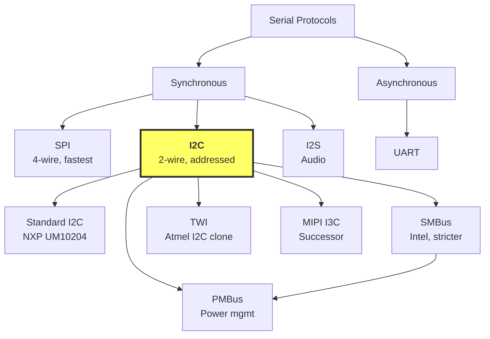
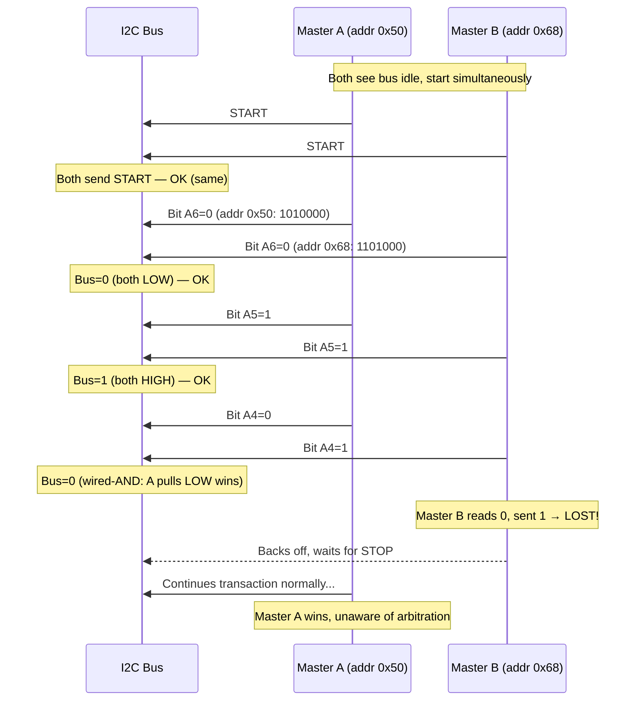
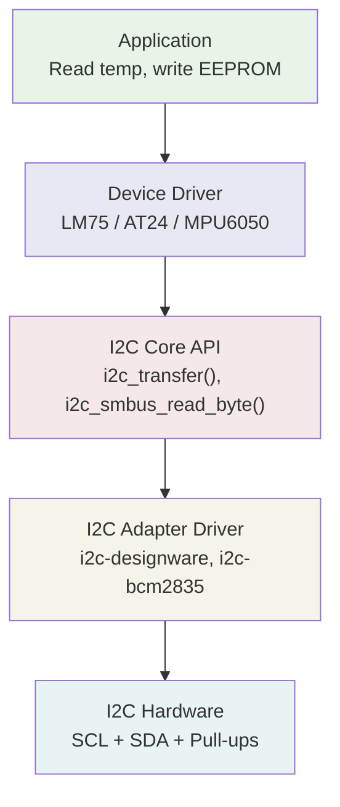
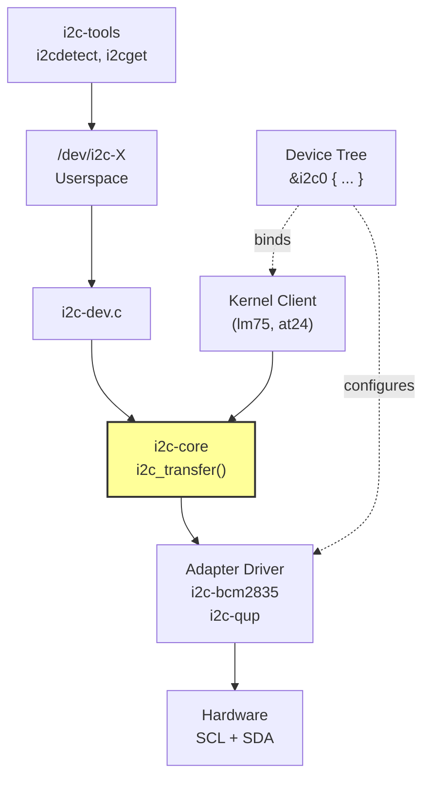
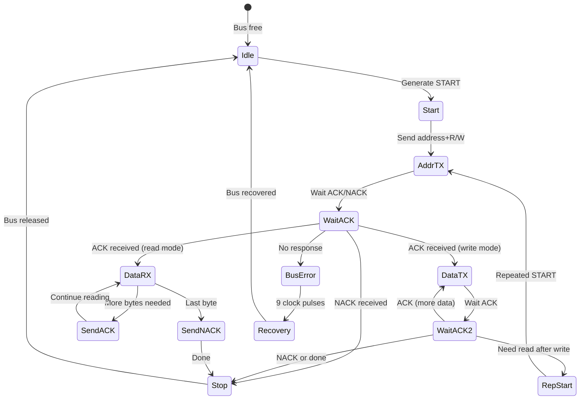
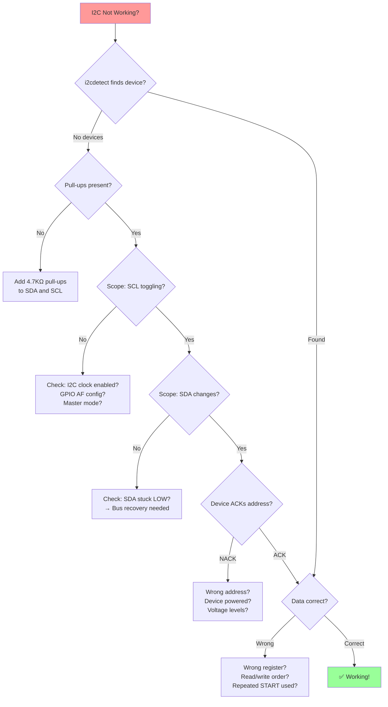

# I2C — DIAGRAMS & VISUAL REFERENCE
# ════════════════════════════════════════════════════════════════════
# Protocol: I2C | Document: 02 of 08 — Mermaid + ASCII Diagrams
# ════════════════════════════════════════════════════════════════════

---

## DIAGRAM 01: I2C Protocol Family Tree



---

## DIAGRAM 02: I2C Bus Topology

```
         VDD                        VDD
          │                          │
         [Rp]                       [Rp]     Rp = Pull-up resistor
          │                          │
SCL ──────┼──────────┬───────────┬───┼──────────
SDA ──────┼──────────┼───────────┼───┼──────────
          │          │           │   │
      ┌───┴───┐  ┌───┴───┐  ┌───┴───┴──┐
      │Master │  │ Slave │  │  Slave   │
      │ (MCU) │  │ 0x48  │  │  0x68    │
      │       │  │(Temp) │  │  (IMU)   │
      └───────┘  └───────┘  └──────────┘
          │          │           │
GND ──────┴──────────┴───────────┴──────────

Only 2 wires (+ GND) for ALL devices!
Each device has a unique 7-bit address.
```

---

## DIAGRAM 03: Open-Drain Electrical Detail

```
          VDD (3.3V)
           │
          [Rp] 4.7KΩ
           │
SDA ───────┼───────────────────────
           │                  │
        ┌──┴──┐           ┌──┴──┐
        │ NMOS│           │ NMOS│
Device A│  ┃  │ Device B  │  ┃  │
  Gate──┤  D  │   Gate────┤  D  │
        │  │  │           │  │  │
        └──┼──┘           └──┼──┘
           │                  │
GND ───────┴──────────────────┴────

Pull LOW: NMOS ON → line = 0V
Release:  NMOS OFF → pull-up → line = VDD
Wired-AND: if ANY device pulls LOW, line is LOW
```

---

## DIAGRAM 04: START and STOP Conditions

```
START (S):                              STOP (P):
  SDA changes HIGH→LOW                   SDA changes LOW→HIGH
  while SCL is HIGH                      while SCL is HIGH

SDA  ‾‾‾‾\________                   SDA  ________/‾‾‾‾
SCL  ‾‾‾‾‾‾\______                   SCL  ______/‾‾‾‾‾‾
          ↑ START                               ↑ STOP


REPEATED START (Sr):
  Like START but without prior STOP

SDA  ____/‾‾\_____                   
SCL  ____/‾‾‾\_____                  
          ↑ Repeated START
```

---

## DIAGRAM 05: Complete Write Transaction

```
     S   A6 A5 A4 A3 A2 A1 A0  W  ACK  R7 R6 R5 R4 R3 R2 R1 R0 ACK  D7 D6 D5 D4 D3 D2 D1 D0 ACK  P
SDA  ‾\__|__|__|__|__|__|__|__0__|__0_|__|__|__|__|__|__|__|__|__0_|__|__|__|__|__|__|__|__|__0_|__/‾
SCL  ‾\_/‾\_/‾\_/‾\_/‾\_/‾\_/‾\_/‾\_/‾\_/‾\_/‾\_/‾\_/‾\_/‾\_/‾\_/‾\_/‾\_/‾\_/‾\_/‾\_/‾\_/‾\_/‾\_/‾‾
      S  |←─── Address + W ───→| ACK |←── Register Addr ──→| ACK |←───── Data ──────→| ACK  P

Byte 1: [7-bit slave address] + [0=Write]  → Slave ACKs
Byte 2: [Register address]                  → Slave ACKs
Byte 3: [Data to write]                     → Slave ACKs
```

---

## DIAGRAM 06: Complete Read Transaction (with Repeated START)

```
WRITE PHASE (set register pointer):
     S   Address+W   ACK   Reg_Addr  ACK
SDA  ‾\_|_A6..A0_0_|_0__|_R7..R0__|_0__|

REPEATED START + READ PHASE:
     Sr  Address+R   ACK   Data_Byte  NACK   P
SDA  ‾\_|_A6..A0_1_|_0__|_D7..D0___|__1__|__/‾
                                      ↑
                              Master NACKs last byte
                              (tells slave to stop)

KEY: No STOP between write and read phases!
     Repeated START keeps bus locked.
```

---

## DIAGRAM 07: Multi-Byte Read

```
     S  Addr+W  ACK  Reg   ACK  Sr  Addr+R  ACK  D0   ACK  D1   ACK  D2  NACK  P
SDA  ‾\_|___|__|_0_|___|__|_0__|_‾\_|___|__|_0_|___|__|_0_|___|__|_0_|___|_1__|__/‾
                                                   ↑         ↑         ↑
                                              Master ACK  Master ACK  Master NACK
                                              (more plz)  (more plz)  (last byte)
```

---

## DIAGRAM 08: ACK vs NACK Detail

```
ACK (Acknowledge):                    NACK (Not Acknowledge):
  Receiver pulls SDA LOW               Receiver leaves SDA HIGH
  during 9th clock pulse                during 9th clock pulse

SDA  _____[__0__]_____               SDA  _____[‾‾1‾‾]_____
SCL  _____/‾‾‾‾‾\_____               SCL  _____/‾‾‾‾‾\_____
           ↑ ACK                               ↑ NACK
    "Got it, send more"               "Problem / last byte"
```

---

## DIAGRAM 09: Arbitration Between Two Masters



---

## DIAGRAM 10: Clock Stretching

```
Normal (no stretch):
SCL (master) ___/‾‾\__/‾‾\__/‾‾\__/‾‾\___
SCL (actual)  ___/‾‾\__/‾‾\__/‾‾\__/‾‾\___  (same)

With clock stretching:
SCL (master) ___/‾‾\__/    \__/‾‾\__/‾‾\___
                      ↑     ↑
                 Master    Slave holds SCL LOW
                 releases  (processing data)
                 SCL       Eventually releases

SCL (actual)  ___/‾‾\__/‾‾‾‾‾‾‾‾‾\__/‾‾\__  (stretched!)

Master MUST check if SCL actually went HIGH.
If slave never releases → BUS STUCK!
```

---

## DIAGRAM 11: I2C Address Byte Format

```
7-Bit Addressing:
┌────┬────┬────┬────┬────┬────┬────┬────┐
│ A6 │ A5 │ A4 │ A3 │ A2 │ A1 │ A0 │R/W̄│
└────┴────┴────┴────┴────┴────┴────┴────┘
│←────── 7-bit address ───────→│  │
                                 0=Write
                                 1=Read

Example: Device 0x68, Write → send 0xD0 (1101000 0)
Example: Device 0x68, Read  → send 0xD1 (1101000 1)

10-Bit Addressing:
Byte 1: ┌──┬──┬──┬──┬──┬────┬────┬────┐
         │ 1│ 1│ 1│ 1│ 0│ A9 │ A8 │R/W̄│
         └──┴──┴──┴──┴──┴────┴────┴────┘
Byte 2: ┌────┬────┬────┬────┬────┬────┬────┬────┐
         │ A7 │ A6 │ A5 │ A4 │ A3 │ A2 │ A1 │ A0 │
         └────┴────┴────┴────┴────┴────┴────┴────┘
```

---

## DIAGRAM 12: Pull-Up Resistor Selection Guide

```
           Too HIGH Rp                   Too LOW Rp
           (10KΩ at Fast mode)           (470Ω)

SDA     ___/‾‾‾‾‾‾‾‾‾\___            ___/‾\___ 
           ↑ slow rise                    ↑ fast but high current
           t_rise > 300ns               I_sink > I_OL spec
           → FAILS at 400kHz           → Device can't pull LOW
                                        → Excessive power

          OPTIMAL Rp (2.2KΩ-4.7KΩ)
SDA     ___/‾‾\___
           ↑ clean rise
           t_rise ≤ 300ns
           I_sink within spec
           → WORKS!

Formula: Rp = t_rise / (0.8473 × C_bus)
```

---

## DIAGRAM 13: I2C Software Stack



---

## DIAGRAM 14: Linux I2C Architecture



---

## DIAGRAM 15: I2C State Machine



---

## DIAGRAM 16: I2C Multiplexer (PCA9548A)

```
                     ┌───────────────┐
         SCL ───────→│               │──→ CH0_SCL ── [Sensor A: 0x68]
         SDA ←──────→│   PCA9548A    │──→ CH0_SDA
                     │   (0x70)      │
                     │               │──→ CH1_SCL ── [Sensor B: 0x68] ← Same address!
                     │  8-ch I2C Mux │──→ CH1_SDA       (no conflict)
                     │               │
                     │               │──→ CH2_SCL ── [EEPROM: 0x50]
                     │               │──→ CH2_SDA
                     └───────────────┘

Control register: Write to 0x70
  0x01 = select CH0 only
  0x02 = select CH1 only
  0x05 = select CH0 + CH2 simultaneously
```

---

## DIAGRAM 17: Bus Stuck Recovery (9-Clock Method)

```
STUCK STATE:
SCL  ‾‾‾‾‾‾‾‾‾‾‾‾‾‾‾‾   (master released)
SDA  _________________   (slave holding LOW — STUCK!)

RECOVERY:
SCL  _/‾\_/‾\_/‾\_/‾\_/‾\_/‾\_/‾\_/‾\_/‾\_    (9 clocks)
SDA  ___________________________/‾‾‾‾‾‾‾‾‾     (slave releases!)
                                ↑
                        Slave finishes its byte,
                        releases SDA on one of
                        the 9 clock pulses

THEN STOP:
SCL  _______________/‾‾‾‾‾
SDA  __________/‾‾‾‾‾‾‾‾‾   ← STOP condition
               ↑
         Bus recovered!
```

---

## DIAGRAM 18: Level Shifting (MOSFET Method)

```
     3.3V Side                    5V Side
        │                           │
       [4.7K]                     [4.7K]
        │        BSS138 MOSFET      │
  SDA_LV├─────── Source ─── Drain──┤SDA_HV
        │          │                │
        │        Gate               │
        │          │                │
        │         3.3V              │
        │                           │
  Bidirectional level shift:
  • 3.3V side pulls LOW → MOSFET conducts → 5V side pulled LOW
  • 5V side pulls LOW → body diode → 3.3V side pulled LOW  
  • Both release → pull-ups bring each side to its VDD
```

---

## DIAGRAM 19: Debugging Decision Tree



---

## DIAGRAM 20: I2C in Automotive System

```
┌──────────────────────────────────────────────────────────┐
│                  AUTOMOTIVE HEAD UNIT                     │
│                                                          │
│  ┌──────────┐                                            │
│  │  SA8155P  │──I2C0──→ [PMIC: 0x25] (Power Mgmt)      │
│  │  SoC      │                                           │
│  │          │──I2C1──→ [Touch: 0x5D] (GT911)            │
│  │          │                                            │
│  │          │──I2C2──┬→ [Temp: 0x48] (TMP112)           │
│  │          │        ├→ [EEPROM: 0x50] (AT24C256)       │
│  │          │        └→ [IO Exp: 0x20] (PCA9555)        │
│  │          │                                            │
│  │          │──I2C3──→ [Audio: 0x2C] (TAS5805M)         │
│  │          │                                            │
│  │          │──I2C4──→ [Mux: 0x70]──CH0→ [Sensor: 0x68]│
│  │          │                       CH1→ [Sensor: 0x68] │
│  └──────────┘                       (same addr, diff ch)│
└──────────────────────────────────────────────────────────┘
```

---

END OF DOCUMENT 02 — DIAGRAMS
