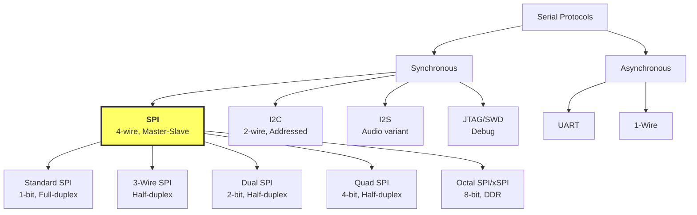
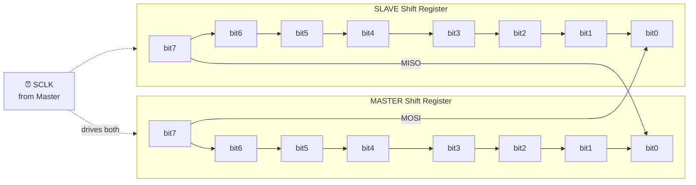
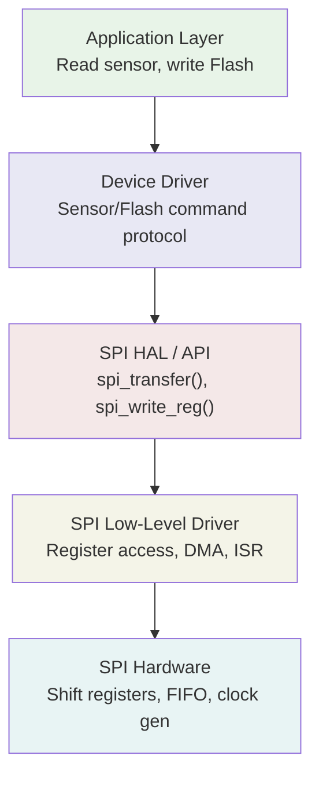
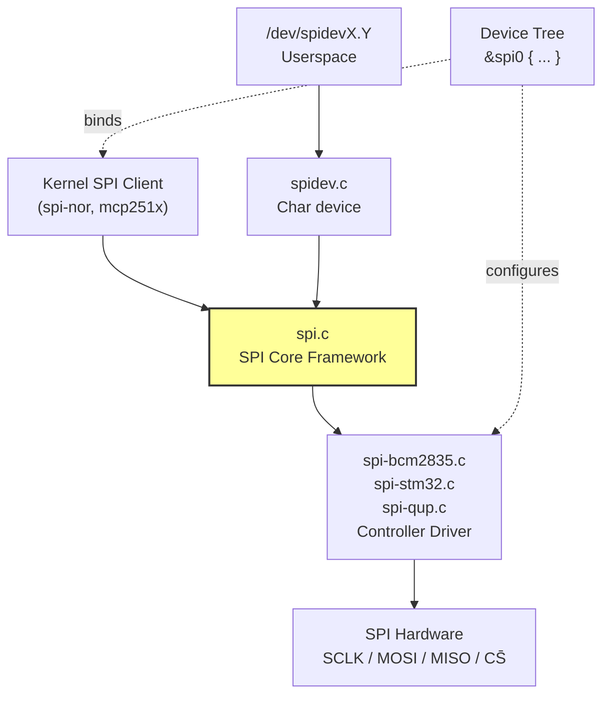
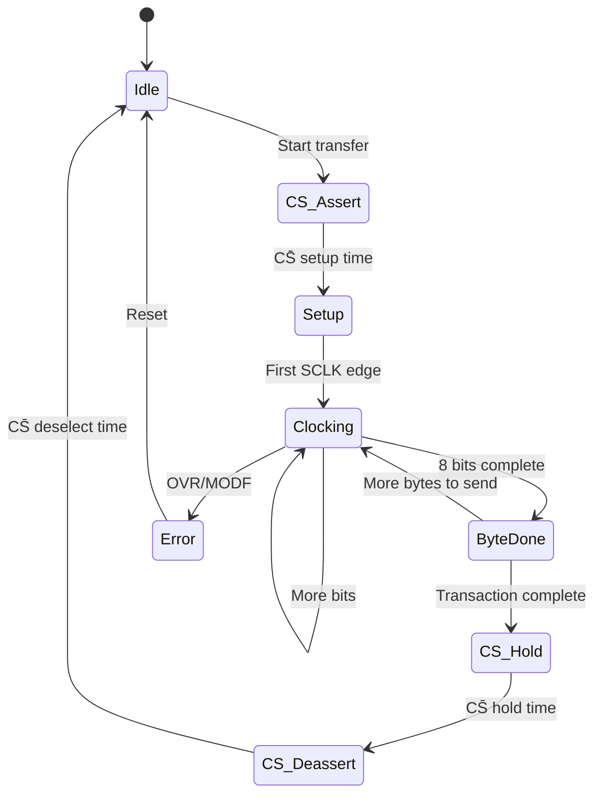
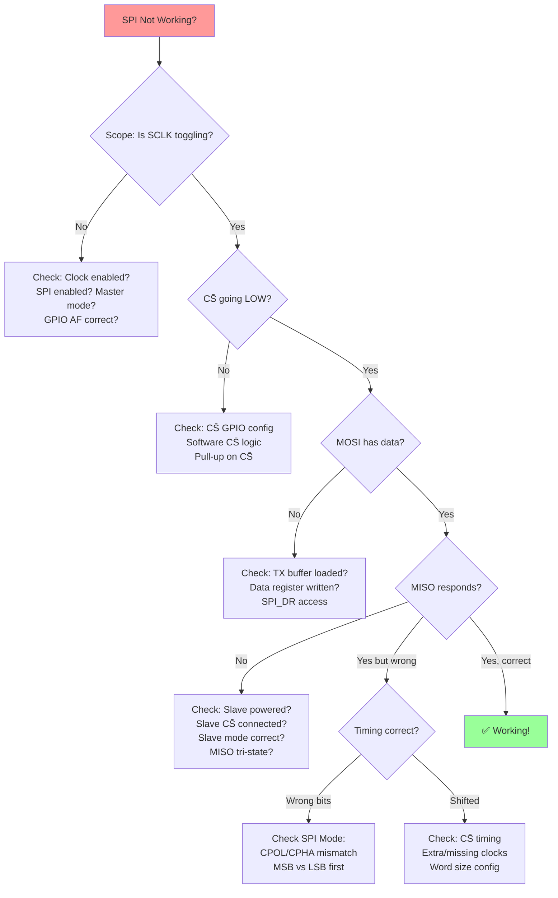

# SPI — DIAGRAMS & VISUAL REFERENCE
# ════════════════════════════════════════════════════════════════════
# Protocol: SPI | Document: 02 of 08 — Mermaid + ASCII Diagrams
# ════════════════════════════════════════════════════════════════════

---

## DIAGRAM 01: SPI Protocol Family Tree



---

## DIAGRAM 02: Basic SPI Topology — Single Slave

```
                  MASTER                          SLAVE
              ┌────────────┐                  ┌────────────┐
              │            │ ──── SCLK ─────→ │            │
              │   MCU /    │ ──── MOSI ─────→ │   Flash /  │
              │   SoC      │ ←─── MISO ────── │   Sensor   │
              │            │ ──── CS̄  ─────→ │            │
              └────────────┘                  └────────────┘
                    │                               │
                   GND ─────────────────────────── GND
```

---

## DIAGRAM 03: Multi-Slave SPI Bus (Independent CS̄)

```
                    MASTER
              ┌──────────────┐
              │  SCLK ───────┼──────────┬──────────┬──────────→
              │  MOSI ───────┼──────────┼──────────┼──────────→
              │  MISO ←──────┼──────────┼──────────┼──────────
              │              │          │          │
              │  CS̄0 ───────┼────→ ┌───┴──┐      │
              │  CS̄1 ───────┼──────┼→┌────┴─┐    │
              │  CS̄2 ───────┼──────┼─┼→┌────┴─┐  │
              └──────────────┘      │ │ │      │  │
                                ┌───┴─┴─┴──┐   │  │
                                │ Slave 0  │   │  │
                                │ (Flash)  │   │  │
                                └──────────┘   │  │
                                ┌──────────┐   │  │
                                │ Slave 1  │───┘  │
                                │ (ADC)    │      │
                                └──────────┘      │
                                ┌──────────┐      │
                                │ Slave 2  │──────┘
                                │ (Sensor) │
                                └──────────┘

Rule: Only ONE CS̄ LOW at a time!
```

---

## DIAGRAM 04: Daisy-Chain Topology

```
    MASTER              SLAVE 1            SLAVE 2            SLAVE 3
  ┌────────┐          ┌────────┐         ┌────────┐         ┌────────┐
  │   MOSI ├─────────→│ DIN    │    ┌───→│ DIN    │    ┌───→│ DIN    │
  │        │          │   DOUT ├────┘    │   DOUT ├────┘    │   DOUT ├──→ MISO
  │   SCLK ├────┬────→│ SCLK   │   ┌───→│ SCLK   │   ┌───→│ SCLK   │    (Master)
  │        │    │     │        │   │    │        │   │    │        │
  │   CS̄  ├────┼──┬─→│ CS̄    │   │ ┌─→│ CS̄    │   │ ┌─→│ CS̄    │
  └────────┘    │  │  └────────┘   │ │  └────────┘   │ │  └────────┘
                └──┼───────────────┘ │                │ │
                   └─────────────────┼────────────────┘ │
                                     └──────────────────┘

Data flows: Master → Slave1 → Slave2 → Slave3 → Master
Single CS̄ shared. To update all: send 3×N bits.
```

---

## DIAGRAM 05: Circular Shift Register (Core Concept)



```
After 8 clock cycles:
  - Master's original byte is now in Slave
  - Slave's original byte is now in Master
  - SIMULTANEOUS EXCHANGE — always!
```

---

## DIAGRAM 06: Mode 0 Timing (CPOL=0, CPHA=0)

```
CS̄    ‾‾‾‾\________________________________________/‾‾‾‾
            ↓ setup                            hold ↑

SCLK  _____/‾\_/‾\_/‾\_/‾\_/‾\_/‾\_/‾\_/‾\_________
           ↑   ↑   ↑   ↑   ↑   ↑   ↑   ↑
           SAMPLE on RISING edge (1st edge)

MOSI  ─────<D7 ><D6 ><D5 ><D4 ><D3 ><D2 ><D1 ><D0 >────
           ╱    ╱    ╱    ╱    ╱    ╱    ╱    ╱
      Data changes on FALLING edge (2nd edge)

MISO  ─────<D7 ><D6 ><D5 ><D4 ><D3 ><D2 ><D1 ><D0 >────

IDLE STATE: SCLK = LOW
```

---

## DIAGRAM 07: Mode 1 Timing (CPOL=0, CPHA=1)

```
CS̄    ‾‾‾‾\________________________________________/‾‾‾‾

SCLK  _____/‾\_/‾\_/‾\_/‾\_/‾\_/‾\_/‾\_/‾\_________
              ↑   ↑   ↑   ↑   ↑   ↑   ↑   ↑
              SAMPLE on FALLING edge (2nd edge)

MOSI  ──────<D7 ><D6 ><D5 ><D4 ><D3 ><D2 ><D1 ><D0 >───
            ╱    ╱    ╱    ╱    ╱    ╱    ╱    ╱
       Data changes on RISING edge (1st edge)

IDLE STATE: SCLK = LOW
```

---

## DIAGRAM 08: Mode 2 Timing (CPOL=1, CPHA=0)

```
CS̄    ‾‾‾‾\________________________________________/‾‾‾‾

SCLK  ‾‾‾‾‾\_/‾\_/‾\_/‾\_/‾\_/‾\_/‾\_/‾\‾‾‾‾‾‾‾‾‾
           ↑   ↑   ↑   ↑   ↑   ↑   ↑   ↑
           SAMPLE on FALLING edge (1st edge)

MOSI  ─────<D7 ><D6 ><D5 ><D4 ><D3 ><D2 ><D1 ><D0 >────

IDLE STATE: SCLK = HIGH
```

---

## DIAGRAM 09: Mode 3 Timing (CPOL=1, CPHA=1)

```
CS̄    ‾‾‾‾\________________________________________/‾‾‾‾

SCLK  ‾‾‾‾‾\_/‾\_/‾\_/‾\_/‾\_/‾\_/‾\_/‾\‾‾‾‾‾‾‾‾‾
              ↑   ↑   ↑   ↑   ↑   ↑   ↑   ↑
              SAMPLE on RISING edge (2nd edge)

MOSI  ──────<D7 ><D6 ><D5 ><D4 ><D3 ><D2 ><D1 ><D0 >───

IDLE STATE: SCLK = HIGH
```

---

## DIAGRAM 10: All 4 Modes Comparison

```
           Mode 0 (CPOL=0,CPHA=0)     Mode 1 (CPOL=0,CPHA=1)
SCLK idle: LOW                         LOW
Sample:    1st edge (↑ rising)         2nd edge (↓ falling)

           Mode 2 (CPOL=1,CPHA=0)     Mode 3 (CPOL=1,CPHA=1)
SCLK idle: HIGH                        HIGH
Sample:    1st edge (↓ falling)        2nd edge (↑ rising)

Key Pattern:
  CPHA=0 → sample on FIRST edge after idle
  CPHA=1 → sample on SECOND edge after idle
  CPOL=0 → idle LOW  → 1st edge is RISING
  CPOL=1 → idle HIGH → 1st edge is FALLING
```

---

## DIAGRAM 11: SPI Flash Read Command Sequence

```
CS̄  ‾‾\_________________________________________________________________/‾‾

MOSI    [  0x03  ][  A23-A16 ][  A15-A8  ][  A7-A0   ][ 0xFF  ][ 0xFF  ]
        ↑ Command  ↑ Address byte 2  ↑ Addr 1  ↑ Addr 0  ↑ Dummy  ↑ Dummy
        (Read)                                              (clock out data)

MISO    [  xxxx  ][   xxxx   ][   xxxx   ][   xxxx   ][ DATA0 ][ DATA1 ]
        ↑ ignored                                       ↑ actual data!
        (slave processing command + address)

Clocks: |── 8 ──|─── 8 ───|─── 8 ───|─── 8 ───|── 8 ──|── 8 ──| ...
Total:     4 bytes command + address, then continuous data read
```

---

## DIAGRAM 12: QSPI Read (1-1-4 Mode)

```
Phase:  │ Command │  Address  │ Dummy │     Data (Quad)      │
Lines:  │ 1-line  │  1-line   │ 4-line│     4-line           │
        │         │           │       │                      │

IO0 ────[ CMD bit ][ A23..A0 ][ ─── ][ D4  D0  D4  D0  ... ]
IO1 ──── idle ──── idle ──────[ ─── ][ D5  D1  D5  D1  ... ]
IO2 ──── idle ──── idle ──────[ ─── ][ D6  D2  D6  D2  ... ]
IO3 ──── idle ──── idle ──────[ ─── ][ D7  D3  D7  D3  ... ]
SCLK ───┤├┤├┤├┤├──┤├┤├┤├┤├┤├─┤├┤├┤├─┤├┤├┤├┤├┤├┤├┤├┤├── ...

1-1-4 = Command on 1 line, Address on 1 line, Data on 4 lines
Also common: 1-1-1, 1-4-4, 4-4-4
```

---

## DIAGRAM 13: SPI Software Stack (Embedded)



---

## DIAGRAM 14: Linux SPI Architecture



---

## DIAGRAM 15: SPI Transaction State Machine



---

## DIAGRAM 16: DMA-Based SPI Transfer

```
         CPU                    DMA Controller              SPI Peripheral
    ┌──────────┐            ┌─────────────────┐          ┌──────────────┐
    │ Setup:   │            │                 │          │              │
    │ 1.Config │───────────→│ TX Channel:     │──data──→ │ TX FIFO      │
    │   DMA    │            │ RAM→SPI_DR      │          │   ↓          │
    │ 2.Start  │            │                 │          │ TX Shift Reg │→MOSI
    │ 3.Wait   │            │ RX Channel:     │←─data──  │              │
    │   for    │←──IRQ──────│ SPI_DR→RAM      │          │ RX Shift Reg │←MISO
    │   done   │            │                 │          │   ↓          │
    └──────────┘            └─────────────────┘          │ RX FIFO      │
                                                         └──────────────┘
    CPU is FREE during transfer!                              ↕ SCLK
```

---

## DIAGRAM 17: CS̄ Timing Detail

```
CS̄    ‾‾‾‾‾‾\_______________________________________________/‾‾‾‾‾‾
             │←t_CSS→│                              │←t_CSH→│
                     │                              │
SCLK  _______________/‾\_/‾\_/‾\_ ... _/‾\_/‾\_/‾\__________
                     ↑ first clock               ↑ last clock

CS̄ (next)  ‾‾‾‾‾‾‾‾‾‾‾‾‾‾‾‾‾‾‾‾‾‾‾‾‾‾‾‾‾‾‾‾‾‾‾‾‾‾‾‾‾‾‾‾‾‾\____
                                                    │←─t_CSD─→│

t_CSS = CS̄ setup time (before first SCLK)
t_CSH = CS̄ hold time (after last SCLK)
t_CSD = CS̄ deselect time (between transactions)
```

---

## DIAGRAM 18: Signal Integrity at High Speed

```
IDEAL Signal:              REAL Signal at 50 MHz:
    ┌──────┐                   ╱‾‾‾‾‾╲
    │      │              ╱───╱       ╲───╲
────┘      └────      ───╱  overshoot   ringing ╲───
                          └── rise ──┘└─ settle ─┘

Problems at high speed:
┌─────────────────────────────────────────────────────┐
│ 1. Slow rise/fall time → reduced voltage margin     │
│ 2. Ringing → false clock edges                      │
│ 3. Crosstalk → adjacent trace coupling              │
│ 4. Clock-data skew → setup/hold violations          │
│ 5. Reflections → impedance mismatch                 │
└─────────────────────────────────────────────────────┘

Fixes:
  • Series termination: 22-33Ω on SCLK, MOSI
  • Ground plane under all traces
  • Match trace lengths (SCLK ≤ data traces)
  • Reduce speed if possible
```

---

## DIAGRAM 19: Debugging Decision Tree



---

## DIAGRAM 20: SPI in Automotive System

```
┌─────────────────────────────────────────────────────────────┐
│                    AUTOMOTIVE HEAD UNIT                       │
│                                                              │
│  ┌──────────┐    SPI (QSPI)    ┌────────────┐              │
│  │  SA8155P  │←───────────────→│  NOR Flash  │              │
│  │  SoC      │    50-100 MHz   │  (Boot)     │              │
│  │          │                  └────────────┘              │
│  │          │    SPI            ┌────────────┐              │
│  │          │←───────────────→│  Touch      │              │
│  │          │    10 MHz        │  Controller │              │
│  │          │                  └────────────┘              │
│  │          │    SPI            ┌────────────┐              │
│  │          │←───────────────→│  Sensor Hub │              │
│  │          │    20 MHz        │  (IMU+Pres) │              │
│  └──────────┘                  └────────────┘              │
│                                                              │
│  ┌──────────┐    SPI            ┌────────────┐              │
│  │  MCU     │←───────────────→│  CAN Ctrl   │              │
│  │ (Safety) │    10 MHz        │  MCP2515    │              │
│  └──────────┘                  └────────────┘              │
└─────────────────────────────────────────────────────────────┘
```

---

END OF DOCUMENT 02 — DIAGRAMS
