# UART — COMPLETE DIAGRAMS & VISUAL REFERENCE
# ════════════════════════════════════════════════════════════════════
# Protocol: UART | Document: 02 of 08 — Diagrams
# All diagrams in Mermaid or ASCII art for rendering in Markdown viewers
# ════════════════════════════════════════════════════════════════════

---

## DIAGRAM 01 — Protocol Family Tree

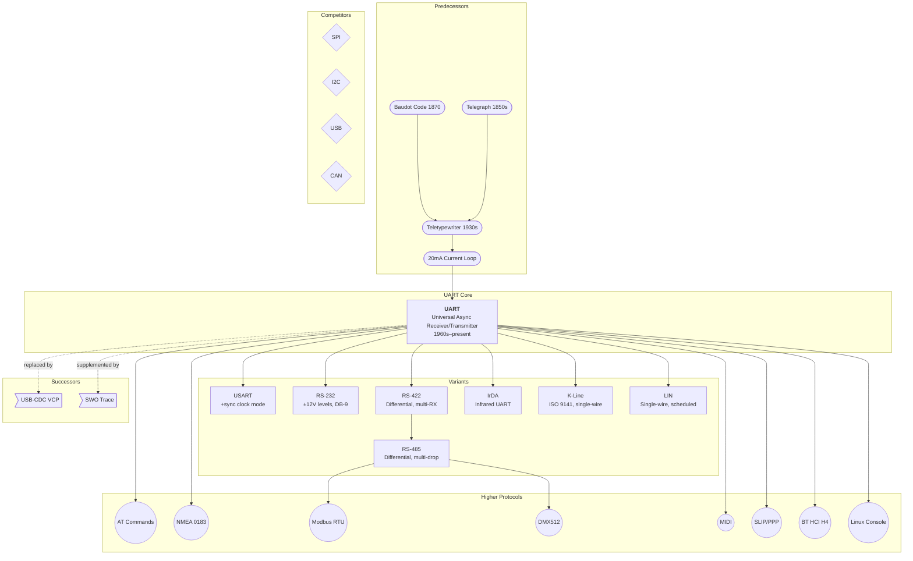

---

## DIAGRAM 02 — OSI Layer Mapping

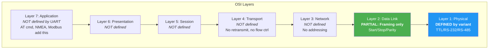

---

## DIAGRAM 03 — Physical Layer Topology

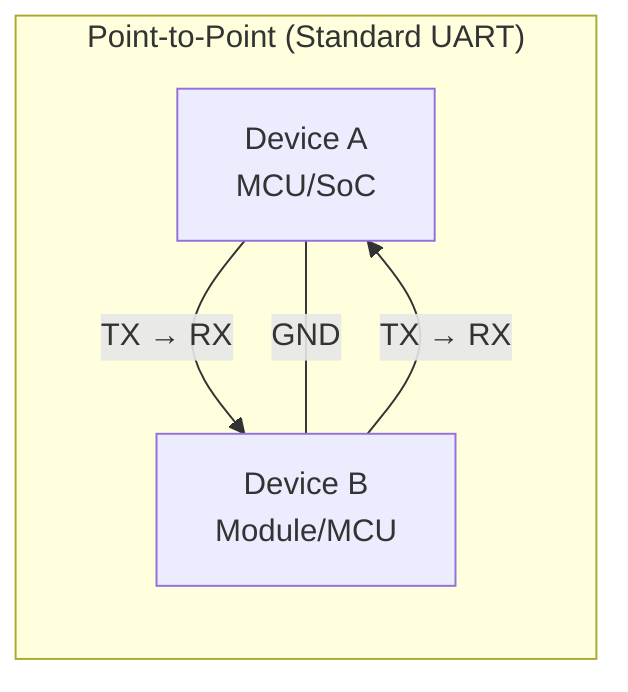

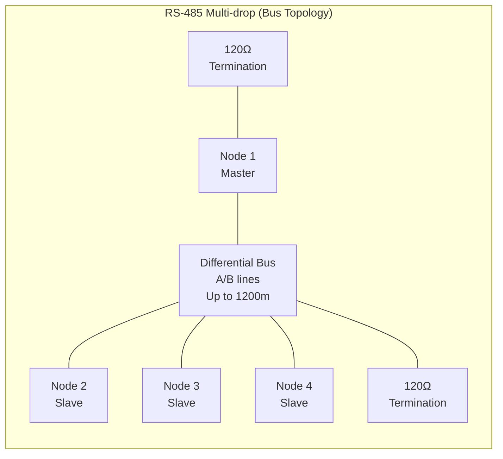

---

## DIAGRAM 04 — UART Frame Structure (All Configurations)

### Standard Frame: 8N1 (Most Common)

```
 ┌──────────────────────────────────────────────────────────────────────────┐
 │  IDLE │START│ D0  │ D1  │ D2  │ D3  │ D4  │ D5  │ D6  │ D7  │STOP│IDLE│
 │(HIGH) │ 0  │ LSB │     │     │     │     │     │     │ MSB │ 1  │(HI)│
 ├───────┼─────┼─────┼─────┼─────┼─────┼─────┼─────┼─────┼─────┼────┼────┤
 │  1    │  0  │  x  │  x  │  x  │  x  │  x  │  x  │  x  │  x  │ 1  │ 1  │
 └──────────────────────────────────────────────────────────────────────────┘
        │← 1 →│←──────────── 8 bits data ─────────────→│← 1 →│
        │ bit │                                          │ bit │
        Total: 10 bits per character
```

### Frame with Even Parity: 8E1

```
 ┌───────────────────────────────────────────────────────────────────────────────┐
 │ IDLE │START│ D0  │ D1  │ D2  │ D3  │ D4  │ D5  │ D6  │ D7  │ PAR │STOP│IDLE│
 │(HIGH)│  0  │ LSB │     │     │     │     │     │     │ MSB │EVEN │ 1  │(HI)│
 └───────────────────────────────────────────────────────────────────────────────┘
        │← 1 →│←──────────── 8 bits data ─────────────→│← 1 →│← 1 →│
        Total: 11 bits per character
```

### Frame with 2 Stop Bits: 8N2

```
 ┌────────────────────────────────────────────────────────────────────────────────┐
 │ IDLE │START│ D0  │ D1  │ D2  │ D3  │ D4  │ D5  │ D6  │ D7  │STOP1│STOP2│IDLE│
 │(HIGH)│  0  │ LSB │     │     │     │     │     │     │ MSB │  1  │  1  │(HI)│
 └────────────────────────────────────────────────────────────────────────────────┘
        │← 1 →│←──────────── 8 bits data ─────────────→│←── 2 bits ──→│
        Total: 11 bits per character
```

### 9-bit Mode (Multi-processor): 9N1

```
 ┌───────────────────────────────────────────────────────────────────────────────────┐
 │ IDLE │START│ D0  │ D1  │ D2  │ D3  │ D4  │ D5  │ D6  │ D7  │ D8  │STOP│ IDLE  │
 │(HIGH)│  0  │ LSB │     │     │     │     │     │     │     │ADDR/│ 1  │ (HI)  │
 │      │     │     │     │     │     │     │     │     │     │DATA │    │       │
 └───────────────────────────────────────────────────────────────────────────────────┘
        │← 1 →│←──────────────── 9 bits data ──────────────────→│← 1 →│
        D8=1: Address frame (all slaves wake up)
        D8=0: Data frame (only addressed slave listens)
```

---

## DIAGRAM 05 — Bit-Level Timing Diagram

### Transmitting ASCII 'U' (0x55 = 01010101) at 115200 baud, 8N1

```
Voltage
(TTL 3.3V)
    │
3.3V├─ ─ ─┐     ┌──┐  ┌──┐  ┌──┐  ┌──┐  ┌─────────
    │  IDLE│     │  │  │  │  │  │  │  │  │  STOP+IDLE
    │      │     │  │  │  │  │  │  │  │  │
    │      │     │  │  │  │  │  │  │  │  │
 0V ├──────┴─────┘  └──┘  └──┘  └──┘  └──┘
    │ START  D0   D1   D2   D3   D4   D5   D6   D7  STOP
    │   0    1    0    1    0    1    0    1    0    1
    │
    │←8.68→│
    │  µs  │  (1 bit period at 115200 baud)
    │      │
    ├──────┼──────┼──────┼──────┼──────┼──────┼──────┼──────┼──────┼──────┤
    0    8.68  17.36  26.04  34.72  43.40  52.08  60.76  69.44  78.13  86.81 µs
    
    Total frame time: 86.81 µs (10 bits × 8.68 µs/bit)
    
    Note: 'U' (0x55) creates a nice alternating pattern — 
    this is why 'U' is used for auto-baud detection!
```

### 16× Oversampling Detail (Receiver Perspective)

```
TX Signal:
    ‾‾‾‾‾‾\_________/‾‾‾‾‾‾‾‾‾\_________/‾‾‾‾‾‾‾‾‾
           |← START →|←── D0 ──→|←── D1 ──→|

RX Sampling (16× clock):
    ||||||||||||||||||||||||||||||||||||||||||||||||||||
    ^               ^               ^               ^
    │               │               │               │
    Falling edge    Sample point    Sample point    Sample point
    detected!       (sample 8/16)   (sample 24/32)  (sample 40/48)
    Start counter   → START = 0 ✓   → D0 value      → D1 value

    Sample positions:  1  2  3  4  5  6  7 [8] 9 10 11 12 13 14 15 16
                                            ↑
                                      Middle sample used
                                      (±3 sample tolerance)
```

---

## DIAGRAM 06 — Hardware Block Diagram

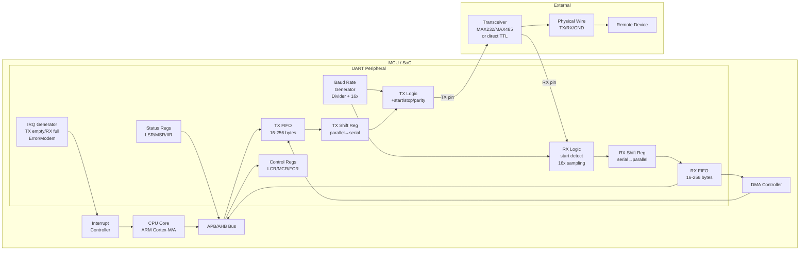

---

## DIAGRAM 07 — Complete Software Stack

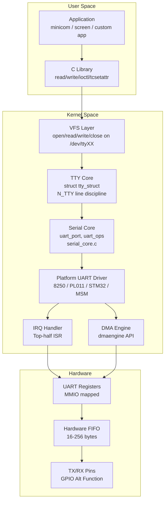

---

## DIAGRAM 08 — Initialization Sequence

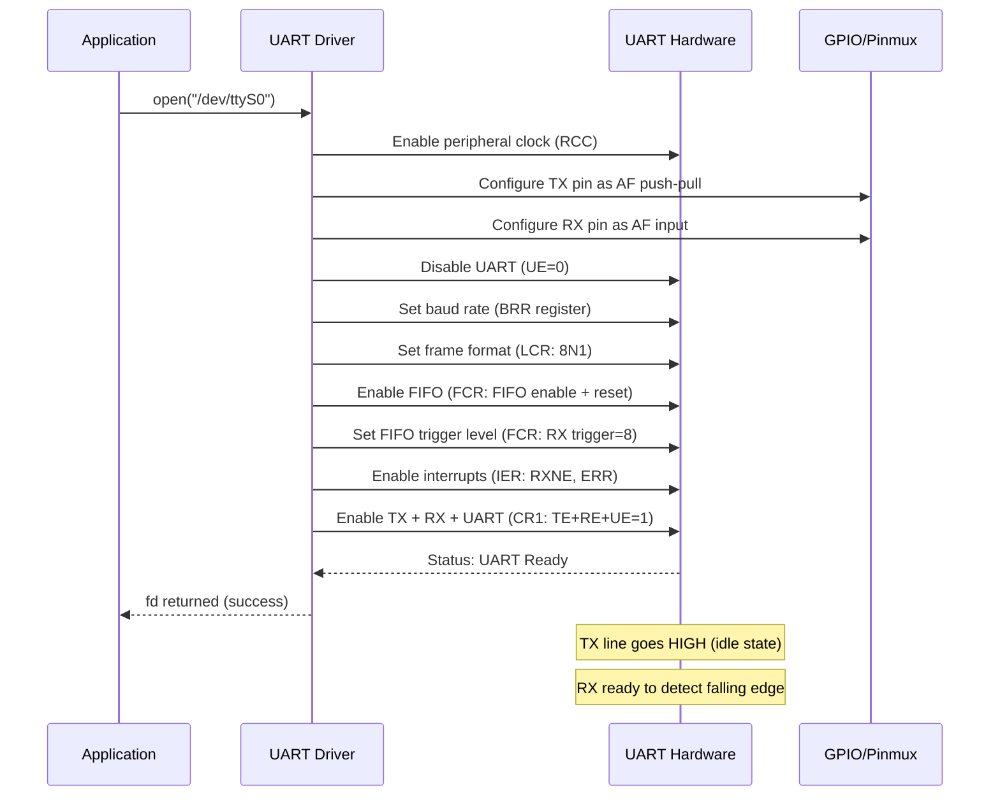

---

## DIAGRAM 09 — Data Transmission Sequence

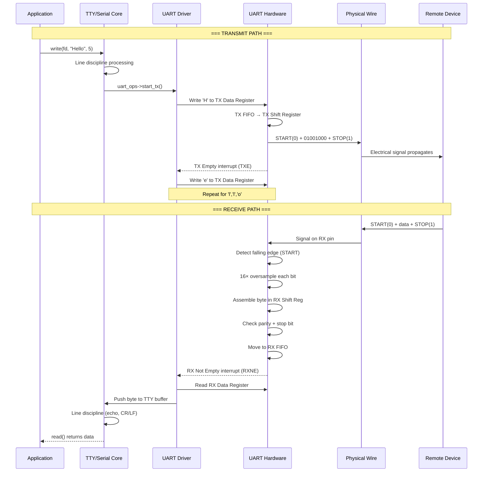

---

## DIAGRAM 10 — Error State Handling

```mermaid
stateDiagram-v2
    [*] --> Idle: Power on / UART enabled

    Idle --> Receiving: Falling edge on RX (Start bit)
    Receiving --> ByteReady: All bits sampled + stop bit OK
    Receiving --> FramingError: Stop bit = 0 (expected 1)
    Receiving --> ParityError: Parity mismatch
    Receiving --> NoiseError: Sample voting disagrees
    
    ByteReady --> FIFOStore: FIFO not full
    ByteReady --> OverrunError: FIFO full, byte lost
    
    FIFOStore --> Idle: Byte stored, wait next
    
    FramingError --> ErrorFlag: Set FE bit in LSR
    ParityError --> ErrorFlag: Set PE bit in LSR
    NoiseError --> ErrorFlag: Set NE bit in LSR
    OverrunError --> ErrorFlag: Set OE bit in LSR
    
    ErrorFlag --> IRQ: If error IRQ enabled
    IRQ --> ISR: CPU reads LSR, handles error
    ISR --> Idle: Error cleared, resume

    Idle --> BreakDetected: RX LOW > 1 frame time
    BreakDetected --> ErrorFlag: Set BI bit in LSR

    note right of FramingError: Most common cause:\nBaud rate mismatch
    note right of OverrunError: Most critical:\nData permanently lost
```

---

## DIAGRAM 11 — DMA Data Flow

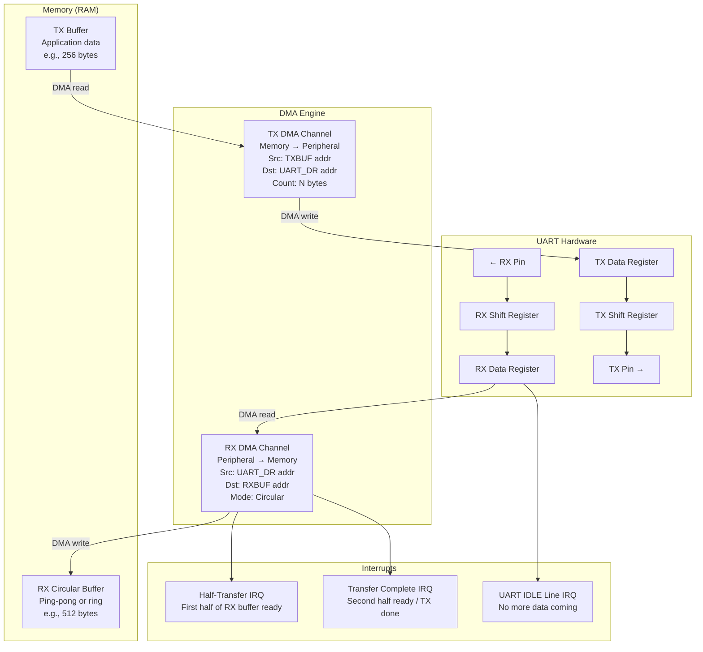

---

## DIAGRAM 12 — Linux Kernel Driver Architecture (8250)

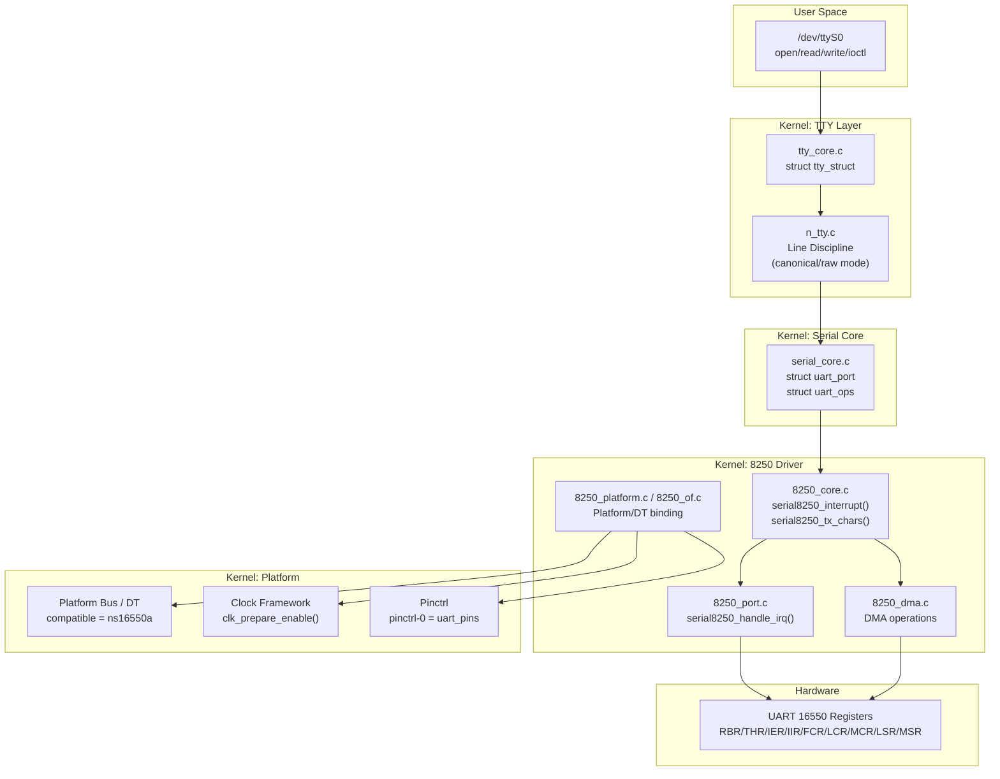

---

## DIAGRAM 13 — Voltage Level Comparison

```
    RS-232 Levels              TTL Levels (3.3V)         RS-485 Differential
    
+15V ┤                    3.3V ┤ ─ ─ ─ HIGH ─ ─     +5V ┤
     │   ┌──── SPACE (0)       │ ████████████████         │   A > B → Logic 1
+3V  ┤───┘                     │                          │   ┌─── A line
     │                    1.65V ┤ · · · threshold         │───┘
     │   UNDEFINED              │                     2.5V ┤       (common mode)
-3V  ┤───┐                  0V ┤ ════ LOW ════════        │───┐
     │   └──── MARK (1)        │                          │   └─── B line
     │                          │                          │   B > A → Logic 0
-15V ┤                          │                      0V  ┤

     Logic 1 = NEGATIVE!        Logic 1 = HIGH             Logic 1 = A > B (≥200mV)
     Logic 0 = POSITIVE!        Logic 0 = LOW              Logic 0 = B > A (≥200mV)
     (INVERTED from TTL)        (Standard)                 (Differential — noise immune)
```

---

## DIAGRAM 14 — Auto-Baud Detection

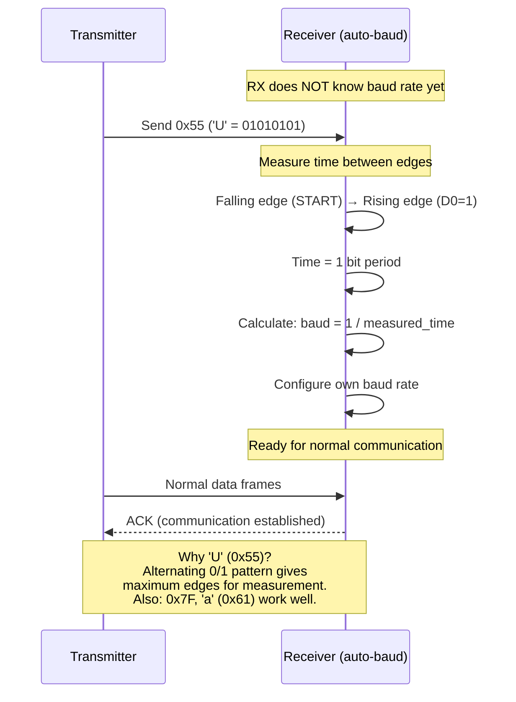

---

## DIAGRAM 15 — Flow Control (RTS/CTS) Sequence

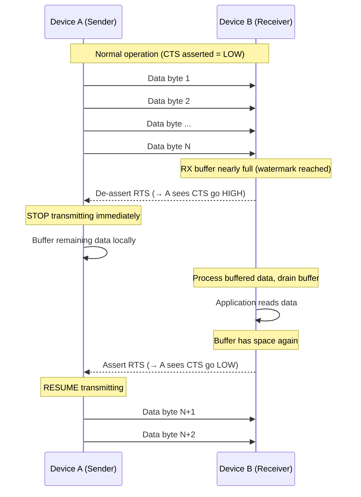

---

## DIAGRAM 16 — Real System Integration Example

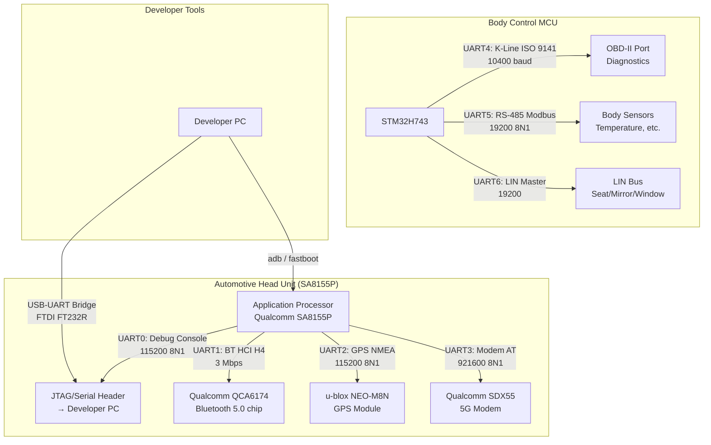

---

## DIAGRAM 17 — Debugging Decision Tree

```mermaid
flowchart TD
    START[Problem: UART not working] --> Q1{Any signal on<br/>TX pin? (scope)}
    
    Q1 -->|No signal| CHK1[Check: Clock enabled?<br/>Pin configured as AF?<br/>UART enabled?<br/>TX enable bit set?]
    Q1 -->|Signal present| Q2{Signal looks<br/>correct on scope?}
    
    Q2 -->|Garbled/wrong timing| CHK2[Baud rate wrong!<br/>Check: BRR value<br/>Clock frequency<br/>Prescaler setting]
    Q2 -->|Looks good| Q3{Remote receiving?}
    
    Q3 -->|No| Q4{TX/RX crossed?}
    Q4 -->|Check wiring| CHK3[TX→RX, RX→TX<br/>Common GND connected?<br/>Voltage level match?<br/>3.3V vs 5V vs RS-232?]
    
    Q3 -->|Partial/garbled| Q5{Framing errors<br/>on receiver?}
    Q5 -->|Yes| CHK4[Config mismatch!<br/>Check: data bits (7/8)<br/>parity (N/E/O)<br/>stop bits (1/2)<br/>BOTH sides must match]
    
    Q5 -->|No framing err<br/>but data wrong| Q6{Overrun errors?}
    Q6 -->|Yes| CHK5[RX too slow!<br/>Fix: Enable FIFO<br/>Use DMA<br/>Raise ISR priority<br/>Reduce baud rate]
    Q6 -->|No| CHK6[Check: byte order<br/>Endianness<br/>Character encoding<br/>Line ending CR/LF]

    Q3 -->|Works but<br/>intermittent| Q7{Temperature<br/>dependent?}
    Q7 -->|Yes| CHK7[Clock source!<br/>RC oscillator drifts.<br/>Use crystal/TCXO]
    Q7 -->|No| CHK8[EMI / noise!<br/>Check: cable shielding<br/>ground loop<br/>nearby switching noise]
```

---

## DIAGRAM 18 — FIFO Operation & Watermarks

```
TX FIFO (16 bytes):                    RX FIFO (16 bytes):
┌──┬──┬──┬──┬──┬──┬──┬──┬──┬──┬──┬──┬──┬──┬──┬──┐
│  │  │  │  │  │  │  │  │  │  │  │  │  │  │H │e │  ← CPU writes here
└──┴──┴──┴──┴──┴──┴──┴──┴──┴──┴──┴──┴──┴──┴──┴──┘
                                        ↓ shift out
                                   TX pin → wire

RX FIFO fills from hardware side:
┌──┬──┬──┬──┬──┬──┬──┬──┬──┬──┬──┬──┬──┬──┬──┬──┐
│W │o │r │l │d │  │  │  │  │  │  │  │  │  │  │  │  ← HW writes here
└──┴──┴──┴──┴──┴──┴──┴──┴──┴──┴──┴──┴──┴──┴──┴──┘
 ↑ CPU reads here
 
FIFO Trigger Levels (interrupt fires when RX FIFO has ≥ N bytes):
  Level 1:  IRQ after 1 byte   (immediate, high CPU overhead)
  Level 4:  IRQ after 4 bytes  (balanced)
  Level 8:  IRQ after 8 bytes  (efficient, some latency)
  Level 14: IRQ after 14 bytes (maximum efficiency, risk of overrun)
```

---

## DIAGRAM 19 — Complete Register Map (16550)

```
Offset  DLAB=0 Read     DLAB=0 Write    DLAB=1 Read/Write   Bits
──────  ────────────    ─────────────   ─────────────────   ────────────────────
0x00    RBR             THR             DLL                 [7:0] Data / Divisor Low
0x01    IER             IER             DLM                 [7:0] IRQ Enable / Div High
0x02    IIR             FCR             IIR/FCR             IRQ ID / FIFO Control
0x03    LCR             LCR             LCR                 Line Control
0x04    MCR             MCR             MCR                 Modem Control
0x05    LSR             —               LSR                 Line Status (read-only)
0x06    MSR             —               MSR                 Modem Status (read-only)
0x07    SCR             SCR             SCR                 Scratch Register

Key Register Bits:
─────────────────

LCR (Line Control Register) - 0x03:
┌────┬────┬────┬────┬────┬────┬────┬────┐
│ D7 │ D6 │ D5 │ D4 │ D3 │ D2 │ D1 │ D0 │
│DLAB│BRK │StkP│EPS │PEN │STB │WLS1│WLS0│
└────┴────┴────┴────┴────┴────┴────┴────┘
 DLAB: Divisor Latch Access Bit
 BRK:  Break Control
 PEN:  Parity Enable
 EPS:  Even Parity Select
 STB:  Stop Bits (0=1 stop, 1=2 stop)
 WLS:  Word Length (00=5, 01=6, 10=7, 11=8)

LSR (Line Status Register) - 0x05:
┌────┬────┬────┬────┬────┬────┬────┬────┐
│ D7 │ D6 │ D5 │ D4 │ D3 │ D2 │ D1 │ D0 │
│ERF │TEMT│THRE│ BI │ FE │ PE │ OE │ DR │
└────┴────┴────┴────┴────┴────┴────┴────┘
 DR:   Data Ready (byte available in RBR)
 OE:   Overrun Error
 PE:   Parity Error
 FE:   Framing Error
 BI:   Break Interrupt
 THRE: TX Holding Register Empty
 TEMT: Transmitter Empty (shift reg empty too)
 ERF:  Error in FIFO
```

---

END OF DOCUMENT 02 — DIAGRAMS
