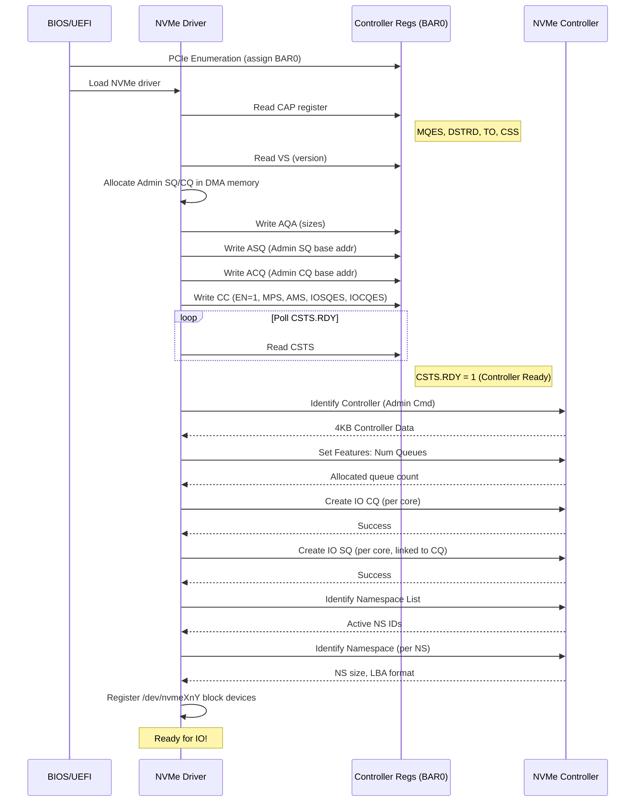

# NVMe (Non-Volatile Memory Express) — DIAGRAMS & VISUALS
# ════════════════════════════════════════════════════════════════════
# Protocol: NVMe | Document: 02 of 08
# Format: ASCII art, tables, Mermaid, visual reference
# ════════════════════════════════════════════════════════════════════

---

## DIAGRAM 1: NVMe System Architecture

```
┌─────────────────────────────────────────────────────────────────┐
│                         HOST SYSTEM                              │
│  ┌────────┐  ┌────────┐  ┌────────┐  ┌────────┐               │
│  │ Core 0 │  │ Core 1 │  │ Core 2 │  │ Core 3 │               │
│  │ SQ1/CQ1│  │ SQ2/CQ2│  │ SQ3/CQ3│  │ SQ4/CQ4│               │
│  └───┬────┘  └───┬────┘  └───┬────┘  └───┬────┘               │
│      │           │           │           │                      │
│      ▼           ▼           ▼           ▼                      │
│  ┌──────────────────────────────────────────────┐               │
│  │              SYSTEM MEMORY (DRAM)             │               │
│  │  ┌─────┐ ┌─────┐ ┌─────┐ ┌─────┐ ┌───────┐ │               │
│  │  │ SQ0 │ │ SQ1 │ │ SQ2 │ │ SQ3 │ │ SQ4   │ │               │
│  │  │Admin│ │ IO  │ │ IO  │ │ IO  │ │ IO    │ │               │
│  │  ├─────┤ ├─────┤ ├─────┤ ├─────┤ ├───────┤ │               │
│  │  │ CQ0 │ │ CQ1 │ │ CQ2 │ │ CQ3 │ │ CQ4   │ │               │
│  │  │Admin│ │ IO  │ │ IO  │ │ IO  │ │ IO    │ │               │
│  │  └─────┘ └─────┘ └─────┘ └─────┘ └───────┘ │               │
│  │  ┌──────────────────────────────────────────┐│               │
│  │  │         DATA BUFFERS (PRP/SGL)           ││               │
│  │  └──────────────────────────────────────────┘│               │
│  └──────────────────────────────────────────────┘               │
│                        │ PCIe Root Complex                       │
└────────────────────────┼────────────────────────────────────────┘
                         │ PCIe Link (Gen3/4 x4)
                         │ TLP Memory Read/Write
┌────────────────────────┼────────────────────────────────────────┐
│                  NVMe CONTROLLER (SSD)                           │
│  ┌──────────────────────────────────────────────────┐           │
│  │              PCIe Interface / DMA Engine          │           │
│  └─────────────────────┬────────────────────────────┘           │
│  ┌─────────────────────┼────────────────────────────┐           │
│  │         COMMAND FETCH & DISPATCH ENGINE           │           │
│  │  ┌──────────┐  ┌──────────┐  ┌──────────────┐   │           │
│  │  │ Doorbell │  │ Arbiter  │  │ Command      │   │           │
│  │  │ Decode   │  │ (RR/WRR) │  │ Parser       │   │           │
│  │  └──────────┘  └──────────┘  └──────────────┘   │           │
│  └──────────────────────────────────────────────────┘           │
│  ┌──────────────────────────────────────────────────┐           │
│  │              FLASH TRANSLATION LAYER (FTL)        │           │
│  │  ┌────────┐ ┌──────────┐ ┌────────┐ ┌────────┐  │           │
│  │  │ L2P Map│ │ GC Engine│ │ WL     │ │ Cache  │  │           │
│  │  └────────┘ └──────────┘ └────────┘ └────────┘  │           │
│  └──────────────────────────────────────────────────┘           │
│  ┌──────────────────────────────────────────────────┐           │
│  │                 NAND FLASH ARRAY                   │           │
│  │  ┌──────┐ ┌──────┐ ┌──────┐ ┌──────┐ ... ┌────┐ │           │
│  │  │Die 0 │ │Die 1 │ │Die 2 │ │Die 3 │     │Die N│ │           │
│  │  │Ch 0  │ │Ch 1  │ │Ch 2  │ │Ch 3  │     │Ch N│ │           │
│  │  └──────┘ └──────┘ └──────┘ └──────┘     └────┘ │           │
│  └──────────────────────────────────────────────────┘           │
│  ┌──────────────────────────────────────────────────┐           │
│  │  DRAM (FTL metadata) │ SRAM (Command buffers)    │           │
│  └──────────────────────────────────────────────────┘           │
└─────────────────────────────────────────────────────────────────┘
```

---

## DIAGRAM 2: Submission/Completion Queue Ring Buffer

```
SUBMISSION QUEUE (Host Memory, 64B entries)
══════════════════════════════════════════════
         Tail (Host writes here)
         ▼
┌─────┬─────┬─────┬─────┬─────┬─────┬─────┬─────┐
│Cmd 0│Cmd 1│Cmd 2│Cmd 3│     │     │     │     │
│(done)│(done)│(new)│(new)│empty│empty│empty│empty│
└─────┴─────┴─────┴─────┴─────┴─────┴─────┴─────┘
   ▲                                          Wrap
   │                                           │
   Head (Controller fetches from here)         ▼
   
Host:       Writes command at Tail, increments Tail Doorbell
Controller: Fetches from Head, advances internal Head
CQ Entry:   Reports SQ Head back to host (flow control)


COMPLETION QUEUE (Host Memory, 16B entries)
══════════════════════════════════════════════
              Controller writes here
              ▼
┌─────┬─────┬─────┬─────┬─────┬─────┬─────┬─────┐
│CQE 0│CQE 1│CQE 2│     │     │     │     │     │
│P=1  │P=1  │P=1  │P=0  │P=0  │P=0  │P=0  │P=0  │
└─────┴─────┴─────┴─────┴─────┴─────┴─────┴─────┘
         ▲
         │
         Head (Host reads from here, writes CQ Head Doorbell)

Phase Tag: Host expects P=1 for first pass
           Entries with P=1 → new (process them)
           After wrap: expects P=0, then P=1, alternating
```

---

## DIAGRAM 3: NVMe Read Command Lifecycle

```
    HOST (CPU/Driver)                        NVMe CONTROLLER
    ═════════════════                        ═══════════════
         │                                        │
    ①    │ Write Read Cmd to SQ[Tail]              │
         │ (Opcode=0x02, NSID, LBA, NLB, PRP)    │
         │                                        │
    ②    │ ─── Doorbell Write (SQ Tail) ──────►   │
         │     (MMIO write to BAR0+offset)        │
         │                                        │
         │                                   ③    │ DMA Read: Fetch SQE
         │ ◄──── PCIe MRd TLP ────────────────    │ from Host Memory
         │ ──── PCIe CplD TLP ────────────────►   │ (64 bytes)
         │                                        │
         │                                   ④    │ Parse Command
         │                                        │ Lookup LBA → Physical
         │                                        │ Issue NAND Read
         │                                        │
         │                                   ⑤    │ NAND Read Complete
         │                                        │ Data in controller SRAM
         │                                        │
         │                                   ⑥    │ DMA Write: Send data
         │ ◄──── PCIe MWr TLP ────────────────    │ to PRP address in host
         │       (4KB data payload)               │ memory
         │                                        │
         │                                   ⑦    │ DMA Write: Post CQE
         │ ◄──── PCIe MWr TLP ────────────────    │ to CQ (16 bytes)
         │       (Status=Success, CID)            │
         │                                        │
         │                                   ⑧    │ Send MSI-X Interrupt
         │ ◄──── PCIe MWr TLP ────────────────    │ (interrupt vector)
         │                                        │
    ⑨    │ ISR: Read CQ[Head]                     │
         │ Check Phase Tag (new entry)            │
         │ Match CID → complete request           │
         │                                        │
    ⑩    │ ─── Doorbell Write (CQ Head) ──────►   │
         │     (Acknowledge consumption)          │
         │                                        │

Total Time: ~10-100 μs (depends on NAND latency)
```

---

## DIAGRAM 4: NVMe Write Command Lifecycle

```
    HOST                                     NVMe CONTROLLER
    ════                                     ═══════════════
         │                                        │
    ①    │ Write Write Cmd to SQ[Tail]            │
         │ (Opcode=0x01, LBA, NLB, PRP→data)     │
         │                                        │
    ②    │ ── SQ Tail Doorbell ──────────────►    │
         │                                        │
         │                                   ③    │ Fetch SQE (DMA Read)
         │ ◄════ Fetch 64B cmd ═══════════════    │
         │                                        │
         │                                   ④    │ Fetch Data (DMA Read)
         │ ◄════ Fetch data from PRP addr ════    │
         │      (may be multiple TLPs)            │
         │                                        │
         │                                   ⑤    │ FTL: Map LBA → page
         │                                        │ Program NAND page
         │                                        │ (or cache in DRAM)
         │                                        │
         │                                   ⑥    │ NAND Program complete
         │                                        │ (or write to cache)
         │                                        │
         │                                   ⑦    │ Post CQE + MSI-X
         │ ◄════ CQE + Interrupt ═════════════    │
         │                                        │
    ⑧    │ Process completion                     │
         │ ── CQ Head Doorbell ──────────────►    │
         │                                        │

Note: With write cache, completion may come before NAND program
      FUA (Force Unit Access) bit forces wait for NAND program
```

---

## DIAGRAM 5: BAR0 Register Map

```
Offset    Register                Size    Access
══════    ════════                ════    ══════
0x0000    ┌────────────────────┐  8B     RO
          │ CAP (Capabilities) │
0x0008    ├────────────────────┤  4B     RO
          │ VS (Version)       │
0x000C    ├────────────────────┤  4B     RW1C
          │ INTMS (Int Mask Set)│
0x0010    ├────────────────────┤  4B     RW1C
          │ INTMC (Int Mask Clr)│
0x0014    ├────────────────────┤  4B     RW
          │ CC (Controller Cfg) │
0x0018    ├────────────────────┤  4B     RO
          │ Reserved           │
0x001C    ├────────────────────┤  4B     RO
          │ CSTS (Ctrl Status) │
0x0020    ├────────────────────┤  4B     RW
          │ NSSR (Subsys Reset)│
0x0024    ├────────────────────┤  4B     RW
          │ AQA (Admin Queue)  │
0x0028    ├────────────────────┤  8B     RW
          │ ASQ (Admin SQ Base)│
0x0030    ├────────────────────┤  8B     RW
          │ ACQ (Admin CQ Base)│
0x0038    ├────────────────────┤
          │ ... Reserved ...   │
          │                    │
0x1000    ├────────────────────┤  4B     RW    ← Doorbell Start
          │ SQ0 Tail Doorbell  │              (Admin SQ)
0x1004    ├────────────────────┤  4B     RW    (stride=4B default)
          │ CQ0 Head Doorbell  │              (Admin CQ)
0x1008    ├────────────────────┤  4B     RW
          │ SQ1 Tail Doorbell  │              (IO SQ 1)
0x100C    ├────────────────────┤  4B     RW
          │ CQ1 Head Doorbell  │              (IO CQ 1)
0x1010    ├────────────────────┤  4B     RW
          │ SQ2 Tail Doorbell  │              (IO SQ 2)
0x1014    ├────────────────────┤  4B     RW
          │ CQ2 Head Doorbell  │
          │ ...                │
          └────────────────────┘

Doorbell offset formula:
  SQy Tail = 0x1000 + (2y × (4 << CAP.DSTRD))
  CQy Head = 0x1000 + ((2y+1) × (4 << CAP.DSTRD))
```

---

## DIAGRAM 6: PRP (Physical Region Page) Chaining

```
CASE 1: Small transfer (≤ 1 page = 4KB)
═══════════════════════════════════════
SQE:
  PRP1 → [Data Buffer Page 0] (4KB aligned)
  PRP2 → (unused)

CASE 2: Two pages (4KB < transfer ≤ 8KB)
═══════════════════════════════════════════
SQE:
  PRP1 → [Data Buffer Page 0]
  PRP2 → [Data Buffer Page 1]

CASE 3: Multiple pages (transfer > 8KB)
════════════════════════════════════════════
SQE:
  PRP1 → [Data Buffer Page 0]  (first page)
  PRP2 → [PRP List in memory]  (pointer to list)
              │
              ▼
         ┌─────────────────────────────┐
         │ PRP List (page-aligned)     │
         │ ┌───────────────────────┐   │
         │ │ PRP Entry → Page 1    │   │
         │ ├───────────────────────┤   │
         │ │ PRP Entry → Page 2    │   │
         │ ├───────────────────────┤   │
         │ │ PRP Entry → Page 3    │   │
         │ ├───────────────────────┤   │
         │ │ ...                   │   │
         │ ├───────────────────────┤   │
         │ │ PRP Entry → Page N    │   │  ← Last entry
         │ └───────────────────────┘   │
         └─────────────────────────────┘

Note: PRP List can span multiple pages (last entry 
      of page points to next PRP List page)
      Max transfer = MDTS (from Identify Controller)
```

---

## DIAGRAM 7: Namespace Architecture

```
┌─────────────────────────────────────────────────────────────┐
│                    NVMe SUBSYSTEM                            │
│                                                             │
│  ┌───────────────────────┐  ┌───────────────────────┐      │
│  │    Controller 0       │  │    Controller 1       │      │
│  │    (PF0 or VF)        │  │    (PF1 or VF)        │      │
│  │                       │  │                       │      │
│  │  Admin SQ/CQ          │  │  Admin SQ/CQ          │      │
│  │  IO SQ/CQ pairs       │  │  IO SQ/CQ pairs       │      │
│  └───────────┬───────────┘  └───────────┬───────────┘      │
│              │                           │                  │
│              │  Attach                   │  Attach          │
│              ▼                           ▼                  │
│  ┌───────────────────────────────────────────────────────┐  │
│  │                   NAMESPACES                           │  │
│  │                                                       │  │
│  │  ┌──────────────┐  ┌──────────────┐  ┌────────────┐  │  │
│  │  │  Namespace 1 │  │  Namespace 2 │  │Namespace 3 │  │  │
│  │  │  NSID = 1    │  │  NSID = 2    │  │NSID = 3    │  │  │
│  │  │              │  │              │  │            │  │  │
│  │  │  512GB       │  │  256GB       │  │128GB      │  │  │
│  │  │  LBA=4KB     │  │  LBA=512B    │  │LBA=4KB    │  │  │
│  │  │  /dev/nvme0n1│  │  /dev/nvme0n2│  │/dev/nvme0n3│ │  │
│  │  │              │  │              │  │            │  │  │
│  │  │  [Shared]    │  │  [Private    │  │[Private   │  │  │
│  │  │  Ctrl0+Ctrl1 │  │   Ctrl0 only]│  │ Ctrl1 only│  │  │
│  │  └──────────────┘  └──────────────┘  └────────────┘  │  │
│  └───────────────────────────────────────────────────────┘  │
│                                                             │
│  ┌───────────────────────────────────────────────────────┐  │
│  │              PHYSICAL NAND CAPACITY                    │  │
│  │           (shared across all namespaces)               │  │
│  └───────────────────────────────────────────────────────┘  │
└─────────────────────────────────────────────────────────────┘
```

---

## DIAGRAM 8: NVMe Initialization Sequence



---

## DIAGRAM 9: Multi-Queue Interrupt Architecture

```
┌────────────────────────────────────────────────────────────┐
│                     CPU CORES                               │
│  ┌──────┐  ┌──────┐  ┌──────┐  ┌──────┐  ┌──────┐        │
│  │Core 0│  │Core 1│  │Core 2│  │Core 3│  │Core 4│        │
│  │      │  │      │  │      │  │      │  │      │        │
│  │MSI-X │  │MSI-X │  │MSI-X │  │MSI-X │  │MSI-X │        │
│  │Vec 0 │  │Vec 1 │  │Vec 2 │  │Vec 3 │  │Vec 4 │        │
│  └───┬──┘  └───┬──┘  └───┬──┘  └───┬──┘  └───┬──┘        │
│      │         │         │         │         │            │
│      ▼         ▼         ▼         ▼         ▼            │
│  ┌──────┐  ┌──────┐  ┌──────┐  ┌──────┐  ┌──────┐        │
│  │CQ0   │  │CQ1   │  │CQ2   │  │CQ3   │  │CQ4   │        │
│  │Admin │  │IO    │  │IO    │  │IO    │  │IO    │        │
│  ├──────┤  ├──────┤  ├──────┤  ├──────┤  ├──────┤        │
│  │SQ0   │  │SQ1   │  │SQ2   │  │SQ3   │  │SQ4   │        │
│  │Admin │  │IO    │  │IO    │  │IO    │  │IO    │        │
│  └──────┘  └──────┘  └──────┘  └──────┘  └──────┘        │
│                     HOST MEMORY                            │
└────────────────────────────────────────────────────────────┘
         │         │         │         │         │
         └────────┬┴─────────┴─────────┴─────────┘
                  │ PCIe MSI-X (per-queue interrupt)
                  ▼
┌────────────────────────────────────────────────────────────┐
│                   NVMe CONTROLLER                           │
│                                                            │
│  Interrupt Coalescing Logic:                               │
│  - Aggregate N completions before interrupt                │
│  - Or timeout after T microseconds                         │
│  - Configurable per vector                                 │
└────────────────────────────────────────────────────────────┘

Benefits:
  ✓ No lock contention between cores
  ✓ Per-core interrupt delivery (NUMA aware)
  ✓ Scales linearly with CPU count
  ✓ No shared interrupt handler bottleneck
```

---

## DIAGRAM 10: Arbitration Mechanism (Weighted Round Robin)

```
┌─────────────────────────────────────────────────┐
│            SUBMISSION QUEUES                     │
│                                                 │
│  ┌────────┐  Priority: URGENT                  │
│  │  SQ_U  │  ────────────────► Always first    │
│  └────────┘                                    │
│                                                 │
│  ┌────────┐  Priority: HIGH (Weight=8)         │
│  │  SQ_H  │  ─────┐                           │
│  └────────┘       │                           │
│                    ├──► Weighted Round Robin    │
│  ┌────────┐  Priority: MEDIUM (Weight=4)      │
│  │  SQ_M  │  ─────┤   (after Urgent served)   │
│  └────────┘       │                           │
│                    │                           │
│  ┌────────┐  Priority: LOW (Weight=2)         │
│  │  SQ_L  │  ─────┘                           │
│  └────────┘                                    │
└─────────────────────────────────────────────────┘

Fetch Pattern (example burst=4):
═══════════════════════════════════
  U U U   (all urgent first)
  H H H H H H H H  (8 from high)
  M M M M          (4 from medium)
  L L              (2 from low)
  (repeat)

Use Case:
  Urgent = Critical vehicle safety data writes
  High   = Navigation map reads
  Medium = Media playback
  Low    = Background sync, analytics
```

---

## DIAGRAM 11: NVMe Power States

```
                    ┌──────────────────────┐
                    │ PS0 (Max Performance) │
                    │ Power: 25W            │
                    │ Latency: 0            │
                    └──────────┬───────────┘
                               │ Idle > T1
                               ▼
                    ┌──────────────────────┐
                    │ PS1 (Reduced)         │
                    │ Power: 15W            │
                    │ Latency: 0            │
                    └──────────┬───────────┘
                               │ Idle > T2
                               ▼
                    ┌──────────────────────┐
                    │ PS2 (Low Power)       │
                    │ Power: 8W             │
                    │ Entry: 0, Exit: 0     │
                    └──────────┬───────────┘
                               │ Idle > T3
                               ▼
                    ┌──────────────────────┐
                    │ PS3 (Non-Operational) │
                    │ Power: 50mW           │  ← APST target
                    │ Entry: 5ms, Exit: 10ms│    (automotive idle)
                    └──────────┬───────────┘
                               │ Idle > T4
                               ▼
                    ┌──────────────────────┐
                    │ PS4 (Deep Sleep)      │
                    │ Power: 5mW            │  ← Long parking
                    │ Entry: 30ms, Exit: 50ms│
                    └──────────────────────┘

    ◄─── Any new IO command → immediate return to PS0 ───►

APST Table (Set Features 0x0C):
  Entry  Idle_Time    Target_State
  0      100ms   →    PS3
  1      2000ms  →    PS4
```

---

## DIAGRAM 12: SQE (Submission Queue Entry) Format — 64 Bytes

```
Byte Offset
     0       4       8      12      16      20      24      28      32
     ┌───────┬───────┬───────┬───────┬───────┬───────┬───────┬───────┐
 0   │Opcode │Flags  │  CID  │ NSID                  │               │
     │(8b)   │FUSE(2)│(16b)  │ (32-bit)              │  Reserved     │
     │       │PSDT(2)│       │                       │               │
     ├───────┴───────┴───────┴───────┴───────┴───────┴───────┴───────┤
 8   │                        Reserved (8 bytes)                      │
     ├───────────────────────────────────────────────────────────────┤
16   │                 Metadata Pointer (MPTR) — 8 bytes              │
     ├───────────────────────────────────────────────────────────────┤
24   │                 PRP Entry 1 / SGL — 8 bytes                    │
     ├───────────────────────────────────────────────────────────────┤
32   │                 PRP Entry 2 / SGL — 8 bytes                    │
     ├───────────────────────────────────────────────────────────────┤
40   │  CDW10 (Cmd-specific)  │  CDW11 (Cmd-specific)               │
     ├───────────────────────────────────────────────────────────────┤
48   │  CDW12 (Cmd-specific)  │  CDW13 (Cmd-specific)               │
     ├───────────────────────────────────────────────────────────────┤
56   │  CDW14 (Cmd-specific)  │  CDW15 (Cmd-specific)               │
     └───────────────────────────────────────────────────────────────┘

For READ command:
  CDW10 = Starting LBA [31:0]
  CDW11 = Starting LBA [63:32]
  CDW12 = NLB (Number of Logical Blocks - 1) | Flags (FUA, LR)
  CDW13 = DSM (Dataset Management hints)
  CDW14 = EILBRT (Expected Initial Logical Block Ref Tag)
  CDW15 = ELBAT | ELBATM (Expected LB App Tag)
```

---

## DIAGRAM 13: CQE (Completion Queue Entry) Format — 16 Bytes

```
Byte Offset
     0       4       8      12      16
     ┌───────┬───────┬───────┬───────┐
 0   │ DW0 (Command-specific result) │
     ├───────┴───────┴───────┴───────┤
 4   │ DW1 (Reserved)                 │
     ├───────────────────────────────┤
 8   │ SQ Head  │ SQ ID              │
     │ Pointer  │ (which SQ)         │
     │ (16-bit) │ (16-bit)           │
     ├───────────────────────────────┤
12   │    CID    │    Status Field   │
     │  (16-bit) │ P|SC|SCT|M|DNR   │
     └───────────────────────────────┘

Status Field (16 bits):
  Bit 0:     Phase Tag (P)
  Bits 1-8:  Status Code (SC)
  Bits 9-11: Status Code Type (SCT)
  Bit 12:    More (M) — more status available
  Bit 13:    Do Not Retry (DNR)
  Bits 14-15: Reserved

Phase Tag Logic:
  Pass 1: Host expects P=1 (controller writes 1)
  Pass 2: Host expects P=0 (controller writes 0)
  ...alternates on each wrap
```

---

## DIAGRAM 14: NVMe Linux Driver Stack

```
┌──────────────────────────────────────────────────────────────┐
│                        USER SPACE                            │
│                                                              │
│  ┌──────────┐  ┌─────────┐  ┌──────────┐  ┌────────────┐   │
│  │ nvme-cli │  │   fio   │  │  dd/cat  │  │Application │   │
│  │(admin cmd)│  │(bench)  │  │(block IO)│  │(file IO)   │   │
│  └─────┬────┘  └────┬────┘  └────┬─────┘  └─────┬──────┘   │
│        │             │            │               │          │
│  ┌─────┴─────────────┴────────────┴───────────────┴──────┐   │
│  │           /dev/nvme0 (char)   /dev/nvme0n1 (block)    │   │
│  └─────────────────────────────────────────────────────── │   │
└──────────┼──────────────────────────────────────┼────────────┘
           │ ioctl                                │ read/write
┌──────────┼──────────────────────────────────────┼────────────┐
│          ▼           KERNEL SPACE               ▼            │
│  ┌──────────────┐                    ┌────────────────────┐  │
│  │  nvme-core   │                    │       VFS          │  │
│  │ (core.c)     │                    │  (ext4 / f2fs)     │  │
│  │ - ioctl      │                    └─────────┬──────────┘  │
│  │ - admin cmds │                              │             │
│  │ - NS mgmt    │                    ┌─────────▼──────────┐  │
│  └──────┬───────┘                    │    Block Layer     │  │
│         │                            │    (blk-mq)        │  │
│         │                            │  - IO scheduling   │  │
│         │                            │  - Tag management  │  │
│         │                            │  - Merging         │  │
│         │                            └─────────┬──────────┘  │
│         │                                      │             │
│  ┌──────┴──────────────────────────────────────┴──────────┐  │
│  │                    nvme-pci                             │  │
│  │                   (pci.c)                               │  │
│  │  - Queue allocation (DMA coherent memory)              │  │
│  │  - Doorbell writes                                     │  │
│  │  - MSI-X interrupt handling                            │  │
│  │  - PRP/SGL setup                                       │  │
│  │  - Reset/recovery                                      │  │
│  └────────────────────────────┬───────────────────────────┘  │
│                               │                              │
└───────────────────────────────┼──────────────────────────────┘
                                │ PCIe TLPs
┌───────────────────────────────┼──────────────────────────────┐
│                         NVMe SSD                             │
└──────────────────────────────────────────────────────────────┘
```

---

## DIAGRAM 15: SMART Log Structure (Visual)

```
SMART/Health Information Log (Log Page 0x02, 512 bytes)
═══════════════════════════════════════════════════════

Offset  Field                          Example Value
──────  ─────                          ─────────────
[0]     Critical Warning               0x00 (OK)
        ┌─bit4: Volatile backup fail
        ├─bit3: Read Only mode
        ├─bit2: Reliability degraded
        ├─bit1: Temperature exceeded
        └─bit0: Available spare below threshold

[1-2]   Composite Temperature          313K (40°C)
[3]     Available Spare                 100%
[4]     Available Spare Threshold       10%
[5]     Percentage Used                 3%
[32-47] Data Units Read                 12,456,789 (×1000×512B = 6.38TB)
[48-63] Data Units Written              8,234,567 (×1000×512B = 4.21TB)
[64-79] Host Read Commands              456,789,012
[80-95] Host Write Commands             234,567,890
[96-111] Controller Busy Time           1,234 minutes
[112-127] Power Cycles                  45
[128-143] Power On Hours                8,760 (1 year)
[144-159] Unsafe Shutdowns              2
[160-175] Media & Data Integrity Errors 0  ← ANY non-zero = concern!
[176-191] Error Information Log Entries  3

Automotive Alert Thresholds:
  Available Spare < 20%  → Plan replacement
  Percentage Used > 80%  → End of life approaching
  Unsafe Shutdowns > 10  → Power design issue
  Media Errors > 0       → Hardware degradation
  Temperature > 70°C     → Throttling likely
```

---

## DIAGRAM 16: NVMe Shutdown Sequence

```
    Driver                    Controller Regs              Controller
    ══════                    ═══════════════              ══════════
       │                           │                          │
  ①    │ Flush all queues          │                          │
       │ (Submit Flush cmds)       │                          │
       │─────────────────────────► │ ─────────────────────►   │
       │                           │                          │ Execute
       │ ◄─────────────────────────│ ◄─────────────────────   │ Flush
       │  (Flush completions)      │                          │
       │                           │                          │
  ②    │ Delete IO SQs             │                          │
       │─────────────────────────► │ ─────────────────────►   │
       │ ◄─────── ACK ──────────── │                          │
       │                           │                          │
  ③    │ Delete IO CQs             │                          │
       │─────────────────────────► │ ─────────────────────►   │
       │ ◄─────── ACK ──────────── │                          │
       │                           │                          │
  ④    │ Write CC.SHN = 01         │                          │
       │ (Normal Shutdown)         │                          │
       │─────────────────────────► │ ─────────────────────►   │
       │                           │                          │ Flush cache
       │                           │                          │ Save metadata
       │                           │                          │ Park heads (N/A)
       │                           │                          │
  ⑤    │ Poll CSTS.SHST            │                          │
       │                           │ ◄─────────────────────   │ Done!
       │ ◄─ CSTS.SHST = 10b ─────│                          │
       │    (Shutdown complete)    │                          │
       │                           │                          │
  ⑥    │ Disable controller        │                          │
       │ CC.EN = 0                 │                          │
       │─────────────────────────► │                          │
       │                           │                          │
  ⑦    │ Power off (PERST# or     │                          │
       │  platform power control)  │                          │

Automotive: PMIC holds power during shutdown sequence
            Typical time: 10-100ms for clean shutdown
```

---

## DIAGRAM 17: NVMe-oF (over Fabrics) Architecture

```
┌─────────────────────────────────────────────────────────────┐
│                    NVMe HOST                                 │
│                                                             │
│  ┌─────────────────────────────────────────────────────┐    │
│  │               NVMe Host Software                    │    │
│  │   ┌───────────┐  ┌───────────┐  ┌───────────┐      │    │
│  │   │ nvme-core │  │ nvme-core │  │ nvme-core │      │    │
│  │   └─────┬─────┘  └─────┬─────┘  └─────┬─────┘      │    │
│  │         │               │               │            │    │
│  │   ┌─────┴─────┐  ┌─────┴─────┐  ┌─────┴─────┐      │    │
│  │   │ nvme-pci  │  │ nvme-tcp  │  │ nvme-rdma │      │    │
│  │   │(local SSD)│  │(remote)   │  │(remote)   │      │    │
│  │   └─────┬─────┘  └─────┬─────┘  └─────┬─────┘      │    │
│  └─────────┼───────────────┼───────────────┼────────────┘    │
│            │               │               │                │
└────────────┼───────────────┼───────────────┼────────────────┘
             │PCIe           │TCP/IP         │RDMA
             ▼               ▼               ▼
    ┌────────────┐  ┌──────────────┐  ┌──────────────┐
    │ Local NVMe │  │   Network    │  │   Network    │
    │    SSD     │  │  (Ethernet)  │  │(RDMA fabric) │
    └────────────┘  └──────┬───────┘  └──────┬───────┘
                           │                  │
                    ┌──────┴──────────────────┴───────┐
                    │         NVMe TARGET             │
                    │  (Storage Array / JBOF)         │
                    │                                 │
                    │  ┌──────────────────────────┐   │
                    │  │    nvmet (target core)   │   │
                    │  └──────────┬───────────────┘   │
                    │             │                   │
                    │  ┌──────┐ ┌──────┐ ┌──────┐    │
                    │  │ NS1  │ │ NS2  │ │ NS3  │    │
                    │  │(SSD) │ │(SSD) │ │(SSD) │    │
                    │  └──────┘ └──────┘ └──────┘    │
                    └────────────────────────────────┘
```

---

## DIAGRAM 18: Zoned Namespace (ZNS) Layout

```
┌─────────────────────────────────────────────────────────────────┐
│                    ZONED NAMESPACE                               │
│                                                                 │
│  Zone 0         Zone 1         Zone 2         Zone 3            │
│  (Full)         (Open)         (Empty)        (Closed)          │
│  ┌──────────┐   ┌──────────┐   ┌──────────┐   ┌──────────┐    │
│  │██████████│   │████████░░│   │░░░░░░░░░░│   │██████░░░░│    │
│  │██████████│   │████████░░│   │░░░░░░░░░░│   │██████░░░░│    │
│  │██████████│   │████████░░│   │░░░░░░░░░░│   │██████░░░░│    │
│  │██████████│   │██████WP░░│   │░░░░░░░░░░│   │██████░░░░│    │
│  └──────────┘   └──────────┘   └──────────┘   └──────────┘    │
│  All written    Write Pointer   Ready for      Closed state     │
│  (read-only     here ↑          sequential     (can reopen)     │
│   until reset)  Must write      write                           │
│                 sequentially                                     │
│                                                                 │
│  Zone State Machine:                                            │
│  Empty → Implicitly Open → Explicitly Open → Closed → Full     │
│     ↑                                                    │      │
│     └──────────── Zone Reset ◄───────────────────────────┘      │
│                                                                 │
│  ████ = Written data                                            │
│  ░░░░ = Unwritten (invalid/empty)                               │
│  WP   = Write Pointer (next sequential write location)          │
└─────────────────────────────────────────────────────────────────┘

Benefits for Data Logging (Automotive):
  - Write Amplification Factor = 1.0 (no GC needed)
  - Predictable latency (no background GC)
  - More usable capacity (less over-provisioning)
  - Perfect for: dashcam, ADAS, telemetry
```

---

## DIAGRAM 19: Automotive NVMe System Integration

```
┌─────────────────────────────────────────────────────────────┐
│                   SA8295P PLATFORM                           │
│                                                             │
│  ┌────────────────────────────────────────────────────────┐ │
│  │                    SA8295P SoC                         │ │
│  │                                                        │ │
│  │  ┌──────┐  ┌──────┐  ┌──────┐  ┌──────────────────┐  │ │
│  │  │Cortex│  │Cortex│  │  GPU │  │ PCIe Root Complex │  │ │
│  │  │A76×8 │  │A55×4 │  │Adreno│  │    Gen3/4        │  │ │
│  │  └──┬───┘  └──┬───┘  └──┬───┘  └────────┬─────────┘  │ │
│  │     │         │         │               │             │ │
│  │     └────────┬┴─────────┘               │             │ │
│  │              │                           │             │ │
│  │    ┌─────────┴──────────┐               │             │ │
│  │    │  System NoC (Bus)  ├───────────────┘             │ │
│  │    └─────────┬──────────┘                             │ │
│  │              │                                        │ │
│  │    ┌─────────┴──────────┐                             │ │
│  │    │  LPDDR5 (16GB)     │                             │ │
│  │    │  SQ/CQ Buffers     │                             │ │
│  │    │  Data Buffers      │                             │ │
│  │    └────────────────────┘                             │ │
│  └────────────────────────────────────────────────────────┘ │
│                         │                                   │
│                    PCIe x4 Link                             │
│                    (Gen3: 32 Gbps)                          │
│                         │                                   │
│  ┌──────────────────────┴────────────────────────────────┐  │
│  │              BGA NVMe SSD (Soldered)                   │  │
│  │  ┌────────────────────────────────────────────────┐   │  │
│  │  │ NVMe Controller (Samsung/Kioxia/WD)            │   │  │
│  │  │ PCIe PHY │ FTL │ ECC │ Wear Leveling          │   │  │
│  │  └────────────────────────────────────────────────┘   │  │
│  │  ┌────────┐ ┌────────┐ ┌────────┐ ┌────────┐        │  │
│  │  │TLC Die0│ │TLC Die1│ │TLC Die2│ │TLC Die3│        │  │
│  │  │ 128GB  │ │ 128GB  │ │ 128GB  │ │ 128GB  │        │  │
│  │  └────────┘ └────────┘ └────────┘ └────────┘        │  │
│  │           Total: 512 GB Raw NAND                      │  │
│  └───────────────────────────────────────────────────────┘  │
│                                                             │
│  Use: ADAS data logging, HD Map DB, OTA staging            │
└─────────────────────────────────────────────────────────────┘
```

---

## DIAGRAM 20: NVMe Error Handling & Recovery

```
┌─────────────────────────────────────────────────────────────┐
│              NVMe ERROR HANDLING HIERARCHY                   │
│                                                             │
│  Level 1: COMMAND ERROR                                     │
│  ──────────────────────                                     │
│  CQE Status ≠ 0x0000                                       │
│  ┌─────────────────────────────────────┐                    │
│  │ Check DNR (Do Not Retry) bit        │                    │
│  │ DNR=0 → Retry command (up to N times)│                    │
│  │ DNR=1 → Fail immediately to upper layer│                  │
│  └─────────────────────────────────────┘                    │
│                                                             │
│  Level 2: TRANSPORT ERROR (PCIe)                            │
│  ──────────────────────────────                             │
│  PCIe link CRC error, completion timeout                    │
│  ┌─────────────────────────────────────┐                    │
│  │ PCIe error recovery:                │                    │
│  │ 1. SERR/PERR detected              │                    │
│  │ 2. AER (Advanced Error Reporting)   │                    │
│  │ 3. Link retrain or hot reset        │                    │
│  └─────────────────────────────────────┘                    │
│                                                             │
│  Level 3: CONTROLLER FATAL ERROR                            │
│  ──────────────────────────────                             │
│  CSTS.CFS = 1 (Controller Fatal Status)                     │
│  ┌─────────────────────────────────────┐                    │
│  │ 1. All in-flight commands LOST      │                    │
│  │ 2. Set CC.EN = 0                    │                    │
│  │ 3. Wait CSTS.RDY = 0               │                    │
│  │ 4. Reconfigure (AQA, ASQ, ACQ)     │                    │
│  │ 5. Set CC.EN = 1                    │                    │
│  │ 6. Recreate IO queues              │                    │
│  │ 7. Retry failed IO from block layer │                    │
│  └─────────────────────────────────────┘                    │
│                                                             │
│  Level 4: SUBSYSTEM RESET                                   │
│  ─────────────────────                                      │
│  NSSR write or PCIe Function Level Reset                    │
│  ┌─────────────────────────────────────┐                    │
│  │ Full re-initialization sequence     │                    │
│  │ (Same as fresh boot)               │                    │
│  └─────────────────────────────────────┘                    │
│                                                             │
│  Level 5: DEVICE REPLACEMENT                                │
│  ────────────────────────                                   │
│  Persistent media errors, device dead                       │
│  ┌─────────────────────────────────────┐                    │
│  │ Filesystem goes read-only           │                    │
│  │ Report to DTC (automotive)          │                    │
│  │ Service required                    │                    │
│  └─────────────────────────────────────┘                    │
└─────────────────────────────────────────────────────────────┘
```

---

END OF DOCUMENT 02 — DIAGRAMS & VISUALS
