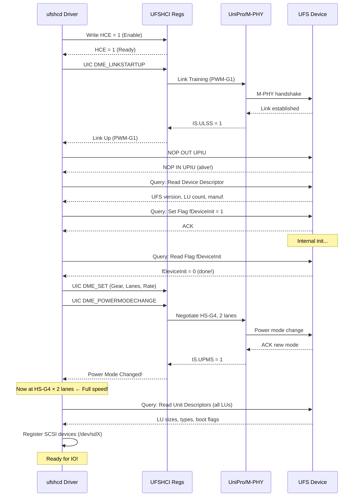

# UFS (Universal Flash Storage) — DIAGRAMS & VISUALS
# ════════════════════════════════════════════════════════════════════
# Protocol: UFS | Document: 02 of 08
# Format: ASCII art, Mermaid, tables, visual reference
# ════════════════════════════════════════════════════════════════════

---

## DIAGRAM 1: UFS Layered Architecture

```
┌──────────────────────────────────────────────────────────────┐
│                    UFS HOST (SoC)                             │
│                                                              │
│  ┌────────────────────────────────────────────────────────┐  │
│  │  APPLICATION LAYER                                     │  │
│  │  SCSI Commands (READ, WRITE, INQUIRY, UNMAP...)       │  │
│  └────────────────────────────┬───────────────────────────┘  │
│                               │                              │
│  ┌────────────────────────────┼───────────────────────────┐  │
│  │  UFS TRANSPORT PROTOCOL (UTP)                          │  │
│  │  UPIU Packets (Command, Data, Response, Query)         │  │
│  └────────────────────────────┼───────────────────────────┘  │
│                               │                              │
│  ┌────────────────────────────┼───────────────────────────┐  │
│  │  UFS INTERCONNECT (UIC)                                │  │
│  │  ┌──────────────────────────────────────────────────┐  │  │
│  │  │  UniPro Transport Layer (TL) — Segmentation      │  │  │
│  │  ├──────────────────────────────────────────────────┤  │  │
│  │  │  UniPro Network Layer (NL) — Routing             │  │  │
│  │  ├──────────────────────────────────────────────────┤  │  │
│  │  │  UniPro Data Link Layer (DL) — CRC, Retry       │  │  │
│  │  ├──────────────────────────────────────────────────┤  │  │
│  │  │  UniPro Protocol Adapter (PA) — Lane/Gear mgmt   │  │  │
│  │  ├──────────────────────────────────────────────────┤  │  │
│  │  │  MIPI M-PHY — Differential Serial Signaling      │  │  │
│  │  └──────────────────────────────────────────────────┘  │  │
│  └────────────────────────────────────────────────────────┘  │
└──────────────────────────────────────────────────────────────┘
                    │ TX (DIF_P/N)     ▲ RX (DIF_P/N)
                    ▼                  │
┌──────────────────────────────────────────────────────────────┐
│                    UFS DEVICE (Storage)                       │
│  (Same layers in reverse: M-PHY → UniPro → UTP → SCSI)      │
│                                                              │
│  ┌──────────────────────────────────────────────────────┐    │
│  │              FLASH TRANSLATION LAYER (FTL)            │    │
│  │              NAND Flash Array                          │    │
│  └──────────────────────────────────────────────────────┘    │
└──────────────────────────────────────────────────────────────┘
```

---

## DIAGRAM 2: UFS Physical Interface (2-Lane)

```
         UFS HOST (SoC)                    UFS DEVICE (BGA)
    ┌────────────────────┐            ┌────────────────────┐
    │                    │            │                    │
    │  TX Lane 0 ────────│──DIF_P────►│── RX Lane 0       │
    │            ────────│──DIF_N────►│──                  │
    │                    │            │                    │
    │  TX Lane 1 ────────│──DIF_P────►│── RX Lane 1       │
    │            ────────│──DIF_N────►│──                  │
    │                    │            │                    │
    │  RX Lane 0 ◄───────│──DIF_P────│── TX Lane 0       │
    │            ◄───────│──DIF_N────│──                  │
    │                    │            │                    │
    │  RX Lane 1 ◄───────│──DIF_P────│── TX Lane 1       │
    │            ◄───────│──DIF_N────│──                  │
    │                    │            │                    │
    │  REF_CLK ──────────│────────────│── REF_CLK         │
    │  (19.2/26 MHz)     │            │                    │
    │                    │            │                    │
    │  RESET_N ──────────│────────────│── RESET           │
    │                    │            │                    │
    └────────────────────┘            └────────────────────┘
    
    Total pins (2-lane): 8 data + 1 CLK + 1 RST + VCC/VCCQ/VSS
    Full-duplex: TX and RX operate simultaneously!
    
    Bandwidth (HS-G4, 2 lanes):
      TX: 2 × 1.2 GB/s = 2.4 GB/s (write to device)
      RX: 2 × 1.2 GB/s = 2.4 GB/s (read from device)
      Both simultaneously (full-duplex)!
```

---

## DIAGRAM 3: UPIU (UFS Protocol Information Unit) Format

```
COMMAND UPIU (Host → Device, 32+ bytes):
┌─────────────────────────────────────────────────────────────┐
│ Byte 0: Transaction Type (0x06 = Command)                    │
│ Byte 1: Flags (Read/Write, etc.)                             │
│ Byte 2: LUN (Logical Unit Number)                            │
│ Byte 3: Task Tag (0-31, identifies command)                  │
│ Byte 4: Cmd Set Type (0x00 = SCSI)                          │
│ Byte 5: Query Function / TM Function                        │
│ Byte 6: Response                                             │
│ Byte 7: Status                                               │
│ Byte 8: EHS Length (Extra Header Segments)                    │
│ Byte 9: Device Info                                          │
│ Byte 10-11: Data Segment Length                              │
├─────────────────────────────────────────────────────────────┤
│ Bytes 12-15: Expected Data Transfer Length                    │
├─────────────────────────────────────────────────────────────┤
│ Bytes 16-31: CDB (SCSI Command Descriptor Block, 16 bytes)   │
│   e.g., READ(10): [28 00 LBA LBA LBA LBA 00 LEN LEN 00]    │
├─────────────────────────────────────────────────────────────┤
│ Extra Header Segments (if EHS > 0)                           │
│ Data Segment (if present)                                    │
└─────────────────────────────────────────────────────────────┘

RESPONSE UPIU (Device → Host, 32+ bytes):
┌─────────────────────────────────────────────────────────────┐
│ Byte 0: Transaction Type (0x21 = Response)                   │
│ Byte 1: Flags                                                │
│ Byte 2: LUN                                                  │
│ Byte 3: Task Tag (matches Command)                          │
│ Byte 6: Response (0x00 = Target Success)                    │
│ Byte 7: Status (SCSI status: 0x00=Good, 0x02=Check Cond)   │
│ Byte 10-11: Data Segment Length                              │
├─────────────────────────────────────────────────────────────┤
│ Bytes 12-15: Residual Transfer Count                         │
├─────────────────────────────────────────────────────────────┤
│ Data Segment: Sense Data (if CHECK CONDITION)                │
└─────────────────────────────────────────────────────────────┘
```

---

## DIAGRAM 4: UFS Read Command Flow

```
    HOST (ufshcd)                           UFS DEVICE
    ═════════════                           ══════════
         │                                       │
    ①    │ Build UTRD + UCD:                     │
         │ - Command UPIU (READ(10), LUN, Tag N) │
         │ - PRDT (DMA buffer addresses)         │
         │                                       │
    ②    │ Ring Doorbell: UTRLDBR |= (1<<N)      │
         │ ─────── Command UPIU ──────────────►  │
         │  (via UniPro → M-PHY TX lanes)        │
         │                                       │
         │                                  ③    │ Receive Command
         │                                       │ FTL: LBA → NAND page
         │                                       │ NAND Read (~50-100μs)
         │                                       │
         │ ◄─────── Data IN UPIU ─────────────   │ ④ Send data
         │  (via M-PHY RX lanes → UniPro)        │    (on RX lanes)
         │                                       │
         │  UFSHCI DMA writes data to PRDT       │
         │  buffers in host memory               │
         │                                       │
         │ ◄─────── Response UPIU ────────────   │ ⑤ Send status
         │  (SCSI Status = GOOD, Task Tag N)     │    (GOOD / error)
         │                                       │
    ⑥    │ UFSHCI sets OCS in UTRD               │
         │ Fires interrupt (IS register)         │
         │                                       │
    ⑦    │ Driver: Read IS, find completed slot  │
         │ Process response, complete SCSI cmd   │
         │                                       │
```

---

## DIAGRAM 5: UFS Write Command Flow (with RTT)

```
    HOST (ufshcd)                           UFS DEVICE
    ═════════════                           ══════════
         │                                       │
    ①    │ Build UTRD + UCD:                     │
         │ - Command UPIU (WRITE(10), LUN, Tag N)│
         │ - PRDT (source data addresses)        │
         │                                       │
    ②    │ Ring Doorbell: UTRLDBR |= (1<<N)      │
         │ ─────── Command UPIU ──────────────►  │
         │                                       │
         │                                  ③    │ Receive Command
         │                                       │ Allocate write buffer
         │                                       │
         │ ◄─────── RTT UPIU ─────────────────   │ ④ Ready-To-Transfer
         │  (Offset=0, Length=transfer_size)      │    "Send me the data"
         │                                       │
    ⑤    │ UFSHCI DMA reads from PRDT buffers    │
         │ ─────── Data OUT UPIU ──────────────► │ ⑥ Receive data
         │  (write data on TX lanes)             │    Program NAND
         │                                       │    (or cache in WB)
         │                                       │
         │ ◄─────── Response UPIU ────────────   │ ⑦ Write complete
         │  (SCSI Status = GOOD)                 │
         │                                       │
    ⑧    │ Complete IO (same as read flow)       │
         │                                       │

Note: RTT is UFS-specific flow control mechanism.
      Device tells host WHEN to send write data.
      Prevents device buffer overflow.
```

---

## DIAGRAM 6: UFSHCI Register Map & UTRL

```
UFSHCI Registers (MMIO)
═══════════════════════
Offset    Register
──────    ────────
0x00      ┌──────────────────────┐
          │ CAP (Capabilities)   │
0x08      ├──────────────────────┤
          │ VER (HCI Version)    │
0x20      ├──────────────────────┤
          │ IS (Interrupt Status)│  ← Read to check events
0x24      ├──────────────────────┤
          │ IE (Interrupt Enable)│
0x30      ├──────────────────────┤
          │ HCS (Host Ctrl Stat) │
0x34      ├──────────────────────┤
          │ HCE (Host Ctrl Enable)│ ← Write 1 to enable
0x38-0x48 ├──────────────────────┤
          │ UEC (Error Counters) │  ← PA/DL/N/T/DME errors
0x50      ├──────────────────────┤
          │ UTRLBA (UTRL Base)   │  ← 64-bit address of UTRL
0x58      ├──────────────────────┤
          │ UTRLDBR (Doorbell)   │  ← Write bit N to submit slot N
0x60      ├──────────────────────┤
          │ UTRLCLR (Clear)      │  ← Clear completed slot
0x64      ├──────────────────────┤
          │ UTRLRSR (Run/Stop)   │  ← Start/stop transfer engine
0x70      ├──────────────────────┤
          │ UTMRLBA (TM Base)    │  ← Task Management list base
0x78      ├──────────────────────┤
          │ UTMRLDBR (TM Doorbell)│
0x90      ├──────────────────────┤
          │ UIC Command          │  ← Send UIC (power mode, etc.)
          └──────────────────────┘


UTP Transfer Request List (UTRL) — in system memory:
════════════════════════════════════════════════════
┌────────┬────────┬────────┬────────┬─── ─ ─ ─┐
│ UTRD 0 │ UTRD 1 │ UTRD 2 │ UTRD 3 │ ... 31   │
│ (32B)  │ (32B)  │ (32B)  │ (32B)  │          │
└───┬────┴───┬────┴───┬────┴───┬────┴─── ─ ─ ─┘
    │        │        │        │
    ▼        ▼        ▼        ▼
┌────────┐┌────────┐┌────────┐┌────────┐
│ UCD 0  ││ UCD 1  ││ UCD 2  ││ UCD 3  │
│Cmd UPIU││Cmd UPIU││Cmd UPIU││Cmd UPIU│
│Rsp UPIU││Rsp UPIU││Rsp UPIU││Rsp UPIU│
│PRDT    ││PRDT    ││PRDT    ││PRDT    │
└────────┘└────────┘└────────┘└────────┘
```

---

## DIAGRAM 7: Logical Unit Architecture

```
┌─────────────────────────────────────────────────────────────┐
│                      UFS DEVICE                             │
│                                                             │
│  ┌─────────────────────────────────────────────────────┐    │
│  │              LOGICAL UNITS (LUs)                     │    │
│  │                                                     │    │
│  │  ┌─────────┐ ┌─────────┐ ┌──────────────────────┐  │    │
│  │  │ Boot    │ │ Boot    │ │ Regular LUs          │  │    │
│  │  │ LU A    │ │ LU B    │ │ ┌────┐┌────┐┌────┐  │  │    │
│  │  │ (SLC)   │ │ (SLC)   │ │ │LU 0││LU 1││LU 2│  │  │    │
│  │  │ 16MB    │ │ 16MB    │ │ │32GB││ 2GB││64GB│  │  │    │
│  │  └─────────┘ └─────────┘ │ │sys ││vend││data│  │  │    │
│  │                           │ └────┘└────┘└────┘  │  │    │
│  │  ┌─────────┐             └──────────────────────┘  │    │
│  │  │ RPMB LU │                                       │    │
│  │  │ 4MB     │  ← Authenticated access only          │    │
│  │  └─────────┘                                       │    │
│  │                                                     │    │
│  │  ┌───────────────────────────────────────────────┐  │    │
│  │  │ Well-Known LUs (virtual, no storage)          │  │    │
│  │  │ ┌──────────┐ ┌───────────┐ ┌──────────────┐  │  │    │
│  │  │ │W-LUN:    │ │W-LUN:     │ │W-LUN:        │  │  │    │
│  │  │ │Report    │ │UFS Device │ │Boot          │  │  │    │
│  │  │ │(REPORT   │ │(device mgmt│ │(boot config) │  │  │    │
│  │  │ │ LUNS)    │ │ flags/attr)│ │              │  │  │    │
│  │  │ └──────────┘ └───────────┘ └──────────────┘  │  │    │
│  │  └───────────────────────────────────────────────┘  │    │
│  └─────────────────────────────────────────────────────┘    │
│                                                             │
│  ┌─────────────────────────────────────────────────────┐    │
│  │            PHYSICAL NAND                             │    │
│  │  ┌──────────────────────────────────────────────┐   │    │
│  │  │ SLC Area (Boot, WB) │ TLC Area (User Data)   │   │    │
│  │  └──────────────────────────────────────────────┘   │    │
│  └─────────────────────────────────────────────────────┘    │
└─────────────────────────────────────────────────────────────┘
```

---

## DIAGRAM 8: UFS Initialization Sequence



---

## DIAGRAM 9: Power Mode States

```
                    ┌─────────────────────────┐
                    │ ACTIVE (HS-G4, 2 lanes) │
                    │ Full bandwidth           │
                    │ Power: ~1W               │
                    └──────────┬──────────────┘
                               │ AHIT timeout
                               │ (configurable)
                               ▼
                    ┌─────────────────────────┐
                    │ HIBERNATE               │
                    │ M-PHY: all off          │
                    │ UniPro: saved state     │
                    │ Power: ~μA              │
                    │ Wake: ~10ms             │
                    └──────────┬──────────────┘
                               │ System suspend
                               │ (deep idle)
                               ▼
                    ┌─────────────────────────┐
                    │ DEEP SLEEP (UFS 3.1+)   │
                    │ Device retains state    │
                    │ Lower than Hibernate    │
                    │ Power: <5μA             │
                    │ Wake: ~20ms             │
                    └──────────┬──────────────┘
                               │ Power off signal
                               ▼
                    ┌─────────────────────────┐
                    │ POWER OFF               │
                    │ VCC removed             │
                    │ Full re-init on wake    │
                    └─────────────────────────┘

    ◄─── New IO request → immediate wake to ACTIVE ───►
    
Auto-Hibernate (AHIT register):
  Host writes AHIT with idle timer value
  HCI automatically enters Hibernate when idle > timer
  HCI automatically wakes on new doorbell ring
```

---

## DIAGRAM 10: WriteBooster Operation

```
WITHOUT WRITEBOOSTER:
═══════════════════════
Host Write → FTL → TLC Program (slow: ~500 MB/s)
                      │
                      ▼
              ┌──────────────┐
              │ TLC NAND     │  3 bits/cell
              │ Slow program │  Multi-page program
              │ 500 MB/s     │
              └──────────────┘


WITH WRITEBOOSTER:
══════════════════
Host Write → FTL → SLC Cache (fast: ~1500 MB/s)
                      │
                      ▼
              ┌──────────────┐     Idle      ┌──────────────┐
              │ SLC Buffer   │ ─────────────► │ TLC NAND     │
              │ (WriteBooster)│  Background   │ Final storage │
              │ Fast program │  Flush        │              │
              │ 1500 MB/s    │               │              │
              └──────────────┘               └──────────────┘

Timeline:
═════════
Time →  [Burst Write at 1500 MB/s] [WB Full!] [Drops to 500 MB/s]
        ├──── WB active ────────────┤──── Direct TLC write ────────

WriteBooster Buffer States:
  Available = 100% → Full burst speed
  Available = 50%  → Still fast
  Available = 0%   → Falls back to TLC speed
  Idle → Flush     → WB available again
```

---

## DIAGRAM 11: RPMB Authentication Flow

```
RPMB AUTHENTICATED WRITE:
═════════════════════════

    HOST (TEE/TrustZone)              UFS DEVICE (RPMB LU)
    ════════════════════              ═══════════════════════
         │                                    │
    ①    │ Read Write Counter                 │
         │ ──── Query RPMB counter ────────► │
         │ ◄─── [Counter=N | MAC] ─────────  │ Verify device MAC
         │                                    │
    ②    │ Prepare authenticated write:       │
         │ Message = [Data | Addr | Counter=N]│
         │ MAC = HMAC-SHA256(Key, Message)    │
         │                                    │
    ③    │ ──── Write [Data|Counter|MAC] ───► │
         │                                    │ ④ Verify:
         │                                    │    - MAC valid?
         │                                    │    - Counter = N?
         │                                    │    - (Both pass)
         │                                    │    Write data
         │                                    │    Counter = N+1
         │                                    │
         │ ◄─── Result [OK | Counter | MAC]── │ ⑤ Response
    ⑥    │ Verify response MAC                │
         │ (Confirms device wrote correctly)  │
         │                                    │

Security:
  - Replay: Counter prevents old writes from being replayed
  - Forgery: HMAC-SHA256 prevents unauthorized writes
  - Key: Programmed once during manufacturing (OTP)
```

---

## DIAGRAM 12: UFS Linux Driver Stack

```
┌──────────────────────────────────────────────────────────────┐
│                        USER SPACE                            │
│  ┌──────────┐  ┌─────────┐  ┌──────────┐  ┌────────────┐   │
│  │ sg_utils │  │   fio   │  │  dd      │  │ Android    │   │
│  │(admin/   │  │(bench)  │  │(block IO)│  │ Vold/Apps  │   │
│  │ query)   │  └────┬────┘  └────┬─────┘  └─────┬──────┘   │
│  └────┬─────┘       │            │               │          │
│       │             │            │               │          │
│  ┌────┴─────────────┴────────────┴───────────────┴──────┐   │
│  │     /dev/sda (LU0)   /dev/sdb (LU1)   /dev/sdX      │   │
│  └──────────────────────────────────────────────────────┘   │
└──────────┼──────────────────────────────────────────────────┘
           │
┌──────────┼──────────────────────────────────────────────────┐
│          ▼           KERNEL SPACE                            │
│  ┌──────────────┐                                            │
│  │  SCSI Disk   │  drivers/scsi/sd.c                        │
│  │  (sd)        │  - Block device interface                  │
│  └──────┬───────┘                                            │
│         │                                                    │
│  ┌──────┴───────┐                                            │
│  │  SCSI Mid    │  drivers/scsi/scsi_lib.c                  │
│  │  Layer       │  - Command queuing, error recovery         │
│  └──────┬───────┘                                            │
│         │                                                    │
│  ┌──────┴────────────────────────────────────────────────┐   │
│  │              ufshcd (UFS HCD Core)                     │   │
│  │              drivers/ufs/core/ufshcd.c                 │   │
│  │  - SCSI → UPIU translation                           │   │
│  │  - UTRL management (32 slots)                         │   │
│  │  - Power mode control                                 │   │
│  │  - Error handling & recovery                          │   │
│  │  - Query interface (descriptors, attributes, flags)   │   │
│  └──────┬────────────────────────────────────────────────┘   │
│         │                                                    │
│  ┌──────┴────────────────────────────────────────────────┐   │
│  │         ufshcd-qcom (Vendor Glue)                     │   │
│  │         drivers/ufs/host/ufshcd-qcom.c                │   │
│  │  - Qualcomm-specific initialization                   │   │
│  │  - Clock/regulator management                         │   │
│  │  - ICE (crypto) integration                           │   │
│  │  - PHY configuration (M-PHY gear/lane)                │   │
│  └──────┬────────────────────────────────────────────────┘   │
│         │                                                    │
│  ┌──────┴──────┐                                             │
│  │  UFS PHY    │  drivers/phy/qualcomm/phy-qcom-qmp-ufs.c  │
│  │  (M-PHY)    │  - SerDes config, calibration              │
│  └──────┬──────┘                                             │
│         │                                                    │
└─────────┼────────────────────────────────────────────────────┘
          │ UFSHCI registers + M-PHY signals
          ▼
┌──────────────────────────────────────────────────────────────┐
│                      UFS DEVICE (BGA)                        │
└──────────────────────────────────────────────────────────────┘
```

---

## DIAGRAM 13: Gear/Lane/Rate Speed Table

```
UFS Speed Modes (Effective Throughput):
═══════════════════════════════════════════════════════════════

             1 Lane          2 Lanes
Gear    Rate A   Rate B    Rate A   Rate B
────    ──────   ──────    ──────   ──────
HS-G1   148 MB/s  174 MB/s   297 MB/s  347 MB/s
HS-G2   297 MB/s  347 MB/s   594 MB/s  693 MB/s
HS-G3   594 MB/s  693 MB/s  1188 MB/s 1387 MB/s
HS-G4  1188 MB/s 1387 MB/s  2376 MB/s 2773 MB/s  ← UFS 3.x
HS-G5  2376 MB/s 2773 MB/s  4752 MB/s 5547 MB/s  ← UFS 4.0

Note: These are per-direction (full-duplex)
      Total peak = Read + Write simultaneously

SA8295P Typical: HS-G4 Rate B × 2 Lanes = 2.4 GB/s per direction

PWM Modes (for initialization only):
PWM-G1: 3 Mbps/lane → ~0.3 MB/s (used during link startup)
```

---

## DIAGRAM 14: UFS vs eMMC Timing Comparison

```
eMMC HS400 SINGLE READ (Half-Duplex):
══════════════════════════════════════
Time → ──────────────────────────────────────────────────────►

Host:   [CMD17]─────────────►[─────wait────────][Read Data←──]
Device:                      [─Fetch from NAND─][────────────→]
Bus:    CMD line  ──►        ←── Data lines ────────────────←

Total: CMD + Wait + Data = ~100μs
Bus can only do ONE thing at a time (half-duplex)


UFS HS-G4 SINGLE READ (Full-Duplex):
═════════════════════════════════════
Time → ──────────────────────────────────────────────────────►

TX(H→D): [Command UPIU]─────►
RX(D→H):                     [──Data IN UPIU──][Response UPIU]
                              ↑ Fetching NAND
                              
TX can send NEXT command while RX receives data from previous!

CONCURRENT READ + WRITE:
TX(H→D): [Cmd UPIU(Write)][Data OUT UPIU]──────►──────────►
RX(D→H): [Data IN UPIU (from prev read)][Response UPIU]◄───

Total throughput: 2× single direction (read + write simultaneous)
```

---

## DIAGRAM 15: Error Handling Hierarchy

```
┌─────────────────────────────────────────────────────────────┐
│              UFS ERROR HANDLING HIERARCHY                    │
│                                                             │
│  Level 1: LINK (UniPro/M-PHY) ERRORS                       │
│  ─────────────────────────────────                          │
│  ┌─────────────────────────────────────────────┐            │
│  │ CRC error on DL frame                       │            │
│  │ → Automatic retry (AFC/NAK mechanism)       │            │
│  │ → If persists: UECDL counter increments     │            │
│  │ → Many errors: gear downgrade or link reset │            │
│  └─────────────────────────────────────────────┘            │
│                                                             │
│  Level 2: COMMAND ERRORS (SCSI)                             │
│  ──────────────────────────────                             │
│  ┌─────────────────────────────────────────────┐            │
│  │ Response UPIU: Status = CHECK CONDITION     │            │
│  │ → Read Sense Data (ASC/ASCQ)                │            │
│  │ → Retry if transient (medium error, busy)   │            │
│  │ → Report if persistent                      │            │
│  └─────────────────────────────────────────────┘            │
│                                                             │
│  Level 3: TRANSFER TIMEOUT                                  │
│  ─────────────────────────                                  │
│  ┌─────────────────────────────────────────────┐            │
│  │ No completion within timeout                │            │
│  │ → Abort Task (Task Management Request)      │            │
│  │ → If abort fails: LU Reset                  │            │
│  │ → If LU reset fails: Host Reset             │            │
│  │ → If host reset fails: Full Link Restart    │            │
│  └─────────────────────────────────────────────┘            │
│                                                             │
│  Level 4: HOST CONTROLLER ERROR                             │
│  ──────────────────────────────                             │
│  ┌─────────────────────────────────────────────┐            │
│  │ OCS != SUCCESS in UTRD                      │            │
│  │ → INVALID_CMD_TABLE: Software bug           │            │
│  │ → INVALID_PRDT: DMA mapping error           │            │
│  │ → COMMUNICATION_FAILURE: Link down          │            │
│  │ → ABORTED: Task was aborted                 │            │
│  │ → FATAL_ERROR: Controller needs reset       │            │
│  └─────────────────────────────────────────────┘            │
│                                                             │
│  Level 5: DEVICE FATAL                                      │
│  ─────────────────────                                      │
│  ┌─────────────────────────────────────────────┐            │
│  │ Device non-responsive after all resets      │            │
│  │ → Report to DTC (Diagnostic Trouble Code)   │            │
│  │ → Go read-only if possible                  │            │
│  │ → Request service                           │            │
│  └─────────────────────────────────────────────┘            │
└─────────────────────────────────────────────────────────────┘
```

---

## DIAGRAM 16: Automotive UFS System Integration

```
┌─────────────────────────────────────────────────────────────┐
│                   SA8295P PLATFORM                           │
│                                                             │
│  ┌────────────────────────────────────────────────────────┐ │
│  │                    SA8295P SoC                         │ │
│  │                                                        │ │
│  │  ┌──────────┐  ┌──────────┐  ┌──────────────────────┐│ │
│  │  │ CPU      │  │ GPU      │  │ UFS Host Controller  ││ │
│  │  │ Cortex   │  │ Adreno   │  │ (UFSHCI + ICE)       ││ │
│  │  │ A76 × 8  │  │          │  │                      ││ │
│  │  └────┬─────┘  └────┬─────┘  └──────────┬───────────┘│ │
│  │       │              │                   │             │ │
│  │       └──────┬───────┘                   │             │ │
│  │              │                           │             │ │
│  │    ┌─────────┴──────────┐      ┌─────────┴──────────┐ │ │
│  │    │  System NoC        │      │  UFS QMP PHY       │ │ │
│  │    │  (Interconnect)    │      │  (M-PHY SerDes)    │ │ │
│  │    └─────────┬──────────┘      └─────────┬──────────┘ │ │
│  │              │                           │             │ │
│  │    ┌─────────┴──────────┐                │             │ │
│  │    │  LPDDR5 (12-16GB)  │                │             │ │
│  │    │  UTRL + UCDs +     │                │             │ │
│  │    │  Data Buffers      │                │             │ │
│  │    └────────────────────┘                │             │ │
│  └──────────────────────────────────────────┼─────────────┘ │
│                                             │               │
│                    M-PHY Lanes (HS-G4 × 2)  │               │
│                    TX0_P/N, TX1_P/N ────────┼───┐           │
│                    RX0_P/N, RX1_P/N ◄───────┼───┤           │
│                    REF_CLK ─────────────────┼───┤           │
│                    RST_N ──────────────────┼───┤           │
│                                             │   │           │
│  ┌──────────────────────────────────────────┴───┴─────────┐ │
│  │              UFS DEVICE (128/256 GB BGA)                │ │
│  │  ┌────────────────────────────────────────────────┐    │ │
│  │  │ UFS Controller (Samsung/Micron/SK Hynix)       │    │ │
│  │  │ M-PHY │ UniPro │ UTP │ SCSI │ FTL │ ECC      │    │ │
│  │  └────────────────────────────────────────────────┘    │ │
│  │  ┌────────────────────────────────────────────────┐    │ │
│  │  │ NAND: Boot(SLC) │ WB(SLC) │ User Data(TLC)    │    │ │
│  │  └────────────────────────────────────────────────┘    │ │
│  └────────────────────────────────────────────────────────┘ │
│                                                             │
│  UFS provides: Boot + OS + Apps + UserData + RPMB           │
└─────────────────────────────────────────────────────────────┘
```

---

## DIAGRAM 17: Query Request Flow (Descriptor/Attribute/Flag)

```
    HOST                                    UFS DEVICE
    ════                                    ══════════
         │                                       │
    Read Device Descriptor Example:
         │                                       │
    ①    │ Build Query Request UPIU:             │
         │   Type = 0x16 (Query Request)         │
         │   Query Function = 0x01 (Read Desc)   │
         │   IDN = 0x00 (Device Descriptor)      │
         │   Index = 0, Selector = 0             │
         │                                       │
    ②    │ ─────── Query Request UPIU ────────►  │
         │                                       │
         │                                  ③    │ Process query
         │                                       │ Read internal
         │                                       │ descriptor table
         │                                       │
         │ ◄─────── Query Response UPIU ───────  │ ④
         │   Type = 0x36 (Query Response)        │
         │   Data = Device Descriptor bytes      │
         │   (UFS ver, num LUs, manuf, etc.)     │
         │                                       │

Query Types:
  Function 0x01: Read Descriptor
  Function 0x02: Write Descriptor
  Function 0x03: Read Attribute
  Function 0x04: Write Attribute
  Function 0x05: Read Flag
  Function 0x06: Set Flag
  Function 0x07: Clear Flag
  Function 0x08: Toggle Flag
```

---

## DIAGRAM 18: UFS Boot Sequence (Automotive)

```
Power On
    │
    ▼
┌─────────────────────────────────┐
│ SoC Boot ROM                    │
│ - Reads UFS Boot LU (A or B)   │  ← Pre-programmed boot config
│ - Loads XBL (primary bootloader)│     (bBootLunEn attribute)
│ - UFS in PWM-G1 (minimal init) │
└─────────────────┬───────────────┘
                  │
                  ▼
┌─────────────────────────────────┐
│ XBL (eXtensible Boot Loader)   │
│ - Full UFS init (HS-G4, 2 lane)│  ← Switch to full speed
│ - Reads ABL, TZ, Hypervisor    │
│ - Verifies signatures          │
└─────────────────┬───────────────┘
                  │
                  ▼
┌─────────────────────────────────┐
│ ABL (Android Boot Loader)       │
│ - A/B slot decision             │
│ - Loads boot.img (kernel + DTB) │
│ - Verified Boot check           │
│ - AVB (rollback counter in RPMB)│
└─────────────────┬───────────────┘
                  │
                  ▼
┌─────────────────────────────────┐
│ Linux Kernel                    │
│ - ufshcd probes UFS device      │  ← Re-initializes (device already fast)
│ - SCSI enumeration (all LUs)    │
│ - Registers /dev/sd{a,b,c,...}  │
│ - init mounts per fstab         │
└─────────────────┬───────────────┘
                  │
                  ▼
┌─────────────────────────────────┐
│ Android Init / Zygote           │
│ - Mounts system, vendor, data   │
│ - Starts framework services     │
│ - Storage ready for apps        │
└─────────────────────────────────┘

Total boot time contribution (UFS):
  Boot ROM → XBL load: ~50ms (UFS at PWM-G1)
  XBL → gear switch: ~20ms (HS-G4 negotiation)
  Kernel → mount: ~100ms (SCSI enum + mount)
```

---

END OF DOCUMENT 02 — DIAGRAMS & VISUALS
