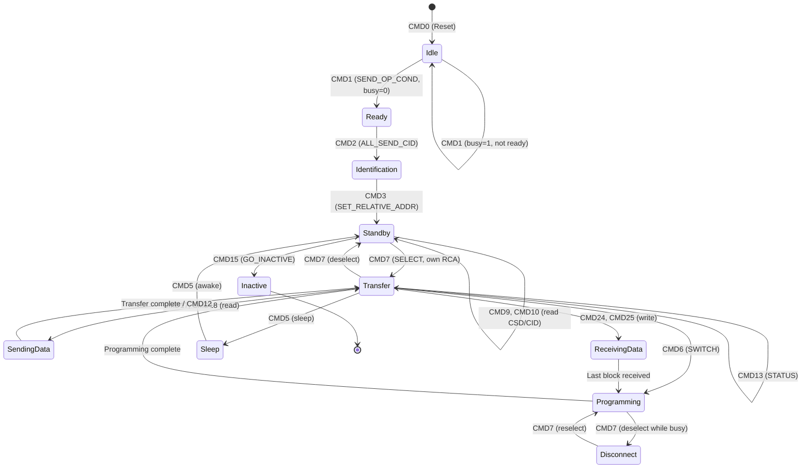

# eMMC (embedded MultiMediaCard) — DIAGRAMS
# ════════════════════════════════════════════════════════════════════
# Protocol: eMMC | Document: 02 of 08
# Format: ASCII art + Mermaid diagrams for visual learning
# ════════════════════════════════════════════════════════════════════

---

## DIAGRAM 1: eMMC Package Internal Architecture

```
┌─────────────────────────────────────────────────────────────────────────┐
│                        eMMC BGA Package (11.5 × 13 mm)                   │
│                                                                           │
│  ┌────────────────────────────────────────────────────────────────────┐  │
│  │                     NAND Flash Array (TLC/3D-NAND)                  │  │
│  │  ┌──────────┐  ┌──────────┐  ┌──────────┐  ┌──────────┐          │  │
│  │  │  Die 0   │  │  Die 1   │  │  Die 2   │  │  Die 3   │          │  │
│  │  │          │  │          │  │          │  │          │          │  │
│  │  │ Planes:  │  │ Planes:  │  │ Planes:  │  │ Planes:  │          │  │
│  │  │ 0,1      │  │ 0,1      │  │ 0,1      │  │ 0,1      │          │  │
│  │  │          │  │          │  │          │  │          │          │  │
│  │  │ Blocks:  │  │ Blocks:  │  │ Blocks:  │  │ Blocks:  │          │  │
│  │  │ 0-2047   │  │ 0-2047   │  │ 0-2047   │  │ 0-2047   │          │  │
│  │  └──────────┘  └──────────┘  └──────────┘  └──────────┘          │  │
│  └────────────────────────────────────────────────────────────────────┘  │
│                              ↕ NAND Interface (ONFI/Toggle)               │
│  ┌────────────────────────────────────────────────────────────────────┐  │
│  │                    Flash Controller ASIC                             │  │
│  │                                                                      │  │
│  │  ┌────────┐  ┌────────────┐  ┌──────────┐  ┌───────────────────┐  │  │
│  │  │ ARM    │  │   SRAM     │  │   ECC    │  │ NAND Flash        │  │  │
│  │  │ Core   │  │ (FTL map   │  │ Engine   │  │ Interface         │  │  │
│  │  │(FW)    │  │  + cache)  │  │ (BCH/LDPC│  │ Controller        │  │  │
│  │  └────────┘  └────────────┘  └──────────┘  └───────────────────┘  │  │
│  │                                                                      │  │
│  │  ┌────────────┐  ┌────────────┐  ┌──────────────────────────────┐  │  │
│  │  │ Wear Level │  │ Bad Block  │  │ Garbage Collection Engine    │  │  │
│  │  │ Engine     │  │ Manager    │  │                              │  │  │
│  │  └────────────┘  └────────────┘  └──────────────────────────────┘  │  │
│  └────────────────────────────────────────────────────────────────────┘  │
│                              ↕ Internal Bus                               │
│  ┌────────────────────────────────────────────────────────────────────┐  │
│  │                    MMC Interface Controller                          │  │
│  │                                                                      │  │
│  │  ┌──────────┐  ┌──────────┐  ┌──────────┐  ┌──────────────────┐  │  │
│  │  │ CMD      │  │ Data     │  │ CRC      │  │ Speed Mode       │  │  │
│  │  │ Parser/  │  │ Path     │  │ Gen/     │  │ Logic            │  │  │
│  │  │ Generator│  │ (TX/RX)  │  │ Check    │  │ (HS400/HS200)    │  │  │
│  │  └──────────┘  └──────────┘  └──────────┘  └──────────────────┘  │  │
│  └────────────────────────────────────────────────────────────────────┘  │
│                                                                           │
├───────────────────────────────────────────────────────────────────────────┤
│  BGA Balls:                                                               │
│  CLK│CMD│DAT0│DAT1│DAT2│DAT3│DAT4│DAT5│DAT6│DAT7│DS│RST_n│VCC│VCCQ│VSS │
└───────────────────────────────────────────────────────────────────────────┘
```

---

## DIAGRAM 2: eMMC Bus Timing — Single Block Read (SDR)

```
CLK     ──┐  ┌──┐  ┌──┐  ┌──┐  ┌──┐  ┌──┐  ┌──┐  ┌──┐  ┌──┐  ┌──┐  ┌──
          └──┘  └──┘  └──┘  └──┘  └──┘  └──┘  └──┘  └──┘  └──┘  └──┘  └──

CMD     ───┤ CMD17 (48 bits) ├────┤ R1 Response (48 bits) ├─── Hi-Z ───────
           │01│110001│Argument│CRC││00│010001│Card Status  │CRC│

DAT[7:0]── Hi-Z ─────────────────────────── 0 │ Data (512 bytes) │ CRC16 │1│
                                              ↑                           ↑
                                         Start bit                   End bit
                                         
Timeline:  │←── Command ──→│←─ Response ─→│← Ncr →│←──── Data ────────→│
           │                │               │ (gap)  │                    │

Ncr: Response delay (0-64 clock cycles)
Nac: Access time before data (device-specific, up to 10ms)
```

---

## DIAGRAM 3: eMMC Bus Timing — HS400 Read with Data Strobe

```
CLK (200MHz)
        ──┐  ┌──┐  ┌──┐  ┌──┐  ┌──┐  ┌──┐  ┌──┐  ┌──┐  ┌──┐  ┌──
          └──┘  └──┘  └──┘  └──┘  └──┘  └──┘  └──┘  └──┘  └──┘  └──

CMD (SDR on CLK rising edge)
        ───┤ CMD17 ├────────────┤ R1 ├──────────────────────────────────

DAT[7:0] (DDR — both edges of DS)
        ── Hi-Z ──────────────────── 0│D0│D1│D2│D3│D4│D5│...│Dn│CRC│1│──
                                      ↑  ↑  ↑  ↑  ↑  ↑
                                      Sampled on DS edges (not CLK!)

DS (Data Strobe — device output)
        ── Low ───────────────────────┐  ┌──┐  ┌──┐  ┌──┐  ┌──┐  ┌──┐
                                      └──┘  └──┘  └──┘  └──┘  └──┘  └──

Host samples DAT on BOTH rising and falling edges of DS
  → Effective data rate: 200 MHz × 2 × 8 bits = 400 MB/s
```

---

## DIAGRAM 4: eMMC Bus Timing — Write with Busy

```
CLK     ──┐  ┌──┐  ┌──┐  ┌──┐  ┌──┐  ┌──┐  ┌──┐  ┌──┐  ┌──┐  ┌──
          └──┘  └──┘  └──┘  └──┘  └──┘  └──┘  └──┘  └──┘  └──┘  └──

CMD     ──┤ CMD24 ├──┤ R1 ├──── Hi-Z ────────────────────────────────────

DAT[7:0]── Hi-Z ──────────── 0│ Data (512B) │ CRC16 │────── Hi-Z ──────
                                                      ↓
DAT[0]  ── Hi-Z ──────────────────────────────────────┤ CRC Status├─ LOW ─
                                                       │(010=OK)   │  ↑
                                                       │(101=ERR)  │  │
                                                                      BUSY
                                                            (device programming)
                                                            
           Host waits for DAT[0] HIGH before next command
           Busy time: ~1ms (write) to ~250ms (erase)
```

---

## DIAGRAM 5: eMMC Partition Layout

```
┌─────────────────────────────────────────────────────────────────────────────┐
│                           eMMC Device (e.g., 128 GB)                         │
├─────────────────────────────────────────────────────────────────────────────┤
│                                                                               │
│  ┌─────────────────────┐  ┌─────────────────────┐  ┌──────────────────┐    │
│  │   Boot Partition 1   │  │   Boot Partition 2   │  │   RPMB            │    │
│  │   (4 MB)             │  │   (4 MB)             │  │   (4 MB)          │    │
│  │                      │  │                      │  │                    │    │
│  │   XBL Bootloader     │  │   XBL Backup         │  │   Secure Keys     │    │
│  │   (Hardware boot)    │  │   (Failover)         │  │   Anti-rollback   │    │
│  │                      │  │                      │  │   HMAC protected  │    │
│  └─────────────────────┘  └─────────────────────┘  └──────────────────┘    │
│                                                                               │
│  ┌──────────────────────────────────────────────────────────────────────┐   │
│  │                        User Data Area (~127.9 GB)                      │   │
│  │                                                                        │   │
│  │  ┌─────────────────────────────────────────────────────────────────┐  │   │
│  │  │  GPT Partition Table                                             │  │   │
│  │  ├──────────┬──────────┬──────────┬──────────┬──────────┬─────────┤  │   │
│  │  │ boot_a   │ boot_b   │system_a  │system_b  │ vendor_a │vendor_b │  │   │
│  │  │ (64MB)   │ (64MB)   │ (4GB)    │ (4GB)    │ (1GB)    │ (1GB)   │  │   │
│  │  ├──────────┼──────────┼──────────┼──────────┼──────────┴─────────┤  │   │
│  │  │ product_a│product_b │ super    │metadata  │     userdata        │  │   │
│  │  │ (2GB)    │ (2GB)    │ (8GB)    │ (16MB)   │     (~100 GB)       │  │   │
│  │  └──────────┴──────────┴──────────┴──────────┴────────────────────┘  │   │
│  │                                                                        │   │
│  └──────────────────────────────────────────────────────────────────────┘   │
│                                                                               │
└─────────────────────────────────────────────────────────────────────────────┘
```

---

## DIAGRAM 6: eMMC State Machine



---

## DIAGRAM 7: HS400 Mode Switch Sequence

```
┌────────────────────────────────────────────────────────────────────────┐
│                    HS400 Switch Sequence                                 │
├────────────────────────────────────────────────────────────────────────┤

  Power On
     │
     ▼
  ┌──────────────┐
  │ Legacy Mode   │  CLK=26MHz, 1-bit, 3.3V
  │ (Identification)│
  └──────┬───────┘
         │ CMD0 → CMD1 → CMD2 → CMD3 → CMD7
         ▼
  ┌──────────────┐
  │ Transfer State│  CLK=26MHz, 1-bit
  └──────┬───────┘
         │ CMD6: BUS_WIDTH = 8-bit (EXT_CSD[183])
         ▼
  ┌──────────────┐
  │ 8-bit Legacy │  CLK=26MHz, 8-bit
  └──────┬───────┘
         │ CMD6: HS_TIMING = HS200 (EXT_CSD[185]=2)
         │ Host sets CLK to 200 MHz
         ▼
  ┌──────────────┐
  │ HS200 Mode   │  CLK=200MHz, 8-bit, SDR, 1.8V
  └──────┬───────┘
         │ CMD21: Tuning (find optimal sample point)
         │    [128-byte pattern, sweep delay line]
         ▼
  ┌──────────────┐
  │ HS200 Tuned  │  Optimal sampling point found
  └──────┬───────┘
         │ Host reduces CLK to ≤52 MHz
         │ CMD6: HS_TIMING = HS (EXT_CSD[185]=1)
         ▼
  ┌──────────────┐
  │ High Speed   │  CLK=52MHz (intermediate step)
  └──────┬───────┘
         │ CMD6: BUS_WIDTH = 8-bit DDR (EXT_CSD[183]=6)
         ▼
  ┌──────────────────┐
  │ DDR 8-bit        │  Ready for HS400
  └──────┬───────────┘
         │ CMD6: HS_TIMING = HS400 (EXT_CSD[185]=3)
         │ Host sets CLK to 200 MHz
         ▼
  ┌──────────────────┐
  │ ★ HS400 ACTIVE ★ │  CLK=200MHz, 8-bit DDR, DS active
  │   400 MB/s        │  Read: sample on DS edges
  └──────────────────┘  Write: device uses CLK edges
```

---

## DIAGRAM 8: ADMA2 Descriptor Chain

```
                    ADMA System Address Register
                              │
                              ▼
          ┌───────────────────────────────────────┐
          │ Descriptor 0 (8 bytes)                 │
          │ Address: 0x8000_0000                   │
          │ Length:  4096                           │
          │ Attr:   Valid=1, End=0, Act=Tran       │
          └──────────────────┬────────────────────┘
                             │ (next descriptor at +8)
                             ▼
          ┌───────────────────────────────────────┐
          │ Descriptor 1 (8 bytes)                 │
          │ Address: 0x8000_3000                   │  ← Non-contiguous!
          │ Length:  4096                           │
          │ Attr:   Valid=1, End=0, Act=Tran       │
          └──────────────────┬────────────────────┘
                             │
                             ▼
          ┌───────────────────────────────────────┐
          │ Descriptor 2 (8 bytes)                 │
          │ Address: 0xC000_0000                   │  ← Link descriptor
          │ Length:  0                              │     (jump to new list)
          │ Attr:   Valid=1, End=0, Act=Link       │
          └──────────────────┬────────────────────┘
                             │ (jump to address 0xC000_0000)
                             ▼
          ┌───────────────────────────────────────┐
          │ Descriptor 3 (at 0xC000_0000)          │
          │ Address: 0x8002_0000                   │
          │ Length:  8192                           │
          │ Attr:   Valid=1, End=1, Act=Tran       │  ← LAST descriptor
          └───────────────────────────────────────┘

  DMA transfers:
    0x8000_0000 → 4096 bytes
    0x8000_3000 → 4096 bytes
    0x8002_0000 → 8192 bytes
    Total: 16384 bytes transferred in one operation
```

---

## DIAGRAM 9: RPMB Authentication Flow

```
┌──────────────────────────────────────────────────────────────────────────┐
│                    RPMB Authenticated Write                                │
├──────────────────────────────────────────────────────────────────────────┤

  Host (TEE/Secure World)                    eMMC RPMB Partition
        │                                          │
        │  1. Read Write Counter                   │
        │─────── CMD23(1, rel_wr) + CMD18 ────────→│
        │                                          │
        │←────── Counter = N (+ MAC) ─────────────│
        │                                          │
        │  2. Verify Counter MAC                   │
        │  3. Prepare Write Frame:                 │
        │     ┌───────────────────────────┐        │
        │     │ Data (256 bytes)          │        │
        │     │ Nonce (optional)          │        │
        │     │ Write Counter = N         │        │
        │     │ Block Address             │        │
        │     │ Block Count               │        │
        │     │ Request Type = Write      │        │
        │     │ HMAC-SHA256(Key, Frame)   │        │
        │     └───────────────────────────┘        │
        │                                          │
        │  4. Send Authenticated Write             │
        │─────── CMD23(1, rel_wr) + CMD25 ────────→│
        │         [Write Data Frame]               │
        │                                          │
        │                          5. Device:      │
        │                          - Verify HMAC   │
        │                          - Check Counter=N│
        │                          - Program NAND  │
        │                          - Counter = N+1 │
        │                                          │
        │  6. Read Result                          │
        │─────── CMD23(1, rel_wr) + CMD18 ────────→│
        │                                          │
        │←────── Result Frame + MAC ──────────────│
        │     ┌───────────────────────────┐        │
        │     │ Result: 0x0000 = Success  │        │
        │     │ Write Counter = N+1       │        │
        │     │ HMAC(Key, Result Frame)   │        │
        │     └───────────────────────────┘        │
        │                                          │
        │  7. Verify Result MAC                    │
        │  ✓ Write confirmed                       │
```

---

## DIAGRAM 10: eMMC Command Format

```
 48-bit Command Frame (Host → Device)
┌─────┬──────────┬────────────────────────────────────┬────────┬─────┐
│Start│Transmit  │              Argument               │  CRC7  │ End │
│ Bit │ Bit + Idx│            (32 bits)                │(7 bits)│ Bit │
│  0  │ 1+XXXXXX │ XXXXXXXXXXXXXXXXXXXXXXXXXXXXXXXX   │XXXXXXX │  1  │
├─────┼──────────┼────────────────────────────────────┼────────┼─────┤
│ 1b  │  7 bits  │            32 bits                  │ 7 bits │ 1b  │
└─────┴──────────┴────────────────────────────────────┴────────┴─────┘
  ↑       ↑                    ↑                          ↑        ↑
  │       │                    │                          │        │
  0    Bit6=1(host)     Varies per command          CRC of       1
       Bit5:0=cmd#      CMD17: block addr           bits [47:8]

 48-bit Response (R1) Frame (Device → Host)
┌─────┬──────────┬────────────────────────────────────┬────────┬─────┐
│  0  │0+cmd_idx │         Card Status (32 bits)      │  CRC7  │  1  │
├─────┼──────────┼────────────────────────────────────┼────────┼─────┤
│ 1b  │  7 bits  │            32 bits                  │ 7 bits │ 1b  │
└─────┴──────────┴────────────────────────────────────┴────────┴─────┘
       ↑                       ↑
       Bit6=0(device)   Error/state bits:
                         [12:9] CURRENT_STATE
                         [8]    READY_FOR_DATA
                         [5]    APP_CMD
                         [31]   ADDRESS_OUT_OF_RANGE
                         [19]   ERROR
```

---

## DIAGRAM 11: Flash Translation Layer (FTL) Operation

```
┌────────────────────────────────────────────────────────────────────────┐
│                    FTL: Logical to Physical Mapping                      │
├────────────────────────────────────────────────────────────────────────┤

  Host writes LBA 0, 1, 2, 3...         Actual NAND layout:

  Logical View (Host):                   Physical View (NAND):
  ┌─────────────────────┐               ┌─────────────────────────────┐
  │ LBA 0 │ Sector 0    │ ──mapping──→  │ Die0, Block 47, Page 3      │
  │ LBA 1 │ Sector 1    │ ──mapping──→  │ Die1, Block 12, Page 7      │
  │ LBA 2 │ Sector 2    │ ──mapping──→  │ Die0, Block 47, Page 4      │
  │ LBA 3 │ Sector 3    │ ──mapping──→  │ Die2, Block 88, Page 0      │
  │  ...  │  ...        │               │  ...                         │
  └─────────────────────┘               └─────────────────────────────┘

  Overwrite LBA 1 (new data):
  ┌─────────────────────────────────────────────────────────────────────┐
  │ 1. Old physical location (Die1, Blk12, Pg7) marked INVALID         │
  │ 2. New data written to FREE page (Die3, Blk5, Pg2)                 │
  │ 3. Mapping table updated: LBA 1 → Die3, Block 5, Page 2            │
  │ 4. Old page eventually reclaimed by Garbage Collection              │
  └─────────────────────────────────────────────────────────────────────┘

  Why? NAND cannot overwrite in-place — must erase entire block first!
  Block = 256-512 pages, Erase = slow (~2ms) → FTL avoids in-place writes
```

---

## DIAGRAM 12: Garbage Collection Process

```
  BEFORE Garbage Collection:
  ═══════════════════════════════════════════════════════════

  Block A (victim - most invalid pages):
  ┌──────┬────────┬──────┬────────┬────────┬──────┐
  │Valid │Invalid │Valid │Invalid │Invalid │Valid │
  │ P0   │  P1    │ P2   │  P3    │  P4    │ P5   │
  └──────┴────────┴──────┴────────┴────────┴──────┘
   (LBA5)          (LBA12)                   (LBA99)

  Free Block C (empty, erased):
  ┌──────┬──────┬──────┬──────┬──────┬──────┐
  │Free  │Free  │Free  │Free  │Free  │Free  │
  └──────┴──────┴──────┴──────┴──────┴──────┘


  GC STEPS:
  ═══════════════════════════════════════════════════════════
  
  Step 1: Copy valid pages from Block A → Block C
  ┌──────────────────────────────────────────────────┐
  │  Read A:P0 → Write C:P0  (LBA5)                  │
  │  Read A:P2 → Write C:P1  (LBA12)                 │
  │  Read A:P5 → Write C:P2  (LBA99)                 │
  └──────────────────────────────────────────────────┘

  Step 2: Update mapping table
  ┌──────────────────────────────────────────────────┐
  │  LBA5  → C:P0  (was A:P0)                        │
  │  LBA12 → C:P1  (was A:P2)                        │
  │  LBA99 → C:P2  (was A:P5)                        │
  └──────────────────────────────────────────────────┘

  Step 3: Erase Block A
  ┌──────┬──────┬──────┬──────┬──────┬──────┐
  │Free  │Free  │Free  │Free  │Free  │Free  │  ← Available for new writes
  └──────┴──────┴──────┴──────┴──────┴──────┘


  AFTER Garbage Collection:
  ═══════════════════════════════════════════════════════════
  
  Block A: [FREE] — reclaimed
  Block C: [LBA5][LBA12][LBA99][Free][Free][Free] — compacted
```

---

## DIAGRAM 13: HS200 Tuning Window

```
  CMD21 Tuning Sweep:
  ═══════════════════════════════════════════════════════════

  Delay Setting →    0    5   10   15   20   25   30   35   40   45   50

  Pattern Match:     ✗    ✗    ✗    ✓    ✓    ✓    ✓    ✓    ✓    ✗    ✗
                                    │←── Valid Window ──→│
                                    │                    │
                                    │    ↓ CENTER        │
                                    │    Selected        │
                                    │    Point           │

  ┌─────────────────────────────────────────────────────────────────────┐
  │                                                                       │
  │   ─────────          ┌─────────────────────────┐         ──────────  │
  │              FAIL    │         PASS              │   FAIL              │
  │   ─────────          └─────────────────────────┘         ──────────  │
  │                      ↑          ↑              ↑                      │
  │                   Left edge   Center       Right edge                 │
  │                   (delay=15)  (delay=27)   (delay=40)                │
  │                                                                       │
  │   Selected sample point = (15 + 40) / 2 = 27                         │
  │   Maximum margin to both edges                                        │
  └─────────────────────────────────────────────────────────────────────┘

  Temperature effect:
  ┌─────────────────────────────────────────────────────────────────────┐
  │   25°C window:  ─────[████████████████████████████████]─────────    │
  │   85°C window:  ─────────────[████████████████]─────────────────    │
  │  105°C window:  ───────────────[██████████]─────────────────────    │
  │                                                                       │
  │   Window shrinks at high temperature → need periodic re-tuning       │
  │   HS400ES eliminates this issue (uses Data Strobe for timing)        │
  └─────────────────────────────────────────────────────────────────────┘
```

---

## DIAGRAM 14: Linux eMMC Driver Stack

```
┌─────────────────────────────────────────────────────────────────────────┐
│                         USER SPACE                                        │
│                                                                           │
│  ┌──────────┐  ┌──────────┐  ┌──────────┐  ┌──────────────────────────┐│
│  │ dd       │  │ fio      │  │ Android  │  │ mmc-utils               ││
│  │ cp       │  │ iozone   │  │ vold     │  │ (mmc extcsd read)       ││
│  │ fsck     │  │          │  │ storaged │  │                          ││
│  └────┬─────┘  └────┬─────┘  └────┬─────┘  └──────────┬───────────────┘│
│       │              │              │                    │                │
├───────┼──────────────┼──────────────┼────────────────────┼────────────────┤
│       ▼              ▼              ▼                    ▼                │
│  ┌─────────────────────────────────────────────────────────────────────┐│
│  │                    VFS (Virtual File System)                          ││
│  │              F2FS / EXT4 / FAT32                                      ││
│  └──────────────────────────┬──────────────────────────────────────────┘│
│                              │                                            │
│  ┌──────────────────────────┼──────────────────────────────────────────┐│
│  │            Device Mapper  │  (dm-crypt, dm-verity)                    ││
│  └──────────────────────────┼──────────────────────────────────────────┘│
│                              │                                            │
│  ┌──────────────────────────┼──────────────────────────────────────────┐│
│  │          Block Layer (blk-mq)                                         ││
│  │    bio → request merging → I/O scheduler → dispatch                   ││
│  └──────────────────────────┬──────────────────────────────────────────┘│
│                              │                                            │
│  ┌──────────────────────────┼──────────────────────────────────────────┐│
│  │          MMC Block Driver (mmc_blk.c)                                 ││
│  │    /dev/mmcblk0, /dev/mmcblk0boot0, /dev/mmcblk0rpmb                 ││
│  │    mmc_blk_issue_rw_rq() → packed_cmd / CQ / single                  ││
│  └──────────────────────────┬──────────────────────────────────────────┘│
│                              │                                            │
│  ┌──────────────────────────┼──────────────────────────────────────────┐│
│  │          MMC Core (core.c, mmc.c, mmc_ops.c)                         ││
│  │    Card detect, init sequence, protocol FSM                           ││
│  │    mmc_send_cmd() → host_ops->request()                               ││
│  └──────────────────────────┬──────────────────────────────────────────┘│
│                              │                                            │
│  ┌──────────────────────────┼──────────────────────────────────────────┐│
│  │          CQHCI Driver (cqhci.c)                                       ││
│  │    Command Queue hardware interface                                    ││
│  │    Task descriptor ring, doorbell, completion                          ││
│  └──────────────────────────┬──────────────────────────────────────────┘│
│                              │                                            │
│  ┌──────────────────────────┼──────────────────────────────────────────┐│
│  │          SDHCI-MSM Host Driver (sdhci-msm.c)                         ││
│  │    Qualcomm-specific: clocks, pinctrl, DLL tuning                     ││
│  │    Register programming, ADMA2 setup, interrupt handling              ││
│  └──────────────────────────┬──────────────────────────────────────────┘│
│                              │                                            │
├──────────────────────────────┼────────────────────────────────────────────┤
│                              ▼          HARDWARE                          │
│  ┌─────────────────────────────────────────────────────────────────────┐│
│  │          SDCC Hardware Block (in SA8295P SoC)                         ││
│  │    SDHCI registers, DMA engine, clock divider                         ││
│  └──────────────────────────┬──────────────────────────────────────────┘│
│                              │ (CLK, CMD, DAT[7:0], DS)                   │
│                              ▼                                            │
│  ┌─────────────────────────────────────────────────────────────────────┐│
│  │          eMMC Chip (BGA, soldered on board)                           ││
│  └─────────────────────────────────────────────────────────────────────┘│
└─────────────────────────────────────────────────────────────────────────┘
```

---

## DIAGRAM 15: Command Queue Operation

```
┌────────────────────────────────────────────────────────────────────────┐
│                    Command Queue (CQ) Flow                               │
├────────────────────────────────────────────────────────────────────────┤

  Host                                         eMMC Device
    │                                              │
    │  CMD44 (Task 0: Read, 256 blocks)            │
    │─────────────────────────────────────────────→│  Slot 0: queued
    │  CMD45 (Task 0: Address = 0x1000)            │
    │─────────────────────────────────────────────→│
    │                                              │
    │  CMD44 (Task 1: Write, 128 blocks)           │
    │─────────────────────────────────────────────→│  Slot 1: queued
    │  CMD45 (Task 1: Address = 0x5000)            │
    │─────────────────────────────────────────────→│
    │                                              │
    │  CMD44 (Task 2: Read, 64 blocks)             │
    │─────────────────────────────────────────────→│  Slot 2: queued
    │  CMD45 (Task 2: Address = 0x3000)            │
    │─────────────────────────────────────────────→│
    │                                              │
    │  Device selects optimal execution order:     │
    │  (May reorder: Task 0, Task 2, Task 1)       │
    │                                              │
    │  CMD46 (Execute Read Task 0)                 │
    │─────────────────────────────────────────────→│
    │←──────── Data (256 blocks) ─────────────────│  Task 0 complete
    │                                              │
    │  CMD46 (Execute Read Task 2)                 │
    │─────────────────────────────────────────────→│
    │←──────── Data (64 blocks) ──────────────────│  Task 2 complete
    │                                              │
    │  CMD47 (Execute Write Task 1)                │
    │─────────────────────────────────────────────→│
    │──────── Data (128 blocks) ──────────────────→│
    │←──────── Busy (programming) ────────────────│  Task 1 complete
    │                                              │

  ┌─────────────────────────────────────────────────────────────┐
  │ Task Descriptor (inside device):                             │
  │ ┌──────┬────────────┬──────────────┬─────────────┬────────┐ │
  │ │Slot  │Direction   │Block Count   │Block Address│Priority│ │
  │ ├──────┼────────────┼──────────────┼─────────────┼────────┤ │
  │ │  0   │ Read       │ 256          │ 0x1000      │ Normal │ │
  │ │  1   │ Write      │ 128          │ 0x5000      │ Normal │ │
  │ │  2   │ Read       │ 64           │ 0x3000      │ High   │ │
  │ │ ...  │ ...        │ ...          │ ...         │ ...    │ │
  │ │  31  │ (empty)    │              │             │        │ │
  │ └──────┴────────────┴──────────────┴─────────────┴────────┘ │
  └─────────────────────────────────────────────────────────────┘
```

---

## DIAGRAM 16: eMMC Power Sequence

```
                     Power-Up Sequence
  ═══════════════════════════════════════════════════════════

  VCC (3.3V)  ────────┐
                      │     ┌────────────────────────────────
                      └─────┘  Ramp: <100µs
                              ↑
  VCCQ (1.8V) ────────┐      │ VCC stable first, then VCCQ
                      │  ┌───┘  ┌────────────────────────────
                      └──┘      │
                                ↑
  RST_n       ─────────────────┐│    ┌───────────────────────
                               └┘    │  Hold LOW ≥1µs after power stable
                                ↑    ↑
  CLK         ─────────────────────┐ │  ┌─┐ ┌─┐ ┌─┐ ┌─┐ ┌─
                                   └─┘  │ └─┘ └─┘ └─┘ └─┘ └─
                                        ↑
  CMD         ─── Hi-Z ────────────────────CMD0──CMD1──CMD2──→
                                              ↑
                                         Initialization begins
                                         (74 clock cycles after
                                          power stable)

  Timeline:
  │←── Power ramp ──→│←─ RST hold ─→│←─ 74 clocks ─→│← Init →│
  │     <5ms         │    ≥1µs       │   ~3µs @26MHz  │         │
  

                     Power-Off Notification Sequence
  ═══════════════════════════════════════════════════════════

  Normal Operation
        │
        ▼
  CMD6 (POWER_OFF_NOTIFICATION = SHORT)
        │
        ▼
  Device flushes cache to NAND (may take 1-10ms)
        │
        ▼
  Busy signal released (DAT[0] HIGH)
        │
        ▼
  Host can safely remove VCC/VCCQ
        │
        ▼
  Power rails ramp down

  ⚠️  WITHOUT power-off notification:
      Cached data LOST, FTL mapping may be inconsistent
      Risk of filesystem corruption!
```

---

## DIAGRAM 17: eMMC in SA8295P Automotive System

```
┌─────────────────────────────────────────────────────────────────────────┐
│                     SA8295P Automotive Cockpit SoC                        │
├─────────────────────────────────────────────────────────────────────────┤
│                                                                           │
│  ┌──────────────────────┐     ┌──────────────────────────────────────┐  │
│  │  CPU Cluster          │     │  Peripheral Bus                      │  │
│  │  (Cortex-A78 + A55)  │     │                                      │  │
│  │                       │     │  ┌────────────────────────────────┐  │  │
│  │  ┌─────────┐         │     │  │         SDCC0 (eMMC)            │  │  │
│  │  │ Android │         │     │  │  SDHCI + CQHCI + ADMA2          │  │  │
│  │  │  AAOS   │         │     │  │  Bus: 8-bit HS400ES             │  │  │
│  │  │         │←────────┼─────┼──│  CLK: 200 MHz                   │  │  │
│  │  │/system  │  AXI    │     │  │  BW: 400 MB/s                   │  │  │
│  │  │/vendor  │  Bus    │     │  └──────────────┬─────────────────┘  │  │
│  │  │/data    │         │     │                  │                    │  │
│  │  └─────────┘         │     │  ┌────────────────────────────────┐  │  │
│  │                       │     │  │         SDCC1 (SD Card)         │  │  │
│  │  ┌─────────┐         │     │  │  4-bit, removable               │  │  │
│  │  │   XBL   │         │     │  │  Navigation maps                │  │  │
│  │  │Bootloader│←───────┼─────┼──│                                  │  │  │
│  │  │(from boot│ Boot   │     │  └──────────────────────────────────┘  │  │
│  │  │partition)│ path   │     │                                      │  │
│  │  └─────────┘         │     └──────────────────────────────────────┘  │
│  └──────────────────────┘                                                │
│                                                                           │
├─────────────────────────────────────────────────────────────────────────┤
│  External:                                     │  CLK, CMD, DAT[7:0], DS │
│                                                ▼                          │
│  ┌─────────────────────────────────────────────────────────────────┐    │
│  │                    eMMC BGA (Samsung/Micron/SK Hynix)             │    │
│  │                    128 GB / HS400ES / -40°C to +105°C            │    │
│  │                                                                   │    │
│  │    Boot1 (4MB)  │  Boot2 (4MB)  │  RPMB (16MB)  │  User (127GB) │    │
│  └─────────────────────────────────────────────────────────────────┘    │
└─────────────────────────────────────────────────────────────────────────┘
```

---

## DIAGRAM 18: Write Amplification Illustration

```
┌────────────────────────────────────────────────────────────────────────┐
│              Write Amplification Factor (WAF) Example                    │
├────────────────────────────────────────────────────────────────────────┤

  Host writes 4KB (1 page) to LBA X:
  ═══════════════════════════════════════════════════════════

  BEST CASE: Free page available (WAF = 1.0)
  ┌──────────────────────────────────────────────────┐
  │  Host write: 4KB → FTL writes: 4KB to free page  │
  │  Physical NAND write = 4KB                        │
  │  WAF = 4KB / 4KB = 1.0                            │
  └──────────────────────────────────────────────────┘

  WORST CASE: No free blocks, GC triggered (WAF = 64)
  ┌──────────────────────────────────────────────────┐
  │  Host write: 4KB                                  │
  │  1. GC: Read 252KB valid data from victim block   │
  │  2. GC: Erase victim block                        │
  │  3. GC: Write 252KB valid data to new block       │
  │  4. Write 4KB host data to freed space            │
  │  Physical NAND write = 252KB + 4KB = 256KB        │
  │  WAF = 256KB / 4KB = 64 !!!                       │
  └──────────────────────────────────────────────────┘

  TYPICAL Mixed Workload: WAF = 2-4
  ┌──────────────────────────────────────────────────┐
  │  Mitigation:                                      │
  │  • TRIM: Inform device of freed blocks early      │
  │  • Over-provision: Keep 20% free blocks           │
  │  • Sequential writes: Fill blocks completely      │
  │  • BKOPS: Let device GC during idle               │
  └──────────────────────────────────────────────────┘
```

---

## DIAGRAM 19: SDHCI Register Map (Key Registers)

```
  SDHCI Standard Register Map (Memory-Mapped):
  ═══════════════════════════════════════════════════════════

  Offset  Size  Register Name              Key Bits
  ──────  ────  ─────────────────────────  ─────────────────────
  0x00    32b   SDMA System Address        DMA buffer address
  0x04    16b   Block Size                 Transfer block size
  0x06    16b   Block Count                Number of blocks
  0x08    32b   Argument                   CMD argument
  0x0C    16b   Transfer Mode              DMA/BlockCount/Direction
  0x0E    16b   Command                    CMD index + type
  0x10    128b  Response[0-3]              R1/R2 response data
  0x20    32b   Buffer Data Port           PIO data read/write
  0x24    32b   Present State              Card detect, busy, etc.
  0x28    8b    Host Control 1             Bus width, HS, DMA select
  0x29    8b    Power Control              SD bus power on/off
  0x2C    16b   Clock Control              CLK divider, enable
  0x2E    8b    Timeout Control            Data timeout counter
  0x2F    8b    Software Reset             Reset CMD/DAT/ALL
  0x30    16b   Normal Interrupt Status    CMD complete, xfer done
  0x32    16b   Error Interrupt Status     CRC, timeout, etc.
  0x34    16b   Normal Interrupt Enable    Mask bits
  0x36    16b   Error Interrupt Enable     Mask bits
  0x3C    16b   Auto CMD Error Status      Auto CMD12 errors
  0x3E    16b   Host Control 2             UHS mode, tuning
  0x40    32b   Capabilities               Max speed, DMA support
  0x48    32b   Max Current                Max current capabilities
  0x58    32b   ADMA Error Status          ADMA error info
  0x58    64b   ADMA System Address        ADMA descriptor pointer
  0xFC    16b   Host Controller Version    SDHCI spec version

  ┌─────────────────────────────────────────────────────────────┐
  │  Transfer Mode Register (0x0C) bits:                         │
  │    Bit 0: DMA Enable                                         │
  │    Bit 1: Block Count Enable                                 │
  │    Bit 2: Auto CMD12 Enable                                  │
  │    Bit 4: Data Transfer Direction (1=Read, 0=Write)          │
  │    Bit 5: Multi/Single Block Select                          │
  └─────────────────────────────────────────────────────────────┘
```

---

## DIAGRAM 20: Boot Sequence from eMMC

```
┌────────────────────────────────────────────────────────────────────────┐
│                    eMMC Hardware Boot Sequence                           │
├────────────────────────────────────────────────────────────────────────┤

  Power On / RST_n Released
       │
       ▼
  ┌─────────────────────────────────────────────────────────────────────┐
  │  SoC Boot ROM                                                        │
  │  • Reads BOOT_CONFIG fuses → selects eMMC boot                       │
  │  • Initializes SDCC in 1-bit Legacy mode                             │
  │  • Asserts CMD line LOW for >74 clock cycles (boot mode entry)       │
  └──────────────────────────────┬──────────────────────────────────────┘
                                 │
                                 ▼
  ┌─────────────────────────────────────────────────────────────────────┐
  │  eMMC enters BOOT mode                                               │
  │  • Detects CMD held LOW → alternative boot mode                      │
  │  • Starts streaming Boot Partition data on DAT lines                  │
  │  • No commands needed — pure data streaming                          │
  │  • Bus width per BOOT_BUS_CONDITIONS (EXT_CSD[177])                  │
  └──────────────────────────────┬──────────────────────────────────────┘
                                 │
                                 ▼
  ┌─────────────────────────────────────────────────────────────────────┐
  │  Boot ROM receives XBL/SPL bootloader                                │
  │  • Data loaded to SRAM                                               │
  │  • Integrity verified (signature check)                              │
  │  • Jump to XBL entry point                                           │
  └──────────────────────────────┬──────────────────────────────────────┘
                                 │
                                 ▼
  ┌─────────────────────────────────────────────────────────────────────┐
  │  XBL (eXtensible Boot Loader)                                        │
  │  • Re-initializes eMMC in full HS200/HS400 mode                     │
  │  • Reads ABL (Android Boot Loader) from User Area                    │
  │  • Performs A/B slot selection                                        │
  │  • Loads kernel + ramdisk from boot_a or boot_b                      │
  └──────────────────────────────┬──────────────────────────────────────┘
                                 │
                                 ▼
  ┌─────────────────────────────────────────────────────────────────────┐
  │  Linux Kernel                                                        │
  │  • sdhci-msm driver probes                                           │
  │  • eMMC re-initialized (may upgrade to HS400ES)                      │
  │  • /dev/mmcblk0 available                                            │
  │  • init mounts system, vendor, userdata                              │
  └─────────────────────────────────────────────────────────────────────┘
```

---

END OF DOCUMENT 02 — DIAGRAMS
