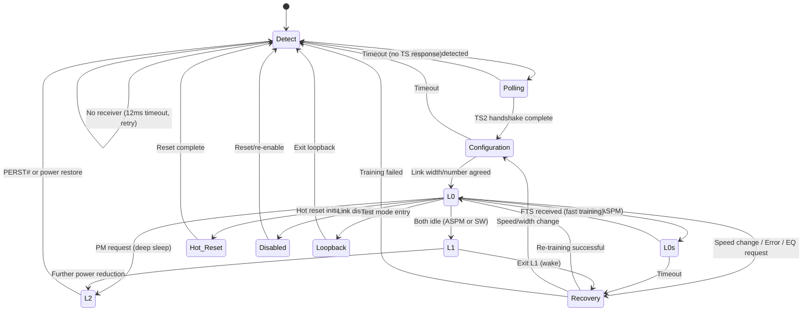
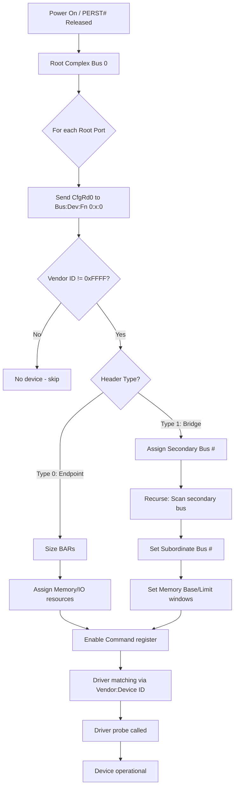

# PCI EXPRESS (PCIe) — DIAGRAMS & VISUAL REFERENCE
# ════════════════════════════════════════════════════════════════════
# Protocol: PCI Express (PCIe) | Document: 02 of 08
# Format: ASCII art + Mermaid diagrams — visual learning
# ════════════════════════════════════════════════════════════════════

---

## DIAGRAM 1: PCIe LAYER ARCHITECTURE

```
┌─────────────────────────────────────────────────────────────────────┐
│                    SOFTWARE / DEVICE DRIVER                          │
│  ┌──────────┐  ┌──────────┐  ┌──────────┐  ┌──────────────────┐   │
│  │ lspci    │  │ NVMe drv │  │ WiFi drv │  │ User-space app   │   │
│  └──────────┘  └──────────┘  └──────────┘  └──────────────────┘   │
├─────────────────────────────────────────────────────────────────────┤
│                    TRANSACTION LAYER (TL)                            │
│  ┌─────────────────────────────────────────────────────────────┐   │
│  │ TLP Generation & Parsing                                     │   │
│  │ • Memory Read/Write    • Config Read/Write                   │   │
│  │ • IO Read/Write        • Message/Completion                  │   │
│  │ • Flow Control (credit accounting)                           │   │
│  │ • Ordering rules (Posted > Non-Posted, Completions)          │   │
│  │ • Virtual Channels & Traffic Classes                         │   │
│  └─────────────────────────────────────────────────────────────┘   │
├─────────────────────────────────────────────────────────────────────┤
│                    DATA LINK LAYER (DLL)                             │
│  ┌─────────────────────────────────────────────────────────────┐   │
│  │ Reliability & Integrity                                      │   │
│  │ • Sequence numbering (12-bit)                                │   │
│  │ • LCRC generation/check (32-bit CRC)                         │   │
│  │ • ACK/NAK protocol                                           │   │
│  │ • Replay Buffer (retransmission)                             │   │
│  │ • DLLP generation (ACK, NAK, FC Update, PM)                  │   │
│  │ • Power Management DLLPs                                     │   │
│  └─────────────────────────────────────────────────────────────┘   │
├─────────────────────────────────────────────────────────────────────┤
│                    PHYSICAL LAYER (PHY)                              │
│  ┌──────────────────────────────┬──────────────────────────────┐   │
│  │    LOGICAL SUB-BLOCK         │     ELECTRICAL SUB-BLOCK     │   │
│  │ • Encoding (8b/10b, 128b/130b)│ • TX Driver (diff. pairs)  │   │
│  │ • Scrambling/Descrambling    │ • RX Receiver (CDR, EQ)      │   │
│  │ • Framing & Alignment       │ • PLL (clock generation)      │   │
│  │ • Lane-to-lane deskew       │ • Impedance: 85-100Ω diff     │   │
│  │ • Ordered Sets (TS1/TS2/SKP)│ • ESD protection             │   │
│  │ • LTSSM state machine       │ • Equalization (CTLE+DFE)    │   │
│  └──────────────────────────────┴──────────────────────────────┘   │
└─────────────────────────────────────────────────────────────────────┘
         │                                        │
         ▼ TX (differential pair)                 ▼ RX (differential pair)
    ═══════╗                                 ╔═══════
    Dp  ───╫──── →  CHANNEL  → ────────────→╫─── Dp
    Dn  ───╫──── →  (trace)  → ────────────→╫─── Dn
    ═══════╝                                 ╚═══════
```

---

## DIAGRAM 2: PCIe TOPOLOGY (Automotive SA8295P System)

```
                          ┌─────────────────────┐
                          │     SA8295P SoC      │
                          │                     │
                          │  ┌───────────────┐  │
                          │  │  Root Complex  │  │
                          │  │   (Bus 0)      │  │
                          │  └───┬───┬───┬───┘  │
                          │      │   │   │      │
                          │  ┌───┘   │   └───┐  │
                          │  │       │       │  │
                          │  ▼       ▼       ▼  │
                          │ RP0    RP1     RP2   │
                          │(0:1.0)(0:2.0)(0:3.0) │
                          └──┼───────┼───────┼──┘
                             │       │       │
         ┌───────────────────┘       │       └──────────────────┐
         │ PCIe Gen3 x1              │ PCIe Gen3 x4             │ PCIe Gen3 x1
         │                           │                          │
    ┌────┴────────┐          ┌───────┴──────┐          ┌───────┴──────┐
    │  QCA6696    │          │  NVMe SSD    │          │  Marvell     │
    │  Wi-Fi 6E  │          │  (Samsung    │          │  88Q5050     │
    │  (1:0.0)   │          │   PM991a)    │          │  Ethernet    │
    │             │          │  (2:0.0)     │          │  Switch      │
    │  BAR0: 2MB │          │  BAR0: 64KB  │          │  (3:0.0)     │
    │  MSI-X: 32 │          │  MSI-X: 16   │          │  BAR0: 1MB   │
    │  DMA rings │          │  SQ/CQ pairs │          │  MSI-X: 8    │
    └─────────────┘          └──────────────┘          └──────────────┘
```

---

## DIAGRAM 3: TLP PACKET FORMAT

```
Memory Write TLP (4DW Header + Data):
┌──────────────────────────────────────────────────────────────────┐
│                     DATA LINK LAYER FRAMING                        │
│ ┌────────────┬──────────────────────────────────────┬──────────┐ │
│ │ Seq# (12b) │              TLP                      │LCRC (32b)│ │
│ └────────────┼──────────────────────────────────────┼──────────┘ │
│              │                                      │            │
│              ▼                                      │            │
│  ┌─────────────────────────────────────────────────┐│            │
│  │ DW0: Fmt(3)|Type(5)|TC(3)|...|TD|EP|Attr|Len(10)││            │
│  ├─────────────────────────────────────────────────┤│            │
│  │ DW1: Requester ID (16) | Tag (8) | Last/1st BE  ││            │
│  ├─────────────────────────────────────────────────┤│            │
│  │ DW2: Address [63:32] (upper 32 bits)            ││            │
│  ├─────────────────────────────────────────────────┤│            │
│  │ DW3: Address [31:2] | Reserved | PH             ││            │
│  ├─────────────────────────────────────────────────┤│            │
│  │ Data DW0: Payload byte 0-3                      ││            │
│  ├─────────────────────────────────────────────────┤│            │
│  │ Data DW1: Payload byte 4-7                      ││            │
│  ├─────────────────────────────────────────────────┤│            │
│  │ ...  (up to MPS bytes)                          ││            │
│  ├─────────────────────────────────────────────────┤│            │
│  │ ECRC (32b) — optional (if TD=1)                 ││            │
│  └─────────────────────────────────────────────────┘│            │
└──────────────────────────────────────────────────────────────────┘

Short TLP examples (3DW header, no data):
  Memory Read 32-bit:  [Fmt=000|Type=00000] + ReqID + Tag + BE + Addr32
  Config Read Type 0:  [Fmt=000|Type=00100] + ReqID + Tag + Bus/Dev/Fn + Reg

Completion with Data (3DW header + data):
  [Fmt=010|Type=01010] + CompleterID + Status + ByteCount + ReqID + Tag + LowerAddr
```

---

## DIAGRAM 4: FLOW CONTROL MECHANISM

```
          SENDER (Root Complex)                    RECEIVER (Endpoint)
    ┌─────────────────────────┐            ┌─────────────────────────┐
    │                         │            │                         │
    │  Credit Counter:        │            │  Buffer Space:          │
    │  ┌──────────────────┐   │            │  ┌──────────────────┐   │
    │  │ PH:  8  (avail)  │   │            │  │ P Buffer: ████░░ │   │
    │  │ PD:  32 (avail)  │   │            │  │ NP Buffer: ██░░░ │   │
    │  │ NPH: 4  (avail)  │   │            │  │ Cpl Buffer:█░░░░ │   │
    │  │ NPD: 16 (avail)  │   │            │  │ (█=used ░=free)  │   │
    │  │ CplH: 8 (avail)  │   │            │  └──────────────────┘   │
    │  │ CplD: 32 (avail) │   │            │                         │
    │  └──────────────────┘   │            │                         │
    │                         │            │                         │
    │  Send TLP:              │   TLP      │  Receive TLP:           │
    │  1. Check credits ≥ need│──────────→ │  1. Store in buffer     │
    │  2. Deduct credits      │            │  2. Process             │
    │  3. Transmit            │            │  3. Free buffer         │
    │                         │  UpdateFC  │  4. Send UpdateFC DLLP  │
    │  Receive UpdateFC:      │←────────── │                         │
    │  Add credits back       │            │                         │
    │                         │            │                         │
    │  If credits = 0:        │            │                         │
    │  ╔════════════════╗     │            │                         │
    │  ║  STALL! Wait   ║     │            │                         │
    │  ║  for UpdateFC  ║     │            │                         │
    │  ╚════════════════╝     │            │                         │
    └─────────────────────────┘            └─────────────────────────┘
```

---

## DIAGRAM 5: ACK/NAK RETRY PROTOCOL

```
    SENDER                                           RECEIVER
    ══════                                           ════════
    
    ┌─────────┐
    │Replay   │   TLP(Seq=0) + LCRC
    │Buffer:  │ ─────────────────────────────────→  CRC OK ✓
    │ [Seq 0] │                                     Store TLP
    │ [Seq 1] │   TLP(Seq=1) + LCRC
    │ [Seq 2] │ ─────────────────────────────────→  CRC OK ✓
    │         │                                     Store TLP
    │         │   TLP(Seq=2) + LCRC
    │         │ ─────────────────────────────────→  CRC FAIL ✗
    │         │                                     
    │         │                     ACK(Seq=1)
    │ Remove  │ ←─────────────────────────────────  (ACKs up to Seq 1)
    │ [Seq 0] │
    │ [Seq 1] │                     NAK(Seq=2)
    │         │ ←─────────────────────────────────  (NAK for Seq 2)
    │         │
    │ REPLAY: │   TLP(Seq=2) + LCRC  (retransmit)
    │         │ ─────────────────────────────────→  CRC OK ✓
    │         │                                     
    │         │                     ACK(Seq=2)
    │ Remove  │ ←─────────────────────────────────
    │ [Seq 2] │
    └─────────┘
    
    REPLAY_TIMER: If no ACK within timeout → auto-replay all pending
    REPLAY_NUM:   Max retries = 4 before declaring link failure
```

---

## DIAGRAM 6: LTSSM STATE MACHINE



---

## DIAGRAM 7: LINK TRAINING SEQUENCE (Timeline)

```
         Root Complex (RC)                    Endpoint (EP)
              │                                    │
   DETECT     │    Tx common-mode pulse            │
   ═══════    │ ──────────────────────────────→    │
              │    Impedance detected (50Ω)        │ DETECT
              │ ←──────────────────────────────    │ ═══════
              │                                    │
   POLLING    │    TS1 TS1 TS1 TS1 TS1 ...         │
   ═══════    │ ──────────────────────────────→    │ POLLING
              │                                    │ ═══════
              │    TS1 TS1 TS1 TS1 TS1 ...         │
              │ ←──────────────────────────────    │
              │         (Bit lock achieved)         │
              │    TS2 TS2 TS2 TS2 TS2 ...         │
              │ ──────────────────────────────→    │
              │    TS2 TS2 TS2 TS2 TS2 ...         │
              │ ←──────────────────────────────    │
              │                                    │
   CONFIG     │    TS1 (Link#, Lane#, Width)        │
   ═══════    │ ──────────────────────────────→    │ CONFIG
              │    TS1 (Link#, Lane#, Width)        │ ═══════
              │ ←──────────────────────────────    │
              │    TS2 (confirmed)                  │
              │ ←─────────────────────────────→    │
              │                                    │
   L0         │    ◄═══ NORMAL TRAFFIC ═══►        │ L0
   ═══════    │    TLPs, DLLPs, flow control       │ ═══════
              │                                    │
              │                                    │
   RECOVERY   │    TS1 (speed change=Gen3)         │
   ═══════    │ ──────────────────────────────→    │ RECOVERY
              │    (Equalization Phases 0-3)        │ ═══════
              │    TS1/TS2 at new speed             │
              │ ←─────────────────────────────→    │
              │                                    │
   L0 @Gen3   │    ◄═══ HIGH-SPEED TRAFFIC ═══►   │ L0 @Gen3
   ═══════    │    8 GT/s per lane                 │ ═══════
              │                                    │
```

---

## DIAGRAM 8: CONFIGURATION SPACE MAP

```
        TYPE 0 HEADER (Endpoint)                    TYPE 1 HEADER (Bridge/Port)
┌─────────────────────────────────────┐    ┌─────────────────────────────────────┐
│0x00 Vendor ID    │ Device ID        │    │0x00 Vendor ID    │ Device ID        │
├─────────────────────────────────────┤    ├─────────────────────────────────────┤
│0x04 Command      │ Status           │    │0x04 Command      │ Status           │
├─────────────────────────────────────┤    ├─────────────────────────────────────┤
│0x08 RevID │     Class Code          │    │0x08 RevID │     Class Code          │
├─────────────────────────────────────┤    ├─────────────────────────────────────┤
│0x0C CLS │LatTmr│HdrType│BIST       │    │0x0C CLS │LatTmr│HdrType│BIST       │
├─────────────────────────────────────┤    ├─────────────────────────────────────┤
│0x10 BAR 0                           │    │0x10 BAR 0                           │
├─────────────────────────────────────┤    ├─────────────────────────────────────┤
│0x14 BAR 1                           │    │0x14 BAR 1                           │
├─────────────────────────────────────┤    ├─────────────────────────────────────┤
│0x18 BAR 2                           │    │0x18 PriBus│SecBus│SubBus│SecLatTmr  │
├─────────────────────────────────────┤    ├─────────────────────────────────────┤
│0x1C BAR 3                           │    │0x1C IO Base│IO Lim│SecStat          │
├─────────────────────────────────────┤    ├─────────────────────────────────────┤
│0x20 BAR 4                           │    │0x20 Mem Base      │ Mem Limit       │
├─────────────────────────────────────┤    ├─────────────────────────────────────┤
│0x24 BAR 5                           │    │0x24 Prefetch Base │ Prefetch Limit  │
├─────────────────────────────────────┤    ├─────────────────────────────────────┤
│0x28 CardBus CIS Pointer             │    │0x28 Prefetch Base Upper 32          │
├─────────────────────────────────────┤    ├─────────────────────────────────────┤
│0x2C SubVendor ID │ Subsystem ID     │    │0x2C Prefetch Limit Upper 32         │
├─────────────────────────────────────┤    ├─────────────────────────────────────┤
│0x30 Expansion ROM Base              │    │0x30 IO Base Upper │ IO Limit Upper  │
├─────────────────────────────────────┤    ├─────────────────────────────────────┤
│0x34 Cap Ptr │ Reserved              │    │0x34 Cap Ptr │ Reserved              │
├─────────────────────────────────────┤    ├─────────────────────────────────────┤
│0x38 Reserved                        │    │0x38 Expansion ROM Base              │
├─────────────────────────────────────┤    ├─────────────────────────────────────┤
│0x3C IntLine│IntPin│MinGnt│MaxLat    │    │0x3C IntLine│IntPin│BridgeCtrl       │
└─────────────────────────────────────┘    └─────────────────────────────────────┘

         EXTENDED CONFIGURATION SPACE (0x100 - 0xFFF)
┌─────────────────────────────────────────────────────────────────┐
│0x100 AER Extended Capability                                     │
├─────────────────────────────────────────────────────────────────┤
│0x148 ACS Extended Capability (if present)                        │
├─────────────────────────────────────────────────────────────────┤
│0x178 SR-IOV Extended Capability (if present)                     │
├─────────────────────────────────────────────────────────────────┤
│0x1E0 L1 PM Substates (if present)                                │
├─────────────────────────────────────────────────────────────────┤
│ ... more extended capabilities up to 0xFFF ...                   │
└─────────────────────────────────────────────────────────────────┘
```

---

## DIAGRAM 9: MSI-X INTERRUPT MECHANISM

```
┌───────────────────────────────────────────────────────────────────┐
│  HOST SYSTEM                                                       │
│                                                                    │
│  ┌──────────┐     ┌─────────────┐     ┌─────────────────────┐   │
│  │  CPU 0   │     │  CPU 1      │     │  GIC / APIC         │   │
│  │  Core 0  │     │  Core 0     │     │  (Interrupt Ctrl)    │   │
│  └──────────┘     └─────────────┘     └──────────┬──────────┘   │
│                                                   │               │
│       System Memory                               │               │
│  ┌────────────────────────────────────────────────┼───────────┐  │
│  │  MSI-X Address Target (GIC_SPI_BASE + offset)  │           │  │
│  │  e.g., 0xFEE00000 (x86) or GIC_ITS (ARM)      │           │  │
│  └────────────────────────────────────────────────────────────┘  │
│                          ↑                                        │
│                          │ Memory Write TLP                       │
└──────────────────────────┼────────────────────────────────────────┘
                           │
                    PCIe Link
                           │
┌──────────────────────────┼────────────────────────────────────────┐
│  PCIe ENDPOINT (e.g., NVMe SSD)                                   │
│                          │                                        │
│  MSI-X Table (in BAR2):  │                                        │
│  ┌───────┬───────────────┬──────────┬─────────┐                 │
│  │Vector │ Msg Addr      │ Msg Data │ Mask    │                 │
│  ├───────┼───────────────┼──────────┼─────────┤                 │
│  │   0   │ 0xFEE00000    │ 0x0040   │ 0 (on)  │ ← Admin Queue  │
│  │   1   │ 0xFEE01000    │ 0x0041   │ 0 (on)  │ ← IO Queue 1   │
│  │   2   │ 0xFEE02000    │ 0x0042   │ 0 (on)  │ ← IO Queue 2   │
│  │  ...  │ ...           │ ...      │ ...     │                 │
│  │  15   │ 0xFEE0F000    │ 0x004F   │ 0 (on)  │ ← IO Queue 15  │
│  └───────┴───────────────┴──────────┴─────────┘                 │
│                                                                    │
│  To send interrupt:                                               │
│  1. Device writes MsgData to MsgAddr → generates MWr TLP         │
│  2. TLP routed to GIC → translated to IRQ                        │
│  3. CPU handles interrupt                                         │
└───────────────────────────────────────────────────────────────────┘
```

---

## DIAGRAM 10: POWER STATE TRANSITIONS

```
                    ┌───────────────┐
         ┌────────→│      L0       │←────────────────────────┐
         │         │  (Active)     │                          │
         │         │  Full BW      │                          │
         │         └───┬───────┬───┘                          │
         │             │       │                              │
         │   TX idle   │       │  Both idle                   │
         │   (ASPM)    │       │  (ASPM/SW)                   │
         │             ▼       ▼                              │
         │    ┌─────────┐   ┌─────────┐                      │
         │    │   L0s   │   │   L1    │                      │
         │    │(Standby)│   │(Low Pwr)│                      │
         │    │~100µW   │   │ ~10µW   │                      │
         │    │Exit:<1µs│   │Exit:2-4µs│                     │
         │    └────┬────┘   └────┬────┘                      │
         │         │             │                            │
         │    FTS  │             │  Further                   │
         └─────────┘             │  reduction                 │
                                 ▼                            │
                    ┌─────────────────────┐                   │
                    │    L1 Substates     │                   │
                    │ ┌─────┐   ┌──────┐ │                   │
                    │ │L1.1 │   │ L1.2 │ │                   │
                    │ │PLL  │   │ PHY  │ │                   │
                    │ │OFF  │   │ OFF  │ │                   │
                    │ │~5µW │   │~1µW  │ │                   │
                    │ │4-32µs│  │32-64µs│ │                  │
                    │ └─────┘   └──────┘ │                   │
                    └─────────┬───────────┘                   │
                              │                               │
                    PM req    │                               │
                              ▼                               │
                    ┌─────────────────┐         PERST#        │
                    │      L2         │──────────or────────────┘
                    │  (Near OFF)     │        Power ON
                    │  Vaux only      │      (full re-train)
                    │  WAKE# to exit  │
                    └────────┬────────┘
                             │
                    Power OFF │
                             ▼
                    ┌─────────────────┐
                    │      L3         │
                    │   (Full OFF)    │
                    │  No state saved │
                    │  Re-enumerate   │
                    └─────────────────┘
```

---

## DIAGRAM 11: ENUMERATION FLOW



---

## DIAGRAM 12: DMA FLOW WITH SMMU (ARM)

```
┌─────────────────────────────────────────────────────────────────┐
│                         CPU / Software                           │
│                                                                  │
│  1. dma_alloc_coherent(&pdev->dev, size, &dma_addr, GFP_KERNEL)│
│     → Returns: virt_addr (CPU), dma_addr (IOVA for device)      │
│                                                                  │
│  2. Write dma_addr to device register (tells device where)      │
│                                                                  │
│  3. Device performs DMA using dma_addr (IOVA)                    │
└───────────────────────────────────────────────────────────┬─────┘
                                                            │
    ┌──────────────────┐                                    │
    │  PCIe Endpoint   │                                    │
    │  (NVMe/WiFi)     │    MWr TLP (addr=IOVA)            │
    │                  │─────────────────────┐              │
    │  DMA Engine:     │                     │              │
    │  src=flash       │                     ▼              │
    │  dst=IOVA        │              ┌─────────────┐       │
    │  len=4096        │              │    SMMU     │       │
    └──────────────────┘              │(Stream ID=  │       │
                                      │ Requester ID)│      │
                                      │             │       │
                                      │ Page Table: │       │
                                      │ IOVA → PA   │       │
                                      │0x1000→0x8000│       │
                                      └──────┬──────┘       │
                                             │              │
                                      Physical│Address      │
                                             ▼              │
                                      ┌─────────────┐       │
                                      │System Memory│       │
                                      │(DRAM)       │       │
                                      │PA: 0x80000  │       │
                                      └─────────────┘       │

    Without SMMU: Device uses Physical Address directly (unsafe)
    With SMMU: Device uses IOVA → SMMU translates → Physical Address
```

---

## DIAGRAM 13: NVMe OVER PCIe DATA FLOW

```
    ┌─────────────────────────────────────────────────────────────┐
    │                     HOST (SA8295P)                            │
    │                                                              │
    │   ┌─────────────────────────────────────────────────────┐   │
    │   │              System Memory (DRAM)                     │   │
    │   │                                                      │   │
    │   │   Submission Queue (SQ):     Completion Queue (CQ):  │   │
    │   │   ┌─────────────────┐       ┌─────────────────┐     │   │
    │   │   │ [CMD0: Read 4K ]│       │ [CQE0: Status  ]│     │   │
    │   │   │ [CMD1: Write 8K]│       │ [CQE1: Status  ]│     │   │
    │   │   │ [CMD2: Read 4K ]│       │ [                ]│    │   │
    │   │   └─────────────────┘       └─────────────────┘     │   │
    │   │                                                      │   │
    │   │   Data Buffer:                                       │   │
    │   │   ┌─────────────────────────────────────┐            │   │
    │   │   │  [4KB data from flash → here]        │           │   │
    │   │   └─────────────────────────────────────┘            │   │
    │   └─────────────────────────────────────────────────────┘   │
    │         │           ↑              ↑                ↑        │
    └─────────┼───────────┼──────────────┼────────────────┼────────┘
              │①          │③             │⑤              │⑥
              │Ring       │Fetch         │Write          │MSI-X
              │Doorbell   │Command       │Data+CQE       │Interrupt
              │(MWr)      │(MRd)         │(MWr)          │(MWr)
              ▼           │              │               │
    ┌─────────────────────┼──────────────┼───────────────┼─────────┐
    │    NVMe Controller  │              │               │         │
    │                     │              │               │         │
    │  ┌───────────┐      │              │               │         │
    │  │ BAR0      │←─────┘              │               │         │
    │  │ Doorbell  │  ②Fetch cmd from SQ │               │         │
    │  │ Registers │                      │               │         │
    │  └───────────┘  ④Execute:          │               │         │
    │                   Read flash        │               │         │
    │  ┌───────────┐   DMA to host ──────┘               │         │
    │  │ Flash     │                                      │         │
    │  │ NAND/3D   │   ⑤Write CQE ──────────────────────┘         │
    │  └───────────┘   ⑥Send MSI-X interrupt                       │
    └──────────────────────────────────────────────────────────────┘

    Flow: ①②③④⑤⑥
    ① Driver rings doorbell (PCIe MWr to BAR0)
    ② Controller reads doorbell, knows new command pending
    ③ Controller fetches command from SQ (PCIe MRd from host memory)
    ④ Controller reads flash (internal)
    ⑤ Controller DMAs data to host buffer + writes CQE (PCIe MWr)
    ⑥ Controller sends MSI-X interrupt (PCIe MWr to GIC address)
```

---

## DIAGRAM 14: PCIe ENCODING COMPARISON

```
Gen1-2: 8b/10b Encoding
┌────────────────────────────────────────────────────────────────┐
│                                                                 │
│  Data:  D0  D1  D2  D3  D4  D5  D6  D7  (8 bits)             │
│         │   │   │   │   │   │   │   │                         │
│         ▼   ▼   ▼   ▼   ▼   ▼   ▼   ▼                         │
│  ┌─────────────────────────────────────────────┐               │
│  │     8b/10b Encoder (lookup table)           │               │
│  │     + Running Disparity tracking            │               │
│  └─────────────────────────────────────────────┘               │
│         │   │   │   │   │   │   │   │   │   │                 │
│  Wire:  b0  b1  b2  b3  b4  b5  b6  b7  b8  b9  (10 bits)    │
│                                                                 │
│  Overhead: 20% (2 bits wasted per 10)                          │
│  Effective: 2.5 GT/s × 0.8 = 2.0 Gbps per lane                │
└────────────────────────────────────────────────────────────────┘

Gen3-5: 128b/130b Encoding
┌────────────────────────────────────────────────────────────────┐
│                                                                 │
│  ┌──┬────────────────────────────────────────────────────────┐ │
│  │SH│     128 bits of scrambled data                         │ │
│  │2b│     (16 bytes)                                          │ │
│  └──┴────────────────────────────────────────────────────────┘ │
│                                                                 │
│  SH = 01: Data block                                           │
│  SH = 10: Ordered Set block                                    │
│                                                                 │
│  Overhead: 1.54% (2 bits per 130)                              │
│  Effective: 8 GT/s × 128/130 = 7.877 Gbps per lane            │
│                                                                 │
│  Scrambler: 23-bit LFSR (whitens data for EMI + DC balance)    │
│  No special characters needed (sync header for alignment)       │
└────────────────────────────────────────────────────────────────┘

Gen6: PAM4 + FLIT
┌────────────────────────────────────────────────────────────────┐
│                                                                 │
│  Signal Levels (PAM4):                                         │
│       +3  ━━━━━  Level 3 (binary: 11)                          │
│       +1  ━━━━━  Level 2 (binary: 10)  ← 2 bits per symbol    │
│       -1  ━━━━━  Level 1 (binary: 01)                          │
│       -3  ━━━━━  Level 0 (binary: 00)                          │
│                                                                 │
│  Baud rate: 32 GBaud × 2 bits/symbol = 64 GT/s                │
│                                                                 │
│  FLIT (Flow Control Unit): 256 bytes fixed                     │
│  ┌──────────────────────────────────────────────────┐          │
│  │ TLP1 │ TLP2 │ TLP3 │ padding │ CRC │ FEC parity │          │
│  │      │      │      │         │     │            │          │
│  │←─────────── 256 bytes total ────────────────────→│          │
│  └──────────────────────────────────────────────────┘          │
│                                                                 │
│  FEC: Forward Error Correction (fixes errors without retry)     │
│  Effective: ~7.56 GB/s per lane (after FEC + FLIT overhead)    │
└────────────────────────────────────────────────────────────────┘
```

---

## DIAGRAM 15: BAR SIZING & MEMORY MAPPING

```
    Configuration Space                    System Address Map
    ┌─────────────────┐
    │ BAR0: 0xF000_0000│─────────┐
    │ (Size: 64KB)    │         │        ┌──────────────────────┐
    ├─────────────────┤         │    4GB │                      │
    │ BAR1: (unused)  │         │        │  System Memory       │
    ├─────────────────┤         │        │  (DRAM)              │
    │ BAR2: 0xE000_0000│────┐   │        │                      │
    │ (Size: 1MB)     │    │   │        ├──────────────────────┤
    └─────────────────┘    │   │        │                      │
                           │   │        │  PCIe Memory Window   │
    Driver access:         │   │   ┌───→│  0xF000_0000: BAR0   │ ← Device registers
    ┌─────────────────┐    │   │   │    │  (64KB mapped)       │
    │ bar0 = ioremap( │    │   └───┘    ├──────────────────────┤
    │   pci_resource   │   │            │  0xE000_0000: BAR2   │ ← MSI-X table/DMA
    │   _start(dev,0),│    └──────────→ │  (1MB mapped)        │
    │   64*1024);      │                ├──────────────────────┤
    │                  │                │                      │
    │ val = readl(     │                │  ECAM (Config Space) │
    │   bar0 + 0x100);│                │  0x6000_0000         │
    └─────────────────┘                └──────────────────────┘

    BAR Sizing Algorithm:
    ┌────────────────────────────────────────────────────────────┐
    │ 1. Save original BAR value                                  │
    │ 2. Write 0xFFFFFFFF to BAR                                  │
    │ 3. Read back: e.g., 0xFFFF0000                              │
    │    → Bits [15:0] = 0 → Size = 2^16 = 64KB                  │
    │ 4. Restore original BAR value                               │
    │ 5. Assign: BAR = allocated_address (aligned to size)        │
    └────────────────────────────────────────────────────────────┘
```

---

## DIAGRAM 16: EQUALIZATION (Gen3+)

```
Channel Model:
  TX ──→ [Package] ──→ [PCB trace] ──→ [Connector] ──→ [PCB] ──→ [Package] ──→ RX
           Loss         Loss ~6dB/in      Loss          Loss       Loss

Signal at TX:
  ┌─┐   ┌─┐   ┌─┐   ┌─┐
  │ │   │ │   │ │   │ │    Clean eye, full amplitude
  │ │   │ │   │ │   │ │
──┘ └───┘ └───┘ └───┘ └──

Signal at RX (without EQ):
     ╱╲     ╱╲     ╱╲
  ──╱──╲───╱──╲───╱──╲──    Closed eye, ISI, jitter
     ╲╱     ╲╱     ╲╱

TX Equalization (3-tap FIR):
  Pre-cursor (C-1):  Boost transitions BEFORE the bit
  Main cursor (C0):  Main amplitude
  Post-cursor (C+1): Boost transitions AFTER the bit
  
  Effect: Pre-emphasize transitions → opens eye at receiver

RX Equalization:
  CTLE: Analog high-pass filter (boosts high frequencies)
  DFE: Digital feedback (subtract known ISI from previous bits)
  
  Effect: Compensates for channel frequency-dependent loss

Equalization Negotiation (Recovery.Equalization):
  ┌─────────────────────────────────────────────────────────────┐
  │ Phase 0: RC sends preset to EP (initial TX EQ setting)      │
  │ Phase 1: EP trains RX, requests different TX preset if needed│
  │ Phase 2: EP sends preset/coefficient request to RC           │
  │ Phase 3: RC adjusts TX, verifies → return to L0             │
  └─────────────────────────────────────────────────────────────┘
```

---

## DIAGRAM 17: LINUX PCIe SUBSYSTEM ARCHITECTURE

```
┌─────────────────────────────────────────────────────────────────┐
│  USER SPACE                                                      │
│  ┌──────────┐  ┌──────────┐  ┌────────────────────────────────┐ │
│  │ lspci    │  │ setpci   │  │ /sys/bus/pci/devices/          │ │
│  └─────┬────┘  └─────┬────┘  │ └── 0000:01:00.0/             │ │
│        │              │       │     ├── config (sysfs binary)  │ │
│        │              │       │     ├── resource (BAR info)    │ │
│        │              │       │     ├── vendor / device        │ │
│        │              │       │     └── driver → nvme          │ │
│        │              │       └────────────────────────────────┘ │
├────────┼──────────────┼─────────────────────────────────────────┤
│  KERNEL SPACE         │                                          │
│        │              │                                          │
│        ▼              ▼                                          │
│  ┌─────────────────────────────┐                                │
│  │   PCI Core Subsystem        │  drivers/pci/                  │
│  │   • pci_scan_bus()          │                                │
│  │   • pci_assign_resources()  │                                │
│  │   • pci_driver_register()   │                                │
│  │   • pci_enable_device()     │                                │
│  └──────────────┬──────────────┘                                │
│                 │                                                 │
│    ┌────────────┼────────────────────────┐                      │
│    │            │                        │                      │
│    ▼            ▼                        ▼                      │
│ ┌────────┐  ┌───────────────┐  ┌──────────────────────┐       │
│ │ NVMe   │  │ ath11k (WiFi) │  │ Ethernet (macb/stmmac)│      │
│ │ Driver │  │ Driver        │  │ Driver               │       │
│ └───┬────┘  └──────┬────────┘  └─────────┬────────────┘       │
│     │               │                     │                     │
│     └───────────────┼─────────────────────┘                     │
│                     │                                            │
│                     ▼                                            │
│  ┌──────────────────────────────────────┐                       │
│  │  PCIe Host Controller Driver         │                       │
│  │  (e.g., pcie-qcom.c for SA8295P)    │                       │
│  │  • PHY initialization               │                       │
│  │  • LTSSM control                    │                       │
│  │  • ECAM setup                       │                       │
│  │  • MSI/MSI-X controller             │                       │
│  └──────────────────────────────────────┘                       │
│                     │                                            │
│                     ▼                                            │
│  ┌──────────────────────────────────────┐                       │
│  │  Hardware (SA8295P PCIe RC)          │                       │
│  │  PARF + DBI + ELBI + PHY registers  │                       │
│  └──────────────────────────────────────┘                       │
└─────────────────────────────────────────────────────────────────┘
```

---

## DIAGRAM 18: AUTOMOTIVE PCIe POWER SEQUENCE

```
Timeline (Ignition ON → Device Ready):
═══════════════════════════════════════════════════════════════════

t=0ms     IGNITION ON
          │
t=1ms     │  PMIC enables 3.3V (PCIe slot power)
          │  ┌─────────────────────────────────────
          │  │ VDD_3V3 ████████████████████████████
          │  └─────────────────────────────────────
          │
t=5ms     │  Reference clock stable (100 MHz)
          │  ┌─────────────────────────────────────
          │  │ REF_CLK ┃╲╱╲╱╲╱╲╱╲╱╲╱╲╱╲╱╲╱╲╱╲╱╲╱
          │  └─────────────────────────────────────
          │
t=6ms     │  PERST# released (was held LOW for 1ms min)
          │  ┌─────────────────────────────────────
          │  │ PERST#  ________/▔▔▔▔▔▔▔▔▔▔▔▔▔▔▔▔▔
          │  └─────────────────────────────────────
          │
t=106ms   │  T_PVPERL: Device ready (100ms after PERST#)
          │
t=110ms   │  LTSSM: Detect → Polling → Config → L0
          │  (Link training: ~2-10ms)
          │  ┌─────────────────────────────────────
          │  │ LINK    ....│DETECT│POLL│CFG│══L0══
          │  └─────────────────────────────────────
          │
t=115ms   │  Speed change: Gen1 → Gen3 (via Recovery)
          │  (~5ms for equalization)
          │
t=120ms   │  LINK UP at Gen3 x4 (3.94 GB/s)
          │
t=130ms   │  Enumeration: CfgRd, BAR sizing, resource assign
          │
t=150ms   │  Driver probe: Device-specific initialization
          │
t=200ms   │  DEVICE READY (total: ~200ms from ignition)
          │
═══════════════════════════════════════════════════════════════════

Sleep (IGNITION OFF):
  1. Driver suspend: Flush DMA, save state         (10ms)
  2. Device enters D3hot (PM capability)           (1ms)
  3. Link transitions: L0 → L1 → L2               (5ms)
  4. PERST# asserted                               (immediate)
  5. Power rail OFF (or Vaux only for WAKE#)       (1ms)
```

---

## DIAGRAM 19: SR-IOV ARCHITECTURE

```
┌─────────────────────────────────────────────────────────────────┐
│                     HYPERVISOR / HOST OS                          │
│                                                                  │
│  ┌────────────────┐  ┌────────────────┐  ┌────────────────┐    │
│  │     VM 1       │  │     VM 2       │  │     VM 3       │    │
│  │   (QNX/RTOS)   │  │   (Android)    │  │   (Linux)      │    │
│  │                │  │                │  │                │    │
│  │  ┌──────────┐  │  │  ┌──────────┐  │  │  ┌──────────┐  │    │
│  │  │VF0 Driver│  │  │  │VF1 Driver│  │  │  │VF2 Driver│  │    │
│  │  └────┬─────┘  │  │  └────┬─────┘  │  │  └────┬─────┘  │    │
│  └───────┼────────┘  └───────┼────────┘  └───────┼────────┘    │
│          │                   │                   │              │
│  ┌───────┼───────────────────┼───────────────────┼──────────┐  │
│  │ SMMU  │    IOMMU groups: each VF isolated     │          │  │
│  │       │    VF0 → Domain0 (QNX pages only)     │          │  │
│  │       │    VF1 → Domain1 (Android pages only)  │          │  │
│  │       │    VF2 → Domain2 (Linux pages only)   │          │  │
│  └───────┼───────────────────┼───────────────────┼──────────┘  │
└──────────┼───────────────────┼───────────────────┼──────────────┘
           │                   │                   │
           └───────────────────┼───────────────────┘
                               │
    ┌──────────────────────────┼───────────────────────────────────┐
    │  PHYSICAL NIC (10GbE)    │                                    │
    │                          │                                    │
    │  ┌─────────────────────────────────────────────────────────┐ │
    │  │  Physical Function (PF) — Full management               │ │
    │  │  BDF: 03:00.0                                            │ │
    │  │  • Configuration, firmware update, link management       │ │
    │  └─────────────────────────────────────────────────────────┘ │
    │                                                               │
    │  ┌─────────┐  ┌─────────┐  ┌─────────┐                     │
    │  │  VF 0   │  │  VF 1   │  │  VF 2   │  ← Lightweight      │
    │  │03:00.1  │  │03:00.2  │  │03:00.3  │  ← Data path only   │
    │  │ TX/RX Q │  │ TX/RX Q │  │ TX/RX Q │  ← Own BAR          │
    │  │ DMA ring│  │ DMA ring│  │ DMA ring│  ← Own MSI-X         │
    │  └─────────┘  └─────────┘  └─────────┘                     │
    │                                                               │
    │  ┌─────────────────────────────────────────────────────────┐ │
    │  │  Shared Hardware: MAC, PHY, Switch fabric               │ │
    │  └─────────────────────────────────────────────────────────┘ │
    └──────────────────────────────────────────────────────────────┘
```

---

## DIAGRAM 20: PCIe GEN3+ ORDERED SET & BLOCK FORMAT

```
128b/130b Block Structure:

Data Block (SH = 01):
┌────┬────────────────────────────────────────────────────────────┐
│ 01 │ Byte0 │ Byte1 │ Byte2 │ ... │ Byte15 │   (16 data bytes)  │
└────┴────────────────────────────────────────────────────────────┘
  2b                    128 bits (16 bytes)
  
Ordered Set Block (SH = 10):
┌────┬────────────────────────────────────────────────────────────┐
│ 10 │ OS_Type │ OS Data (TS1/TS2/SKP/EIEOS content)             │
└────┴────────────────────────────────────────────────────────────┘

Key Ordered Sets:
┌──────────┬──────────────────────────────────────────────────────┐
│ TS1      │ Training: Link/Lane number, speed, EQ settings       │
├──────────┼──────────────────────────────────────────────────────┤
│ TS2      │ Training: Confirms TS1 parameters                    │
├──────────┼──────────────────────────────────────────────────────┤
│ SKP       │ Skip: Clock compensation (absorbs freq. difference) │
├──────────┼──────────────────────────────────────────────────────┤
│ EIEOS    │ Electrical Idle Exit: Marks end of idle              │
├──────────┼──────────────────────────────────────────────────────┤
│ FTS      │ Fast Training: Quick re-lock after L0s              │
├──────────┼──────────────────────────────────────────────────────┤
│ SDS      │ Start of Data Stream: Marks transition to data       │
└──────────┴──────────────────────────────────────────────────────┘

Lane-to-lane framing:
  All lanes synchronized at block boundaries
  Deskew: Receiver aligns blocks across all lanes (absorbs skew)
  Max deskew: 20 ns (spec requirement)
```

---

END OF DOCUMENT 02 — DIAGRAMS
