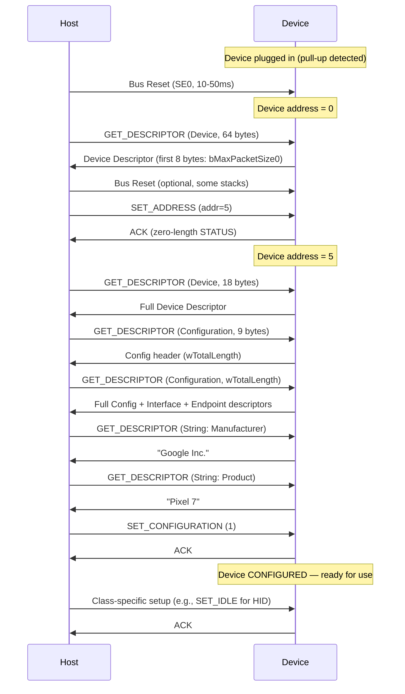
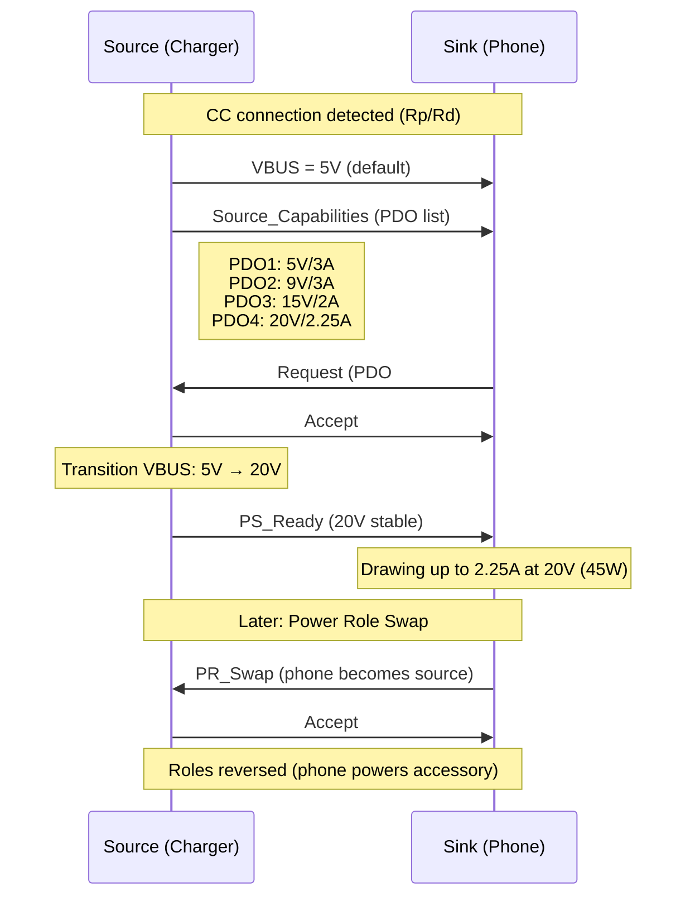
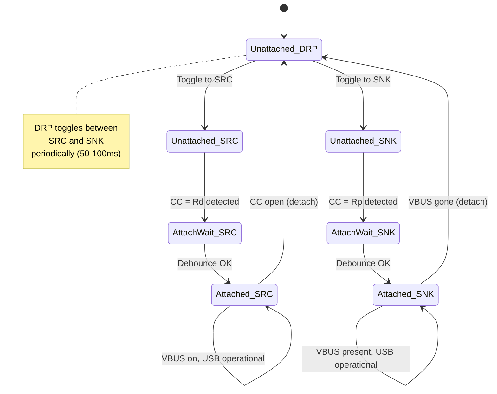
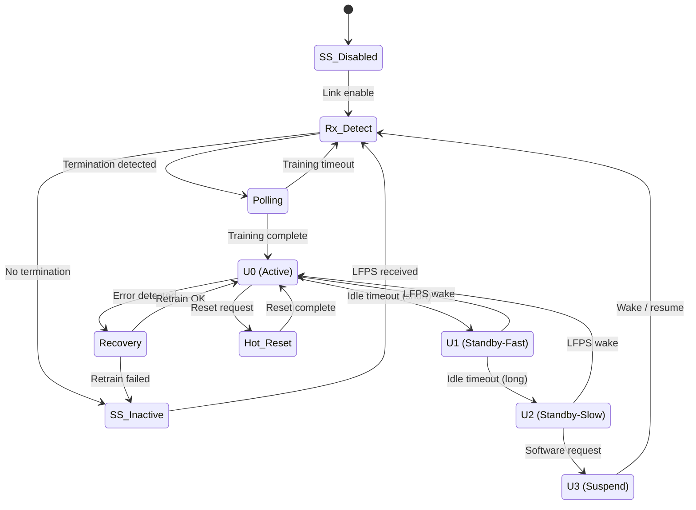
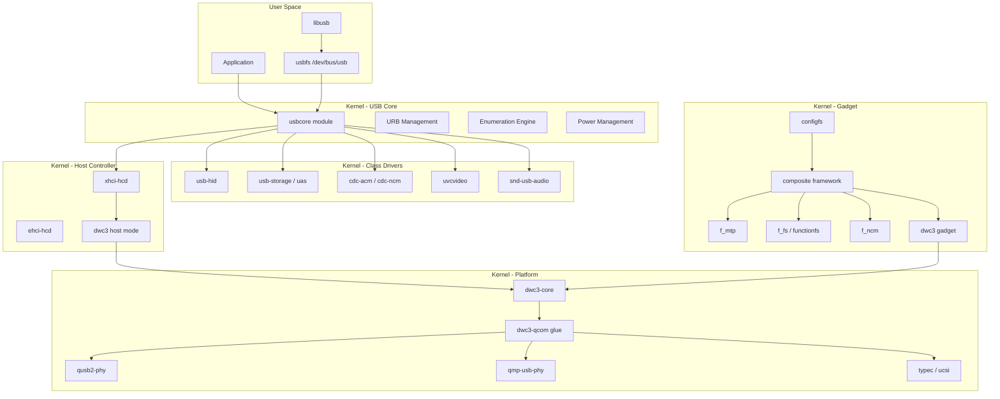
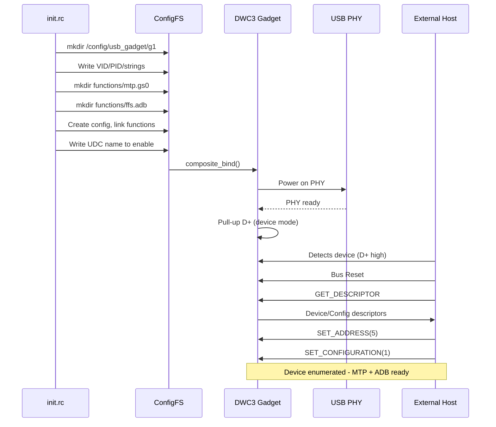

# USB PROTOCOL — DIAGRAMS & VISUAL REFERENCES
# ════════════════════════════════════════════════════════════════════
# Protocol: USB (Universal Serial Bus) | Document: 02 of 08
# Format: ASCII art, Mermaid, timing diagrams, state machines
# ════════════════════════════════════════════════════════════════════

---

## 1. USB TIERED STAR TOPOLOGY

```
                            ┌──────────────────┐
                            │   HOST COMPUTER   │
                            │   (Root Hub)      │
                            │   Port1 Port2 Port3
                            └──┬─────┬─────┬───┘
                               │     │     │
            ┌──────────────────┘     │     └───────────────────────┐
            │                        │                              │
    ┌───────▼───────┐       ┌───────▼────────┐           ┌────────▼────────┐
    │   HUB (4-port)│       │  USB Flash     │           │  USB Keyboard   │
    │   [Tier 2]    │       │  Drive         │           │  (HID)          │
    │ P1 P2 P3 P4  │       │  (MSC)         │           │                 │
    └─┬──┬──┬──┬───┘       └────────────────┘           └─────────────────┘
      │  │  │  │
      │  │  │  └─────────────────┐
      │  │  └───────┐            │
      │  │          │            │
  ┌───▼──┐   ┌─────▼───┐  ┌────▼─────┐  ┌───────────────┐
  │Webcam│   │ Printer │  │  HUB     │  │  Phone        │
  │(UVC) │   │         │  │ [Tier 3] │  │  (MTP+ADB)    │
  └──────┘   └─────────┘  │ P1 P2   │  └───────────────┘
                           └─┬───┬───┘
                             │   │
                       ┌─────▼─┐ ┌▼────────┐
                       │Mouse  │ │Headset  │
                       │(HID)  │ │(UAC)    │
                       └───────┘ └─────────┘

Rules:
• Max 7 tiers (root hub = tier 1)
• Max 5 hubs between host and device
• Max 127 devices per host controller
• Each cable segment: ≤5m (USB 2.0), ≤3m (USB 3.x)
```

---

## 2. USB CABLE WIRING

### USB 2.0 Cable (4 conductors + shield)
```
Host Side                                              Device Side
(Type-A)                                               (Type-B/Micro)

   ┌─────┐                                              ┌─────┐
   │  1  │──── VBUS (+5V) ─── Red ──────────────────────│  1  │
   │  2  │──── D- ─────────── White ────────────────────│  2  │
   │  3  │──── D+ ─────────── Green ────────────────────│  3  │
   │  4  │──── GND ────────── Black ────────────────────│  4  │
   │Shell│──── Shield ──────── Braid ───────────────────│Shell│
   └─────┘                                              └─────┘
```

### USB 3.x Cable (9 conductors + shield)
```
Host Side                                              Device Side
(Type-A 3.0)                                           (Type-B 3.0)

  USB 2.0 signals (backward compatible):
   ┌─────┐                                              ┌─────┐
   │  1  │──── VBUS ───────────────────────────────────│  1  │
   │  2  │──── D- ────────────────────────────────────│  2  │
   │  3  │──── D+ ────────────────────────────────────│  3  │
   │  4  │──── GND ───────────────────────────────────│  4  │
   └─────┘                                              └─────┘
  
  SuperSpeed signals (additional):
   ┌─────┐                                              ┌─────┐
   │  5  │──── SS_RX- ───────────────────────────────│  5  │  (StdA_SSRX-)
   │  6  │──── SS_RX+ ───────────────────────────────│  6  │  (StdA_SSRX+)
   │  7  │──── GND_DRAIN ────────────────────────────│  7  │
   │  8  │──── SS_TX- ───────────────────────────────│  8  │  (StdA_SSTX-)
   │  9  │──── SS_TX+ ───────────────────────────────│  9  │  (StdA_SSTX+)
   └─────┘                                              └─────┘

  Note: SS_TX from host connects to SS_RX on device (crossover in cable)
```

### USB Type-C Cable (Full-Featured)
```
     Plug A                    Cable                    Plug B
  ┌──────────┐                                     ┌──────────┐
  │A1  GND   │─────── GND ──────────────────────── │B12 GND   │
  │A2  TX1+  │─────── SS pair ──────────────────── │B11 RX1+  │
  │A3  TX1-  │─────── SS pair ──────────────────── │B10 RX1-  │
  │A4  VBUS  │─────── Power ────────────────────── │B9  VBUS  │
  │A5  CC1   │─────── CC ──────────────────────────│B5  CC2   │
  │A6  D+    │─────── USB 2.0 ─────────────────── │B6  D+    │
  │A7  D-    │─────── USB 2.0 ─────────────────── │B7  D-    │
  │A8  SBU1  │─────── Sideband ────────────────── │B8  SBU2  │
  │A9  VBUS  │─────── Power ────────────────────── │B4  VBUS  │
  │A10 RX2-  │─────── SS pair (Gen2×2 only) ───── │B3  TX2-  │
  │A11 RX2+  │─────── SS pair (Gen2×2 only) ───── │B2  TX2+  │
  │A12 GND   │─────── GND ──────────────────────── │B1  GND   │
  └──────────┘                                     └──────────┘
  
  E-Marker chip (in cable): Reports cable capabilities
  VCONN: Powers E-marker via one CC pin
```

---

## 3. USB-C CONNECTOR CROSS-SECTION (Receptacle)

```
Top Row (A-side, looking into receptacle):
┌─────────────────────────────────────────────────────────────────┐
│ A12  A11  A10   A9   A8   A7   A6   A5   A4   A3   A2   A1   │
│ GND  RX2+ RX2- VBUS SBU1  D-   D+   CC1 VBUS TX1- TX1+ GND  │
│                                                                  │
│ B1   B2   B3    B4   B5   B6   B7   B8   B9   B10  B11  B12  │
│ GND  TX2+ TX2- VBUS  CC2  D+   D-  SBU2 VBUS RX1- RX1+ GND  │
└─────────────────────────────────────────────────────────────────┘
Bottom Row (B-side)

Key: The connector is symmetric!
- If plug inserted "normal": A-side pins connect
- If plug inserted "flipped": B-side pins connect
- CC1/CC2 determine which orientation is active
- D+/D- only one pair used (based on orientation)
- SS: Either TX1/RX1 or TX2/RX2 used (based on orientation)
```

---

## 4. USB 2.0 SPEED DETECTION

```
                    Host                          Device
                    ┌─────┐                      ┌─────┐
               D+   │     │                      │     │   D+
              ──────┤     ├──────────────────────┤     ├──────
              15kΩ↓ │     │                      │     │ ↑1.5kΩ  ← Full Speed
                    │     │                      │     │         (pull-up on D+)
               D-   │     │                      │     │   D-
              ──────┤     ├──────────────────────┤     ├──────
              15kΩ↓ │     │                      │     │
                    └─────┘                      └─────┘

Low Speed:   Device has 1.5kΩ pull-up on D- (device pulls D- high)
Full Speed:  Device has 1.5kΩ pull-up on D+ (device pulls D+ high)
High Speed:  Detected via chirp handshake during reset:

HS Chirp Sequence:
    FS Connect ──→ Bus Reset ──→ Device Chirp K ──→ Host Chirp K-J ──→ HS Mode
                   (SE0 10ms)    (D- driven,         (alternating,       (400mV
                                  1-7ms)              3+ pairs)           diff)
```

---

## 5. NRZI ENCODING & BIT STUFFING

```
Original Data:    1  0  1  1  1  1  1  1  0  1
                  │  │  │  │  │  │  │  │  │  │
                  │  │  │  │  │  │  │  │  │  │

After Bit Stuff:  1  0  1  1  1  1  1  1  [0] 0  1
                  │  │  │  │  │  │  │  │   ↑  │  │
                  │  │  │  │  │  │  │  │   │  │  │
                  │  │  │  │  │  │  │  │  Stuff│  │
                  │  │  │  │  │  │  │  │  bit  │  │

NRZI Signal:      ─── ╲ ─── ─── ─── ─── ─── ─── ╲ ╲ ───
                  Hi  Lo Hi  Hi  Hi  Hi  Hi  Hi  Lo Hi Hi

Rules:
• NRZI: 0 = transition, 1 = no transition
• Bit stuffing: Insert 0 after 6 consecutive 1s (forces transition)
• Ensures at least one transition every 7 bit times (clock recovery)
• Stuff bits removed by receiver
```

---

## 6. USB 2.0 PACKET STRUCTURE

```
SYNC          PID           PAYLOAD                CRC        EOP
┌────────┬──────────┬──────────────────────┬───────────┬─────────┐
│01010101│ PPPP PPPP│                      │           │ SE0+J   │
│(8 bits)│(4+4 comp)│   (variable)         │(5 or 16b)│(2+1 bit)│
└────────┴──────────┴──────────────────────┴───────────┴─────────┘

TOKEN PACKET (IN/OUT/SETUP):
┌────────┬──────────┬─────────┬──────────┬───────┬────┐
│  SYNC  │   PID    │  ADDR   │   ENDP   │ CRC5  │EOP │
│  8 bit │   8 bit  │  7 bit  │   4 bit  │ 5 bit │    │
└────────┴──────────┴─────────┴──────────┴───────┴────┘
                     ◀──── 16 bits total ────────▶

DATA PACKET:
┌────────┬──────────┬────────────────────────────┬────────┬────┐
│  SYNC  │PID(DATA0/│         DATA               │ CRC16  │EOP │
│  8 bit │ DATA1)   │    0 to 1024 bytes         │ 16 bit │    │
│        │  8 bit   │                            │        │    │
└────────┴──────────┴────────────────────────────┴────────┴────┘

HANDSHAKE PACKET:
┌────────┬──────────┬────┐
│  SYNC  │PID(ACK/  │EOP │
│  8 bit │NAK/STALL)│    │
│        │  8 bit   │    │
└────────┴──────────┴────┘

SOF PACKET:
┌────────┬──────────┬─────────────┬───────┬────┐
│  SYNC  │PID(SOF)  │Frame Number │ CRC5  │EOP │
│  8 bit │  8 bit   │   11 bit    │ 5 bit │    │
└────────┴──────────┴─────────────┴───────┴────┘
```

---

## 7. USB TRANSACTION FLOW DIAGRAMS

### IN Transaction (Device → Host)
```
  Host                                           Device
    │                                              │
    │──── IN Token [ADDR, EP] ────────────────────▶│
    │                                              │
    │◀───── DATA0/1 [payload] ────────────────────│  (device has data)
    │                                              │
    │──── ACK ────────────────────────────────────▶│
    │                                              │

  OR if no data ready:
    │──── IN Token ───────────────────────────────▶│
    │◀───── NAK ──────────────────────────────────│  (try again later)
```

### OUT Transaction (Host → Device)
```
  Host                                           Device
    │                                              │
    │──── OUT Token [ADDR, EP] ───────────────────▶│
    │                                              │
    │──── DATA0/1 [payload] ──────────────────────▶│
    │                                              │
    │◀───── ACK ──────────────────────────────────│  (accepted)
    │   or  NAK ──────────────────────────────────│  (busy, retry)
    │   or  STALL ────────────────────────────────│  (error, halt)
```

### Control Transfer (3-stage)
```
  Host                                           Device
    │                                              │
    │════ SETUP STAGE ═══════════════════════════════
    │──── SETUP Token [ADDR, EP0] ────────────────▶│
    │──── DATA0 [8-byte setup packet] ────────────▶│
    │◀───── ACK ──────────────────────────────────│  (must accept)
    │                                              │
    │════ DATA STAGE (optional) ═══════════════════
    │──── IN Token ───────────────────────────────▶│  (for GET requests)
    │◀───── DATA1 [response data] ────────────────│
    │──── ACK ────────────────────────────────────▶│
    │  ... (more IN tokens if data > max packet)   │
    │                                              │
    │════ STATUS STAGE ════════════════════════════
    │──── OUT Token ──────────────────────────────▶│  (for GET: host→device)
    │──── DATA1 [zero-length] ────────────────────▶│
    │◀───── ACK ──────────────────────────────────│  (transfer complete)
    │                                              │
```

---

## 8. USB ENUMERATION SEQUENCE



---

## 9. USB DEVICE STATE MACHINE

```mermaid
stateDiagram-v2
    [*] --> Attached : VBUS detected
    Attached --> Powered : Hub port enabled
    Powered --> Default : Bus Reset
    Default --> Address : SET_ADDRESS
    Address --> Configured : SET_CONFIGURATION
    Configured --> Configured : Normal operation
    
    Configured --> Suspended : No activity 3ms
    Address --> Suspended : No activity 3ms
    Default --> Suspended : No activity 3ms
    
    Suspended --> Configured : Resume signal
    Suspended --> Address : Resume signal
    Suspended --> Default : Resume signal
    
    Configured --> Default : Bus Reset
    Address --> Default : Bus Reset
    Suspended --> Default : Bus Reset
    
    Powered --> [*] : VBUS removed
    Configured --> [*] : VBUS removed
```

---

## 10. USB DESCRIPTOR HIERARCHY

```
DEVICE DESCRIPTOR (bcdUSB=0x0200, VID=0x18D1, PID=0x4EE7)
│
├── CONFIGURATION DESCRIPTOR #1 (bConfigurationValue=1)
│   │
│   ├── INTERFACE DESCRIPTOR #0 (bInterfaceClass=0xFF, ADB)
│   │   ├── ENDPOINT DESCRIPTOR (EP1-IN,  Bulk, 512 bytes)
│   │   └── ENDPOINT DESCRIPTOR (EP1-OUT, Bulk, 512 bytes)
│   │
│   ├── INTERFACE DESCRIPTOR #1 (bInterfaceClass=0x06, MTP)
│   │   ├── ENDPOINT DESCRIPTOR (EP2-IN,  Bulk, 512 bytes)
│   │   ├── ENDPOINT DESCRIPTOR (EP2-OUT, Bulk, 512 bytes)
│   │   └── ENDPOINT DESCRIPTOR (EP3-IN,  Interrupt, 28 bytes, 6ms)
│   │
│   └── INTERFACE DESCRIPTOR #2 (bInterfaceClass=0x01, Audio)
│       ├── Audio Control Interface
│       ├── ENDPOINT DESCRIPTOR (EP4-IN,  Isochronous, 192 bytes)
│       └── Audio Streaming Interface
│
├── STRING DESCRIPTOR #1: "Google Inc."
├── STRING DESCRIPTOR #2: "Pixel 7"
├── STRING DESCRIPTOR #3: "ABC123DEF456"
│
└── BOS DESCRIPTOR (USB 3.x capability)
    ├── USB 2.0 Extension (LPM capable)
    ├── SuperSpeed Capability (5Gbps, U1/U2 support)
    └── Container ID
```

---

## 11. USB POWER DELIVERY MESSAGE EXCHANGE



---

## 12. USB TYPE-C STATE MACHINE (DRP)



---

## 13. SUPERSPEED LINK TRAINING (LTSSM)



---

## 14. xHCI ARCHITECTURE

```
┌─────────────────────────────────────────────────────────────────┐
│                        System Memory                             │
│                                                                  │
│  ┌────────────┐    ┌──────────────┐    ┌────────────────────┐  │
│  │ Command    │    │  Event Ring  │    │  Transfer Rings     │  │
│  │ Ring       │    │  (xHC→Host)  │    │  (per endpoint)    │  │
│  │(Host→xHC)  │    │              │    │                    │  │
│  │ ┌───┐┌───┐│    │  ┌───┐┌───┐ │    │  Slot1:EP0 ┌───┐  │  │
│  │ │TRB││TRB││    │  │Evt││Evt│ │    │           │TRB│  │  │
│  │ └───┘└───┘│    │  └───┘└───┘ │    │  Slot1:EP1 ┌───┐  │  │
│  └─────┬──────┘    └──────┬──────┘    │           │TRB│  │  │
│        │                  │           │  Slot2:EP0 ┌───┐  │  │
│        │                  │           │           │TRB│  │  │
│        │                  │           └─────┬──────────┘  │  │
│        │                  │                 │              │  │
├────────┼──────────────────┼─────────────────┼──────────────┤  │
│        ▼                  ▲                 ▼              │  │
│  ┌─────────────────────────────────────────────────────┐  │  │
│  │                  xHCI Controller                     │  │  │
│  │  ┌──────────┐  ┌───────────┐  ┌──────────────┐    │  │  │
│  │  │ Command  │  │Scheduler  │  │ Interrupter  │    │  │  │
│  │  │ Processor│  │(bandwidth)│  │ (MSI-X→CPU)  │    │  │  │
│  │  └──────────┘  └───────────┘  └──────────────┘    │  │  │
│  │  ┌──────────┐  ┌───────────┐  ┌──────────────┐    │  │  │
│  │  │ Slot     │  │ Endpoint  │  │ Port         │    │  │  │
│  │  │ Manager  │  │ Manager   │  │ Manager      │    │  │  │
│  │  └──────────┘  └───────────┘  └──────────────┘    │  │  │
│  └──────────────────────────────────────────────────────┘  │  │
│        │                                                    │  │
│  ┌─────▼────────────────────────────────────────────────┐  │  │
│  │               Root Hub Ports                          │  │  │
│  │   Port 1       Port 2       Port 3       Port 4      │  │  │
│  └───────────────────────────────────────────────────────┘  │  │
└─────────────────────────────────────────────────────────────────┘

Doorbell Registers: Host writes to notify xHC of new TRBs
Device Context: Per-slot state (address, speed, endpoints)
```

---

## 15. TRB (Transfer Request Block) FORMAT

```
                    16 bytes (128 bits)
┌────────────────────────────────────────────────────────────────┐
│                                                                 │
│  Offset 0x00: Data Buffer Pointer (Low 32 bits)                │
│  ┌─────────────────────────────────────────────────────────┐   │
│  │  63                                                  0  │   │
│  │  [───────── Buffer Pointer (64-bit address) ──────────] │   │
│  └─────────────────────────────────────────────────────────┘   │
│                                                                 │
│  Offset 0x08: Status                                           │
│  ┌────────────┬────────────────┬───────────────────────────┐   │
│  │  Interrupter│  TRB Transfer │   Completion Code         │   │
│  │  Target(10) │  Length (17)  │   (for event TRBs)        │   │
│  └────────────┴────────────────┴───────────────────────────┘   │
│                                                                 │
│  Offset 0x0C: Control                                          │
│  ┌──────┬─────┬──────┬────┬────┬────┬───┬───────────────────┐ │
│  │Cycle │ ENT │Chain │ IOC│ IDT│ BEI│TRB│   TRB Type (6)    │ │
│  │(1bit)│(1b) │(1b)  │(1b)│(1b)│(1b)│Res│                   │ │
│  └──────┴─────┴──────┴────┴────┴────┴───┴───────────────────┘ │
│                                                                 │
└────────────────────────────────────────────────────────────────┘

Key fields:
• Cycle Bit: Ownership toggle (consumer/producer)
• IOC: Interrupt On Complete (generate event)
• Chain: Link to next TRB (scatter-gather)
• IDT: Immediate Data (data in TRB itself, ≤8 bytes)
• TRB Type: Normal(1), Setup(2), Data(3), Status(4), Link(6), Event(32+)
```

---

## 16. USB LINUX DRIVER STACK



---

## 17. USB GADGET CONFIGFS SETUP FLOW



---

## 18. AUTOMOTIVE USB TOPOLOGY (SA8295P)

```
┌─────────────────────────────────────────────────────────────────────┐
│                    SA8295P Digital Cockpit SoC                        │
│                                                                      │
│  ┌──────────────────────────────────────────────────────────────┐   │
│  │ USB Subsystem                                                 │   │
│  │                                                               │   │
│  │  ┌─────────┐   ┌─────────┐   ┌─────────┐   ┌─────────┐    │   │
│  │  │  DWC3   │   │  DWC3   │   │  DWC3   │   │  DWC3   │    │   │
│  │  │  #0     │   │  #1     │   │  #2     │   │  #3     │    │   │
│  │  │(Host)   │   │(Host)   │   │(DRD)    │   │(Host)   │    │   │
│  │  └────┬────┘   └────┬────┘   └────┬────┘   └────┬────┘    │   │
│  │       │              │              │              │         │   │
│  │  ┌────▼────┐   ┌────▼────┐   ┌────▼────┐   ┌────▼────┐   │   │
│  │  │QUSB2+  │   │QUSB2+  │   │QUSB2+  │   │QUSB2   │   │   │
│  │  │QMP PHY │   │QMP PHY │   │QMP PHY │   │PHY only│   │   │
│  │  │(USB3.1)│   │(USB3.1)│   │(USB3.1)│   │(USB2.0)│   │   │
│  │  └────┬────┘   └────┬────┘   └────┬────┘   └────┬────┘   │   │
│  └───────┼──────────────┼──────────────┼──────────────┼────────┘   │
│          │              │              │              │              │
├──════════▼══════════════▼══════════════▼══════════════▼══════════════┤
│   ┌──────────┐   ┌──────────┐   ┌──────────┐   ┌──────────┐       │
│   │USB-C Port│   │USB-A Port│   │USB-C Port│   │Internal  │       │
│   │(Console) │   │(Rear Hub)│   │(Debug)   │   │(BT/WiFi) │       │
│   │          │   │          │   │          │   │          │       │
│   │• Phone   │   │• Hub→2xA │   │• ADB     │   │• BT mod  │       │
│   │• AA/CP   │   │• Storage │   │• Flash   │   │• WiFi mod│       │
│   │• Charge  │   │• Media   │   │• DRD     │   │          │       │
│   └──────────┘   └──────────┘   └──────────┘   └──────────┘       │
└─────────────────────────────────────────────────────────────────────┘

TCPM/TCPC (Type-C Port Manager/Controller):
• Handles CC detection, orientation
• Manages USB PD negotiation
• Controls VBUS source/sink
• Triggers DWC3 role switch (host↔device)
```

---

## 19. DATA TOGGLE MECHANISM

```
Normal Bulk OUT Transfer:
    
  Host                                          Device
    │                                             │
    │── OUT + DATA0 [payload A] ─────────────────▶│  Expected: DATA0 ✓
    │◀─────────── ACK ───────────────────────────│  Toggle → expect DATA1
    │                                             │
    │── OUT + DATA1 [payload B] ─────────────────▶│  Expected: DATA1 ✓
    │◀─────────── ACK ───────────────────────────│  Toggle → expect DATA0
    │                                             │
    │── OUT + DATA0 [payload C] ─────────────────▶│  Expected: DATA0 ✓
    │◀─────────── ACK ───────────────────────────│  Toggle → expect DATA1
    │                                             │

Error Recovery (ACK lost):
    
  Host                                          Device
    │                                             │
    │── OUT + DATA0 [payload A] ─────────────────▶│  Received, toggled
    │◀─────────── ACK ────── ╳ (lost!) ─────────│  Device: expect DATA1
    │                                             │
    │  Host didn't get ACK → retransmit:         │
    │── OUT + DATA0 [payload A] ─────────────────▶│  Got DATA0, expect DATA1
    │                                             │  MISMATCH → duplicate!
    │◀─────────── ACK ──────────────────────────│  ACK but don't store
    │  Host: got ACK → toggle to DATA1           │
    │                                             │
    │── OUT + DATA1 [payload B] ─────────────────▶│  Expected: DATA1 ✓ New data!
    │◀─────────── ACK ──────────────────────────│
```

---

## 20. SOF AND FRAME TIMING

```
USB 2.0 Full Speed (1ms frames):
┌────┬───────────────────────────────────────────────────┬────┬─────
│SOF │              Frame N (1000 µs)                     │SOF │ Frame
│#N  │                                                    │#N+1│  N+1
└────┴───────────────────────────────────────────────────┴────┴─────
     │◀──────── 1.000 ms ± 0.0005ms ─────────────────▶│

USB 2.0 High Speed (125µs microframes, 8 per frame):
┌────┬─────┬─────┬─────┬─────┬─────┬─────┬─────┬─────┬────┬─────
│SOF │µf 0 │µf 1 │µf 2 │µf 3 │µf 4 │µf 5 │µf 6 │µf 7 │SOF │µf 0
│#N  │     │     │     │     │     │     │     │     │#N+1│
└────┴─────┴─────┴─────┴─────┴─────┴─────┴─────┴─────┴────┴─────
     │◀─── 125µs ──▶│
     │◀──────────────── 1.000 ms (8 × 125µs) ────────────────────▶│

Bandwidth allocation within a microframe:
┌────────────────────────────────────────────────────────────┐
│ SOF │ Isoch │ Isoch │ Interrupt │ Bulk │ Bulk │ Bulk │idle │
│token│ EP1   │ EP2   │  EP3     │ EP4  │ EP5  │ EP6  │     │
└────────────────────────────────────────────────────────────┘
│◀─▶│◀── guaranteed bandwidth ──▶│◀── best effort ──▶│◀──▶│
  ~10% periodic reserved                                idle

Max bandwidth per microframe (HS): ~480 Mbps × 80% = ~384 Mbps usable
```

---

END OF DOCUMENT 02 — DIAGRAMS & VISUAL REFERENCES
