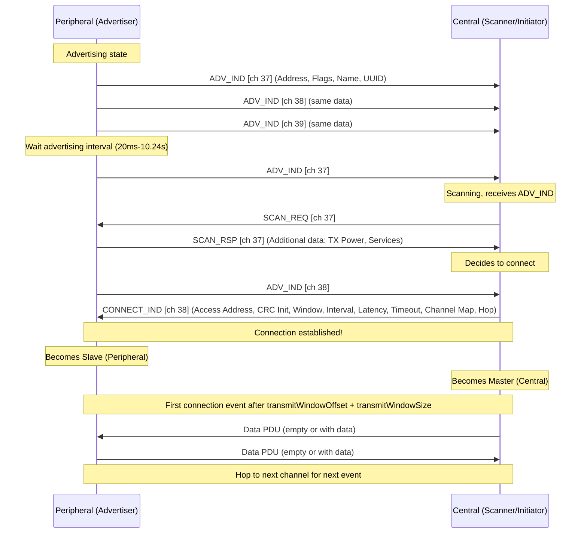
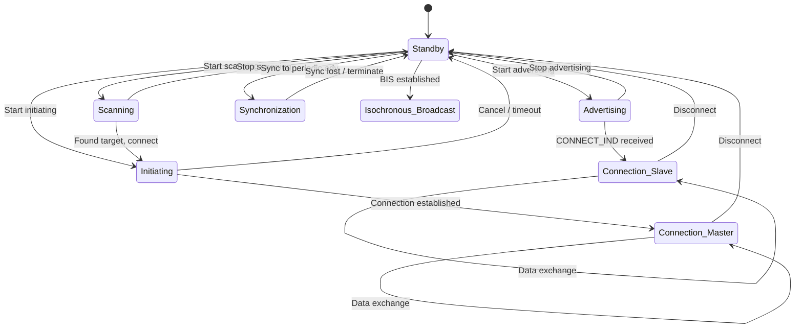
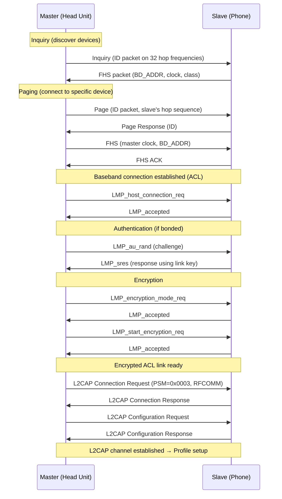
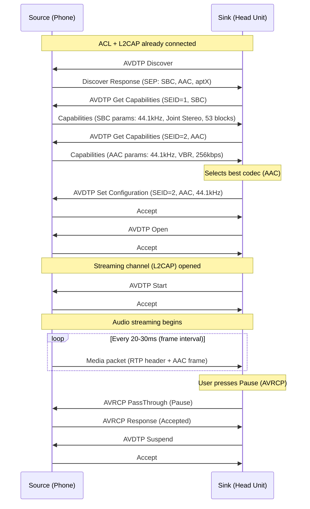
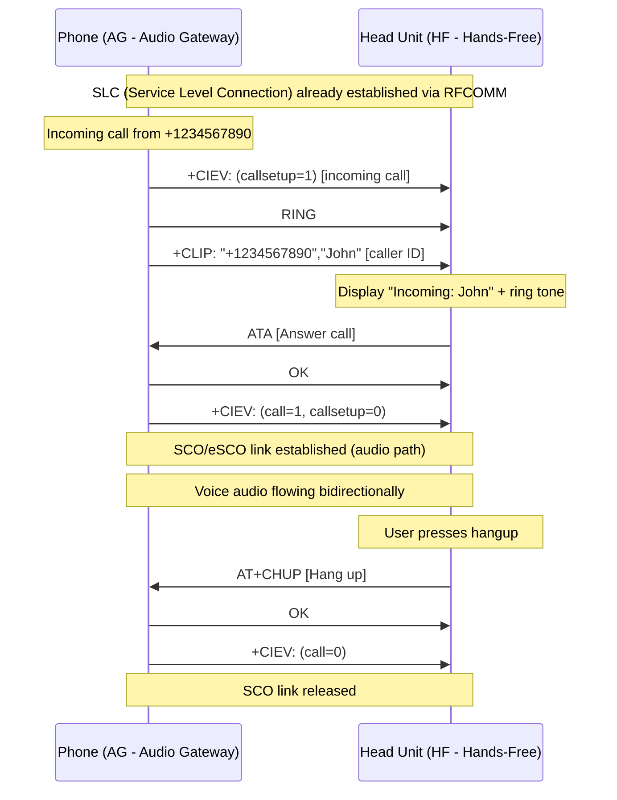
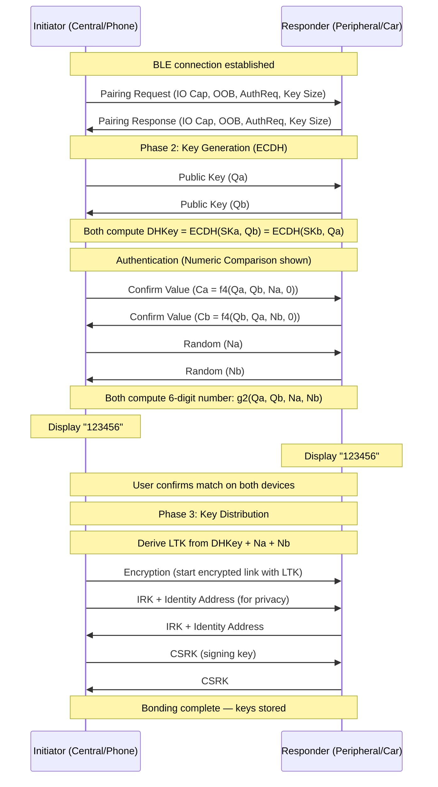
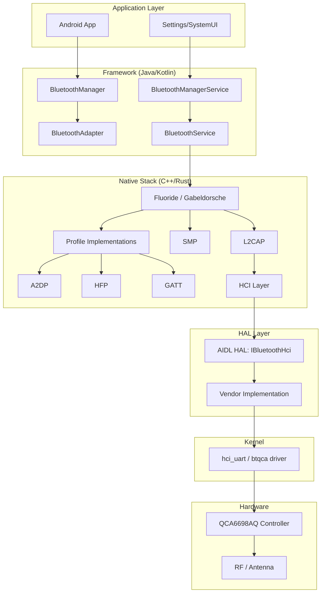
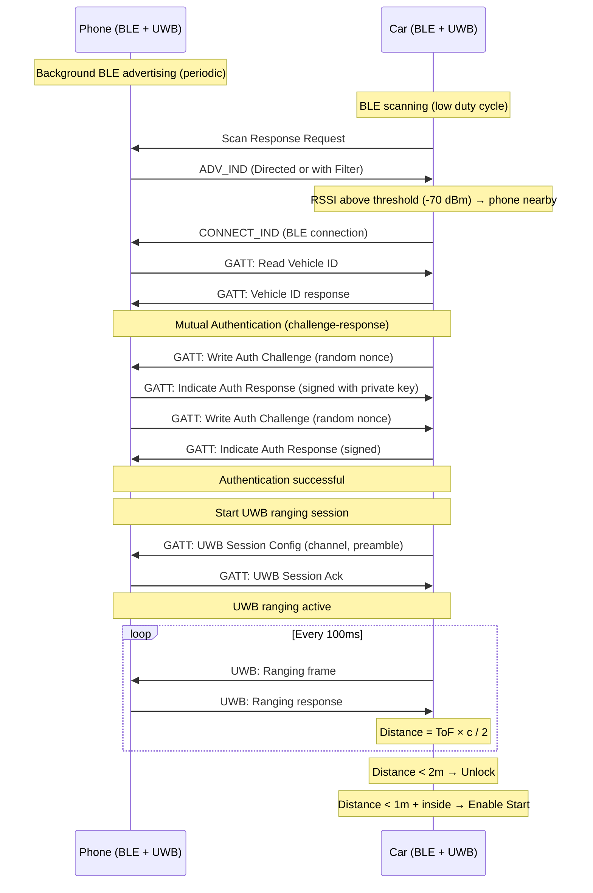

# BLUETOOTH / BLE PROTOCOL — DIAGRAMS & VISUAL REFERENCES
# ════════════════════════════════════════════════════════════════════
# Protocol: Bluetooth Classic & BLE | Document: 02 of 08
# Format: ASCII art, Mermaid, state machines, timing diagrams
# ════════════════════════════════════════════════════════════════════

---

## 1. BLUETOOTH CLASSIC PROTOCOL STACK

```
┌─────────────────────────────────────────────────────────────────┐
│                         APPLICATIONS                              │
│   Phone Call │ Music │ Contacts │ Messages │ Serial Data         │
├──────────────┼───────┼──────────┼──────────┼────────────────────┤
│     HFP      │ A2DP  │  PBAP   │   MAP    │       SPP          │
│              │ AVRCP │         │          │                     │
├──────────────┤       │         │          ├────────────────────┤
│   AT Cmds    │ AVDTP │  OBEX   │  OBEX    │      RFCOMM        │
│              │ AVCTP │         │          │  (Serial Emulation)│
├──────────────┴───────┴─────────┴──────────┴────────────────────┤
│                          SDP                                      │
│              (Service Discovery Protocol)                         │
├─────────────────────────────────────────────────────────────────┤
│                         L2CAP                                     │
│   (Logical Link Control & Adaptation Protocol)                   │
│   Multiplexing | Segmentation | Flow Control | QoS              │
├─────────────────────────────────────────────────────────────────┤
│                  HCI (Host Controller Interface)                  │
│════════════════════ UART / USB / SDIO ══════════════════════════│
├─────────────────────────────────────────────────────────────────┤
│         Link Manager Protocol (LMP)                              │
│   (Authentication, Encryption, Power Control, QoS)              │
├─────────────────────────────────────────────────────────────────┤
│              Baseband / Link Controller (LC)                      │
│   (Packet Assembly, FH Sequence, ARQ, FEC, Whitening)          │
├─────────────────────────────────────────────────────────────────┤
│                      RADIO (PHY)                                 │
│   GFSK (1M) │ π/4-DQPSK (2M) │ 8DPSK (3M)                    │
│   2.4 GHz ISM Band │ 79 Channels │ FHSS                        │
└─────────────────────────────────────────────────────────────────┘
```

---

## 2. BLE PROTOCOL STACK

```
┌─────────────────────────────────────────────────────────────────┐
│                         APPLICATIONS                              │
│   Heart Rate │ Battery │ Custom │ Digital Key │ Mesh            │
├──────────────┴─────────┴────────┴─────────────┴────────────────┤
│              GATT (Generic Attribute Profile)                     │
│         Client/Server model — Services & Characteristics        │
├─────────────────────────────────────────────────────────────────┤
│              ATT (Attribute Protocol)                             │
│         Read/Write/Notify/Indicate operations                   │
├─────────────────────────────┬───────────────────────────────────┤
│   GAP (Generic Access       │  SMP (Security Manager Protocol)  │
│   Profile — Discovery,      │  Pairing, Key Distribution,       │
│   Connection, Roles)        │  Encryption                       │
├─────────────────────────────┴───────────────────────────────────┤
│                         L2CAP (LE)                                │
│   Fixed Channels: ATT(0x04) │ SMP(0x06) │ Signal(0x05)         │
│   Dynamic: L2CAP CoC (credit-based flow control)                │
├─────────────────────────────────────────────────────────────────┤
│                  HCI (Host Controller Interface)                  │
│════════════════════ UART / USB / SDIO ══════════════════════════│
├─────────────────────────────────────────────────────────────────┤
│                    Link Layer (LL)                                │
│   Advertising │ Scanning │ Initiating │ Connection              │
│   Channel Map │ Hop Algorithm │ Encryption │ Data PDU           │
├─────────────────────────────────────────────────────────────────┤
│                      PHY (Physical Layer)                         │
│   LE 1M │ LE 2M │ LE Coded (S=2, S=8)                         │
│   2.4 GHz │ 40 Channels (37 data + 3 advertising)             │
└─────────────────────────────────────────────────────────────────┘
```

---

## 3. PICONET TOPOLOGY

```
                    ┌───────────────────────┐
                    │   MASTER (M)          │
                    │   Controls timing     │
                    │   Determines hop seq  │
                    │   Polls slaves        │
                    └───┬───┬───┬───┬───┬──┘
                        │   │   │   │   │
            ┌───────────┘   │   │   │   └───────────┐
            │               │   │   │               │
     ┌──────▼──────┐ ┌─────▼─┐ │ ┌─▼─────┐ ┌──────▼──────┐
     │  Slave 1    │ │ S2    │ │ │ S3    │ │  Slave 4    │
     │  (Active)   │ │(Active)│ │ │(Active)│ │  (Active)   │
     │  Phone A    │ │Phone B│ │ │Headset│ │  OBD-II     │
     └─────────────┘ └───────┘ │ └───────┘ └─────────────┘
                                │
                         ┌──────▼──────┐
                         │  Slave 5    │
                         │  (Parked)   │
                         │  Low power  │
                         └─────────────┘

    Rules:
    • 1 Master + up to 7 Active Slaves
    • Up to 255 Parked Slaves (low power, can't transmit)
    • Master assigns 3-bit Active Member Address (AMA)
    • Parked slaves get 8-bit Parked Member Address (PMA)
    • TDD: Master TX even slots, Slave TX odd slots
    • Slave can only transmit when polled by Master
```

---

## 4. SCATTERNET (OVERLAPPING PICONETS)

```
       Piconet A                         Piconet B
    ┌─────────────┐                   ┌─────────────┐
    │  Master A   │                   │  Master B   │
    └──┬──┬──┬────┘                   └──┬──┬──┬────┘
       │  │  │                           │  │  │
    ┌──▼┐ │  ▼──┐                     ┌──▼┐ │  ▼──┐
    │S1 │ │ │S2 │                     │S4 │ │ │S5 │
    └───┘ │ └───┘                     └───┘ │ └───┘
          │                                 │
          └────────────┐   ┌────────────────┘
                       │   │
                    ┌──▼───▼──┐
                    │  S3/M?   │  ← Bridge device
                    │  Slave   │     (Slave in A,
                    │  in both │      Slave/Master in B)
                    └──────────┘
    
    • Device can be slave in multiple piconets
    • Device can be master in one piconet only
    • Time-sharing between piconets (performance impact)
```

---

## 5. 2.4 GHz SPECTRUM — BLUETOOTH CHANNELS

```
WiFi Channel 1          WiFi Channel 6          WiFi Channel 11
  (2412 MHz)              (2437 MHz)              (2462 MHz)
    ┌──22MHz──┐           ┌──22MHz──┐           ┌──22MHz──┐
    │         │           │         │           │         │
────┤█████████├───────────┤█████████├───────────┤█████████├────
    │         │           │         │           │         │
    └─────────┘           └─────────┘           └─────────┘
2401 MHz                                                  2480 MHz
├─┼─┼─┼─┼─┼─┼─┼─┼─┼─┼─┼─┼─┼─┼─┼─┼─┼─┼─┼─┼─┼─┼─┼─┼─┼─┤
 0 1 2 3 4 5 6 7 8 9 . . . . . . . . . . . . . . . . 78
 └──────────────── 79 BT Classic Channels (1 MHz each) ──┘

BLE Channels (2 MHz spacing):
├──┤  ├──┤  ├──┤  ├──┤  ├──┤ . . . . . . . ├──┤  ├──┤  ├──┤
 37   0   1   2   3   4                      36  38      39
 Adv  ←── 37 Data Channels (2 MHz each) ──→  Adv       Adv
 2402     2404-2478 MHz                       2426      2480

BLE Advertising channels placed to AVOID WiFi overlap:
  Ch 37 (2402): Below WiFi Ch 1
  Ch 38 (2426): Between WiFi Ch 1 and Ch 6
  Ch 39 (2480): Above WiFi Ch 11
```

---

## 6. BLE ADVERTISING & CONNECTION ESTABLISHMENT



---

## 7. BLE CONNECTION EVENT TIMING

```
              Connection Interval (CI = 7.5ms - 4s)
    ├────────────────────────────────────────────────────┤
    
    Event N                                    Event N+1
    ┌──────────────────┐                      ┌──────────────────┐
    │                  │                      │                  │
    │  M──▶S  S──▶M   │     (Sleep)          │  M──▶S  S──▶M   │
    │  TX    RX        │                      │  TX    RX        │
    │                  │                      │                  │
    └──────────────────┘                      └──────────────────┘
    │◀─ T_IFS ─▶│                             
    │  (150µs)  │
    
    Master TX        Slave TX        
    ┌─────────┐     ┌─────────┐     
    │ Header  │     │ Header  │     
    │ Payload │     │ Payload │     
    │(0-251B) │     │(0-251B) │     
    └─────────┘     └─────────┘     
    
    Multiple packets per event (if data pending):
    ┌────┐  ┌────┐  ┌────┐  ┌────┐  ┌────┐  ┌────┐
    │M→S │  │S→M │  │M→S │  │S→M │  │M→S │  │S→M │
    └────┘  └────┘  └────┘  └────┘  └────┘  └────┘
    ◀────── 150µs between each (T_IFS) ──────────▶
    
    Slave Latency = 3:
    Event N   Event N+1  Event N+2  Event N+3   Event N+4
    ┌──────┐  ┌──────┐   (skip)     (skip)     ┌──────┐
    │M→S   │  │M→S   │                          │M→S   │
    │S→M   │  │Empty │   (Slave sleeps)         │S→M   │
    └──────┘  └──────┘                          └──────┘
```

---

## 8. BLE PACKET FORMAT

```
BLE Link Layer PDU (on air):
┌──────────┬──────────┬────────────────────────────┬────────┐
│ Preamble │ Access   │         PDU                 │  CRC   │
│  (1-2B)  │ Address  │   (Header + Payload)       │  (3B)  │
│          │  (4B)    │                            │        │
└──────────┴──────────┴────────────────────────────┴────────┘

Advertising PDU:
┌──────────────────────────────────────────────────────────────┐
│ Header (2B)              │ Payload (6-37B or 0-255B ext)     │
│ ┌──────┬─────┬────────┐ │ ┌──────────┬─────────────────────┐│
│ │PDU   │TxAdd│Length   │ │ │AdvA      │ AdvData             ││
│ │Type  │RxAdd│(6 bits)│ │ │(6 bytes) │ (0-31 or 0-254B)   ││
│ │(4bit)│(2b) │        │ │ │          │                     ││
│ └──────┴─────┴────────┘ │ └──────────┴─────────────────────┘│
└──────────────────────────────────────────────────────────────┘

Data PDU:
┌──────────────────────────────────────────────────────────────┐
│ Header (2-3B)            │ Payload (0-251B)     │ MIC (4B)  │
│ ┌──────┬────┬───┬──────┐│                      │(encrypted)│
│ │LLID  │NESN│SN │Length ││ L2CAP or LL Control  │           │
│ │(2bit)│(1b)│(1b│(8bit)││                      │           │
│ └──────┴────┴───┴──────┘│                      │           │
└──────────────────────────────────────────────────────────────┘

LLID values:
  01 = L2CAP (continuation fragment)
  10 = L2CAP (start or complete)
  11 = LL Control PDU (connection management)
```

---

## 9. BLE STATE MACHINE



---

## 10. GATT SERVICE HIERARCHY

```
┌─────────────────────────────────────────────────────────────────┐
│                    GATT DATABASE (Server)                         │
├─────────────────────────────────────────────────────────────────┤
│                                                                   │
│  ┌─── Service: Generic Access (0x1800) ──────────────────────┐  │
│  │  ├── Char: Device Name (0x2A00) [Read, Write]             │  │
│  │  │       Value: "Car_HeadUnit_BLE"                        │  │
│  │  └── Char: Appearance (0x2A01) [Read]                     │  │
│  │          Value: 0x0341 (Automotive)                       │  │
│  └───────────────────────────────────────────────────────────┘  │
│                                                                   │
│  ┌─── Service: Heart Rate (0x180D) ──────────────────────────┐  │
│  │  ├── Char: HR Measurement (0x2A37) [Notify]               │  │
│  │  │   ├── Value: [Flags=0x06][HR=72][RR=820ms]            │  │
│  │  │   └── Desc: CCCD (0x2902) = 0x0001 (notify enabled)   │  │
│  │  ├── Char: Body Sensor Location (0x2A38) [Read]           │  │
│  │  │       Value: 0x01 (Chest)                              │  │
│  │  └── Char: HR Control Point (0x2A39) [Write]              │  │
│  │          Value: 0x01 (reset energy expended)              │  │
│  └───────────────────────────────────────────────────────────┘  │
│                                                                   │
│  ┌─── Service: Custom (128-bit UUID) ────────────────────────┐  │
│  │  ├── Char: Digital Key Auth (custom UUID) [Write, Indicate]│  │
│  │  │   ├── Value: [challenge-response data]                 │  │
│  │  │   └── Desc: CCCD (0x2902) = 0x0002 (indicate enabled) │  │
│  │  └── Char: Vehicle Status (custom UUID) [Read, Notify]    │  │
│  │          Value: [locked=1, engine=0, temp=22]             │  │
│  └───────────────────────────────────────────────────────────┘  │
│                                                                   │
└─────────────────────────────────────────────────────────────────┘

Handle layout:
Handle 0x0001: Service Declaration (Generic Access)
Handle 0x0002: Char Declaration (Device Name)
Handle 0x0003: Char Value (Device Name)
Handle 0x0004: Char Declaration (Appearance)
Handle 0x0005: Char Value (Appearance)
Handle 0x0010: Service Declaration (Heart Rate)
Handle 0x0011: Char Declaration (HR Measurement)
Handle 0x0012: Char Value (HR Measurement)
Handle 0x0013: CCCD Descriptor
...
```

---

## 11. BLUETOOTH CLASSIC CONNECTION FLOW



---

## 12. A2DP STREAMING FLOW



---

## 13. HFP CALL FLOW



---

## 14. BLE PAIRING (LE SECURE CONNECTIONS)



---

## 15. FREQUENCY HOPPING PATTERN (CLASSIC)

```
Time (slots, 625µs each):
──┬──┬──┬──┬──┬──┬──┬──┬──┬──┬──┬──┬──┬──┬──┬──►
  S0 S1 S2 S3 S4 S5 S6 S7 S8 S9 ...

Frequency (channel):
79 ┤                              ■
   │              ■                           ■
60 ┤    ■                   ■
   │                                    ■
40 ┤         ■                                     ■
   │                        
20 ┤                   ■              ■
   │ ■                                        
 0 ┤──┬──┬──┬──┬──┬──┬──┬──┬──┬──┬──┬──┬──┬──┬──►
     S0 S1 S2 S3 S4 S5 S6 S7 S8 S9 S10 ...

  ■ = Frequency used in that slot
  Pattern: Pseudo-random based on Master clock + BD_ADDR
  Rate: 1600 hops/second (every 625µs)

With AFH (channels 20-40 marked bad → WiFi):
79 ┤                              ■
   │              ■                           ■
60 ┤    ■                   ■
   │                                    ■
40 ┤─ ─ ─ ─ ─ ─ ─ ─ ─ ─ ─ ─ ─ ─ ─ ─ ─ ─ ─ ─ ─ 
   │ ╳╳╳╳╳╳╳╳╳╳╳╳╳╳╳╳╳╳╳╳╳  (excluded channels)
20 ┤─ ─ ─ ─ ─ ─ ─ ─ ─ ─ ─ ─ ─ ─ ─ ─ ─ ─ ─ ─ ─
   │ ■       ■                            ■
 0 ┤──┬──┬──┬──┬──┬──┬──┬──┬──┬──┬──┬──┬──┬──┬──►
     (hops remap to non-excluded channels)
```

---

## 16. ANDROID BLUETOOTH ARCHITECTURE



---

## 17. AUTOMOTIVE BT AUDIO ROUTING

```
┌─────────────────────────────────────────────────────────────────┐
│                    SA8295P Audio Subsystem                        │
│                                                                   │
│  ┌────────────────────────────────────────────────────────────┐ │
│  │ BT Audio Inputs                                             │ │
│  │                                                             │ │
│  │  Phone A ──BT──▶ QCA6698AQ ──PCM──▶ ┌───────────────┐    │ │
│  │  (A2DP: Music)              Decode   │               │    │ │
│  │                                      │  Audio HAL    │    │ │
│  │  Phone B ──BT──▶ QCA6698AQ ──PCM──▶ │  (mixer)      │    │ │
│  │  (HFP: Call)                Decode   │               │    │ │
│  │                                      │  Duck/Mix/    │    │ │
│  │  Navigation TTS ───────────────────▶ │  Route        │    │ │
│  │                                      │               │    │ │
│  │  Chime/Alert ──────────────────────▶ │               │────┼─▶ AMP
│  │                                      └───────────────┘    │ │
│  └────────────────────────────────────────────────────────────┘ │
│                                                                   │
│  Audio Policy (priority):                                        │
│  1. Emergency / Chime (highest)                                  │
│  2. Phone Call (HFP) → duck everything else                      │
│  3. Navigation TTS → duck music                                  │
│  4. Music (A2DP) → lowest continuous                             │
│                                                                   │
│  Microphone path:                                                │
│  Mic array ──▶ AEC/NS DSP ──▶ PCM ──▶ QCA6698AQ ──BT──▶ Phone │
└─────────────────────────────────────────────────────────────────┘
```

---

## 18. BLE DIGITAL KEY FLOW



---

## 19. HCI PACKET FORMAT

```
HCI Command Packet:
┌────────────┬──────────┬─────────────────────────────────┐
│  Indicator │  OpCode  │ Param  │      Parameters        │
│   (1 byte) │ (2 bytes)│ Length │    (0-255 bytes)       │
│   0x01     │ OGF|OCF  │(1 byte)│                        │
└────────────┴──────────┴────────┴────────────────────────┘
OpCode: OGF (6 bits, group) | OCF (10 bits, command)
  OGF=0x01: Link Control, OGF=0x03: HC & Baseband
  OGF=0x04: Informational, OGF=0x08: LE Controller

HCI Event Packet:
┌────────────┬──────────┬─────────────────────────────────┐
│  Indicator │  Event   │ Param  │     Parameters         │
│   (1 byte) │  Code    │ Length │   (0-255 bytes)        │
│   0x04     │ (1 byte) │(1 byte)│                        │
└────────────┴──────────┴────────┴────────────────────────┘
Common events: 0x0E=Command Complete, 0x0F=Command Status
               0x03=Connection Complete, 0x05=Disconnection
               0x3E=LE Meta Event (subevent code follows)

HCI ACL Data Packet:
┌────────────┬──────────────────────┬─────────────────────┐
│  Indicator │ Handle|PB|BC         │  Data Length │ Data  │
│   (1 byte) │ (2 bytes)            │  (2 bytes)   │       │
│   0x02     │ 12-bit handle + flags│              │       │
└────────────┴──────────────────────┴──────────────┴───────┘
PB (Packet Boundary): 00=continuation, 01=first, 10=first auto-flush
BC (Broadcast): 00=point-to-point, 01=active slave broadcast
```

---

## 20. LE AUDIO — CIS/BIS ARCHITECTURE

```
Connected Isochronous Stream (CIS) — Point-to-Point:
┌──────────┐                                    ┌──────────┐
│  Phone   │ ══CIS #1 (Left ear, LC3 80kbps)══▶│ Left Bud │
│ (Central)│                                    └──────────┘
│          │ ══CIS #2 (Right ear, LC3 80kbps)═▶┌──────────┐
│          │                                    │Right Bud │
└──────────┘                                    └──────────┘
  CIG (Connected Isochronous Group) ties CIS #1 and #2 together
  → Synchronized timing for stereo

Broadcast Isochronous Stream (BIS) — One-to-Many (Auracast):
                    ┌──────────┐
                    │  Source  │
                    │ (Airport)│
                    └────┬─────┘
                         │
            ══ BIS #1 (English, LC3) ══
            ══ BIS #2 (Spanish, LC3) ══
                         │
         ┌───────────────┼───────────────┐
         │               │               │
    ┌────▼────┐    ┌────▼────┐    ┌────▼────┐
    │Receiver1│    │Receiver2│    │Receiver3│
    │(English)│    │(Spanish)│    │(English)│
    └─────────┘    └─────────┘    └─────────┘
    
  BIG (Broadcast Isochronous Group): Contains BIS #1 + #2
  Each receiver selects which BIS to sync with
  Encrypted: Broadcast Code shared via QR/NFC
```

---

END OF DOCUMENT 02 — DIAGRAMS & VISUAL REFERENCES
