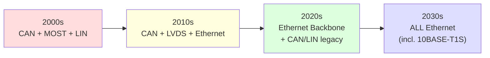
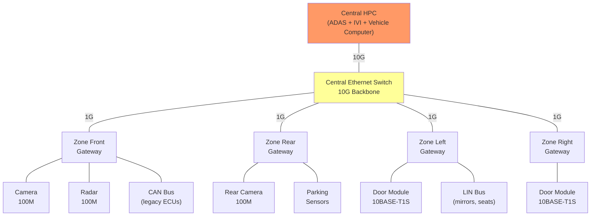
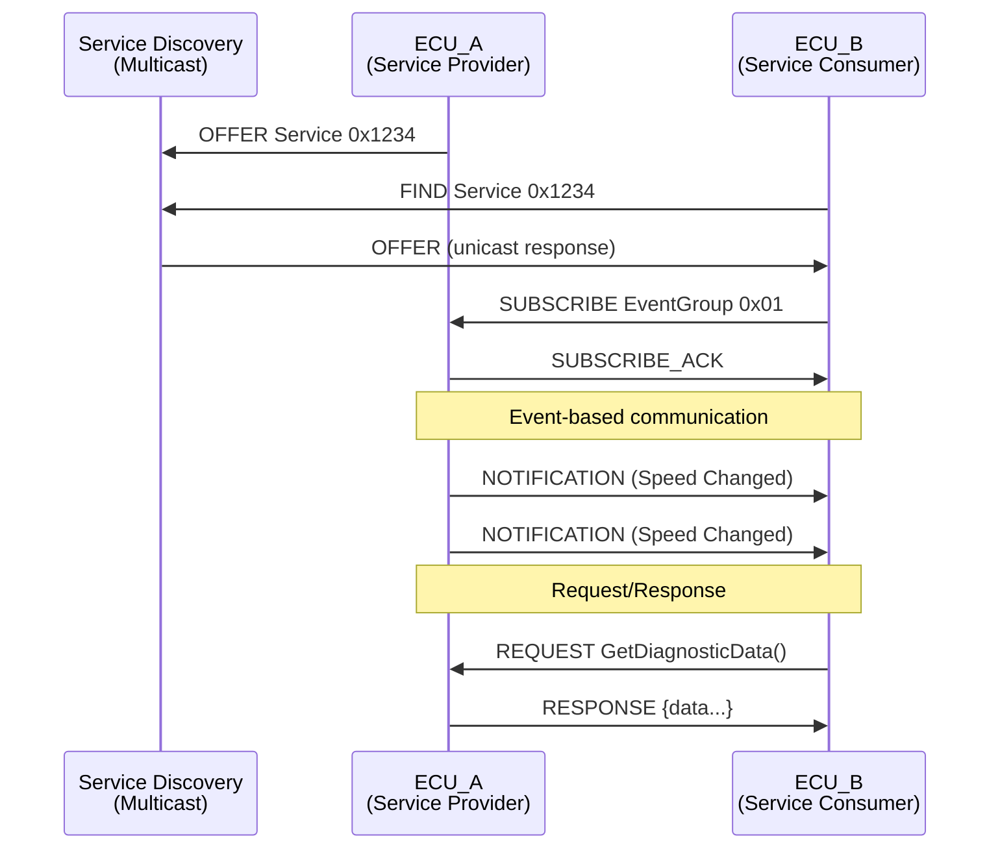
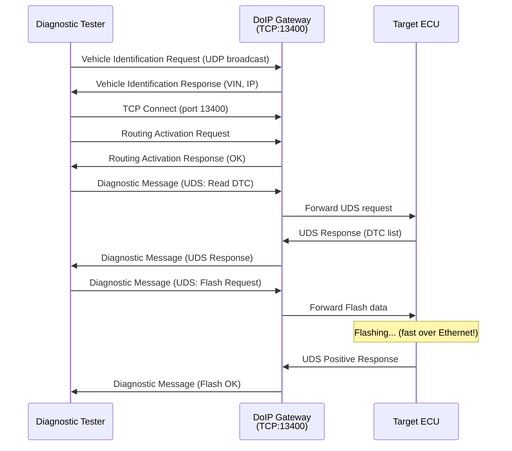
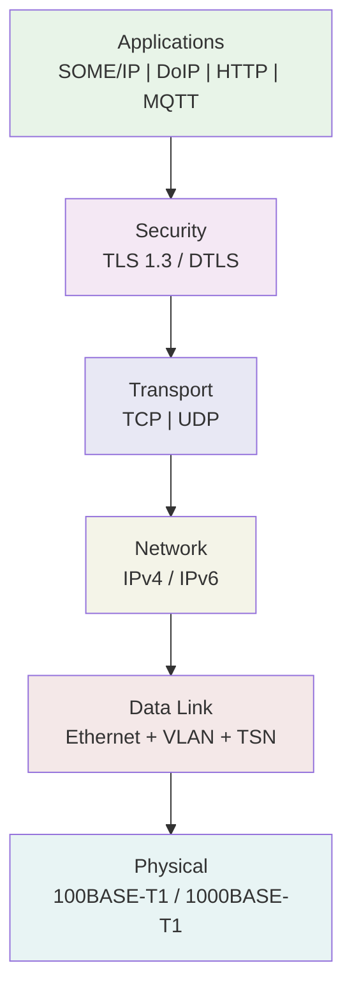
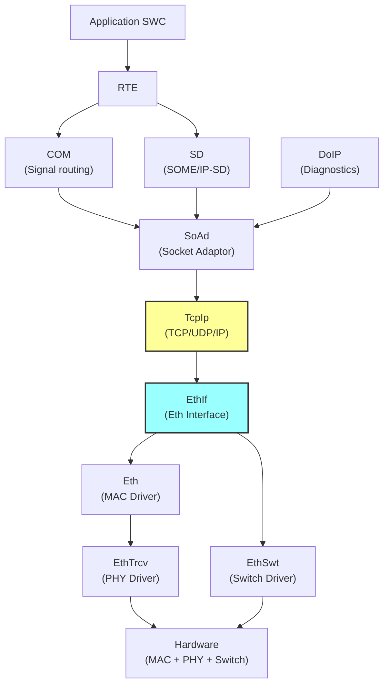
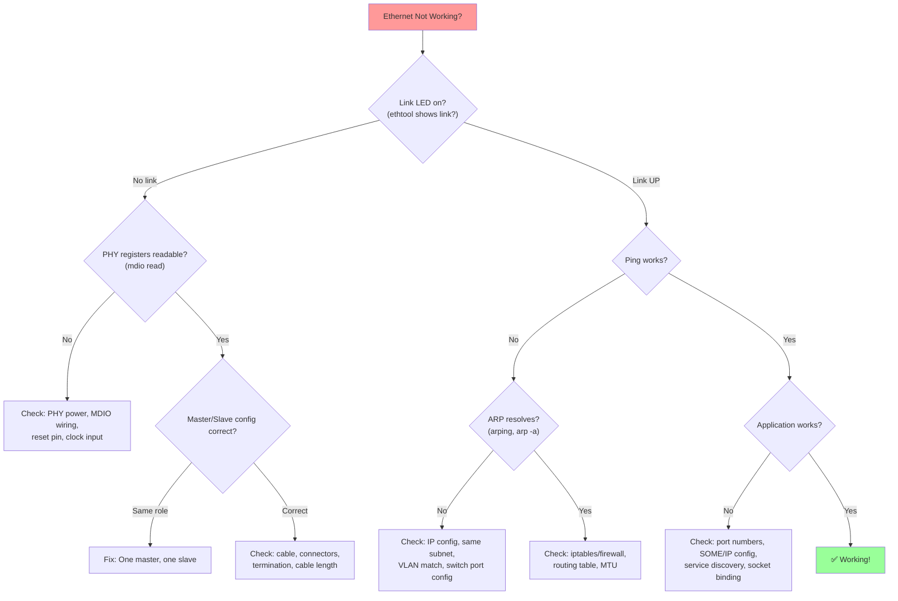

# AUTOMOTIVE ETHERNET — DIAGRAMS & VISUAL REFERENCE
# ════════════════════════════════════════════════════════════════════
# Protocol: Automotive Ethernet | Document: 02 of 08
# ════════════════════════════════════════════════════════════════════

---

## DIAGRAM 01: Automotive Network Evolution



---

## DIAGRAM 02: Physical Layer Comparison

```
STANDARD ETHERNET (100BASE-TX):          AUTOMOTIVE ETHERNET (100BASE-T1):
  4 wires (2 pairs):                       2 wires (1 pair):
  
  Pair 1 (TX): ──→──→──→──→──            Single Pair: ←→←→←→←→
  Pair 2 (RX): ←──←──←──←──            (Full-duplex on SAME pair!)
                                          
  100m reach                              15m reach
  RJ45 connector                         MATEnet/H-MTD connector
  Cat5 cable (4 pairs)                   1 UTP pair (automotive grade)
  -                                       Echo cancellation separates TX/RX
  Office/Data center                      Vehicle only
```

---

## DIAGRAM 03: PAM-3 Signal Encoding

```
        100BASE-T1: PAM-3 Coding (3 voltage levels)
        
Voltage
 +1V ─── ┌─┐     ┌─┐           ┌─┐
          │ │     │ │           │ │
  0V ─── ─┘ └─┐ ─┘ └───┐   ┌──┘ └──
               │         │   │
 -1V ───       └─────────┘   └──────

Symbol:   +1  0  +1  0   -1  -1  0  +1  0
         
3 levels → log₂(3) = 1.585 bits/symbol
66.67 MBaud × 1.585 = 105.7 Mbps (raw)
→ 100 Mbps net after encoding overhead

vs NRZ (2 levels): would need 100 MBaud for 100 Mbps
   PAM-3 uses LESS bandwidth → better EMC!
```

---

## DIAGRAM 04: Echo Cancellation (Full-Duplex on 1 Pair)

```
┌─────────────────────────┐              ┌─────────────────────────┐
│         PHY A           │    1 pair    │         PHY B           │
│                         │ ════════════ │                         │
│  TX Data ──┐            │              │            ┌── TX Data  │
│            ├─ Hybrid ───┤──── Wire ────┤─── Hybrid ─┤           │
│  RX Data ──┘     │      │              │      │     └── RX Data  │
│              Echo │      │              │      │ Echo             │
│              Cancel      │              │      Cancel             │
│              │           │              │           │             │
│         Subtract own TX  │              │  Subtract own TX       │
│         from received    │              │  from received         │
│         = remote TX      │              │  = remote TX           │
└─────────────────────────┘              └─────────────────────────┘

On wire: SUM of both TX signals
PHY A receives: (PHY_A_TX + PHY_B_TX)
PHY A knows its own TX → subtracts it
Result: PHY_B_TX = PHY A's RX data ✓
```

---

## DIAGRAM 05: Ethernet Frame Structure

```
┌─────────┬─────┬────────────┬────────────┬───────────┬──────────────────────┬──────┐
│Preamble │ SFD │  Dest MAC  │  Src MAC   │ EtherType │       Payload        │  FCS │
│ 7 bytes │  1  │  6 bytes   │  6 bytes   │  2 bytes  │    46-1500 bytes     │  4   │
│ AA..AA  │ AB  │FF:FF:FF:.. │00:1A:2B:.. │  0x0800   │   (IP packet etc)   │ CRC  │
└─────────┴─────┴────────────┴────────────┴───────────┴──────────────────────┴──────┘
│←── 8 ──→│     │←────────────── 14 ──────────────────→│←──── 46-1500 ──────→│← 4 →│

Minimum frame: 64 bytes (excl. preamble)
Maximum frame: 1518 bytes (standard) / 1522 with VLAN tag
```

---

## DIAGRAM 06: VLAN Tagged Frame (802.1Q)

```
Standard Frame:
┌──────────┬──────────┬───────────┬─────────┬──────┐
│ Dst MAC  │ Src MAC  │ EtherType │ Payload │  FCS │
│ 6 bytes  │ 6 bytes  │  2 bytes  │         │  4   │
└──────────┴──────────┴───────────┴─────────┴──────┘

VLAN Tagged Frame (4 bytes inserted):
┌──────────┬──────────┬──────────────────┬───────────┬─────────┬──────┐
│ Dst MAC  │ Src MAC  │   802.1Q Tag     │ EtherType │ Payload │  FCS │
│ 6 bytes  │ 6 bytes  │   (4 bytes)      │  2 bytes  │         │  4   │
└──────────┴──────────┴────────┬─────────┴───────────┴─────────┴──────┘
                               │
                    ┌──────────┴──────────┐
                    │ TPID    │   TCI     │
                    │ 0x8100  │           │
                    │ (2 B)   │  (2 B)    │
                    └─────────┼───────────┘
                              │
                    ┌─────────┴──────────┐
                    │PCP │DEI│   VID     │
                    │3bit│1b │  12 bit   │
                    │0-7 │   │ 0-4095   │
                    └────┴───┴──────────┘
                    Priority   VLAN ID
```

---

## DIAGRAM 07: Vehicle Network Architecture (Zonal)



---

## DIAGRAM 08: SOME/IP Communication Pattern



---

## DIAGRAM 09: DoIP Diagnostic Session



---

## DIAGRAM 10: TSN Time-Aware Shaper (802.1Qbv)

```
Gate Control List (GCL) — repeating schedule:

Time →   0µs    100µs   600µs   800µs   1000µs  (cycle repeats)
         │       │       │       │       │
Queue 7: ████████│       │       │       │████████  ← Critical control
(highest)│OPEN   │CLOSED │CLOSED │CLOSED │OPEN
         │       │       │       │       │
Queue 5: │       │████████████████│       │         ← Camera video
         │CLOSED │OPEN            │CLOSED │CLOSED
         │       │       │       │       │
Queue 0: │       │       │       │████████│         ← Best effort
(lowest) │CLOSED │CLOSED │CLOSED │OPEN   │CLOSED

Only frames in OPEN queues can transmit during that time slot.
→ Critical traffic ALWAYS gets its guaranteed slot!
→ Deterministic latency: max wait = 1 cycle time
```

---

## DIAGRAM 11: Frame Preemption (802.3br)

```
WITHOUT Frame Preemption:
─────────────────────────────────────────────────────────
│    Low Priority Frame (1518 bytes)        │ Critical │
│    ~123µs @ 100Mbps                       │ WAITS!   │
─────────────────────────────────────────────────────────
Time: 0                                    123µs  125µs
                                Critical must wait up to 123µs!

WITH Frame Preemption:
─────────────────────────────────────────────────────────
│ Low-Pri Part 1 │ Critical │ Low-Pri Part 2 (resumed) │
│   Fragment     │ EXPRESS  │   Fragment               │
─────────────────────────────────────────────────────────
Time: 0     30µs  32µs  34µs                       ~125µs
             ↑
      Preemption point: Low-Pri interrupted!
      Critical gets through in ~2µs!
      Low-Pri frame reassembled at receiver.
```

---

## DIAGRAM 12: TCP/IP Protocol Stack (Automotive)



---

## DIAGRAM 13: Ethernet Switch Forwarding

```
Frame arrives Port 0:  Dst=AA:BB:CC:DD:EE:FF

┌─────────────────────────────────────────────────────┐
│                 ETHERNET SWITCH                      │
│                                                     │
│  Port 0 ──→ [Ingress] ──→ [MAC Lookup] ──→ ?      │
│                              │                      │
│                     ┌────────┴─────────┐           │
│                     │ MAC Address Table │           │
│                     │                  │           │
│                     │ AA:BB:CC:..→Port3│ ← Found!  │
│                     │ 11:22:33:..→Port1│           │
│                     │ DE:AD:BE:..→Port5│           │
│                     └──────────────────┘           │
│                              │                      │
│                              ↓                      │
│  Port 3 ←── [Egress + QoS] ←┘  Frame out Port 3  │
│                                                     │
│  If MAC NOT found → FLOOD to all ports (learning)  │
└─────────────────────────────────────────────────────┘
```

---

## DIAGRAM 14: AUTOSAR Ethernet Stack



---

## DIAGRAM 15: 10BASE-T1S Multidrop Topology

```
Traditional Ethernet (Star — needs switch):
         ┌────────┐
    [A]──┤        ├──[C]
    [B]──┤ Switch ├──[D]
         └────────┘
         Cost: Switch + N cables

10BASE-T1S (Bus — NO switch!):
    ─────┬────────┬────────┬────────┬─────
         │        │        │        │
      [Node A] [Node B] [Node C] [Node D]
      (coord.)
      
    • Up to 8 nodes per segment
    • 25m bus length
    • PLCA: deterministic access (no collisions)
    • Cost: Just cable + termination!
    • Target: Replace CAN sensor buses
```

---

## DIAGRAM 16: gPTP Time Synchronization (802.1AS)

```
┌──────────────┐       ┌──────────────┐       ┌──────────────┐
│Grand Master  │       │  Bridge      │       │  End Station │
│   (GM)       │       │  (Switch)    │       │  (ECU)       │
└──────┬───────┘       └──────┬───────┘       └──────┬───────┘
       │                      │                      │
       │──── Sync ──────────→│                      │
       │  (t1 = departure)   │                      │
       │                      │──── Sync ──────────→│
       │──── Follow_Up ─────→│  (t2=arrival,        │
       │  (t1 timestamp)     │   t3=departure)      │
       │                      │──── Follow_Up ─────→│
       │                      │  (t3 timestamp,     │
       │                      │   correction)        │
       │                      │                      │
       │                      │←── Pdelay_Req ──────│
       │                      │──── Pdelay_Resp ───→│
       │                      │                      │
       │                      │    (measures link    │
       │                      │     delay = ~100ns)  │
       
Result: All nodes synchronized to <1µs accuracy!
Used for: Camera frame sync, sensor fusion, TSN scheduling
```

---

## DIAGRAM 17: MACsec Encryption (802.1AE)

```
UNENCRYPTED (original frame):
┌──────────┬──────────┬───────────┬──────────────────┬──────┐
│ Dst MAC  │ Src MAC  │ EtherType │     Payload      │  FCS │
└──────────┴──────────┴───────────┴──────────────────┴──────┘
                        ↓ MACsec processing ↓

ENCRYPTED (MACsec frame):
┌──────────┬──────────┬─────────┬────────────────────────────┬───────┬──────┐
│ Dst MAC  │ Src MAC  │SecTAG   │  ENCRYPTED Payload         │  ICV  │      │
│          │          │(8-16B)  │  (AES-GCM-128/256)        │(8-16B)│      │
└──────────┴──────────┴─────────┴────────────────────────────┴───────┴──────┘
                        │                                      │
                  Security Tag:                         Integrity Check:
                  - SecY identifier                     - AES-GCM tag
                  - Packet Number                      - Authenticates header+data
                  - (prevents replay)                  - Detects tampering
                  
Wire-speed encryption: PHY/Switch does it in hardware!
```

---

## DIAGRAM 18: Camera over Ethernet (AVTP - IEEE 1722)

```
Camera Module                              ADAS ECU
┌─────────────────┐   100BASE-T1   ┌─────────────────────┐
│                 │                 │                     │
│  Image Sensor   │                │  Ethernet MAC       │
│       ↓        │                 │       ↓            │
│  ISP (compress)│                 │  AVTP Depacketize  │
│       ↓        │  Single Pair   │       ↓            │
│  AVTP Packetize│ ════════════►  │  Decompress        │
│       ↓        │    (15m)       │       ↓            │
│  Ethernet MAC  │                 │  Frame Buffer      │
│       ↓        │                 │       ↓            │
│  100BASE-T1 PHY│                 │  AI/CV Processing  │
└─────────────────┘                └─────────────────────┘

AVTP Header includes:
  • Stream ID (identifies which camera)
  • Sequence number (detect drops)
  • Presentation timestamp (from gPTP)
  • Media-specific header (H.264/MJPEG/RAW)
```

---

## DIAGRAM 19: Debug Decision Tree



---

## DIAGRAM 20: Automotive Ethernet Speed Tiers

```
Speed Comparison (logarithmic scale):

10G ─────── ████████████████████████████████████████████  10GBASE-T1 (backbone)
5G  ─────── ████████████████████████                      5GBASE-T1 (multi-cam)
2.5G ────── ████████████████                              2.5GBASE-T1 (aggregation)
1G  ─────── ████████████                                  1000BASE-T1 (ADAS, IVI)
100M ────── ████                                          100BASE-T1 (cameras, sensors)
10M ─────── █                                             10BASE-T1S (replace CAN)
            │
    CAN FD: ▌ (2-8 Mbps)
    MOST:   ███ (150 Mbps)
    LVDS:   ████████ (800 Mbps, P2P only)

ALL automotive Ethernet variants:
  ✓ Single unshielded/shielded twisted pair
  ✓ Full-duplex
  ✓ Automotive temp range (-40°C to +105°C)
  ✓ IP-capable
  ✓ Same protocol stack (just different PHY)
```

---

END OF DOCUMENT 02 — DIAGRAMS
