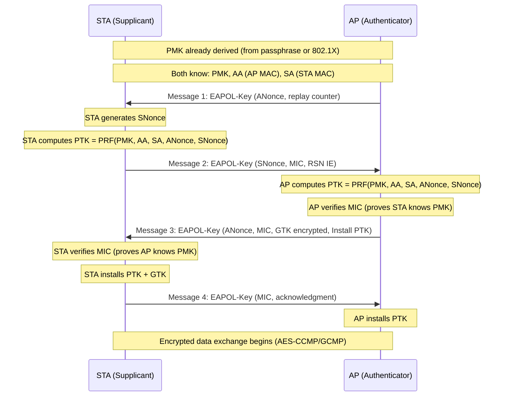
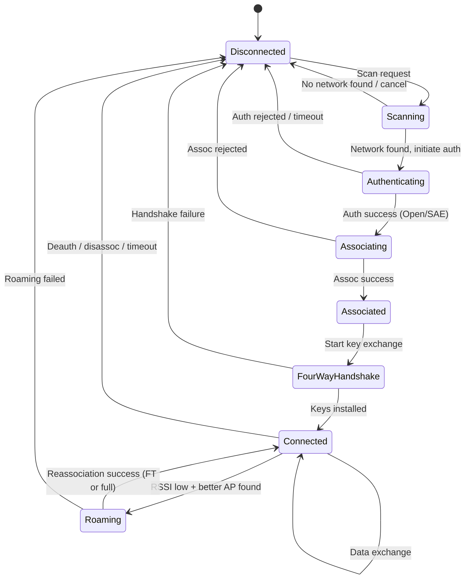
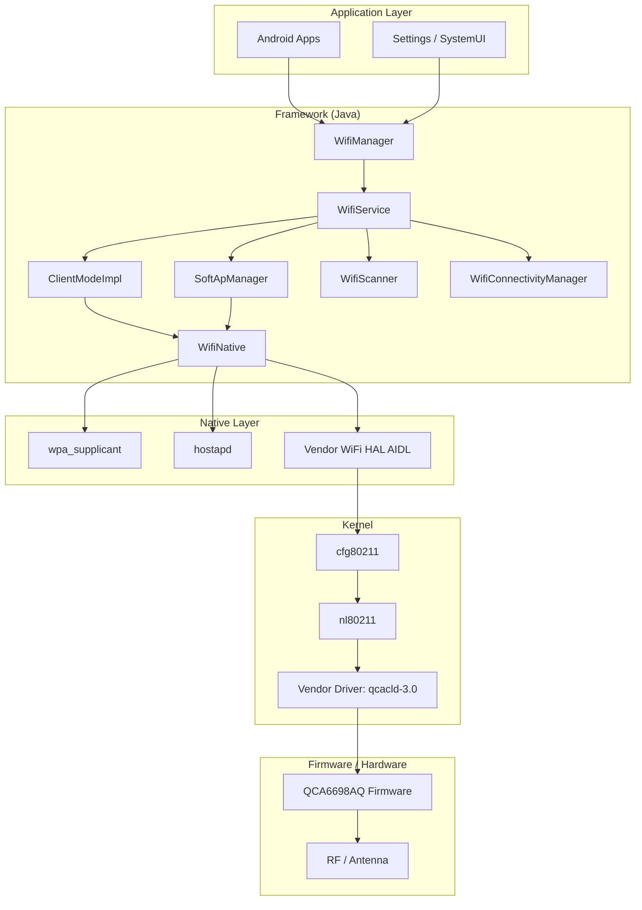
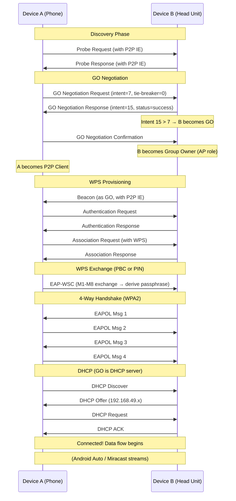
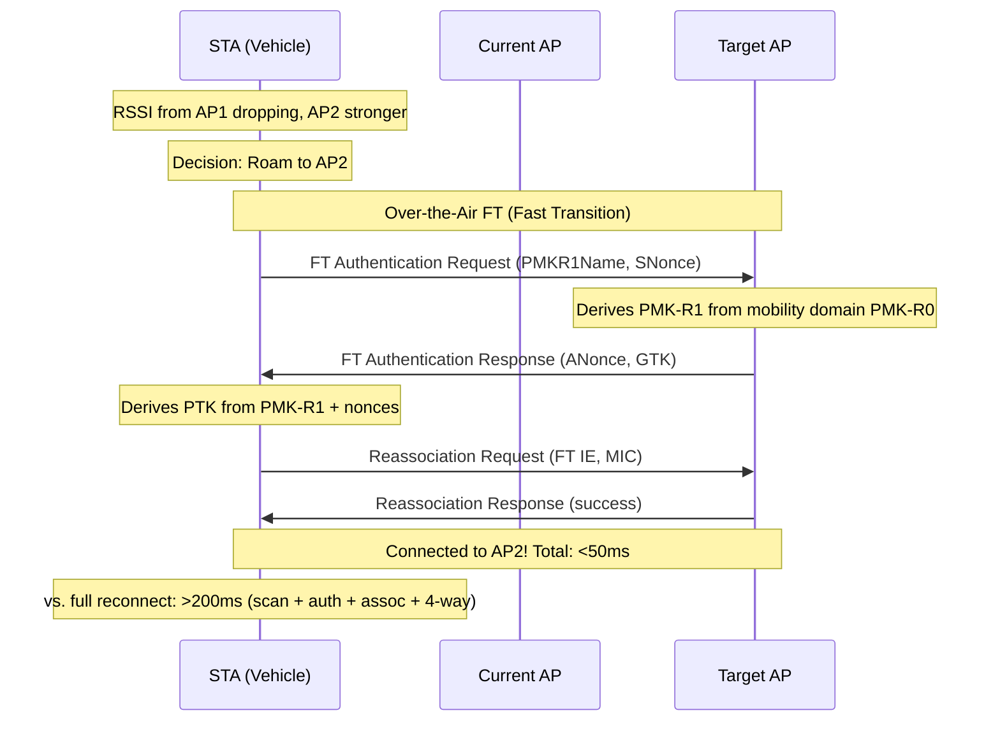

# Wi-Fi (IEEE 802.11) — DIAGRAMS & VISUAL REFERENCES
# ════════════════════════════════════════════════════════════════════
# Protocol: Wi-Fi (802.11) | Document: 02 of 08
# Format: ASCII art, Mermaid, timing diagrams, frame formats
# ════════════════════════════════════════════════════════════════════

---

## 1. WiFi PROTOCOL STACK (OSI MAPPING)

```
┌──────────────────────────────────────────────────────────────────┐
│ OSI Layer 7-5: Applications                                       │
│   HTTP │ DNS │ DHCP │ Miracast │ Android Auto │ OTA              │
├──────────────────────────────────────────────────────────────────┤
│ OSI Layer 4: Transport                                            │
│   TCP │ UDP                                                       │
├──────────────────────────────────────────────────────────────────┤
│ OSI Layer 3: Network                                              │
│   IPv4 │ IPv6 │ ARP │ ICMP                                      │
├──────────────────────────────────────────────────────────────────┤
│ OSI Layer 2 (Upper): LLC                                          │
│   802.2 LLC / SNAP (0xAA-0xAA-0x03)                             │
├──────────────────────────────────────────────────────────────────┤
│ OSI Layer 2 (Lower): MAC                                          │
│   ┌────────────────────────────────────────────────────────────┐ │
│   │ MAC Header │ Frame Body │ FCS (CRC-32)                     │ │
│   │ CSMA/CA │ EDCA/QoS │ Encryption (CCMP/GCMP)              │ │
│   │ Fragmentation │ A-MSDU │ A-MPDU aggregation               │ │
│   └────────────────────────────────────────────────────────────┘ │
├──────────────────────────────────────────────────────────────────┤
│ OSI Layer 1: PHY                                                  │
│   ┌────────────────────────────────────────────────────────────┐ │
│   │ PLCP Header (Preamble + Signal)                            │ │
│   │ OFDM modulation │ Spatial streams (MIMO)                   │ │
│   │ Channel bonding (20/40/80/160/320 MHz)                     │ │
│   │ Coding: BCC or LDPC                                        │ │
│   │ Guard Interval: 0.8/0.4/1.6/3.2 µs                       │ │
│   └────────────────────────────────────────────────────────────┘ │
│   Radio: 2.4 GHz │ 5 GHz │ 6 GHz                                │
└──────────────────────────────────────────────────────────────────┘
```

---

## 2. BSS TOPOLOGIES

```
INFRASTRUCTURE (BSS):                    AD-HOC (IBSS):
                                         
     ┌──────────┐                        ┌─────┐    ┌─────┐
     │    AP    │ ── wired backbone       │STA A│◄──►│STA B│
     └──┬──┬──┬┘                         └──┬──┘    └──┬──┘
        │  │  │                              │          │
   ┌────┘  │  └────┐                        └─────┬────┘
   │       │       │                              │
┌──▼──┐ ┌──▼──┐ ┌──▼──┐                      ┌──▼──┐
│STA 1│ │STA 2│ │STA 3│                      │STA C│
└─────┘ └─────┘ └─────┘                      └─────┘
                                              (All peers)

EXTENDED SERVICE SET (ESS):              MESH (802.11s):

┌─────────── Same SSID ──────────────┐   ┌─────┐    ┌─────┐
│                                     │   │Mesh │◄──►│Mesh │
│ ┌──────┐        ┌──────┐          │   │ STA │    │ STA │
│ │ AP 1 │──DS────│ AP 2 │          │   └──┬──┘    └──┬──┘
│ └──┬───┘        └──┬───┘          │      │     ╲    │
│    │                │              │      │      ╲   │
│ ┌──▼──┐          ┌──▼──┐          │   ┌──▼──┐  ┌─▼──▼─┐
│ │STA A│          │STA B│          │   │Mesh │  │ Mesh │──Internet
│ └─────┘  roam──▶ └─────┘          │   │ STA │  │ Gate │
└─────────────────────────────────────┘   └─────┘  └──────┘
```

---

## 3. CHANNEL MAP — 2.4 GHz

```
Channel:  1    2    3    4    5    6    7    8    9   10   11   12   13
Freq(MHz):2412 2417 2422 2427 2432 2437 2442 2447 2452 2457 2462 2467 2472

          ◄────────── 22 MHz ────────────►
Channel 1: [████████████████████████████]
                         Channel 6: [████████████████████████████]
                                                  Channel 11: [████████████████████████████]
          2401                      2437                      2473

Non-overlapping channels: 1, 6, 11 (US)
                          1, 5, 9, 13 (some EU configs)

40 MHz bonding:
  Ch 1+5 (primary 1): [══════════════════════════════════════════]
  Ch 5+9 (primary 5):           [══════════════════════════════════════════]
  Only ONE 40 MHz channel fits without overlap in 2.4 GHz!
```

---

## 4. CHANNEL MAP — 5 GHz

```
U-NII-1          U-NII-2           U-NII-2 Extended         U-NII-3
(Indoor)         (DFS)              (DFS)                   (Outdoor ok)
5150  5250       5250  5350        5470       5725         5725  5850
├─────────┤     ├─────────┤       ├───────────────┤       ├─────────┤
│36 40 44 48│   │52 56 60 64│     │100...140      │       │149...165│
└───────────┘   └───────────┘     └───────────────┘       └─────────┘
  No DFS          DFS required       DFS required          No DFS

20 MHz channels: 36,40,44,48,52,56,60,64,100,104,...,140,149,153,157,161,165
40 MHz bonds:    36+40, 44+48, 52+56, 60+64, ...
80 MHz bonds:    36-48, 52-64, 100-112, 116-128, 132-140*, 149-161*
160 MHz bonds:   36-64, 100-128

Preferred for automotive SoftAP: Ch 36-48 (no DFS, indoor allowed)
```

---

## 5. CHANNEL MAP — 6 GHz (Wi-Fi 6E/7)

```
5925 MHz                                                          7125 MHz
├────────────────────────────── 1200 MHz ──────────────────────────────┤

20 MHz: Channels 1,5,9,13,17,21,25,29,...,229,233 (59 channels)
40 MHz: 14 channels
80 MHz: [■■■■] [■■■■] [■■■■] ... (14 channels)
160 MHz:[■■■■■■■■] [■■■■■■■■] ... (7 channels)
320 MHz:[■■■■■■■■■■■■■■■■] [■■■■■■■■■■■■■■■■] [■■■■] (3 channels)

Benefits:
• No legacy devices → clean spectrum
• No DFS (in most regions)
• 320 MHz possible (Wi-Fi 7 only)
• AFC (Automated Frequency Coordination) for outdoor
```

---

## 6. WiFi FRAME FORMAT (802.11)

```
┌───────────────────────────────────────────────────────────────────────┐
│                        PHY Layer (PPDU)                                 │
├──────────┬────────────┬───────────────────────────────────────────────┤
│ Preamble │   Signal   │              PSDU (MAC Frame)                  │
│ (STF+LTF)│ (Rate,Len) │                                               │
└──────────┴────────────┴───────────────────────────────────────────────┘

MAC Frame (MPDU):
┌────────┬────────┬────────┬────────┬────────┬────────┬────────┬───────┐
│Frame   │Duration│Address1│Address2│Address3│ Seq    │Address4│ Frame │
│Control │/ ID    │ (DA)   │ (SA)   │ (BSSID)│ Control│(opt)   │ Body  │
│(2B)    │(2B)    │(6B)    │(6B)    │(6B)    │ (2B)   │(6B)    │(0-   │
│        │        │        │        │        │        │        │2304B) │
├────────┴────────┴────────┴────────┴────────┴────────┴────────┴───────┤
│                                                              │ FCS   │
│                                                              │ (4B)  │
└──────────────────────────────────────────────────────────────┴───────┘

Frame Control (2 bytes):
┌──────┬──────┬────────┬───────┬────────┬─────┬──────┬───────┬────────┐
│Proto │ Type │Subtype │ ToDS  │FromDS  │More │Retry │ PM   │More    │
│Ver(2)│ (2)  │  (4)   │ (1)   │  (1)   │Frag │ (1)  │ (1)  │Data(1) │
└──────┴──────┴────────┴───────┴────────┴─────┴──────┴───────┴────────┘
│Protected │ +HTC │
│Frame (1) │ (1)  │
└──────────┴──────┘

Address fields meaning (depends on ToDS/FromDS):
┌──────┬───────┬──────────┬──────────┬──────────┐
│ ToDS │FromDS │ Addr1    │ Addr2    │ Addr3    │
├──────┼───────┼──────────┼──────────┼──────────┤
│  0   │  0    │ DA       │ SA       │ BSSID    │  (IBSS)
│  0   │  1    │ DA       │ BSSID    │ SA       │  (AP→STA)
│  1   │  0    │ BSSID    │ SA       │ DA       │  (STA→AP)
│  1   │  1    │ RA       │ TA       │ DA       │  (WDS/Mesh)
└──────┴───────┴──────────┴──────────┴──────────┘
```

---

## 7. CSMA/CA TIMING DIAGRAM

```
                    DIFS              DIFS
    ←─────────────────────────────────────────────────────────────→
    
    STA A TX         │        SIFS│ACK      │   Backoff    │ STA B TX
    ┌────────────────┐       ┌───┐          │  ┌─────────┐ ┌──────────
    │ DATA Frame     │       │ACK│          │  │countdown│ │ DATA
    └────────────────┘       └───┘          │  └─────────┘ └──────────
    ─────────────────────────────────────────────────────────────────→ time

    Detailed:
    
    Channel busy (STA A)     SIFS  ACK   DIFS    Backoff=5 slots    TX
    │█████████████████████│░░░│███│░░░░░░│▓ ▓ ▓ ▓ ▓│█████████│
    
    STA B wants to TX:
    │   (waiting...)      │       │      │▓ ▓ ▓    │         │
    │   frozen backoff=3  │       │      │count: 3→2→1→0     │TX!
    
    STA C wants to TX (arrives during busy):
    │   (waiting...)      │       │      │▓ ▓ ▓ ▓ ▓ ▓ ▓│    │
    │   new backoff=7     │       │      │count: 7→6→5→4→3   │freeze
    │   (frozen: STA B TXing)                              │  (wait)

Legend: █ = TX  ░ = IFS  ▓ = Backoff slot  
```

---

## 8. 4-WAY HANDSHAKE



---

## 9. WiFi CONNECTION STATE MACHINE



---

## 10. OFDM SUBCARRIER STRUCTURE (20 MHz)

```
802.11a/g (Legacy OFDM, 20 MHz):
─────────────────────────── 20 MHz ───────────────────────────
│  guard  │              52 data + 4 pilot              │guard │
│  band   │              subcarriers                     │band  │
│         │                                             │      │
   -32    -26        -1  0  +1         +26        +32
    │      │          │  │DC│          │          │
    ├──────┼──────────┼──┼──┼──────────┼──────────┤
    │ null │ data+pil │null│ data+pil  │   null   │
    
Subcarrier spacing: 312.5 kHz (= 20 MHz / 64 FFT points)
Symbol duration: 3.2 µs (data) + 0.8 µs (GI) = 4.0 µs
Data subcarriers: 48 (802.11a/g), 52 (802.11n)

802.11ax (HE, 20 MHz):
─────────────────────────── 20 MHz ───────────────────────────
│ g │           234 data + 8 pilot subcarriers           │ g │
│   │                                                    │   │
Subcarrier spacing: 78.125 kHz (= 20 MHz / 256 FFT points)
→ 4× more subcarriers → OFDMA possible (subdivide into RUs)
Symbol duration: 12.8 µs (data) + 0.8/1.6/3.2 µs (GI) = 13.6/14.4/16.0 µs
```

---

## 11. OFDMA RESOURCE UNIT ALLOCATION (WiFi 6)

```
20 MHz channel divided into RUs:

Option A: 9 users × 26-tone RU (minimum allocation)
├─26─┤├─26─┤├─26─┤├─26─┤├─26─┤├─26─┤├─26─┤├─26─┤├─26─┤
│ U1 ││ U2 ││ U3 ││ U4 ││ U5 ││ U6 ││ U7 ││ U8 ││ U9 │
└────┘└────┘└────┘└────┘└────┘└────┘└────┘└────┘└────┘

Option B: 4 users × 52-tone RU
├──── 52 ────┤├──── 52 ────┤├──── 52 ────┤├──── 52 ────┤
│    User 1   ││    User 2   ││    User 3   ││    User 4   │
└─────────────┘└─────────────┘└─────────────┘└─────────────┘

Option C: 2 users × 106-tone RU
├──────────── 106 ───────────┤├──────────── 106 ───────────┤
│          User 1             ││          User 2             │
└─────────────────────────────┘└─────────────────────────────┘

Option D: 1 user × 242-tone RU (full 20 MHz, same as legacy)
├──────────────────────── 242 ─────────────────────────────┤
│                        User 1                              │
└────────────────────────────────────────────────────────────┘

Option E: Mixed (flexible)
├─26─┤├─26─┤├──── 52 ────┤├──────────── 106 ───────────┤
│ U1 ││ U2 ││    User 3   ││          User 4             │
└────┘└────┘└─────────────┘└─────────────────────────────┘

→ AP scheduler assigns RUs based on traffic demand per STA
→ Small packets (IoT) → small RU; bulk transfer → large RU
```

---

## 12. WiFi 7 MLO (MULTI-LINK OPERATION)

```
┌─────────────────────────────────────────────────────────────────┐
│                    MLD (Multi-Link Device)                        │
│                    Single MAC address                             │
├─────────────────────────────────────────────────────────────────┤
│                                                                   │
│   Link 1: 2.4 GHz          Link 2: 5 GHz        Link 3: 6 GHz  │
│   ┌───────────────┐        ┌──────────────┐     ┌─────────────┐│
│   │ 20/40 MHz     │        │ 80/160 MHz   │     │ 160/320 MHz ││
│   │ Low-latency   │        │ Medium BW    │     │ Max BW      ││
│   │ (control/ACK) │        │              │     │ (bulk data) ││
│   └───────┬───────┘        └──────┬───────┘     └──────┬──────┘│
│           │                       │                     │        │
│           └───────────────────────┼─────────────────────┘        │
│                                   │                               │
│                          ┌────────▼────────┐                     │
│                          │ Unified Traffic  │                     │
│                          │   Scheduler      │                     │
│                          │ (packet → link)  │                     │
│                          └─────────────────┘                     │
└─────────────────────────────────────────────────────────────────┘

Modes:
• STR (Simultaneous TX/RX): All links active simultaneously
• NSTR (Non-STR): One link at a time (simpler hardware)
• eMLSR (enhanced Multi-Link Single Radio): Switch between links

Benefits:
  Packet 1 → 6 GHz (fastest available)
  Packet 2 → 5 GHz (6 GHz busy)
  ACK → 2.4 GHz (always available, long range)
  → Latency reduced: If one link congested, use another instantly
```

---

## 13. BEAMFORMING

```
Without beamforming (omnidirectional):
        ╱ ╲
       ╱   ╲           Signal spreads in all directions
      ╱     ╲          → Energy wasted
     ╱  AP   ╲        → Lower received power at STA
    ╱ ╱ ╲ ╲ ╱ ╲       → Interference to other devices
   ╱╱   ╲╲╱   ╲╲
                          STA (low signal)

With beamforming (directed):
                ╲
                 ╲         Signal concentrated toward STA
           AP ━━━━━━━━▶ STA (strong signal)
                 ╱         → Higher SNR at STA
                ╱          → Higher MCS possible
                           → Less interference to others

Process:
1. AP sends NDP (Null Data Packet) — known training sequence
2. STA measures channel (computes CSI matrix)
3. STA feeds back compressed CSI to AP
4. AP applies beamforming matrix to subsequent TX
5. Result: Signal steered toward STA

MU-MIMO Beamforming:
           AP ━━━━━━━━▶ STA 1 (stream 1)
              ╲
               ━━━━━━━▶ STA 2 (stream 2)
              ╱
           AP ━━━━━━━━▶ STA 3 (stream 3)
  
  → Spatial separation allows simultaneous TX to multiple STAs
```

---

## 14. ANDROID WiFi ARCHITECTURE



---

## 15. WiFi DIRECT (P2P) GROUP FORMATION



---

## 16. POWER SAVE MODES

```
Legacy Power Save (PS-Poll):
──────────────────────────────────────────────────────────────────
Time →
                        Beacon Interval (100ms typical)
    │◄──────────────────────────────────────────────────────────►│
    
    AP:  ════[Beacon+TIM]════════════════════════[Beacon+TIM]════
                 ↓                                     ↓
    STA: ___[wake]_[sleep]_________________________________[wake]
              │ check TIM                                │ check
              │ No data buffered → sleep                 │ Data!
              │                                         │
              │                                      ┌──▼──┐
              │                                      │PS-  │
              │                                      │Poll │
              │                                      └──┬──┘
              │                                   ┌────▼─────┐
              │                                   │Data frame│
              │                                   └──────────┘

U-APSD (Unscheduled):
──────────────────────────────────────────────────────────────────
    STA: ___[sleep]___________[wake: need to send]___[sleep]___
                                     │
                              ┌──────▼──────┐
                              │Trigger frame│ (UL QoS Data/Null)
                              └──────┬──────┘
                                     │
                              ┌──────▼──────┐
                              │AP sends all │ (buffered frames)
                              │buffered data│ (EOSP=1 on last)
                              └─────────────┘
                              → No beacon wait! Immediate delivery

TWT (Target Wake Time, WiFi 6):
──────────────────────────────────────────────────────────────────
    Negotiated schedule: Wake at T, duration D, every interval I
    
    STA: ___[sleep 10s]___[wake 5ms]___[sleep 10s]___[wake 5ms]__
                            │ ↕ data │               │ ↕ data │
    
    Extreme power savings: Sleep 99.95% of time
    Perfect for: IoT sensors, TPMS, occupancy detection
```

---

## 17. ROAMING (802.11r FAST TRANSITION)



---

## 18. AUTOMOTIVE WiFi SYSTEM ARCHITECTURE

```
┌─────────────────────────────────────────────────────────────────────┐
│                    SA8295P AUTOMOTIVE PLATFORM                        │
│                                                                       │
│  ┌───────────────────────────────────────────────────────────────┐  │
│  │ Android Automotive OS (AAOS)                                   │  │
│  │                                                                │  │
│  │  ┌──────────┐  ┌────────────┐  ┌──────────┐  ┌────────────┐ │  │
│  │  │ OTA      │  │Android Auto│  │Passenger │  │  Fleet     │ │  │
│  │  │ Update   │  │ Wireless   │  │ Hotspot  │  │Management │ │  │
│  │  └────┬─────┘  └─────┬──────┘  └────┬─────┘  └────┬──────┘ │  │
│  │       │               │              │              │         │  │
│  │  ┌────▼───────────────▼──────────────▼──────────────▼─────┐  │  │
│  │  │          WiFi Service + Connectivity Manager            │  │  │
│  │  └────────────────────────┬────────────────────────────────┘  │  │
│  │                           │                                    │  │
│  │  ┌────────────────────────▼────────────────────────────────┐  │  │
│  │  │ wpa_supplicant (STA, P2P) │ hostapd (SoftAP)           │  │  │
│  │  └────────────────────────┬────────────────────────────────┘  │  │
│  │                           │                                    │  │
│  │  ┌────────────────────────▼────────────────────────────────┐  │  │
│  │  │ WiFi Vendor HAL (AIDL) + qcacld-3.0 driver             │  │  │
│  │  └────────────────────────┬────────────────────────────────┘  │  │
│  └───────────────────────────┼────────────────────────────────────┘  │
│                              │ PCIe                                    │
│  ┌───────────────────────────▼────────────────────────────────────┐  │
│  │                    QCA6698AQ                                     │  │
│  │  ┌─────────────────────────────────────────────────────────┐   │  │
│  │  │  WiFi 6E (2×2)     │  BT 5.2        │  Coexistence    │   │  │
│  │  │  • 2.4 GHz         │  • BR/EDR      │  • PTA          │   │  │
│  │  │  • 5 GHz           │  • BLE         │  • Freq. sep.   │   │  │
│  │  │  • 6 GHz           │  • LE Audio    │  • Time-div.    │   │  │
│  │  └─────────────────────┴────────────────┴─────────────────┘   │  │
│  └────────────────────────────┬───────────────────────────────────┘  │
│                               │ RF                                     │
│  ┌────────────────────────────▼───────────────────────────────────┐  │
│  │  Antenna System (shark-fin / embedded)                          │  │
│  │  • 2.4 GHz: shared with BT (diplexer)                         │  │
│  │  • 5 GHz: dedicated MIMO (2× antenna)                         │  │
│  │  • 6 GHz: shared with 5 GHz or dedicated                      │  │
│  └────────────────────────────────────────────────────────────────┘  │
│                                                                       │
│  ┌────────────────────────────────────────────────────────────────┐  │
│  │  Internet Source: TCU (Telematics Control Unit)                 │  │
│  │  • 4G/5G modem → rmnet0 interface                              │  │
│  │  • NAT: wlan1 (SoftAP) → rmnet0 (cellular)                   │  │
│  └────────────────────────────────────────────────────────────────┘  │
└─────────────────────────────────────────────────────────────────────┘
```

---

## 19. CONCURRENCY: STA + SAP + P2P SIMULTANEOUS

```
Single Radio (QCA6698AQ) — Time/Frequency Division:

Scenario: STA (connected to home WiFi) + SAP (hotspot) + P2P (Android Auto)

Case 1: SCC (Same Channel Concurrency) — BEST
┌─────────────────────────────────────────────────────┐
│  Channel 36 (5 GHz, 80 MHz)                         │
│  ┌──────────┐ ┌──────────┐ ┌──────────┐           │
│  │ STA      │ │ SoftAP   │ │ P2P GO   │           │
│  │ wlan0    │ │ wlan1    │ │ p2p0     │           │
│  └──────────┘ └──────────┘ └──────────┘           │
│  All on same channel → No time-sharing needed      │
│  → Full throughput for each (shared airtime)       │
└─────────────────────────────────────────────────────┘

Case 2: MCC (Multi-Channel Concurrency) — DEGRADED
┌─────────────────────────────────────────────────────┐
│  ┌─────────────────┐    ┌──────────────────────┐   │
│  │ Channel 36      │    │ Channel 149          │   │
│  │ STA (wlan0)     │    │ SAP (wlan1) + P2P   │   │
│  └────────┬────────┘    └───────────┬──────────┘   │
│           │                         │               │
│    50% time ◄─── Radio switches ──► 50% time       │
│           │    (every ~50-100ms)    │               │
│                                                     │
│  → Each interface gets ~50% airtime                │
│  → Higher latency (buffering during away time)     │
│  → Avoid if possible                               │
└─────────────────────────────────────────────────────┘

Strategy:
1. Force SAP to same channel as STA (if STA connected first)
2. If STA not connected, choose channel freely for SAP
3. P2P should use same band/channel as SAP when possible
4. Fall back to MCC only when channels can't align
```

---

## 20. ENCRYPTION: CCMP vs GCMP

```
CCMP (Counter Mode with CBC-MAC Protocol) — WPA2:
┌─────────────────────────────────────────────────────────────────┐
│ Input:                                                           │
│   TK (128-bit) + Nonce (48-bit PN + A2) + AAD (MAC header)    │
│                                                                  │
│ Process:                                                         │
│   1. CBC-MAC: Compute MIC over AAD + plaintext (integrity)     │
│   2. CTR Mode: Encrypt plaintext + MIC (confidentiality)       │
│                                                                  │
│ Output:                                                          │
│   ┌────────┬──────────┬─────────────────────┬─────────┐        │
│   │MAC Hdr │CCMP Hdr  │ Encrypted Payload   │ MIC(8B) │        │
│   │(plain) │(PN, KeyID)│                    │         │        │
│   └────────┴──────────┴─────────────────────┴─────────┘        │
│                                                                  │
│ Security: AES-128, 8-byte MIC, 48-bit replay counter (PN)      │
└─────────────────────────────────────────────────────────────────┘

GCMP (Galois/Counter Mode Protocol) — WPA3-Enterprise 192-bit:
┌─────────────────────────────────────────────────────────────────┐
│ Input:                                                           │
│   TK (256-bit) + Nonce (48-bit PN + A2) + AAD                 │
│                                                                  │
│ Process:                                                         │
│   AES-GCM: Single pass — encrypts AND authenticates            │
│   (More efficient than CCMP on hardware with AES-NI)           │
│                                                                  │
│ Output:                                                          │
│   ┌────────┬──────────┬─────────────────────┬──────────┐       │
│   │MAC Hdr │GCMP Hdr  │ Encrypted Payload   │ MIC(16B) │       │
│   │(plain) │(PN, KeyID)│                    │          │       │
│   └────────┴──────────┴─────────────────────┴──────────┘       │
│                                                                  │
│ Security: AES-256, 16-byte MIC, stronger than CCMP             │
└─────────────────────────────────────────────────────────────────┘
```

---

END OF DOCUMENT 02 — DIAGRAMS & VISUAL REFERENCES
