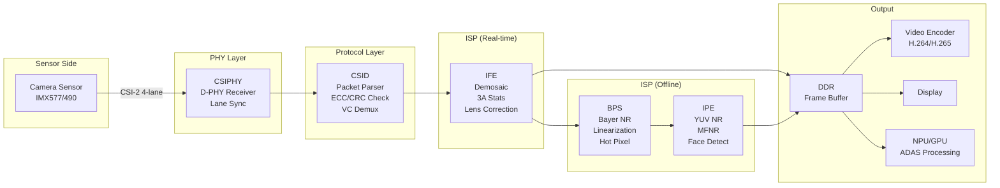
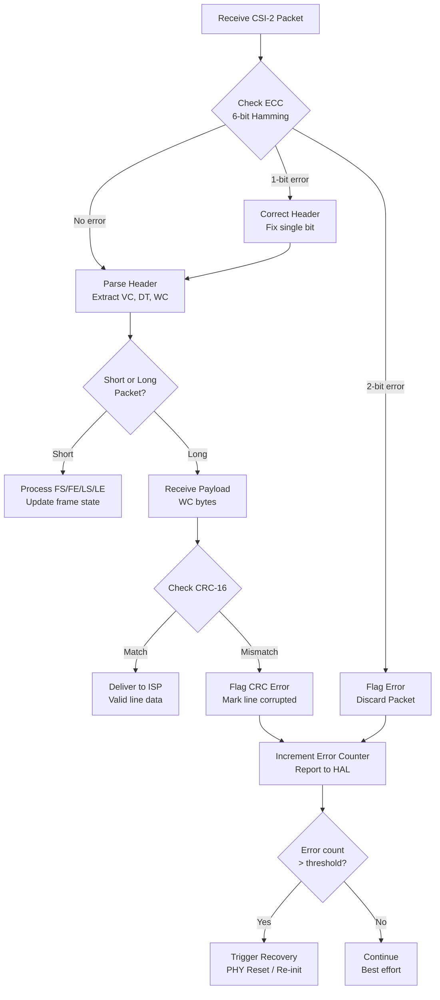

# MIPI CSI-2 — DIAGRAMS & VISUAL REFERENCES
# ════════════════════════════════════════════════════════════════════
# Protocol: MIPI CSI-2 | Document: 02 of 08
# Format: ASCII art, Mermaid, timing diagrams
# ════════════════════════════════════════════════════════════════════

---

## 1. CSI-2 PROTOCOL STACK

```
┌─────────────────────────────────────────────────────────────────┐
│  APPLICATION LAYER                                               │
│  Camera HAL3 │ V4L2 │ ISP Pipeline Control │ 3A (AE/AF/AWB)   │
├─────────────────────────────────────────────────────────────────┤
│  CSI-2 PROTOCOL LAYER                                            │
│  ┌────────────────────────────────────────────────────────────┐ │
│  │ Short Packets: Frame Start │ Frame End │ Line Start/End    │ │
│  │ Long Packets:  [PH: DI+WC+ECC] [Payload] [CRC-16]        │ │
│  │ Virtual Channels: VC0-VC3 (standard) │ VC0-VC31 (ext)    │ │
│  │ Data Types: RAW8/10/12/14 │ YUV422 │ RGB │ Embedded      │ │
│  └────────────────────────────────────────────────────────────┘ │
├─────────────────────────────────────────────────────────────────┤
│  LANE MANAGEMENT LAYER                                           │
│  ┌────────────────────────────────────────────────────────────┐ │
│  │ Byte-to-lane distribution (round-robin)                     │ │
│  │ Lane synchronization (SoT alignment across lanes)          │ │
│  │ Lane merging at receiver (reorder bytes)                    │ │
│  └────────────────────────────────────────────────────────────┘ │
├─────────────────────────────────────────────────────────────────┤
│  PHY LAYER (D-PHY)                                               │
│  ┌────────────────────────────────────────────────────────────┐ │
│  │ HS Mode: 200 mV differential, DDR, 80M–4.5 Gbps/lane     │ │
│  │ LP Mode: 1.2V single-ended, ~10 Mbps (control signaling) │ │
│  │ Clock Lane: Continuous/non-continuous DDR clock            │ │
│  │ States: LP-11 → LP-01 → LP-00 → HS-0 → HS Data → EoT   │ │
│  └────────────────────────────────────────────────────────────┘ │
│  Wires: CLK_P/N + D0_P/N + D1_P/N + D2_P/N + D3_P/N          │
└─────────────────────────────────────────────────────────────────┘
```

---

## 2. D-PHY LANE STRUCTURE

```
D-PHY 4-Lane Configuration (10 wires total):

                    Sensor (TX)                    SoC (RX)
                   ┌──────────┐                  ┌──────────┐
  CLK_P ──────────┤ CLK Lane ├──────────────────┤ CLK Lane │
  CLK_N ──────────┤   (TX)   ├──────────────────┤   (RX)   │
                   ├──────────┤                  ├──────────┤
  D0_P  ──────────┤ Data     ├──────────────────┤ Data     │
  D0_N  ──────────┤ Lane 0   ├──────────────────┤ Lane 0   │
                   ├──────────┤                  ├──────────┤
  D1_P  ──────────┤ Data     ├──────────────────┤ Data     │
  D1_N  ──────────┤ Lane 1   ├──────────────────┤ Lane 1   │
                   ├──────────┤                  ├──────────┤
  D2_P  ──────────┤ Data     ├──────────────────┤ Data     │
  D2_N  ──────────┤ Lane 2   ├──────────────────┤ Lane 2   │
                   ├──────────┤                  ├──────────┤
  D3_P  ──────────┤ Data     ├──────────────────┤ Data     │
  D3_N  ──────────┤ Lane 3   ├──────────────────┤ Lane 3   │
                   └──────────┘                  └──────────┘

Direction: Unidirectional (Sensor → SoC only for CSI-2)
```

---

## 3. D-PHY STATE MACHINE (HS Entry/Exit)

```
             ┌─────────────────────────────────────────────────────────┐
             │                    HS BURST                               │
    LP-11    │    LP-01     LP-00    HS-0     HS Data         LP-11    │
  (Stop/Idle)│  (HS-Req)  (Bridge) (Preamble) (Payload)   (Stop/Idle) │
             │                                                          │
Dp: ─1.2V───┼──0V────────0V───────┐                        ─1.2V─────┼─
             │                      │    ┌───differential───┐           │
Dn: ─1.2V───┼──1.2V──────0V───────┘    │   200mV swing    │  ─1.2V──┼─
             │                           │  ╱╲╱╲╱╲╱╲╱╲╱╲╱╲ │           │
             │  T_REQ    T_LP00   T_HS0  └──────────────────┘  EoT     │
             │  ≥40ns    ≥38ns    sync    Data bits (DDR)      T_TRAIL │
             │                                                          │
             └─── SoT (Start of Transmission) ──── Data ──── EoT ─────┘

Timing:
  T_HS-PREPARE + T_HS-ZERO = Total HS entry overhead (~200-300 ns)
  Data burst: N bytes × 8 bits × UI (e.g., 1 line of pixels)
  T_HS-TRAIL: ≥ 60ns (ensure receiver captures last bits)
  T_HS-EXIT: ≥ 100ns (before next HS entry)
```

---

## 4. CSI-2 PACKET FORMAT

```
SHORT PACKET (4 bytes — no payload):
┌─────────────────────────────────────────────────────┐
│  Byte 0     │  Byte 1     │  Byte 2     │  Byte 3  │
│  Data ID    │  Short Packet Data         │  ECC     │
│ [VC1:VC0|   │  [15:8]     │  [7:0]      │  [5:0]   │
│  DT5:DT0]   │             │             │          │
└─────────────────────────────────────────────────────┘
  Examples: Frame Start (DT=0x00, Data=Frame#)
            Frame End   (DT=0x01, Data=Frame#)

LONG PACKET (4 + WC + 2 bytes — carries pixel data):
┌──────────┬───────────────┬──────┬─────────────────────────────┬──────┐
│  Data ID │  Word Count   │ ECC  │         Payload             │ CRC  │
│ (1 byte) │  (2 bytes)    │(1 B) │  (WC bytes of pixel data)  │(2 B) │
│VC[1:0]+  │  0 to 65535   │      │  RAW10/12, YUV, RGB, etc  │      │
│ DT[5:0]  │  (payload len)│      │                            │      │
└──────────┴───────────────┴──────┴─────────────────────────────┴──────┘
  │←──── Packet Header (PH) ────→│←──── Data ────→│←─ Footer ─→│
           4 bytes                    WC bytes         2 bytes

DATA ID breakdown:
┌────┬────┬────┬────┬────┬────┬────┬────┐
│VC1 │VC0 │ DT5│ DT4│ DT3│ DT2│ DT1│ DT0│
└────┴────┴────┴────┴────┴────┴────┴────┘
 [7]  [6]  [5]  [4]  [3]  [2]  [1]  [0]
```

---

## 5. FRAME TRANSMISSION TIMING

```
Time →
                    Frame N                           Frame N+1
├─────────────────────────────────────────────┤├────────────────
│VBI│  Active Image Data                  │VBI││VBI│  Active...
│   │                                      │   ││   │

Detailed Frame N:
┌───┐┌──────────────────────────────────────────────┐┌───┐
│FS ││  Line 0: [PH│pixel data (WC bytes)│CRC]     ││FE │
└───┘│  Line 1: [PH│pixel data (WC bytes)│CRC]     │└───┘
     │  Line 2: [PH│pixel data (WC bytes)│CRC]     │
     │  ...                                         │
     │  Line H-1: [PH│pixel data (WC bytes)│CRC]   │
     └──────────────────────────────────────────────┘

Each line on the PHY:
│LP-11│SoT│PH│Pixel Data│CRC│EoT│LP-11│ ← Horizontal Blanking →│

With Embedded Data:
│FS│ ED Line 0│ ED Line 1│ Image Line 0│...│ Image Line H-1│FE│
     (DT=0x12)  (DT=0x12)   (DT=0x2B)        (DT=0x2B)
```

---

## 6. RAW10 PIXEL PACKING

```
RAW10: 4 pixels packed into 5 bytes

Pixel values (10-bit each):
  P0 = [P0.9 P0.8 P0.7 P0.6 P0.5 P0.4 P0.3 P0.2 P0.1 P0.0]
  P1 = [P1.9 P1.8 P1.7 P1.6 P1.5 P1.4 P1.3 P1.2 P1.1 P1.0]
  P2 = [P2.9 P2.8 P2.7 P2.6 P2.5 P2.4 P2.3 P2.2 P2.1 P2.0]
  P3 = [P3.9 P3.8 P3.7 P3.6 P3.5 P3.4 P3.3 P3.2 P3.1 P3.0]

Byte layout:
┌─────────┬─────────┬─────────┬─────────┬─────────────────────┐
│ Byte 0  │ Byte 1  │ Byte 2  │ Byte 3  │      Byte 4         │
│P0[9:2]  │P1[9:2]  │P2[9:2]  │P3[9:2]  │P3[1:0]P2[1:0]P1[1:0]P0[1:0]│
│ (MSBs)  │ (MSBs)  │ (MSBs)  │ (MSBs)  │ (all LSBs packed)   │
└─────────┴─────────┴─────────┴─────────┴─────────────────────┘
                                           [7:6] [5:4] [3:2] [1:0]

For 1920 pixel wide RAW10 line:
  WC (Word Count) = 1920 × 10 / 8 = 2400 bytes per line
  (or equivalently: (1920 / 4) × 5 = 2400 bytes)

RAW12: 2 pixels packed into 3 bytes
┌─────────┬─────────┬───────────────────┐
│ Byte 0  │ Byte 1  │     Byte 2        │
│P0[11:4] │P1[11:4] │P1[3:0] | P0[3:0] │
└─────────┴─────────┴───────────────────┘
                      [7:4]     [3:0]
```

---

## 7. LANE DISTRIBUTION (BYTE-TO-LANE MAPPING)

```
4-Lane D-PHY: Bytes distributed round-robin across lanes

Packet bytes:  B0  B1  B2  B3  B4  B5  B6  B7  B8  B9  B10 B11 ...
                │   │   │   │   │   │   │   │   │   │   │   │
Lane 0:        B0              B4              B8              B12
Lane 1:            B1              B5              B9
Lane 2:                B2              B6              B10
Lane 3:                    B3              B7              B11

2-Lane D-PHY:
Lane 0:        B0      B2      B4      B6      B8      B10
Lane 1:            B1      B3      B5      B7      B9      B11

1-Lane D-PHY:
Lane 0:        B0  B1  B2  B3  B4  B5  B6  B7  B8  B9  B10  B11

Receiver: Reassembles bytes in order using lane synchronization
           (SoT sync byte 0xB8 aligns all lanes)
```

---

## 8. VIRTUAL CHANNEL MULTIPLEXING

```
Single Physical Interface (4 lanes) — Multiple Logical Streams:

Time →
├──VC0 Frame────────────────────────────────────────────────────┤
│FS(vc=0)│Emb│Line0│Line1│...│LineH│FE(vc=0)│
│                                             │
├──VC1 Frame (interleaved)────────────────────┤
│         │FS(vc=1)│Line0│Line1│...│FE(vc=1)│ │
│         │                                   │ │
├─────────────────────────────────────────────────────────────────

On the wire (packets interleaved by line):
│FS_VC0│FS_VC1│L0_VC0│L0_VC1│L1_VC0│L1_VC1│...│FE_VC0│FE_VC1│

Receiver demultiplexes by checking VC bits in each packet's Data ID:
  VC=00 → Route to ISP path A (main image)
  VC=01 → Route to ISP path B (HDR short exposure)
  VC=10 → Route to embedded data parser
  VC=11 → Route to PDAF processing
```

---

## 9. AUTOMOTIVE SerDes CAMERA SYSTEM

```
┌────────────┐                                      ┌──────────────┐
│ Camera     │   CSI-2                              │              │
│ Sensor     ├──(4-lane)──┐                         │   SA8295P    │
│ (IMX490)   │            │                         │              │
└────────────┘     ┌──────▼──────┐    Coax/STP     │ ┌──────────┐ │
                   │ Serializer  │══════(15m)═══════│─┤Deserial. │ │
                   │ MAX96717    │    GMSL2 6Gbps   │ │MAX96712  │ │
                   └─────────────┘                  │ │(4:1 aggr)├─┼─CSI-2→CSIPHY
┌────────────┐            │                         │ │          │ │
│ Camera     │   CSI-2    │                         │ │          │ │
│ Sensor     ├──(2-lane)──┘                         │ └──────────┘ │
│ (IMX390)   │     ┌─────────────┐    Coax         │              │
└────────────┘     │ Serializer  │══════(15m)═══════│─┤            │
                   │ MAX96717    │                   │              │
                   └─────────────┘                  └──────────────┘

MAX96712 Deserializer:
  4× GMSL2 inputs (from 4 cameras)
  → Aggregates into single 4-lane CSI-2 output
  → Virtual Channels: Camera A=VC0, B=VC1, C=VC2, D=VC3
  → SoC sees 4 independent camera streams on 1 CSI-2 port
```

---

## 10. QUALCOMM CAMERA PROCESSING PIPELINE



---

## 11. D-PHY EYE DIAGRAM

```
Ideal HS Eye Diagram (at receiver):

Voltage (mV)
 +100 ─┐         ╱╲         ╱╲         ╱╲
       │       ╱    ╲     ╱    ╲     ╱    ╲
       │     ╱        ╲ ╱        ╲ ╱        ╲
    0 ─┤───╱──────╳─────╳──────╳─────╳──────╳──── (crossing)
       │ ╱        ╱ ╲        ╱ ╲        ╱ ╲
       │╱       ╱     ╲   ╱     ╲   ╱     ╲
 -100 ─┘     ╱         ╲╱         ╲╱         ╲
       ├──────┼───────────┼───────────┼──────────→ Time
       │      │← 1 UI  →│← 1 UI  →│
       │      │           │           │

Eye opening requirements (D-PHY v2.0):
  • Vertical: ≥ 60 mV (at sampling point)
  • Horizontal: ≥ 0.35 UI (timing margin)
  • Jitter: < 0.15 UI (random) + 0.15 UI (deterministic)

If eye closed:
  → Signal integrity issue (crosstalk, attenuation, impedance mismatch)
  → Reduce data rate or fix PCB routing
```

---

## 12. POWER SEQUENCE DIAGRAM

```
Power-On Sequence (Camera Sensor):

Time →    0ms     2ms     4ms     6ms     8ms    20ms
           │       │       │       │       │       │
AVDD:  ────┐       │       │       │       │       │
(2.8V)     └───────┼───────┼───────┼───────┼───────┼──── ON
                    │       │       │       │       │
DOVDD: ────────────┐       │       │       │       │
(1.8V)             └───────┼───────┼───────┼───────┼──── ON
                            │       │       │       │
DVDD:  ────────────────────┐       │       │       │
(1.05V)                    └───────┼───────┼───────┼──── ON
                                    │       │       │
RESET_N: ──────LOW─────────────────┐       │       │
                                    └───────┼───────┼──── HIGH
                                            │       │
MCLK:   ──────OFF──────────────────────────┐       │
(24MHz)                                     └───────┼──── ON
                                                    │
I2C Ready: ─────────────────────────────────────────┼──── READY
                                                    │
CSI-2 Stream: ──────────────────────────────────────────── AFTER CONFIG

Power-Off: REVERSE order (MCLK→RESET→DVDD→DOVDD→AVDD)
```

---

## 13. HDR (DOL) OVER CSI-2

```
DOL-HDR: Two exposures interleaved on CSI-2:

Physical readout from sensor:
┌────────────────────────────────────────────────────────────┐
│ FS(VC0) │ FS(VC1) │                                        │
│ ED_VC0  │ ED_VC1  │  ← Embedded data for both exposures   │
│ L0_VC0 (Long Exp) │ L0_VC1 (Short Exp) │                  │
│ L1_VC0 (Long Exp) │ L1_VC1 (Short Exp) │                  │
│ L2_VC0 (Long Exp) │ L2_VC1 (Short Exp) │                  │
│ ...                │ ...                 │                  │
│ LN_VC0             │ LN_VC1              │                  │
│ FE(VC0)            │ FE(VC1)             │                  │
└────────────────────────────────────────────────────────────┘

ISP Merging:
  Long Exp (VC0):   ████████▓▓▓▓░░░░   (dark areas good, bright saturated)
  Short Exp (VC1):  ░░░░░░░░▓▓▓▓████   (bright areas good, dark noisy)
                         ↓ HDR Merge ↓
  Merged HDR:       ████████████████████  (full dynamic range: 100+ dB)
```

---

## 14. MULTI-CAMERA SYNCHRONIZATION

```
Hardware Frame Sync (XVS/FSIN):

┌─────────────┐
│   SA8295P   │──── GPIO (XVS pulse) ────┬────── Camera 0 (FSIN)
│   (Master)  │                          ├────── Camera 1 (FSIN)
│             │                          ├────── Camera 2 (FSIN)
└─────────────┘                          └────── Camera 3 (FSIN)

Timing:
XVS: ─────┐     ┌─────────────────────────────────┐     ┌──────
          └─────┘ (pulse every 33.3 ms = 30 fps)  └─────┘

Cam0: ──────────[FS]════ Frame N ════[FE]──────────[FS]═══
Cam1: ──────────[FS]════ Frame N ════[FE]──────────[FS]═══
Cam2: ──────────[FS]════ Frame N ════[FE]──────────[FS]═══
Cam3: ──────────[FS]════ Frame N ════[FE]──────────[FS]═══
                ↑                                   ↑
                All start within <100µs of XVS pulse

Sync accuracy:
  Hardware sync: < 1 line period (< 30 µs typically)
  Software sync: ± 1 frame (33 ms) — NOT acceptable for ADAS
```

---

## 15. ERROR DETECTION FLOW



---

## 16. ANDROID CAMERA STACK

```
┌─────────────────────────────────────────────────────────────┐
│  Android Application                                         │
│  ┌───────────────────────────────────────────────────────┐  │
│  │ Camera2 API / CameraX                                  │  │
│  │ openCamera() → createCaptureSession() → capture()     │  │
│  └───────────────────────────────┬───────────────────────┘  │
│                                  │ AIDL/Binder               │
│  ┌───────────────────────────────▼───────────────────────┐  │
│  │ CameraService (system_server process)                  │  │
│  │ → ICameraDevice HAL interface                          │  │
│  └───────────────────────────────┬───────────────────────┘  │
│                                  │ HAL3 interface            │
├──────────────────────────────────┼──────────────────────────┤
│  Vendor HAL (camera.provider)    │                           │
│  ┌───────────────────────────────▼───────────────────────┐  │
│  │ CamX / Chi-CDK (Qualcomm)                              │  │
│  │ ┌─────────┐ ┌─────────┐ ┌─────────┐ ┌─────────┐     │  │
│  │ │Sensor   │→│IFE      │→│BPS      │→│IPE      │     │  │
│  │ │Node     │ │Node     │ │Node     │ │Node     │     │  │
│  │ └─────────┘ └─────────┘ └─────────┘ └─────────┘     │  │
│  └───────────────────────────────┬───────────────────────┘  │
│                                  │ V4L2 / ioctl             │
├──────────────────────────────────┼──────────────────────────┤
│  Linux Kernel                    │                           │
│  ┌───────────────────────────────▼───────────────────────┐  │
│  │ Sensor Driver (I2C/CCI) │ CSIPHY │ CSID │ VFE/IFE    │  │
│  └───────────────────────────────┬───────────────────────┘  │
│                                  │ Register access           │
├──────────────────────────────────┼──────────────────────────┤
│  Hardware                        │                           │
│  ┌───────────────────────────────▼───────────────────────┐  │
│  │ Camera Sensor → D-PHY → CSIPHY → CSID → IFE → DDR   │  │
│  └───────────────────────────────────────────────────────┘  │
└─────────────────────────────────────────────────────────────┘
```

---

## 17. CCI (I2C) SENSOR CONFIGURATION

```
Camera Control Interface (CCI):

SA8295P                          Camera Sensor
┌──────────┐                    ┌──────────────┐
│ CCI      │── SDA (data) ─────│ I2C Slave    │
│ Master   │── SCL (clock) ────│ (7-bit addr) │
│ (I2C)    │                    │ 0x1A (IMX577)│
└──────────┘                    └──────────────┘
  400 kHz or 1 MHz               16-bit registers

Configuration flow:
┌────────────────────────────────────────────────────────────────┐
│ 1. Power-on sensor (GPIO + regulators)                         │
│ 2. Send soft-reset: Write 0x0103 = 0x01                       │
│ 3. Wait 10ms                                                   │
│ 4. Read chip ID: Read 0x0016 → expect 0x0577                  │
│ 5. Load init settings (100-500 register writes)               │
│ 6. Set resolution: 0x034C/034E = width/height                 │
│ 7. Set frame rate: 0x0340 = frame_length_lines                │
│ 8. Set exposure: 0x0202 = coarse_integration_time             │
│ 9. Set gain: 0x0204 = analog_gain_code                        │
│ 10. Set CSI config: 0x0112 = data_format, 0x0114 = lane_mode │
│ 11. Start streaming: Write 0x0100 = 0x01                      │
│ 12. CSI-2 data begins flowing to SoC                          │
└────────────────────────────────────────────────────────────────┘
```

---

## 18. C-PHY TRIO SIGNALING

```
C-PHY: 3 wires (A, B, C) with 6 valid states:

Wire states (one HIGH +350mV, one MID 0V, one LOW -350mV):
  State 0: A=H, B=M, C=L     (+,0,-)
  State 1: A=H, B=L, C=M     (+,-,0)
  State 2: A=M, B=H, C=L     (0,+,-)
  State 3: A=L, B=H, C=M     (-,+,0)
  State 4: A=M, B=L, C=H     (0,-,+)
  State 5: A=L, B=M, C=H     (-,0,+)

From any state, 5 valid next states (can't stay same):
  → Each transition carries log₂(5) ≈ 2.322 bits

Symbol mapping (16 symbols = 7 transitions):
  7 transitions × 2.322 bits/transition = 16.25 bits (carry 16 bits)
  Encoding: 16 bits per 7 symbols → 16/7 overhead

Effective bit rate:
  Rate = Symbol_rate × 2.28 bits/symbol × 16/7
  At 3.5 Gsps: 3.5 × 2.28 × 16/7 ≈ 18.24 Gbps per trio

No separate clock lane needed (clock embedded in transitions)!
```

---

## 19. COMPLETE AUTOMOTIVE CAMERA SYSTEM

```
┌─────────────────────────────────────────────────────────────────────────┐
│                    AUTOMOTIVE CAMERA SYSTEM (SA8295P)                     │
│                                                                           │
│  EXTERIOR (Long cable via SerDes):                                       │
│  ┌────────┐  CSI-2  ┌────────┐  GMSL2   ┌──────────┐                  │
│  │Front   ├────────→│MAX96717├══(coax)══→│          │  CSI-2    ┌────┐ │
│  │8MP     │  4-lane │Ser.    │  15m      │MAX96712  ├──(4L)───→│CSI │ │
│  └────────┘         └────────┘           │4:1 Deser│           │PHY0│ │
│  ┌────────┐  CSI-2  ┌────────┐  GMSL2   │          │           └────┘ │
│  │Rear    ├────────→│MAX96717├══(coax)══→│          │                   │
│  │2MP     │  2-lane │Ser.    │  10m      └──────────┘                   │
│  └────────┘         └────────┘                                          │
│  ┌────────┐  CSI-2  ┌────────┐  GMSL2   ┌──────────┐  CSI-2    ┌────┐│
│  │Surr. FL├────────→│MAX96717├══(coax)══→│MAX96712  ├──(4L)───→│CSI ││
│  │Surr. FR├────────→│MAX96717├══(coax)══→│4:1 Deser│           │PHY1││
│  │Surr. RL├────────→│MAX96717├══(coax)══→│          │           └────┘│
│  │Surr. RR├────────→│MAX96717├══(coax)══→│          │                  │
│  └────────┘         └────────┘           └──────────┘                   │
│                                                                           │
│  INTERIOR (Direct-attach, short cable):                                  │
│  ┌────────┐  CSI-2 (2-lane, direct ~10cm)              ┌────┐          │
│  │DMS     ├────────────────────────────────────────────→│CSI │          │
│  │(IR+Vis)│                                             │PHY2│          │
│  └────────┘                                             └────┘          │
│  ┌────────┐  CSI-2 (2-lane, direct ~10cm)              ┌────┐          │
│  │Interior├────────────────────────────────────────────→│CSI │          │
│  │Monitor │                                             │PHY3│          │
│  └────────┘                                             └────┘          │
│                                                                           │
│  SA8295P Internal:                                                       │
│  CSIPHY0─→CSID0─→IFE0─→DDR─→NPU (ADAS: Object detection)             │
│  CSIPHY1─→CSID1─→IFE1─→DDR─→GPU (Surround view stitching)            │
│  CSIPHY2─→CSID2─→IFE2─→DDR─→DMS algo (drowsiness detection)          │
│  CSIPHY3─→CSID3─→IFE3─→DDR─→Display (rear-view mirror)               │
└─────────────────────────────────────────────────────────────────────────┘
```

---

## 20. CSI-2 vs DSI COMPARISON

```
┌────────────────────────────────────────────────────────────────────┐
│           CSI-2 (Camera)          │        DSI (Display)           │
├───────────────────────────────────┼────────────────────────────────┤
│ Direction: Sensor → SoC           │ Direction: SoC → Display       │
│ (Unidirectional TX only)         │ (Bidirectional: command+data)  │
│                                   │                                │
│ Data: Image pixels (RAW/YUV)     │ Data: Display pixels (RGB)     │
│                                   │                                │
│ Packets: FS/FE + Line data       │ Packets: VSS/VSE + pixel data  │
│                                   │ + DCS commands                 │
│                                   │                                │
│ Control: Separate I2C/CCI        │ Control: Same DSI lanes (LP)   │
│                                   │                                │
│ PHY: D-PHY (TX only at sensor)   │ PHY: D-PHY (bidirectional)    │
│                                   │ Lane 0 can do LP RX (TE, ACK) │
│                                   │                                │
│ Typical: 2-4 lanes, 1-2.5 Gbps  │ Typical: 1-4 lanes, 1-2 Gbps  │
└───────────────────────────────────┴────────────────────────────────┘
```

---

END OF DOCUMENT 02 — DIAGRAMS & VISUAL REFERENCES
