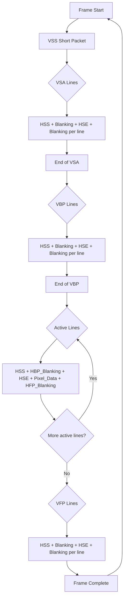
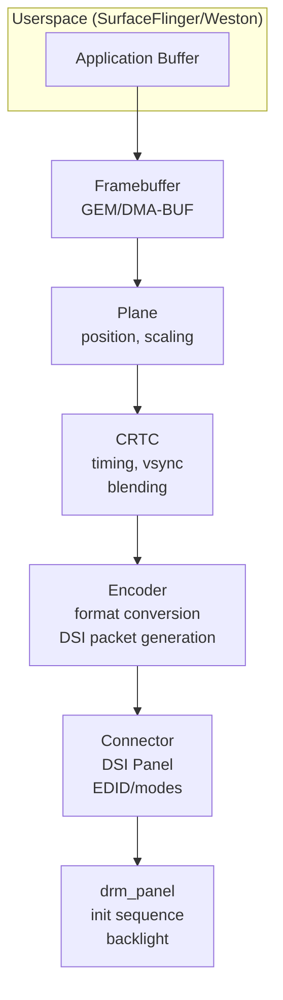

# MIPI DSI — DIAGRAMS & VISUAL REFERENCES
# ════════════════════════════════════════════════════════════════════
# Protocol: MIPI DSI | Document: 02 of 08
# Format: ASCII art, Mermaid, timing diagrams
# ════════════════════════════════════════════════════════════════════

---

## 1. DSI PROTOCOL STACK

```
┌─────────────────────────────────────────────────────────────────┐
│  APPLICATION LAYER                                               │
│  SurfaceFlinger │ HWComposer │ DRM/KMS │ Display Manager       │
├─────────────────────────────────────────────────────────────────┤
│  DSI PROTOCOL LAYER                                              │
│  ┌────────────────────────────────────────────────────────────┐ │
│  │ Host-to-Peripheral (Forward):                               │ │
│  │   Video: VSS/HSS/HSE/VSE (sync) + Packed Pixel (data)     │ │
│  │   Command: DCS Short/Long Write (control + pixel data)     │ │
│  │                                                             │ │
│  │ Peripheral-to-Host (Reverse, Lane 0 only):                 │ │
│  │   Read Response: Short (1-2B) / Long (NB)                  │ │
│  │   Acknowledge & Error Report                                │ │
│  │   TE (Tearing Effect) event                                │ │
│  └────────────────────────────────────────────────────────────┘ │
├─────────────────────────────────────────────────────────────────┤
│  LANE MANAGEMENT                                                 │
│  Byte-to-lane round-robin (same as CSI-2)                       │
├─────────────────────────────────────────────────────────────────┤
│  D-PHY LAYER                                                     │
│  ┌────────────────────────────────────────────────────────────┐ │
│  │ CLK Lane:  Host → Panel (DDR bit clock, continuous/non-cont)│ │
│  │ Data Lane 0: Bidirectional (Host TX + Panel LP-RX)         │ │
│  │ Data Lanes 1-3: Unidirectional (Host → Panel only)         │ │
│  │ HS Mode: 200 mV differential (pixel data)                  │ │
│  │ LP Mode: 1.2V single-ended (DCS commands, BTA)             │ │
│  └────────────────────────────────────────────────────────────┘ │
└─────────────────────────────────────────────────────────────────┘
```

---

## 2. DSI PHYSICAL CONNECTION

```
                HOST (SoC)                        PERIPHERAL (Panel)
              ┌──────────────┐                  ┌──────────────────┐
              │ DSI Controller│                  │ Panel Driver IC   │
              │              │                  │                   │
 CLK_P/N ────┤ CLK Lane TX  ├─────────────────→│ CLK Lane RX      │
              │              │                  │                   │
 D0_P/N  ────┤ Data Lane 0  │←────────────────→│ Data Lane 0      │
              │ TX + LP-RX   │  (Bidirectional) │ RX + LP-TX       │
              │              │                  │                   │
 D1_P/N  ────┤ Data Lane 1  ├─────────────────→│ Data Lane 1 RX   │
              │ (TX only)    │                  │                   │
              │              │                  │                   │
 D2_P/N  ────┤ Data Lane 2  ├─────────────────→│ Data Lane 2 RX   │
              │ (TX only)    │                  │                   │
              │              │                  │                   │
 D3_P/N  ────┤ Data Lane 3  ├─────────────────→│ Data Lane 3 RX   │
              │ (TX only)    │                  │                   │
              ├──────────────┤                  ├──────────────────┤
 RESET_N ────┤ GPIO         ├─────────────────→│ RESET pin         │
 TE      ←───┤ GPIO (input) │←─────────────────│ TE pin (output)  │
              └──────────────┘                  └──────────────────┘

Wire count: 10 (4 diff pairs data + 1 diff pair clock) + RESET + TE = 12
```

---

## 3. VIDEO MODE TIMING DIAGRAM

```
                              ONE FRAME
├────────────────────────────────────────────────────────────────────┤

Vertical:
│←VSA→│←──VBP──→│←─────── Active Lines ─────────→│←──VFP──→│
│     │         │ Line 0                          │         │
│     │         │ Line 1                          │         │
│     │         │ ...                             │         │
│     │         │ Line H-1                        │         │
│     │         │                                 │         │

Each Active Line (Horizontal):
│←HSA→│←─HBP─→│←──── Active Pixels ─────→│←─HFP─→│
│     │       │ Pixel 0  Pixel 1 ... W-1  │       │

DSI Packets for one line (Non-Burst Sync Pulse):
┌───┐ ┌───────┐ ┌───┐ ┌───────┐ ┌─────────────────────────┐ ┌───────┐
│HSS│ │Blanking│ │HSE│ │Blanking│ │ Packed Pixel Stream     │ │Blanking│
│   │ │ (HBP) │ │   │ │       │ │ (WC = Width×BPP/8)     │ │ (HFP) │
└───┘ └───────┘ └───┘ └───────┘ └─────────────────────────┘ └───────┘
(SP)   (LP/Null) (SP)  (LP/Null)     (Long Packet)          (LP/Null)

DSI Packets for vertical sync (start of frame):
┌───┐ ┌───────┐     ┌───┐ ┌───────┐     ┌───┐ ┌───────┐
│VSS│ │Blanking│ ... │HSS│ │Blanking│ ... │HSE│ │Blanking│ ... (VSA lines)
└───┘ └───────┘     └───┘ └───────┘     └───┘ └───────┘
```

---

## 4. BURST MODE vs NON-BURST

```
NON-BURST SYNC PULSE (pixel rate = display rate):
Time →
│────── One line period (H_total / pixel_clock) ──────│
│HSS│HBP│HSE│ Pixel Data (at display rate) │HFP│
│                                                      │
PHY: ──LP──│─────────── HS ─────────────────│──LP──│

BURST MODE (pixel data sent faster, then idle):
Time →
│────── One line period (H_total / pixel_clock) ──────│
│HSS│ Pixel Data (at MAX PHY rate) │  LP (idle/BLLP)  │
│                                   │                   │
PHY: ──LP──│──── HS (burst) ────────│────── LP ────────│

Burst advantage: More time in LP → lower power
Burst constraint: Must still send exactly Width×Height×BPP bits per frame
```

---

## 5. COMMAND MODE DATA FLOW

```
Command Mode (with GRAM):

Host (SoC)                              Panel (with GRAM)
┌──────────┐                            ┌────────────────────┐
│          │── DCS 0x2C (write start)──→│                    │
│          │                            │  ┌──────────────┐  │
│   DPU    │── Pixel data (LP/HS) ────→│  │    GRAM      │  │
│          │── Pixel data ────────────→│  │  (stores     │  │
│          │── Pixel data ────────────→│  │   frame)     │  │
│          │                            │  └──────┬───────┘  │
│          │                            │         │          │
│          │                            │  Panel reads GRAM  │
│          │                            │  internally at     │
│          │←── TE signal ─────────────│  its own refresh   │
│          │                            │  rate (60/90 Hz)   │
│  (waits  │                            │         │          │
│   for TE │                            │         ▼          │
│   then   │                            │  ┌──────────────┐  │
│   writes)│                            │  │   DISPLAY    │  │
│          │                            │  │  (LCD/OLED)  │  │
└──────────┘                            │  └──────────────┘  │
                                        └────────────────────┘

TE prevents tearing: Host writes only when panel is NOT reading that region.
```

---

## 6. BUS TURNAROUND (BTA) SEQUENCE

```
Host→Peripheral direction (normal):

D0:  ═══HS data════│  or  ──LP commands──│

BTA procedure (Host wants to read from Panel):

Step 1: Host sends DCS Read command (0x06) in LP on D0
D0: ──LP── [DCS Read Cmd] ──│

Step 2: Host sends LP-10 (BTA request)
D0_P: ──1──│──0──│
D0_N: ──0──│──0──│ (LP-10 = Dp=1, Dn=0)

Step 3: Host tri-states D0 (releases bus)
D0: ────── Hi-Z (floating) ──────│

Step 4: Panel drives LP-10 (BTA acknowledge)
D0_P: │──1──│
D0_N: │──0──│

Step 5: Panel sends response in LP on D0
D0: ──LP── [Read Response: 1/2 bytes or Long] ──│

Step 6: Panel releases D0, Host resumes driving
D0: ──LP-11── (idle, Host driving again)

Timeline:
Host TX: ═══[Read Cmd]═══[LP-10]═══[Hi-Z]═══════════════[Resume TX]
Panel RX/TX:═════════════════════════[LP-10][Response][LP-11]════════
                                      ↑ Panel driving D0
```

---

## 7. DSI PACKET FORMAT

```
SHORT PACKET (4 bytes — DCS commands, sync events):
┌───────────┬──────────┬──────────┬─────────┐
│  Data ID  │  Data 0  │  Data 1  │   ECC   │
│ VC[1:0]+  │          │          │ 6-bit   │
│ DT[5:0]   │          │          │ Hamming │
└───────────┴──────────┴──────────┴─────────┘
  1 byte      1 byte     1 byte    1 byte

Examples:
  DCS Short Write (0 param): DI=0x05, D0=cmd, D1=0x00
  DCS Short Write (1 param): DI=0x15, D0=cmd, D1=param
  V-Sync Start: DI=0x01, D0/D1=0x00
  H-Sync Start: DI=0x21, D0/D1=0x00

LONG PACKET (4 + WC + 2 bytes — pixel data, long DCS):
┌───────────┬──────────────┬─────────┬────────────────────┬─────────┐
│  Data ID  │  Word Count  │   ECC   │     Payload        │  CRC-16 │
│ VC[1:0]+  │  (2 bytes)   │ 6-bit   │  (WC bytes)       │         │
│ DT[5:0]   │              │ Hamming │                    │         │
└───────────┴──────────────┴─────────┴────────────────────┴─────────┘
  1 byte      2 bytes        1 byte    WC bytes            2 bytes

Examples:
  Packed Pixel 24-bit: DI=0x3E, WC=Width×3, Payload=RGB888 pixels
  DCS Long Write: DI=0x39, WC=cmd_len, Payload=cmd+params
```

---

## 8. VIDEO MODE FRAME — COMPLETE PACKET SEQUENCE



---

## 9. PANEL POWER-ON SEQUENCE

```
Time →  0ms    5ms    10ms   15ms   25ms         145ms    165ms
         │      │      │      │      │             │        │
VCI:  ───┐      │      │      │      │             │        │
(3.3V)   └──────┼──────┼──────┼──────┼─────────────┼────────┼── ON
                 │      │      │      │             │        │
VDDI: ──────────┐      │      │      │             │        │
(1.8V)          └──────┼──────┼──────┼─────────────┼────────┼── ON
                        │      │      │             │        │
RESET: ─────────────────┐      │      │             │        │
                        └──LOW─┘──HIGH─             │        │
                        (10µs min)                   │        │
                               │      │             │        │
DSI LP-11: ────────────────────┐      │             │        │
                               └──────┼─────────────┼────────┼── LP-11
                                      │             │        │
DCS exit_sleep (0x11): ───────────────┐             │        │
                                      └──── 120ms ──┘        │
                                     (panel internal boot)    │
                                                              │
DCS display_on (0x29): ───────────────────────────────────────┐
                                                              └── ON
                                                              │
Video Stream / Backlight: ────────────────────────────────────┼── START
                                                              │
Total power-on to display: ~165 ms (typical)
```

---

## 10. QUALCOMM DISPLAY PIPELINE (DPU → DSI)

```
┌─────────────────────────────────────────────────────────────────────┐
│  DPU (Display Processing Unit) — SA8295P                             │
│                                                                       │
│  ┌────────┐  ┌────────┐  ┌────────┐  ┌────────┐                   │
│  │ SSPP 0 │  │ SSPP 1 │  │ SSPP 2 │  │ SSPP 3 │  (Source Pipes)   │
│  │ ViG    │  │ ViG    │  │ DMA    │  │ DMA    │                    │
│  │(Video) │  │(Video) │  │(UI)    │  │(UI)    │                    │
│  └───┬────┘  └───┬────┘  └───┬────┘  └───┬────┘                   │
│      │           │           │           │                           │
│      └─────────┬─┴───────────┴─────┬────┘                           │
│                │                     │                                │
│           ┌────▼────┐          ┌────▼────┐                          │
│           │ LM 0    │          │ LM 1    │  (Layer Mixers)          │
│           │(Blend)  │          │(Blend)  │                          │
│           └────┬────┘          └────┬────┘                          │
│                │                     │                                │
│           ┌────▼────┐          ┌────▼────┐                          │
│           │ DSPP 0  │          │ DSPP 1  │  (Post-processing)       │
│           │(Color)  │          │(Color)  │  PA, PCC, Gamma, Dither  │
│           └────┬────┘          └────┬────┘                          │
│                │                     │                                │
│           ┌────▼────┐          ┌────▼────┐                          │
│           │ INTF 0  │          │ INTF 1  │  (Interface timing)      │
│           │(Timing) │          │(Timing) │                          │
│           └────┬────┘          └────┬────┘                          │
│                │                     │                                │
└────────────────┼─────────────────────┼───────────────────────────────┘
                 │                     │
            ┌────▼────┐          ┌────▼────┐
            │ DSI 0   │          │ DSI 1   │  (DSI Controllers)
            │Controller│          │Controller│
            └────┬────┘          └────┬────┘
                 │                     │
            ┌────▼────┐          ┌────▼────┐
            │DSI PHY 0│          │DSI PHY 1│  (D-PHY TX)
            └────┬────┘          └────┬────┘
                 │                     │
                 ▼                     ▼
           Panel 0                Panel 1
         (Cluster)             (Infotainment)
```

---

## 11. DUAL-DSI CONFIGURATION

```
Option A: Split Display (Left/Right halves)

         SoC                              Display Panel
┌─────────────────┐              ┌──────────────────────────┐
│                 │              │                           │
│  DPU            │              │  ┌─────────┬─────────┐  │
│  ┌─────┐       │              │  │  Left   │  Right  │  │
│  │LM 0 │─→DSI0─┼──4 lanes───→│──│  Half   │  Half   │  │
│  │(Left)│       │              │  │(1280px) │(1280px) │  │
│  └─────┘       │              │  │         │         │  │
│  ┌─────┐       │              │  │         │         │  │
│  │LM 1 │─→DSI1─┼──4 lanes───→│──│         │         │  │
│  │(Right)       │              │  │         │         │  │
│  └─────┘       │              │  └─────────┴─────────┘  │
│                 │              │     2560 × 1440          │
└─────────────────┘              └──────────────────────────┘

Option B: Bonded DSI (8 effective lanes)

         SoC                              Display Panel
┌─────────────────┐              ┌──────────────────────────┐
│                 │              │                           │
│  DPU            │              │  Panel sees 8-lane       │
│  ┌─────┐       │  DSI0: 4L   │  logical link             │
│  │ LM  │─→DSI─→┼─────────────┼──→                       │
│  │(Full)│  Ctrl │  DSI1: 4L   │     Full panel           │
│  └─────┘       ┼─────────────┼──→  (3840 × 2160)        │
│                 │              │                           │
└─────────────────┘              └──────────────────────────┘
```

---

## 12. DCS COMMAND FLOW

```
Example: Set brightness to 200 (0xC8)

DCS Short Write with 1 parameter:
  Command: 0x51 (set_brightness)
  Parameter: 0xC8 (200/255 brightness)

Packet on wire:
┌──────────┬──────┬──────┬──────┐
│ DI=0x15  │ 0x51 │ 0xC8 │ ECC  │  → 4 bytes, LP mode
└──────────┴──────┴──────┴──────┘
  (DCS Short Write 1 param)

Example: Read display power mode

Step 1 — Host sends DCS Read:
┌──────────┬──────┬──────┬──────┐
│ DI=0x06  │ 0x0A │ 0x00 │ ECC  │  → LP mode
└──────────┴──────┴──────┴──────┘
  (DCS Read, cmd=0x0A)

Step 2 — Host initiates BTA (LP-10)

Step 3 — Panel responds with Short Read Response:
┌──────────┬──────┬──────┬──────┐
│ DI=0x21  │ data │ 0x00 │ ECC  │  → LP mode, Panel TX on D0
└──────────┴──────┴──────┴──────┘
  (1-byte read response)
  data = power mode bits (display on/off, sleep, etc.)
```

---

## 13. ULPS (ULTRA-LOW POWER STATE)

```
ULPS Entry:

CLK Lane:
  LP-11 ──→ LP-10 ──→ LP-00 (ULPS)
  (Idle)   (Request)  (Ultra-low power)

Data Lanes (all):
  LP-11 ──→ LP-10 ──→ LP-00 (ULPS)

ULPS Exit (Wake-up):

CLK Lane:
  LP-00 ──→ LP-10 (Mark-1, ≥1ms) ──→ LP-11 (Idle)
  (ULPS)   (Wake pulse)             (Ready)

Data Lanes:
  LP-00 ──→ LP-10 (Mark-1, ≥1ms) ──→ LP-11 (Idle)

Timeline:
  ├── Active ──┤── ULPS (~10µA) ──┤── Wake (1ms) ──┤── Active ──┤
  │ Streaming  │  Panel refreshes  │  Re-init PHY  │ Streaming  │
  │ pixels     │  from GRAM        │               │ pixels     │
  │            │  (command mode)   │               │            │
```

---

## 14. AUTOMOTIVE MULTI-DISPLAY SYSTEM

```
┌─────────────────────────────────────────────────────────────────────┐
│                      SA8295P SoC                                      │
│                                                                       │
│  ┌──────────┐     ┌──────────┐     ┌──────────┐     ┌───────────┐ │
│  │DPU Pipe 0│     │DPU Pipe 1│     │DPU Pipe 2│     │DPU Pipe 3 │ │
│  │(Cluster) │     │  (IVI)   │     │  (HUD)   │     │(Rear-Seat)│ │
│  └────┬─────┘     └────┬─────┘     └────┬─────┘     └─────┬─────┘ │
│       │                 │                 │                  │       │
│  ┌────▼─────┐     ┌────▼─────┐     ┌────▼─────┐     ┌─────▼────┐ │
│  │  DSI 0   │     │  DSI 1   │     │   DP 0   │     │   DP 1   │ │
│  │ (4-lane) │     │ (4-lane) │     │          │     │          │ │
│  └────┬─────┘     └────┬─────┘     └────┬─────┘     └─────┬────┘ │
└───────┼─────────────────┼─────────────────┼──────────────────┼──────┘
        │                 │                 │                  │
        ▼                 ▼                 ▼                  ▼
┌──────────────┐ ┌──────────────┐ ┌──────────────┐ ┌──────────────┐
│  Instrument  │ │    Center    │ │   HUD        │ │  Rear-Seat   │
│   Cluster    │ │   Display    │ │  Projector   │ │ Entertainment│
│ 1920×720     │ │ 2560×1440   │ │ 1280×480     │ │ 1920×1080    │
│ 60 Hz        │ │ 60 Hz       │ │ 60 Hz        │ │ 60 Hz        │
│ (ASIL-B)     │ │ (QM)        │ │ (ASIL-A)     │ │ (QM)         │
└──────────────┘ └──────────────┘ └──────────────┘ └──────────────┘

Content Isolation:
  Cluster: Safety-critical (speed, warnings) — separate DPU pipe
  IVI: Infotainment (maps, media) — must NOT corrupt cluster
  HUD: Safety info (navigation arrows, speed) — low latency
```

---

## 15. DSI vs CSI-2 COMPARISON

```
┌────────────────────────────────────────────────────────────────────┐
│         DSI (Display)               │       CSI-2 (Camera)          │
├─────────────────────────────────────┼──────────────────────────────┤
│ Direction: Host → Display           │ Direction: Sensor → Host      │
│ (+ BTA for reads on Lane 0)        │ (Unidirectional only)         │
│                                     │                               │
│ Data: Display pixels (RGB)          │ Data: Camera pixels (RAW/YUV) │
│                                     │                               │
│ Control: Same DSI link (DCS in LP) │ Control: Separate I2C/CCI     │
│                                     │                               │
│ Video timing: VSS/HSS + pixel data │ Frame timing: FS/FE + lines   │
│                                     │                               │
│ Operating modes: Video + Command   │ Operating mode: Always stream  │
│                                     │                               │
│ PHY: D-PHY bidirectional (Lane 0)  │ PHY: D-PHY unidirectional     │
│                                     │                               │
│ Reads: BTA on Lane 0 (LP mode)    │ Reads: N/A (separate I2C)     │
│                                     │                               │
│ EoTp: Required after every HS     │ EoT: Just LP-11 return        │
│                                     │                               │
│ Typical: 4L, 700M-2.5 Gbps/lane  │ Typical: 2-4L, 1-2.5 Gbps    │
└─────────────────────────────────────┴──────────────────────────────┘
```

---

## 16. DISPLAY STREAM COMPRESSION (DSC) FLOW

```
Without DSC:
  DPU → [RGB888 pixels] → DSI Controller → [Packed 24-bit] → PHY → Panel

With DSC:
  DPU → [RGB888] → DSC Encoder → [Compressed ~12-bit] → DSI → PHY → Panel
                                                                      │
                                                              DSC Decoder
                                                                      │
                                                              [RGB888] → LCD

Compression ratio: 3:1 (24-bit → 8-bit effective)
  Input: 2560 × 1440 × 24-bit × 60 Hz = 5.31 Gbps
  Output: 2560 × 1440 × 8-bit × 60 Hz = 1.77 Gbps
  Savings: 3.54 Gbps (67% bandwidth reduction!)

DSC operates per-slice:
  ┌────────────────────────────────────────┐
  │ Frame (2560 × 1440)                    │
  │ ┌──────────────┐ ┌──────────────┐     │
  │ │  Slice 0     │ │  Slice 1     │     │
  │ │  (1280×1440) │ │  (1280×1440) │     │
  │ └──────────────┘ └──────────────┘     │
  └────────────────────────────────────────┘
  Each slice encoded independently → parallel processing
```

---

## 17. BACKLIGHT CONTROL

```
Two common methods:

Method 1: PWM (Pulse Width Modulation)
  SoC GPIO → PWM signal → Backlight Driver IC → LEDs

  Brightness 100%: ████████████████████  (100% duty cycle)
  Brightness 50%:  ██████████░░░░░░░░░░  (50% duty cycle)
  Brightness 10%:  ██░░░░░░░░░░░░░░░░░░  (10% duty cycle)

  PWM frequency: 20-50 kHz (above audible, avoid flicker)

Method 2: WLED (White LED) driver via I2C
  SoC I2C → WLED IC (e.g., PM8350 PMIC) → LED strings

  Register write: Set brightness level 0-4095 (12-bit)
  Advantage: Finer control, no GPIO needed
  Auto-brightness: Ambient light sensor → framework → WLED level

Automotive dimming requirements:
  • Night mode: Very low brightness (< 5 cd/m²)
  • Sunlight readable: Very high brightness (> 1000 cd/m²)
  • Dimming ratio: > 10000:1
  • No visible flicker (important for driver distraction)
```

---

## 18. ERROR REPORTING (Panel → Host)

```
Panel can report errors via Acknowledge & Error Report packet:

┌───────────┬──────────────────────┬──────────┬─────────┐
│ DI = 0x02 │ Error bits (16-bit)  │          │   ECC   │
└───────────┴──────────────────────┴──────────┴─────────┘

Error bits:
  Bit 0: SoT Error (HS start sync failed)
  Bit 1: SoT Sync Error (LP→HS transition issue)
  Bit 2: EoT Sync Error
  Bit 3: Escape Mode Entry Error
  Bit 4: LP Transmit Sync Error
  Bit 5: Peripheral Timeout Error (couldn't process in time)
  Bit 6: False Control Error
  Bit 7: Contention Detected (bus conflict)
  Bit 8: ECC Error Single-bit (corrected)
  Bit 9: ECC Error Multi-bit (uncorrectable)
  Bit 10: CRC Error (checksum failed)
  Bit 11: DSI Data Type Not Recognized
  Bit 12: DSI VC ID Invalid
  Bit 13: Invalid Transmission Length
  Bit 14: Reserved
  Bit 15: DSI Protocol Violation

Host reads these after BTA to check panel health.
```

---

## 19. LINUX DRM/KMS OBJECT RELATIONSHIPS



---

## 20. FAST BOOT DISPLAY HANDOFF

```
Cold boot timeline with early display:

Bootloader (LK/ABL):
  0 ms:   Power on
  50 ms:  Init DSI PHY + Panel (minimal init)
  100 ms: Show splash/logo (static image)
  ──────── Display is VISIBLE ──────────────
  
Kernel boot:
  500 ms: Kernel starts
  800 ms: DRM/KMS driver loads
  850 ms: Detect "continuous splash" from bootloader
  860 ms: Take over DSI (don't reset panel!) ← KEY STEP
  ──────── Seamless transition ─────────────
  
Android:
  2000 ms: SurfaceFlinger starts
  2100 ms: Boot animation plays (replaces splash)
  5000 ms: Home screen ready

"Continuous splash" handoff:
  Bootloader:  DSI active, showing logo
  Kernel:      Reads current DSI/DPU state
               Does NOT reset panel or DSI PHY
               Inherits exact same configuration
               Updates framebuffer pointer only
  Result:      Zero flicker during boot transition

Device tree flag: qcom,mdss-dsi-cont-splash-enabled;
```

---

END OF DOCUMENT 02 — DIAGRAMS
