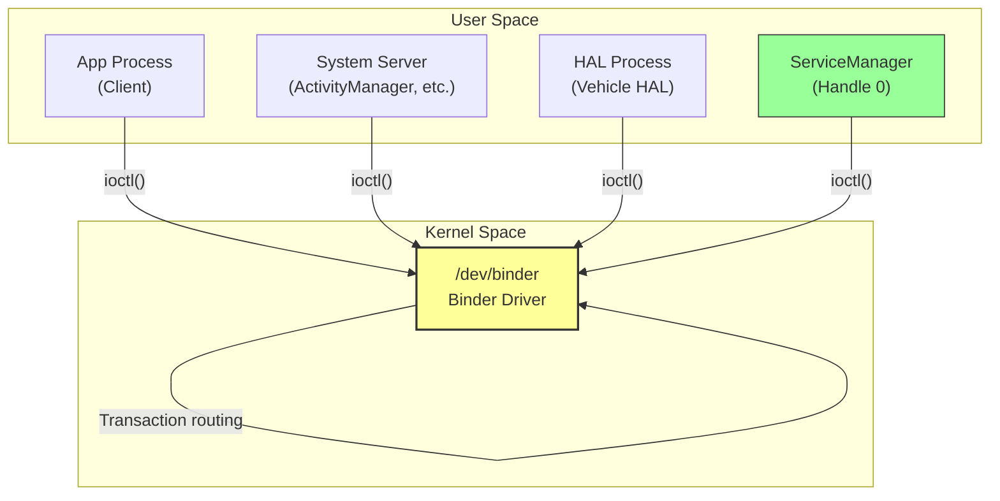
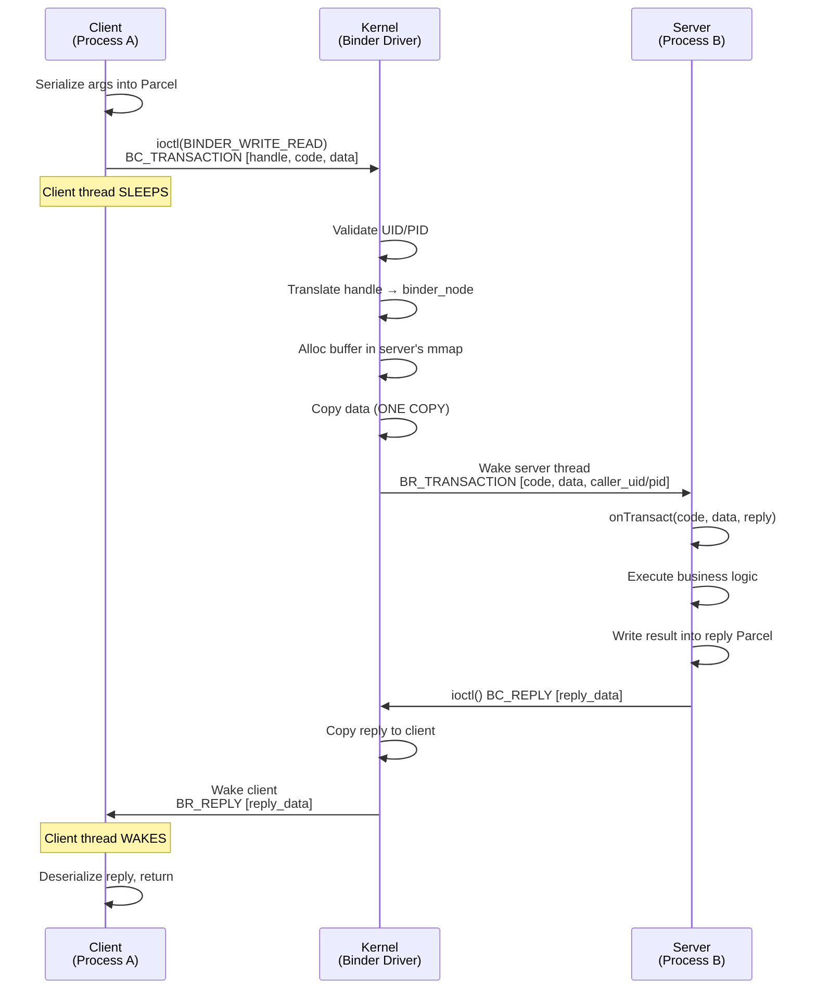
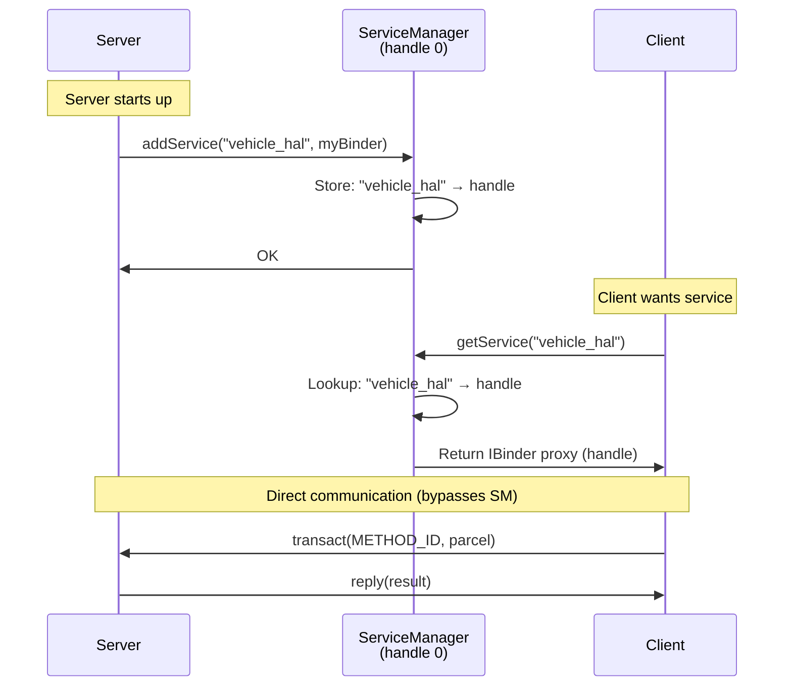
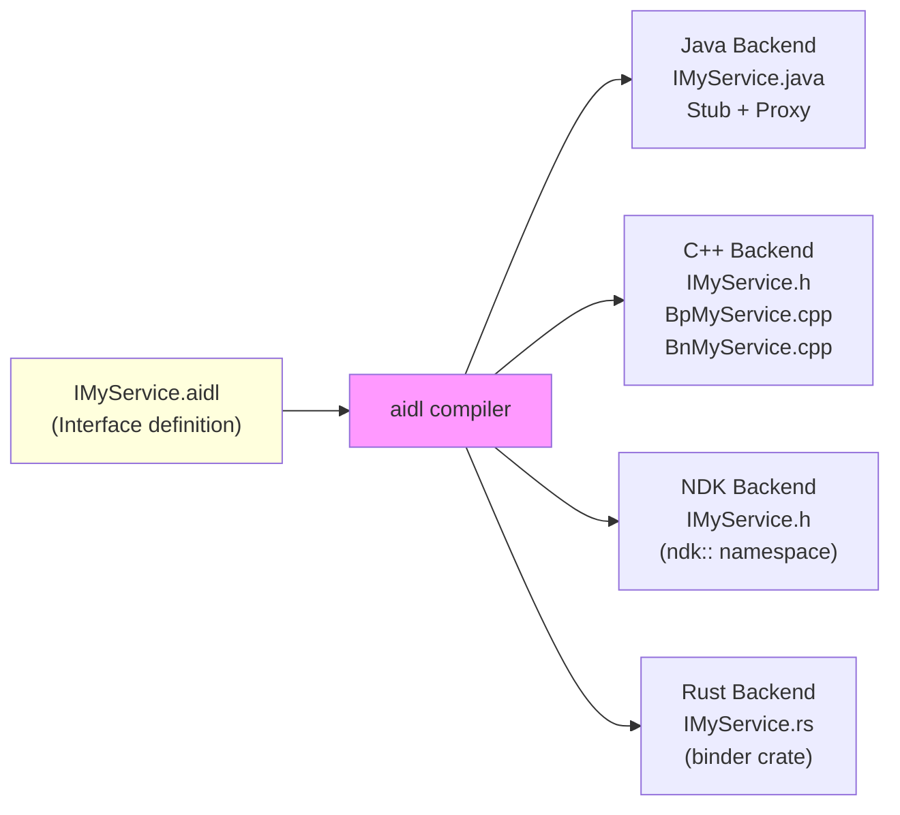
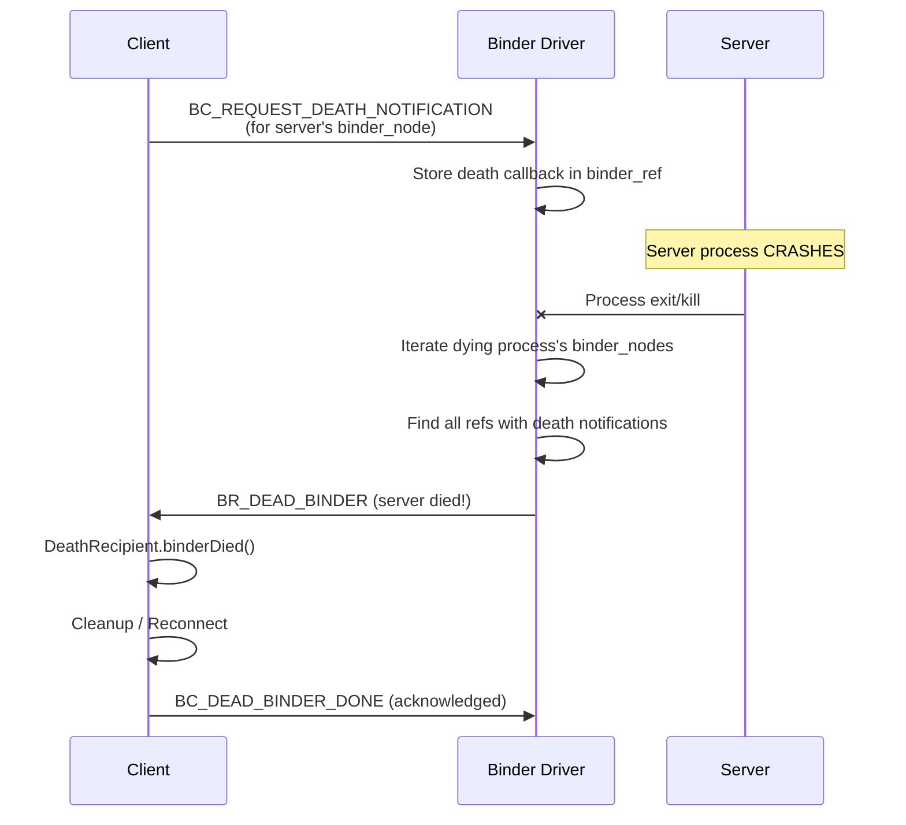
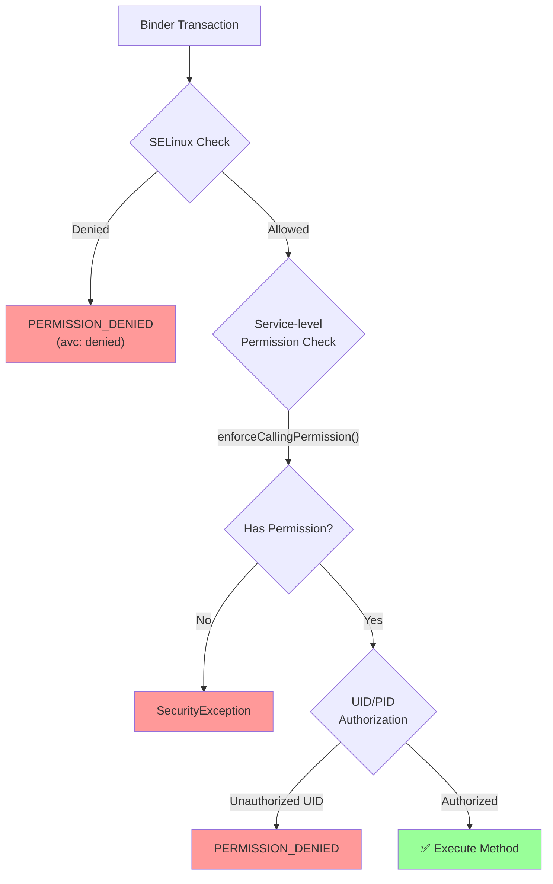
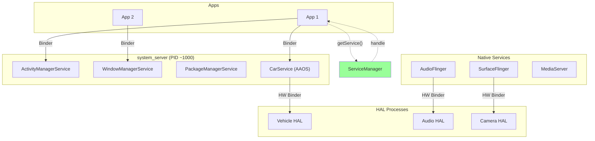
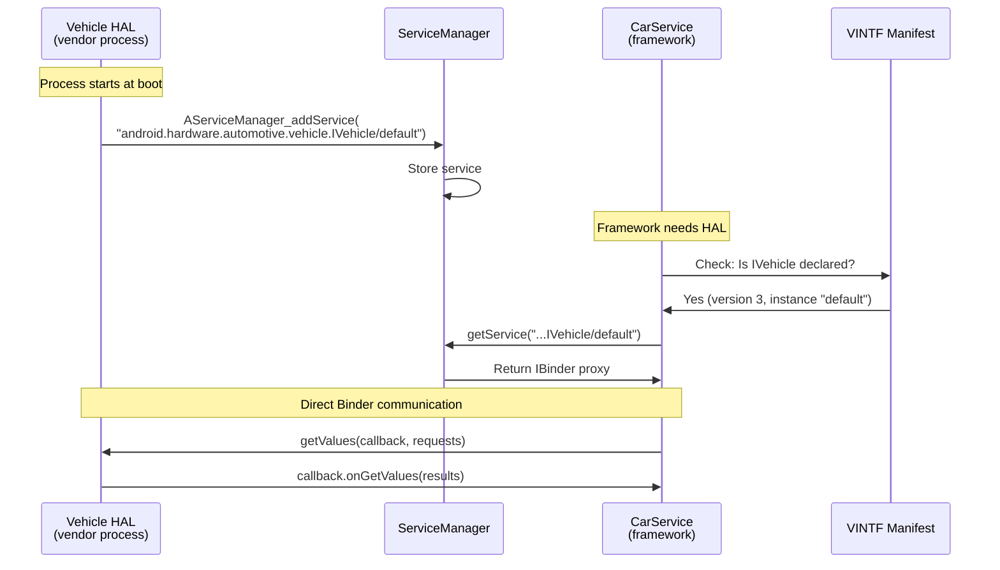

# ANDROID BINDER & AIDL — DIAGRAMS & VISUAL REFERENCE
# ════════════════════════════════════════════════════════════════════
# Protocol: Android Binder IPC | Document: 02 of 08
# ════════════════════════════════════════════════════════════════════

---

## DIAGRAM 01: Binder High-Level Architecture



---

## DIAGRAM 02: Three Binder Domains (Android 8.0+)

```
┌─────────────────────────────────────────────────────────────────┐
│                     ANDROID PROCESS SPACE                         │
├─────────────────┬─────────────────────┬─────────────────────────┤
│                 │                     │                           │
│  /dev/binder    │  /dev/hwbinder      │  /dev/vndbinder          │
│                 │                     │                           │
│  ┌───────────┐  │  ┌───────────────┐  │  ┌───────────────────┐  │
│  │ Apps      │  │  │ System Svcs   │  │  │ Vendor Process A  │  │
│  │ System    │  │  │ (Clients)     │  │  │ Vendor Process B  │  │
│  │ Services  │  │  │               │  │  │                   │  │
│  │           │  │  │ HAL Servers   │  │  │                   │  │
│  └───────────┘  │  └───────────────┘  │  └───────────────────┘  │
│                 │                     │                           │
│ servicemanager  │ hwservicemanager    │ vndservicemanager        │
│                 │ (or servicemanager  │                           │
│                 │  for AIDL HALs)     │                           │
├─────────────────┴─────────────────────┴─────────────────────────┤
│  SELinux enforces separation — no cross-domain access            │
└─────────────────────────────────────────────────────────────────┘
```

---

## DIAGRAM 03: Transaction Flow (Synchronous)



---

## DIAGRAM 04: One-Copy Memory Mapping

```
CLIENT (Process A)                         SERVER (Process B)
┌─────────────────────┐                   ┌─────────────────────┐
│ User Virtual Memory │                   │ User Virtual Memory │
│                     │                   │                     │
│ Parcel data (src)   │                   │ mmap'd binder region│
│ [xxxxxxxxxx]        │                   │ [          ]        │
└────────┬────────────┘                   └────────┬────────────┘
         │                                         │ (same physical pages!)
         │ copy_from_user()                        │ (no copy needed!)
         ▼                                         │
┌─────────────────────────────────────────────────────────────────┐
│                        KERNEL SPACE                               │
│                                                                  │
│  binder_buffer (allocated in mmap'd physical pages)             │
│  [xxxxxxxxxx]  ← data copied here from client                  │
│                   server reads directly from its mmap view →    │
└─────────────────────────────────────────────────────────────────┘

Traditional IPC: Client → Kernel → Server = 2 copies
Binder:          Client → Kernel/Server shared pages = 1 copy
```

---

## DIAGRAM 05: ServiceManager Lookup Flow



---

## DIAGRAM 06: Proxy/Stub Pattern

```
┌──────────────────────────────────────────────────────────────────┐
│                                                                   │
│  CLIENT PROCESS                       SERVER PROCESS             │
│  ──────────────                       ──────────────             │
│                                                                   │
│  ┌─────────────────┐                ┌─────────────────────┐     │
│  │  Application    │                │  Implementation      │     │
│  │  Code           │                │  (Business Logic)    │     │
│  │                 │                │                      │     │
│  │  service.foo()  │                │  int foo() {         │     │
│  │       │         │                │    return 42;        │     │
│  └───────┼─────────┘                │  }                   │     │
│          ▼                           └──────────┬───────────┘     │
│  ┌─────────────────┐                           │                 │
│  │  PROXY (Bp)     │                ┌──────────▼───────────┐     │
│  │  (Auto-gen)     │                │  STUB (Bn)           │     │
│  │                 │                │  (Auto-gen)          │     │
│  │  foo() {        │                │                      │     │
│  │    parcel.write │   Binder IPC   │  onTransact(code) {  │     │
│  │    transact()───┼────────────────┼──→  parcel.read()    │     │
│  │    return read()│◄───────────────┼──  impl.foo()        │     │
│  │  }              │                │    reply.write(42)    │     │
│  └─────────────────┘                │  }                   │     │
│                                      └─────────────────────┘     │
└──────────────────────────────────────────────────────────────────┘
```

---

## DIAGRAM 07: AIDL Compilation Pipeline



---

## DIAGRAM 08: AAOS Vehicle HAL Binder Path

```
┌─────────────────────────────────────────────────────────────────┐
│                        APP LAYER                                  │
│  ┌────────────────────────────────────────────────────────┐     │
│  │  Car App (Java)                                        │     │
│  │  CarPropertyManager.getIntProperty(SPEED, GLOBAL)      │     │
│  └──────────────────────────┬─────────────────────────────┘     │
│                              │ AIDL Binder (ICarProperty)        │
│  ┌──────────────────────────▼─────────────────────────────┐     │
│  │  CarService (system_server/CarServiceHelper)           │     │
│  │  CarPropertyService.getProperty()                      │     │
│  └──────────────────────────┬─────────────────────────────┘     │
│                              │ AIDL Binder (IVehicle)            │
│  ┌──────────────────────────▼─────────────────────────────┐     │
│  │  Vehicle HAL (vendor process)                          │     │
│  │  VehicleHal::get(SPEED) → read from CAN/SOME-IP       │     │
│  └──────────────────────────┬─────────────────────────────┘     │
│                              │ CAN/Ethernet/SOME-IP              │
│  ┌──────────────────────────▼─────────────────────────────┐     │
│  │  Vehicle ECU Network (speed sensor → CAN → gateway)    │     │
│  └────────────────────────────────────────────────────────┘     │
└─────────────────────────────────────────────────────────────────┘
```

---

## DIAGRAM 09: Death Notification Mechanism



---

## DIAGRAM 10: Parcel Data Layout

```
Parcel (serialized transaction data):

Byte offset:  0        4        8       12      16        20
              ┌────────┬────────┬────────┬───────┬─────────┬─────────────┐
Data buffer:  │ int32  │ int32  │str_len │ str16 data...   │flat_binder  │
              │ (arg1) │ (arg2) │  (4)   │ "Test"          │  _object    │
              └────────┴────────┴────────┴───────┴─────────┴──────┬──────┘
                                                                   │
Objects array (offsets to flat_binder_objects):                    │
              ┌────────┐                                          │
              │ off=20 │ ─────────────────────────────────────────┘
              └────────┘

flat_binder_object at offset 20:
┌──────────┬──────────┬──────────────────┬──────────┐
│ hdr_type │  flags   │  binder/handle   │  cookie  │
│ (4B)     │  (4B)    │     (8B)         │  (8B)    │
└──────────┴──────────┴──────────────────┴──────────┘

Types: BINDER_TYPE_BINDER (own object), BINDER_TYPE_HANDLE (reference),
       BINDER_TYPE_FD (file descriptor)
```

---

## DIAGRAM 11: Thread Pool Management

```
SERVER PROCESS
┌─────────────────────────────────────────────────────────────┐
│                                                             │
│  Main Thread ─── joinThreadPool() → handles transactions   │
│                                                             │
│  ┌─────────── Binder Thread Pool (max 15+1) ───────────┐  │
│  │                                                       │  │
│  │  Thread 1: [WAITING]  ← idle, ready for work        │  │
│  │  Thread 2: [BUSY]     ← handling transaction         │  │
│  │  Thread 3: [BUSY]     ← handling transaction         │  │
│  │  Thread 4: [WAITING]  ← idle                         │  │
│  │  ...                                                  │  │
│  │  Thread N: [WAITING]                                  │  │
│  │                                                       │  │
│  └───────────────────────────────────────────────────────┘  │
│                                                             │
│  When all threads busy AND pool not full:                   │
│    Kernel sends BR_SPAWN_LOOPER → process creates new thread│
│                                                             │
└─────────────────────────────────────────────────────────────┘

Transaction arrives → kernel picks idle thread → wakes it
If no idle thread → queued (or new thread spawned)
```

---

## DIAGRAM 12: HIDL Passthrough vs Binderized

```
BINDERIZED MODE (recommended):
┌───────────────┐         ┌───────────────────┐
│ Framework     │ hwbinder │ HAL Process       │
│ (system svc)  │ ───────→ │ (separate process)│
│               │ IPC call │                   │
└───────────────┘         └───────────────────┘
  Process isolation ✓   SELinux separation ✓   Stability ✓


PASSTHROUGH MODE (legacy/performance):
┌──────────────────────────────────────────┐
│ Framework Process                         │
│                                          │
│  Framework code                          │
│       │                                  │
│       ▼ dlopen("vendor_hal.so")         │
│  ┌────────────────────────────────────┐  │
│  │ HAL Implementation (.so loaded)    │  │
│  │ (runs IN framework's process!)     │  │
│  └────────────────────────────────────┘  │
│                                          │
└──────────────────────────────────────────┘
  No IPC overhead ✓   No isolation ✗   Legacy only
```

---

## DIAGRAM 13: Reference Counting

```
                    binder_node (in Server's proc)
                    ┌─────────────────────────────┐
                    │ strong_refs = 2              │
                    │ weak_refs = 3               │
                    │ ptr = 0xABCD (BBinder*)      │
                    └───────────┬─────────────────┘
                                │
              ┌─────────────────┼─────────────────┐
              │                 │                   │
              ▼                 ▼                   ▼
    binder_ref (Client A)   binder_ref (Client B)  binder_ref (Client C)
    ┌───────────────┐       ┌───────────────┐     ┌───────────────┐
    │ handle = 1    │       │ handle = 3    │     │ handle = 2    │
    │ strong = 1    │       │ strong = 1    │     │ strong = 0    │
    │ weak = 1      │       │ weak = 1      │     │ weak = 1      │
    └───────────────┘       └───────────────┘     └───────────────┘
    (sp<IBinder>)           (sp<IBinder>)         (wp<IBinder> only)

When Client A calls BC_RELEASE → strong_refs drops to 1
When Client B calls BC_RELEASE → strong_refs = 0 → node can be destroyed
Client C's weak ref doesn't prevent destruction
```

---

## DIAGRAM 14: Binder Security Layers



---

## DIAGRAM 15: Oneway (Async) vs Two-Way Transaction

```
TWO-WAY (default):
Client          Kernel          Server
  │                               │
  │──── BC_TRANSACTION ──────────→│
  │     (client BLOCKS)           │
  │                               │── onTransact()
  │                               │── prepare reply
  │←──── BR_REPLY ───────────────│
  │     (client WAKES)            │
  │                               │
  Time: Client blocked for entire server processing time


ONEWAY (async):
Client          Kernel          Server
  │                               │
  │──── BC_TRANSACTION ──────────→│ (queued)
  │←── BR_TRANSACTION_COMPLETE    │
  │     (client continues!)       │
  │                               │── onTransact() (later)
  │     ... does other work ...   │
  │                               │
  Time: Client returns immediately, server processes whenever
  
  ⚠️ No return value possible with oneway!
  ⚠️ Multiple oneways to same target processed IN ORDER
```

---

## DIAGRAM 16: File Descriptor Passing

```
SENDER (Process A)                    RECEIVER (Process B)
┌──────────────────┐                 ┌──────────────────┐
│ FD table:        │                 │ FD table:        │
│  fd=5 → file*X  │                 │  fd=3 → (empty)  │
│                  │                 │  fd=7 → file*Y   │
└────────┬─────────┘                 └──────────────────┘
         │ parcel.writeFileDescriptor(5)
         ▼
┌────────────────────────────────────────────────────────┐
│                  BINDER KERNEL                          │
│                                                        │
│  1. Read fd=5 from sender → get struct file* X        │
│  2. Allocate new fd=8 in receiver's table             │
│  3. Point receiver's fd=8 → same struct file* X      │
│  4. Replace "5" with "8" in parcel data              │
│                                                        │
└────────────────────────────────────────────────────────┘
         │
         ▼
┌──────────────────┐
│ RECEIVER:        │
│ FD table:        │
│  fd=3 → (empty)  │
│  fd=7 → file*Y   │
│  fd=8 → file*X ← │ NEW! Same underlying file as sender's fd=5
└──────────────────┘

Both processes now share access to the same open file/device/socket!
```

---

## DIAGRAM 17: Fast Message Queue (FMQ) - Bypassing Binder

```
┌───────────────────────────────────────────────────────────────┐
│ SHARED MEMORY (allocated once via Binder, then used directly) │
│                                                               │
│  ┌─────────────────────────────────────────────────────────┐ │
│  │          RING BUFFER (lock-free, single pair)           │ │
│  │                                                         │ │
│  │  write_ptr ──→  [D][D][D][D][ ][ ][ ][ ]  ←── read_ptr│ │
│  │                  ↑ new data        ↑ consumed          │ │
│  │                                                         │ │
│  │  Atomics: write_idx, read_idx (no locks needed!)       │ │
│  └─────────────────────────────────────────────────────────┘ │
│                                                               │
│  Event Flag (futex): signals new data available              │
└───────────────────────────────────────────────────────────────┘

PRODUCER (HAL)                        CONSUMER (Framework)
  mQueue.write(&event);                mQueue.read(&event);
  // Just memory write + atomic!       // Just memory read + atomic!
  // NO ioctl, NO kernel, NO Binder!   // ZERO system call overhead!
  
Use case: Sensor data at 400Hz → FMQ is MUCH faster than Binder
```

---

## DIAGRAM 18: Android System Service Binder Topology



---

## DIAGRAM 19: Binder Transaction Buffer Anatomy

```
Per-Process Binder Buffer (default 1MB, mmap'd):

Address:  0x00000    0x10000     0x20000    ...    0xFFFFF
          ┌──────────┬───────────┬──────────┬─────┬──────┐
          │ Txn Buf 1│ Txn Buf 2 │ Txn Buf 3│ ... │ Free │
          │ (4KB)    │ (256B)    │ (1KB)    │     │      │
          └──────────┴───────────┴──────────┴─────┴──────┘
          
Each transaction buffer:
┌────────────────────────────────────────────────┐
│ binder_buffer header (kernel metadata)         │
│   - size, offsets_size                         │
│   - target_node pointer                        │
│   - transaction pointer                        │
├────────────────────────────────────────────────┤
│ Data area (Parcel bytes)                       │
│   [serialized arguments / return values]       │
├────────────────────────────────────────────────┤
│ Offsets area                                   │
│   [positions of flat_binder_objects]           │
└────────────────────────────────────────────────┘

Server reads from this buffer directly (zero additional copy).
After processing: BC_FREE_BUFFER returns space to free list.

⚠️ If server is slow / doesn't free buffers → 1MB fills up
   → TransactionTooLargeException for new incoming transactions!
```

---

## DIAGRAM 20: AIDL HAL Registration & Discovery



---

END OF DOCUMENT 02 — DIAGRAMS
