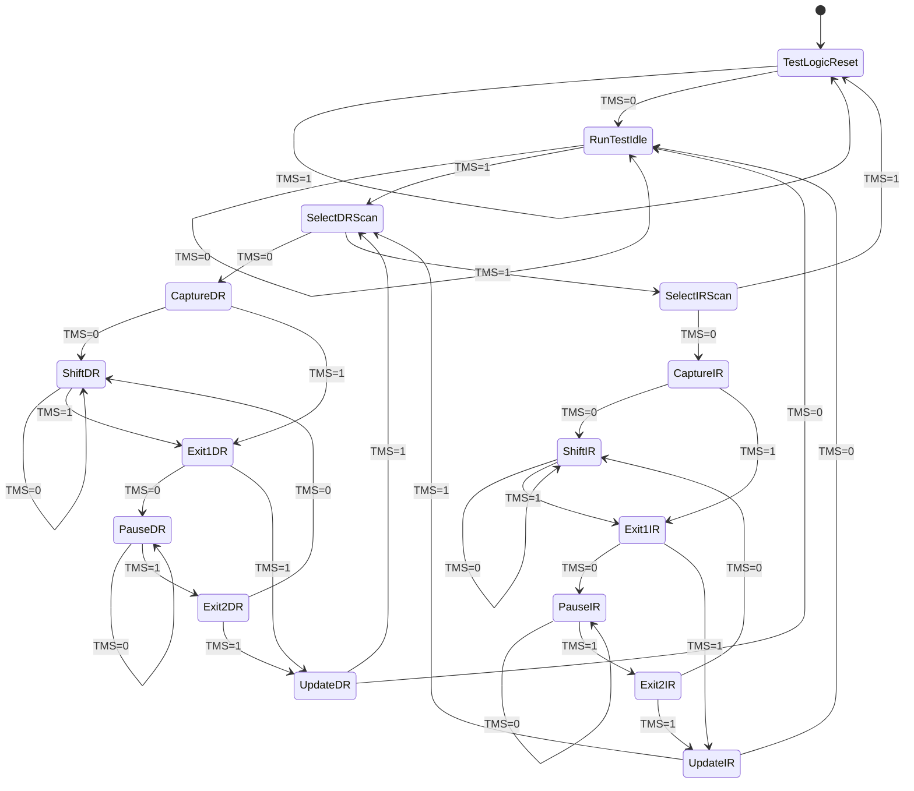
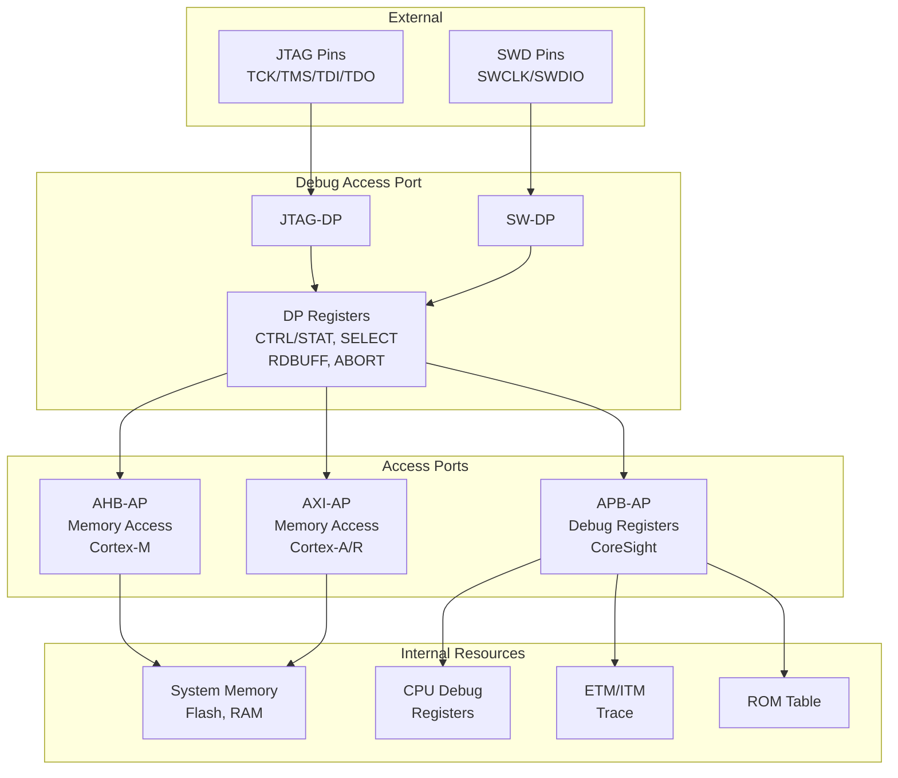
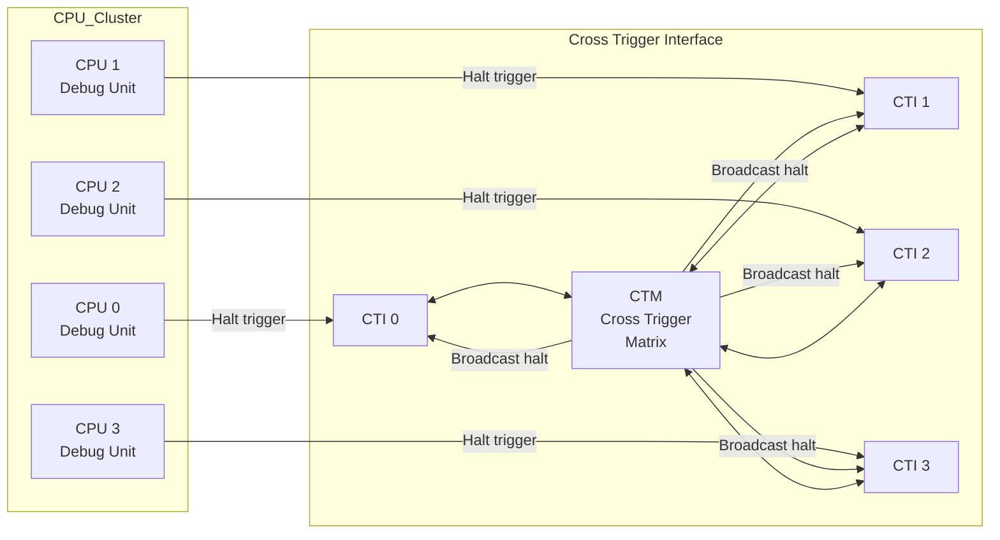
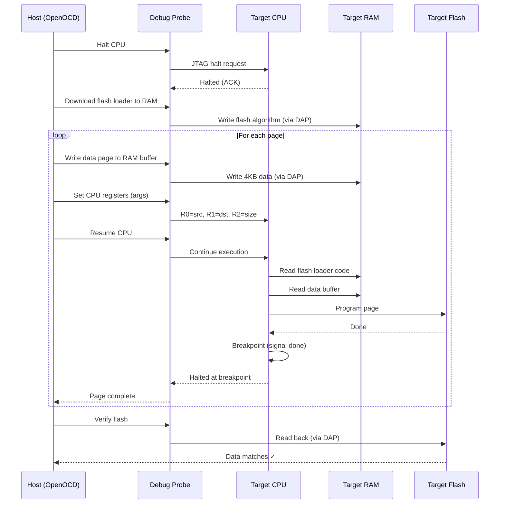
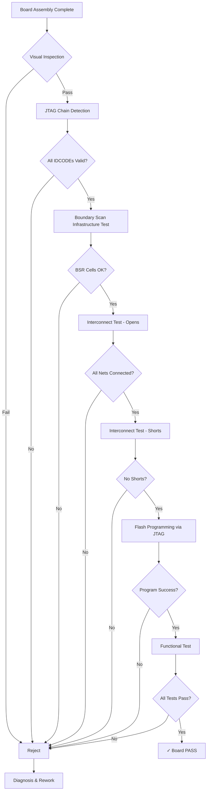
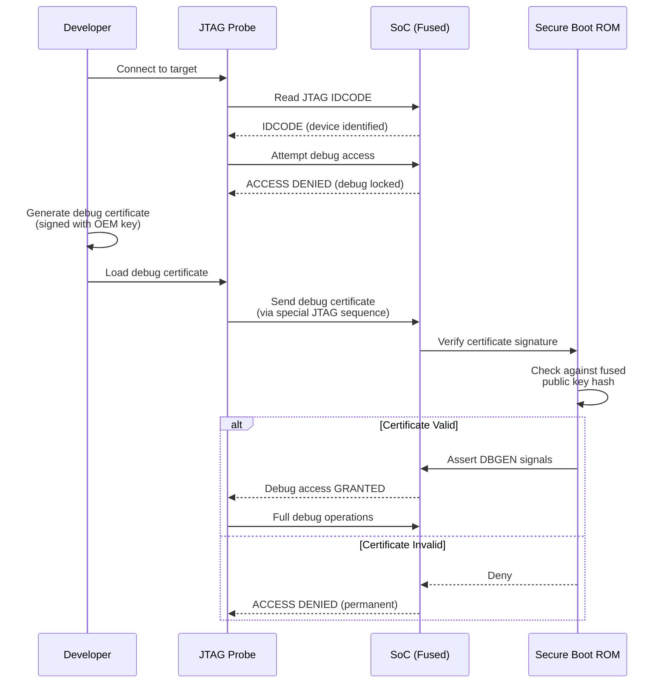

# JTAG & SWD — DIAGRAMS
# ════════════════════════════════════════════════════════════════════
# Protocol: JTAG (IEEE 1149.1) & SWD | Document: 02 of 08
# 20+ diagrams: Mermaid, ASCII, and visual explanations
# ════════════════════════════════════════════════════════════════════

---

## DIAGRAM 1: TAP Controller State Machine (Complete)



---

## DIAGRAM 2: TAP State Machine (ASCII — Simplified)

```
                    ┌──────────────────────┐
                    │   Test-Logic-Reset   │◄────── TMS=1 (from ANY state × 5)
                    └──────────┬───────────┘
                         TMS=0 │  ▲ TMS=1
                               ▼  │
                    ┌──────────────────────┐
                    │    Run-Test/Idle     │◄──┐ TMS=0
                    └──────────┬───────────┘───┘
                         TMS=1 │
                               ▼
                    ┌──────────────────────┐
              ┌────►│   Select-DR-Scan    │
              │     └───────┬──────┬──────┘
              │       TMS=0 │      │ TMS=1
              │             ▼      ▼
              │     ┌───────────┐ ┌───────────────────┐
              │     │Capture-DR │ │  Select-IR-Scan   │
              │     └─────┬─────┘ └────┬────────┬─────┘
              │     TMS=0 │      TMS=0 │        │TMS=1 → TLR
              │           ▼            ▼        │
              │     ┌───────────┐ ┌───────────┐
              │     │ Shift-DR  │ │Capture-IR │
              │     │(TMS=0=stay│ └─────┬─────┘
              │     └─────┬─────┘ TMS=0 │
              │     TMS=1 │             ▼
              │           ▼       ┌───────────┐
              │     ┌───────────┐ │ Shift-IR  │
              │     │ Exit1-DR  │ │(TMS=0=stay│
              │     └──┬────┬───┘ └─────┬─────┘
              │  TMS=0 │    │TMS=1      │TMS=1
              │        ▼    │           ▼
              │  ┌─────────┐│     ┌───────────┐
              │  │Pause-DR ││     │ Exit1-IR  │
              │  └────┬────┘│     └──┬────┬───┘
              │ TMS=1 │     │  TMS=0 │    │TMS=1
              │       ▼     │        ▼    │
              │  ┌─────────┐│  ┌─────────┐│
              │  │Exit2-DR ││  │Pause-IR ││
              │  └──┬───┬──┘│  └────┬────┘│
              │TMS=0│   │   │ TMS=1 │     │
              │  ↓  │TMS=1  │       ▼     │
              │[ShDR]   │   │ ┌─────────┐ │
              │         ▼   │ │Exit2-IR │ │
              │   ┌─────────┐ └──┬───┬──┘ │
              │   │Update-DR│ TMS=0│ │TMS=1│
              │   └──┬───┬──┘  ↓  │    │  │
              │TMS=0 │   │TMS=1[ShIR]  ▼  │
              │  ↓   │   │      ┌─────────┐│
              │[RTI]  │   └──────│Update-IR││
              │       │          └──┬───┬──┘│
              └───────┘     TMS=0│  │TMS=1 │
                              ↓  │  │      │
                           [RTI] └──┘──────┘
                                 [SelDR]
```

---

## DIAGRAM 3: JTAG Signal Timing

```
        ┌───┐   ┌───┐   ┌───┐   ┌───┐   ┌───┐   ┌───┐   ┌───┐
TCK:  ──┘   └───┘   └───┘   └───┘   └───┘   └───┘   └───┘   └──
        ↑       ↑       ↑       ↑       ↑       ↑       ↑
        │Rising │       │       │       │       │       │
        │edges  │       │       │       │       │       │

TMS:  ══╪═1═════╪═1═════╪═0═════╪═0═════╪═0═════╪═1═════╪═1════
        │       │       │       │       │       │       │
     [TLR]   [TLR]   [RTI]  [RTI]  [SelDR] [CDR]  [ShDR]

TDI:  ══╪═══X═══╪═══X═══╪═══X═══╪══D0═══╪══D1═══╪══D2═══╪══D3══
        │       │       │       │       │       │       │
        │  Don't care   │  (Data shifted in during Shift-DR)

TDO:  ══╪═══════╪═══════╪═══════╪═══════╪══Q0═══╪══Q1═══╪══Q2══
        │       │       │       │       │       │       │
        │    Hi-Z (not in Shift) │  (Data shifted out on FALLING edge)
                                        ↓       ↓       ↓
                                    ┌───┐   ┌───┐   ┌───┐
                              (fall)┘   └───┘   └───┘   └───
```

**Key timing rules:**
- TMS & TDI: Setup before rising TCK, sampled ON rising edge
- TDO: Changes on falling TCK edge, valid until next falling edge
- TDO is tri-state except during Shift-DR and Shift-IR states

---

## DIAGRAM 4: Daisy-Chain Scan Chain

```
                    Shared: TCK, TMS
                    ┌────────────────────────────────────────────┐
                    │                                            │
   Host            │    Device A          Device B        Device C
 ┌──────┐          │  ┌──────────┐    ┌──────────┐    ┌──────────┐
 │      │──TCK─────┼──┤ TCK      │    │ TCK      │    │ TCK      │
 │      │──TMS─────┼──┤ TMS      │    │ TMS      │    │ TMS      │
 │Debug │          │  │          │    │          │    │          │
 │Probe │──TDI─────┼──►TDI  TDO─┼────►TDI  TDO─┼────►TDI  TDO─┼──► TDO back
 │      │          │  │          │    │          │    │          │    to host
 │      │◄─TDO─────┼──┤          │    │          │    │          │◄──┘
 └──────┘          │  │ IR=4bit  │    │ IR=8bit  │    │ IR=4bit  │
                    │  │ BSR=200b │    │ BSR=400b │    │ BSR=150b │
                    │  └──────────┘    └──────────┘    └──────────┘
                    │
                    └── Note: TCK and TMS are parallel (shared)
                        TDI/TDO are serial (daisy-chained)

To access Device B only:
  IR shift: [BYPASS_C(4b)] [TARGET_INSTR_B(8b)] [BYPASS_A(4b)] = 16 bits total
  DR shift: [0(bypass_C)] [target_data_B(Nb)] [0(bypass_A)] = N+2 bits total
```

---

## DIAGRAM 5: Boundary Scan Cell Architecture

```
                          Normal Operation Path
                    ┌─────────────────────────────────┐
                    │                                   │
    From Core  ─────┼───────────┐                     │
    Logic           │           │ MUX ────────────────┼──────► To I/O Pad
                    │     ┌─────┤ (Mode               │
                    │     │     │  Select)             │
                    │     │     │     ▲                │
                    │     │     └─────┼────────────────┘
                    │     │           │
                    │     │      ┌────┴────┐
                    │     │      │ Update  │
                    │     │      │   FF    │◄──── Update-DR clock
                    │     │      └────┬────┘
                    │     │           │
                    │     │      ┌────┴────┐
    From Previous ──┼─────┼─────►│ Capture/│──────────────► To Next BSC
    BSC (Shift-in)  │     │      │ Shift   │                 (Shift-out)
                    │     │      │   FF    │
                    │     │      └────┬────┘
                    │     │           ▲
                    │     │           │
                    │     │      Capture-DR / Shift-DR clock
                    │     │
    From I/O Pad ───┼─────┘ (captured during Capture-DR)
                    │
                    └─── Boundary Scan Cell (BSC)

Modes:
  - SAMPLE: Capture FF reads pin, Shift FF passes data through (no disturbance)
  - EXTEST: Update FF drives value onto pin (overrides core logic)
```

---

## DIAGRAM 6: IDCODE Register Format

```
    Bit 31      28  27                    12  11                1    0
    ┌─────────────┬────────────────────────┬──────────────────┬─────┐
    │   Version   │     Part Number        │  Manufacturer ID │  1  │
    │   (4 bits)  │     (16 bits)          │    (11 bits)     │     │
    └─────────────┴────────────────────────┴──────────────────┴─────┘
         │                  │                       │             │
         │                  │                       │             └─ Always 1
         │                  │                       │                (vs BYPASS=0)
         │                  │                       │
         │                  │                       └── JEDEC Bank + Code
         │                  │                           e.g., ARM = 0x43B
         │                  │                           Qualcomm = 0x070
         │                  │
         │                  └── Device-specific part number
         │
         └── Silicon revision (0=first, 1=rev B, etc.)

    Example: 0x4BA00477
      Version:     0x4
      Part Number: 0xBA00  (ARM Cortex-A debug port)
      Manufacturer: 0x23B  → shifted = 0x43B (ARM)
      Bit 0:       1
```

---

## DIAGRAM 7: SWD Packet Format (Complete Transaction)

```
┌─────────── Host Drives SWDIO ──────────┐  ┌Trn┐  ┌── Target Drives ──┐  ┌Trn┐  ┌─ Host ─┐
│                                         │  │   │  │                    │  │   │  │         │
│  Start│APnDP│RnW│ A[2] │ A[3] │Parity│Stop│Park│Trn│ ACK[0:2] │Trn    │  Data[31:0] + P │
│   1   │ 0/1 │0/1│  b   │  b   │  P   │ 0  │ 1 │   │  3 bits  │       │  32+1 bits      │
│                                         │  │   │  │                    │  │   │  │         │
├────── 8 bits (Request) ─────────────────┤  │1  │  ├──── 3 bits ───────┤  │1  │  ├─ 33 b ──┤
                                             │clk│                          │clk│
                                                     │                    │
                                                     └─── OK=001          │
                                                          WAIT=010        │
                                                          FAULT=100       │

For WRITE transaction: Data phase is Host→Target (after ACK)
For READ transaction:  Data phase is Target→Host (shown above)

Total clocks per transaction:
  Request(8) + Trn(1) + ACK(3) + Trn(1) + Data(32) + Parity(1) = 46 clocks
```

---

## DIAGRAM 8: SWD Read vs Write Timing

```
READ (RnW=1):
  Host drives:     Target drives:                    Target drives:
  ┌──────────┐    ┌───┐   ┌─────────────────────────────────────┐
  │ Request  │ Trn│ACK│Trn│         DATA[31:0] + Parity          │
  │ 8 bits   │    │3b │   │            33 bits                    │
  └──────────┘    └───┘   └─────────────────────────────────────┘
  
WRITE (RnW=0):
  Host drives:     Target:    Host drives:
  ┌──────────┐    ┌───┐   ┌─────────────────────────────────────┐
  │ Request  │ Trn│ACK│Trn│         DATA[31:0] + Parity          │
  │ 8 bits   │    │3b │   │            33 bits                    │
  └──────────┘    └───┘   └─────────────────────────────────────┘

Note: Trn = turnaround (1 clock, line not driven = direction change)
```

---

## DIAGRAM 9: ARM Debug Access Port (DAP) Architecture



---

## DIAGRAM 10: CoreSight Trace Architecture

```
┌────────────────────────────────────────────────────────────────────┐
│                         SoC Trace Fabric                            │
│                                                                      │
│  ┌──────┐  ┌──────┐  ┌──────┐  ┌──────┐  ┌──────┐               │
│  │ ETM0 │  │ ETM1 │  │ ETM2 │  │ ETM3 │  │ STM  │               │
│  │(CPU0)│  │(CPU1)│  │(CPU2)│  │(CPU3)│  │(SW)  │               │
│  └──┬───┘  └──┬───┘  └──┬───┘  └──┬───┘  └──┬───┘               │
│     │         │         │         │         │                      │
│  ┌──▼─────────▼─────────▼─────────▼─────────▼───┐                │
│  │            Trace Funnel (ATB Merge)            │                │
│  └───────────────────────┬───────────────────────┘                │
│                           │ ATB (ARM Trace Bus)                     │
│                           │                                         │
│                  ┌────────▼────────┐                               │
│                  │   Replicator    │                               │
│                  └──┬──────────┬───┘                               │
│                     │          │                                    │
│           ┌─────────▼──┐  ┌───▼──────────┐                        │
│           │    ETB      │  │     ETR      │                        │
│           │ (On-chip    │  │ (Route to    │                        │
│           │  4-64KB)    │  │  System RAM) │                        │
│           └─────────────┘  └──────┬───────┘                        │
│                                    │                                │
│                           ┌────────▼────────┐                      │
│                           │      TPIU       │                      │
│                           │ (Trace Port     │                      │
│                           │  Interface)     │                      │
│                           └────────┬────────┘                      │
│                                    │                                │
└────────────────────────────────────┼────────────────────────────────┘
                                     │
                          ┌──────────▼──────────┐
                          │  External Trace     │
                          │  Port (4-bit +CLK)  │
                          │  or SWO (1-bit)     │
                          └─────────────────────┘
```

---

## DIAGRAM 11: Boundary Scan Interconnect Test

```
       Device A                              Device B
   ┌──────────────┐                     ┌──────────────┐
   │              │    PCB Traces        │              │
   │   Core       │                     │    Core      │
   │   Logic      │                     │    Logic     │
   │              │                     │              │
   │  ┌────┐     │  ┌──────────────┐   │     ┌────┐  │
   │  │BSC ├─OUT─┼──┤ Trace (net)  ├───┼─IN──┤BSC │  │
   │  │ A0 │     │  └──────────────┘   │     │ B0 │  │
   │  └────┘     │                     │     └────┘  │
   │  ┌────┐     │  ┌──────────────┐   │     ┌────┐  │
   │  │BSC ├─OUT─┼──┤ Trace (net)  ├───┼─IN──┤BSC │  │
   │  │ A1 │     │  └──────────────┘   │     │ B1 │  │
   │  └────┘     │                     │     └────┘  │
   │  ┌────┐     │  ┌─────X────────┐   │     ┌────┐  │
   │  │BSC ├─OUT─┼──┤ OPEN FAULT   ├───┼─IN──┤BSC │  │
   │  │ A2 │     │  └──────────────┘   │     │ B2 │  │
   │  └────┘     │                     │     └────┘  │
   │              │                     │              │
   └──────────────┘                     └──────────────┘

Test Sequence:
1. Load EXTEST on Device A (drives BSR values onto output pins)
2. Load SAMPLE on Device B (captures input pins into BSR)
3. Drive pattern: A0=1, A1=0, A2=1
4. Capture on B: B0=1, B1=0, B2=? 
5. Expected B2=1, but if OPEN: B2 = floating (detected!)
6. Repeat with walking 1s pattern to detect all faults
```

---

## DIAGRAM 12: SWD JTAG-to-SWD Switch Sequence

```
Step 1: Reset JTAG (>50 clocks with TMS=1)
SWCLK: ┌┐┌┐┌┐┌┐┌┐┌┐┌┐┌┐┌┐┌┐┌┐┌┐┌┐┌┐┌┐┌┐┌┐┌┐┌┐┌┐┌┐┌┐┌┐┌┐┌┐┌┐...
SWDIO: ═══════════════════════════════════════════════════════════ HIGH (>50)

Step 2: Send 16-bit switch sequence (0x79E7 = 0111_1001_1110_0111)
SWCLK: ┌┐┌┐┌┐┌┐┌┐┌┐┌┐┌┐┌┐┌┐┌┐┌┐┌┐┌┐┌┐┌┐
SWDIO: 1 1 1 0 0 1 1 1 1 0 0 1 1 1 1 0  (LSB first = 0x79E7)

Step 3: Reset SWD (>50 clocks with SWDIO=1)
SWCLK: ┌┐┌┐┌┐┌┐┌┐┌┐┌┐┌┐┌┐┌┐┌┐┌┐┌┐┌┐┌┐┌┐┌┐┌┐┌┐┌┐┌┐┌┐┌┐┌┐┌┐┌┐...
SWDIO: ═══════════════════════════════════════════════════════════ HIGH (>50)

Step 4: Idle (>2 clocks with SWDIO=0)
SWCLK: ┌┐┌┐┌┐┌┐
SWDIO: ════════ LOW (idle)

Step 5: Now in SWD mode — send first SWD packet (read DPIDR)
SWCLK: ┌┐┌┐┌┐┌┐┌┐┌┐┌┐┌┐...
SWDIO: [Request packet...]
```

---

## DIAGRAM 13: Multi-Core Debug with CTI



**Flow:** CPU0 hits breakpoint → CTI0 fires trigger → CTM distributes → All CTIs assert halt → All CPUs stop simultaneously.

---

## DIAGRAM 14: OpenOCD Software Architecture

```
┌─────────────────────────────────────────────────────────────┐
│                        HOST PC                                │
│                                                               │
│  ┌──────────────────────────────────────────────────────┐   │
│  │                     OpenOCD                           │   │
│  │                                                       │   │
│  │  ┌───────────┐  ┌───────────┐  ┌────────────────┐  │   │
│  │  │ GDB Server│  │ Telnet CLI│  │  TCL Server    │  │   │
│  │  │ :3333     │  │ :4444     │  │  :6666         │  │   │
│  │  └─────┬─────┘  └─────┬─────┘  └───────┬────────┘  │   │
│  │        │               │                 │           │   │
│  │  ┌─────▼───────────────▼─────────────────▼────────┐ │   │
│  │  │              Target Layer                       │ │   │
│  │  │  (ARM, MIPS, RISC-V target handlers)           │ │   │
│  │  └───────────────────────┬────────────────────────┘ │   │
│  │                          │                           │   │
│  │  ┌───────────────────────▼────────────────────────┐ │   │
│  │  │            Transport Layer                      │ │   │
│  │  │  (JTAG state machine / SWD packet engine)       │ │   │
│  │  └───────────────────────┬────────────────────────┘ │   │
│  │                          │                           │   │
│  │  ┌───────────────────────▼────────────────────────┐ │   │
│  │  │           Interface Driver Layer                │ │   │
│  │  │  (FTDI, J-Link, CMSIS-DAP, ST-Link, etc.)      │ │   │
│  │  └───────────────────────┬────────────────────────┘ │   │
│  └──────────────────────────┼────────────────────────────┘   │
│                             │ USB                             │
└─────────────────────────────┼─────────────────────────────────┘
                              │
                     ┌────────▼────────┐
                     │   Debug Probe   │
                     │  (J-Link, etc.) │
                     └────────┬────────┘
                              │ JTAG/SWD
                     ┌────────▼────────┐
                     │  Target Device  │
                     └─────────────────┘
```

---

## DIAGRAM 15: Flash Programming via JTAG (CPU-Assisted)



---

## DIAGRAM 16: Qualcomm SA8295P Debug Topology

```
┌─────────────────────────────────────────────────────────────────┐
│                        SA8295P SoC                                │
│                                                                   │
│  Cluster 0 (Prime)      Cluster 1 (Gold)     Cluster 2 (Silver) │
│  ┌─────────────────┐   ┌─────────────────┐   ┌────────────────┐ │
│  │ A78 │ A78 │ A78 │   │ A78 │ A78       │   │ A55│A55│A55│A55│ │
│  │ ETM │ ETM │ ETM │   │ ETM │ ETM       │   │ ETM│ETM│ETM│ETM│ │
│  │ CTI │ CTI │ CTI │   │ CTI │ CTI       │   │ CTI│CTI│CTI│CTI│ │
│  └──┬────┬────┬────┘   └──┬────┬─────────┘   └─┬───┬───┬───┬──┘ │
│     │    │    │            │    │                │   │   │   │    │
│  ┌──▼────▼────▼────────────▼────▼────────────────▼───▼───▼───▼──┐ │
│  │                  CoreSight Debug APB                           │ │
│  └──────────────────────────┬────────────────────────────────────┘ │
│                             │                                      │
│  ┌──────────────────────────▼────────────────────────────────────┐ │
│  │                    QDSS Subsystem                               │ │
│  │  ┌───────┐  ┌───────┐  ┌──────┐  ┌──────┐  ┌──────────────┐│ │
│  │  │Funnel │  │Replic.│  │ TMC  │  │ TPIU │  │STM (Software)││ │
│  │  │(merge)│  │(copy) │  │(ETR) │  │(ext.)│  │              ││ │
│  │  └───────┘  └───────┘  └──────┘  └──────┘  └──────────────┘│ │
│  └──────────────────────────┬────────────────────────────────────┘ │
│                             │                                      │
│  ┌──────────────────────────▼──────────────────────┐              │
│  │              DAP (Debug Access Port)              │              │
│  │   ┌──────────┐  ┌──────────┐  ┌──────────┐     │              │
│  │   │  APB-AP  │  │  AXI-AP  │  │  AHB-AP  │     │              │
│  │   │(debug reg)│ │(memory)  │  │(Cortex-M) │     │              │
│  │   └──────────┘  └──────────┘  └──────────┘     │              │
│  └──────────────────────────┬──────────────────────┘              │
│                             │                                      │
└─────────────────────────────┼──────────────────────────────────────┘
                              │
                   ┌──────────▼──────────┐
                   │   JTAG/SWD/cJTAG    │
                   │   External Pins     │
                   └──────────┬──────────┘
                              │
                   ┌──────────▼──────────┐
                   │  Lauterbach TRACE32 │
                   │  (via Ethernet)     │
                   └─────────────────────┘
```

---

## DIAGRAM 17: Production Test Flow with JTAG



---

## DIAGRAM 18: SWD Multidrop (v2) Topology

```
                    Host (Debugger)
                   ┌──────────────┐
                   │   SW-DP v2   │
                   └──────┬───────┘
                          │
            SWCLK ────────┼─────────────────────────────
            SWDIO ────────┼─────────────────────────────
                          │         │         │
                   ┌──────▼───┐ ┌───▼────┐ ┌──▼──────┐
                   │ Target 0 │ │Target 1│ │Target 2 │
                   │ ID=0x0   │ │ID=0x1  │ │ID=0x2   │
                   │ (Active) │ │(Sleep) │ │(Sleep)  │
                   └──────────┘ └────────┘ └─────────┘

Selection Protocol:
1. Host sends TARGETSEL packet (special write to DP)
2. Packet contains target ID
3. Only matching target wakes up and responds
4. Other targets remain dormant (ignore traffic)
5. No ACK for TARGETSEL (broadcast)

Use case: Debug multiple Cortex-M cores on same PCB with only 2 wires
```

---

## DIAGRAM 19: Memory Read via DAP (Step by Step)

```
┌─────────────────────────────────────────────────────────────────┐
│                                                                   │
│  Step 1: Select AP (write DP SELECT register)                    │
│  ┌────────────────────────────────────────────┐                  │
│  │ SWD Write: APnDP=0, RnW=0, A=0x8(SELECT) │                  │
│  │ Data: APSEL=0 (AHB-AP), APBANKSEL=0       │                  │
│  └────────────────────────────────────────────┘                  │
│                                                                   │
│  Step 2: Write TAR (Transfer Address Register in AP)             │
│  ┌────────────────────────────────────────────┐                  │
│  │ SWD Write: APnDP=1, RnW=0, A=0x4 (TAR)   │                  │
│  │ Data: 0x20000000 (target address)          │                  │
│  └────────────────────────────────────────────┘                  │
│                                                                   │
│  Step 3: Read DRW (Data Read/Write register in AP)               │
│  ┌────────────────────────────────────────────┐                  │
│  │ SWD Read: APnDP=1, RnW=1, A=0xC (DRW)    │                  │
│  │ Returns: (previous read - pipelined!)      │                  │
│  └────────────────────────────────────────────┘                  │
│                                                                   │
│  Step 4: Read RDBUFF (get actual data)                           │
│  ┌────────────────────────────────────────────┐                  │
│  │ SWD Read: APnDP=0, RnW=1, A=0xC (RDBUFF) │                  │
│  │ Returns: 0xDEADBEEF (data at 0x20000000)  │                  │
│  └────────────────────────────────────────────┘                  │
│                                                                   │
│  Note: AP reads are pipelined — result available on NEXT read    │
│  Auto-increment: TAR += 4 after each DRW access (if enabled)    │
│                                                                   │
└─────────────────────────────────────────────────────────────────┘
```

---

## DIAGRAM 20: Security Debug Authentication Flow



---

END OF DOCUMENT 02 — DIAGRAMS
