# ╔══════════════════════════════════════════════════════════════════════════════╗
# ║  UNIVERSAL PROTOCOL ENCYCLOPEDIA — MASTER INDEX & TAXONOMY                  ║
# ║  Part 01 of 25                                                              ║
# ║  The Complete Engineering Protocol Knowledge Map                            ║
# ╚══════════════════════════════════════════════════════════════════════════════╝

---

## PURPOSE OF THIS ENCYCLOPEDIA

This is a **25-part comprehensive protocol encyclopedia** covering every major
communication protocol, bus, interconnect, middleware, and interface standard
used across all engineering domains. It serves as:

- **Protocol Encyclopedia** — Complete reference for 500+ protocols
- **Architecture Knowledge Graph** — How protocols relate and depend on each other
- **Interview Preparation System** — Key facts, comparisons, and questions
- **Debugging Handbook** — Practical troubleshooting knowledge
- **Career Roadmap** — Learning paths from beginner to architect
- **Semiconductor Interconnect Map** — Complete chip-to-chip knowledge
- **Automotive Communication Bible** — CAN to Ethernet to V2X
- **Linux/Android Protocol Reference** — Kernel subsystem mapping

---

## DOCUMENT MAP

| Part | Title | Protocols Covered |
|------|-------|-------------------|
| 01 | **Master Index & Taxonomy** (this file) | Overview, classification, hierarchy |
| 02 | **Serial & Parallel Communication** | UART, SPI, I2C, RS-232/485, 1-Wire, SDIO, Parallel |
| 03 | **Semiconductor On-Chip Buses** | AMBA (AXI/AHB/APB), Wishbone, TileLink, OCP |
| 04 | **Cache Coherency & Chiplet Interconnects** | MESI/MOESI/MESIF, CXL, UCIe, NVLink, UPI, IF, CHI |
| 05 | **Memory Protocols** | DDR1-5, LPDDR, HBM, GDDR, SRAM, Flash interfaces |
| 06 | **Storage Protocols** | NVMe, UFS, eMMC, SATA, SAS, SCSI, iSCSI |
| 07 | **High-Speed Serial I/O** | PCIe, USB, Thunderbolt, DisplayPort, HDMI, SATA PHY |
| 08 | **Networking & Internet Protocols** | Ethernet, TCP/IP, UDP, HTTP/2/3, gRPC, QUIC |
| 09 | **Wireless & Cellular** | WiFi, Bluetooth/BLE, 5G/LTE, Zigbee, LoRa, UWB |
| 10 | **Automotive Networks** | CAN/CAN-FD, LIN, FlexRay, Auto Ethernet, SOME/IP |
| 11 | **Automotive Diagnostics & AUTOSAR** | UDS, OBD-II, XCP, AUTOSAR COM, DoIP |
| 12 | **Industrial Automation & SCADA** | Modbus, PROFINET, EtherCAT, OPC UA, HART |
| 13 | **Aerospace, Military & Space** | MIL-STD-1553, ARINC 429/664, SpaceWire, CCSDS |
| 14 | **Camera & Display Interfaces** | MIPI CSI-2, MIPI DSI, LVDS, V-by-One, eDP |
| 15 | **Audio, Sensor & Power** | I2S, SoundWire, TDM, PMBus, SMBus, SVID |
| 16 | **Debug, Test & Verification** | JTAG, SWD, CoreSight, UVM, AXI-VIP, IJTAG |
| 17 | **OS IPC & Middleware** | Linux IPC, Binder/AIDL, D-Bus, DDS, ZeroMQ |
| 18 | **Cloud, Datacenter & Distributed** | RDMA, RoCE, InfiniBand, Kafka, gRPC, Raft |
| 19 | **Security & Safety Protocols** | TLS, IPsec, MACsec, SecOC, HSM, ISO 26262 |
| 20 | **AI/ML & HPC Interconnects** | NVLink, NVSwitch, AMD IF, ICI, HPE Slingshot |
| 21 | **IoT & Smart Home** | MQTT, CoAP, Zigbee, Thread, Matter, LoRaWAN |
| 22 | **Time Synchronization & Real-Time** | PTP/IEEE 1588, NTP, TSN, TTEthernet, AFDX |
| 23 | **Boot, Firmware & Virtualization** | UEFI, ACPI, DeviceTree, VirtIO, IOMMU |
| 24 | **Emerging & Future Protocols** | CXL 3.0+, UCIe 2.0, 6G, Photonics, Quantum |
| 25 | **Learning Roadmaps & Career Guide** | Study plans, interview prep, career paths |

---

## GRAND PROTOCOL TAXONOMY

### Level 0: Communication Paradigm

```
ALL COMMUNICATION
├── Electrical (wired)
│   ├── Single-ended
│   ├── Differential
│   ├── Current-mode
│   └── Optical (photonic)
├── Wireless (RF/optical)
│   ├── Licensed spectrum
│   ├── Unlicensed spectrum
│   └── Free-space optical
└── Software (logical)
    ├── Shared memory
    ├── Message passing
    └── Remote procedure call
```

### Level 1: Domain Classification

```
PROTOCOL DOMAINS
├── 1. CHIP-INTERNAL (on-die)
│   ├── On-chip buses (AXI, AHB, APB)
│   ├── NoC (Network-on-Chip)
│   ├── Cache coherency (CHI, ACE)
│   └── Register access (APB, CSR)
│
├── 2. CHIP-TO-CHIP (in-package / board)
│   ├── Die-to-die (UCIe, NVLink-C2C, AMD GMI)
│   ├── Board-level high-speed (PCIe, CXL, UPI)
│   ├── Memory (DDR5, HBM3, LPDDR5)
│   └── Low-speed peripheral (SPI, I2C, UART)
│
├── 3. BOARD-TO-BOARD / RACK
│   ├── Backplane (PCIe, Ethernet)
│   ├── Cable (USB, Thunderbolt, HDMI)
│   ├── Fiber (100G/400G Ethernet, InfiniBand)
│   └── Storage (NVMe-oF, iSCSI)
│
├── 4. SYSTEM-TO-SYSTEM (LAN/WAN)
│   ├── Networking (Ethernet, IP, TCP/UDP)
│   ├── Datacenter fabric (RoCE, InfiniBand)
│   ├── Cloud (HTTP/gRPC, Kafka, AMQP)
│   └── Telecom (5G, LTE, SONET)
│
├── 5. VEHICLE INTERNAL
│   ├── Body/Comfort (LIN)
│   ├── Powertrain (CAN/CAN-FD)
│   ├── Chassis/Safety (FlexRay)
│   ├── Infotainment/ADAS (Ethernet, SOME/IP)
│   └── Diagnostics (UDS, DoIP)
│
├── 6. INDUSTRIAL / AUTOMATION
│   ├── Fieldbus (PROFIBUS, Modbus RTU)
│   ├── Industrial Ethernet (PROFINET, EtherCAT)
│   ├── SCADA (DNP3, IEC 61850)
│   └── Robotics (EtherCAT, ROS2/DDS)
│
├── 7. AEROSPACE / MILITARY
│   ├── Avionics bus (MIL-STD-1553, ARINC 429)
│   ├── Deterministic network (ARINC 664/AFDX)
│   ├── Space (SpaceWire, CCSDS)
│   └── Tactical (Link 16, STANAG)
│
└── 8. SOFTWARE / LOGICAL
    ├── OS IPC (pipes, sockets, shared mem)
    ├── Middleware (Binder, D-Bus, DDS)
    ├── RPC (gRPC, Thrift, Cap'n Proto)
    └── Distributed (Raft, Paxos, gossip)
```

### Level 2: OSI Layer Mapping

| OSI Layer | Protocols |
|-----------|-----------|
| **7 - Application** | HTTP, gRPC, MQTT, SOME/IP, UDS, OPC UA |
| **6 - Presentation** | TLS, SSL, ASN.1, protobuf, JSON, XML |
| **5 - Session** | RPC sessions, WebSocket, SIP, RTP |
| **4 - Transport** | TCP, UDP, QUIC, SCTP, DCCP |
| **3 - Network** | IPv4, IPv6, ICMP, OSPF, BGP, MPLS |
| **2 - Data Link** | Ethernet, CAN, WiFi MAC, PPP, HDLC |
| **1 - Physical** | RS-232, RS-485, Ethernet PHY, PCIe PHY, MIPI D-PHY |

### Level 3: Speed Classification

| Category | Speed Range | Examples |
|----------|-------------|---------|
| Ultra-Low | < 1 Kbps | 1-Wire, LIN idle |
| Low Speed | 1 Kbps – 1 Mbps | UART, I2C, LIN, CAN |
| Medium Speed | 1 – 100 Mbps | SPI, CAN-FD, 100M Ethernet |
| High Speed | 100 Mbps – 10 Gbps | USB 3, PCIe 3, 1G/10G Ethernet |
| Very High Speed | 10 – 100 Gbps | PCIe 5/6, 100G Ethernet, NVLink |
| Ultra High Speed | 100 Gbps – 1 Tbps | 400G/800G Ethernet, HBM3, NVLink 5 |
| Extreme | > 1 Tbps | On-chip NoC, UCIe advanced clusters |

---

## PROTOCOL COUNT BY DOMAIN

| Domain | Approx. Protocols | Key Standards Bodies |
|--------|-------------------|---------------------|
| Semiconductor/On-chip | ~50 | ARM (AMBA), OCP-IP, RISC-V |
| Memory | ~25 | JEDEC |
| Storage | ~20 | NVM Express, SCSI Trade, T10/T13 |
| High-Speed Serial | ~30 | PCI-SIG, USB-IF, VESA, HDMI Forum |
| Networking | ~60 | IEEE 802, IETF, ITU-T |
| Wireless | ~40 | IEEE 802.11, 3GPP, Bluetooth SIG |
| Automotive | ~35 | ISO, SAE, AUTOSAR, OPEN Alliance |
| Industrial | ~30 | IEC, PROFIBUS, OPC Foundation |
| Aerospace/Military | ~25 | MIL-STD, ARINC, CCSDS, DO-178/254 |
| Software/Middleware | ~30 | OMG (DDS), Linux Foundation, Google |
| Security | ~20 | IETF, NIST, TCG (TPM) |
| IoT | ~20 | IETF, Thread Group, CSA (Matter) |
| AI/HPC | ~15 | NVIDIA, AMD, Intel, UCIe Consortium |
| **TOTAL** | **~400+** | |

---

## PROTOCOL EVOLUTION MEGA-TIMELINE

```
1960s: RS-232, ASCII, MIL-STD-1553
1970s: Ethernet (1973), UART standardized, ARINC 429
1980s: CAN (1986), SCSI, Token Ring, ISDN, MIDI
1990s: USB 1.0 (1996), I2C widespread, PCI, ATM, GSM, Bluetooth
2000s: PCIe (2003), USB 2.0, WiFi (802.11), LTE, SPI/I2C embedded
2010s: USB 3.x, PCIe 4/5, NVMe, 5G, CXL, NVLink, UCIe concept
2020s: CXL 2.0/3.0, UCIe 1.0, PCIe 6.0, WiFi 7, DDR5, NVLink 5
2030s: UCIe 2.0+, 6G, photonic interconnects, quantum networks
```

---

## CLASSIFICATION MATRICES

### By Determinism

| Level | Protocols | Guarantee |
|-------|-----------|-----------|
| Hard Real-Time | FlexRay, TTEthernet, AFDX, MIL-STD-1553 | Bounded worst-case |
| Soft Real-Time | TSN, PROFINET IRT, EtherCAT | Statistical guarantee |
| Best-Effort RT | CAN (priority), USB isochronous | Priority-based |
| Non-Real-Time | TCP/IP, HTTP, USB bulk | No timing guarantee |

### By Safety Criticality

| Level | Standard | Protocols |
|-------|----------|-----------|
| ASIL-D (Auto) | ISO 26262 | FlexRay, CAN w/ E2E, Ethernet w/ AUTOSAR |
| DAL-A (Aero) | DO-178C/DO-254 | ARINC 664, MIL-STD-1553 |
| SIL-4 (Rail) | IEC 61508 | PROFISAFE, TTEthernet |
| SIL-3 (Industrial) | IEC 61508 | PROFIsafe, CIP Safety |

### By Topology

| Topology | Protocols |
|----------|-----------|
| Point-to-Point | UART, SPI, PCIe, NVLink, MIPI |
| Bus (shared) | I2C, CAN, MIL-STD-1553, old Ethernet |
| Star | USB, Ethernet (switched), InfiniBand |
| Ring | Token Ring, SONET, some NoC |
| Mesh | NoC, WiFi mesh, InfiniBand |
| Tree | USB hubs, Ethernet switches |
| Daisy-chain | JTAG, SPI multi-slave |
| Crossbar | On-chip NoC, NVSwitch |

---

## SEMICONDUCTOR INTERCONNECT HIERARCHY

```
┌─────────────────────────────────────────────────────────────────────┐
│                    COMPLETE INTERCONNECT STACK                        │
├─────────────────────────────────────────────────────────────────────┤
│                                                                      │
│  LEVEL 7: CLOUD/WAN                                                 │
│  ├── TCP/IP, HTTP/gRPC, RDMA, InfiniBand                          │
│  └── 100G/400G/800G Ethernet, optical                              │
│                                                                      │
│  LEVEL 6: RACK/DATACENTER                                           │
│  ├── Ethernet (25/100/400G), RoCE, InfiniBand HDR/NDR             │
│  └── PCIe 5.0/6.0 (x16), CXL 2.0/3.0 (switch-based)             │
│                                                                      │
│  LEVEL 5: SERVER/BOARD                                              │
│  ├── CPU-CPU: Intel UPI, AMD xGMI                                  │
│  ├── CPU-GPU: PCIe 5.0, CXL, NVLink-C2C                          │
│  ├── GPU-GPU: NVLink 4/5, NVSwitch                                │
│  └── CPU-Memory: DDR5, CXL.mem                                    │
│                                                                      │
│  LEVEL 4: PACKAGE (multi-die)                                       │
│  ├── UCIe (standard: 32GT/s, advanced: 16GT/s)                    │
│  ├── AMD Infinity Fabric (GMI)                                     │
│  ├── Intel EMIB/Foveros links                                      │
│  └── NVLink-C2C (Grace Hopper)                                    │
│                                                                      │
│  LEVEL 3: DIE (on-chip inter-block)                                │
│  ├── AMBA AXI4/AXI5 (master-slave)                                │
│  ├── AMBA CHI (coherent hub interface)                             │
│  ├── Network-on-Chip (mesh/ring/tree)                              │
│  └── TileLink (RISC-V), Wishbone (open)                           │
│                                                                      │
│  LEVEL 2: BLOCK (IP-to-IP within subsystem)                        │
│  ├── AMBA AHB (high-performance bus)                               │
│  ├── AMBA APB (low-power peripheral)                               │
│  ├── AXI-Stream (streaming data)                                   │
│  └── Custom point-to-point FIFOs                                   │
│                                                                      │
│  LEVEL 1: REGISTER (core-to-register)                              │
│  ├── APB (config registers)                                        │
│  ├── CSR access (RISC-V)                                           │
│  └── Memory-mapped I/O                                             │
│                                                                      │
└─────────────────────────────────────────────────────────────────────┘
```

---

## AUTOMOTIVE COMMUNICATION HIERARCHY

```
┌─────────────────────────────────────────────────────────────────────┐
│                    VEHICLE COMMUNICATION STACK                        │
├─────────────────────────────────────────────────────────────────────┤
│                                                                      │
│  EXTERNAL (V2X)                                                      │
│  ├── V2V: DSRC (802.11p) / C-V2X (3GPP PC5)                      │
│  ├── V2I: Cellular (4G/5G), DSRC                                   │
│  ├── V2N: 5G NR, LTE-V2X                                          │
│  └── V2P: UWB, BLE beacons                                        │
│                                                                      │
│  BACKBONE (High-speed domain)                                        │
│  ├── Automotive Ethernet: 100BASE-T1, 1000BASE-T1, 10GBASE-T1     │
│  ├── Service-oriented: SOME/IP, DDS                                │
│  ├── Zonal architecture gateway Ethernet switches                   │
│  └── Future: 25G/Multi-Gig Automotive Ethernet                    │
│                                                                      │
│  DOMAIN NETWORKS                                                     │
│  ├── Powertrain: CAN-FD (8 Mbps)                                  │
│  ├── Chassis/Safety: CAN-FD + E2E protection                      │
│  ├── ADAS: Ethernet (1G+) + camera (MIPI/GMSL/FPD-Link)          │
│  ├── Infotainment: Ethernet + USB + HDMI + MOST (legacy)          │
│  └── Body/Comfort: LIN (20 kbps)                                  │
│                                                                      │
│  SENSOR INTERFACES                                                   │
│  ├── Camera: MIPI CSI-2, GMSL2, FPD-Link III/IV                   │
│  ├── Radar: SPI, LVDS, CSI-2                                      │
│  ├── LiDAR: Ethernet, SPI, custom                                 │
│  ├── Ultrasonic: SPI, PSI5, DSI3                                  │
│  └── IMU/GNSS: SPI, UART, I2C                                     │
│                                                                      │
│  ECU INTERNAL                                                        │
│  ├── Processor bus: AXI, AHB (on-chip)                            │
│  ├── Peripheral: SPI, I2C, UART                                   │
│  ├── Flash: QSPI, HyperBus                                        │
│  └── Debug: JTAG, SWD, CoreSight trace                            │
│                                                                      │
│  DIAGNOSTICS                                                         │
│  ├── UDS (ISO 14229) over CAN/Ethernet                            │
│  ├── DoIP (Diagnostics over IP)                                    │
│  ├── OBD-II (emissions/regulatory)                                 │
│  ├── XCP (calibration, measurement)                                │
│  └── SOVD (future: service-oriented vehicle diagnostics)           │
│                                                                      │
└─────────────────────────────────────────────────────────────────────┘
```

---

## LINUX KERNEL PROTOCOL SUBSYSTEMS

```
┌─────────────────────────────────────────────────────────────────────┐
│                    LINUX KERNEL PROTOCOL MAP                          │
├─────────────────────────────────────────────────────────────────────┤
│                                                                      │
│  net/                                                                │
│  ├── core/     → Socket layer, sk_buff, netfilter                  │
│  ├── ipv4/     → TCP, UDP, ICMP, IP routing                       │
│  ├── ipv6/     → IPv6 stack                                        │
│  ├── ethernet/ → Ethernet framing                                   │
│  ├── can/      → SocketCAN (CAN, CAN-FD, CAN-XL)                  │
│  ├── bluetooth/→ HCI, L2CAP, RFCOMM, BLE                          │
│  ├── wireless/ → cfg80211, mac80211 (WiFi)                         │
│  ├── tipc/     → Cluster communication                             │
│  ├── rdma/     → InfiniBand verbs, RoCE                            │
│  └── sctp/     → Stream Control Transmission Protocol              │
│                                                                      │
│  drivers/                                                            │
│  ├── spi/      → SPI master/slave drivers                          │
│  ├── i2c/      → I2C adapter/client drivers                        │
│  ├── tty/serial/ → UART drivers                                    │
│  ├── usb/      → USB host/gadget/OTG                               │
│  ├── pci/      → PCIe enumeration, config, MSI                    │
│  ├── nvme/     → NVMe host driver                                  │
│  ├── mmc/      → eMMC, SD card                                     │
│  ├── scsi/     → SCSI/UFS/SAS                                     │
│  ├── gpu/      → DRM, GPU drivers                                  │
│  ├── net/ethernet/ → Ethernet NIC drivers                          │
│  ├── net/wireless/ → WiFi drivers                                  │
│  ├── net/can/  → CAN controller drivers                            │
│  ├── iio/      → Industrial I/O (ADC, IMU, sensors)               │
│  ├── hwmon/    → Hardware monitoring (temp, voltage)               │
│  └── media/    → V4L2, MIPI CSI-2 camera                          │
│                                                                      │
│  ipc/                                                                │
│  ├── sem.c     → System V semaphores                               │
│  ├── shm.c     → System V shared memory                           │
│  ├── msg.c     → System V message queues                           │
│  └── mqueue.c  → POSIX message queues                             │
│                                                                      │
│  fs/                                                                 │
│  ├── pipe.c    → Pipe IPC                                          │
│  ├── eventfd.c → Event file descriptors                            │
│  └── fuse/     → Userspace filesystem protocol                     │
│                                                                      │
└─────────────────────────────────────────────────────────────────────┘
```

---

## ANDROID/AAOS COMMUNICATION STACK

```
┌─────────────────────────────────────────────────────────────────────┐
│                    ANDROID COMMUNICATION STACK                        │
├─────────────────────────────────────────────────────────────────────┤
│                                                                      │
│  APPLICATION LAYER                                                   │
│  ├── Intents (Activity/Service/Broadcast)                          │
│  ├── ContentProvider (cross-process data)                          │
│  ├── AIDL (Android Interface Definition Language)                  │
│  └── Messenger (Handler-based IPC)                                 │
│                                                                      │
│  FRAMEWORK LAYER                                                     │
│  ├── Binder (kernel driver: /dev/binder)                           │
│  ├── HIDL (HAL Interface Definition Language — legacy)             │
│  ├── AIDL (stable AIDL for HALs — modern)                         │
│  ├── VHAL (Vehicle HAL — AAOS)                                     │
│  └── Parcel (serialization format)                                 │
│                                                                      │
│  HAL LAYER                                                           │
│  ├── AIDL HALs (Camera, Audio, Sensors, Vehicle)                   │
│  ├── hwbinder (/dev/hwbinder)                                      │
│  ├── vndbinder (/dev/vndbinder)                                    │
│  └── gralloc (graphics buffer sharing via fd passing)              │
│                                                                      │
│  NATIVE LAYER                                                        │
│  ├── HwBinder (hardware service manager)                           │
│  ├── SharedMemory (ashmem → memfd)                                 │
│  ├── Socket IPC (init/property service)                            │
│  ├── Ion/DMA-BUF (zero-copy buffer sharing)                       │
│  └── FMQ (Fast Message Queue — lock-free ring buffer)              │
│                                                                      │
│  KERNEL LAYER                                                        │
│  ├── Binder driver (transaction-based IPC)                         │
│  ├── Ashmem/memfd (shared memory)                                  │
│  ├── Unix domain sockets                                           │
│  ├── Netlink sockets (kernel↔userspace)                           │
│  ├── ion/dma-buf/dma-heap (buffer allocation)                     │
│  └── futex (fast userspace mutex)                                  │
│                                                                      │
│  AAOS-SPECIFIC                                                       │
│  ├── Vehicle HAL (property-based vehicle data)                     │
│  ├── Car Service (Java framework)                                  │
│  ├── EVS (Exterior View System — camera)                           │
│  ├── Audio routing (multi-zone)                                    │
│  └── CAN integration (via SocketCAN + VHAL)                       │
│                                                                      │
└─────────────────────────────────────────────────────────────────────┘
```

---

## PROTOCOL SELECTION DECISION TREE

```
Need to communicate?
│
├── Same chip (on-die)?
│   ├── Register access → APB
│   ├── High BW data → AXI
│   ├── Coherent multi-core → CHI / ACE
│   └── Streaming → AXI-Stream
│
├── Same package (die-to-die)?
│   ├── Open standard needed → UCIe
│   ├── NVIDIA GPU → NVLink-C2C
│   ├── AMD chiplet → Infinity Fabric (GMI)
│   └── Intel tiles → EMIB/Foveros links
│
├── Same board (chip-to-chip)?
│   ├── High BW + low latency → PCIe / CXL
│   ├── Memory → DDR5 / LPDDR5
│   ├── Simple config → SPI / I2C
│   ├── Debug → JTAG / SWD
│   ├── Camera → MIPI CSI-2
│   └── Display → MIPI DSI / eDP
│
├── Same vehicle?
│   ├── Safety-critical → CAN-FD + E2E
│   ├── High BW → Automotive Ethernet
│   ├── Low-cost body → LIN
│   ├── Legacy deterministic → FlexRay
│   └── Diagnostics → UDS over CAN/DoIP
│
├── Same building (LAN)?
│   ├── General → Ethernet + TCP/IP
│   ├── Industrial RT → EtherCAT / PROFINET
│   ├── IoT → WiFi / Thread / Zigbee
│   └── Storage → NVMe-oF / iSCSI
│
├── Same datacenter?
│   ├── Low latency → RDMA (RoCE / InfiniBand)
│   ├── GPU cluster → NVLink + NVSwitch
│   ├── Storage fabric → NVMe-oF
│   └── General → 100/400G Ethernet
│
└── Wide area (WAN)?
    ├── Internet → TCP/IP + HTTP/gRPC
    ├── Mobile → 5G / LTE
    ├── IoT long-range → LoRaWAN / NB-IoT
    └── Satellite → CCSDS / DVB-S2
```

---

## PROTOCOL FAMILY TREES (MERMAID)

```mermaid
graph TD
    A[Communication Protocols] --> B[Wired]
    A --> C[Wireless]
    A --> D[Software/Logical]
    
    B --> B1[Serial]
    B --> B2[Parallel]
    B --> B3[High-Speed Serial]
    
    B1 --> B1a[UART/RS-232]
    B1 --> B1b[SPI]
    B1 --> B1c[I2C]
    B1 --> B1d[CAN]
    B1 --> B1e[1-Wire]
    
    B3 --> B3a[PCIe]
    B3 --> B3b[USB]
    B3 --> B3c[Ethernet]
    B3 --> B3d[SATA]
    B3 --> B3e[NVLink]
    
    C --> C1[Short Range]
    C --> C2[Medium Range]
    C --> C3[Long Range]
    
    C1 --> C1a[Bluetooth/BLE]
    C1 --> C1b[NFC]
    C1 --> C1c[UWB]
    
    C2 --> C2a[WiFi]
    C2 --> C2b[Zigbee]
    C2 --> C2c[Thread]
    
    C3 --> C3a[5G/LTE]
    C3 --> C3b[LoRa]
    C3 --> C3c[Satellite]
    
    D --> D1[IPC]
    D --> D2[RPC]
    D --> D3[Middleware]
    
    D1 --> D1a[Pipes/Sockets]
    D1 --> D1b[Shared Memory]
    D1 --> D1c[Binder]
    
    D2 --> D2a[gRPC]
    D2 --> D2b[Thrift]
    D2 --> D2c[SOME/IP]
    
    D3 --> D3a[DDS]
    D3 --> D3b[Kafka]
    D3 --> D3c[MQTT]
```



---

## TOP 50 PROTOCOLS EVERY ENGINEER MUST KNOW

| Rank | Protocol | Domain | Why Essential |
|------|----------|--------|--------------|
| 1 | TCP/IP | Networking | Foundation of all internet communication |
| 2 | Ethernet | Networking | Universal wired LAN standard |
| 3 | USB | I/O | Universal peripheral connectivity |
| 4 | PCIe | Compute | CPU-device high-speed interconnect |
| 5 | DDR/LPDDR | Memory | Every system uses DRAM |
| 6 | SPI | Embedded | Most common embedded peripheral bus |
| 7 | I2C | Embedded | Universal sensor/config bus |
| 8 | UART | Embedded | Simplest serial, debug console |
| 9 | CAN/CAN-FD | Automotive | Every vehicle uses CAN |
| 10 | WiFi (802.11) | Wireless | Ubiquitous wireless LAN |
| 11 | Bluetooth/BLE | Wireless | Personal area networking |
| 12 | HTTP/HTTPS | Web | Foundation of web services |
| 13 | AXI | Semiconductor | Dominant on-chip bus |
| 14 | NVMe | Storage | Modern SSD interface |
| 15 | JTAG | Debug | Universal chip debug |
| 16 | 5G/LTE | Cellular | Mobile broadband |
| 17 | MIPI CSI-2 | Camera | Mobile/auto camera interface |
| 18 | CXL | Datacenter | Future of CPU-device coherent link |
| 19 | gRPC | Cloud | Modern RPC framework |
| 20 | MQTT | IoT | Lightweight pub/sub for IoT |
| 21 | NVLink | AI/GPU | GPU-GPU high-speed link |
| 22 | TLS/SSL | Security | Encrypts internet traffic |
| 23 | AMBA (AHB/APB) | SoC | ARM SoC peripheral buses |
| 24 | UFS | Mobile Storage | Smartphone flash storage |
| 25 | Binder/AIDL | Android | Android IPC mechanism |
| 26 | SOME/IP | Automotive | Service-oriented auto middleware |
| 27 | EtherCAT | Industrial | Fastest industrial Ethernet |
| 28 | MIL-STD-1553 | Aerospace | Military avionics bus |
| 29 | InfiniBand | HPC | Low-latency datacenter fabric |
| 30 | DDS | Real-time | Pub/sub for real-time systems |
| 31 | UDS | Auto Diag | Vehicle diagnostic protocol |
| 32 | DisplayPort | Display | Modern display interface |
| 33 | Thunderbolt | I/O | High-speed peripheral tunnel |
| 34 | UCIe | Chiplet | Open D2D interconnect standard |
| 35 | RS-485 | Industrial | Long-distance serial |
| 36 | PROFINET | Industrial | Dominant industrial Ethernet |
| 37 | ARINC 429 | Avionics | Commercial avionics data bus |
| 38 | CHI | SoC | ARM coherent interconnect |
| 39 | LIN | Automotive | Low-cost body network |
| 40 | PTP (IEEE 1588) | Time Sync | Precision time for networks |
| 41 | IPv6 | Networking | Next-gen internet addressing |
| 42 | QUIC | Transport | Modern transport (HTTP/3) |
| 43 | Modbus | Industrial | Simplest industrial protocol |
| 44 | SpaceWire | Space | Spacecraft data link |
| 45 | TSN | Real-time | Deterministic Ethernet |
| 46 | Matter | Smart Home | Unified IoT standard |
| 47 | VirtIO | Virtualization | VM device abstraction |
| 48 | RoCE | Datacenter | RDMA over Ethernet |
| 49 | OPC UA | Industrial | Unified industrial M2M |
| 50 | LoRaWAN | IoT | Long-range low-power IoT |

---

## HOW TO USE THIS ENCYCLOPEDIA

1. **For Interview Prep**: Start with Part 25 (Career Guide), then read domain-specific parts
2. **For Project Design**: Use the Decision Tree above, then read relevant part
3. **For Deep Learning**: Follow the study plans in each part's reference section
4. **For Debugging**: Each part includes practical debug scenarios
5. **For Architecture**: Cross-reference Part 03 (on-chip) + Part 04 (coherency) + Part 07 (high-speed)

---

## CROSS-REFERENCE GUIDE

| If studying... | Also read... |
|----------------|-------------|
| PCIe | CXL (Part 04), NVMe (Part 06), USB (Part 07) |
| CAN | Automotive Ethernet (Part 10), SOME/IP (Part 11) |
| AMBA/AXI | CHI/ACE (Part 04), NoC (Part 03) |
| NVLink | CXL (Part 04), UCIe (Part 04), PCIe (Part 07) |
| Ethernet | TSN (Part 22), RoCE (Part 18), Industrial (Part 12) |
| 5G | V2X (Part 10), IoT (Part 21), Edge (Part 24) |
| Security | Boot (Part 23), Automotive (Part 19), Cloud (Part 19) |
| Linux Kernel | IPC (Part 17), Drivers (Parts 02-07), Network (Part 08) |
| Android/AAOS | Binder (Part 17), VHAL (Part 11), Camera (Part 14) |

---

END OF PART 01 — MASTER INDEX & TAXONOMY
