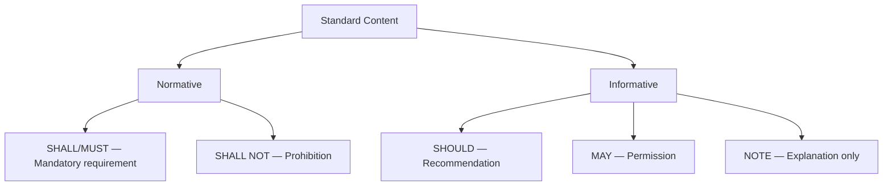
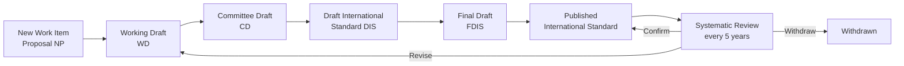
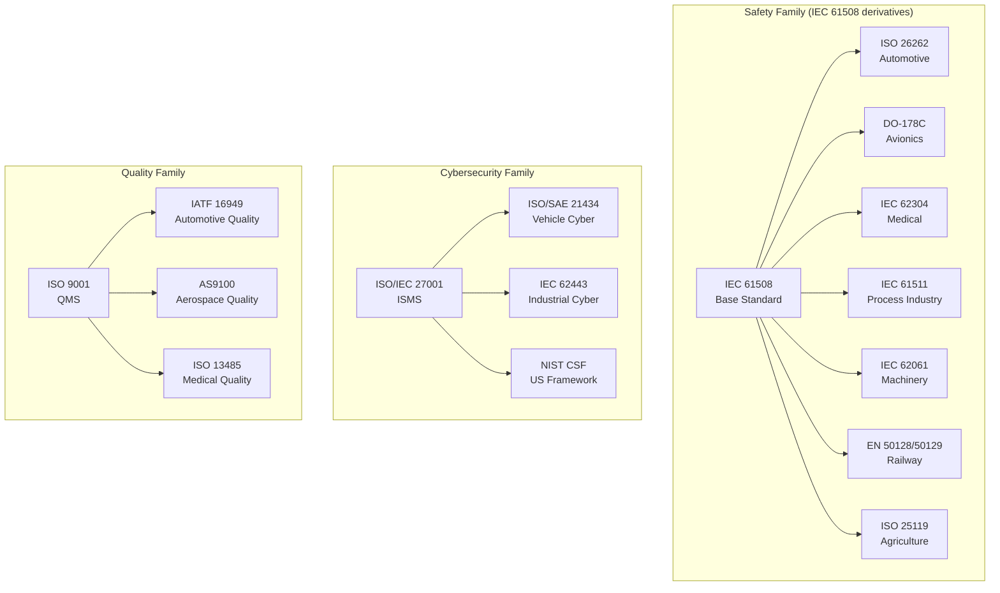
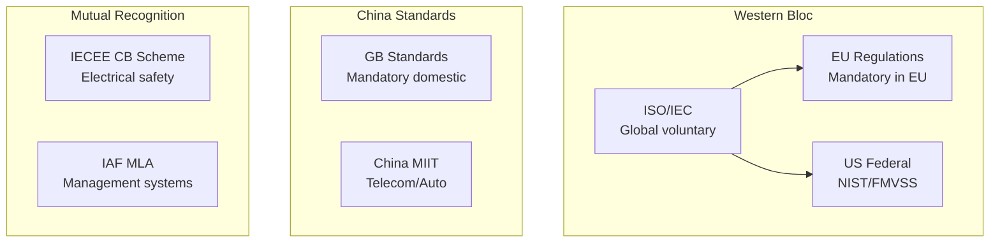
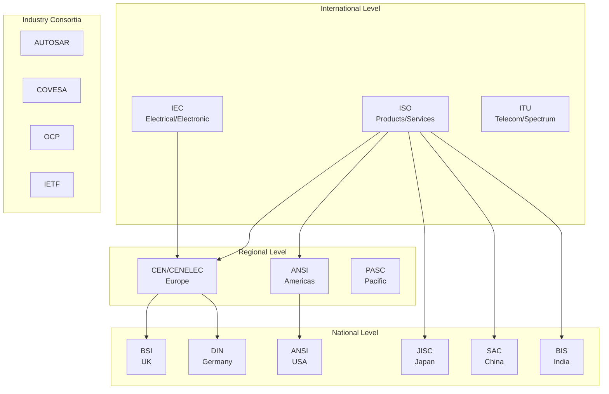
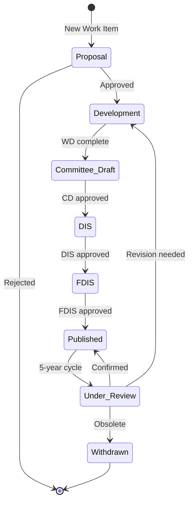
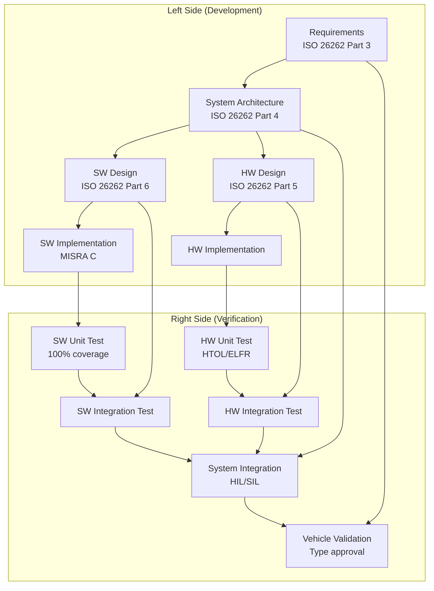

# Global Standardization Overview — Comprehensive Engineering Guide

**Category:** Standards History & Timeline  
**Scope:** Meta-level overview of how technology standards shape all engineering disciplines  
**Governing Bodies:** ISO, IEC, IEEE, ITU, SAE, NIST, ETSI, 3GPP, JEDEC, and 200+ others  
**Applies To:** All technology product development, certification, and market access  
**Last Updated in this Guide:** 2025

---

## Chapter 1 — Historical Context & Origin Story

### 1.1 Why Standards Exist

Technology standards exist because **uncoordinated engineering produces incompatible, unsafe, and costly systems**. The history of standardization is the history of industry learning — often through catastrophic failure — that interoperability, safety, and quality require formalized agreements.

**Three fundamental drivers created the standardization movement:**

1. **Safety Failures** — Industrial accidents (Bhopal 1984, Chernobyl 1986, Therac-25 1985-87) drove safety standards
2. **Market Fragmentation** — Competing proprietary systems (railroad gauges, electrical voltages, video formats) demanded interoperability
3. **Trade Barriers** — Nations used local standards as trade weapons; international standards enabled global commerce

### 1.2 The Evolution Arc

```
Pre-1900: Guild standards, craft knowledge (unwritten)
1900-1945: National standards bodies form (BSI 1901, DIN 1917, ANSI 1918)
1947:      ISO founded (unifying 25 national bodies)
1950-1970: Safety standards emerge after disasters
1970-1990: Software/electronics standards begin (IEEE, IEC)
1990-2010: Digital economy standards explode (internet, wireless)
2010-2025: AI, cybersecurity, privacy create new urgency
2025+:     Quantum, AI governance, geopolitical fragmentation
```

### 1.3 Key Philosophical Foundations

| Principle | Description | Example |
|-----------|-------------|---------|
| **Consensus-based** | All stakeholders vote; no single entity controls | ISO Technical Committees |
| **Voluntary adoption** | Standards aren't laws (unless mandated by regulation) | ISO 9001 is voluntary; CE marking is mandatory |
| **Technology-neutral** | Standards describe WHAT, not HOW | IEC 61508 doesn't mandate a programming language |
| **Living documents** | Periodic revision cycles (typically 5-8 years) | ISO 26262:2011 → 2018 → 2026 (expected) |
| **Layered architecture** | Base standards spawn domain-specific derivatives | IEC 61508 → ISO 26262 → ISO 25119 |

### 1.4 The Standards Ecosystem Today (2025)

- **800,000+** active standards globally
- **164** ISO member countries
- **24,000+** active ISO standards
- **11,000+** active IEC standards
- **4,500+** active IEEE standards
- **$2.1 trillion** estimated annual economic value of standards compliance globally
- **Average standard development time:** 3-7 years
- **Average standard lifecycle:** 5-10 years before revision

---

## Chapter 2 — Standard Architecture & Structure

### 2.1 How Standards Are Organized

Standards follow a **hierarchical taxonomy:**

```
Level 0: FOUNDATIONAL / META-STANDARD
         (e.g., ISO/IEC Guide 51 — Safety aspects)
         │
Level 1: BASE STANDARD (Domain-agnostic)
         (e.g., IEC 61508 — Functional Safety)
         │
Level 2: DOMAIN-SPECIFIC STANDARD
         (e.g., ISO 26262 — Automotive)
         (e.g., DO-178C — Avionics)
         (e.g., IEC 62304 — Medical)
         │
Level 3: IMPLEMENTATION GUIDE / TECHNICAL REPORT
         (e.g., ISO/TR 4804 — AI safety for autonomous vehicles)
         │
Level 4: INDUSTRY PRACTICE / RECOMMENDED PRACTICE
         (e.g., SAE J3061 — Cybersecurity guidebook)
```

### 2.2 Standard Document Anatomy

Every formal standard (ISO/IEC/IEEE) follows this internal structure:

| Section | Content | Normative? |
|---------|---------|-----------|
| Scope | What the standard covers | Yes |
| Normative References | Required companion standards | Yes |
| Terms and Definitions | Precise vocabulary | Yes |
| General Requirements | Core mandates | Yes |
| Specific Clauses (5-N) | Detailed technical requirements | Yes |
| Annexes (A-Z) | Additional guidance | Some normative, some informative |
| Bibliography | Suggested reading | No |

### 2.3 Normative vs. Informative



**Critical distinction for compliance:**
- **Normative** content = MUST be satisfied for conformance claim
- **Informative** content = guidance only, non-binding
- **SHALL** = absolute requirement (auditable)
- **SHOULD** = strong recommendation (deviation needs justification)
- **MAY** = truly optional

### 2.4 Standard Numbering Systems

| Organization | Format | Example |
|--------------|--------|---------|
| ISO | ISO NNNNN:YYYY | ISO 26262:2018 |
| IEC | IEC NNNNN:YYYY | IEC 61508:2010 |
| Joint ISO/IEC | ISO/IEC NNNNN:YYYY | ISO/IEC 27001:2022 |
| IEEE | IEEE NNNN-YYYY | IEEE 802.11-2020 |
| SAE | SAE JNNNN_YYMM | SAE J3016_202104 |
| NIST | NIST SP NNN-NN | NIST SP 800-53 Rev 5 |
| MIL-STD | MIL-STD-NNN | MIL-STD-810H |
| DO/ED (Avionics) | DO-NNN / ED-NNN | DO-178C / ED-12C |

---

## Chapter 3 — Technical Deep Dive

### 3.1 The Standards Development Process



**Typical timelines:**
- NP → Publication: **3-7 years**
- Fast-track (adopting existing spec): **12-24 months**
- Amd (Amendment): **18-36 months**
- Corrigendum (error fix): **6-12 months**

### 3.2 Conformity Assessment Framework

Standards require **conformity assessment** — the process of proving compliance:

| Method | Description | Rigor | Example |
|--------|-------------|-------|---------|
| **First-party** | Self-declaration by supplier | Low | CE marking for non-critical products |
| **Second-party** | Customer audit | Medium | Automotive SPICE assessments |
| **Third-party** | Independent certification body | High | ISO 26262 FSM certificate |

### 3.3 Key Metrics Across Domains

| Metric | Domain | What It Measures | Range |
|--------|--------|------------------|-------|
| SIL (Safety Integrity Level) | Industrial | Systematic capability + PFD/PFH | SIL 1-4 |
| ASIL (Automotive SIL) | Automotive | Risk classification | ASIL A-D |
| DAL (Design Assurance Level) | Avionics | Software/hardware assurance | DAL A-E |
| EAL (Evaluation Assurance Level) | Cybersecurity | Common Criteria evaluation | EAL 1-7 |
| CMMI Level | Software process | Organization maturity | Level 1-5 |
| SPICE Level | Automotive SW | Process capability | Level 0-5 |
| TRL (Technology Readiness Level) | R&D/Defense | Technology maturity | TRL 1-9 |
| MRL (Manufacturing Readiness Level) | Manufacturing | Production readiness | MRL 1-10 |

### 3.4 Cross-Domain Standard Relationships



---

## Chapter 4 — Implementation Guide

### 4.1 How Standards Impact Product Development

Standards affect **every phase** of the product lifecycle:

| Phase | Standards Impact | Example |
|-------|-----------------|---------|
| **Concept** | Define safety goals, security concepts | ISO 26262 Part 3 |
| **Architecture** | Constrain partitioning, redundancy | IEC 61508 Part 2 |
| **Design** | Mandate analysis methods | FMEA per IEC 60812 |
| **Implementation** | Coding rules, coverage targets | MISRA C, MC/DC |
| **Verification** | Test completeness criteria | DO-178C structural coverage |
| **Validation** | System-level acceptance | ISO 26262 Part 4 |
| **Production** | Manufacturing controls | IATF 16949 APQP |
| **Operation** | Maintenance requirements | IEC 61508 Part 1 Clause 7.16 |
| **Decommissioning** | Disposal/recycling | ISO 14001 / WEEE |

### 4.2 Standards Compliance Architecture

A modern product typically needs to satisfy **8-15 standards simultaneously**:

**Example: Automotive ECU (Engine Control Unit)**
```
ISO 26262 (Functional Safety)
ISO/SAE 21434 (Cybersecurity)
AUTOSAR (Software Architecture)
ASPICE (Development Process)
IATF 16949 (Quality Management)
AEC-Q100 (Component Qualification)
EMC: CISPR 25 (Emissions)
EMC: ISO 11452 (Immunity)
UNECE R155 (Cyber type-approval)
UNECE R156 (Software update management)
ISO 14229 (UDS diagnostics)
ISO 15765 (CAN transport)
```

### 4.3 Implementing a Standards Compliance Program

**Step 1: Gap Analysis**
- Identify applicable standards for your product/market
- Assess current maturity vs. requirements
- Create compliance roadmap

**Step 2: Process Establishment**
- Define lifecycle model (V-model, Agile+Safety, etc.)
- Establish work product templates
- Configure tool chain (ALM, SAST, DAST, etc.)

**Step 3: Training & Culture**
- Train engineers on specific standard requirements
- Establish awareness at management level
- Create internal competency model

**Step 4: Execution & Evidence**
- Generate required work products
- Maintain traceability (requirements → test → evidence)
- Conduct internal audits

**Step 5: Assessment / Certification**
- Engage assessors early (pre-assessment)
- Conduct formal assessment/audit
- Address findings, obtain certificate

---

## Chapter 5 — Certification & Audit

### 5.1 Certification vs. Assessment vs. Self-Declaration

| Approach | Who | Cost | Duration | Market Value |
|----------|-----|------|----------|--------------|
| Self-declaration | Internal team | Low ($10-50K) | 1-3 months | Low |
| Second-party assessment | Customer/OEM | Medium ($50-200K) | 3-6 months | Medium |
| Third-party certification | Accredited body | High ($100-500K+) | 6-18 months | High |

### 5.2 Major Certification Bodies

| Body | Domain | HQ | Accreditation |
|------|--------|-----|---------------|
| TÜV SÜD | Safety, Automotive | Munich | DAkkS |
| TÜV Rheinland | Safety, Industrial | Cologne | DAkkS |
| TÜV NORD | Safety, Railway | Hanover | DAkkS |
| SGS | Multi-domain | Geneva | SAS |
| Bureau Veritas | Multi-domain | Paris | COFRAC |
| UL (Underwriters Lab) | Safety, Electrical | Northbrook, IL | ANAB |
| Exida | Safety, Cybersecurity | Sellersville, PA | ANAB |
| DNV | Maritime, Energy | Oslo | NA |
| BSI | Information Security | London | UKAS |

### 5.3 Common Audit Findings (Cross-Domain)

| # | Finding Category | Frequency | Impact |
|---|-----------------|-----------|--------|
| 1 | Incomplete traceability | Very High | Major NC |
| 2 | Missing independence in verification | High | Major NC |
| 3 | Inadequate tool qualification | High | Minor NC |
| 4 | Requirements ambiguity | Medium | Minor NC |
| 5 | Insufficient coverage analysis | Medium | Major NC |
| 6 | Outdated safety/security analysis | Medium | Minor NC |
| 7 | Missing competency evidence | Low | Observation |

---

## Chapter 6 — Regional & Domain Variants

### 6.1 Geopolitical Standards Landscape (2025)



### 6.2 Regional Divergence Examples

| Standard Area | International | EU | USA | China | Japan | India |
|--------------|---------------|-----|-----|-------|-------|-------|
| Functional Safety | IEC 61508 | Adopted as EN | Referenced by OSHA | GB/T 20438 | JIS C 0508 | IS/IEC 61508 |
| Automotive Safety | ISO 26262 | Adopted | FMVSS + NHTSA | GB/T 34590 | JASO TP-18003 | AIS-184 |
| Cybersecurity | ISO 27001 | NIS2 Directive | NIST CSF | MLPS 2.0 | ISMAP | IT Act 2000 |
| EMC | IEC 61000 | CE Marking | FCC Part 15 | GB 9254 | VCCI | BIS EMC |
| Privacy | — | GDPR | State laws + FTC | PIPL | APPI | DPDP 2023 |
| Telecom | 3GPP | ETSI | FCC/NTIA | CCSA | ARIB | TRAI |
| AI Governance | ISO/IEC 42001 | EU AI Act | EO 14110 | AISML | METI guidelines | Emerging |

### 6.3 Market Access Requirements

To sell products in a market, you typically need:

| Market | Mandatory Mark | Key Regulation | Self-declare? |
|--------|---------------|----------------|---------------|
| EU | CE | Machinery Directive, RED, MDR | Depends on category |
| USA | FCC | 47 CFR | Yes (for most) |
| China | CCC | GB standards | No — mandatory 3rd party |
| Japan | PSE | DENAN | Depends on category |
| India | BIS | Electronics rules 2012 | No — BIS registration |
| Korea | KC | KCC/MSIT | No — KOLAS labs |
| Brazil | INMETRO | CONMETRO | No — 3rd party |

---

## Chapter 7 — Comparison: Standards Organizations

| Feature | ISO | IEC | IEEE | SAE | NIST |
|---------|-----|-----|------|-----|------|
| **Scope** | All technologies | Electrotechnical | EE/CS/IT | Mobility | US government |
| **Members** | National bodies | National committees | Individual | Individual/corporate | Government agency |
| **Voting** | 1 country = 1 vote | 1 country = 1 vote | Individual | Committee ballot | N/A (advisory) |
| **Speed** | Slow (3-7 yr) | Slow (3-7 yr) | Medium (2-4 yr) | Fast (1-3 yr) | Fast (1-2 yr) |
| **Cost to access** | Paid (CHF 100-400) | Paid | Paid/Free (some) | Paid ($50-150) | Free |
| **Legally binding** | Only if adopted by regulation | Same | No | No | Federal agencies |
| **Revision cycle** | 5 years systematic | 5 years | Variable | Variable | As needed |

---

## Chapter 8 — Mermaid Architecture Diagrams

### 8.1 Global Standards Ecosystem Architecture



### 8.2 Standard Lifecycle



### 8.3 Standards Compliance in Product Development V-Model



---

## Chapter 9 — Case Studies & Failure Analysis

### 9.1 Why Standards Fail or Succeed

| Case | Year | Domain | What Happened | Standard Impact |
|------|------|--------|---------------|-----------------|
| **Therac-25** | 1985-87 | Medical | Software race condition killed patients | Led to IEC 62304, FDA guidance |
| **Bhopal** | 1984 | Chemical | Safety system disabled | Strengthened IEC 61511 |
| **Ariane 5 Flight 501** | 1996 | Aerospace | Integer overflow, reused SW | Enhanced DO-178B → DO-178C |
| **Toyota Unintended Accel.** | 2009 | Automotive | Spaghetti code, no MISRA | Accelerated ISO 26262 adoption |
| **Boeing 737 MAX** | 2018-19 | Aerospace | MCAS single-sensor, cert shortcuts | DO-178C enforcement, EASA independence |
| **Uber ATG fatality** | 2018 | Automotive | Disabled safety driver alert | ISO/PAS 8800 (AI safety for AD) |
| **SolarWinds** | 2020 | Cyber | Supply chain compromise | SBOM mandates, NIST SSDF |
| **Log4Shell** | 2021 | Software | Critical OSS vulnerability | OpenSSF, ISO 18974 (SBOM) |

### 9.2 Lessons Learned Pattern

Every major failure follows the same pattern:
1. **Gap exists** in current standards or compliance is superficial
2. **Incident occurs** causing deaths, data breach, or massive financial loss
3. **Investigation** reveals known-but-unaddressed risk
4. **New standard or amendment** created within 2-5 years
5. **Industry adoption** takes another 3-7 years
6. **Cycle repeats** as technology evolves faster than standards

---

## Chapter 10 — Future Evolution & Industry Trends

### 10.1 Major Trends Reshaping Standards (2025-2035)

| Trend | Impact on Standards | Timeline |
|-------|--------------------|---------| 
| **AI/ML in safety systems** | New standards needed (ISO/PAS 8800, ISO/IEC 42001) | 2024-2028 |
| **Quantum computing** | Post-quantum cryptography standards (NIST PQC) | 2024-2030 |
| **Geopolitical fragmentation** | China/Russia creating parallel standards ecosystems | Ongoing |
| **Software-defined vehicles** | OTA updates challenge type-approval model | 2023-2027 |
| **SBOM mandates** | Every software component must be tracked | 2024-2026 |
| **Sustainability/ESG** | Carbon footprint standards for electronics | 2025-2030 |
| **Edge AI** | Safety + security at the edge (no cloud fallback) | 2025-2030 |
| **Digital twins** | Standards for simulation-based certification | 2026-2032 |

### 10.2 Standards Development Challenges

- **Speed vs. Consensus:** 5-year development is too slow for AI/cyber
- **Complexity:** Modern products need 10+ simultaneous standards
- **Cost:** Full compliance for automotive ECU: $500K-$2M+ per program
- **Talent shortage:** Global shortage of certified safety/security assessors
- **Conflicting requirements:** Security (update frequently) vs. Safety (change = risk)

### 10.3 Emerging Approaches

- **Continuous compliance** (DevOps-style safety/security)
- **Machine-readable standards** (automated compliance checking)
- **Digital safety cases** (replacing 1000-page PDFs with structured data)
- **AI-assisted auditing** (pattern recognition for compliance gaps)
- **Standards-as-Code** (executable specifications)

---

## Chapter 11 — Interview Questions & Career Guide

### Tier 1: Entry-Level Questions (0-3 years)

**Q1:** What is the difference between a standard, a regulation, and a guideline?  
**A:** A standard is a voluntary consensus document (ISO 26262). A regulation is legally mandated (UNECE R155). A guideline is non-binding advice (SAE J3061). Regulations often reference standards, making them effectively mandatory.

**Q2:** What does "normative" mean in a standard?  
**A:** Normative content contains requirements that MUST be satisfied to claim conformance. Informative content provides guidance only.

**Q3:** Name the 4 ASIL levels and what they represent.  
**A:** ASIL A (lowest), B, C, D (highest). They represent increasing requirements for rigor in development processes, verification, and independence. Based on Severity × Exposure × Controllability.

**Q4:** What is the V-Model and which standards use it?  
**A:** The V-Model maps development activities (left side) to verification activities (right side). Used by ISO 26262, IEC 61508, DO-178C. Left = decomposition, right = integration & testing.

### Tier 2: Mid-Level Questions (3-8 years)

**Q5:** How do you handle compliance with conflicting standards?  
**A:** Identify overlap areas, create a unified compliance matrix, resolve conflicts by applying the more stringent requirement, document rationale for deviations, and get sign-off from relevant assessors.

**Q6:** Explain the relationship between IEC 61508 and ISO 26262.  
**A:** IEC 61508 is the base functional safety standard (all E/E/PE systems). ISO 26262 is the automotive-specific derivation that tailors 61508 to road vehicle context, adds ASIL classifications, and includes automotive-specific requirements (e.g., production intent).

**Q7:** What is a Safety Case and how is it structured?  
**A:** A Safety Case is a structured argument (using GSN or CAE notation) that demonstrates a system is acceptably safe for a given context. Structure: Claims → Arguments → Evidence. Required by many regulators (UK HSE, nuclear, offshore).

### Tier 3: Senior/Lead Questions (8-15 years)

**Q8:** How would you design a compliance program for a product that must meet ISO 26262, ISO/SAE 21434, and ASPICE simultaneously?  
**A:** Create an integrated lifecycle model mapping all three. Identify shared work products (requirements, architecture, test). Use a unified ALM tool with traceability. Plan assessments sequentially (ASPICE first, then safety/security). Leverage synergies (e.g., TARA feeds both cybersecurity and safety analysis).

**Q9:** What are the main challenges of applying traditional safety standards to AI/ML-based systems?  
**A:** Non-determinism conflicts with "no unintended functionality" requirement. Version control of trained models. Test coverage of input space is infinite. Explainability requirements. Operational monitoring needs. Current standards (ISO 26262) were written for deterministic logic.

### Tier 4: Principal/Distinguished Questions (15+ years)

**Q10:** How would you influence an international standard committee to address a gap you've identified?  
**A:** Join the relevant TC/WG through your national body. Submit a New Work Item Proposal with industry data (failure cases, economic impact). Build coalition with OEMs and tier-1s. Author a PAS (Publicly Available Specification) as a fast-track vehicle. Engage in liaison with related TCs.

---

## Chapter 12 — Cheat Sheet & Quick Reference

### Decision Tree: "Which Standard Do I Need?"

```
Is your product safety-related?
├── YES → What domain?
│   ├── Automotive → ISO 26262
│   ├── Avionics → DO-178C / DO-254
│   ├── Medical → IEC 62304
│   ├── Industrial → IEC 61508 / IEC 62061
│   ├── Railway → EN 50128/50129
│   └── Nuclear → IEC 61513
├── NO → Is it security-related?
│   ├── YES → What domain?
│   │   ├── Automotive → ISO/SAE 21434
│   │   ├── Industrial → IEC 62443
│   │   ├── Enterprise → ISO 27001
│   │   └── Government → NIST 800-53
│   └── NO → Is it a quality/process need?
│       ├── Automotive → IATF 16949 + ASPICE
│       ├── Aerospace → AS9100
│       ├── Medical → ISO 13485
│       └── Generic → ISO 9001
```

### Key Acronyms (Top 50)

| Acronym | Full Form |
|---------|-----------|
| ASIL | Automotive Safety Integrity Level |
| SIL | Safety Integrity Level |
| DAL | Design Assurance Level |
| EAL | Evaluation Assurance Level |
| FMEA | Failure Mode and Effects Analysis |
| FTA | Fault Tree Analysis |
| HAZOP | Hazard and Operability Study |
| TARA | Threat Analysis and Risk Assessment |
| HARA | Hazard Analysis and Risk Assessment |
| PFH | Probability of Dangerous Failure per Hour |
| PFD | Probability of Failure on Demand |
| HFT | Hardware Fault Tolerance |
| SFF | Safe Failure Fraction |
| MC/DC | Modified Condition/Decision Coverage |
| MISRA | Motor Industry Software Reliability Assn |
| SOTIF | Safety of the Intended Functionality |
| V&V | Verification & Validation |
| DIA | Dependent Failure Analysis |
| GSN | Goal Structuring Notation |
| SBOM | Software Bill of Materials |

### 5-Minute Executive Briefing

> **Standards are not overhead — they are market access.** Without CE marking, you can't sell in Europe. Without UNECE R155 cybersecurity type-approval, you can't register a vehicle in the EU/Japan/Korea since July 2024. Without ISO 26262 compliance, no OEM will source your safety ECU.
>
> **The cost of non-compliance:** Product recalls ($1-10B+), market exclusion, criminal liability for directors, reputational damage. Toyota's unintended acceleration cost $3.2B in settlements alone.
>
> **Investment:** Budget 15-25% of development cost for compliance activities. This drops to 8-12% once processes are mature.

---

*End of Document — 00_Global_Standardization_Overview.md*
