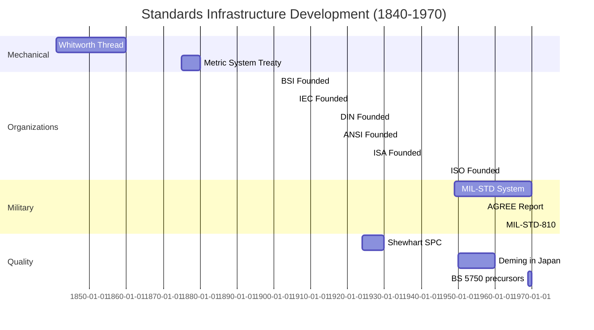
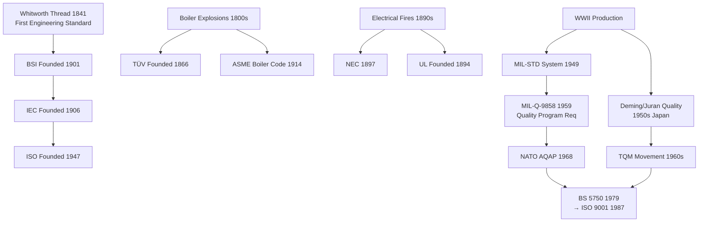
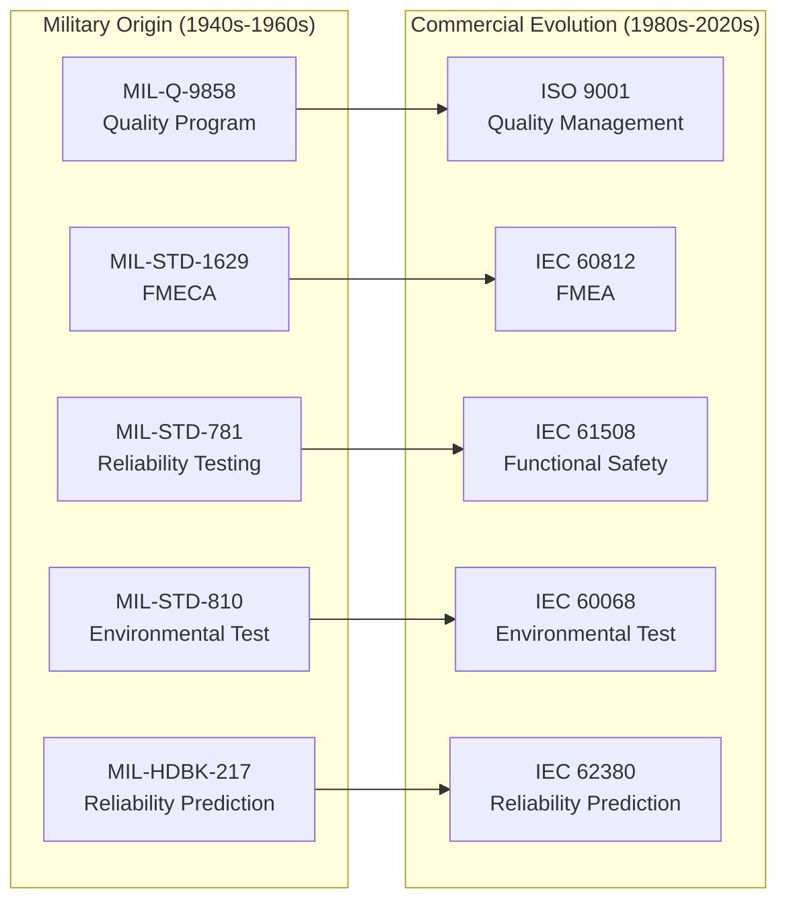

# Pre-1970 Industrial Origins — Comprehensive Engineering Guide

**Category:** Standards History & Timeline  
**Period:** 1800–1970  
**Scope:** Birth of industrial standardization from the railway era through electrification to early computing  
**Key Events:** Screw thread standardization, electrical safety origins, first safety standards  
**Last Updated in this Guide:** 2025

---

## Chapter 1 — Historical Context & Origin Story

### 1.1 The Pre-Standard Era (Before 1900)

Before formal standards, engineering knowledge was transmitted through:
- **Guild systems** (medieval crafts → early industrial trades)
- **Company specifications** (each manufacturer had proprietary designs)
- **Government procurement specs** (military drove early uniformity)
- **Insurance requirements** (boiler explosions → inspection standards)

**Key insight:** Every early standard was born from **failure and death.**

### 1.2 The Railway Catalyst (1840s–1880s)

The railway industry created the **first critical interoperability problem:**

| Problem | Consequence | Solution |
|---------|-------------|----------|
| Different rail gauges | Trains couldn't cross networks | Stephenson gauge (4'8.5") adopted UK 1846 |
| No standard time | Scheduling chaos | Railway Time → UTC (1884) |
| Incompatible couplings | Manual coupling injuries/deaths | Automatic couplers (Janney 1893) |
| Screw thread incompatibility | Parts not interchangeable | Whitworth (1841), Sellers (1864) |

**Sir Joseph Whitworth's 1841 proposal** for a universal screw thread is considered the **first modern engineering standard** — a voluntary specification enabling interchangeable parts across manufacturers.

### 1.3 Electrification & Safety (1880s–1920s)

The rise of electricity brought unprecedented public safety challenges:

| Year | Event | Impact |
|------|-------|--------|
| 1882 | Edison's Pearl Street Station | First public electricity supply |
| 1889 | First electrocution death (power line) | Public safety alarm |
| 1893 | National Electrical Code (NEC) drafted | First US electrical safety standard |
| 1894 | Underwriters' Electrical Bureau formed | → Became Underwriters Laboratories (UL) |
| 1901 | BSI (British Standards Institution) founded | World's first national standards body |
| 1906 | IEC (International Electrotechnical Commission) founded | First international standards body |

### 1.4 World War I — Standardization as Strategic Asset

WWI demonstrated that **standardized manufacturing wins wars:**
- Interchangeable parts enabled mass production of weapons
- Standard gauges allowed ammunition sharing between allies
- **1917:** DIN (Deutsches Institut für Normung) founded in Germany
- **1918:** ANSI (American National Standards Institute) founded in USA
- Lesson: nations without standardization infrastructure couldn't sustain industrial warfare

### 1.5 Timeline of Key National Standards Bodies Formation

| Year | Organization | Country | Trigger |
|------|-------------|---------|---------|
| 1901 | BSI (British Standards Institution) | UK | Structural steel standardization |
| 1906 | IEC | International | Electrical units harmonization |
| 1917 | DIN | Germany | WWI munitions interoperability |
| 1918 | ANSI | USA | Post-WWI industrial coordination |
| 1921 | AFNOR | France | Post-war reconstruction |
| 1921 | Standards Australia | Australia | Trade with UK/US |
| 1926 | ISA (→ ISO predecessor) | International | Cross-border trade facilitation |
| 1930 | BIS (Bureau of Indian Standards, as ISI) | India | British India industrialization |
| 1945 | JISC | Japan | Post-war reconstruction |
| 1947 | ISO | International | Post-WWII global trade rebuilding |

---

## Chapter 2 — Standard Architecture & Structure

### 2.1 How Early Standards Were Structured

Early standards were dramatically simpler than modern ones:

**1901 BSI Standard No. 1 (Structural Steel Sections):**
- 4 pages total
- A table of dimensions
- No formal scope, no definitions section
- No conformity assessment requirements

**Contrast with modern equivalent (ISO 26262):**
- 12 parts, ~800 pages total
- Formal scope, normative references, definitions
- Detailed conformity requirements
- Annexes with rationale and examples

### 2.2 Evolution of Standard Document Architecture

```
1900s: Simple specification table (dimensions, tolerances)
       │
1920s: + Testing methods added
       │
1940s: + Scope statement, definitions section added
       │
1960s: + Normative/informative distinction
       │
1970s: + Management system requirements (process standards)
       │
1990s: + Risk-based approach, performance-based (not prescriptive)
       │
2010s: + Lifecycle coverage, digital twin considerations
       │
2020s: + AI/ML provisions, continuous compliance
```

### 2.3 The Three Generations of Standards

| Generation | Era | Philosophy | Example |
|-----------|-----|-----------|---------|
| **1st Gen: Prescriptive** | 1900-1960 | "Do exactly this" (material specs, dimensions) | BS 1 (steel sections) |
| **2nd Gen: Performance** | 1960-2000 | "Achieve this outcome" (less prescriptive) | IEC 61508 (SIL targets) |
| **3rd Gen: Risk-based** | 2000-present | "Manage risk to acceptable level" | ISO 31000 (risk management) |

---

## Chapter 3 — Technical Deep Dive

### 3.1 The Interchangeable Parts Revolution

**Eli Whitney's 1801 demonstration** to US Congress — assembling muskets from random parts — established the principle that **standards enable mass production.**

Technical requirements for interchangeable parts:
- **Dimensional tolerances** (how much variation is acceptable)
- **Material specifications** (consistent properties)
- **Surface finish standards** (functional interfaces)
- **Gauging systems** (go/no-go inspection)

### 3.2 Key Pre-1970 Technical Standards That Still Govern Today

| Standard | Year | Domain | Still Active? |
|----------|------|--------|---------------|
| Whitworth thread (BSW) | 1841 | Mechanical | Superseded by ISO metric |
| NEC (NFPA 70) | 1897 | Electrical safety | Yes — updated every 3 years |
| IEEE standards (as AIEE) | 1884 | Electrical engineering | Yes — evolved into IEEE |
| MIL-STD-810 | 1962 | Environmental testing | Yes — Rev H (2019) |
| MIL-STD-883 | 1968 | Semiconductor test | Yes — active |
| IEC 60068 | 1960 | Environmental testing | Yes — widely referenced |
| IPC-A-610 | 1960s | Electronics assembly | Yes — Rev H |
| MIL-STD-1553 | 1973 | Military data bus | Yes — still in aircraft |
| RS-232 | 1960 | Serial communication | Largely superseded by USB |

### 3.3 The Birth of Reliability Engineering (1950s-1960s)

The semiconductor and defense industries created **reliability as a discipline:**

| Milestone | Year | Significance |
|-----------|------|-------------|
| AGREE Report (Advisory Group on Reliability of Electronic Equipment) | 1957 | First formal reliability program requirements |
| MIL-HDBK-217 | 1961 | Reliability prediction for electronic systems |
| MIL-STD-781 | 1963 | Reliability testing requirements |
| MIL-STD-1629 (FMECA) | 1949/1980 | Failure Mode, Effects, and Criticality Analysis |
| Bathtub curve formalization | 1950s | Infant mortality → useful life → wearout model |

**Key metrics established in this era:**
- **MTBF** (Mean Time Between Failures)
- **MTTF** (Mean Time To Failure)
- **FIT** (Failures In Time = failures per 10⁹ hours)
- **Reliability function R(t)** = probability of survival to time t

### 3.4 The Quality Revolution (1950s-1960s)

**W. Edwards Deming** and **Joseph Juran** brought statistical quality control to Japan (1950s), creating the quality movement that led to ISO 9001:

```
1924: Shewhart invents control charts (Bell Labs)
1945: US military sampling inspection (MIL-STD-105)
1950: Deming lectures in Japan (JUSE)
1951: Juran's "Quality Control Handbook"
1954: Juran lectures in Japan
1960: Japan creates Deming Prize
1962: Japan: Quality Circles movement
1969: Taguchi methods (robust design)
1979: BSI publishes BS 5750 (→ becomes ISO 9001)
```

---

## Chapter 4 — Implementation Guide

### 4.1 How Pre-1970 Standards Shaped Modern Practice

Modern engineering practices have **direct lineage** to pre-1970 standards:

| Pre-1970 Practice | Modern Equivalent |
|-------------------|-------------------|
| Go/No-Go gauging | Automated test equipment (ATE) |
| MIL-STD inspection | IATF 16949 APQP/PPAP |
| Deming's PDCA cycle | ISO 9001 Clause 10 (improvement) |
| Reliability testing (MIL-STD-781) | HALT/HASS, AEC-Q qualification |
| FMECA (MIL-STD-1629) | FMEA per IEC 60812 |
| Defense specification system | Commercial standards (ISO/IEC) |

### 4.2 Key Principles Established Pre-1970 That Remain Inviolable

1. **Interoperability requires consensus** — proprietary solutions fragment markets
2. **Safety standards follow failures** — reactive, not proactive
3. **Military drives initial standardization** — commercial adoption follows
4. **Standards reduce total cost** — despite compliance investment
5. **Testing must be standardized** — results must be comparable across labs
6. **Documentation is evidence** — "if it isn't documented, it didn't happen"

### 4.3 Legacy Standards Still Impacting Modern Design

Engineers in 2025 still encounter pre-1970 standards:

**MIL-STD-810H (Environmental Testing):**
- Originally 1962, still THE reference for environmental testing
- Drop, vibration, thermal shock, altitude, humidity
- Referenced by: automotive (LV 124), aerospace, consumer electronics

**IPC Standards (Institute of Printed Circuits):**
- IPC-A-600: PCB acceptability (1964 origin)
- IPC-A-610: Electronic assembly acceptability
- Still mandatory in automotive, medical, aerospace manufacturing

**NEC (National Electrical Code):**
- First edition 1897
- Updated every 3 years
- Still governs ALL electrical installations in the USA

---

## Chapter 5 — Certification & Audit

### 5.1 Pre-1970 Conformity Assessment

Before modern third-party certification, conformity was assessed through:

| Method | Era | Example |
|--------|-----|---------|
| **Government inspection** | 1800s+ | Factory inspections (UK Factory Act 1833) |
| **Insurance inspection** | 1850s+ | Boiler inspections after explosions |
| **Military inspection** | 1900s+ | MIL-I-45208 (Inspection System Requirements) |
| **Type testing** | 1920s+ | UL testing of electrical appliances |
| **Self-certification** | 1940s+ | Manufacturer declaration of conformity |

### 5.2 The Birth of Third-Party Certification

| Organization | Founded | Original Purpose |
|--------------|---------|-----------------|
| Lloyd's Register | 1760 | Ship classification |
| Bureau Veritas | 1828 | Marine insurance surveys |
| TÜV (various) | 1866 | Boiler/pressure vessel inspection |
| UL (Underwriters Labs) | 1894 | Electrical fire safety |
| BSI Kitemark | 1903 | Product quality marking |

These organizations evolved from **insurance-driven inspection** to **standards-based certification** over 100+ years.

---

## Chapter 6 — Regional & Domain Variants

### 6.1 The Metric vs. Imperial Divide

The most consequential pre-1970 standardization battle:

| System | Origin | Adopted By | Impact |
|--------|--------|------------|--------|
| Imperial/US Customary | UK/US tradition | USA, Myanmar, Liberia | $370M Mars Climate Orbiter crash (1999) |
| Metric (SI) | France 1799 | 192 countries | Global science, most manufacturing |

**The Treaty of the Metre (1875)** created the international metric system, yet the USA still hasn't fully adopted it — causing ongoing interoperability issues in global engineering.

### 6.2 Electrical Standards Fragmentation (Still Unresolved)

| Region | Voltage | Frequency | Plug Type |
|--------|---------|-----------|-----------|
| North America | 120V | 60 Hz | Type A/B |
| Europe | 230V | 50 Hz | Type C/F/G |
| Japan | 100V | 50/60 Hz | Type A |
| Australia | 230V | 50 Hz | Type I |
| India | 230V | 50 Hz | Type D/M |
| China | 220V | 50 Hz | Type A/I |

This fragmentation was locked in before international harmonization was possible — a permanent legacy of pre-1970 standardization failure.

---

## Chapter 7 — Comparison: Pre-1970 vs. Modern Standards Approach

| Feature | Pre-1970 Standards | Modern Standards (Post-2000) |
|---------|-------------------|------------------------------|
| **Page count** | 2-20 pages | 50-800 pages |
| **Scope** | Single specification | Full lifecycle |
| **Risk basis** | Deterministic (pass/fail) | Probabilistic (risk-based) |
| **Development time** | Months | 3-7 years |
| **Stakeholder input** | Government + large industry | All stakeholders including consumers |
| **Accessibility** | Often free | Typically paid (€50-€400) |
| **Update frequency** | Irregular | Systematic (5-year cycle) |
| **Legal status** | Government mandate or trade custom | Voluntary (unless regulation references) |
| **Process coverage** | Product spec only | Process + product + management |
| **International harmonization** | Minimal | ISO/IEC framework |

---

## Chapter 8 — Mermaid Architecture Diagrams

### 8.1 Timeline of Standards Infrastructure Development



### 8.2 Pre-1970 Standards Family Tree



### 8.3 From Military to Commercial Standards



---

## Chapter 9 — Case Studies & Failure Analysis

### 9.1 The Boiler Explosion Crisis (1850s-1900s)

**What happened:** Steam boiler explosions killed thousands in the 19th century. In the USA alone, over 50,000 people died from boiler explosions between 1880 and 1910.

**Root cause:** No material specifications, no design standards, no inspection requirements. Manufacturers competed on price, not safety.

**Standard response:**
- Hartford Steam Boiler Inspection (1866) — first insurance-based inspection
- ASME Boiler and Pressure Vessel Code (1914) — still THE code today
- TÜV founded in Germany (1866) for the same reason

**Impact:** Established the principle that **safety standards must be mandatory for dangerous equipment.**

### 9.2 The Titanic (1912)

**What happened:** 1,500 people died because the ship had insufficient lifeboats and no standardized distress communication.

**Standards response:**
- SOLAS Convention (1914) — Safety of Life at Sea
- International Maritime Organization standards
- Radio communication standards (→ eventually ITU)

**Impact:** Demonstrated that **international standards are needed when products cross borders** — no single nation could prevent the next maritime disaster alone.

### 9.3 Thalidomide (1957-1961)

**What happened:** Drug caused ~10,000 birth defects worldwide. No standardized clinical trial requirements existed.

**Standards response:**
- ICH (International Council for Harmonisation) guidelines
- GCP (Good Clinical Practice) standards
- FDA modern approval process

**Impact:** Created the **precautionary principle** in medical standards — prove safety BEFORE market access.

### 9.4 Texas City Refinery Explosion (1947)

**What happened:** Ammonium nitrate cargo exploded, killing 581 people. No hazardous materials handling standards existed.

**Standards response:**
- NFPA standards for chemical handling
- OSHA Hazardous Materials regulations
- UN GHS (Globally Harmonized System of Classification)

---

## Chapter 10 — Future Evolution & Industry Trends

### 10.1 Lessons from Pre-1970 for Modern Standards

| Historical Pattern | Modern Parallel |
|-------------------|-----------------|
| Rail gauge wars (1840s) | Charging connector wars (2020s) |
| Electrical voltage fragmentation | 5G spectrum allocation conflicts |
| Military specs → commercial standards | DARPA/NASA research → ISO standards |
| Insurance-driven safety inspection | Cyber insurance driving security standards |
| Interchangeable parts revolution | Software component standardization (SBOM) |

### 10.2 Unresolved Pre-1970 Legacies

Some pre-1970 standardization failures **still haven't been resolved:**
- Imperial vs. Metric (USA still non-metric)
- Electrical plug/voltage fragmentation
- Left-hand vs. right-hand traffic
- Multiple rail gauges (Russia, Spain, India use different gauges)

These demonstrate that **once standards are established, changing them is nearly impossible** due to installed base economics.

---

## Chapter 11 — Interview Questions & Career Guide

### Tier 1: Entry-Level Questions (0-3 years)

**Q1:** When was ISO founded and why?  
**A:** 1947, to coordinate international standards after WWII demonstrated the need for global interoperability. Predecessor ISA existed 1926-1942.

**Q2:** What was the first engineering standard?  
**A:** Joseph Whitworth's 1841 proposal for a standard screw thread system (BSW - British Standard Whitworth), enabling interchangeable fasteners across manufacturers.

**Q3:** Why did military standards (MIL-STD) precede commercial standards?  
**A:** Military procurement required interoperability (ammunition, parts) and reliability (combat conditions). Government had the authority and funding to develop and enforce standards. Commercial markets adopted later as benefits became clear.

### Tier 2: Mid-Level Questions (3-8 years)

**Q4:** How did the quality movement in 1950s Japan influence modern standards?  
**A:** Deming's PDCA cycle and statistical process control became the foundation of ISO 9001. Japanese quality culture (kaizen, quality circles) demonstrated that quality systems reduce cost. This led to BS 5750 (1979) → ISO 9001 (1987), now used by 1.3M+ organizations.

**Q5:** Explain the evolution from prescriptive to performance-based to risk-based standards.  
**A:** 1st gen: "use this material at this thickness" (deterministic). 2nd gen: "achieve this safety integrity level" (probabilistic targets). 3rd gen: "identify, analyze, and mitigate risks to acceptable level" (management framework). Each generation is more flexible but requires more engineering judgment.

### Tier 3: Senior/Lead Questions (8-15 years)

**Q6:** Why do some pre-1970 standards persist unchanged while others are constantly revised?  
**A:** Persistence correlates with: (1) massive installed base making change uneconomical (rail gauge, voltage), (2) physics-based specifications that don't change (material properties), (3) proven adequacy with no driving failures. Frequent revision occurs when technology evolves rapidly (wireless, cybersecurity) or new failure modes emerge.

### Tier 4: Principal/Distinguished (15+ years)

**Q7:** How should a nation design its standards infrastructure from scratch today, learning from history?  
**A:** (1) Adopt ISO/IEC framework immediately (don't reinvent). (2) Prioritize sectors with safety/trade impact (food, electrical, medical). (3) Build accreditation infrastructure (labs, certification bodies). (4) Participate in international TCs early. (5) Use standards as economic development tool (not trade barrier). India's BIS and Korea's KATS are modern examples of deliberate standards infrastructure building.

---

## Chapter 12 — Cheat Sheet & Quick Reference

### Key Milestones Quick Reference

| Year | Event | Why It Matters |
|------|-------|----------------|
| 1841 | Whitworth thread | First engineering standard |
| 1875 | Treaty of the Metre | International measurement system |
| 1894 | UL founded | Third-party safety testing begins |
| 1901 | BSI founded | First national standards body |
| 1906 | IEC founded | First international standards body |
| 1914 | ASME Boiler Code | First mandatory safety standard |
| 1947 | ISO founded | Global standards coordination |
| 1949 | MIL-STD system | Military reliability/quality framework |
| 1950 | Deming in Japan | Quality revolution begins |
| 1957 | AGREE Report | Formal reliability engineering born |
| 1962 | MIL-STD-810 | Environmental testing codified |
| 1968 | MIL-STD-883 | Semiconductor testing standardized |

### The Pattern of Standard Creation

```
DISASTER → INVESTIGATION → COMMITTEE → STANDARD → ADOPTION
  │                                                    │
  │        (Reactive cycle: 5-15 years)                │
  └────────────────────────────────────────────────────┘
         (Proactive cycle: emerging risks)
```

### 5-Minute Executive Briefing

> **Modern standardization stands on 180 years of evolution.** Every safety standard exists because people died. Every interoperability standard exists because markets fragmented. Every quality standard exists because costs spiraled.
>
> The pre-1970 era established three unshakeable principles:
> 1. **Standards are economic infrastructure** — as important as roads and power grids
> 2. **Safety standards must be mandatory** — voluntary safety doesn't work
> 3. **International harmonization enables trade** — divergence is a trade barrier
>
> These principles haven't changed. Only the technology domains have expanded.

---

*End of Document — 01_Pre_1970_Industrial_Origins.md*
