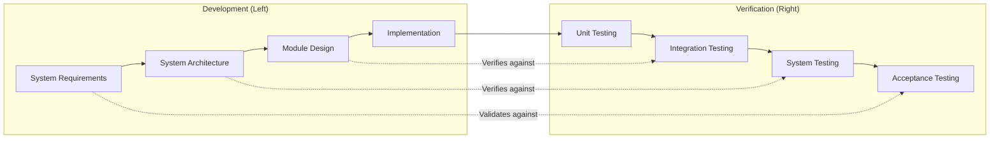
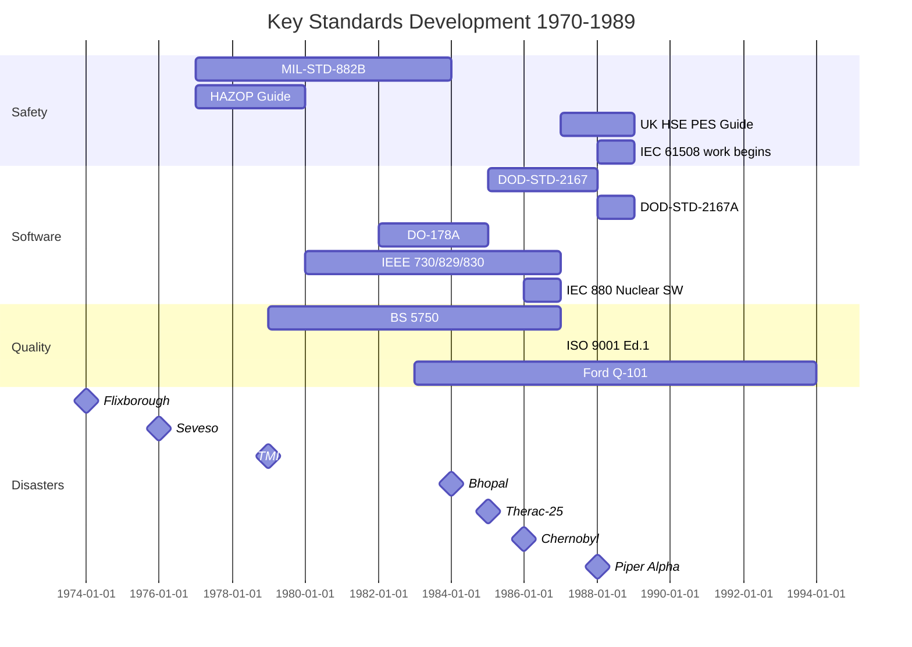
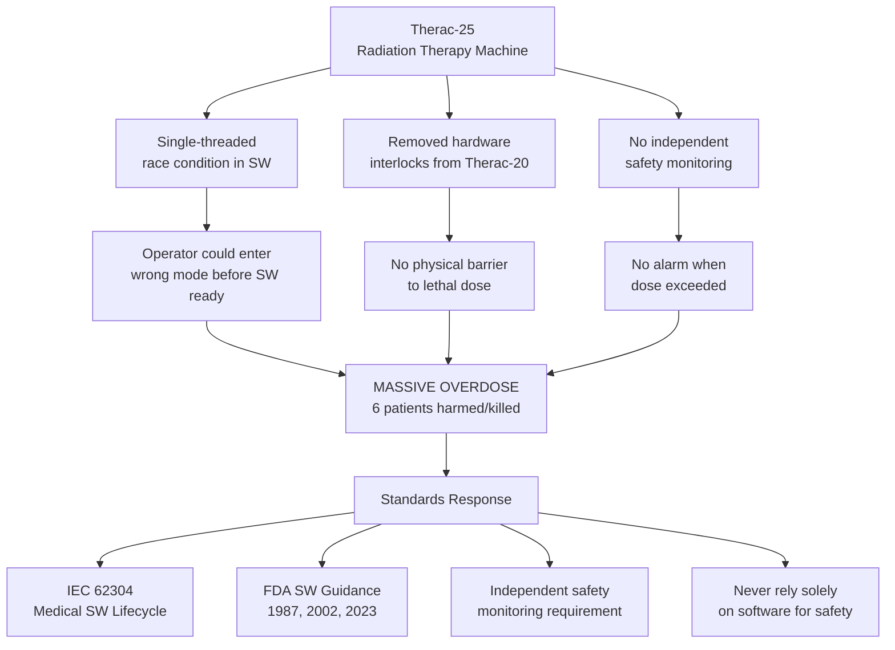
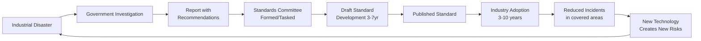

# 1970s–1980s Safety Awakening — Comprehensive Engineering Guide

**Category:** Standards History & Timeline  
**Period:** 1970–1989  
**Scope:** The two decades that created modern safety, quality, and software engineering standards  
**Key Standards Born:** IEC 61508 precursors, MIL-STD-882, BS 5750 (→ISO 9001), IEEE 829/830  
**Last Updated in this Guide:** 2025

---

## Chapter 1 — Historical Context & Origin Story

### 1.1 Why the 1970s-80s Were Transformative

The 1970s-80s represent the **safety awakening** — the period when industrialized nations realized that:
1. **Software could kill** (Therac-25, 1985-87)
2. **Chemical plants could devastate cities** (Seveso 1976, Bhopal 1984)
3. **Nuclear energy carried existential risk** (Three Mile Island 1979, Chernobyl 1986)
4. **Quality was a competitive weapon** (Japan overtaking US/Europe in automotive, electronics)
5. **Software engineering needed formalization** (NATO Software Engineering Conferences 1968-69 aftermath)

### 1.2 Major Disasters Driving Standards

| Year | Disaster | Deaths | Standard Response |
|------|----------|--------|-------------------|
| 1974 | Flixborough explosion (UK) | 28 | HAZOP methodology, HSE Seveso Directive |
| 1976 | Seveso dioxin release (Italy) | 0 (mass contamination) | EU Seveso Directive (82/501/EEC) |
| 1979 | Three Mile Island (USA) | 0 (partial meltdown) | NRC regulatory overhaul, IEC 61513 origins |
| 1984 | Bhopal gas tragedy (India) | 3,787+ (official) | IEC 61511 process safety |
| 1985-87 | Therac-25 radiation overdoses | 6 | Software safety standards, FDA guidance |
| 1986 | Chernobyl (USSR) | 31 immediate + thousands long-term | IAEA safety standards, IEC 61513 |
| 1986 | Challenger disaster | 7 | NASA safety culture reform |
| 1988 | Piper Alpha oil platform | 167 | Offshore safety regulations, Lord Cullen report |

### 1.3 The Software Crisis

The term **"software crisis"** was coined at the 1968 NATO conference, but the 1970s-80s made it acute:

- **Exponential growth** in embedded software complexity
- **No formal methods** for proving correctness
- **No industry-wide coding standards** (each company had its own)
- **Therac-25** proved that software bugs kill — directly and unambiguously
- **Ariane 4 software reuse** (that would later crash Ariane 5 in 1996) was designed in this era

**Key realization:** Hardware has physics-based failure modes (wearout, random). Software has **systematic failures** — design errors that persist forever unless found. This insight drove the entire safety software standards family.

### 1.4 The Quality Revolution Reaches the West

Japan's economic miracle (1960s-80s) was built on quality:
- **1979:** Philip Crosby publishes "Quality is Free"
- **1979:** BS 5750 published (first quality management system standard)
- **1980:** NBC airs "If Japan Can, Why Can't We?" (Deming documentary)
- **1987:** ISO 9001 first edition (based on BS 5750)
- **1987:** Malcolm Baldrige National Quality Award (USA)

**Impact:** Quality went from "inspection at the end" to "management system" — process excellence, not product inspection.

---

## Chapter 2 — Standard Architecture & Structure

### 2.1 New Standard Categories Emerged (1970s-80s)

| Category | Innovation | Key Standard |
|----------|-----------|--------------|
| **Process Safety** | HAZOP methodology | ICI/HSE HAZOP Guide (1977) |
| **Software Engineering** | Lifecycle models | IEEE 1012 (V&V), DOD-STD-2167A |
| **Quality Management** | Management system approach | BS 5750 → ISO 9001 |
| **Safety Analysis** | Formal hazard analysis | MIL-STD-882 (System Safety) |
| **Reliability** | Quantitative targets | IEC 60300 series |
| **EMC** | Electromagnetic compatibility | IEC 61000 series (early work) |
| **Nuclear Safety** | Defense-in-depth | IAEA NUSS codes |

### 2.2 The V-Model Formalization

The V-Model was formalized in this era as the **standard development lifecycle for safety-critical systems:**



**Origin:** German defense procurement (Bundeswehr V-Modell, 1986). Adopted by safety standards because it enforces **traceability between development and verification** at every abstraction level.

### 2.3 The Management System Standard Architecture

BS 5750/ISO 9001 introduced a revolutionary structure — standards that specify **how an organization is managed**, not what a product looks like:

```
Plan → Do → Check → Act (PDCA Cycle)

PLAN:  Define quality policy, objectives, processes
DO:    Implement processes, produce products
CHECK: Monitor, measure, audit, review
ACT:   Correct deficiencies, improve continuously
```

This architecture influenced ALL subsequent management system standards (ISO 14001, ISO 27001, ISO 45001, etc.).

---

## Chapter 3 — Technical Deep Dive

### 3.1 MIL-STD-882: System Safety Program (1969/1984)

**The foundational system safety standard:**

MIL-STD-882 introduced the **risk matrix** that every safety standard still uses:

| Severity | Catastrophic | Critical | Marginal | Negligible |
|----------|-------------|----------|----------|------------|
| **Frequent** | 1 (Unacceptable) | 1 | 2 | 3 |
| **Probable** | 1 | 1 | 2 | 3 |
| **Occasional** | 1 | 2 | 3 | 4 |
| **Remote** | 2 | 3 | 3 | 4 |
| **Improbable** | 3 | 3 | 4 | 4 |

Where: 1=Unacceptable, 2=Undesirable, 3=Acceptable with review, 4=Acceptable

**MIL-STD-882 concepts still in use today:**
- Hazard analysis (→ HARA in ISO 26262)
- Severity classification (→ ASIL severity)
- Preliminary Hazard List/Analysis (PHL/PHA)
- Safety assessment report

### 3.2 The Birth of FMEA/FMECA as Engineering Practice

While FMEA originated in 1949 (MIL-P-1629), it became **standard engineering practice** in the 1970s-80s:

- **1972:** Ford Motor Company adopts FMEA for Pinto development
- **1977:** MIL-STD-1629A formalized FMECA procedure
- **1980:** SAE J1739 — Automotive FMEA guideline
- **1993:** Automotive FMEA manual (AIAG) — IATF requirement

**FMEA Process (established 1970s):**
```
For each component/function:
1. Identify potential failure modes
2. Determine effects on system
3. Identify causes
4. Assess: Severity × Occurrence × Detection = RPN
5. Define mitigation actions
6. Recalculate RPN after mitigation
```

### 3.3 Software Engineering Standards Born in This Era

| Standard | Year | Scope | Impact |
|----------|------|-------|--------|
| DOD-STD-2167 | 1985 | Defense software development | First mandated SW lifecycle |
| DOD-STD-2167A | 1988 | Revised defense SW development | Widely adopted commercially |
| IEEE 730 | 1980 | Software Quality Assurance | First SW QA standard |
| IEEE 828 | 1983 | Software Configuration Management | SCM formalization |
| IEEE 829 | 1983 | Software Test Documentation | Test plan/case/report templates |
| IEEE 830 | 1984 | Software Requirements Specifications | SRS document structure |
| IEEE 1012 | 1986 | Software Verification & Validation | V&V process standard |
| IEEE 1016 | 1987 | Software Design Descriptions | Design documentation |
| DO-178A | 1982 | Avionics software | First airborne SW standard |
| IEC 880 | 1986 | Nuclear reactor SW | First nuclear SW standard |

### 3.4 DO-178A/B: The Avionics Software Standard

**DO-178A (1982)** was the first standard specifically for airborne software safety. Revised as **DO-178B (1992):**

| Level | Failure Condition | Software Coverage |
|-------|------------------|-------------------|
| A | Catastrophic | MC/DC + all lower |
| B | Hazardous/Severe-Major | Decision coverage + statement |
| C | Major | Statement coverage |
| D | Minor | — |
| E | No effect | — |

**Key innovation:** Linked software rigor to **system-level hazard severity** — the principle later adopted by ISO 26262's ASIL concept.

### 3.5 IEC 61508 Development Begins (Late 1980s)

IEC Technical Committee TC65 began work on what would become **IEC 61508** in the late 1980s:

**Motivation:**
- Programmable Electronic Systems (PES) replacing hardwired safety systems
- No standard existed for software-based safety functions
- Multiple industries needed guidance simultaneously
- UK HSE published "Programmable Electronic Systems in Safety-Related Applications" (1987)

**Key design decisions made in 1980s:**
1. **Safety Integrity Levels** (SIL 1-4) as quantitative + qualitative targets
2. **Separation of random and systematic failures**
3. **Full lifecycle coverage** (concept through decommissioning)
4. **Technology-neutral** approach (applicable to any E/E/PE system)

---

## Chapter 4 — Implementation Guide

### 4.1 Impact on Silicon/Hardware Design

The 1970s-80s established:

**Component derating standards:**
- MIL-HDBK-338: Electronic Reliability Design Handbook
- Component derating = running parts below maximum ratings for reliability
- Power derating curves became standard practice

**Failure rate prediction:**
- MIL-HDBK-217 became the reference (though criticized for accuracy)
- Bellcore/Telcordia TR-332 for telecom
- Siemens SN 29500 for automotive

**Qualification testing:**
- MIL-STD-883 (semiconductor)
- JEDEC standards began (JESD22 series)
- Temperature cycling, HTOL, ESD standards formalized

### 4.2 Impact on Firmware & Embedded Software

**Before 1970:** Embedded software was written ad-hoc, no formal lifecycle  
**After 1985:** DOD-STD-2167A required:
- Software Development Plan
- Software Requirements Specification
- Interface Design Document
- Software Design Document
- Source code + comments
- Software Test Plan
- Software Test Report
- Version Description Document

**This document set is still the basis of every modern development standard** (ISO 26262 Part 6, DO-178C, ASPICE).

### 4.3 Impact on Manufacturing & Quality

BS 5750 / ISO 9001 impact on manufacturing:

| Before BS 5750 | After BS 5750 |
|----------------|---------------|
| Final inspection | Process control at each step |
| Quality = QC department's job | Quality = everyone's responsibility |
| Customer complaints drive fixes | Prevention-based approach |
| Tribal knowledge | Documented procedures |
| Variable processes | Controlled, repeatable processes |
| No internal audits | Regular internal audits |
| No management review | Formal management review cycle |

---

## Chapter 5 — Certification & Audit

### 5.1 Birth of Modern Third-Party Certification (1980s)

The 1980s saw the **industrialization of certification:**

| Development | Year | Impact |
|-------------|------|--------|
| BSI's QA registration scheme | 1979 | First management system certification |
| NATO AQAP series | 1980s | Defense quality requirements |
| ISO 9001 published | 1987 | Global QMS certification begins |
| NACCB (UK) formed | 1984 | First national accreditation body |
| EAC formed | 1987 | European accreditation coordination |
| IAF formed | 1993 | International accreditation forum |

### 5.2 The Assessment Industry

By the late 1980s, **certification became an industry:**
- TÜV, BSI, SGS, Bureau Veritas expanded certification services
- ISO 9001 certificates became procurement requirements
- "If you're not certified, you can't bid" became norm in automotive, aerospace

**First automotive supplier quality mandates:**
- Ford Q-101 (1983)
- GM Targets for Excellence (1988)
- QS-9000 (1994, combining Ford/GM/Chrysler requirements)
- → Eventually harmonized as IATF 16949

---

## Chapter 6 — Regional & Domain Variants

### 6.1 1970s-80s: The Era of National Standards

Before ISO harmonization, each major industrial nation had **its own safety/quality standards:**

| Country | Quality Standard | Safety Approach |
|---------|-----------------|-----------------|
| UK | BS 5750 | HSE + Seveso Directive |
| Germany | DIN ISO 9004 | TÜV + Berufsgenossenschaften |
| USA | MIL-Q-9858A + ANSI/ASQC | OSHA + NRC |
| Japan | JIS Z 9901 + TQC | MITI guidelines |
| France | NF X 50-110 | AFNOR + CEA |

### 6.2 EU Harmonization Begins

The **EU New Approach (1985)** was revolutionary:
- EU Directives set **essential requirements** (safety, health)
- CEN/CENELEC creates **harmonized standards** (technical details)
- Compliance with harmonized standards = **presumption of conformity** with directive
- CE marking introduced (1993, retroactive to 1985 framework)

This model — regulation references standard, standard provides compliance path — is now used globally.

---

## Chapter 7 — Comparison: 1970s-80s Safety Approaches

| Feature | US (MIL-STD-882) | UK (HSE PES Guidelines) | Germany (DIN V 19250) | International (IEC 61508, in dev) |
|---------|-------------------|--------------------------|----------------------|----------------------------------|
| **Risk classification** | 4×5 matrix | 4 categories | 8 Anforderungsklassen (AK) | SIL 1-4 |
| **Software treatment** | General requirements | Detailed SW guidance | Minimal | Full SW lifecycle |
| **Scope** | Military systems | All PES | Control systems | All E/E/PE |
| **Quantitative targets** | No | Yes (some) | Yes (AK → failure rate) | Yes (PFD/PFH) |
| **Lifecycle coverage** | Concept to disposal | Design + operation | Mostly design | Full lifecycle |
| **Legal basis** | Contract requirement | HSW Act 1974 | Regulatory guideline | Voluntary (initially) |

---

## Chapter 8 — Mermaid Architecture Diagrams

### 8.1 Standards Development Timeline (1970-1989)



### 8.2 Therac-25 Failure Causation Chain



### 8.3 From Disaster to Standard — The Feedback Loop



---

## Chapter 9 — Case Studies & Failure Analysis

### 9.1 Therac-25 (1985-1987) — The Case That Changed Software Safety

**System:** AECL Therac-25 linear accelerator for cancer radiation therapy

**What happened:** 
- 6 patients received massive radiation overdoses (100× intended dose)
- 3 died directly, others severely injured
- Machine displayed "MALFUNCTION 54" — operators retried, delivering multiple overdoses

**Root causes (multi-factorial):**
1. Race condition in real-time software (assembly language, no RTOS)
2. Hardware safety interlocks removed (present in predecessor Therac-20)
3. Software relied upon as sole safety mechanism
4. No independent dose monitoring
5. Inadequate fault reporting (cryptic error codes)
6. Manufacturer dismissed early reports as "impossible"

**Standards created/influenced:**
- IEC 62304 (Medical device software lifecycle)
- FDA General Principles of Software Validation (2002)
- IEC 60601-1 (Medical electrical equipment — software safety)
- Principle: **"Never use software as the sole means of protection"**

### 9.2 Bhopal Gas Tragedy (1984) — Process Safety Failure

**System:** Union Carbide pesticide plant, Bhopal, India

**What happened:**
- Water entered MIC (methyl isocyanate) storage tank
- Exothermic reaction released 40+ tons of toxic gas
- 3,787 official deaths (estimates up to 16,000+), 500,000+ affected

**Root causes:**
1. Safety systems disabled or non-functional (refrigeration off, scrubber off, flare tower disconnected)
2. No maintenance of safety instrumented systems
3. No emergency response plan for surrounding population
4. Cost-cutting deferred all safety maintenance

**Standards created/influenced:**
- IEC 61511 (Process safety using Safety Instrumented Systems)
- OSHA Process Safety Management (PSM) 29 CFR 1910.119
- EU Seveso II Directive (96/82/EC)
- Concept of Safety Integrity Level for process industry

### 9.3 Chernobyl (1986) — Nuclear Safety Culture Failure

**System:** RBMK-1000 nuclear reactor, Pripyat, Ukraine (USSR)

**What happened:**
- Operators disabled safety systems to conduct unauthorized test
- Positive void coefficient caused power excursion
- Steam explosion and graphite fire released massive radiation

**Root causes:**
1. Reactor design flaw (positive void coefficient)
2. Safety culture failure (production over safety)
3. Operators deliberately disabled interlocks
4. No containment structure (cost saving)
5. Secrecy prevented learning from prior incidents

**Standards created/influenced:**
- IAEA Safety Standards (complete overhaul)
- IEC 61513 (Nuclear power plant I&C)
- INSAG-4 "Safety Culture" concept (1991)
- Convention on Nuclear Safety (1994)
- Defense-in-depth principle formalized

---

## Chapter 10 — Future Evolution & Industry Trends

### 10.1 What the 1970s-80s Got Right

| Innovation | Why It Endured |
|-----------|----------------|
| Risk-based thinking | Universal applicability across all domains |
| V-Model lifecycle | Enforces traceability and verification |
| Management systems (PDCA) | Scalable to any organization |
| Independence in safety assessment | Prevents groupthink and conflicts of interest |
| Quantitative safety targets (SIL concept) | Enables objective comparison and allocation |
| FMEA as standard method | Systematic, teachable, auditable |

### 10.2 What the 1970s-80s Got Wrong

| Limitation | Why | Modern Resolution |
|-----------|-----|-------------------|
| Waterfall-only lifecycle | Didn't anticipate iterative/agile | ISO 26262:2018 + SAFe/Agile-safety integration |
| Hardware-centric safety | Software was simple then | IEC 61508-3, ISO 26262-6, DO-178C |
| National fragmentation | ISO harmonization took decades | Global ISO/IEC standards with CB scheme |
| Prescriptive approaches | Reduced engineering flexibility | Risk-based, goal-setting approaches |
| Reliability prediction (MIL-HDBK-217) | Inaccurate for modern electronics | Physics-of-failure approaches |

### 10.3 Legacy Influence on 2025 Standards

Every modern standard traces its DNA to 1970s-80s:

```
MIL-STD-882 (1969/84) → ISO 26262 HARA (2011/18)
BS 5750 (1979) → ISO 9001 (2015) → IATF 16949 (2016)
DOD-STD-2167A (1988) → ISO 12207 (1995) → ASPICE (2015)
DO-178A (1982) → DO-178C (2012)
IEC 880 (1986) → IEC 61513 (2001/2011)
HSE PES Guide (1987) → IEC 61508 (1998/2010)
HAZOP (1977) → IEC 61882 (2001/2016)
```

---

## Chapter 11 — Interview Questions & Career Guide

### Tier 1: Entry-Level Questions (0-3 years)

**Q1:** What was the Therac-25 and why is it relevant to embedded software engineers?  
**A:** A radiation therapy machine where software bugs caused lethal overdoses (1985-87). It's the canonical example of why safety-critical software must have independent monitoring, hardware interlocks, and formal development processes. It drove creation of medical device software standards.

**Q2:** What is FMEA and when did it become standard practice?  
**A:** Failure Mode and Effects Analysis — systematic identification of failure modes, their effects, causes, and mitigations. Originated MIL-P-1629 (1949), became widespread in 1970s-80s via automotive industry. Now mandatory in ISO 26262, IATF 16949, IEC 61508.

**Q3:** What was BS 5750 and how is it related to ISO 9001?  
**A:** BS 5750 was the British Standard for quality management systems (1979), the world's first QMS standard. ISO 9001 (1987) was based directly on BS 5750 and became its international successor.

### Tier 2: Mid-Level Questions (3-8 years)

**Q4:** Explain the difference between random and systematic failures, and why this distinction matters for safety standards.  
**A:** Random failures are hardware failures with predictable statistical distribution (component aging, radiation upsets) — mitigated by redundancy and derating. Systematic failures are design/specification errors that persist in every identical unit — mitigated by rigorous process (reviews, testing, formal methods). IEC 61508 treats them differently: random → quantitative targets (PFD/PFH), systematic → qualitative process requirements (SIL Capability).

**Q5:** How did the Bhopal disaster influence modern process safety standards?  
**A:** Bhopal proved that Safety Instrumented Systems must: (1) be functionally independent from control systems, (2) have defined SIL targets with proof testing, (3) have documented maintenance requirements, (4) include emergency response integration. This drove IEC 61511 (2003) and OSHA PSM requirements.

### Tier 3: Senior/Lead Questions (8-15 years)

**Q6:** Compare the MIL-STD-882 approach to system safety with IEC 61508's approach. What was gained and lost in the transition?  
**A:** MIL-STD-882 is a **system safety program** standard (process for identifying and managing hazards throughout lifecycle). IEC 61508 is a **safety function** standard (ensuring specific safety functions achieve required integrity). Gained: quantitative targets, software lifecycle rigor, international applicability. Lost: system-level thinking (61508 focuses on E/E/PE, not whole system), program management aspects, organizational safety culture requirements.

### Tier 4: Principal/Distinguished (15+ years)

**Q7:** If you were designing a new safety standard for AI-based autonomous systems today, what principles from the 1970s-80s would you retain, and what would you fundamentally change?  
**A:** **Retain:** Risk-based classification, lifecycle coverage, independence in assessment, safety case philosophy, quantitative targets concept. **Change:** Replace deterministic V-model with iterative/adaptive lifecycle, move from "prove absence of failures" to "demonstrate acceptable behavior under distribution", introduce continuous operational monitoring as first-class requirement, address non-determinism and emergent behavior, require simulation-based evidence, and mandate online safety monitoring (operational design domain enforcement).

---

## Chapter 12 — Cheat Sheet & Quick Reference

### Key Standards Born 1970-1989

| Standard | Year | Still Active (2025)? | Modern Successor |
|----------|------|---------------------|-----------------|
| MIL-STD-882B | 1977 | Yes (Rev E, 2012) | Also: ISO 26262 HARA |
| HAZOP Guide (ICI/LEES) | 1977 | Yes (IEC 61882:2016) | — |
| BS 5750 | 1979 | No → ISO 9001:2015 | ISO 9001:2015 |
| DO-178A | 1982 | No → DO-178C (2012) | DO-178C |
| MIL-STD-1553B | 1978 | Yes (still in aircraft!) | — |
| IEEE 730 (SQA) | 1980 | Yes (2014 revision) | — |
| IEEE 830 (SRS) | 1984 | Superseded by IEEE 29148:2018 | ISO/IEC/IEEE 29148 |
| DOD-STD-2167A | 1988 | Cancelled → MIL-STD-498 | ISO 12207 |
| IEC 880 | 1986 | Superseded | IEC 62138:2018 |
| ISO 9001 Ed.1 | 1987 | Yes (5th edition: 2015) | ISO 9001:2015 |

### Key Concepts Established

| Concept | Origin | Where Used Today |
|---------|--------|-----------------|
| Safety Integrity Level | HSE PES Guide 1987 → IEC 61508 | All safety standards |
| Risk Matrix | MIL-STD-882 1969 | Universal |
| PDCA Cycle | Deming/Shewhart (formalized 1980s) | All management standards |
| V-Model | German defense 1986 | ISO 26262, DO-178C, IEC 61508 |
| FMEA/FMECA | MIL-STD-1629A 1980 | ISO 26262, IATF 16949, all safety |
| HAZOP | ICI 1977 | IEC 61882, process industry |
| Software V&V | IEEE 1012:1986 | All safety SW standards |

### 5-Minute Executive Briefing

> **The 1970s-80s are when modern safety and quality standards were born.** Every standard your organization uses today traces its roots to this era.
>
> **Key takeaway:** Every major safety standard exists because the previous approach **allowed people to die.** Therac-25 created software safety standards. Bhopal created process safety standards. Chernobyl transformed nuclear safety culture. These aren't bureaucratic overhead — they're distilled tragedy.
>
> **What changed:** The shift from "inspect the product" to "manage the process" (ISO 9001), and from "test until it works" to "develop with rigor from the start" (V-Model). Both remain foundational principles of every modern engineering standard.

---

*End of Document — 02_1970s_1980s_Safety_Awakening.md*
