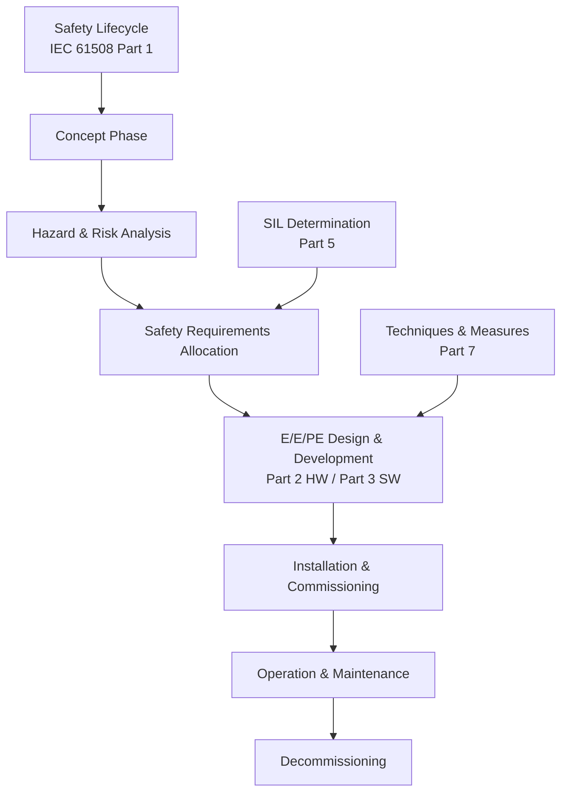
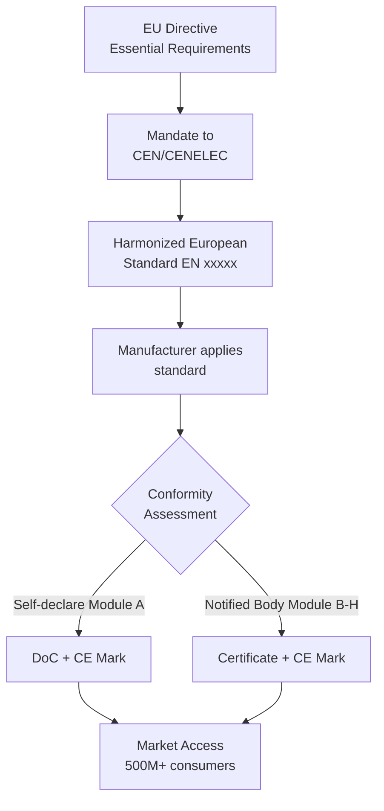
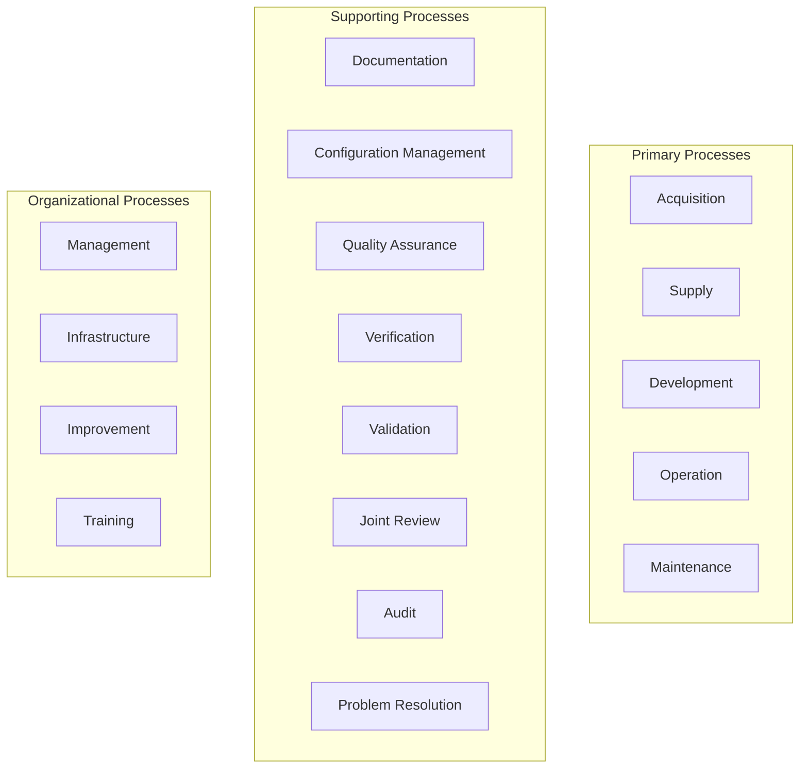
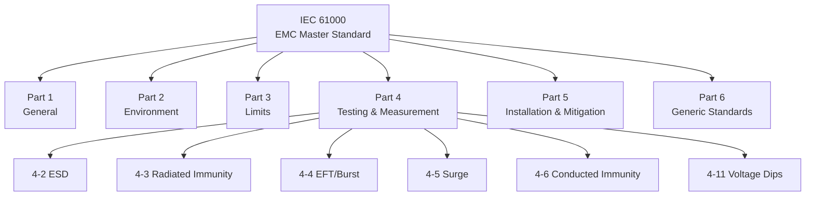
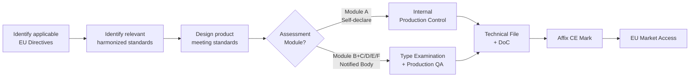
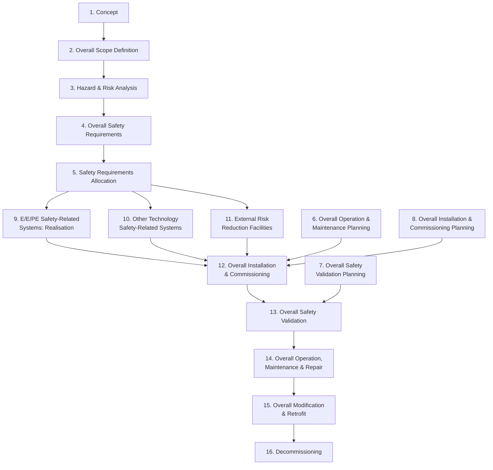
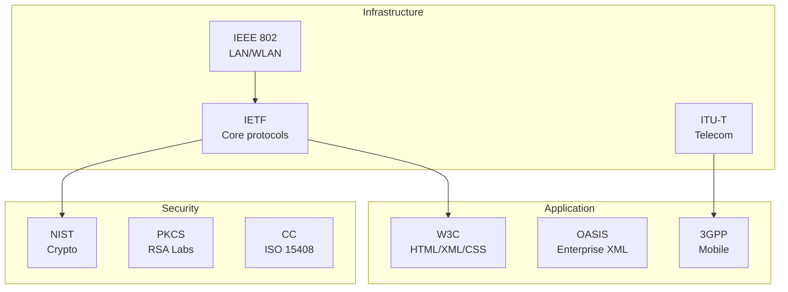

# 1990s Digital Era Standards — Comprehensive Engineering Guide

**Category:** Standards History & Timeline  
**Period:** 1990–1999  
**Scope:** Explosion of digital technology standards — internet, wireless, embedded safety, quality systems  
**Key Standards Born:** IEC 61508 (1998), ISO 14001 (1996), DO-178B (1992), MISRA C (1998), QS-9000 (1994)  
**Last Updated in this Guide:** 2025

---

## Chapter 1 — Historical Context & Origin Story

### 1.1 The Digital Revolution Context

The 1990s brought a **fundamental transformation** in technology standardization:

1. **Internet explosion** (1993 Mosaic browser → mass adoption)
2. **Mobile phones** go mainstream (GSM networks deploy)
3. **Embedded systems** become safety-critical at scale (automotive ECUs multiply 10×)
4. **Software complexity** exceeds human comprehension (millions of LOC in vehicles)
5. **Globalization** demands international standards harmonization
6. **Y2K** reveals scale of undocumented legacy software

### 1.2 Driving Events of the 1990s

| Year | Event | Standards Impact |
|------|-------|-----------------|
| 1990 | World Wide Web invented (CERN) | W3C formed (1994), IETF standards explode |
| 1991 | GSM deployed commercially | ETSI/3GPP standards accelerate |
| 1992 | EU Single Market Act | CE marking + harmonized standards |
| 1993 | Pentium FDIV bug | Hardware validation standards |
| 1994 | Airbus A320 crashes (multiple) | DO-178B enforcement strengthened |
| 1996 | Ariane 5 Flight 501 crash | Software reuse / integration testing focus |
| 1996 | HIPAA (US health privacy law) | Health data standards |
| 1997 | Toyota Prius (first mass hybrid) | New reliability challenges |
| 1998 | IEC 61508 published | Foundational functional safety standard |
| 1999 | Y2K preparations | Software process maturity awareness |

### 1.3 The Automotive Electronics Explosion

| Year | Avg ECUs per Vehicle | LOC per Vehicle | Key Change |
|------|---------------------|-----------------|------------|
| 1980 | 1-3 | ~10K | Basic engine management |
| 1990 | 10-15 | ~100K | ABS, airbags, immobilizer |
| 2000 | 30-40 | ~1M | Drive-by-wire, ESP, nav |
| 2010 | 70-100 | ~10M | ADAS, infotainment |
| 2020 | 100-150 | ~100M | Connected, L2+ automation |

**This 1000× growth in software complexity drove the need for automotive-specific safety and quality standards.**

### 1.4 Key Standard Publications (1990-1999)

| Year | Standard | Significance |
|------|----------|-------------|
| 1991 | ISO/IEC 9126 | Software quality model |
| 1992 | DO-178B | Avionics software (definitive edition for 20 years) |
| 1993 | CMMI predecessor (CMM v1.1) | Software process maturity |
| 1994 | QS-9000 | Automotive quality (Ford/GM/Chrysler) |
| 1995 | ISO/IEC 12207 | Software lifecycle processes |
| 1996 | ISO 14001 | Environmental management system |
| 1996 | MISRA Guidelines (pre-MISRA C) | Automotive software guidelines |
| 1997 | IEEE 1149.1 (JTAG) | Boundary scan testing |
| 1998 | IEC 61508 | Functional safety (base standard) |
| 1998 | MISRA C:1998 | C language subset for safety |
| 1999 | Common Criteria (ISO 15408) | IT security evaluation |
| 1999 | Bluetooth 1.0 specification | Short-range wireless standard |

---

## Chapter 2 — Standard Architecture & Structure

### 2.1 IEC 61508 Architecture (The Landmark Standard)

IEC 61508 was published in 7 parts (1998-2000):

| Part | Title | Content |
|------|-------|---------|
| 1 | General Requirements | Overall framework, lifecycle |
| 2 | Requirements for E/E/PE safety-related systems | Hardware design |
| 3 | Software Requirements | Software lifecycle |
| 4 | Definitions and abbreviations | Terminology |
| 5 | Examples of methods for determination of SIL | SIL calculation methods |
| 6 | Guidelines on application of Parts 2 and 3 | Application guidance |
| 7 | Overview of techniques and measures | Reference of methods |

**Key architectural principles:**


### 2.2 The Safety Integrity Level Framework

| SIL | PFDavg (Low Demand) | PFH (High Demand/Continuous) | Risk Reduction Factor |
|-----|---------------------|------------------------------|----------------------|
| 4 | ≥10⁻⁵ to <10⁻⁴ | ≥10⁻⁹ to <10⁻⁸ | 10,000 – 100,000 |
| 3 | ≥10⁻⁴ to <10⁻³ | ≥10⁻⁸ to <10⁻⁷ | 1,000 – 10,000 |
| 2 | ≥10⁻³ to <10⁻² | ≥10⁻⁷ to <10⁻⁶ | 100 – 1,000 |
| 1 | ≥10⁻² to <10⁻¹ | ≥10⁻⁶ to <10⁻⁵ | 10 – 100 |

### 2.3 Internet Standards Architecture (IETF/W3C)

The internet standards ecosystem is **fundamentally different** from ISO/IEC:

| Feature | ISO/IEC Model | Internet Model (IETF) |
|---------|---------------|----------------------|
| **Process** | Committee, ballot, consensus | "Rough consensus and running code" |
| **Speed** | 3-7 years | Months to 2 years |
| **Access** | Paid documents | Free (RFCs are free) |
| **Proof** | Expert opinion | Working implementation required |
| **Revision** | 5-year cycles | Supersede as needed |
| **Authority** | National body votes | Technical merit |

**IETF Standards Track:**
```
Internet-Draft → Proposed Standard → Draft Standard → Internet Standard (STD)
     │                                                       │
     └── Most implementations use Proposed Standards ────────┘
```

### 2.4 The EU New Approach + CE Marking System (Fully Active 1990s)



---

## Chapter 3 — Technical Deep Dive

### 3.1 IEC 61508 Technical Core

**Safety Function decomposition:**
```
Safety Function = Sensor → Logic Solver → Final Element
                  (input)   (processing)    (output)
```

**Hardware metrics:**
- **SFF** (Safe Failure Fraction) = (λS + λDD) / λtotal
- **HFT** (Hardware Fault Tolerance) = number of faults tolerable
- **MTTR** (Mean Time To Restoration)
- **Proof Test Interval** (T1) — how often you test safety functions
- **Diagnostic Coverage** (DC) — % of dangerous failures detected

**Architectural constraints (HW):**

| SIL | SFF < 60% | 60% ≤ SFF < 90% | 90% ≤ SFF < 99% | SFF ≥ 99% |
|-----|-----------|------------------|------------------|-----------|
| 1 | HFT=0 | HFT=0 | HFT=0 | HFT=0 |
| 2 | HFT=1 | HFT=0 | HFT=0 | HFT=0 |
| 3 | HFT=2 | HFT=1 | HFT=0 | HFT=0 |
| 4 | HFT=3 | HFT=2 | HFT=1 | HFT=0 |

### 3.2 MISRA C:1998 Technical Requirements

**127 rules** for the C language (93 required, 34 advisory):

| Category | Example Rules | Rationale |
|----------|--------------|-----------|
| Environment | Compiler compliance documented | Reproducibility |
| Character sets | Only ISO/IEC 646 characters | Portability |
| Comments | No nested comments | Ambiguity |
| Identifiers | 31 char significance | Compiler portability |
| Types | Specific bit-width types required | Hardware independence |
| Constants | Suffixes for literal types | Type safety |
| Declarations | No implicit int | Explicitness |
| Initialization | All variables initialized | Determinism |
| Operators | No operator overloading (wrong lang!) | Clarity |
| Pointers | Restricted pointer arithmetic | Safety |
| Control flow | No goto | Readability/analysis |
| Functions | No recursion | Stack determinism |
| Preprocessing | Restricted macro usage | Debuggability |

### 3.3 DO-178B (1992) — Avionics Software Technical Requirements

| Objective | DAL A | DAL B | DAL C | DAL D | DAL E |
|-----------|-------|-------|-------|-------|-------|
| Requirements-based testing | Yes | Yes | Yes | Yes | No |
| Structural coverage (statement) | Yes | Yes | Yes | No | No |
| Structural coverage (decision) | Yes | Yes | No | No | No |
| Structural coverage (MC/DC) | Yes | No | No | No | No |
| Requirements traceability | Full | Full | Full | Partial | No |
| Independence | Full | Some | No | No | No |

**MC/DC (Modified Condition/Decision Coverage):**
Every condition in a decision independently affects the outcome. This is THE most rigorous structural coverage metric and was defined by DO-178B.

### 3.4 ISO/IEC 12207:1995 — Software Lifecycle Processes

First international standard defining a **complete software lifecycle process framework:**



This structure influenced **all subsequent process standards** (ASPICE, CMMI, ISO 15504).

### 3.5 Common Criteria (ISO 15408:1999)

**Evaluation Assurance Levels:**

| EAL | Name | Description | Typical Use |
|-----|------|-------------|-------------|
| 1 | Functionally Tested | Basic testing | Consumer products |
| 2 | Structurally Tested | Developer testing + some independent | Medium assurance |
| 3 | Methodically Tested and Checked | Independent testing | Some enterprise |
| 4 | Methodically Designed, Tested, and Reviewed | Full design review | Enterprise/government |
| 5 | Semiformally Designed and Tested | Semi-formal methods | High-security |
| 6 | Semiformally Verified Design and Tested | Formal verification attempt | Very high security |
| 7 | Formally Verified Design and Tested | Full formal verification | National security |

---

## Chapter 4 — Implementation Guide

### 4.1 Impact on Automotive ECU Development (1990s)

The 1990s transformed automotive ECU development:

**Before (1980s):** Assembly language, no formal process, test-until-it-works  
**After (late 1990s):** 
- C language with MISRA rules
- Formal review processes (QS-9000 requirements)
- Configuration management (version control mandatory)
- Testing against requirements (traceability)
- FMEA mandatory (QS-9000/QS-9000)

### 4.2 Internet Protocol Stack Standardization

```
Application Layer: HTTP (RFC 2616), FTP, SMTP, DNS
                   HTML (W3C), XML (W3C), SSL/TLS (IETF)
                   
Transport Layer:   TCP (RFC 793), UDP (RFC 768)

Network Layer:     IP (RFC 791), ICMP, IPsec
                   IPv6 (RFC 2460, 1998)

Link Layer:        Ethernet (IEEE 802.3), WiFi (IEEE 802.11, 1997)
                   PPP, Frame Relay, ATM
```

**Impact:** For the first time, standards enabled **global interoperability** between millions of independent implementations. The internet couldn't exist without open standards.

### 4.3 GSM/2G → 3G Standardization Path

| Generation | Standard Body | Key Specs | Year |
|-----------|--------------|-----------|------|
| 2G (GSM) | ETSI | GSM specs | 1991 deploy |
| 2.5G (GPRS) | ETSI/3GPP | Release 97 | 1997 |
| 2.75G (EDGE) | 3GPP | Release 98 | 1998 |
| 3G (UMTS) | 3GPP | Release 99 | 1999 |

**3GPP formed in 1998** — bringing together ETSI (Europe), ARIB/TTC (Japan), CCSA (China), ATIS (USA), TTA (Korea) for global cellular standardization.

### 4.4 EMC Standards Framework (Fully Developed 1990s)



---

## Chapter 5 — Certification & Audit

### 5.1 ISO 9001 Certification Explosion (1990s)

**ISO 9001 certifications worldwide:**
- 1993: ~46,000 certificates
- 1996: ~162,000 certificates
- 1999: ~344,000 certificates
- Growth: 7.5× in 6 years

**Drivers:**
- EU public procurement required ISO 9001
- Automotive OEMs mandated supplier certification
- "No cert = no business" became reality

### 5.2 Automotive Quality System Requirements

| Standard | Year | Who Required It | Successor |
|----------|------|-----------------|-----------|
| Ford Q-101 | 1983 | Ford suppliers | QS-9000 |
| GM Targets for Excellence | 1988 | GM suppliers | QS-9000 |
| QS-9000 | 1994 | Big 3 (Ford/GM/Chrysler) | ISO/TS 16949 |
| VDA 6.1 | 1998 | German OEMs | ISO/TS 16949 |
| AVSQ '94 | 1994 | Italian OEMs | ISO/TS 16949 |
| EAQF | 1994 | French OEMs | ISO/TS 16949 |

**Problem:** Each OEM had different requirements → suppliers needed 4+ certifications.  
**Solution:** ISO/TS 16949:1999 (→ IATF 16949:2016) unified them all.

### 5.3 CE Marking Process (Fully Operational 1990s)



---

## Chapter 6 — Regional & Domain Variants

### 6.1 1990s: Harmonization vs. Fragmentation

The 1990s saw **two opposing forces:**

**Harmonization wins:**
- EU single market (1992) → harmonized standards mandatory
- WTO TBT Agreement (1995) → countries must use international standards
- ISO 9001 → global quality language

**Fragmentation continues:**
- China: rapidly developing GB standards (often adapted from IEC/ISO)
- Japan: JIS standards maintained alongside ISO
- USA: industry-specific (SAE, IEEE, UL) resisted full ISO adoption
- Internet: IETF/W3C completely separate from ISO/IEC

### 6.2 The TBT Agreement (WTO, 1995)

The **Technical Barriers to Trade** agreement was a landmark:
- Countries should use international standards (ISO/IEC) as basis for technical regulations
- National standards must not be more trade-restrictive than necessary
- Mutual recognition agreements encouraged
- **Impact:** Developing nations accelerated adoption of ISO/IEC standards

---

## Chapter 7 — Comparison: 1990s Standard Families

| Feature | IEC 61508 (Safety) | ISO 9001 (Quality) | DO-178B (Avionics SW) | Common Criteria (Security) |
|---------|--------------------|--------------------|----------------------|---------------------------|
| **Scope** | E/E/PE safety systems | Any organization | Airborne software | IT products |
| **Metric** | SIL 1-4 | Pass/Fail (certified or not) | DAL A-E | EAL 1-7 |
| **Lifecycle** | Full (concept-decom) | Management system (ongoing) | Development | Evaluation only |
| **Mandatory?** | Sector-dependent | Voluntary (but required by customers) | Yes (FAA/EASA mandate) | Government procurement |
| **Certification** | 3rd party (TÜV/Exida) | Accredited body (BSI, SGS, etc.) | DER + FAA/EASA | CCRA labs |
| **Cost** | $100K-$1M+ | $10K-$50K | $200K-$2M+ per project | $50K-$500K |
| **Duration** | 6-18 months | 3-6 months | Parallel with development | 6-18 months |

---

## Chapter 8 — Mermaid Architecture Diagrams

### 8.1 1990s Standards Explosion Timeline

```mermaid
gantt
    title Key Standards of the 1990s
    dateFormat YYYY
    section Safety
        IEC 61508 development   :1990, 1998
        IEC 61508 published     :1998, 1999
        DO-178B published       :1992, 1993
    section Quality
        QS-9000                 :1994, 1999
        ISO 14001               :1996, 1997
        ISO 9001:1994           :1994, 2000
    section Security
        Common Criteria v1.0    :1996, 1999
        ISO 15408               :1999, 2000
    section Software
        MISRA C:1998            :1998, 1999
        ISO 12207               :1995, 1996
        CMM v1.1                :1993, 1994
    section Telecom
        GSM deployed            :1991, 1992
        WiFi 802.11             :1997, 1998
        3GPP formed             :1998, 1999
        Bluetooth 1.0           :1999, 1999
    section Internet
        HTTP 1.0 RFC 1945       :1996, 1996
        HTML 4.0 W3C            :1997, 1998
        IPv6 RFC 2460           :1998, 1999
```

### 8.2 IEC 61508 Safety Lifecycle



### 8.3 Internet Standards Ecosystem (1990s)



---

## Chapter 9 — Case Studies & Failure Analysis

### 9.1 Ariane 5 Flight 501 (1996) — Software Reuse Failure

**System:** Ariane 5 launch vehicle (ESA)

**What happened:**
- Launch vehicle deviated from trajectory and self-destructed 37 seconds after launch
- $370M payload lost (4 Cluster satellites)

**Root cause:**
- Inertial reference system (SRI) software reused from Ariane 4
- 64-bit floating point → 16-bit integer conversion overflowed
- Ariane 5's trajectory generated larger values than Ariane 4's
- Backup SRI had identical software (common-cause failure)
- Exception handling shut down SRI rather than degrading gracefully

**Standards lessons:**
1. Software reuse requires re-verification in new context
2. Ada exception handling must be designed for safety, not just correctness
3. Common-cause failure analysis must cover software
4. Backup systems must be diverse (not identical software)

**Standard impact:** Strengthened IEC 61508 requirements for:
- Systematic capability assessment
- Proven-in-use arguments (now require same operational profile)
- Diverse redundancy for high SIL

### 9.2 Pentium FDIV Bug (1994) — Hardware Verification Gap

**System:** Intel Pentium processor

**What happened:**
- Division operation produced incorrect results for certain operands
- Discovered by mathematics professor Thomas Nicely
- Intel initially downplayed ("error occurs once every 27,000 years for typical user")
- Public backlash forced total recall ($475M cost)

**Root cause:**
- Lookup table for SRT division algorithm had 5 missing entries (out of 1066)
- Verification test suite didn't cover all entries
- Mathematical proof of algorithm correctness didn't verify implementation

**Standards impact:**
- Drove formal verification adoption in CPU design
- Strengthened hardware validation requirements
- Influenced IEC 61508 hardware metrics (coverage of test cases)
- Created expectation of hardware errata documentation

### 9.3 Y2K — Scale of Undocumented Legacy Systems

**What happened:** The Year 2000 problem revealed that:
- Billions of lines of COBOL/assembly used 2-digit year fields
- Date calculations would fail on January 1, 2000
- No documentation existed for much legacy code
- Estimated $300-600B spent on remediation globally

**Standards lessons:**
1. Software maintenance requires documentation (configuration management)
2. Standards must require future-proofing considerations
3. Compliance without understanding (superficial process) is dangerous
4. Industry-wide coordination mechanisms are needed for systemic risks

**Standard impact:** Accelerated adoption of:
- ISO/IEC 12207 (software lifecycle including maintenance)
- Configuration management standards (IEEE 828)
- Software quality metrics (ISO/IEC 9126)
- CMM/CMMI maturity assessment

---

## Chapter 10 — Future Evolution & Industry Trends

### 10.1 Seeds Planted in the 1990s

| 1990s Seed | 2000s/2010s Fruit |
|------------|-------------------|
| IEC 61508 published | ISO 26262, DO-178C, IEC 62304 derivatives |
| QS-9000 | → ISO/TS 16949 → IATF 16949 |
| CMM | → CMMI → Automotive SPICE |
| Common Criteria | → ISO 15408 v3.1, CCRA expansion |
| GSM/3GPP | → 3G/4G/5G revolution |
| WiFi 802.11 | → 802.11n/ac/ax/be |
| HTML/HTTP | → REST, WebSocket, Progressive Web Apps |
| IPv6 | → Still deploying 25 years later! |

### 10.2 1990s Predictions vs. Reality

| 1990s Prediction | What Actually Happened |
|-----------------|----------------------|
| "Standards will simplify everything" | Standards multiplied; complexity increased |
| "One global quality standard (ISO 9001)" | Sector standards proliferated (IATF, AS9100, etc.) |
| "Internet standards will stay academic" | Became the backbone of global economy |
| "IEC 61508 will cover all safety needs" | Required 10+ domain derivatives |
| "IPv6 will replace IPv4 by 2005" | Still running dual-stack in 2025 |

### 10.3 Unresolved 1990s Issues (Still Open in 2025)

- **Software liability:** Who is liable when certified software fails? (Still no clear answer)
- **Open source in safety systems:** IEC 61508 assumes known provenance — how to handle OSS?
- **Standard complexity:** IEC 61508 requires 200+ work products — is this proportionate?
- **Speed vs. safety:** Agile wasn't compatible with 1990s lifecycle models (only partially resolved)

---

## Chapter 11 — Interview Questions & Career Guide

### Tier 1: Entry-Level Questions (0-3 years)

**Q1:** What is IEC 61508 and when was it published?  
**A:** IEC 61508 is the foundational functional safety standard for Electrical/Electronic/Programmable Electronic safety-related systems. Published 1998 (7 parts). It introduced SIL levels, safety lifecycle, and is the parent of ISO 26262, DO-178C, IEC 62304.

**Q2:** What does MISRA C enforce and why?  
**A:** MISRA C defines a safe subset of the C language for safety-critical embedded systems. It bans constructs that cause undefined behavior (pointer arithmetic), are ambiguous (operator precedence), or are unprovable (recursion, dynamic memory). 127 rules in 1998 edition; 143 rules + 16 directives in 2012 edition.

**Q3:** What is the difference between ISO 9001 and QS-9000?  
**A:** ISO 9001 is a generic QMS standard for any industry. QS-9000 was automotive-specific (Ford/GM/Chrysler, 1994), adding APQP, PPAP, FMEA, SPC, MSA requirements on top of ISO 9001. QS-9000 was superseded by ISO/TS 16949 (1999) → IATF 16949 (2016).

### Tier 2: Mid-Level Questions (3-8 years)

**Q4:** Explain what MC/DC means and why DO-178B mandates it for DAL A.  
**A:** Modified Condition/Decision Coverage requires that every condition in a decision has been shown to independently affect the decision's outcome. This is stronger than branch coverage because it proves each condition matters. DO-178B mandates it for DAL A (catastrophic failure conditions) because it ensures no dead code and that every safety-relevant condition is exercised. Practically, MC/DC requires at least N+1 test cases for a decision with N conditions.

**Q5:** How does IEC 61508 handle software differently from hardware?  
**A:** Hardware failures are random (probabilistic) — quantified by PFD/PFH. Software failures are systematic (design errors) — cannot be quantified probabilistically. IEC 61508 Part 3 uses a qualitative "systematic capability" claim (SC1-SC4) based on process rigor, not failure rate. This is one of the standard's most debated aspects.

### Tier 3: Senior/Lead Questions (8-15 years)

**Q6:** Why did automotive standards (QS-9000, VDA 6.1, EAQF, AVSQ) fragment in the 1990s, and what does this teach us about standardization governance?  
**A:** Each region's OEMs created their own standards because: (1) No international automotive quality standard existed, (2) Each OEM had different cultural priorities (German process rigor vs. US APQP approach vs. French/Italian flexibility), (3) Standards are power tools — controlling the standard = controlling the supply chain. Lesson: Global industries need global standards; fragmentation wastes supplier resources. The solution (ISO/TS 16949) required IATF — an industry body representing ALL major OEMs.

### Tier 4: Principal/Distinguished (15+ years)

**Q7:** IEC 61508 was revolutionary in 1998 but is now criticized. What are its fundamental limitations, and how should the next generation of safety standards address them?  
**A:** Key limitations: (1) Assumes deterministic systems (can't handle AI/ML), (2) Lifecycle model assumes waterfall (clashes with agile), (3) SIL concept conflates hardware integrity with software systematic capability, (4) Doesn't adequately address system-of-systems or OTA updates, (5) Common-cause failure analysis is primitive for complex software. Next-gen must: embrace continuous assurance, support adaptive systems, quantify software reliability empirically, address AI non-determinism, and enable modular safety cases for component reuse.

---

## Chapter 12 — Cheat Sheet & Quick Reference

### Key 1990s Standards — Quick Lookup

| Standard | Domain | Key Metric | Still Active? |
|----------|--------|-----------|---------------|
| IEC 61508 | Safety (all) | SIL 1-4 | Yes (2010 edition) |
| DO-178B | Avionics SW | DAL A-E | Superseded by DO-178C (2012) |
| MISRA C:1998 | Automotive SW | 127 rules | Superseded by 2012/2023 |
| ISO 9001:1994 | Quality | Pass/Fail | Superseded by 2015 |
| QS-9000 | Auto Quality | Pass/Fail | Superseded by IATF 16949 |
| ISO 14001:1996 | Environmental | Pass/Fail | Superseded by 2015 |
| ISO 15408:1999 | IT Security | EAL 1-7 | Yes (2022 revision) |
| ISO 12207:1995 | SW Lifecycle | Process model | Yes (2017 revision) |
| IEEE 802.11:1997 | WiFi | Data rate | Superseded (802.11be 2024) |

### The 1990s Safety Landscape Summary

```
IEC 61508 (1998) = Mother standard
├── Automotive → ISO 26262 (2011, derived in 2000s)
├── Avionics → DO-178B/C (parallel development)
├── Medical → IEC 62304 (2006, but rooted in 1990s)
├── Railway → EN 50128/50129 (2001, but rooted in 1990s)
├── Process → IEC 61511 (2003, but rooted in 1990s)
└── Nuclear → IEC 61513 (2001, from IEC 880 1986)
```

### 5-Minute Executive Briefing

> **The 1990s created the standards infrastructure we still use in 2025.** IEC 61508 (functional safety), ISO 9001 (quality), DO-178B (avionics software), and MISRA C (coding rules) all either published or matured in this decade.
>
> **Three forces drove this:** (1) Embedded software became safety-critical at scale — cars, planes, and factories depended on code. (2) Globalization demanded harmonized standards — QS-9000's fragmentation proved unsustainable. (3) The internet demonstrated that open standards enable exponential innovation.
>
> **The 1990s lesson:** Standards that enable interoperability (internet protocols) grow faster than standards that constrain behavior (safety). But safety standards prevent deaths. The challenge since the 1990s has been applying safety rigor at internet speed — a tension still unresolved.

---

*End of Document — 03_1990s_Digital_Era_Standards.md*
