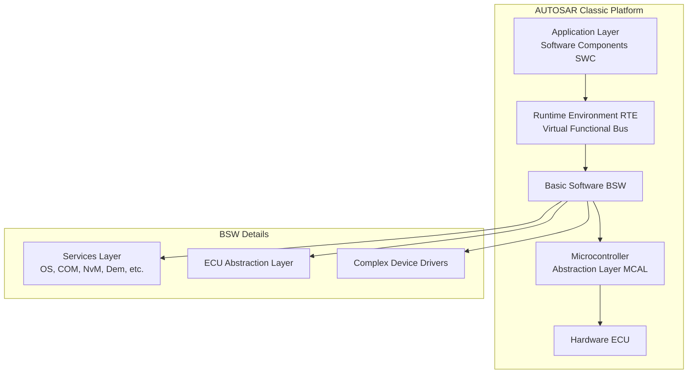
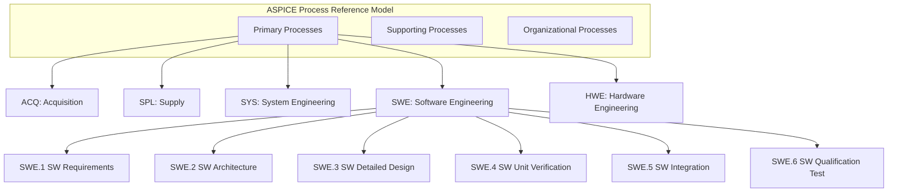
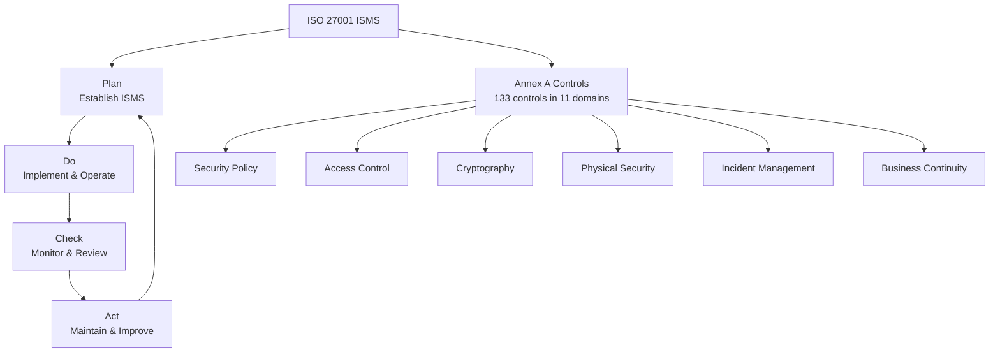
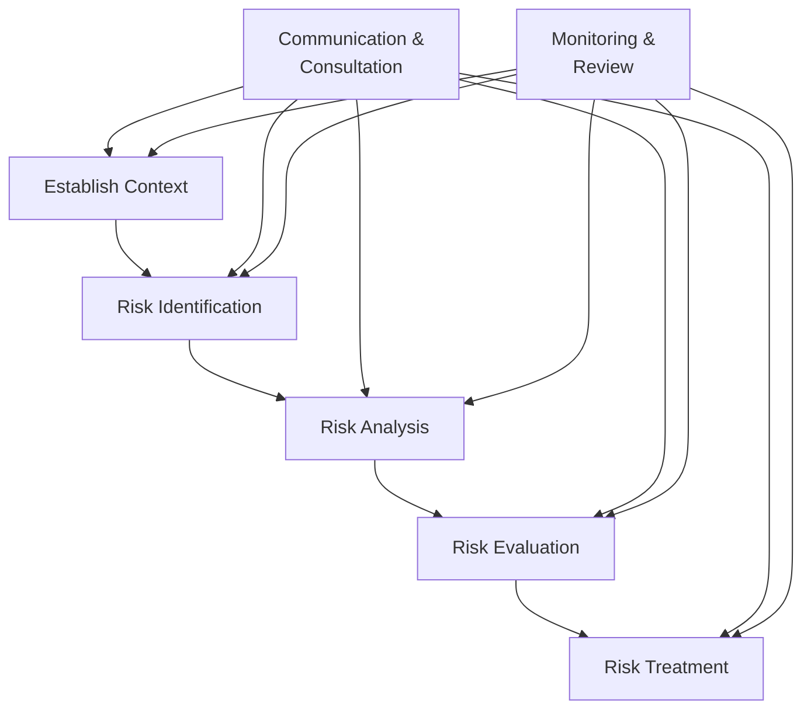
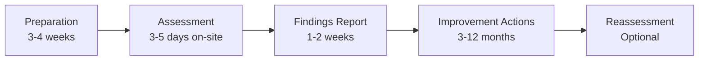
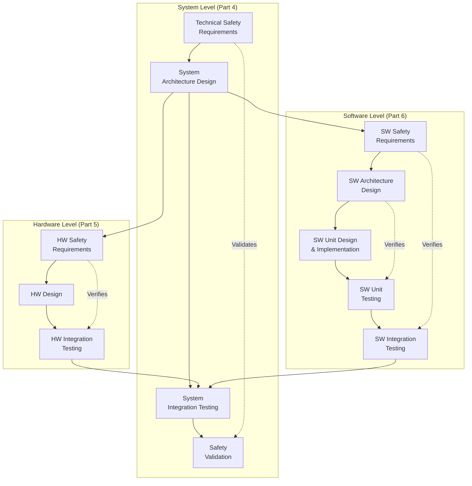
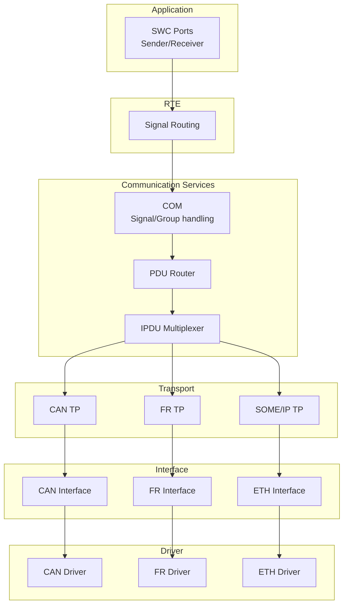

# 2000s Embedded & Internet Era — Comprehensive Engineering Guide

**Category:** Standards History & Timeline  
**Period:** 2000–2009  
**Scope:** The decade of automotive safety standardization, AUTOSAR, ASPICE, Web 2.0, and semiconductor reliability  
**Key Standards Born:** ISO 26262 (dev), AUTOSAR (2003), ASPICE (2005), ISO 27001 (2005), IEC 62304 (2006)  
**Last Updated in this Guide:** 2025

---

## Chapter 1 — Historical Context & Origin Story

### 1.1 The 2000s — Safety Meets Complexity

The 2000s were defined by **three colliding forces:**

1. **Automotive electronics explosion** — ECU count per vehicle surpassed 70, software exceeded 10M LOC
2. **Internet becomes critical infrastructure** — e-commerce, banking, government services go online
3. **Semiconductor technology scaling** — Moore's Law drives SoC complexity to billions of transistors

**Key realization:** The 1990s standards (IEC 61508, ISO 9001) were **necessary but insufficient** for these domains. Domain-specific standards were urgently needed.

### 1.2 Major Events Driving Standards (2000-2009)

| Year | Event | Standards Impact |
|------|-------|-----------------|
| 2000 | Firestone/Ford tire recall | TREAD Act → TPMS mandate |
| 2001 | 9/11 attacks | Complete overhaul of security standards (NIST 800-series) |
| 2002 | Toyota ACC unintended acceleration reports | Accelerated ISO 26262 development |
| 2003 | AUTOSAR consortium formed | Automotive software architecture standard |
| 2003 | Northeast blackout (USA/Canada) | NERC CIP standards for grid security |
| 2004 | Indian Ocean tsunami | Emergency communication standards |
| 2005 | ISO 27001 published | Information security management standard |
| 2005 | ASPICE (HIS Automotive SPICE) | Automotive process assessment |
| 2006 | IEC 62304 published | Medical device software lifecycle |
| 2007 | iPhone launched | Mobile platform standardization revolution |
| 2008 | Global financial crisis | Risk management standards (ISO 31000) |
| 2009 | Toyota unintended acceleration (major) | ISO 26262 urgency intensified |

### 1.3 The Toyota Acceleration Crisis (2009-2010)

**The single event that made ISO 26262 mandatory in practice:**

- 89 deaths attributed to unintended acceleration
- $3.2 billion in settlements
- NASA investigation found no electronic cause (mostly floor mats/pedals)
- BUT: Code quality review revealed **spaghetti code, global variables, no MISRA compliance**
- Expert witness (Michael Barr) testified: "Toyota's code was defective and dangerous"

**Result:** Every automotive OEM mandated ISO 26262 compliance from Tier-1 suppliers. The standard went from "nice to have" to "no ISO 26262 = no business" almost overnight.

### 1.4 ISO 26262 Development Timeline

```
1998:  IEC 61508 published (base standard)
2001:  ISO TC22/SC3/WG16 formed for automotive functional safety
2005:  First committee drafts circulated
2008:  DIS (Draft International Standard) published
2009:  Toyota crisis accelerates adoption
2011:  ISO 26262:2011 published (10 parts)
2012:  Industry-wide adoption begins
```

---

## Chapter 2 — Standard Architecture & Structure

### 2.1 ISO 26262 Architecture (Development Phase)

ISO 26262 was designed with **10 parts** covering the full automotive safety lifecycle:

| Part | Title | Coverage |
|------|-------|----------|
| 1 | Vocabulary | 150+ defined terms |
| 2 | Management of functional safety | Organization, project management |
| 3 | Concept phase | Item definition, HARA, safety goals |
| 4 | Product development: system level | TSR, system design, integration testing |
| 5 | Product development: hardware level | Hardware metrics, FMEDA, diagnostic coverage |
| 6 | Product development: software level | SW architecture, unit/integration testing |
| 7 | Production, operation, service, decommissioning | Manufacturing, field operation |
| 8 | Supporting processes | CM, change management, documentation |
| 9 | ASIL-oriented and safety-oriented analyses | FMEA, FTA, DFA, dependent failure analysis |
| 10 | Guideline on ISO 26262 | Application examples |

### 2.2 AUTOSAR Architecture

AUTOSAR (AUTomotive Open System ARchitecture) defined a **layered software architecture:**



**Key AUTOSAR principles:**
- **Separation of concerns:** Application SW independent from HW
- **Standardized interfaces:** Virtual Functional Bus (VFB) abstraction
- **Configurability:** XML-based system description (ARXML)
- **Reusability:** SWCs can be migrated between ECUs
- **Scalability:** From 8-bit microcontrollers to 32-bit SoCs

### 2.3 ASPICE (Automotive SPICE) Process Assessment Model



**Capability Levels:**
| Level | Name | Meaning |
|-------|------|---------|
| 0 | Incomplete | Process not implemented or failing |
| 1 | Performed | Process achieves its outcomes |
| 2 | Managed | Process is planned, monitored, adjusted |
| 3 | Established | Organization-wide standard process |
| 4 | Predictable | Process operates within defined limits |
| 5 | Innovating | Continuously optimizing |

**Industry target:** Most OEMs require Level 2-3 for safety-relevant software.

### 2.4 ISO 27001:2005 — Information Security Management



---

## Chapter 3 — Technical Deep Dive

### 3.1 ASIL Determination (ISO 26262 Part 3)

**HARA (Hazard Analysis and Risk Assessment) parameters:**

| Parameter | Levels | Description |
|-----------|--------|-------------|
| Severity (S) | S0-S3 | S0: No injury, S3: Life-threatening/fatal |
| Exposure (E) | E0-E4 | E0: Incredible, E4: High probability |
| Controllability (C) | C0-C3 | C0: Controllable, C3: Difficult/uncontrollable |

**ASIL Determination Matrix:**

| S\E×C | C1 | C2 | C3 |
|-------|----|----|----| 
| S1,E1 | QM | QM | QM |
| S1,E2 | QM | QM | QM |
| S1,E3 | QM | QM | A |
| S1,E4 | QM | A | B |
| S2,E1 | QM | QM | QM |
| S2,E2 | QM | QM | A |
| S2,E3 | QM | A | B |
| S2,E4 | A | B | C |
| S3,E1 | QM | QM | A |
| S3,E2 | QM | A | B |
| S3,E3 | A | B | C |
| S3,E4 | B | C | D |

### 3.2 Hardware Metrics (ISO 26262 Part 5)

**Single-Point Fault Metric (SPFM):**
$$SPFM = 1 - \frac{\sum \lambda_{SPF}}{\sum \lambda_{total}}$$

**Latent Fault Metric (LFM):**
$$LFM = 1 - \frac{\sum \lambda_{LF}}{\sum \lambda_{total} - \sum \lambda_{SPF} - \sum \lambda_{RF}}$$

**Target values:**

| ASIL | SPFM | LFM | PMHF (per hour) |
|------|------|-----|-----------------|
| B | ≥90% | ≥60% | <10⁻⁷ |
| C | ≥97% | ≥80% | <10⁻⁷ |
| D | ≥99% | ≥90% | <10⁻⁸ |

### 3.3 AUTOSAR Classic Platform — Technical Details

**OS (based on OSEK/VDX):**
- Static configuration (no dynamic task creation)
- Priority-based preemptive scheduling
- Conformance classes: BCC1, BCC2, ECC1, ECC2
- Counter/alarm mechanism for cyclic tasks
- Resource management (priority ceiling protocol)
- Schedule tables for time-triggered operation

**Communication Stack:**
```
COM (AUTOSAR COM) → Signal-based communication
PDU Router → Protocol-independent routing
Transport Protocols:
├── CAN TP (ISO 15765-2)
├── FlexRay TP (ISO 10681)
├── LIN TP (ISO 17987)
├── Ethernet (SOME/IP, DoIP)
└── Diagnostic: UDS (ISO 14229) over DoIP/CAN
```

### 3.4 AEC-Q100 Semiconductor Qualification (Evolved 2000s)

The Automotive Electronics Council qualification tests:

| Test Group | Test | Purpose | Duration |
|-----------|------|---------|----------|
| Group A | Gate oxide integrity, EM, TDDB | Accelerated lifetime | 1000hr+ |
| Group B | Package assembly, wire bond | Mechanical integrity | Variable |
| Group C | Die fab reliability | Wafer-level reliability | 48-1000hr |
| Group D | Packaging durability | Assembly stress | 1000 cycles+ |
| Group E | ESD, Latch-up | Electrical stress | Per test |
| Group F | Defect screening | Manufacturing quality | Per device |
| Group G | Cavity package integrity | Seal/moisture | 1000hr |

**Temperature grades:**

| Grade | Temperature Range | Application |
|-------|-------------------|-------------|
| 0 | -40°C to +150°C | Under-hood, near engine |
| 1 | -40°C to +125°C | Under-hood, general |
| 2 | -40°C to +105°C | Cabin, non-safety |
| 3 | -40°C to +85°C | Cabin, infotainment |

### 3.5 ISO 31000:2009 — Risk Management Framework

Published as a **meta-standard** for risk management:



---

## Chapter 4 — Implementation Guide

### 4.1 Implementing AUTOSAR in an ECU Project

**Typical AUTOSAR project workflow:**

1. **System Configuration** (ARXML description)
   - Define SWCs, ports, interfaces
   - Define communication matrix (signals, PDUs)
   - Map SWCs to ECUs (deployment)

2. **RTE Generation** (tool-generated)
   - Generate inter-component communication
   - Generate intra-ECU optimized paths
   - Configure scheduling (runnable → task mapping)

3. **BSW Configuration**
   - Configure OS (tasks, ISRs, alarms)
   - Configure COM stack (CAN/LIN/ETH)
   - Configure memory stack (NvM, Fee/Ea)
   - Configure diagnostics (Dem, Dcm)

4. **Application Development**
   - Implement SWC runnables (in C)
   - Follow MISRA C rules
   - Unit test with SWC tester

5. **Integration & Testing**
   - ECU integration (BSW + RTE + SWC)
   - Hardware-in-Loop testing
   - Calibration and validation

### 4.2 Implementing ASPICE Level 2

**Key work products required:**

| Process | Key Work Products | Evidence |
|---------|------------------|----------|
| SWE.1 (Requirements) | SW requirements specification | Traced to system req |
| SWE.2 (Architecture) | SW architectural design | Static/dynamic views |
| SWE.3 (Detailed Design) | SW detailed design | Component-level |
| SWE.4 (Unit Verification) | Unit test specs + results | Coverage reports |
| SWE.5 (Integration) | Integration test specs + results | Interface testing |
| SWE.6 (Qualification) | Qualification test specs + results | System-level |
| SUP.8 (CM) | CM plan, baselines | Tool evidence |
| SUP.10 (Change Request) | CR process, status | Tracking tool |
| MAN.3 (Project Management) | Project plan, schedule, risk | Updated regularly |

### 4.3 Impact on SoC/ASIC Design (2000s)

**New requirements for automotive SoCs:**
- On-chip safety mechanisms (ECC RAM, watchdogs, lock-step cores)
- Built-In Self-Test (BIST) for memories
- Diagnostic coverage for random faults
- Defined failure modes and safe states
- Automotive temperature grade qualification (AEC-Q100)
- Long lifecycle support (15+ year production, 10+ year supply guarantee)

**Example: Infineon AURIX (designed for ISO 26262 ASIL D):**
- Triple-core lock-step architecture
- Hardware safety management unit (SMU)
- End-to-end data path protection (CRC)
- Clock monitoring, voltage monitoring
- On-chip BIST for all memories

### 4.4 Impact on Cybersecurity (Post-9/11)

The 2001 attacks caused a **paradigm shift** in security standardization:

| Before 9/11 | After 9/11 |
|-------------|------------|
| Security = perimeter defense | Defense in depth |
| Risk optional | Risk management mandatory |
| IT security = password + firewall | Comprehensive ISMS (ISO 27001) |
| No national framework | NIST 800-53, FISMA |
| Reactive (incident response) | Proactive (continuous monitoring) |

---

## Chapter 5 — Certification & Audit

### 5.1 ASPICE Assessment Process



**Assessment team:**
- Lead assessor (certified, iNTACS qualified)
- Co-assessors (domain expertise)
- OEM observer (usually present)

**Typical findings for Level 2 gap:**
1. Requirements not bidirectionally traced
2. Architecture design decisions not documented
3. Test coverage criteria not defined a priori
4. No formal review process for work products
5. Configuration management baselines not defined

### 5.2 ISO 27001 Certification

**Two-stage audit process:**

| Stage | Duration | Focus |
|-------|----------|-------|
| Stage 1 (Document Review) | 1-2 days | ISMS documentation, scope, risk assessment, SoA |
| Stage 2 (Implementation Audit) | 3-10 days | Implementation effectiveness, control operation |
| Surveillance (Annual) | 1-3 days | Continued conformance, improvement |
| Recertification (3-year) | 2-5 days | Full reassessment |

### 5.3 AEC-Q100 Qualification

**Not a certification — it's a qualification methodology:**

| Phase | Activity | Responsibility |
|-------|----------|---------------|
| 1 | Qualification plan | Semiconductor supplier |
| 2 | Test execution | Supplier + accredited lab |
| 3 | Data submission | Supplier to customer |
| 4 | Approval | Customer (OEM/Tier-1) |

**Key difference from ISO 26262:** AEC-Q100 is a **customer requirement** (no independent certification body). Each customer must accept the qualification data.

---

## Chapter 6 — Regional & Domain Variants

### 6.1 2000s: Global Standards Consolidation

| Domain | Pre-2000 Fragmentation | 2000s Consolidation |
|--------|----------------------|---------------------|
| Auto Quality | QS-9000, VDA 6.1, EAQF, AVSQ | ISO/TS 16949:2002 (unified) |
| Auto Safety | No standard (IEC 61508 used) | ISO 26262 development begins |
| Info Security | BS 7799 (UK only) | ISO 27001:2005 (global) |
| Telecom | GSM (EU), CDMA (US), PDC (JP) | 3GPP 3G (global) |
| EMC | Different per region | IEC 61000 + regional adoption |

### 6.2 China's Standards Acceleration

The 2000s saw China transform from standards **consumer** to standards **creator:**
- Mandatory CCC mark system (2002) — replacing old CCEE/CCIB
- TD-SCDMA as Chinese 3G standard (technical failure, political success)
- GB/T 20438 (adoption of IEC 61508)
- WAPI (Chinese WLAN security — rejected by ISO, political conflict)

### 6.3 India's Standards Modernization

- BIS mandatory certification for electronics (2012 origin, roots in 2000s)
- AIS-004 (automotive EMC, based on CISPR 25)
- AIS-018 (braking, based on UNECE)
- ICAR/ARAI testing infrastructure expansion

---

## Chapter 7 — Comparison: 2000s vs. 1990s Standards

| Feature | 1990s Standards | 2000s Standards |
|---------|----------------|-----------------|
| **Complexity** | Moderate (IEC 61508 = 7 parts) | High (ISO 26262 = 10 parts) |
| **Domain specificity** | Broad (IEC 61508 = all E/E/PE) | Narrow (ISO 26262 = automotive only) |
| **Tool support** | Manual processes | Tool qualification required |
| **Cyber consideration** | Minimal | Emerging (ISO 27001) |
| **Process maturity** | CMM/ISO 9001 sufficient | ASPICE Level 2-3 required |
| **Cost of compliance** | $50K-$200K | $200K-$2M+ per program |
| **OEM enforcement** | Recommended | Mandatory for supplier selection |
| **Architecture standardization** | None (proprietary) | AUTOSAR mandated by OEMs |

---

## Chapter 8 — Mermaid Architecture Diagrams

### 8.1 2000s Standards Timeline

```mermaid
gantt
    title Key Standards 2000-2009
    dateFormat YYYY
    section Automotive
        AUTOSAR Founded        :2003, 2004
        AUTOSAR 3.0            :2006, 2007
        AUTOSAR 4.0            :2009, 2010
        ASPICE published       :2005, 2006
        ISO 26262 development  :2001, 2009
    section Safety
        IEC 61508 Ed.2 work    :2005, 2010
        IEC 62304 Medical SW   :2006, 2007
        IEC 61511 Process      :2003, 2004
    section Security
        ISO 27001              :2005, 2006
        NIST 800-53 Rev 1      :2006, 2007
        PCI-DSS v1.0           :2004, 2005
    section Quality
        IATF 16949 predecessor :2002, 2003
        ISO 9001:2000          :2000, 2001
        CMMI v1.1              :2002, 2003
    section Semiconductor
        AEC-Q100 Rev G         :2007, 2008
        JEDEC JESD47 update    :2004, 2005
```

### 8.2 ISO 26262 Development Phase V-Model



### 8.3 AUTOSAR Communication Stack



---

## Chapter 9 — Case Studies & Failure Analysis

### 9.1 Toyota Unintended Acceleration (2002-2010)

**System:** Toyota throttle-by-wire ECU (Electronic Throttle Control System)

**What happened:**
- Multiple reports of vehicles accelerating without driver input
- 89 deaths attributed, $3.2B in settlements + fines
- Initial cause identified: floor mat entrapment, pedal mechanism
- NASA investigation (2011): no electronic cause found conclusively
- BUT: Expert analysis (Barr Group) found severe software defects

**Software defects found:**
1. 11,000+ global variables (no encapsulation)
2. Single-bit RAM corruption could cause unintended throttle
3. Stack overflow possible under interrupt loading
4. No MISRA C compliance
5. Task scheduling analysis showed priority inversion possible
6. Watchdog could be refreshed even in failure state
7. OSEK stack had known bug affecting Toyota's usage

**Standards impact:**
- Made ISO 26262 **de facto mandatory** (no OEM would risk being "the next Toyota")
- Strengthened MISRA C enforcement
- Drove adoption of static analysis tools (Polyspace, Coverity, LDRA)
- Highlighted need for independent safety assessment

### 9.2 Northeast Blackout (2003) — Grid Security

**System:** North American Eastern Interconnection power grid

**What happened:**
- Software bug in FirstEnergy's alarm system (race condition)
- Operators unaware of cascading line trips
- 55 million people without power (US/Canada)
- $6-10 billion economic damage

**Standards impact:**
- NERC CIP (Critical Infrastructure Protection) standards became mandatory
- Real-time monitoring requirements
- Redundancy in SCADA systems
- Led to IEC 62351 (power system communication security)

### 9.3 Ariane 5 Flight 157 / Cluster-II (Success Story, 2000)

After the 1996 Flight 501 failure:
- Complete software redesign of inertial reference
- Formal verification applied to critical paths
- Diverse redundancy implemented
- Successful launch of replacement Cluster-II satellites (2000)

**Lesson:** Standards work — when applied rigorously after failure, they prevent recurrence.

---

## Chapter 10 — Future Evolution & Industry Trends

### 10.1 Seeds Planted in the 2000s

| 2000s Development | Fruition (2010s-2020s) |
|------------------|----------------------|
| ISO 26262 DIS (2008) | ISO 26262:2011, 2018 |
| AUTOSAR Classic (2003) | AUTOSAR Adaptive (2017) |
| ASPICE (2005) | Mandatory for all OEM programs |
| ISO 27001 (2005) | ISO/SAE 21434 (vehicle cyber) |
| AEC-Q100 maturation | ISO 26262 Part 11 (semiconductor) |
| NIST CSF development | NIST CSF v1.0 (2014), v2.0 (2024) |
| CAN FD concept | CAN FD standard (2012) |
| SOME/IP concept | Ethernet in vehicles (2015+) |

### 10.2 What Changed Between 2000 and 2009

| Aspect | 2000 | 2009 |
|--------|------|------|
| Standards per automotive ECU | 3-5 | 8-15 |
| Lines of code per vehicle | ~1M | ~10M |
| ECUs per vehicle | 30-40 | 70-100 |
| Communication buses | CAN only | CAN + LIN + FlexRay + start of Ethernet |
| Safety standard | IEC 61508 (generic) | ISO 26262 DIS (automotive-specific) |
| Process standard | QS-9000/ISO 9001 | ASPICE Level 2 |
| Security standard | None required | Starting (ISO 27001 for enterprise) |
| Tool qualification | Informal | IEC 61508/ISO 26262 mandate |

---

## Chapter 11 — Interview Questions & Career Guide

### Tier 1: Entry-Level Questions (0-3 years)

**Q1:** What is AUTOSAR and what problem does it solve?  
**A:** AUTOSAR (AUTomotive Open System ARchitecture) standardizes automotive ECU software architecture. It separates application from infrastructure (BSW), enabling hardware-independent software development and component reuse across ECU platforms. Founded 2003 by BMW, Bosch, Continental, Daimler, Siemens VDO, VW.

**Q2:** What is the difference between ASIL A and ASIL D?  
**A:** ASIL A is lowest automotive safety integrity level (least rigor required); ASIL D is highest (most rigorous). The difference manifests in: required independence of reviews, test coverage criteria (e.g., MC/DC for ASIL D SW), hardware metrics targets (SPFM ≥99% for ASIL D), and mandatory analysis methods.

**Q3:** What is ASPICE and what level do OEMs typically require?  
**A:** Automotive SPICE is a process assessment model based on ISO 15504/33000. It assesses capability of development processes (requirements, architecture, testing, CM). OEMs typically require Level 2 (Managed Process) for safety-relevant projects, Level 3 for some German OEMs.

### Tier 2: Mid-Level Questions (3-8 years)

**Q4:** Explain the AUTOSAR RTE and how it enables hardware-independent software.  
**A:** The Runtime Environment (RTE) implements the Virtual Functional Bus — it routes communication between Software Components (SWCs) regardless of whether they're on the same ECU or different ECUs. For same-ECU: direct function call or shared memory. For cross-ECU: through COM stack (CAN/ETH). SWC code is identical either way — only RTE configuration changes.

**Q5:** How does ISO 26262 Part 5 handle random hardware failures differently from systematic failures?  
**A:** Random failures (component aging, radiation) → quantitative metrics: SPFM, LFM, PMHF targets with probability calculations. Systematic failures (design errors) → qualitative measures: process requirements, analysis methods, review rigor. The dual approach recognizes that hardware failure modes have different root causes requiring different mitigations.

### Tier 3: Senior/Lead Questions (8-15 years)

**Q6:** How would you architect an ASIL D system using ASIL decomposition and freedom from interference?  
**A:** ASIL decomposition (ISO 26262 Part 9): Split safety requirement into redundant elements (e.g., ASIL D → ASIL B(D) + ASIL B(D) with independence). Freedom from interference: Prove that lower-ASIL or QM components cannot corrupt higher-ASIL components using: MPU/MMU partitioning, temporal monitoring (watchdogs, deadline monitoring), communication protection (CRC, E2E), and independence arguments for shared resources.

### Tier 4: Principal/Distinguished (15+ years)

**Q7:** The 2000s automotive standards architecture assumed domain-ECU topology. How must standards evolve for zone-architecture and central compute platforms?  
**A:** Zone architecture challenges: (1) Mixed-ASIL consolidation on single SoC requires hardware-enforced partitioning (hypervisors, hardware firewalls). (2) AUTOSAR Classic's static architecture doesn't fit dynamic service-oriented compute. (3) ISO 26262's ECU-centric safety case must become system-of-systems. (4) OTA updates require continuous compliance (not single-point certification). Solutions: AUTOSAR Adaptive (SOA), ISO 26262:2018 Part 11 (semiconductors), ISO/SAE 21434 (security), and emerging ISO/PAS 8800 (AI safety).

---

## Chapter 12 — Cheat Sheet & Quick Reference

### Key 2000s Standards Quick Reference

| Standard | Year | Domain | Current Edition |
|----------|------|--------|-----------------|
| ISO/TS 16949 | 2002 | Auto Quality | → IATF 16949:2016 |
| AUTOSAR Classic | 2003 | Auto SW Arch | R22-11 (latest) |
| ASPICE (HIS scope) | 2005 | Auto Process | ASPICE 4.0 (2023) |
| ISO 27001 | 2005 | Info Security | ISO 27001:2022 |
| IEC 62304 | 2006 | Medical SW | IEC 62304:2006+A1:2015 |
| IEC 61511 | 2003 | Process Safety | IEC 61511:2016 |
| PCI-DSS | 2004 | Payment Security | PCI-DSS 4.0 (2022) |
| CMMI v1.2 | 2006 | Process Maturity | CMMI v2.0 (2018) |
| NIST 800-53 | 2005 | US Govt Security | Rev 5 (2020) |

### AUTOSAR Layer Quick Reference

```
Application Layer     → Your code (SWCs)
RTE                   → Auto-generated glue
Services Layer        → OS, COM, NvM, Dem, FiM, WdgM, BswM
ECU Abstraction       → IoHwAb, hardware-independent I/O
MCAL                  → Directly accesses hardware registers
Hardware              → MCU, peripherals, memories
```

### 5-Minute Executive Briefing

> **The 2000s created the automotive standards stack we use today.** AUTOSAR (software architecture), ASPICE (process maturity), and ISO 26262 (safety) all originated in this decade.
>
> **Business driver:** Toyota's $3.2B unintended acceleration crisis made safety compliance non-negotiable. Any supplier without ISO 26262 capability lost OEM business within 2 years of the crisis.
>
> **Cost of entry:** Implementing AUTOSAR + ASPICE Level 2 + ISO 26262 readiness costs a Tier-1 supplier $2-10M in tools, training, and process establishment. But the cost of NOT having it = loss of all OEM business.
>
> **Strategic shift:** Safety and quality standards moved from "engineering department concern" to "board-level competitive differentiator."

---

*End of Document — 04_2000s_Embedded_Internet_Era.md*
