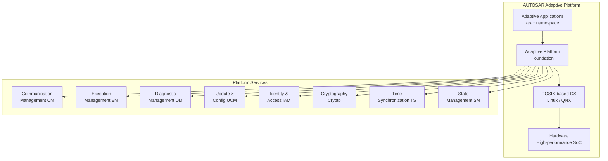
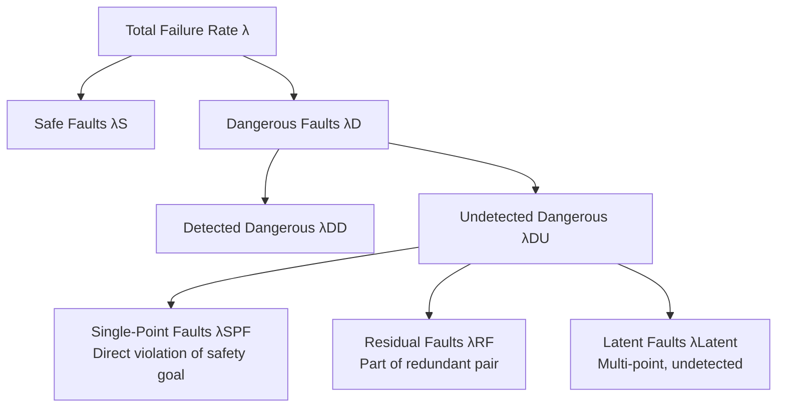
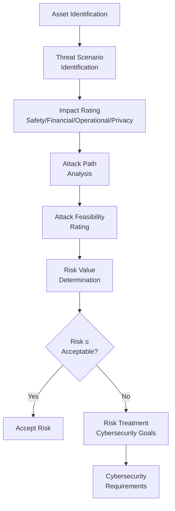
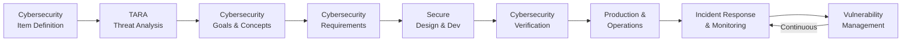
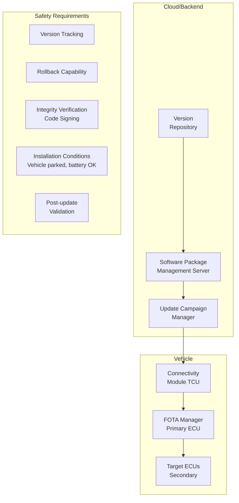
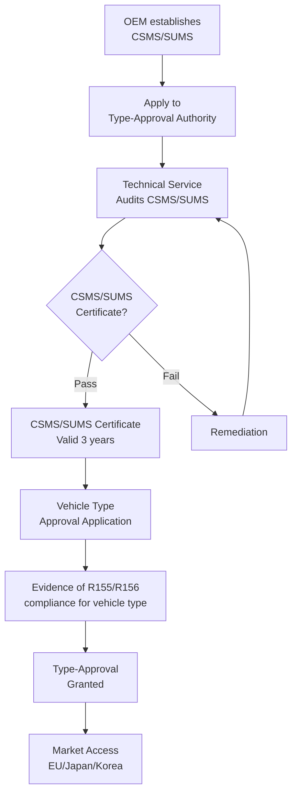
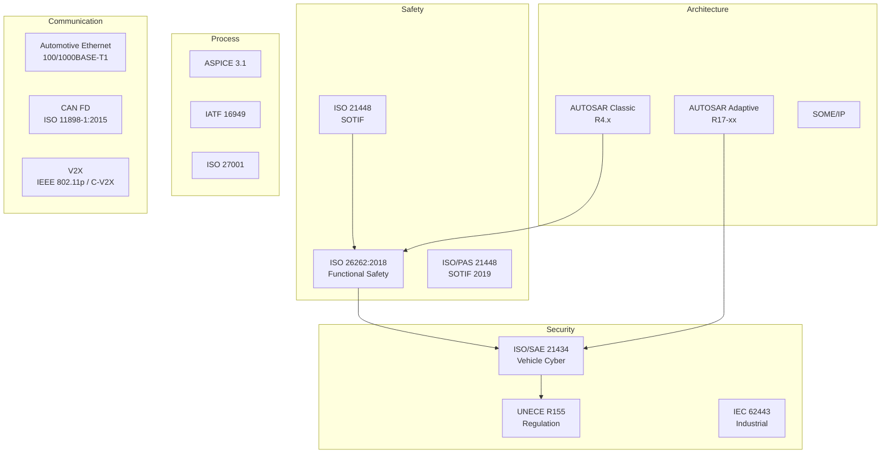
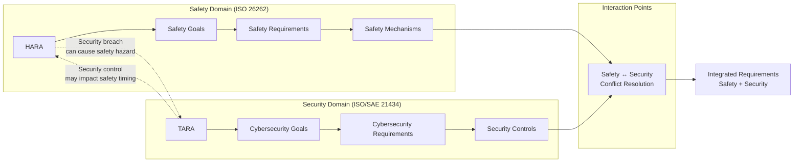
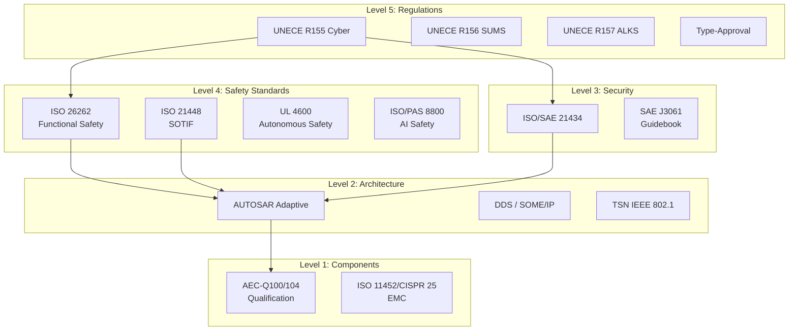

# 2010s Connected Vehicle & Cloud Era — Comprehensive Engineering Guide

**Category:** Standards History & Timeline  
**Period:** 2010–2019  
**Scope:** Connected vehicles, cloud security, ADAS/autonomous driving, Industry 4.0, GDPR  
**Key Standards Published:** ISO 26262:2011/2018, ISO/SAE 21434, UNECE R155/R156, GDPR, AUTOSAR Adaptive  
**Last Updated in this Guide:** 2025

---

## Chapter 1 — Historical Context & Origin Story

### 1.1 The 2010s — Everything Connects

The 2010s represent the era when:
1. **Vehicles became connected** — V2X, OTA updates, cloud services
2. **Autonomous driving** went from research to road (Waymo, Tesla Autopilot)
3. **Cybersecurity** became existential — not just IT but physical safety
4. **Cloud/IoT** created new attack surfaces (billions of connected devices)
5. **Privacy** became a fundamental right (GDPR 2018)
6. **AI/ML** entered safety-critical systems (ADAS perception)

### 1.2 Major Events Driving Standards (2010-2019)

| Year | Event | Standards Impact |
|------|-------|-----------------|
| 2010 | Stuxnet discovered | Industrial cybersecurity awakening (IEC 62443) |
| 2011 | ISO 26262:2011 published | Automotive functional safety formalized |
| 2013 | Snowden revelations | Privacy standards, encryption mandates |
| 2014 | Heartbleed, Shellshock | OSS security awareness |
| 2015 | Jeep Cherokee hack (Miller/Valasek) | Vehicle cybersecurity urgency |
| 2015 | VW Dieselgate | Software integrity, type-approval reform |
| 2016 | Tesla Autopilot fatal crash | SOTIF (ISO 21448) development accelerated |
| 2017 | WannaCry/NotPetya ransomware | Critical infrastructure cyber standards |
| 2017 | Uber ATG pedestrian fatality (2018) | Safety of autonomous driving systems |
| 2018 | GDPR enforced | Privacy-by-design in all systems |
| 2018 | ISO 26262:2018 (2nd edition) | Added semiconductors, motorcycles |
| 2019 | Boeing 737 MAX grounded | Aviation certification reform |
| 2019 | UNECE WP.29 adopts R155/R156 | Vehicle cybersecurity type-approval |

### 1.3 The Jeep Cherokee Hack (2015) — Watershed Moment

**What happened:**
- Researchers Charlie Miller and Chris Valasek remotely hacked a Jeep Cherokee
- Controlled steering, brakes, transmission — from miles away
- Exploited Uconnect infotainment system → CAN bus access
- 1.4 million vehicles recalled
- Demonstrated on a public highway (Wired magazine demonstration)

**Impact:**
- **Direct cause** of ISO/SAE 21434 development
- **Direct cause** of UNECE R155/R156 regulations
- Proved that cybersecurity = safety (remote brake control = life-threatening)
- Auto industry's "Therac-25 moment" for cybersecurity

### 1.4 The Boeing 737 MAX Crisis (2018-2019)

**What happened:**
- Two crashes (Lion Air 610, Ethiopian 302) killed 346 people
- MCAS (Maneuvering Characteristics Augmentation System) based on single AoA sensor
- Pilots not informed/trained on MCAS behavior
- FAA delegated certification to Boeing (Organization Designation Authorization)

**Standards/regulatory impact:**
- FAA Organization Designation Authorization reformed
- EASA increased independence from FAA findings
- Strengthened DO-178C enforcement for all flight-critical software
- Human factors standards enhanced (pilot training requirements)
- System-level hazard analysis scrutiny increased

---

## Chapter 2 — Standard Architecture & Structure

### 2.1 ISO 26262:2018 — 12-Part Structure

The 2018 second edition expanded to **12 parts:**

| Part | Title | New in 2018? |
|------|-------|-------------|
| 1 | Vocabulary | Updated |
| 2 | Management of functional safety | Updated |
| 3 | Concept phase | Updated |
| 4 | Product development: system level | Updated |
| 5 | Product development: hardware level | Updated |
| 6 | Product development: software level | Updated |
| 7 | Production, operation, service, decommissioning | Updated |
| 8 | Supporting processes | Updated |
| 9 | ASIL-oriented and safety-oriented analyses | Updated |
| 10 | Guidelines on ISO 26262 | Updated |
| **11** | **Guidelines on application of ISO 26262 to semiconductors** | **NEW** |
| **12** | **Adaptation of ISO 26262 for motorcycles** | **NEW** |

### 2.2 ISO/SAE 21434 Structure (Published 2021, Developed 2016-2020)

| Section | Content |
|---------|---------|
| Clause 5 | Organizational cybersecurity management |
| Clause 6 | Project-dependent cybersecurity management |
| Clause 7 | Continuous cybersecurity activities |
| Clause 8 | Concept phase (TARA) |
| Clause 9 | Product development |
| Clause 10 | Post-development (production, operation) |
| Clause 11 | Distributed cybersecurity activities (supply chain) |
| Clause 12 | Threat Analysis and Risk Assessment (TARA) |
| Clause 13 | Vulnerability management |
| Clause 14 | Cybersecurity monitoring |
| Clause 15 | Cybersecurity incident response |

### 2.3 AUTOSAR Adaptive Platform (2017)



**Key differences from Classic:**

| Feature | AUTOSAR Classic | AUTOSAR Adaptive |
|---------|----------------|------------------|
| OS | OSEK (static) | POSIX (Linux/QNX) |
| Language | C | C++14/17 |
| Communication | Signal-based (COM) | Service-oriented (SOME/IP, DDS) |
| Scheduling | Static (configured at compile time) | Dynamic (runtime) |
| Memory | Static allocation only | Dynamic allocation permitted |
| Updates | Flash entire ECU | OTA per-application update |
| Use case | Real-time control | ADAS, infotainment, gateway |

### 2.4 UNECE WP.29 Regulations (R155/R156)

**UNECE R155 (Cybersecurity):**
- Mandatory Cybersecurity Management System (CSMS) for OEMs
- Type-approval requires CSMS certificate
- Effective: July 2022 (new types), July 2024 (all types)
- Applies: EU, Japan, Korea (UNECE 1958 Agreement countries)

**UNECE R156 (Software Update Management):**
- Mandatory Software Update Management System (SUMS)
- Safe OTA update capability required
- Version management and rollback required
- Effective: Same timeline as R155

---

## Chapter 3 — Technical Deep Dive

### 3.1 ISO 26262:2018 Part 11 — Semiconductors

**New hardware metrics methodology for semiconductors:**

| Metric | Formula | Target (ASIL D) |
|--------|---------|-----------------|
| SPFM | 1 - λSPF/λ | ≥99% |
| LFM | 1 - λlatent/(λ - λSPF - λRF) | ≥90% |
| PMHF | Σ(λSPF + λRF_undetected) | <10⁻⁸/hr |

**Fault categories for ICs:**



### 3.2 TARA — Threat Analysis and Risk Assessment

**ISO/SAE 21434 Clause 15 TARA method:**



**Attack Feasibility Rating (based on):**
| Parameter | Values |
|-----------|--------|
| Elapsed time | ≤1 day, ≤1 week, ≤1 month, ≤6 months, >6 months |
| Expertise | Layman, Proficient, Expert, Multiple experts |
| Knowledge of item | Public, Restricted, Confidential, Strictly confidential |
| Window of opportunity | Unlimited, Easy, Moderate, Difficult, None |
| Equipment | Standard, Specialized, Bespoke, Multiple bespoke |

### 3.3 SOTIF — Safety of the Intended Functionality (ISO 21448)

**The gap ISO 26262 doesn't cover:**

| Scenario | ISO 26262 Covers? | ISO 21448 Covers? |
|----------|-------------------|-------------------|
| ECU hardware random failure | ✅ Yes | ❌ No |
| Software bug (coding error) | ✅ Yes | ❌ No |
| Sensor misinterprets scene (rain, fog) | ❌ No | ✅ Yes |
| Algorithm limitation (corner case) | ❌ No | ✅ Yes |
| Reasonably foreseeable misuse | ❌ No | ✅ Yes |
| Unknown unsafe scenarios | ❌ No | ✅ Yes (reduce) |

**SOTIF focuses on:**
- Triggering conditions (environmental/usage scenarios)
- Functional insufficiencies (sensor/algorithm limitations)
- Known safe → Known unsafe → Unknown unsafe scenarios
- Verification & validation to minimize "unknown unsafe" area

### 3.4 Automotive Ethernet Standards

| Standard | Layer | Purpose | Speed |
|----------|-------|---------|-------|
| 100BASE-T1 (IEEE 802.3bw) | PHY | Single-pair 100Mb | 100 Mbps |
| 1000BASE-T1 (IEEE 802.3bp) | PHY | Single-pair 1Gb | 1 Gbps |
| 10BASE-T1S (IEEE 802.3cg) | PHY | Multi-drop 10Mb | 10 Mbps |
| TSN (IEEE 802.1) | L2 | Time-Sensitive Networking | — |
| SOME/IP | L5-7 | Service-oriented middleware | — |
| DoIP (ISO 13400) | L5-7 | Diagnostics over IP | — |
| AVB (IEEE 802.1BA) | L2 | Audio/Video bridging | — |

### 3.5 GDPR Technical Requirements

| Requirement | Technical Implementation |
|-------------|--------------------------|
| Data minimization | Collect only what's needed |
| Purpose limitation | Access controls per purpose |
| Storage limitation | Automated deletion policies |
| Integrity & confidentiality | Encryption at rest + transit |
| Right to erasure | Data deletion APIs |
| Data portability | Standard export formats |
| Privacy by design | DPIA (Data Protection Impact Assessment) |
| Breach notification | 72-hour detection + notification |

---

## Chapter 4 — Implementation Guide

### 4.1 Implementing ISO 26262 in a Vehicle Program

**Typical timeline for new vehicle platform:**

| Phase | Duration | Key Activities |
|-------|----------|----------------|
| Concept (Part 3) | 6-12 months | Item definition, HARA, safety goals, FTTI |
| System (Part 4) | 12-18 months | TSR, architecture, system FMEA, HSI |
| HW Development (Part 5) | 18-24 months | FMEDA, safety analysis, DV testing |
| SW Development (Part 6) | 18-24 months | Architecture, coding (MISRA), unit/integration test |
| Integration (Part 4) | 6-12 months | System integration, HIL, safety validation |
| Production (Part 7) | Ongoing | Production testing, field monitoring |

**Total: 3-5 years for a clean-sheet safety-relevant ECU**

### 4.2 Implementing Vehicle Cybersecurity (ISO/SAE 21434)

**Cybersecurity lifecycle parallel to safety:**



### 4.3 OTA Update Architecture (UNECE R156 Compliant)



### 4.4 IEC 62443 — Industrial Cybersecurity Implementation

**Security Levels (SL):**

| SL | Threat | Description |
|----|--------|-------------|
| SL 0 | No specific requirements | No protection needed |
| SL 1 | Casual/coincidental | Protect against unintentional |
| SL 2 | Intentional, low resources | Script kiddies, generic attacks |
| SL 3 | Intentional, sophisticated | Organized groups, specific targeting |
| SL 4 | Intentional, state-sponsored | Nation-state APT |

---

## Chapter 5 — Certification & Audit

### 5.1 ISO 26262 Functional Safety Assessment

**Assessment approaches:**

| Approach | When Used | Who |
|----------|-----------|-----|
| Confirmation review | All ASILs | Project-internal (independent) |
| Functional safety audit | ASIL C, D (recommended) | External assessor |
| Functional safety assessment | ASIL C, D (shall) | Independent organization |

**Assessment focuses on:**
1. Safety plan completeness and execution
2. Hazard and risk assessment correctness
3. Safety concept adequacy
4. Implementation conformance to requirements
5. Verification completeness (test coverage, analysis)
6. Independence and competence of persons

### 5.2 UNECE R155/R156 Type-Approval Process



### 5.3 ISO 27001 Certifications Growth (2010s)

| Year | ISO 27001 Certificates Worldwide |
|------|----------------------------------|
| 2010 | ~20,000 |
| 2013 | ~22,000 |
| 2015 | ~27,500 |
| 2017 | ~40,000 |
| 2019 | ~44,000 |
| 2022 | ~71,000 |

---

## Chapter 6 — Regional & Domain Variants

### 6.1 Cybersecurity Regulation Divergence

| Region | Regulation | Scope | Effective |
|--------|-----------|-------|-----------|
| EU | UNECE R155/R156 | Vehicle cyber | 2022/2024 |
| EU | NIS2 Directive | Critical infrastructure | 2024 |
| EU | Cyber Resilience Act | All connected products | 2027 |
| USA | NHTSA guidance (non-binding) | Vehicle cyber | Voluntary |
| China | GB/T 38628 | Vehicle cyber | 2020 |
| China | Cybersecurity Law | All network products | 2017 |
| Japan | UNECE adoption | Vehicle cyber | 2022/2024 |
| Korea | UNECE adoption | Vehicle cyber | 2022/2024 |
| India | No vehicle cyber regulation yet | — | — |

### 6.2 Privacy Regulation Global Landscape (Post-GDPR)

| Regulation | Region | Year | Key Requirement |
|-----------|--------|------|-----------------|
| GDPR | EU | 2018 | Comprehensive data protection |
| CCPA/CPRA | California | 2020/2023 | Consumer privacy rights |
| LGPD | Brazil | 2020 | Brazilian GDPR equivalent |
| PIPL | China | 2021 | Personal information protection |
| APPI | Japan | 2003/2020 rev | Adequacy with EU |
| DPDP | India | 2023 | Digital personal data protection |
| POPIA | South Africa | 2020 | Protection of personal information |

### 6.3 Autonomous Driving Regulatory Approaches

| Region | Approach | Standard/Regulation | Status (2019) |
|--------|----------|--------------------| --------------|
| USA | Self-certification | SAE J3016, NHTSA guidance | No federal mandate |
| EU | Type-approval | UNECE WP.29 framework | Developing |
| China | National standards | GB/T draft standards | Developing |
| Japan | Regulatory sandbox | SIP-adus program | Testing L3 |
| Germany | StVG amendment | Legal framework for L3/L4 | 2017 law passed |
| Singapore | Road testing framework | Active testing program | Active |

---

## Chapter 7 — Comparison: Connected Vehicle Standards

| Feature | ISO 26262 | ISO/SAE 21434 | ISO 21448 (SOTIF) | UNECE R155 |
|---------|-----------|---------------|-------------------|-----------|
| **Focus** | Random + systematic HW/SW failures | Deliberate attacks | Functional insufficiency | Regulatory requirement |
| **Metric** | ASIL A-D | CAL 1-4 (proposed) | Residual risk | Pass/Fail |
| **Lifecycle** | Concept → decommission | Concept → decommission | Concept → validation | Type-approval + monitoring |
| **Mandatory?** | De facto (OEM requirement) | De facto (OEM) + R155 | Recommended | Legally mandatory (EU/JP/KR) |
| **Certification** | 3rd party assessment | CSMS audit | No formal cert | Type-approval authority |
| **Overlap** | Safety only | Security only | Performance limitations | Security compliance |
| **Interaction** | Feeds into 21434 (safety impact) | Feeds from 26262 (if safety) | Complements 26262 | References 21434 |

---

## Chapter 8 — Mermaid Architecture Diagrams

### 8.1 2010s Standards Ecosystem for Connected Vehicles



### 8.2 Safety-Security Interaction Model



### 8.3 Autonomous Driving Standards Stack



---

## Chapter 9 — Case Studies & Failure Analysis

### 9.1 Jeep Cherokee Remote Hack (2015)

**System:** Fiat Chrysler Uconnect infotainment + CAN gateway

**Attack chain:**
1. Cellular connection (Sprint network) to Uconnect head unit
2. Exploited Uconnect D-Bus service vulnerability
3. Gained root access on head unit (QNX-based)
4. Reflashed CAN gateway firmware via SPI bus
5. Sent arbitrary CAN messages (steering, brakes, transmission)

**Standards violations (if 21434 existed then):**
- No network segregation (infotainment → safety CAN)
- No CAN message authentication
- No intrusion detection
- No secure boot on gateway
- Open cellular ports without firewall

**Result:** 1.4M recall, $105M FTC settlement, ISO/SAE 21434 development accelerated

### 9.2 Tesla Autopilot Fatal Crash (2016)

**System:** Tesla Model S, Autopilot v1 (Mobileye EyeQ3)

**What happened:**
- White semi-truck crossing highway against bright sky
- Camera couldn't distinguish truck from sky (contrast issue)
- Radar classified truck as overhead sign (filtering logic)
- Neither sensor confirmed obstacle → no braking
- Driver was not monitoring (watching movie)

**Standards implications:**
- **ISO 21448 (SOTIF):** Sensor functional insufficiency (exactly this scenario)
- **ISO 26262:** System didn't have a random/systematic failure — it worked as designed
- **Human factors:** Driver monitoring was advisory, not enforced
- **Triggered:** ISO 21448 development, driver monitoring system requirements

### 9.3 VW Dieselgate (2015)

**System:** Volkswagen diesel engine control software

**What happened:**
- ECU software detected emissions test cycle (based on steering angle, speed profile, duration)
- In test mode: full emission controls active (legal compliance)
- In normal driving: emission controls reduced for performance/fuel economy
- 11 million vehicles affected worldwide
- $30B+ in fines, settlements, buybacks

**Standards implications:**
- Not a safety failure — an **integrity** failure
- UNECE type-approval process had no provisions for software fraud detection
- Led to UNECE R156 (software update management — traceability of all SW)
- Led to "defeat device" detection requirements
- Strengthened OBD (On-Board Diagnostics) monitoring requirements

### 9.4 Boeing 737 MAX (2018-2019)

**System:** MCAS (Maneuvering Characteristics Augmentation System)

**Design flaws:**
1. Single AoA sensor input (no redundancy/cross-check)
2. MCAS authority: could command full nose-down trim
3. MCAS could activate repeatedly (pilot override only temporary)
4. Not in pilot training materials (classified as "speed trim" modification)
5. Disagree light (AoA compare) was optional equipment

**Standards violated/weakened:**
- DO-178C software criticality assessment: MCAS should have been DAL A
- ARP 4754A system development: Single sensor for flight-critical = violation
- ARP 4761 safety assessment: Incomplete FTA (didn't cover repeated activation)
- FAA ODA: Boeing assessed its own compliance (conflict of interest)

---

## Chapter 10 — Future Evolution & Industry Trends

### 10.1 2010s Standards Setting Up 2020s Challenges

| 2010s Development | 2020s Challenge |
|------------------|----------------|
| ISO 26262:2018 (2nd ed) | How to apply to AI/ML (non-deterministic) |
| ISO/SAE 21434 | How to keep pace with evolving threats |
| AUTOSAR Adaptive | How to certify service-oriented architecture |
| UNECE R155/R156 | How to maintain compliance with continuous OTA |
| GDPR | How to apply to vehicle data (location, driver monitoring) |
| ISO 21448 (SOTIF) | How to prove absence of unknown unsafe scenarios |

### 10.2 Key Unresolved Issues from the 2010s

1. **AI in safety systems:** No standard adequately addresses non-deterministic ML models
2. **Continuous certification:** Type-approval assumes fixed configuration — OTA breaks this
3. **Supply chain security:** SolarWinds (2020) proved software supply chain is vulnerable
4. **Standard interaction:** Safety + Security + SOTIF = massive combined complexity
5. **Scaling autonomous driving:** L3+ requires new assurance paradigm (simulation?)
6. **Geopolitical divergence:** China creating parallel standards ecosystem

---

## Chapter 11 — Interview Questions & Career Guide

### Tier 1: Entry-Level Questions (0-3 years)

**Q1:** What is ISO/SAE 21434 and how does it relate to ISO 26262?  
**A:** ISO/SAE 21434 is the automotive cybersecurity engineering standard (2021). ISO 26262 covers functional safety (hardware/software failures). 21434 covers deliberate attacks. They interact because a cybersecurity breach can cause a safety hazard (e.g., unauthorized brake command). Both must be addressed together for connected vehicles.

**Q2:** What is SOTIF (ISO 21448) and what gap does it fill?  
**A:** SOTIF addresses "Safety of the Intended Functionality" — scenarios where the system has no malfunction but still behaves unsafely due to sensor/algorithm limitations or misuse. Example: camera fails to detect obstacle in specific lighting. ISO 26262 only covers failures; SOTIF covers performance limitations.

**Q3:** What is AUTOSAR Adaptive and when would you use it instead of Classic?  
**A:** AUTOSAR Adaptive runs on POSIX OS (Linux/QNX), uses C++, service-oriented architecture. Use for: ADAS, autonomous driving, infotainment, gateway — any ECU needing dynamic behavior, high compute, or OTA updates. Classic: use for hard real-time control (powertrain, chassis, body).

### Tier 2: Mid-Level Questions (3-8 years)

**Q4:** Explain the TARA process from ISO/SAE 21434 and how it differs from HARA.  
**A:** TARA (Threat Analysis and Risk Assessment) identifies: assets → threats → impact (S/F/O/P) → attack paths → attack feasibility → risk level → cybersecurity goals. HARA (ISO 26262) identifies: hazardous events → severity × exposure × controllability → ASIL. Key difference: TARA considers intentional attackers with capabilities; HARA considers random/systematic failures with probability.

**Q5:** How do you handle the safety-security conflict (e.g., security update might break safety function)?  
**A:** Establish a joint safety-security analysis process. Safety requires stability (validated configuration). Security requires updates (patch vulnerabilities). Resolution: (1) Security patches undergo safety impact analysis. (2) Define safe update conditions (vehicle parked, fallback mode). (3) Maintain safety case for each software version. (4) Use A/B partition for rollback. ISO 26262 Part 8 + ISO/SAE 21434 Clause 6 address this interaction.

### Tier 3: Senior/Lead Questions (8-15 years)

**Q6:** Design a compliance architecture for a Level 3 autonomous driving system covering ISO 26262, ISO 21448, ISO/SAE 21434, and UNECE R155/R156.  
**A:** (1) Unified item/asset definition for all standards. (2) Combined HARA+TARA+SOTIF analysis identifying all hazardous scenarios. (3) Architecture partitioning: safety-critical perception in ASIL D domain, separate cybersecurity domain, SOTIF monitoring domain. (4) Integrated safety+security requirements with conflict resolution matrix. (5) AUTOSAR Adaptive with hypervisor isolation for mixed-criticality. (6) Continuous monitoring (SOTIF operational phase + cybersecurity SIEM). (7) OTA infrastructure compliant with R156 (version management, rollback, safe conditions). (8) Safety case maintained as living document updated with each OTA.

### Tier 4: Principal/Distinguished (15+ years)

**Q7:** The 2010s created 4 overlapping automotive standards (26262, 21434, 21448, R155/R156). Is this sustainable? How should the standards landscape evolve?  
**A:** Not sustainable — interaction complexity is exponential. Proposed evolution: (1) Merge safety and security into unified "trustworthiness" standard (ISO TR 4804 hints at this). (2) Move to risk-based argumentation (safety case) rather than prescriptive compliance per standard. (3) Machine-readable standards enabling automated compliance checking. (4) Continuous assurance model replacing point-in-time certification. (5) Modular safety/security cases for component reuse. ISO working groups are already discussing harmonization, but political/organizational inertia is strong.

---

## Chapter 12 — Cheat Sheet & Quick Reference

### 2010s Standards Quick Reference

| Standard | Year | Domain | Key Metric | Mandatory? |
|----------|------|--------|-----------|-----------|
| ISO 26262:2018 | 2011/2018 | Auto Safety | ASIL A-D | De facto yes |
| ISO/SAE 21434 | 2021 (dev 2016+) | Auto Cyber | CAL (proposed) | Yes (via R155) |
| ISO 21448 | 2022 (dev 2016+) | SOTIF | Residual risk | Recommended |
| UNECE R155 | 2020 | Cyber regulation | Pass/Fail | Legally mandatory |
| UNECE R156 | 2020 | SW update regulation | Pass/Fail | Legally mandatory |
| AUTOSAR Adaptive | 2017 | Auto SW platform | — | OEM requirement |
| GDPR | 2018 | Privacy | €20M or 4% turnover | Legally mandatory |
| IEC 62443 | 2018 | Industrial cyber | SL 1-4 | Sector-dependent |

### Safety + Security + SOTIF Coverage Map

```
         ┌───────────────────────────────────────┐
         │           ALL VEHICLE HAZARDS           │
         │                                         │
         │  ┌─────────┐  ┌─────────┐  ┌────────┐ │
         │  │ISO 26262 │  │ISO 21448│  │ISO/SAE │ │
         │  │          │  │ (SOTIF) │  │ 21434  │ │
         │  │ HW/SW    │  │Functional│  │Cyber   │ │
         │  │ Failures │  │Insuffic. │  │Attacks │ │
         │  │ Random + │  │Sensor/  │  │Deliber.│ │
         │  │Systematic│  │Algorithm│  │Threats │ │
         │  └─────────┘  └─────────┘  └────────┘ │
         │                                         │
         └───────────────────────────────────────┘
```

### 5-Minute Executive Briefing

> **The 2010s connected vehicles to the internet and exposed them to hackers.** The Jeep Cherokee hack (2015) proved that cybersecurity = safety. The result: UNECE R155/R156 made cybersecurity **legally mandatory** for all new vehicles in Europe, Japan, and Korea from July 2024.
>
> **Triple compliance burden:** OEMs must now simultaneously demonstrate ISO 26262 (safety), ISO/SAE 21434 (cybersecurity), and increasingly ISO 21448 (SOTIF). This triples the compliance workload but addresses all hazard sources for autonomous driving.
>
> **Cost of non-compliance:** No CSMS certificate → no type-approval → no vehicle sales in UNECE countries. This is existential, not optional.
>
> **The GDPR factor:** Vehicles collect location, biometric (driver monitoring), and behavioral data. GDPR applies. Fines: up to 4% of global turnover or €20M.

---

*End of Document — 05_2010s_Connected_Vehicle_Cloud.md*
