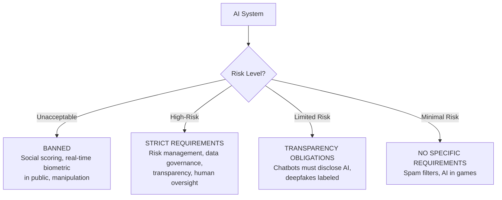
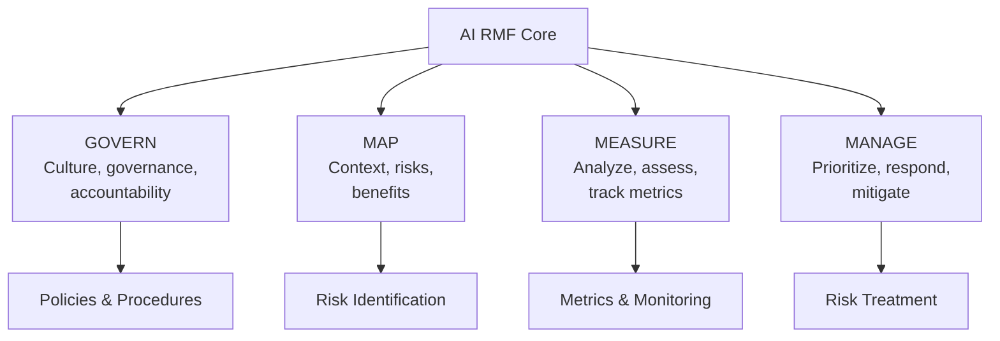
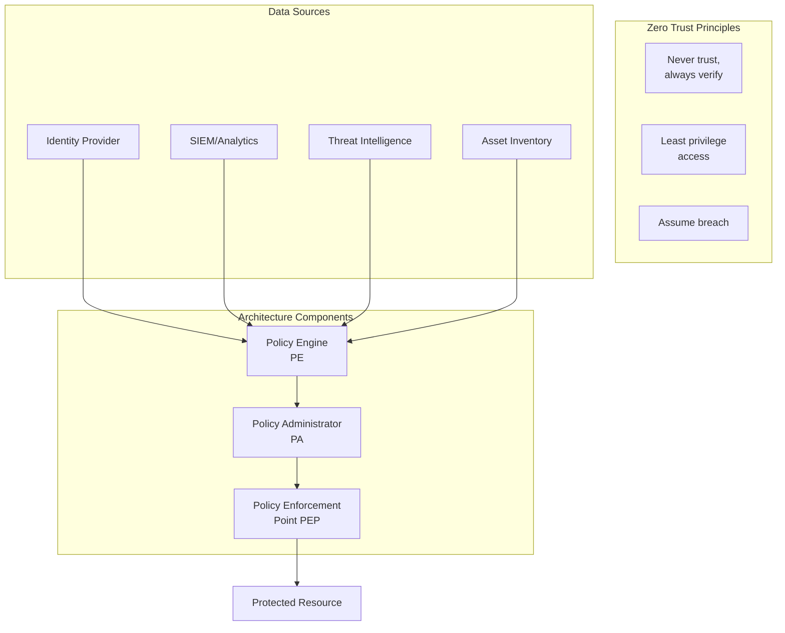
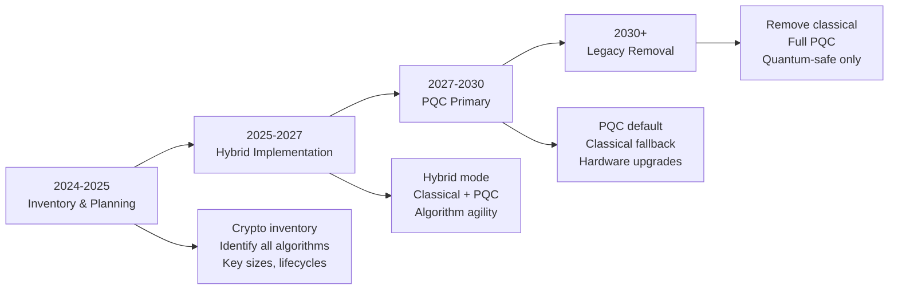
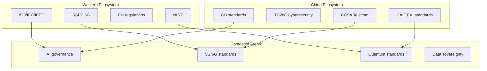
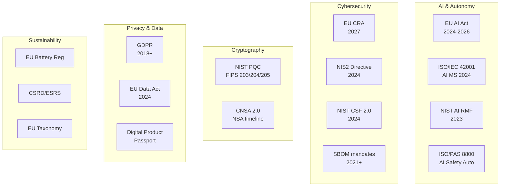
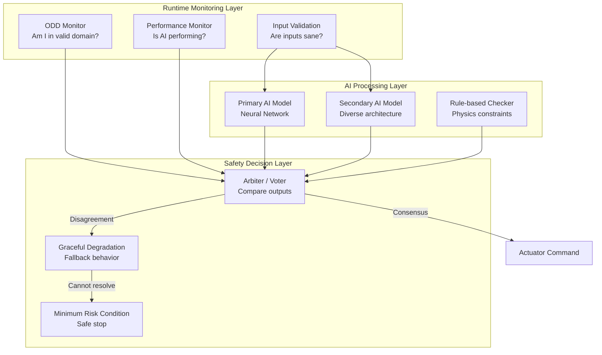
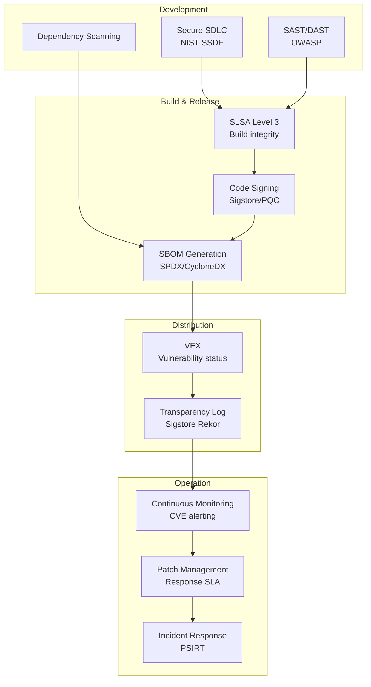

# 2020s AI, Quantum & Geopolitical Era — Comprehensive Engineering Guide

**Category:** Standards History & Timeline  
**Period:** 2020–2029 (current + projected)  
**Scope:** AI governance, post-quantum cryptography, SBOM mandates, geopolitical fragmentation, EU AI Act  
**Key Standards:** ISO/IEC 42001, NIST PQC, EU AI Act, Cyber Resilience Act, ISO/PAS 8800  
**Last Updated in this Guide:** 2025

---

## Chapter 1 — Historical Context & Origin Story

### 1.1 The 2020s — Multiple Paradigm Shifts Simultaneously

The 2020s are unprecedented: **four paradigm shifts hitting simultaneously:**

1. **AI/ML permeates safety-critical systems** — autonomous driving, medical diagnosis, industrial control
2. **Quantum computing threatens all cryptography** — RSA, ECC broken within 10-15 years
3. **Geopolitical decoupling** — US-China tech war, EU digital sovereignty, standards weaponization
4. **Software supply chain attacks** — SolarWinds, Log4Shell prove systemic vulnerability
5. **Sustainability mandates** — Carbon neutrality targets require electronics lifecycle standards

### 1.2 Major Events Driving Standards (2020-2025)

| Year | Event | Standards Impact |
|------|-------|-----------------|
| 2020 | SolarWinds supply chain attack | SBOM mandates (US EO 14028) |
| 2020 | COVID-19 pandemic | Remote work security, telemedicine standards |
| 2021 | US Executive Order 14028 (Cybersecurity) | SBOM, Zero Trust, secure development |
| 2021 | Log4Shell vulnerability | OSS security standards (OpenSSF) |
| 2021 | Colonial Pipeline ransomware | OT/IT convergence security |
| 2022 | ChatGPT released (Nov 2022) | AI governance urgency exploded |
| 2022 | NIST PQC winners announced | Post-quantum migration begins |
| 2023 | EU AI Act adopted | First comprehensive AI regulation |
| 2023 | EU Cyber Resilience Act | CE marking for cybersecurity |
| 2024 | UNECE R155/R156 all vehicles | Vehicle cyber mandatory |
| 2024 | NIST CSF 2.0 published | Updated cybersecurity framework |
| 2024 | ISO/IEC 42001 (AI MS) published | AI management system standard |
| 2025 | EU AI Act provisions take effect | High-risk AI compliance required |

### 1.3 The AI Governance Imperative

**Before ChatGPT (pre-2022):** AI standards were academic exercises  
**After ChatGPT (2023+):** AI governance became the #1 regulatory priority globally

**Timeline of AI standards/regulation:**
```
2019: OECD AI Principles (non-binding)
2020: ISO/IEC TR 24028 (AI Trustworthiness)
2021: EU AI Act proposal (draft)
2022: NIST AI Risk Management Framework (NIST AI RMF)
2023: EU AI Act adopted by Parliament
2023: US Executive Order 14110 (Safe AI)
2024: ISO/IEC 42001 published (AI Management System)
2024: EU AI Act entry into force
2025: EU AI Act — prohibited AI practices enforced
2026: EU AI Act — high-risk AI requirements fully applicable
```

### 1.4 The Post-Quantum Cryptography Transition

**The threat:** A sufficiently powerful quantum computer breaks:
- RSA (all key sizes)
- Elliptic Curve Cryptography (ECC)
- Diffie-Hellman key exchange
- All current digital signatures

**The response (NIST PQC standardization):**

| Standard | Algorithm | Type | Status |
|----------|-----------|------|--------|
| FIPS 203 | ML-KEM (CRYSTALS-Kyber) | Key encapsulation | Published 2024 |
| FIPS 204 | ML-DSA (CRYSTALS-Dilithium) | Digital signature | Published 2024 |
| FIPS 205 | SLH-DSA (SPHINCS+) | Stateless hash signature | Published 2024 |
| FIPS 206 | FN-DSA (FALCON) | Lattice signature | Expected 2025 |

**Migration timeline:** Organizations should begin PQC migration NOW for:
- Long-lived secrets (government classified: 25+ year protection)
- "Harvest now, decrypt later" attacks already occurring
- Hardware with 10-15 year lifecycles (automotive, industrial)

---

## Chapter 2 — Standard Architecture & Structure

### 2.1 EU AI Act — Risk-Based Classification



**High-Risk AI categories (Annex III):**
1. Biometric identification and categorization
2. Critical infrastructure management
3. Education and vocational training
4. Employment, worker management
5. Essential services access (credit scoring, insurance)
6. Law enforcement
7. Migration, asylum, border control
8. Justice and democratic processes

### 2.2 ISO/IEC 42001:2023 — AI Management System

| Clause | Content | Key Requirements |
|--------|---------|-----------------|
| 4 | Context of the organization | AI system inventory, stakeholder needs |
| 5 | Leadership | AI policy, roles, responsibilities |
| 6 | Planning | AI risk assessment, objectives |
| 7 | Support | Resources, competence, awareness |
| 8 | Operation | AI system lifecycle management |
| 9 | Performance evaluation | Monitoring, measurement, audit |
| 10 | Improvement | Nonconformity, corrective action |
| Annex A | AI controls | 38 controls for AI-specific risks |
| Annex B | AI objectives | Implementation guidance |

### 2.3 NIST AI Risk Management Framework (AI RMF 1.0)



### 2.4 Software Bill of Materials (SBOM) Standards

| Standard | Organization | Scope |
|----------|-------------|-------|
| SPDX (ISO/IEC 5962) | Linux Foundation | SBOM format standard |
| CycloneDX | OWASP | SBOM + VEX format |
| SWID Tags (ISO/IEC 19770-2) | ISO | Software identification |
| VEX (CSAF) | OASIS | Vulnerability exploitability |
| OpenSSF Scorecard | OpenSSF | OSS project security posture |
| SLSA (Supply-chain Levels) | Google/OpenSSF | Build integrity framework |

**US EO 14028 mandate:** All software sold to US government must include SBOM.

### 2.5 EU Cyber Resilience Act (CRA)

**Scope:** ALL products with digital elements sold in EU  
**Effective:** ~2027 (3-year transition)

| Requirement | Description |
|-------------|-------------|
| Security by design | Risk assessment, secure defaults |
| Vulnerability handling | Coordinated disclosure, patches for 5+ years |
| SBOM | Machine-readable SBOM for all products |
| CE marking | Cybersecurity part of CE marking |
| Incident reporting | 24h early warning to ENISA for exploited vulns |
| Conformity assessment | Self-assessment or 3rd party (for "critical" products) |

---

## Chapter 3 — Technical Deep Dive

### 3.1 AI Safety for Autonomous Driving (ISO/PAS 8800)

**Addressing the "AI in safety" gap:**

| Challenge | Traditional (ISO 26262) | AI-Specific (ISO/PAS 8800) |
|-----------|------------------------|---------------------------|
| Determinism | System deterministic | System non-deterministic |
| Specification | Complete spec possible | Spec via training data |
| Testing | 100% coverage achievable | Infinite input space |
| Failure mode | Defined safe states | Graceful degradation needed |
| Updates | Rare, validated | Continuous retraining |
| Explanation | Code is readable | "Black box" model |

**Key ISO/PAS 8800 concepts:**
- **Operational Design Domain (ODD)** — where the AI can safely operate
- **Performance metrics** — precision, recall, F1 for perception
- **Data quality** — training data representativeness, bias
- **Monitoring** — runtime ODD boundary detection
- **Triggering conditions** — scenarios that expose AI limitations
- **Safety architecture** — diverse redundancy, fallback layers

### 3.2 Post-Quantum Cryptography Technical Details

**NIST PQC Algorithm Comparison:**

| Algorithm | Type | Public Key Size | Signature/CT Size | Security Basis |
|-----------|------|----------------|-------------------|----------------|
| ML-KEM-768 | KEM | 1,184 bytes | 1,088 bytes | Module LWE |
| ML-KEM-1024 | KEM | 1,568 bytes | 1,568 bytes | Module LWE |
| ML-DSA-65 | Signature | 1,952 bytes | 3,293 bytes | Module LWE |
| ML-DSA-87 | Signature | 2,592 bytes | 4,595 bytes | Module LWE |
| SLH-DSA-128s | Signature | 32 bytes | 7,856 bytes | Hash-based |
| SLH-DSA-256f | Signature | 64 bytes | 49,856 bytes | Hash-based |

**Impact on embedded systems:**
- Key sizes 10-100× larger than ECC
- Signature sizes 10-50× larger
- Computation time varies (some faster, some slower)
- RAM/Flash requirements increase significantly
- Hardware accelerators needed for constrained devices

### 3.3 Zero Trust Architecture (NIST SP 800-207)



### 3.4 Digital Product Passport (EU Battery Regulation & CRA)

From 2027+, physical products in EU must have digital metadata:

| Data Category | Content | Standard |
|---------------|---------|----------|
| Material composition | Bill of materials, substances | EU Battery Regulation |
| Carbon footprint | Lifecycle CO₂ equivalent | ISO 14067 |
| Repairability | Spare parts, repair manuals | EU Ecodesign |
| Recyclability | Recovery rates, hazardous materials | WEEE/RoHS |
| Software components | SBOM | CRA/SPDX |
| Vulnerability status | Known CVEs, patch status | CRA/VEX |
| Compliance certificates | CE marks, test reports | EU harmonized standards |

### 3.5 NIST Cybersecurity Framework 2.0 (2024)

**Six functions (adding GOVERN):**

| Function | Purpose | Key Categories |
|----------|---------|----------------|
| **GOVERN** (NEW) | Cybersecurity strategy and oversight | Context, Strategy, Roles, Policy, Oversight |
| **IDENTIFY** | Asset management, risk assessment | Asset Mgmt, Risk Assessment, Improvement |
| **PROTECT** | Safeguards implementation | Identity Mgmt, Awareness, Data Security |
| **DETECT** | Monitoring and detection | Continuous Monitoring, Analysis |
| **RESPOND** | Incident response | Management, Analysis, Mitigation, Reporting |
| **RECOVER** | Recovery planning and execution | Planning, Communication |

---

## Chapter 4 — Implementation Guide

### 4.1 Implementing AI Governance (ISO/IEC 42001)

**Step-by-step:**

1. **AI System Inventory** — Catalog all AI/ML systems in organization
2. **Risk Assessment** — For each system: identify risks (bias, safety, privacy, security)
3. **Classification** — Map to EU AI Act risk categories if applicable
4. **Controls Selection** — Apply Annex A controls proportional to risk
5. **Data Governance** — Training data quality, representativeness, consent
6. **Model Lifecycle** — Version control, retraining, monitoring
7. **Human Oversight** — Define human-in-the-loop / on-the-loop requirements
8. **Transparency** — Explainability, documentation, user notification
9. **Monitoring** — Performance drift detection, bias monitoring
10. **Incident Response** — AI-specific incident handling (model poisoning, adversarial attacks)

### 4.2 PQC Migration Roadmap



**Priority order for migration:**
1. Long-term secrets (HSM stored keys, document signing) — **NOW**
2. TLS/HTTPS (web servers, APIs) — **2025-2026**
3. VPN/IPsec — **2025-2027**
4. Code signing — **2025-2026**
5. Embedded devices (firmware signing, secure boot) — **2026-2028**
6. IoT/automotive (long-lived devices) — **2025-2027** (design now!)

### 4.3 SBOM Implementation

**Generating SBOM:**
```
Build System → SBOM Generator → SPDX/CycloneDX JSON/XML

Tools:
- Syft (container/filesystem scanning)
- Microsoft SBOM Tool (build integration)
- CycloneDX plugins (Maven, npm, pip, etc.)
- Tern (container analysis)
- FOSSA, Snyk, Black Duck (commercial)
```

**SBOM lifecycle:**

| Phase | Activity | Output |
|-------|----------|--------|
| Build | Generate SBOM from build | SPDX/CycloneDX file |
| Analyze | Check for known vulnerabilities | VEX document |
| Distribute | Ship SBOM with product | Customer delivery |
| Monitor | Continuous CVE monitoring | Alerts on new vulns |
| Respond | Patch, update, or document | Updated SBOM + VEX |

### 4.4 EU AI Act Compliance for High-Risk AI

| Requirement | Implementation |
|-------------|----------------|
| Risk management system | Continuous risk assessment process |
| Data governance | Training data documentation, bias testing |
| Technical documentation | Full system description, design choices |
| Record-keeping | Automated logging of AI decisions |
| Transparency | User-facing information, instructions |
| Human oversight | Meaningful human control mechanisms |
| Accuracy, robustness, cybersecurity | Testing, monitoring, security measures |
| Quality management | QMS covering AI lifecycle |
| Conformity assessment | Self-assessment or 3rd party |
| EU database registration | Register high-risk AI systems |

---

## Chapter 5 — Certification & Audit

### 5.1 Emerging AI Certification Schemes

| Scheme | Organization | Scope | Status |
|--------|-------------|-------|--------|
| ISO/IEC 42001 certification | Accredited CBs | AI Management System | Available 2024+ |
| EU AI Act conformity assessment | Notified Bodies | High-risk AI | From 2025 |
| ALTAI (Assessment List for Trustworthy AI) | EU HLEG | Self-assessment | Available |
| Singapore AI Verify | IMDA | Testing framework | Available |
| IEEE CertifAIEd | IEEE | Ethics certification | Pilot |

### 5.2 EU Cyber Resilience Act Conformity Assessment

| Product Category | Assessment Method | Examples |
|-----------------|-------------------|---------|
| Default | Self-assessment (Module A) | Most IoT, software |
| Important Class I | Harmonized standard (Module A) or 3rd party | Routers, firewalls, OS |
| Important Class II | 3rd party required (Module B+C) | Hypervisors, HSMs, smart cards |
| Critical | EU Cybersecurity Certification (Module H) | Smart meters, industrial control |

### 5.3 Post-Quantum Readiness Assessment

**NIST NCCoE PQC Migration Guide steps:**
1. Discover: cryptographic inventory (algorithms, key sizes, protocols)
2. Assess: prioritize by risk (data sensitivity × lifetime)
3. Plan: migration strategy (hybrid, full replacement)
4. Test: compatibility, performance, interoperability
5. Deploy: phased rollout with fallback
6. Monitor: algorithm health (quantum threat timeline)

---

## Chapter 6 — Regional & Domain Variants

### 6.1 AI Regulation Global Landscape (2025)

| Region | Approach | Status | Key Features |
|--------|----------|--------|-------------|
| **EU** | Risk-based regulation (EU AI Act) | Enforcing 2024-2026 | Strictest: bans, high-risk requirements |
| **USA** | Executive order + sectoral | EO 14110 (2023) | Voluntary, sector-specific, NIST-led |
| **China** | Algorithm governance | Effective 2022+ | Content regulation, algorithm registration |
| **UK** | Pro-innovation, sector regulators | Framework 2023 | No single AI law, regulator-led |
| **Japan** | Soft law, governance guidelines | Guidelines 2024 | Innovation-friendly, voluntary |
| **India** | Sector-specific, emerging | DPDP 2023 + sector rules | AI advisory council formed |
| **Canada** | AIDA (proposed) | In progress | Federal AI law proposed |
| **Singapore** | Model AI Governance Framework | Voluntary 2020+ | Industry self-governance |

### 6.2 Geopolitical Standards Fragmentation



### 6.3 Tech Sovereignty & Standards as Geopolitical Tools

| Action | Actor | Impact |
|--------|-------|--------|
| Entity List (export controls) | USA | China can't access US semiconductor tech |
| Cyber sovereignty (data localization) | China, Russia, India | Forces local data processing |
| Digital Markets Act | EU | Restricts Big Tech platform power |
| CHIPS Act | USA, EU, Japan, India | Semiconductor manufacturing subsidies |
| GB standards divergence | China | Creates parallel standards ecosystem |
| AUKUS tech sharing | US/UK/Australia | Selective standards alignment |

---

## Chapter 7 — Comparison: Emerging vs. Established Standards

| Feature | Established (ISO 26262) | Emerging (EU AI Act) | Emerging (CRA) |
|---------|------------------------|---------------------|-----------------|
| Maturity | 13+ years | <2 years | <1 year |
| Technical depth | Very high (800 pages) | Medium (regulation, not technical standard) | Medium |
| Industry readiness | High (tools, experts exist) | Low (still interpreting) | Very low |
| Certification bodies | Established (TÜV, Exida) | Being designated | Being designated |
| Cost to comply | Known ($200K-$2M) | Unknown (estimated $100K-$5M for high-risk AI) | Unknown |
| Penalties | Market exclusion | €35M or 7% turnover | €15M or 2.5% turnover |
| Expertise available | Moderate pool | Severe shortage | Severe shortage |

---

## Chapter 8 — Mermaid Architecture Diagrams

### 8.1 2020s Standards Landscape



### 8.2 AI System Safety Architecture



### 8.3 Supply Chain Security Standards Stack



---

## Chapter 9 — Case Studies & Failure Analysis

### 9.1 SolarWinds Supply Chain Attack (2020)

**What happened:**
- Russian state actors (SVR) compromised SolarWinds Orion build system
- Malicious code inserted into legitimate software update
- 18,000 organizations installed trojanized update
- US Treasury, DHS, FireEye, Microsoft breached
- Undetected for ~14 months

**Standards response:**
- US EO 14028: SBOM mandatory for government software
- NIST SSDF (Secure Software Development Framework)
- SLSA framework for build integrity
- OpenSSF formed (industry collaboration on OSS security)
- EU CRA: vulnerability handling requirements

### 9.2 Log4Shell (CVE-2021-44228)

**What happened:**
- Critical RCE vulnerability in Apache Log4j (Java logging library)
- Trivially exploitable (single string in log message)
- Present in millions of applications (ubiquitous dependency)
- Many organizations didn't know they used Log4j (no SBOM)

**Standards response:**
- Accelerated SBOM mandate enforcement
- OpenSSF Alpha-Omega project (audit critical OSS)
- EU CRA: 5-year vulnerability support requirement
- CISA SBOM guidance strengthened
- ISO/IEC 18974 (SBOM process standard)

### 9.3 Uber ATG Fatality (2018) & Autonomous Safety Standards

**What happened:**
- Uber self-driving test vehicle struck and killed pedestrian
- Safety driver was distracted (watching phone)
- System detected pedestrian but classified inconsistently
- Emergency braking was disabled (Uber turned it off for comfort)
- No safety case, no systematic safety analysis

**Standards response:**
- UL 4600 (Evaluation of Autonomous Products)
- ISO/PAS 8800 (Safety of AI for autonomous vehicles)
- ISO 21448 (SOTIF) formalization
- SAE J3016 clarification of automation levels
- California/NHTSA autonomous vehicle reporting requirements

### 9.4 ChatGPT & Generative AI Risks (2022+)

**What happened:**
- ChatGPT released November 2022
- Immediate societal impact: misinformation, deepfakes, academic fraud
- Corporate data leakage (employees pasting confidential data)
- Bias and hallucination concerns for critical decisions

**Standards response:**
- EU AI Act (general-purpose AI provisions added)
- ISO/IEC 42001 (AI management system)
- NIST AI RMF (risk management)
- Content provenance (C2PA, watermarking)
- AI-specific cybersecurity (adversarial ML taxonomy: MITRE ATLAS)

---

## Chapter 10 — Future Evolution & Industry Trends

### 10.1 Standards Expected 2025-2030

| Standard | Expected | Domain | Key Innovation |
|----------|----------|--------|----------------|
| ISO 26262 3rd edition | ~2026-2028 | Auto safety | AI/ML integration |
| ISO/SAE 21434 2nd edition | ~2026 | Auto cyber | Improved TARA, supply chain |
| ISO/PAS 8800 → ISO | ~2026-2027 | AI safety (auto) | Formal standard from PAS |
| IEC 61508 4th edition | ~2028-2030 | Functional safety | AI, cybersecurity integration |
| 6G standards (3GPP Rel-20+) | ~2028-2030 | Telecom | AI-native, sensing, THz |
| EU CRA harmonized standards | ~2025-2027 | Product cyber | Technical details |
| Post-quantum TLS (RFC 9xxx) | 2024-2026 | Cryptography | Hybrid key exchange |
| ISO/IEC 27001 next revision | ~2027 | Info security | AI/cloud native |
| AUTOSAR R24-xx | 2024+ | Auto SW | Vehicle computer platform |

### 10.2 Predicted Standards Landscape 2030

```
2030 Standards Ecosystem (Predicted):
├── AI Governance: EU AI Act fully enforced + ISO 42001 mature
├── Cybersecurity: CRA + NIS2 + DORA fully enforced
├── Post-Quantum: PQC algorithms in all new hardware
├── Sustainability: Digital Product Passport mandatory
├── Autonomous: L3/L4 type-approval standards mature
├── Software: SBOM + VEX mandatory for all commercial software
├── Privacy: Global convergence toward GDPR-like frameworks
└── Geopolitical: US/EU/China each have distinct but overlapping ecosystems
```

### 10.3 The "Standards Debt" Problem

Organizations face **cumulative compliance burden:**
- A 2025 automotive OEM must comply with: ISO 26262 + ISO/SAE 21434 + UNECE R155 + R156 + ISO 21448 + ASPICE + IATF 16949 + GDPR + EU AI Act (for ADAS) + MISRA + AUTOSAR + AEC-Q100 + EMC...
- **15+ standards simultaneously**
- Estimated compliance cost: **$5-20M per vehicle program**
- Standards interaction/conflict creates additional complexity
- Talent shortage: not enough certified assessors/engineers globally

---

## Chapter 11 — Interview Questions & Career Guide

### Tier 1: Entry-Level Questions (0-3 years)

**Q1:** What is an SBOM and why is it mandated now?  
**A:** Software Bill of Materials — a formal, machine-readable inventory of all software components (including open source dependencies) in a product. Mandated because supply chain attacks (SolarWinds, Log4Shell) proved organizations couldn't identify affected products. Formats: SPDX (ISO standard), CycloneDX (OWASP).

**Q2:** What is the EU AI Act and what are its risk categories?  
**A:** First comprehensive AI regulation (2024). Four risk levels: Unacceptable (banned — social scoring, real-time biometric mass surveillance), High-risk (strict requirements — safety components, hiring AI, credit scoring), Limited risk (transparency obligations — chatbots, deepfakes), Minimal risk (no requirements — spam filters). Penalties: up to €35M or 7% global turnover.

### Tier 2: Mid-Level Questions (3-8 years)

**Q3:** How do you implement post-quantum crypto migration for an embedded automotive system?  
**A:** (1) Inventory all crypto: secure boot, firmware signing, TLS, V2X certificates. (2) Assess quantum timeline risk (vehicle lifetime 15+ years = high risk). (3) Design crypto-agile architecture (algorithm-independent APIs). (4) Implement hybrid schemes (classical + PQC). (5) Size hardware for PQC (larger keys/signatures need more memory/bandwidth). (6) Update HSM/SE firmware to support PQC algorithms. (7) Plan certificate infrastructure migration (X.509 with PQC signatures).

**Q4:** How does the EU Cyber Resilience Act differ from UNECE R155?  
**A:** R155 is vehicle-specific (OEM type-approval). CRA covers ALL products with digital elements (horizontal regulation). R155 requires CSMS organization-level + vehicle type-level compliance. CRA requires product-level security (CE marking), vulnerability handling (5+ year patch support), SBOM. An automotive ECU will need both: R155 (via OEM CSMS) + CRA (as a product with digital elements).

### Tier 3: Senior/Lead Questions (8-15 years)

**Q5:** Design an AI safety assurance framework for an ADAS perception system that satisfies ISO 26262, ISO 21448, and ISO/PAS 8800.  
**A:** (1) Define ODD precisely (environmental, traffic, infrastructure conditions). (2) Safety analysis: HARA for system failures (26262) + SOTIF analysis for perception limitations (21448) + AI-specific failure modes (8800: adversarial, OOD, drift). (3) Architecture: Diverse perception pipeline (camera CNN + radar signal processing + rule-based physics checks). (4) Runtime monitoring: ODD boundary detection, perception confidence scoring, disagreement detection. (5) Validation: Scenario-based testing (millions of km simulation), corner case generation, field data collection for SOTIF unknown-unsafe reduction. (6) Lifecycle: Model version control, retraining governance, continuous performance monitoring post-deployment.

### Tier 4: Principal/Distinguished (15+ years)

**Q6:** How should the international standards ecosystem restructure to handle the 2020s challenges (AI, quantum, geopolitics, speed)?  
**A:** (1) **Speed:** Adopt "living standard" model (like HTML/WHATWG) for fast-moving areas — continuous update rather than 5-year cycles. (2) **AI:** Create unified "trustworthiness" framework (safety + security + ethics + privacy) rather than separate standards. (3) **Quantum:** Mandate crypto-agility in ALL standards (never hardcode algorithms). (4) **Geopolitics:** Strengthen ISO/IEC/3GPP governance to prevent single-nation capture; create mutual recognition for divergent implementations. (5) **Complexity:** Develop machine-readable standards (formally specified requirements) enabling automated compliance checking. (6) **Talent:** Lower barrier to participation (open access, remote participation, industry funding for emerging-country experts).

---

## Chapter 12 — Cheat Sheet & Quick Reference

### 2020s Regulatory Compliance Calendar

| Date | Regulation | Impact |
|------|-----------|--------|
| July 2022 | UNECE R155/R156 (new types) | New vehicle types need cyber type-approval |
| July 2024 | UNECE R155/R156 (all types) | ALL vehicles need cyber type-approval |
| Feb 2025 | EU AI Act — prohibited practices | Social scoring, some biometrics banned |
| Aug 2025 | EU AI Act — GPAI obligations | General-purpose AI model obligations |
| Aug 2026 | EU AI Act — high-risk AI | Full compliance for high-risk AI |
| 2027 | EU CRA — full application | All connected products must comply |
| Oct 2024 | NIS2 transposition deadline | Critical entities cyber requirements |
| Jan 2025 | DORA (Digital Operational Resilience Act) | Financial sector ICT resilience |

### Key Acronyms (2020s Additions)

| Acronym | Full Form |
|---------|-----------|
| SBOM | Software Bill of Materials |
| VEX | Vulnerability Exploitability eXchange |
| PQC | Post-Quantum Cryptography |
| ML-KEM | Module Lattice Key Encapsulation Mechanism |
| ML-DSA | Module Lattice Digital Signature Algorithm |
| CSMS | Cybersecurity Management System |
| SUMS | Software Update Management System |
| ODD | Operational Design Domain |
| SOTIF | Safety of the Intended Functionality |
| CRA | Cyber Resilience Act |
| NIS2 | Network and Information Security Directive 2 |
| DORA | Digital Operational Resilience Act |
| GPAI | General-Purpose AI |
| SLSA | Supply-chain Levels for Software Artifacts |
| ZTA | Zero Trust Architecture |

### 5-Minute Executive Briefing

> **The 2020s are the most disruptive decade for technology standards since the 1990s.** AI regulation, post-quantum cryptography migration, software supply chain security, and geopolitical fragmentation are all hitting simultaneously.
>
> **Regulatory tsunami:** EU alone is enforcing AI Act, Cyber Resilience Act, NIS2, DORA, GDPR, and Digital Product Passport — each with massive penalties (up to 7% global turnover). Non-EU companies selling in EU must comply.
>
> **Strategic imperative:** Begin PQC migration NOW (harvest-now-decrypt-later is active threat). Implement SBOM generation TODAY (will be mandatory everywhere by 2027). Start AI governance program IMMEDIATELY (EU AI Act high-risk provisions apply August 2026).
>
> **The standards complexity problem:** A single automotive ADAS ECU may need to comply with 15+ standards simultaneously. Organizations need integrated compliance frameworks — managing standards individually is no longer feasible.

---

*End of Document — 06_2020s_AI_Quantum_Geopolitical.md*
