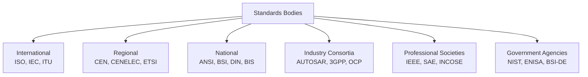
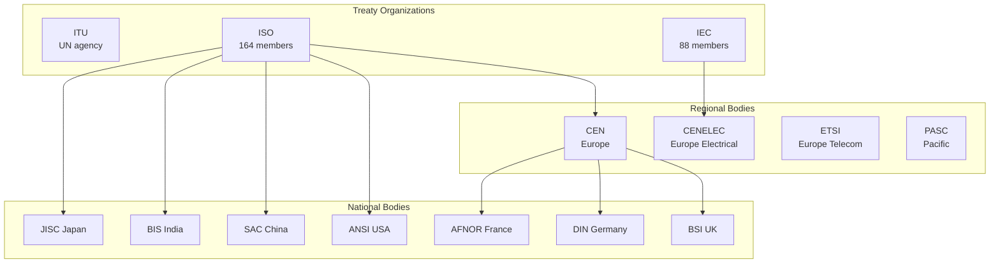
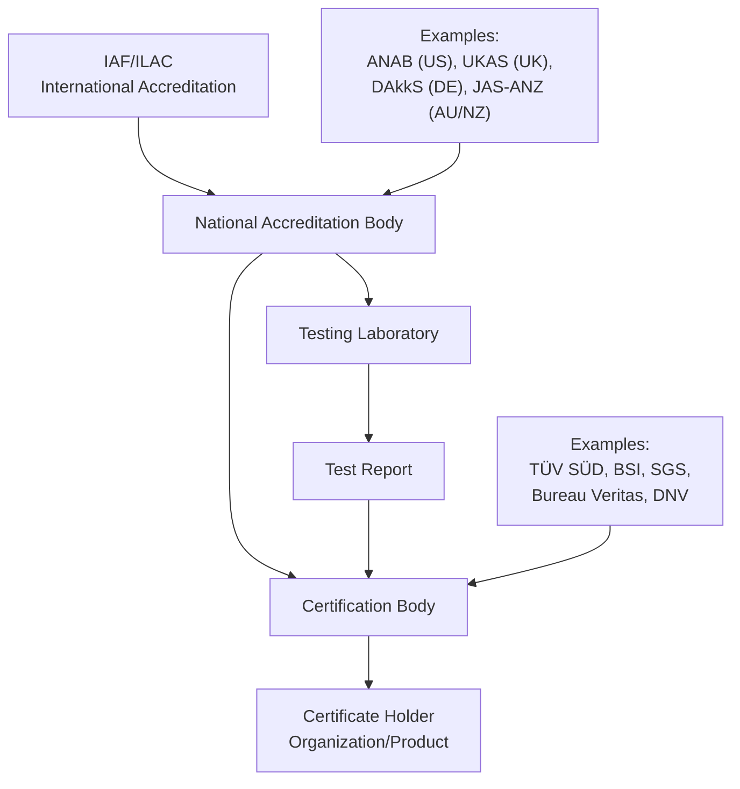
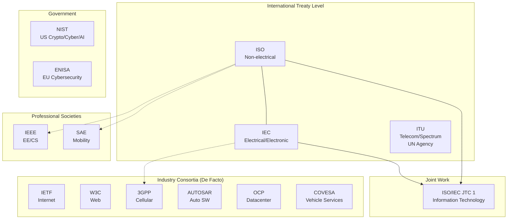
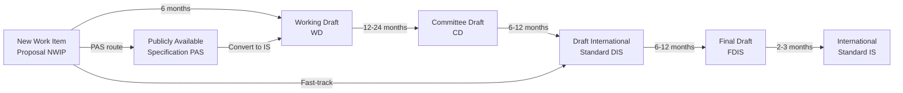
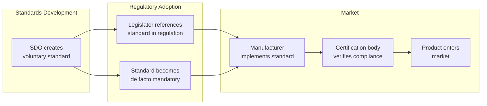

# Standards Development Organizations (SDO) — Comprehensive Engineering Guide

**Category:** Standards History & Timeline  
**Scope:** Complete reference guide to all major SDOs, their governance, processes, and influence  
**Coverage:** ISO, IEC, IEEE, SAE, NIST, 3GPP, JEDEC, ETSI, RTCA, AUTOSAR, and 50+ others  
**Last Updated in this Guide:** 2025

---

## Chapter 1 — Historical Context & Origin Story

### 1.1 Why SDOs Exist

Standards Development Organizations exist because **no single company, government, or individual can create interoperable, safe, global technology standards alone.** SDOs provide:

1. **Neutral governance** — No single entity controls the standard
2. **Expert aggregation** — Brings together global expertise
3. **Consensus process** — Balances competing interests
4. **Legal framework** — Standards carry legal weight when referenced by regulation
5. **Maintenance** — Standards need periodic revision as technology evolves

### 1.2 Types of Standards Bodies



### 1.3 The SDO Landscape in Numbers (2025)

| Metric | Value |
|--------|-------|
| ISO member countries | 169 (167 members + 2 correspondents) |
| Active ISO standards | ~24,700 |
| Active IEC standards | ~11,400 |
| Active IEEE standards | ~4,800 |
| 3GPP specifications | ~8,000+ |
| ISO Technical Committees | 330+ |
| IEC Technical Committees | 110+ |
| People involved in ISO standardization | ~95,000 experts |

---

## Chapter 2 — Standard Architecture & Structure

### 2.1 SDO Hierarchy



### 2.2 How SDOs Collaborate

| Relationship | Description | Example |
|-------------|-------------|---------|
| Joint TC | Two bodies share a committee | ISO/IEC JTC 1 (IT standards) |
| Liaison | Observer/participant status | ISO TC22 ↔ SAE |
| Vienna Agreement | ISO adopts CEN work (and vice versa) | EN = ISO for EU |
| Frankfurt Agreement | IEC adopts CENELEC work | EN = IEC for EU |
| PAS fast-track | Consortium standard → ISO PAS | AUTOSAR → ISO |
| Transposition | National body adopts international | DIN EN ISO 26262 |

---

## Chapter 3 — Technical Deep Dive: Major SDOs

### 3.1 ISO (International Organization for Standardization)

| Attribute | Detail |
|-----------|--------|
| **Founded** | 1947 (Geneva, Switzerland) |
| **Members** | 169 national standards bodies |
| **Scope** | All technologies EXCEPT electrical/electronic (IEC) and telecom (ITU) |
| **Governance** | General Assembly → Council → TMB → TCs |
| **Key domains** | Quality (9001), Safety (26262), Environment (14001), Security (27001) |
| **Revenue model** | Standard sales + membership fees |
| **Standard access** | Paid (CHF 100-500 per standard) |
| **Development time** | 3-7 years (NP → Publication) |

**ISO Technical Committee structure:**
```
ISO → Technical Management Board (TMB)
    → Technical Committee (TC)
        → Subcommittee (SC)
            → Working Group (WG)
                → Task Force / Ad Hoc Group
```

**Key automotive TCs:**
- TC 22: Road vehicles
- TC 22/SC 32: Electrical and electronic components (ISO 26262)
- TC 22/SC 3: Electrical/electronic — legacy (pre-reorg)

### 3.2 IEC (International Electrotechnical Commission)

| Attribute | Detail |
|-----------|--------|
| **Founded** | 1906 (Geneva, Switzerland) |
| **Members** | 88 national committees (+ 87 affiliates) |
| **Scope** | All electrical, electronic, and related technologies |
| **Key domains** | Safety (61508), Power (61850), EMC (61000), Medical (60601) |
| **Special feature** | IECEE CB Scheme (mutual recognition of test reports) |
| **Revenue model** | Standard sales + membership |

**Critical IEC standards for embedded:**
- IEC 61508: Functional Safety (THE base standard)
- IEC 62443: Industrial Cybersecurity
- IEC 62304: Medical device software
- IEC 61000: EMC (electromagnetic compatibility)
- IEC 60601: Medical electrical equipment
- IEC 61850: Power system communication

### 3.3 IEEE (Institute of Electrical and Electronics Engineers)

| Attribute | Detail |
|-----------|--------|
| **Founded** | 1963 (merger of AIEE 1884 + IRE 1912) |
| **Members** | 400,000+ individual members |
| **Scope** | EE, CS, IT, robotics, biomedical |
| **Governance** | Standards Association (SA) Board |
| **Key domains** | Networking (802.x), Power (1547), Software (12207) |
| **Special feature** | Individual membership (not national bodies) |
| **Standard access** | Paid + some free (IEEE Get Program) |

**Key IEEE standards:**
- IEEE 802.3: Ethernet
- IEEE 802.11: WiFi
- IEEE 802.1: Bridging, TSN
- IEEE 1149.1: JTAG boundary scan
- IEEE 1500: Embedded core test
- IEEE 1588: Precision Time Protocol (PTP)
- IEEE 2846: Assumptions for Models for AD safety

### 3.4 SAE International (Society of Automotive Engineers)

| Attribute | Detail |
|-----------|--------|
| **Founded** | 1905 (Warrendale, Pennsylvania) |
| **Members** | 128,000+ professionals |
| **Scope** | Automotive, aerospace, commercial vehicles |
| **Governance** | Technical Standards Board |
| **Key domains** | Auto (J-standards), Aerospace (ARP/AS) |
| **Standard speed** | Faster than ISO (1-3 years typical) |
| **Standard access** | Paid ($50-$150 typical) |

**Key SAE standards:**
- SAE J3016: Levels of Driving Automation (L0-L5)
- SAE J3061: Cybersecurity Guidebook
- SAE J1939: Heavy-duty vehicle CAN
- SAE J2735: V2X message sets
- SAE AS6171: Counterfeit parts avoidance
- ARP 4754A: System development (civil aircraft)
- ARP 4761: Safety assessment methods

### 3.5 NIST (National Institute of Standards and Technology)

| Attribute | Detail |
|-----------|--------|
| **Founded** | 1901 (Gaithersburg, Maryland) |
| **Type** | US government agency (Dept. of Commerce) |
| **Scope** | Measurement science, cybersecurity, AI |
| **Governance** | Federal agency, Congressional oversight |
| **Key domains** | Crypto (FIPS), Cyber (SP 800), AI (AI RMF) |
| **Special feature** | Free access to all publications |
| **Unique role** | Sets US government standards; influences global practice |

**Key NIST publications:**
- FIPS 140-3: Cryptographic module validation
- FIPS 197: AES (Advanced Encryption Standard)
- FIPS 203/204/205: Post-quantum crypto
- SP 800-53: Security and Privacy Controls
- SP 800-171: CUI protection
- SP 800-207: Zero Trust Architecture
- NIST CSF: Cybersecurity Framework
- NIST AI RMF: AI Risk Management Framework

### 3.6 3GPP (3rd Generation Partnership Project)

| Attribute | Detail |
|-----------|--------|
| **Founded** | 1998 |
| **Type** | Partnership of regional telecom SDOs |
| **Members** | ETSI, ARIB, ATIS, CCSA, TTA, TSDSI, TTC |
| **Scope** | Cellular communication (3G/4G/5G/6G) |
| **Output** | Technical Specifications (TS) + Technical Reports (TR) |
| **Release cycle** | ~18 months per major release |

**3GPP Release history:**
| Release | Year | Generation | Key Feature |
|---------|------|-----------|-------------|
| Rel-99 | 2000 | 3G (UMTS) | WCDMA |
| Rel-8 | 2009 | 4G (LTE) | OFDMA |
| Rel-15 | 2019 | 5G NR | mmWave, eMBB |
| Rel-16 | 2020 | 5G | URLLC, V2X |
| Rel-17 | 2022 | 5G Advanced | NTN, RedCap |
| Rel-18 | 2024 | 5G-Advanced | AI/ML, XR |
| Rel-19 | 2025 | 5G-Advanced | — |
| Rel-20 | ~2027 | 6G (expected) | — |

### 3.7 JEDEC (Joint Electron Device Engineering Council)

| Attribute | Detail |
|-----------|--------|
| **Founded** | 1958 (Arlington, Virginia) |
| **Type** | Industry trade association |
| **Scope** | Semiconductor engineering standards |
| **Members** | ~300 companies |
| **Key domains** | Memory (DDR), reliability (JESD47), packaging |

**Key JEDEC standards:**
- JESD79: DDR SDRAM standards (DDR4, DDR5)
- JESD209: LPDDR (mobile memory)
- JESD220: UFS (Universal Flash Storage)
- JESD22: Reliability test methods
- JESD47: Stress-test-driven qualification
- JEP155: Reliability qualification for CMOS
- JESD51: Thermal measurement methods

### 3.8 AUTOSAR (AUTomotive Open System ARchitecture)

| Attribute | Detail |
|-----------|--------|
| **Founded** | 2003 |
| **Type** | Industry consortium (development partnership) |
| **Core members** | BMW, Bosch, Continental, Daimler, Ford, GM, PSA, Toyota, VW |
| **Scope** | Automotive ECU software architecture |
| **Output** | Specifications (SWS, RS), methodology, tools |
| **Platforms** | Classic Platform (CP), Adaptive Platform (AP), AUTOSAR FO (Foundation) |

### 3.9 RTCA (Radio Technical Commission for Aeronautics)

| Attribute | Detail |
|-----------|--------|
| **Founded** | 1935 (Washington DC) |
| **Type** | Non-profit advisory committee |
| **Scope** | Avionics equipment standards |
| **Key output** | DO documents (DO-178C, DO-254, DO-326A) |
| **Relationship** | RTCA DO = EUROCAE ED (equivalent documents) |

**Key RTCA documents:**
| DO Document | ED Equivalent | Subject |
|-------------|---------------|---------|
| DO-178C | ED-12C | Airborne software |
| DO-254 | ED-80 | Airborne hardware |
| DO-326A | ED-202A | Airworthiness security |
| DO-160G | ED-14G | Environmental conditions and test |
| DO-278A | ED-109A | Ground-based software |

---

## Chapter 4 — Implementation Guide

### 4.1 How to Participate in Standards Development

**For engineers:**
1. Identify relevant TC/WG through your national body
2. Get company approval and funding (travel, time)
3. Apply through national body mirror committee
4. Attend meetings (typically 2-4 per year, hybrid)
5. Contribute to working drafts (technical input)
6. Vote on committee drafts (via national body)

**For companies:**
1. Join relevant consortium (AUTOSAR, 3GPP) or national body
2. Identify strategic standards (future competitive advantage)
3. Assign dedicated engineers (not part-time)
4. Develop positions before meetings (internal alignment)
5. Build alliances with like-minded companies
6. Consider contributing IP (FRAND licensing)

### 4.2 Standards Participation Cost

| Activity | Annual Cost | Time Investment |
|----------|-------------|-----------------|
| National body mirror committee | $5K-$20K | 10-20 days/year |
| ISO/IEC TC membership (via national body) | $10K-$50K | 20-40 days/year |
| AUTOSAR core member | €200K-€500K/year | 2-5 FTE |
| 3GPP participation | $50K-$200K | 20-60 days/year |
| IEEE working group | $5K-$15K | 10-20 days/year |
| SAE committee | $10K-$30K | 10-20 days/year |

### 4.3 Strategic Value of Standards Participation

| Benefit | Description |
|---------|-------------|
| **Early knowledge** | Know requirements 3-5 years before publication |
| **Influence** | Shape standards to match your architecture |
| **IP positioning** | Declare essential patents for licensing revenue |
| **Competitive intelligence** | Understand competitor approaches |
| **Customer relationships** | Work alongside OEMs/customers |
| **Talent development** | Engineers gain deep expertise |
| **Market access** | Participation prevents being standardized out |

---

## Chapter 5 — Certification & Audit

### 5.1 Accreditation System



### 5.2 National Accreditation Bodies

| Country | Body | Accredits |
|---------|------|-----------|
| USA | ANAB | ISO CBs, labs |
| UK | UKAS | All CBs, labs |
| Germany | DAkkS | All CBs, labs |
| France | COFRAC | All CBs, labs |
| Japan | JAB | QMS/EMS CBs |
| India | NABL/QCI | Labs/CBs |
| China | CNAS | All CBs, labs |
| Australia/NZ | JAS-ANZ | CBs |
| Korea | KOLAS/KAB | Labs/CBs |

### 5.3 IECEE CB Scheme

**The most important mutual recognition scheme for electronics:**
- 54 participating countries
- Test report done in one country = accepted in all others
- Covers: safety (60950/62368), EMC (61000), medical (60601)
- Saves manufacturers from repeated testing per country

---

## Chapter 6 — Regional & Domain Variants

### 6.1 SDO Influence by Region

| Region | Dominant SDOs | Regulatory Model |
|--------|--------------|-----------------|
| **EU** | CEN/CENELEC/ETSI + ISO/IEC | New Legislative Framework (CE marking) |
| **USA** | ANSI + IEEE + NIST + SAE | Market-driven + sector regulation |
| **China** | SAC + MIIT + CCSA | Government-controlled (GB = mandatory) |
| **Japan** | JISC + ARIB/TTC + JAMA | Government guidance + industry self-regulation |
| **Korea** | KATS + TTA + KS | Government-led with industry input |
| **India** | BIS + TRAI + ARAI | Government mandatory + emerging global alignment |

### 6.2 Regional Standards Bodies Comparison

| Feature | CEN/CENELEC (EU) | ANSI (USA) | SAC (China) | BIS (India) |
|---------|-------------------|------------|-------------|-------------|
| **Type** | Regional (34 countries) | National coordinator | National (government) | National (government) |
| **Relationship to ISO** | Vienna/Frankfurt Agreement | US ISO member | China ISO member | India ISO member |
| **Mandatory standards** | EN (if in OJ) | Voluntary (mostly) | GB (many mandatory) | BIS-marked (electronics) |
| **Access cost** | Paid | Paid | Mixed (some free) | Paid (low cost) |
| **Speed** | Moderate (EU process) | Fast (ANSI accreditation) | Fast (government directive) | Moderate |

---

## Chapter 7 — Comparison: Major SDOs

| Feature | ISO | IEC | IEEE | SAE | NIST | 3GPP | JEDEC |
|---------|-----|-----|------|-----|------|------|-------|
| **Founded** | 1947 | 1906 | 1963 | 1905 | 1901 | 1998 | 1958 |
| **Type** | International | International | Professional | Professional | Government | Partnership | Industry |
| **Members** | Nations | Nations | Individuals | Individuals | N/A | Regional SDOs | Companies |
| **Scope** | Broad | Electrical | EE/CS | Mobility | US (global influence) | Cellular | Semiconductor |
| **Standards** | 24,700 | 11,400 | 4,800 | 10,000+ | 500+ SP/FIPS | 8,000+ TS | 3,000+ |
| **Access** | Paid | Paid | Paid/Free | Paid | Free | Free | Member only |
| **Speed** | Slow | Slow | Medium | Fast | Fast | Medium | Medium |
| **IP policy** | Patent-free preferred | FRAND | RAND | FRAND | N/A | FRAND | FRAND |

---

## Chapter 8 — Mermaid Architecture Diagrams

### 8.1 Global SDO Ecosystem Map



### 8.2 Standard Development Process (ISO)



### 8.3 How SDOs Feed Into Regulations



---

## Chapter 9 — Case Studies & Failure Analysis

### 9.1 The DVD Forum vs. Blu-ray Disc Association (Format War)

**What happened:** Two competing industry consortia created incompatible optical disc standards.
- DVD Forum (Toshiba, NEC, Microsoft): HD DVD
- Blu-ray Disc Association (Sony, Panasonic, Samsung): Blu-ray

**Result:** Market chose Blu-ray (2008). HD DVD abandoned.

**Lesson:** Competing consortia waste billions. Unified SDOs prevent format wars. (But competition also drove innovation faster than a single committee might have.)

### 9.2 WAPI vs. WiFi (China vs. International)

**What happened:** China proposed WAPI (WLAN Authentication and Privacy Infrastructure) as alternative to IEEE 802.11i for WLAN security. China tried to make it mandatory domestically and submit to ISO.

**Result:** ISO rejected China's fast-track proposal (2006). China withdrew mandate. WiFi (802.11) dominates globally.

**Lesson:** Standards can be used as trade barriers. International SDO governance prevents single-nation capture (usually). But the incident increased China's push for GB standards independence.

### 9.3 USB-C: Successful Universal Standard

**What happened:** USB-IF created USB Type-C connector (2014) as universal connector.
- Replaces: USB-A, USB-B, Micro-USB, Mini-USB, Lightning, barrel jacks
- EU mandated USB-C for all devices (2024)
- Supports: Data, power (240W), video (DisplayPort/HDMI alt mode)

**Lesson:** When SDOs create genuinely superior standards, regulations follow. USB-C is the rare example of a single standard replacing many — possible because USB-IF is a strong, well-governed consortium with major industry backing.

---

## Chapter 10 — Future Evolution & Industry Trends

### 10.1 Challenges Facing SDOs (2025+)

| Challenge | Description | Impact |
|-----------|-------------|--------|
| **Speed** | Technology moves faster than consensus | AI standards lag AI deployment |
| **Geopolitics** | China/Russia creating parallel ecosystems | Standards fragmentation |
| **Complexity** | Products need 10-15 standards simultaneously | Interaction conflicts |
| **Access** | Paid standards limit adoption in developing nations | Digital divide |
| **IP conflicts** | Standard-essential patents create licensing battles | Delays and litigation |
| **Expertise shortage** | Aging expert base, insufficient new entrants | Committee capacity |
| **Relevance** | Open source / de facto standards bypass SDOs | Reduced influence |

### 10.2 Emerging SDO Models

| Model | Description | Example |
|-------|-------------|---------|
| **Living standard** | Continuously updated (no versions) | WHATWG HTML |
| **Open specification** | Consortium-driven, free access | OpenAPI, GraphQL |
| **Government-led** | Agency publishes, industry implements | NIST frameworks |
| **Regulation-driven** | Standard created to satisfy regulation | EU AI Act → ISO 42001 |
| **AI-assisted** | Using AI to write/review/test standards | Experimental (ISO exploring) |

### 10.3 The Machine-Readable Standards Vision

Future standards may be:
- **Formally specified** (mathematical, not just English prose)
- **Executable** (run compliance check automatically)
- **Modular** (compose from reusable requirement patterns)
- **Version-controlled** (Git-like change management)
- **API-accessible** (integrate into development tools)

---

## Chapter 11 — Interview Questions & Career Guide

### Tier 1: Entry-Level Questions (0-3 years)

**Q1:** What is the difference between ISO and IEC?  
**A:** ISO covers all technologies except electrical/electronic (which is IEC) and telecom (which is ITU). They share ISO/IEC JTC 1 for IT standards. Both are international, consensus-based, member-driven organizations based in Geneva. In practice, many standards are joint (ISO/IEC 27001).

**Q2:** Who publishes automotive safety standards?  
**A:** ISO Technical Committee 22 (Road Vehicles), specifically SC 32 for electrical/electronic. Published as ISO 26262. SAE publishes complementary recommended practices (J3016, J3061). AUTOSAR is a separate consortium for software architecture. UNECE WP.29 creates regulations (R155, R156).

### Tier 2: Mid-Level Questions (3-8 years)

**Q3:** Explain FRAND licensing and why it matters for standards.  
**A:** Fair, Reasonable, And Non-Discriminatory licensing means patent holders whose patents are essential to implementing a standard must license them on fair terms to all implementers. Without FRAND, a company could block all competitors from implementing the standard. Critical for 3GPP (cellular), WiFi (IEEE 802.11), and other widely-implemented standards. Disputes (Qualcomm, InterDigital) show FRAND valuation is still contentious.

**Q4:** How does a standard get referenced in EU regulation?  
**A:** (1) EU Commission issues mandate to CEN/CENELEC/ETSI. (2) SDO creates harmonized European Standard (EN). (3) Reference published in Official Journal of the EU. (4) Compliance with EN = presumption of conformity with regulation. (5) Manufacturer can use EN or prove conformity by other means. This "New Approach" separates regulation (essential requirements) from technical detail (standards).

### Tier 3: Senior/Lead Questions (8-15 years)

**Q5:** Your company wants to influence the next edition of ISO 26262. How would you approach this strategically?  
**A:** (1) Join national mirror committee (e.g., ANSI TAG to ISO TC22/SC32 in US, or DIN equivalent in Germany). (2) Identify key changes needed based on implementation experience. (3) Submit contributions (technical papers with rationale and proposed text). (4) Build coalition with like-minded companies. (5) Propose New Work Items or amendments through national body. (6) Assign dedicated expert(s) to attend WG meetings consistently. (7) Leverage industry position paper (e.g., through ZVEI, SAE, etc.). Timeline: 5-7 years from contribution to published standard.

### Tier 4: Principal/Distinguished (15+ years)

**Q6:** How should the SDO ecosystem restructure for the 2030s?  
**A:** (1) Merge overlapping work: ISO 26262 + ISO/SAE 21434 + ISO 21448 should become integrated "vehicle trustworthiness" standard. (2) Speed up: Adopt PAS/TS fast-track for emerging tech (AI, quantum), full IS for mature domains. (3) Open access: Standards should be free to read (funded by participation/certification fees). (4) Machine-readable: Requirements as formal specifications, not just English text. (5) Modular: Reusable requirement patterns composable across domains. (6) Inclusive: Lower barriers for developing nations and SMEs to participate.

---

## Chapter 12 — Cheat Sheet & Quick Reference

### SDO Quick Lookup (By Domain)

| Domain | Primary SDO | Key Standard |
|--------|------------|--------------|
| Automotive safety | ISO TC22 | ISO 26262 |
| Automotive cyber | ISO/SAE | ISO/SAE 21434 |
| Auto software arch | AUTOSAR | AUTOSAR CP/AP |
| Auto quality | IATF | IATF 16949 |
| Auto process | VDA QMC/iNTACS | ASPICE |
| Avionics | RTCA/EUROCAE | DO-178C / ED-12C |
| Functional safety | IEC TC65 | IEC 61508 |
| Industrial cyber | IEC TC65 | IEC 62443 |
| Medical device | IEC TC62 | IEC 62304, 60601 |
| Semiconductor qual | AEC/JEDEC | AEC-Q100, JESD47 |
| Info security | ISO/IEC JTC1/SC27 | ISO 27001 |
| Cryptography | NIST | FIPS 140-3 |
| AI governance | ISO/IEC JTC1/SC42 | ISO/IEC 42001 |
| Cellular telecom | 3GPP | 3GPP Rel-18 (5G-Adv) |
| WiFi/Ethernet | IEEE 802 | 802.11, 802.3 |
| EMC | IEC TC77/CISPR | IEC 61000, CISPR 25 |
| Environmental | ISO TC207 | ISO 14001 |
| Privacy | ISO/IEC JTC1/SC27 | ISO 27701 |
| Systems engineering | ISO TC 258 / INCOSE | ISO 15288 |
| Software process | ISO/IEC JTC1/SC7 | ISO 12207 |

### How to Access Standards

| Source | Access Model | Coverage |
|--------|-------------|----------|
| ISO Store (iso.org) | Paid per document | All ISO |
| IEC Webstore | Paid per document | All IEC |
| IEEE Xplore | Subscription or per document | All IEEE |
| SAE MOBILUS | Subscription | All SAE |
| NIST.gov | **Free** | All NIST SP/FIPS |
| 3GPP.org | **Free** | All 3GPP specs |
| IETF/RFC | **Free** | All RFCs |
| AUTOSAR | **Free** (registration) | All AUTOSAR specs |
| JEDEC | Member access (some free) | JEDEC standards |
| EVS (Estonian) | **Free viewing** | Many ISO/IEC standards |

### 5-Minute Executive Briefing

> **Standards Development Organizations are the invisible infrastructure of global trade.** Without ISO/IEC/IEEE standards, products couldn't interoperate across borders, safety couldn't be assured, and trade barriers would fragment every market.
>
> **Strategic participation:** Companies that participate in SDOs shape the rules others must follow. An annual investment of $50K-$500K in standards participation can yield millions in competitive advantage (early knowledge, IP licensing, architecture alignment).
>
> **The speed challenge:** ISO/IEC's 5-7 year cycle is too slow for AI and cybersecurity. Expect more PAS/TS documents (published in 1-2 years) and living standards for fast-moving domains.
>
> **Geopolitical warning:** China's push for independent GB standards and participation in ISO/IEC could fragment the global standards system. Companies must monitor and participate to prevent being standardized out of markets.

---

*End of Document — 07_Standards_Development_Organizations.md*
