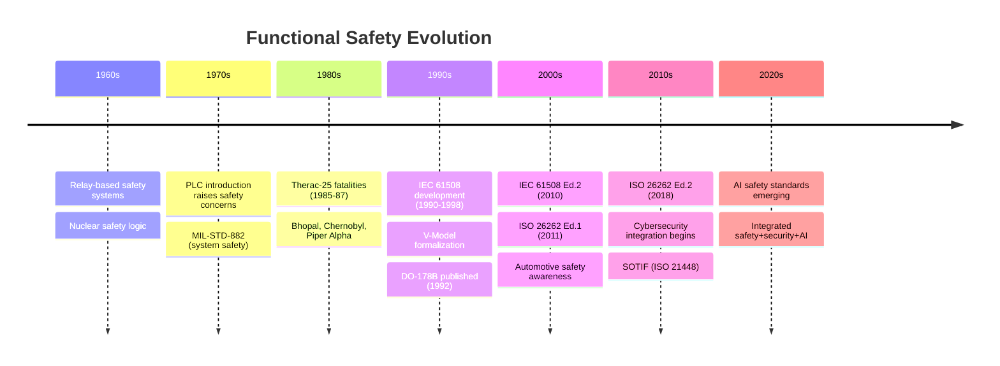
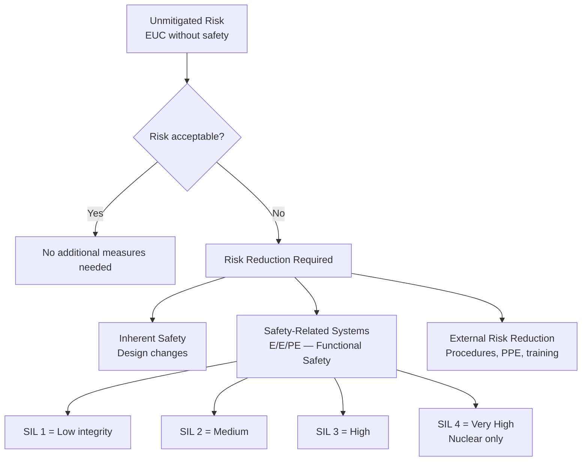
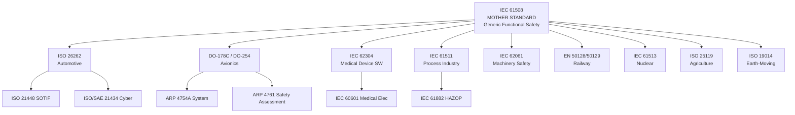
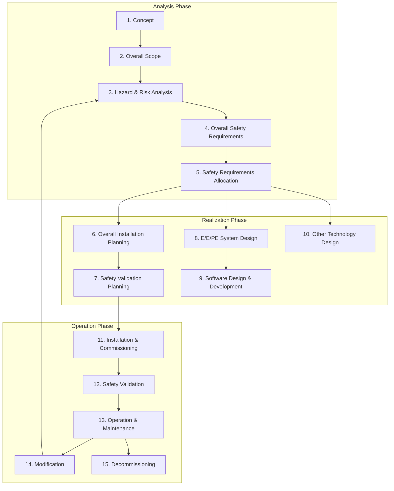
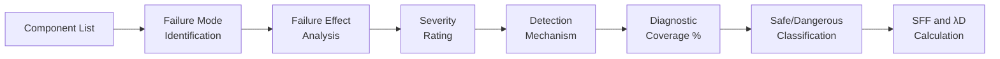
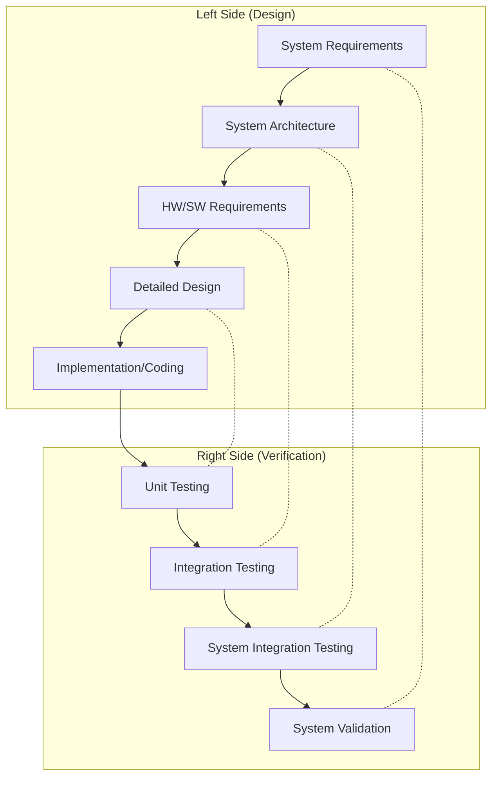
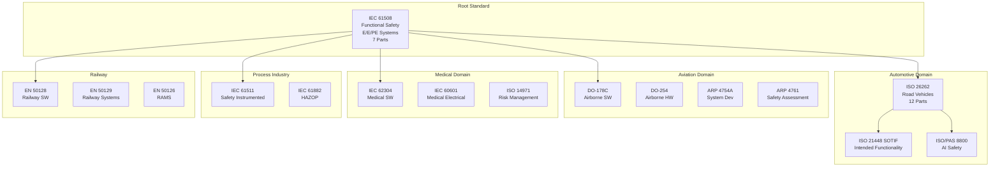
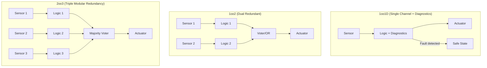
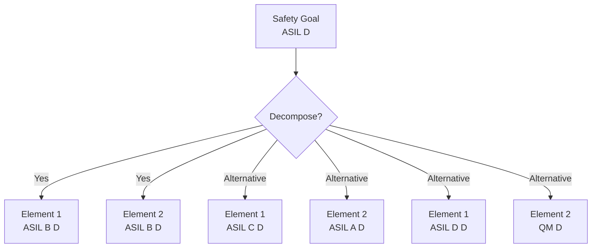

# Functional Safety — Complete Architecture & Landscape Overview

**Category:** 01 — Functional Safety  
**Document:** 00 — Domain Overview and Architecture  
**Scope:** Full landscape of functional safety standards across all industries  
**Key Standards:** IEC 61508, ISO 26262, DO-178C, IEC 62304, IEC 61511, EN 50128  
**Audience:** Safety engineers, system architects, quality managers, certification engineers  
**Prerequisites:** Basic understanding of embedded systems and systems engineering

---

## Chapter 1 — Historical Context & Origin Story

### 1.1 What is Functional Safety?

**Functional safety** is the part of overall safety that depends on the **correct functioning of safety-related electrical/electronic/programmable electronic (E/E/PE) systems.** It ensures that automated systems do not cause unacceptable risk.

**Formal definition (IEC 61508):**
> "Freedom from unacceptable risk of physical injury or of damage to the health of people, either directly, or indirectly as a result of damage to property or to the environment"

**Key distinction:**
- **Safety** = absence of unacceptable risk (overall)
- **Functional safety** = safety achieved through automatic/electronic safety functions
- **Inherent safety** = safety through physics/mechanical design (not functional safety)

### 1.2 The Evolution of Functional Safety



### 1.3 Landmark Accidents That Drove Standards

| Year | Accident | Deaths | Standard Impact |
|------|----------|--------|-----------------|
| 1985-87 | Therac-25 radiation overdose | 6 | Software safety requirements |
| 1984 | Bhopal gas leak | 3,787+ | IEC 61511 (process industry) |
| 1986 | Chernobyl nuclear disaster | 4,000+ | IEC 61513 (nuclear) |
| 1988 | Piper Alpha oil platform | 167 | IEC 61508 development started |
| 1996 | Ariane 5 Flight 501 | 0 (satellite) | Reuse safety analysis |
| 2009 | Air France AF447 | 228 | DO-178C upgrades |
| 2009-10 | Toyota unintended acceleration | 89+ | ISO 26262 urgency |
| 2018 | Boeing 737 MAX (Lion Air) | 346 | DO-178C/ARP4754A scrutiny |
| 2018 | Uber ATG pedestrian fatality | 1 | SOTIF, UL 4600, ISO/PAS 8800 |

### 1.4 The Risk Reduction Concept



---

## Chapter 2 — Standard Architecture & Structure

### 2.1 The IEC 61508 Family Tree



### 2.2 Safety Integrity Level (SIL) Concept

**IEC 61508 SIL Definitions (continuous mode):**

| SIL | PFH (Probability of Dangerous Failure per Hour) | Risk Reduction Factor |
|-----|--------------------------------------------------|----------------------|
| SIL 1 | ≥ 10⁻⁶ to < 10⁻⁵ | 10-100× |
| SIL 2 | ≥ 10⁻⁷ to < 10⁻⁶ | 100-1,000× |
| SIL 3 | ≥ 10⁻⁸ to < 10⁻⁷ | 1,000-10,000× |
| SIL 4 | ≥ 10⁻⁹ to < 10⁻⁸ | 10,000-100,000× |

**IEC 61508 SIL (low demand mode — PFDavg):**

| SIL | PFDavg (Probability of Failure on Demand average) |
|-----|---------------------------------------------------|
| SIL 1 | ≥ 10⁻² to < 10⁻¹ |
| SIL 2 | ≥ 10⁻³ to < 10⁻² |
| SIL 3 | ≥ 10⁻⁴ to < 10⁻³ |
| SIL 4 | ≥ 10⁻⁵ to < 10⁻⁴ |

### 2.3 Domain-Specific Integrity Level Mapping

| Domain | Integrity Scale | Levels | Approximate SIL Equivalence |
|--------|----------------|--------|---------------------------|
| Generic (IEC 61508) | SIL | 1-4 | — (baseline) |
| Automotive (ISO 26262) | ASIL | QM, A, B, C, D | QM≈<SIL1, A≈SIL1, B≈SIL2, C≈SIL2-3, D≈SIL3 |
| Avionics (DO-178C) | DAL | E, D, C, B, A | E≈0, D≈SIL1, C≈SIL2, B≈SIL3, A≈SIL4 |
| Railway (EN 50129) | SIL | 0-4 | Same scale |
| Medical (IEC 62304) | SW Safety Class | A, B, C | A≈0, B≈SIL1-2, C≈SIL3 |
| Process (IEC 61511) | SIL | 1-4 | Same (but SIL4 not for SIS) |

### 2.4 Functional Safety Lifecycle (IEC 61508)



---

## Chapter 3 — Technical Deep Dive

### 3.1 Hardware Architectural Metrics

**Key metrics for hardware safety integrity:**

| Metric | Definition | SIL 1 | SIL 2 | SIL 3 | SIL 4 |
|--------|-----------|-------|-------|-------|-------|
| **SFF** (Safe Failure Fraction) | Proportion of failures that are safe | ≥60% (Type A) | ≥90% (Type A) | ≥99% (Type A) | — |
| **HFT** (Hardware Fault Tolerance) | # of faults before dangerous | 0 | 0-1 | 1-2 | 2 |
| **DC** (Diagnostic Coverage) | % of dangerous failures detected | 60-90% | 90-99% | 99-99.9% | 99.9%+ |
| **λD** (Dangerous failure rate) | Dangerous failures per hour | 10⁻⁵ | 10⁻⁶ | 10⁻⁷ | 10⁻⁸ |

### 3.2 FMEA/FMEDA Process



**Failure classifications:**
- **λS** — Safe failures (detected or not, no dangerous effect)
- **λDD** — Dangerous detected (safety mechanism catches it)
- **λDU** — Dangerous undetected (worst case — contributes to PFH)

$$SFF = \frac{\lambda_S + \lambda_{DD}}{\lambda_S + \lambda_{DD} + \lambda_{DU}}$$

$$DC = \frac{\lambda_{DD}}{\lambda_{DD} + \lambda_{DU}}$$

### 3.3 V-Model in Functional Safety



### 3.4 Systematic vs. Random Hardware Failures

| Aspect | Systematic Failures | Random Hardware Failures |
|--------|-------------------|------------------------|
| **Cause** | Design/process errors | Physical degradation |
| **Occurrence** | Deterministic (given trigger) | Probabilistic |
| **Prevention** | Process requirements (SIL) | Architecture (redundancy, diagnostics) |
| **Quantification** | Cannot be quantified (process-based) | λ rates from reliability data |
| **Example** | Software bug, specification error | Transistor wear-out, cosmic ray |
| **Standard approach** | Techniques & measures tables | SFF, HFT, PFH calculation |

### 3.5 Independence in Safety Assessment

| Standard | Assessor Independence Requirements |
|----------|-------------------------------------|
| IEC 61508 SIL 1 | Same team (self-assessment) OK |
| IEC 61508 SIL 2 | Different person in same team |
| IEC 61508 SIL 3 | Independent department or external |
| IEC 61508 SIL 4 | External independent organization |
| ISO 26262 ASIL A/B | Internal person different from developer |
| ISO 26262 ASIL C/D | Independent department or external |
| DO-178C DAL A-C | DER (Designated Engineering Representative) oversight |

---

## Chapter 4 — Implementation Guide

### 4.1 Starting a Functional Safety Project

**Phase 1 — Organization Setup:**
1. Appoint Safety Manager / FSM (Functional Safety Manager)
2. Establish safety culture (management commitment)
3. Define safety lifecycle tailoring for your domain
4. Set up tool qualification strategy
5. Establish competence requirements and training program

**Phase 2 — System Analysis:**
1. Define Item Definition / system scope
2. Perform HARA (Hazard Analysis and Risk Assessment)
3. Assign safety goals (SIL/ASIL/DAL targets)
4. Develop Functional Safety Concept
5. Allocate safety requirements to subsystems

**Phase 3 — Design & Development:**
1. System architecture design (with safety mechanisms)
2. Hardware design with FMEDA
3. Software development per required SIL techniques
4. Integration and testing per plan

**Phase 4 — Validation & Operation:**
1. Safety validation (does it achieve safety goals?)
2. Functional safety assessment (by independent party)
3. Approval/release
4. Operation, maintenance, modification management

### 4.2 Key Deliverables by Phase

| Phase | Key Work Products |
|-------|------------------|
| Concept | Item Definition, HARA, Safety Goals |
| System | FSC, TSC, System Architecture |
| Hardware | HW Safety Requirements, FMEDA, DFA |
| Software | SW Safety Requirements, Architecture, Code, Tests |
| Validation | Safety Validation Report |
| Assessment | Functional Safety Assessment Report |
| Production | Production and Service Plan |
| Operation | Maintenance Plan, Modification Procedures |

### 4.3 Selecting the Right Techniques

**IEC 61508 Part 3 — Software techniques by SIL:**

| Technique | SIL 1 | SIL 2 | SIL 3 | SIL 4 |
|-----------|-------|-------|-------|-------|
| Formal methods | — | R | HR | HR |
| Structured programming | HR | HR | HR | HR |
| Defensive programming | R | HR | HR | HR |
| MISRA coding standard | R | HR | HR | HR |
| Static analysis | R | HR | HR | HR |
| Dynamic analysis/testing | R | HR | HR | HR |
| Modified condition/decision coverage (MC/DC) | — | R | HR | HR |
| Code review/inspection | R | HR | HR | HR |
| Equivalence classes & boundary value testing | R | HR | HR | HR |

**Legend:** HR = Highly Recommended, R = Recommended, — = No recommendation

---

## Chapter 5 — Certification & Audit

### 5.1 Functional Safety Certification Bodies

| Certification Body | Headquarters | Specialization |
|-------------------|--------------|----------------|
| TÜV SÜD | Munich, Germany | Automotive, industrial, railway |
| TÜV Rheinland | Cologne, Germany | Automotive, industrial, medical |
| TÜV NORD | Hanover, Germany | Railway, process industry |
| Exida | Sellersville, PA, USA | Process industry, industrial |
| UL (Underwriters Labs) | Northbrook, IL, USA | Consumer, industrial, automotive |
| SGS | Geneva, Switzerland | Multi-industry |
| DNV | Høvik, Norway | Maritime, energy, healthcare |
| Bureau Veritas | Paris, France | Multi-industry |
| DEKRA | Stuttgart, Germany | Automotive |
| DER/ODA | FAA/EASA designated | Avionics |

### 5.2 Assessment Types

| Assessment | Scope | When | Standard |
|------------|-------|------|----------|
| Functional Safety Assessment (FSA) | Overall project | End of project | IEC 61508 |
| Confirmation Review | Safety lifecycle phase | Per phase | ISO 26262 |
| Safety Audit | Process compliance | Periodic | IEC 61508 |
| Tool Qualification | Development tools | Tool selection | ISO 26262 Part 8 |
| Hardware Assessment | HW metrics/architecture | Design phase | ISO 26262 Part 5 |
| Software Assessment | SW process/products | Development | ISO 26262 Part 6 |

### 5.3 Common Assessment Findings

| Finding Category | Typical Issue | Resolution |
|-----------------|---------------|------------|
| Incomplete HARA | Missing hazards or scenarios | Re-analyze with HAZOP/FMEA |
| Insufficient DC | Safety mechanisms don't cover all failures | Add diagnostics or redesign |
| Missing traceability | Requirements → tests gaps | Update requirements management |
| Tool qualification lacking | Using unqualified tools | Qualify or validate tool output |
| Competence gaps | Staff not formally trained | Training + documented competence |
| DFA insufficient | Dependent failure analysis incomplete | Re-analyze common cause failures |

---

## Chapter 6 — Regional & Domain Variants

### 6.1 Industry-Specific Safety Standards

| Industry | Standard | Integrity Levels | Unique Features |
|----------|----------|-----------------|-----------------|
| Automotive | ISO 26262 | ASIL QM-D | ASIL decomposition, confirmation measures |
| Avionics | DO-178C/DO-254 | DAL A-E | Certification credit, SOI, DER |
| Railway | EN 50128/50129 | SIL 0-4 | Safety case driven, CENELEC lifecycle |
| Medical | IEC 62304 | Class A/B/C | Software only, pairs with 60601 |
| Process | IEC 61511 | SIL 1-3 | SIF-specific, proof test intervals |
| Nuclear | IEC 61513 | Cat A/B/C | Most stringent, defense-in-depth |
| Machinery | IEC 62061 | SIL 1-3 | PL (Performance Level) alternative |
| Agriculture | ISO 25119 | AgPL a-e | Mapped from 61508, outdoor specific |
| Earth-moving | ISO 19014 | MPL a-e | Mobile machinery specific |
| Marine | IEC 61162 | — | Navigation safety |
| Space | ECSS-Q-ST-80 | Criticality levels | Radiation, single-event effects |

### 6.2 Regional Regulatory Framework

| Region | Regulation | Safety Standard Referenced |
|--------|-----------|--------------------------|
| EU | Machinery Directive 2006/42/EC | IEC 62061, ISO 13849 |
| EU | Medical Device Regulation (MDR) | IEC 62304, IEC 60601 |
| EU | ATEX Directive 2014/34/EU | IEC 60079, 61508 |
| USA | OSHA 29 CFR 1910 | No specific FuSa (performance-based) |
| USA | FDA 21 CFR 820 | IEC 62304 (guidance) |
| USA | FAR 25.1309 | DO-178C, DO-254, ARP 4754A |
| China | GB/T 20438 | = IEC 61508 (translated) |
| Japan | MHLW guidelines | IEC 61508/62304 aligned |
| International | UNECE R79, R13-H | ISO 26262 implied |

---

## Chapter 7 — Comparison: Safety Standards Across Industries

| Feature | IEC 61508 | ISO 26262 | DO-178C | IEC 62304 | EN 50128 |
|---------|-----------|-----------|---------|-----------|----------|
| **Industry** | Generic | Automotive | Avionics | Medical SW | Railway SW |
| **Integrity** | SIL 1-4 | ASIL QM-D | DAL E-A | Class A-C | SIL 0-4 |
| **Approach** | Prescriptive | Prescriptive | Objective-based | Prescriptive | Prescriptive |
| **HW + SW** | Both | Both | Separate (178C+254) | SW only | SW only |
| **Size (pages)** | ~700 (7 parts) | ~800 (12 parts) | ~300 | ~80 | ~200 |
| **Cert body** | TÜV, Exida | TÜV, DEKRA | DER/ODA | Notified Body | NoBo/ISA |
| **Cost** | $500K-$5M | $200K-$2M | $1M-$10M | $100K-$500K | $500K-$3M |
| **Duration** | 2-5 years | 2-4 years | 3-7 years | 1-3 years | 3-5 years |
| **MC/DC required** | SIL 4 | ASIL D | DAL A/B | Not explicit | SIL 3-4 |

---

## Chapter 8 — Mermaid Architecture Diagrams

### 8.1 Functional Safety Standards Family



### 8.2 Safety Architecture Patterns



### 8.3 ASIL Decomposition (ISO 26262)



**Decomposition rules (ISO 26262):**
- ASIL D → ASIL D(D) + QM(D), or ASIL C(D) + ASIL A(D), or ASIL B(D) + ASIL B(D)
- ASIL C → ASIL C(C) + QM(C), or ASIL B(C) + ASIL A(C)
- ASIL B → ASIL B(B) + QM(B), or ASIL A(B) + ASIL A(B)
- Independence between decomposed elements MUST be demonstrated

---

## Chapter 9 — Case Studies & Failure Analysis

### 9.1 Therac-25 (1985-87) — The Case That Started It All

**System:** Radiation therapy machine  
**Failure:** Software race condition caused lethal radiation overdose  
**Deaths:** 6 patients (several more injured)

**Root causes:**
- No hardware safety interlocks (software-only protection)
- Reused software from Therac-20 without re-analysis
- No independent safety review
- No formal hazard analysis

**Standards impact:** Led to AECL reforms, IEC 62304, and the principle that **software alone cannot be trusted for safety** without rigorous process.

### 9.2 Toyota Unintended Acceleration (2009-10)

**System:** Engine Throttle Control System (ETCS)  
**Failure:** Multiple software defects in safety-critical throttle control  
**Deaths:** 89+ attributed

**Key findings (NASA/Barr Group expert analysis):**
- 10,000+ global variables
- Stack overflow vulnerability
- No MISRA-C compliance
- Insufficient fail-safe mechanisms
- Single point of failure in task scheduling

**Standards impact:** Massively accelerated ISO 26262 adoption. Demonstrated that automotive software safety was inadequate without formal functional safety processes.

### 9.3 Boeing 737 MAX MCAS (2018-19)

**System:** Maneuvering Characteristics Augmentation System (MCAS)  
**Failure:** Single AoA sensor → MCAS trim → unrecoverable dive  
**Deaths:** 346 (Lion Air 610 + Ethiopian 302)

**Root causes:**
- Single sensor input (no redundancy for MCAS)
- Inadequate system safety analysis (hazard classified too low)
- Pilot training insufficient for new behavior
- Organizational pressure to avoid new type certificate
- FAA delegation issues (DER oversight)

**Standards impact:** FAA reform, new DO-178C/ARP4754A scrutiny for system-level hazard classification, and renewed emphasis on common-cause analysis and organizational independence.

---

## Chapter 10 — Future Evolution & Industry Trends

### 10.1 Key Trends in Functional Safety (2025-2030)

| Trend | Impact | Timeline |
|-------|--------|----------|
| **AI/ML in safety functions** | New methods beyond V-model | ISO/PAS 8800 → ISO 2026+ |
| **Safety + Security integration** | Joint analysis, shared architecture | ISO 26262 Ed.3 + 21434 alignment |
| **Continuous safety (OTA)** | Post-deployment safety case | UNECE R156, ISO 24089 |
| **Model-based safety** | MBSE for hazard analysis/FTA/FMEA | Tool vendor-driven |
| **Agile + Safety** | SAFe for safety-critical | Automotive industry adoption |
| **Cloud-native safety** | Safety functions in cloud | ISO 26262 extension needed |
| **Formal verification mainstream** | Proofs instead of testing | SIL 3-4/ASIL D/DAL A |

### 10.2 Emerging Safety Concepts

| Concept | Description | Standard |
|---------|-------------|----------|
| **SOTIF** | Safety despite correct function (performance limits) | ISO 21448 |
| **RSS/SFF** | Mathematical safety models for AD | Mobileye RSS / NVIDIA SFF |
| **Safety Cage** | Runtime monitor constrains AI behavior | Research → ISO/PAS 8800 |
| **Operational Domain** | Where system can safely operate | ISO 34503 |
| **Dynamic Safety Case** | Safety case updated at runtime | Research |
| **Digital Twin Safety** | Simulate hazards in virtual environment | Research |

---

## Chapter 11 — Interview Questions & Career Guide

### Tier 1: Entry-Level (0-3 years)

**Q1:** What is the difference between SIL and ASIL?  
**A:** SIL (Safety Integrity Level) is from IEC 61508 — has levels 1-4, used in process, industrial, railway. ASIL (Automotive Safety Integrity Level) is from ISO 26262 — has levels QM, A, B, C, D. Both represent required integrity of safety function but have different derivation methods (SIL uses risk graph or layers of protection, ASIL uses exposure/severity/controllability). Approximate mapping: ASIL D ≈ SIL 3.

**Q2:** What is the V-Model and why is it used in functional safety?  
**A:** V-Model maps design phases (left side: requirements → architecture → detailed design → code) to verification phases (right side: unit test → integration test → system test → validation). Each left-side phase has a corresponding right-side verification activity. Used in FuSa because it ensures traceability from requirements to tests and mandates verification at each abstraction level.

### Tier 2: Mid-Level (3-8 years)

**Q3:** Explain ASIL decomposition with an example.  
**A:** ASIL decomposition splits a safety requirement's integrity across redundant elements. Example: Brake-by-wire ASIL D safety goal can be decomposed into: (1) Primary brake controller ASIL B(D) + (2) Secondary/monitoring controller ASIL B(D). Both must be sufficiently independent (no common-cause failures). The (D) suffix indicates the original goal was ASIL D. Decomposition requires demonstration of independence (different hardware, software, team, tools).

**Q4:** What is Diagnostic Coverage (DC) and how is it calculated?  
**A:** DC measures the percentage of dangerous hardware failures detected by safety mechanisms. DC = λDD / (λDD + λDU). For example: if an ADC has λD = 100 FIT and a plausibility check detects 80 FIT worth of dangerous failures, DC = 80%. ISO 26262 defines DC tiers: None (<60%), Low (60-90%), Medium (90-99%), High (≥99%).

### Tier 3: Senior/Lead (8-15 years)

**Q5:** Design a safety architecture for an ASIL D steer-by-wire system.  
**A:** Architecture: (1) Dual diverse processors (e.g., Arm Cortex-R + lockstep) each computing steering angle. (2) Cross-comparison of outputs (disagreement → fallback). (3) Diverse sensor paths (dual absolute encoders, different technology). (4) Watchdog/supervisor monitoring both channels. (5) Mechanical column lock as minimal risk condition if both electronic paths fail. (6) ASIL D decomposed as ASIL B(D) per channel with demonstrated independence. Independence evidence: different silicon vendors, different SW teams, different compilers, no shared memory/bus for safety-critical paths. Metrics: prove λDU meets SPFM ≥99%, LFM ≥90% per ISO 26262 Part 5.

### Tier 4: Principal/Distinguished (15+ years)

**Q6:** How would you architect functional safety for an L4 autonomous vehicle with AI-based perception?  
**A:** Multi-layer approach: (1) **Perception safety cage:** Rule-based physics constraints that override AI outputs (object can't teleport, road geometry validation). (2) **Diverse sensing:** Camera AI + Radar classical + LiDAR — independent modality disagreement triggers degradation. (3) **ODD monitoring:** Separate module monitors if vehicle is within operational design domain (weather, road type, geo-fence). (4) **Dynamic safety case:** Safety argument adapts based on operational conditions, sensor health. (5) **Graceful degradation chain:** Full autonomy → restricted ODD → minimal risk maneuver → safe stop. (6) **Conformance to:** ISO 26262 (E/E/PE failures), ISO 21448 (performance limitations), ISO/PAS 8800 (AI-specific), ISO/SAE 21434 (security threats). (7) **Validation:** Scenario-based testing (100M+ miles simulated), operational fleet data collection, continuous safety metric monitoring.

---

## Chapter 12 — Cheat Sheet & Quick Reference

### Functional Safety Decision Tree

```
Is the system E/E/PE? ──No──► Not functional safety (structural safety)
        │
       Yes
        │
Does failure cause harm? ──No──► No safety requirement (QM)
        │
       Yes
        │
Determine integrity level (SIL/ASIL/DAL) via risk assessment
        │
Select domain standard:
├── Automotive ──► ISO 26262
├── Avionics ──► DO-178C + DO-254
├── Medical ──► IEC 62304
├── Process ──► IEC 61511
├── Railway ──► EN 50128/50129
├── Machinery ──► IEC 62061
├── Nuclear ──► IEC 61513
└── Other ──► IEC 61508
```

### Key Acronyms

| Acronym | Full Form |
|---------|-----------|
| ASIL | Automotive Safety Integrity Level |
| CCF | Common Cause Failure |
| DC | Diagnostic Coverage |
| DFA | Dependent Failure Analysis |
| FMEA | Failure Mode and Effects Analysis |
| FMEDA | FMEA for Diagnostic Analysis |
| FSC | Functional Safety Concept |
| FSM | Functional Safety Manager |
| FTA | Fault Tree Analysis |
| HARA | Hazard Analysis and Risk Assessment |
| HFT | Hardware Fault Tolerance |
| LFM | Latent Fault Metric |
| MPFDI | Multiple Point Fault Detection Interval |
| PFDavg | Average Probability of Failure on Demand |
| PFH | Probability of Dangerous Failure per Hour |
| SFF | Safe Failure Fraction |
| SIF | Safety Instrumented Function |
| SIL | Safety Integrity Level |
| SOTIF | Safety of the Intended Functionality |
| SPFM | Single Point Fault Metric |
| TSC | Technical Safety Concept |

### Formula Quick Reference

$$SPFM = 1 - \frac{\sum \lambda_{SPF}}{\sum \lambda_{total}} \geq 99\% \text{ (ASIL D)}$$

$$LFM = 1 - \frac{\sum \lambda_{latent}}{\sum \lambda_{total} - \sum \lambda_{SPF}} \geq 90\% \text{ (ASIL D)}$$

$$PMHF = \sum \lambda_{residual} + \sum \lambda_{DPF} \leq 10^{-8}/h \text{ (ASIL D)}$$

---

*End of Document — 00_FuSa_Overview_Architecture.md*
