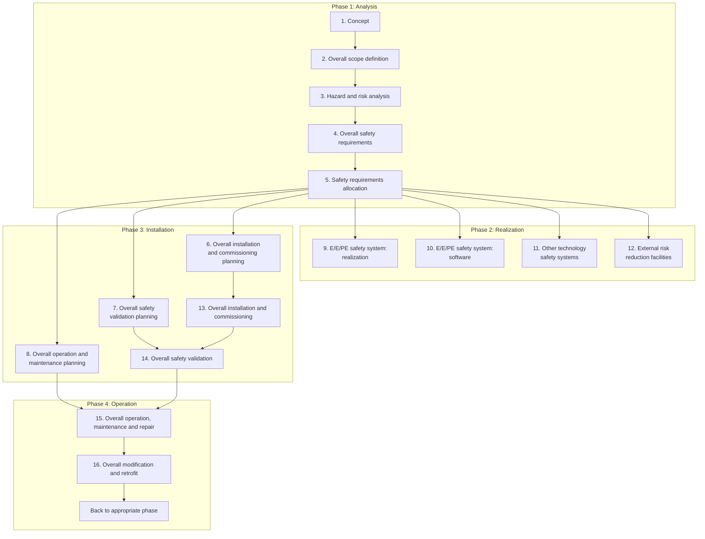
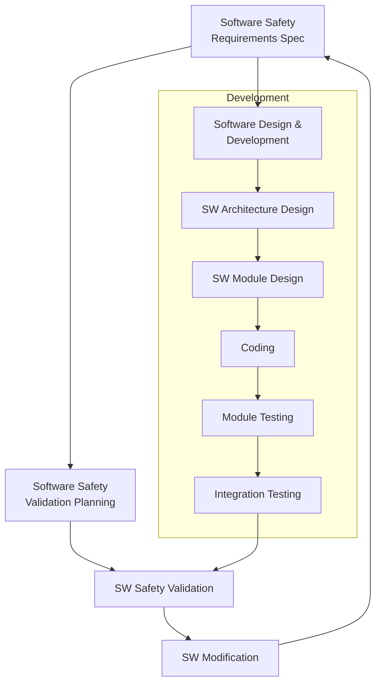
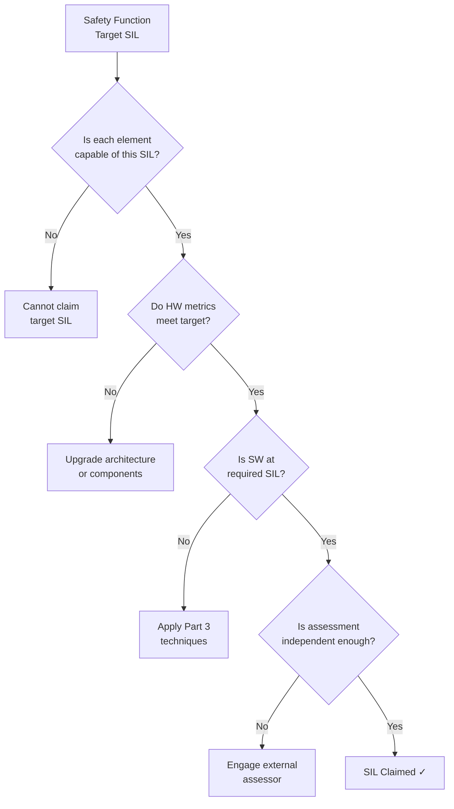
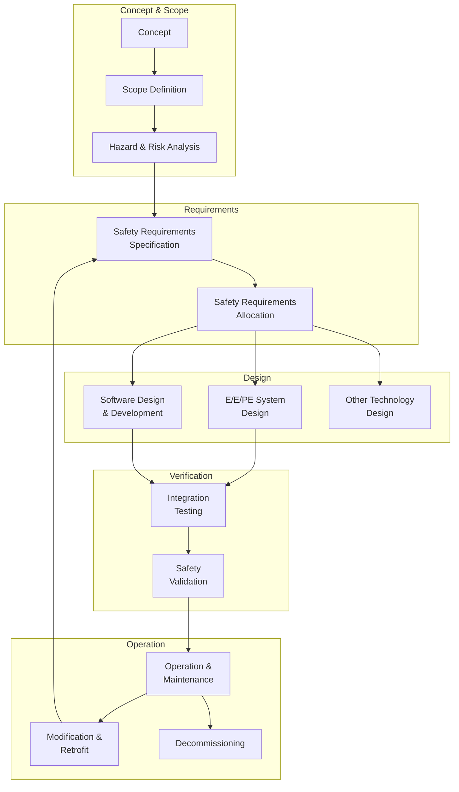
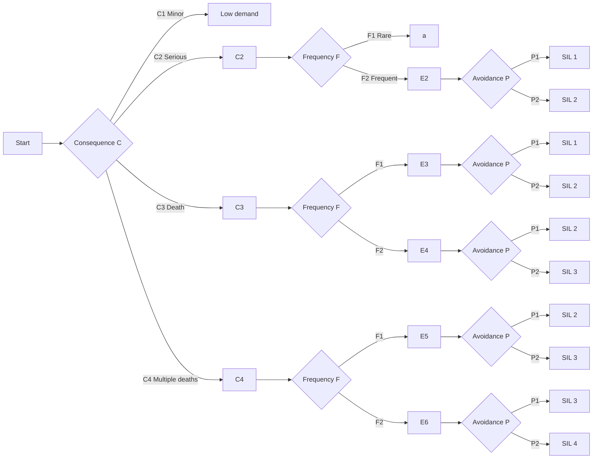
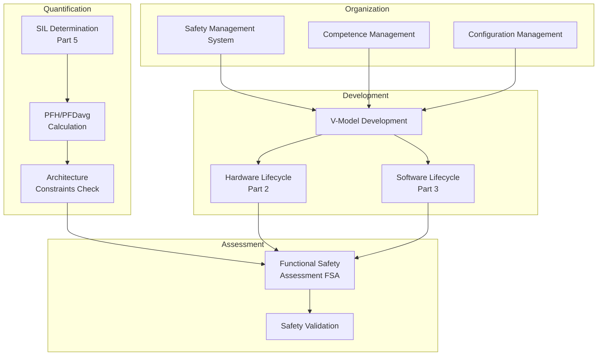

# IEC 61508 — The Root Functional Safety Standard

**Standard:** IEC 61508:2010 (Edition 2)  
**Title:** Functional Safety of Electrical/Electronic/Programmable Electronic Safety-Related Systems  
**SDO:** IEC (International Electrotechnical Commission), TC 65/SC 65A  
**Parts:** 7 Parts + Technical Reports  
**Audience:** Safety engineers, system architects, assessors, all industries using E/E/PE  
**Prerequisites:** Basic electronics, systems engineering, reliability theory

---

## Chapter 1 — Historical Context & Origin Story

### 1.1 Genesis of IEC 61508

**The problem (1970s-1980s):** Programmable Logic Controllers (PLCs) replaced hardwired relay safety systems in process plants. Unlike relays (fail-open = safe), PLC failures were **unpredictable and complex.** Existing standards (hardwired relay standards) couldn't address software failures.

**Key drivers:**
- 1974: Flixborough cyclohexane explosion (28 dead) — inadequate safety systems
- 1984: Bhopal MIC gas leak (3,787+ dead) — safety system failures
- 1988: Piper Alpha oil platform (167 dead) — safety system inadequacy
- Growing use of PLCs/computers for safety functions in process control, railway, nuclear

**Development timeline:**
| Year | Milestone |
|------|-----------|
| 1985 | HSE (UK) starts development initiative |
| 1988 | IEC TC65/SC65A WG9/10 formed |
| 1995 | IEC 61508-1 draft circulated |
| 1998 | IEC 61508 Parts 1-4 published (Edition 1) |
| 2000 | IEC 61508 Parts 5-7 published |
| 2005 | Revision work begins (Edition 2) |
| 2010 | IEC 61508:2010 Edition 2 published (all 7 parts) |
| 2025+ | Edition 3 development underway (AI/ML, cybersecurity) |

### 1.2 The "Mother Standard" Role

IEC 61508 is deliberately **generic** — it applies to ALL industries. This enables domain-specific standards to:
- Reference 61508 as the foundation
- Tailor requirements to their industry context
- Maintain consistency in safety philosophy across domains

**Daughter standards derive their authority from 61508:**
```
IEC 61508 (Generic)
├── ISO 26262 (Automotive)
├── IEC 61511 (Process Industry)
├── IEC 62061 (Machinery)
├── EN 50128/50129 (Railway)
├── IEC 62304 (Medical Device SW)
├── IEC 61513 (Nuclear)
├── ISO 25119 (Agriculture)
└── ISO 19014 (Earth-Moving)
```

### 1.3 Philosophy: Risk-Based Approach

The fundamental philosophy of IEC 61508:

1. **No system is absolutely safe** — risk can only be reduced, never eliminated
2. **Tolerable risk concept** — society accepts some residual risk
3. **Risk reduction allocation** — safety systems provide quantified risk reduction
4. **Both random AND systematic failures** must be addressed
5. **Safety lifecycle** — safety must be managed from concept through decommissioning
6. **Independence principle** — assessment must be independent from development

---

## Chapter 2 — Standard Architecture & Structure

### 2.1 Seven-Part Structure

| Part | Title | Focus |
|------|-------|-------|
| **Part 1** | General Requirements | Overall framework, SIL concept, lifecycle |
| **Part 2** | Requirements for E/E/PE Safety-Related Systems | Hardware architecture, reliability |
| **Part 3** | Software Requirements | Software lifecycle, techniques & measures |
| **Part 4** | Definitions and Abbreviations | Terminology (not a requirements part) |
| **Part 5** | Examples of Methods for SIL Determination | Risk graph, LOPA, quantitative |
| **Part 6** | Guidelines for Application of Parts 2 and 3 | Application guidance |
| **Part 7** | Overview of Techniques and Measures | Reference tables |

### 2.2 Part 1 — Overall Safety Lifecycle



### 2.3 Part 2 — Hardware Architecture

**Route 1H (hardware safety integrity — architectural constraints):**

| SIL | Hardware Fault Tolerance (HFT) — Type A | HFT — Type B |
|-----|-----------------------------------------|--------------|
| SIL 1 | 0 (SFF ≥60%) or 1 | 0 (SFF ≥90%) or 1 |
| SIL 2 | 0 (SFF ≥90%) or 1 (SFF ≥60%) | 1 (SFF ≥90%) or 2 |
| SIL 3 | 1 (SFF ≥90%) or 2 (SFF ≥60%) | 2 (SFF ≥90%) |
| SIL 4 | 2 (SFF ≥99%) | Special measures |

**Type A vs Type B:**
- **Type A (simple):** All failure modes well-defined (resistors, relays, switches)
- **Type B (complex):** Not all failure modes known (microprocessors, ASICs, FPGAs)

### 2.4 Part 3 — Software Lifecycle



### 2.5 Part 5 — SIL Determination Methods

**Three primary methods:**

| Method | Type | Applicability |
|--------|------|---------------|
| Risk graph | Qualitative/semi-quantitative | All industries |
| ALARP/hazardous event severity matrix | Semi-quantitative | General |
| Quantitative (LOPA equivalent) | Quantitative | Process industry |

**Risk graph parameters:**
- **C** — Consequence (C1 = minor, C4 = catastrophic)
- **F** — Frequency/exposure time (F1 = rare, F2 = frequent)
- **P** — Possibility of avoidance (P1 = possible, P2 = not possible)
- **W** — Probability of unwanted occurrence (W1 = very low, W3 = high)

---

## Chapter 3 — Technical Deep Dive

### 3.1 Random Hardware Failure Quantification

**Key reliability parameters:**

| Parameter | Symbol | Definition |
|-----------|--------|-----------|
| Failure rate (total) | λ | Total failures per hour |
| Safe failure rate | λS | Safe failures per hour |
| Dangerous failure rate | λD | Dangerous failures per hour |
| Dangerous detected | λDD | Detected dangerous per hour |
| Dangerous undetected | λDU | Undetected dangerous per hour |
| Proof test interval | T1 | Time between full tests |
| Mean repair time | MTTR | Average repair time |
| Common cause factor | β | Fraction of failures common to both channels |

**PFDavg calculation (1oo1D architecture, low demand):**

$$PFD_{avg} = \lambda_{DU} \cdot \frac{T_1}{2} + \lambda_{DD} \cdot MTTR$$

**PFDavg (1oo2 architecture, low demand):**

$$PFD_{avg} = (\lambda_{DU})^2 \cdot \frac{T_1^2}{3} + \beta \cdot \lambda_{DU} \cdot \frac{T_1}{2}$$

**PFH calculation (continuous/high demand, 1oo1D):**

$$PFH = \lambda_{DU}$$

### 3.2 Common Cause Failure (CCF) — Beta Factor Model

$$\beta = \text{fraction of failures affecting both channels simultaneously}$$

**IEC 61508 beta factor scoring:**

| Category | Factor | Score Range |
|----------|--------|-------------|
| Separation/segregation | Physical independence | 0-2.5 |
| Diversity | Different technology/design | 0-4.0 |
| Complexity/design/analysis | Simplicity, quality | 0-2.0 |
| Assessment/analysis | Testing thoroughness | 0-2.5 |
| Competence/training | Staff expertise | 0-1.0 |
| Environmental control | Controlled conditions | 0-1.0 |
| Maintenance/testing | Staggered testing | 0-2.0 |

**Total score → beta factor:**
- Score ≥ 10: β = 1%
- Score 6-9: β = 2%
- Score 3-5: β = 5%
- Score < 3: β = 10%

### 3.3 Software Systematic Capability

IEC 61508 Part 3 uses **techniques & measures** tables, graded by SIL:

**Table A.1 — Software design and development (selection):**

| Technique | SIL 1 | SIL 2 | SIL 3 | SIL 4 |
|-----------|-------|-------|-------|-------|
| Computer-aided specification tools | R | R | HR | HR |
| Semi-formal methods (SA/SD, UML) | R | R | HR | HR |
| Formal methods | — | R | R | HR |
| Structured programming | HR | HR | HR | HR |
| Language subset (MISRA-C) | R | HR | HR | HR |
| Dynamic analysis | R | R | HR | HR |
| Static analysis | R | HR | HR | HR |
| Modular approach | HR | HR | HR | HR |
| Design complexity metrics | R | R | HR | HR |

**Table A.5 — Software verification (testing):**

| Technique | SIL 1 | SIL 2 | SIL 3 | SIL 4 |
|-----------|-------|-------|-------|-------|
| Probabilistic testing | R | R | R | R |
| Test case execution from requirements | HR | HR | HR | HR |
| Test case execution from design | R | HR | HR | HR |
| Performance testing | R | R | HR | HR |
| Interface testing | R | R | HR | HR |
| Model-based testing | — | R | R | HR |
| Boundary value analysis | R | HR | HR | HR |
| Equivalence classes | R | HR | HR | HR |
| Structure-based testing (code coverage) | R | R | HR | HR |
| MC/DC | — | R | R | HR |

### 3.4 Proven in Use Concept

IEC 61508 allows reducing development effort if a component/subsystem is "proven in use:"

**Requirements for proven in use:**
1. Adequate specification exists for current application
2. Evidence of satisfactory operation in similar application
3. Sufficient operating hours documented
4. Configuration management maintained since evidence was gathered
5. Changes since original evidence are documented and assessed
6. Application differences are analyzed

**Operating experience requirements:**

| SIL | Operating hours needed | Number of systems |
|-----|----------------------|-------------------|
| SIL 1 | 10,000 hrs | 10 systems |
| SIL 2 | 100,000 hrs | 50 systems |
| SIL 3 | 1,000,000 hrs | 100 systems |
| SIL 4 | 10,000,000 hrs | Not typically claimed |

---

## Chapter 4 — Implementation Guide

### 4.1 Starting IEC 61508 Compliance

**Step 1 — Scope Definition:**
- Define the Equipment Under Control (EUC)
- Define the EUC control system
- Identify safety-related systems (E/E/PE, other technology, external)
- Define boundaries and interfaces

**Step 2 — Hazard Analysis:**
- Use HAZOP, FMEA, FTA, Event Tree Analysis
- Identify hazardous events
- Assess consequences (severity), exposure frequency
- Determine tolerable risk

**Step 3 — SIL Allocation:**
- Apply risk graph / quantitative method
- Allocate SIL to each safety function
- Document rationale (safety requirements specification)

**Step 4 — Design for Target SIL:**
- Architecture selection (1oo1D, 1oo2, 2oo3)
- Component selection (reliability data, proven in use)
- Software development per Part 3 requirements
- Hardware metrics calculation (PFDavg or PFH)

**Step 5 — Verification and Validation:**
- Verify each lifecycle phase output
- Validate that safety functions achieve required risk reduction
- Independent functional safety assessment

### 4.2 Architecture Selection Guide

| Architecture | PFD (typical) | SIL achievable | Pros | Cons |
|-------------|--------------|----------------|------|------|
| 1oo1 | 10⁻² - 10⁻¹ | SIL 1 | Simple, low cost | No fault tolerance |
| 1oo1D | 10⁻³ - 10⁻² | SIL 1-2 | Good diagnostics, moderate cost | DC must be high |
| 1oo2 | 10⁻⁴ - 10⁻³ | SIL 2-3 | Hardware redundancy | Higher cost, CCF risk |
| 1oo2D | 10⁻⁵ - 10⁻⁴ | SIL 3-4 | Best for continuous | Complex |
| 2oo3 | 10⁻⁵ - 10⁻⁴ | SIL 3-4 | Tolerates 1 fault, no spurious | Expensive |
| 2oo4D | 10⁻⁶ - 10⁻⁵ | SIL 4 | Highest availability + safety | Very expensive |

### 4.3 SIL Capability vs. SIL Claim



---

## Chapter 5 — Certification & Audit

### 5.1 Functional Safety Assessment Requirements

| SIL | Who can assess? | Independence |
|-----|----------------|--------------|
| SIL 1 | Person not involved in design | Minimal (same team OK) |
| SIL 2 | Person from different team/department | Moderate |
| SIL 3 | Independent department or external | High |
| SIL 4 | External independent organization | Maximum |

### 5.2 Assessment Activities

**The assessor checks:**
1. Safety lifecycle is followed and tailored appropriately
2. Hazard analysis is complete and correct
3. SIL allocation is justified
4. Architecture meets SIL constraints (HFT, SFF)
5. Hardware metrics meet numerical targets (PFDavg/PFH)
6. Software techniques match Part 3 requirements for target SIL
7. Verification activities are complete and adequate
8. Safety validation demonstrates achievement of safety goals
9. Configuration management and change control
10. Competence of personnel

### 5.3 IEC 61508 Certification (SIL Certificate)

**Process:**
1. Company develops product following IEC 61508 lifecycle
2. Certification body (TÜV, Exida, UL) reviews documentation
3. Assessment visits and audits
4. Hardware metrics independently verified
5. Software process evidence reviewed
6. Certificate issued (valid for specific product version)

**Certificate specifies:**
- Product name and version
- SIL claimed (and mode — low demand or continuous)
- Application constraints
- Assessment scope (full development or pre-existing element)
- Validity conditions

---

## Chapter 6 — Regional & Domain Variants

### 6.1 Edition 1 vs. Edition 2 (Key Changes)

| Topic | Edition 1 (1998) | Edition 2 (2010) |
|-------|-----------------|-----------------|
| Hardware metrics | SFF + HFT only | Added Route 2H (reliability data) |
| Software | Single lifecycle model | Agile elements acknowledged |
| Security | Not addressed | Security threats mentioned (not detailed) |
| ASICs/FPGAs | Not specifically addressed | Annex F (programmable logic) |
| Proven in use | Basic concept | Detailed requirements + criteria |
| Common cause | Beta factor only | Expanded CCF analysis |
| Competence | General statement | Formal competence requirements |

### 6.2 National Adoptions

| Country | National Standard | Status |
|---------|------------------|--------|
| UK | BS EN 61508 | Identical adoption |
| Germany | DIN EN 61508 | Identical adoption |
| France | NF EN 61508 | Identical adoption |
| USA | No direct adoption | Referenced by OSHA, ISA |
| China | GB/T 20438 | Translated adoption |
| Japan | JIS C 0508 | Adapted adoption |
| India | IS/IEC 61508 | Adopted |
| Australia | AS 61508 | Identical adoption |

### 6.3 Related Standards Ecosystem

| Standard | Relationship to 61508 |
|----------|----------------------|
| IEC 61511 | Sector standard (process industry SIS) |
| IEC 62061 | Sector standard (machinery SRECS) |
| ISO 13849 | Alternative to 62061 for machinery (PL approach) |
| IEC 62443 | Cybersecurity for IACS (references 61508 safety) |
| IEC 61131-3 | PLC programming languages (used with 61508) |
| IEC 61025 | Fault tree analysis method |
| IEC 60812 | FMEA method |
| IEC 61882 | HAZOP method |

---

## Chapter 7 — Comparison with Domain Standards

| Feature | IEC 61508 (Generic) | ISO 26262 (Auto) | DO-178C (Avionics) |
|---------|---------------------|-------------------|---------------------|
| **Integrity levels** | SIL 1-4 | ASIL QM-D | DAL E-A |
| **Hardware metrics** | PFH/PFDavg, SFF, HFT | SPFM, LFM, PMHF | FHA severity |
| **Software approach** | Techniques table (HR/R/—) | Techniques table (++ / + / o) | Objectives (satisfy/not) |
| **Decomposition** | Limited concept | Formal ASIL decomposition | Not applicable (DAL is DAL) |
| **Proven in use** | Detailed criteria | Use case analysis + history | Service history credit |
| **Tool qualification** | Clause 7.4.4 | Part 8 (TCL1-3) | DO-330 (full standard) |
| **Cybersecurity** | Brief mention (Ed.2) | Reference to 21434 (Ed.2) | DO-326A (separate doc) |
| **COTS usage** | Proven in use / assessment | Element out of context (SEooC) | COTS guidance limited |
| **Process model** | V-model (flexible) | V-model (prescribed) | Any (objective-based) |

---

## Chapter 8 — Mermaid Architecture Diagrams

### 8.1 IEC 61508 Safety Lifecycle Overview



### 8.2 SIL Determination (Risk Graph Method)



### 8.3 IEC 61508 Compliance Architecture



---

## Chapter 9 — Case Studies & Failure Analysis

### 9.1 Buncefield Oil Storage Depot Explosion (2005)

**Incident:** Massive explosion at fuel depot in Hertfordshire, UK  
**Cause:** Tank overfill due to failed independent high-level switch (IHLS)  
**Damage:** 43 injured, massive property damage, largest peacetime explosion in Europe

**IEC 61508 lessons:**
- SIS (Safety Instrumented System) existed but was not maintained
- Proof test was overdue
- Level gauge was stuck (common cause with IHLS)
- Operators ignored abnormal indications

**Standard response:** Reinforced IEC 61511 proof testing requirements and independent protection layer principles.

### 9.2 Deepwater Horizon (2010)

**Incident:** Blowout preventer (BOP) failed to seal well  
**Deaths:** 11  
**Damage:** Largest marine oil spill in history

**IEC 61508 lessons:**
- BOP was safety-critical equipment (should be SIL 2-3)
- Maintenance and testing were inadequate
- Multiple independent barriers failed simultaneously (CCF)
- Design margins insufficient for actual conditions

### 9.3 Process Industry SIL Success Story

**Application:** High-pressure reactor in chemical plant  
**Safety function:** Emergency shutdown on over-pressure (SIL 3)  
**Architecture:** 2oo3 pressure transmitters + 1oo2D logic solvers

**Result:** Over 15 years of operation:
- 3 genuine demands (detected and handled correctly)
- 2 spurious trips (acceptable availability impact)
- PFDavg maintained < 10⁻³ through proof testing
- Demonstrates IEC 61508/61511 methodology works when properly implemented

---

## Chapter 10 — Future Evolution & Industry Trends

### 10.1 Edition 3 Development (Expected ~2027-2030)

**Key expected changes:**
1. **AI/ML integration** — How to assess non-deterministic safety functions
2. **Cybersecurity** — Formal integration with IEC 62443
3. **Cloud/edge computing** — Safety functions distributed across network
4. **Continuous deployment** — Agile/DevOps for safety-critical systems
5. **Sustainability** — Lifecycle environmental considerations
6. **Digital twin** — Virtual validation and monitoring
7. **Updated reliability data** — Modern semiconductor failure modes

### 10.2 Challenges for Next Edition

| Challenge | Current Gap | Proposed Direction |
|-----------|-------------|-------------------|
| AI/ML | Cannot quantify systematic capability | Data-driven safety case, runtime monitoring |
| Cybersecurity | Brief mention only | Cross-reference IEC 62443, joint analysis |
| Agile | V-model assumed | Iterative cycles with safety gates |
| Cloud safety | Not conceived | Distributed safety, network reliability |
| Proven in use (ML) | Requires stable software | Continuous learning needs new concept |
| Common cause (SW) | Beta factor for HW only | Software diversity quantification |

### 10.3 Industry Adoption Trends

| Trend | Status |
|-------|--------|
| Increased SIL 3 claims in process industry | Growing (previously most stayed SIL 1-2) |
| Integration with cybersecurity (IEC 62443) | Active industry push |
| Semiconductor-specific guidance | JEDEC/IEC collaboration |
| Model-based safety analysis | Tool vendors driving |
| Digital safety lifecycle | Emerging concept |

---

## Chapter 11 — Interview Questions & Career Guide

### Tier 1: Entry-Level (0-3 years)

**Q1:** What are the 7 parts of IEC 61508 and what does each cover?  
**A:** Part 1: General requirements and safety lifecycle. Part 2: Hardware (E/E/PE system) requirements. Part 3: Software requirements. Part 4: Definitions. Part 5: SIL determination methods (risk graph, quantitative). Part 6: Application guidelines for Parts 2 and 3. Part 7: Techniques and measures overview. Parts 1-3 are normative (mandatory), Parts 4-7 are informative (guidance).

**Q2:** Explain the difference between PFDavg and PFH.  
**A:** PFDavg (Probability of Failure on Demand, average) is used for LOW DEMAND mode — safety function activated < once per year (e.g., emergency shutdown valve). PFH (Probability of dangerous Failure per Hour) is for HIGH DEMAND/CONTINUOUS mode — safety function operates continuously or > once per year (e.g., SRS in a car, railway signaling). SIL tables have different numerical targets for each mode.

### Tier 2: Mid-Level (3-8 years)

**Q3:** Calculate PFDavg for a 1oo2 architecture with λDU = 5×10⁻⁷/h, T1 = 8760h (1 year), β = 5%.  
**A:**  
$$PFD_{avg} = (1-\beta)^2 \cdot (\lambda_{DU})^2 \cdot \frac{T_1^2}{3} + \beta \cdot \lambda_{DU} \cdot \frac{T_1}{2}$$

Independent term: $(0.95)^2 \cdot (5 \times 10^{-7})^2 \cdot \frac{(8760)^2}{3} = 5.7 \times 10^{-6}$

CCF term: $0.05 \cdot 5 \times 10^{-7} \cdot \frac{8760}{2} = 1.1 \times 10^{-4}$

Total PFDavg ≈ 1.2 × 10⁻⁴ → meets SIL 3 (< 10⁻³)

Note: CCF term dominates — always check CCF!

**Q4:** What is the difference between Type A and Type B subsystems?  
**A:** Type A (simple): All failure modes are well-defined, failure rates known from test data, behavior under fault is deterministic. Examples: resistors, capacitors, relays, simple analog circuits. Type B (complex): Not all failure modes can be defined with certainty. Examples: microprocessors, ASICs, FPGAs, software. Impact: Type B requires higher SFF or HFT for the same SIL. A 1oo1 Type B needs SFF ≥90% for SIL 1, while Type A only needs SFF ≥60%.

### Tier 3: Senior/Lead (8-15 years)

**Q5:** Your customer wants to claim SIL 3 for a smart transmitter. What evidence do you need?  
**A:** (1) FMEDA showing all failure modes, λDD/λDU/λS split, DC calculation, SFF result (need SFF ≥90% for Type B HFT=1, or ≥99% for HFT=0). (2) Architecture proof — if 1oo1D, need β-factor analysis showing CCF contribution manageable. (3) PFH calculation proving meets ≤10⁻⁷/hr (continuous) or PFDavg ≤10⁻³ (low demand). (4) Systematic capability evidence — development per IEC 61508 Part 3 techniques for SIL 3 (HR techniques used). (5) Proven-in-use evidence OR full development lifecycle evidence. (6) Environmental testing (EMC, temperature, vibration). (7) Independent assessment by external body.

### Tier 4: Principal/Distinguished (15+ years)

**Q6:** How would you architect a SIL 4 system? Where is SIL 4 actually used?  
**A:** SIL 4 is used almost exclusively in nuclear safety (IEC 61513) — reactor protection systems. Architecture: 2oo4D with diagnostic voters, diverse technology (different processor architectures), physically separated channels, dedicated power supplies per channel. Software: Two diverse implementations (different teams, languages, compilers). Formal methods for critical modules. Proof testing frequency matched to architecture. The challenge is common-cause failures — at SIL 4, β-factor must be extremely low (<1%), requiring maximum diversity and separation. In practice, even nuclear uses defense-in-depth (multiple SIL 3 layers) rather than single SIL 4 claims.

---

## Chapter 12 — Cheat Sheet & Quick Reference

### IEC 61508 Quick Numbers

| SIL | PFH (continuous) | PFDavg (low demand) | Risk Reduction |
|-----|-------------------|---------------------|----------------|
| 1 | [10⁻⁶, 10⁻⁵) | [10⁻², 10⁻¹) | 10-100× |
| 2 | [10⁻⁷, 10⁻⁶) | [10⁻³, 10⁻²) | 100-1,000× |
| 3 | [10⁻⁸, 10⁻⁷) | [10⁻⁴, 10⁻³) | 1,000-10,000× |
| 4 | [10⁻⁹, 10⁻⁸) | [10⁻⁵, 10⁻⁴) | 10,000-100,000× |

### DC Classification

| Category | DC Range | Example Mechanism |
|----------|----------|-------------------|
| None | < 60% | No specific diagnostics |
| Low | 60% - < 90% | Plausibility check |
| Medium | 90% - < 99% | Redundancy comparison |
| High | ≥ 99% | Complete diagnostics (e.g., lockstep) |

### Safety Function Testing Mnemonic

```
H-A-R-D-S:
H - Hazard analysis (what can go wrong?)
A - Architecture (how to tolerate faults?)
R - Reliability (what are the failure rates?)
D - Diagnostics (how to detect faults?)
S - Systematic (how to prevent design errors?)
```

### Key Formulas

| Formula | Use |
|---------|-----|
| $SFF = \frac{\lambda_S + \lambda_{DD}}{\lambda_{total}}$ | Hardware architecture constraint |
| $DC = \frac{\lambda_{DD}}{\lambda_D}$ | Diagnostic effectiveness |
| $PFD_{1oo1} = \lambda_{DU} \cdot \frac{T_1}{2}$ | Simplest PFD calculation |
| $PFD_{1oo2} \approx \beta\lambda_{DU}\frac{T_1}{2}$ | Redundant (CCF dominated) |
| $PFH_{1oo1D} = \lambda_{DU}$ | Continuous mode, single channel |
| $\lambda = \frac{1}{MTTF}$ | Failure rate from mean time to failure |

---

*End of Document — 01_IEC_61508_Root_Standard.md*
