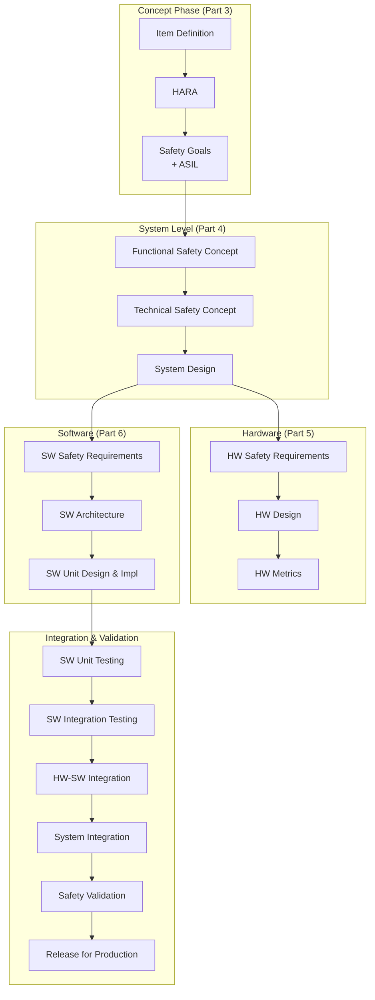
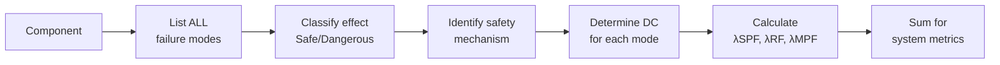
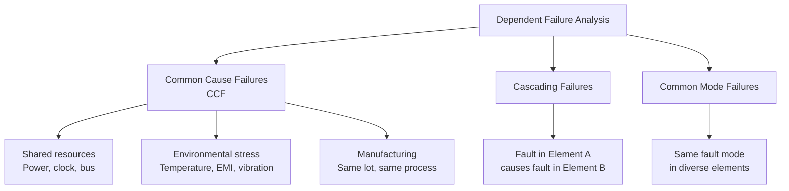
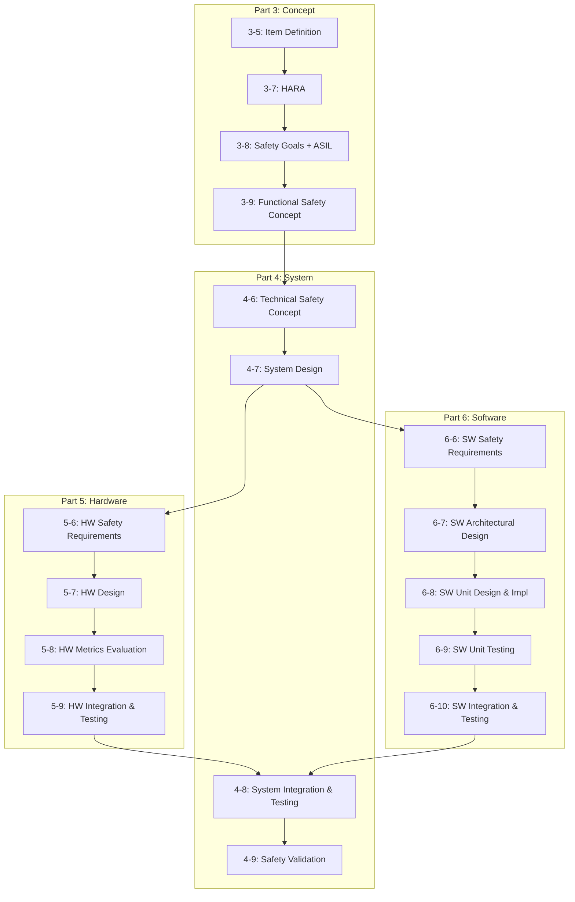
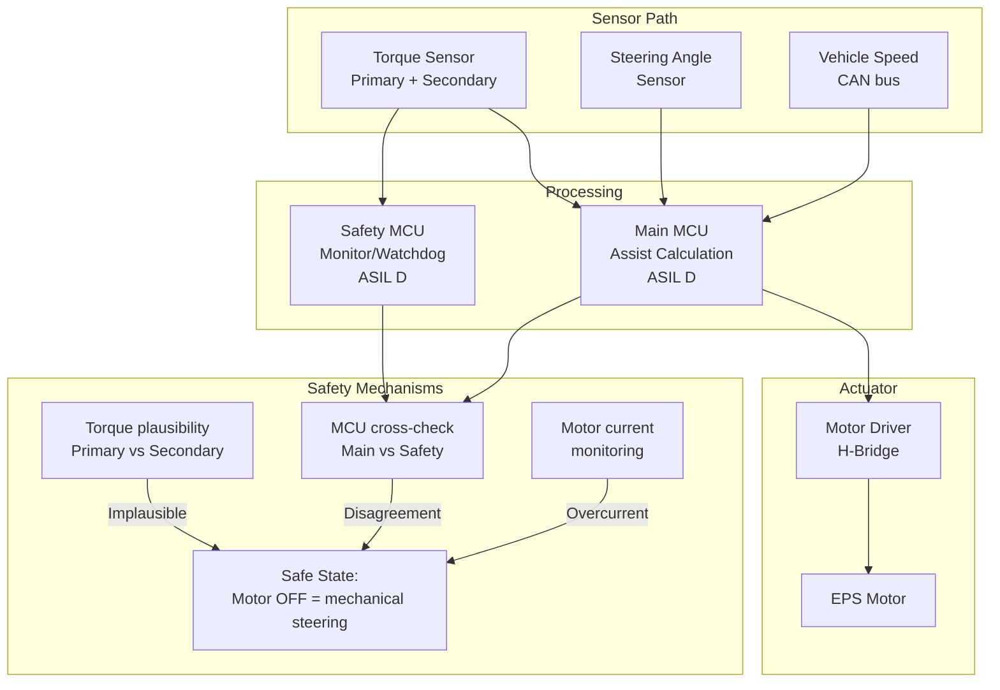
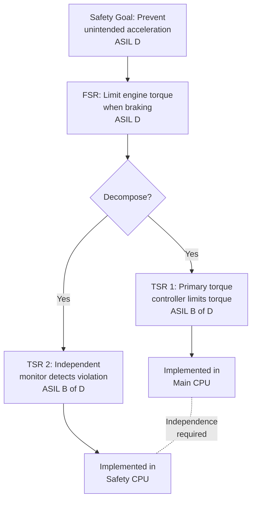
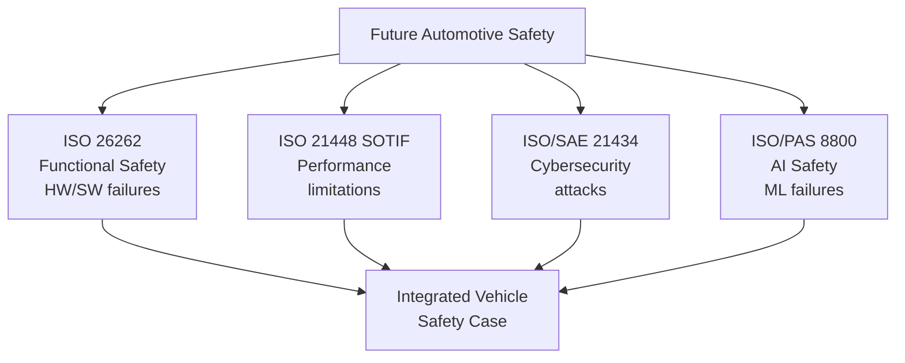

# ISO 26262 — Automotive Functional Safety

**Standard:** ISO 26262:2018 (Edition 2)  
**Title:** Road Vehicles — Functional Safety  
**SDO:** ISO TC22/SC32  
**Parts:** 12 Parts  
**Audience:** Automotive safety engineers, ADAS/AD architects, ECU developers, OEMs, Tier-1/2 suppliers  
**Prerequisites:** Basic automotive systems, electronics, software engineering, IEC 61508 fundamentals

---

## Chapter 1 — Historical Context & Origin Story

### 1.1 Why Automotive Needed Its Own Safety Standard

**The problem:** By 2000, modern vehicles contained 70-100 ECUs and 100M+ lines of code. Safety-critical functions (ABS, ESC, airbags, throttle, steering) were all electronic. IEC 61508 was too generic — it didn't address:
- Automotive production volumes (millions of units)
- Vehicle lifecycle specifics (15+ year service life)
- Supply chain complexity (OEM → Tier-1 → Tier-2 → Tier-N)
- Driver as a risk factor (controllability)
- ASIL decomposition (cost optimization)

### 1.2 Development History

| Year | Milestone |
|------|-----------|
| 2004 | ISO TC22 Working Group formed for automotive safety |
| 2005 | First draft based on IEC 61508 adaptation |
| 2009 | Toyota unintended acceleration crisis (accelerates development) |
| 2011 | ISO 26262:2011 (Edition 1) published — 10 parts |
| 2012-2016 | Industry adoption begins (OEMs mandate for new platforms) |
| 2015 | Edition 2 development begins |
| 2018 | ISO 26262:2018 (Edition 2) published — 12 parts |
| 2019 | ISO 21448 (SOTIF) published (companion standard) |
| 2022 | ISO/SAE 21434 (cybersecurity) creates safety-security interface |
| 2025+ | Edition 3 preparation (AI/ML, continuous update, security) |

### 1.3 The Toyota Unintended Acceleration Catalyst

**2009-2010:** NHTSA investigated 6,200+ complaints, 89+ deaths attributed to Toyota vehicles accelerating uncontrollably.

**Barr Group findings (commissioned by plaintiffs):**
- Throttle control software had 10,000+ global variables
- Stack overflow vulnerability (could corrupt safety variables)
- No MISRA-C compliance
- Task scheduling could starve safety-critical tasks
- Single points of failure in critical paths
- Inadequate watchdog implementation

**Industry impact:** ISO 26262 became mandatory for all new vehicle programs at most OEMs by 2015. Toyota invested billions in functional safety processes.

### 1.4 Key Philosophy Differences from IEC 61508

| Concept | IEC 61508 | ISO 26262 |
|---------|-----------|-----------|
| Integrity scale | SIL 1-4 | ASIL QM, A, B, C, D |
| Risk parameters | C, F, P, W | Severity, Exposure, Controllability |
| Decomposition | Limited | Formal ASIL decomposition rules |
| Supply chain | Not addressed | DIA, SEooC, assumed ASIL |
| Development cooperation | Basic | Detailed DIA (Development Interface Agreement) |
| Confirmation measures | External assessment | Confirmation review (can be internal for ASIL A/B) |
| Production | Brief mention | Part 7 dedicated to production |
| Motorcycles | Not addressed | Part 12 (Edition 2) |

---

## Chapter 2 — Standard Architecture & Structure

### 2.1 Twelve-Part Structure

| Part | Title | Key Content |
|------|-------|-------------|
| **1** | Vocabulary | Terms and definitions |
| **2** | Management of Functional Safety | FSM, safety culture, competence, DIA |
| **3** | Concept Phase | Item definition, HARA, safety goals |
| **4** | Product Development: System Level | FSC, TSC, system design, integration |
| **5** | Product Development: Hardware Level | HW metrics (SPFM, LFM, PMHF), FMEDA |
| **6** | Product Development: Software Level | SW architecture, coding, verification |
| **7** | Production, Operation, Service, Decommissioning | Manufacturing, maintenance |
| **8** | Supporting Processes | Configuration mgmt, tool qualification, proven in use |
| **9** | ASIL-Oriented and Safety-Oriented Analyses | FMEA, FTA, DFA, dependent failure |
| **10** | Guidelines on ISO 26262 | Application guidance |
| **11** | Guidelines for Application to Semiconductors | IC-specific guidance |
| **12** | Adaptation for Motorcycles | Two-wheel specific tailoring |

### 2.2 Safety Lifecycle (V-Model)



### 2.3 ASIL Determination (HARA)

**Three parameters:**

| Parameter | Description | Levels |
|-----------|-------------|--------|
| **Severity (S)** | Potential injury to vehicle occupants/others | S0 (no injury) to S3 (life-threatening/fatal) |
| **Exposure (E)** | Probability of operating scenario | E0 (incredible) to E4 (high probability) |
| **Controllability (C)** | Ability of driver/others to avoid harm | C0 (controllable) to C3 (uncontrollable) |

**ASIL determination matrix:**

| | C1 | C2 | C3 |
|---|---|---|---|
| **S1, E1** | QM | QM | QM |
| **S1, E2** | QM | QM | QM |
| **S1, E3** | QM | QM | ASIL A |
| **S1, E4** | QM | ASIL A | ASIL B |
| **S2, E1** | QM | QM | QM |
| **S2, E2** | QM | QM | ASIL A |
| **S2, E3** | QM | ASIL A | ASIL B |
| **S2, E4** | ASIL A | ASIL B | ASIL C |
| **S3, E1** | QM | QM | ASIL A |
| **S3, E2** | QM | ASIL A | ASIL B |
| **S3, E3** | ASIL A | ASIL B | ASIL C |
| **S3, E4** | ASIL B | ASIL C | ASIL D |

---

## Chapter 3 — Technical Deep Dive

### 3.1 Hardware Architectural Metrics (Part 5)

**Three metrics that must ALL be met:**

| Metric | Formula | ASIL A | ASIL B | ASIL C | ASIL D |
|--------|---------|--------|--------|--------|--------|
| **SPFM** (Single Point Fault Metric) | $1 - \frac{\lambda_{SPF}}{\lambda}$ | ≥ 90% | ≥ 97% | ≥ 97% | ≥ 99% |
| **LFM** (Latent Fault Metric) | $1 - \frac{\lambda_{MPF,latent}}{\lambda - \lambda_{SPF}}$ | ≥ 60% | ≥ 80% | ≥ 80% | ≥ 90% |
| **PMHF** (Probabilistic Metric for random HW Failures) | Total residual dangerous rate | < 10⁻⁶/h | < 10⁻⁷/h | < 10⁻⁷/h | < 10⁻⁸/h |

**Where:**
- $\lambda_{SPF}$ = single point failures (dangerous, not covered by safety mechanism)
- $\lambda_{MPF,latent}$ = multiple-point failures that are latent (not detected within MPFDI)
- MPFDI = Multiple-Point Fault Detection Interval (time to detect latent fault)

### 3.2 FMEDA (Failure Modes, Effects and Diagnostic Analysis)

**Process for each component:**



**Failure category mapping:**

| Failure Type | Safety Impact | Detection | Metric Impact |
|-------------|--------------|-----------|---------------|
| Safe (S) | No violation of safety goal | N/A | Improves SFF, not dangerous |
| Dangerous Detected (DD) | Would violate, but detected | Safety mechanism | → Residual fault (RF) |
| Dangerous Undetected (DU) | Violates safety goal, latent | None | → SPF or MPF_latent |
| Single Point Fault (SPF) | Direct violation, no redundancy | None | Hurts SPFM |
| Residual Fault (RF) | Not detected despite SM | Imperfect DC | Contributes to PMHF |
| Multiple Point Fault (MPF) | Needs 2+ faults to violate | Various | LFM or PMHF |

### 3.3 Software Methods by ASIL (Part 6)

**Table 1 — Design principles:**

| Method | ASIL A | ASIL B | ASIL C | ASIL D |
|--------|--------|--------|--------|--------|
| Hierarchical design | ++ | ++ | ++ | ++ |
| Restricted use of pointers/dynamic objects | + | ++ | ++ | ++ |
| No recursion | + | + | ++ | ++ |
| No dynamic memory after init | + | + | ++ | ++ |
| MISRA C/C++ subset | ++ | ++ | ++ | ++ |
| Defensive programming | + | + | ++ | ++ |
| Design patterns for safety | + | + | + | ++ |

**Table 9 — Structural coverage metrics:**

| Coverage Level | ASIL A | ASIL B | ASIL C | ASIL D |
|---------------|--------|--------|--------|--------|
| Statement coverage | ++ | ++ | + | + |
| Branch coverage | + | ++ | ++ | ++ |
| MC/DC | + | + | + | ++ |

**Legend:** ++ = Highly Recommended, + = Recommended, o = No recommendation

### 3.4 ASIL Decomposition

**Rules for splitting safety requirements across redundant elements:**

| Original ASIL | Decomposition Option 1 | Option 2 | Option 3 |
|---------------|----------------------|----------|----------|
| ASIL D | ASIL C(D) + ASIL A(D) | ASIL B(D) + ASIL B(D) | ASIL D(D) + QM(D) |
| ASIL C | ASIL B(C) + ASIL A(C) | ASIL C(C) + QM(C) | — |
| ASIL B | ASIL A(B) + ASIL A(B) | ASIL B(B) + QM(B) | — |
| ASIL A | ASIL A(A) + QM(A) | — | — |

**Critical requirement:** Sufficient independence between decomposed elements MUST be demonstrated:
- Freedom from interference (FFI) — no shared resources for safety-critical paths
- Cascading failure protection
- Independent development (different team/tools/methods for high ASIL)

### 3.5 Dependent Failure Analysis (DFA) — Part 9



---

## Chapter 4 — Implementation Guide

### 4.1 Project Phases and Timeline

| Phase | Duration (typical) | Key Activities |
|-------|-------------------|----------------|
| Concept (Part 3) | 3-6 months | Item definition, HARA, safety goals |
| System development (Part 4) | 6-12 months | FSC, TSC, system architecture |
| HW development (Part 5) | 12-18 months | Design, FMEDA, metrics verification |
| SW development (Part 6) | 12-24 months | Requirements, design, code, test |
| Integration & validation | 6-12 months | HW-SW integration, system validation |
| **Total** | **2-4 years** | Full safety lifecycle |

### 4.2 Safety Element out of Context (SEooC)

**For Tier-2 suppliers developing components without knowing the final vehicle application:**

1. **Assume** an ASIL (typically highest expected: ASIL D)
2. Document **assumed** safety requirements and use conditions
3. Develop component to assumed ASIL
4. Provide **Safety Manual** to integrator
5. Integrator **validates** assumptions match actual use case

### 4.3 Tool Qualification (Part 8)

| Tool Confidence Level (TCL) | When Required | Methods |
|----------------------------|---------------|---------|
| TCL 1 (highest) | Tool can introduce/not detect ASIL D error | Validation by 3rd party |
| TCL 2 | Tool can introduce/not detect ASIL B/C error | Increased confidence from use + validation |
| TCL 3 (lowest) | Low potential to introduce error | Increased confidence from use |

**Tool classification matrix:**

| | TD1 (can introduce error) | TD2 (may not detect error) | TD3 (neither) |
|---|---|---|---|
| **TI1** (high) | TCL 1 | TCL 1 | TCL 3 |
| **TI2** (medium) | TCL 2 | TCL 2 | TCL 3 |
| **TI3** (low) | TCL 3 | TCL 3 | TCL 3 |

### 4.4 Confirmation Measures

| ASIL | Confirmation Review | Functional Safety Audit | Functional Safety Assessment |
|------|--------------------|-----------------------|----------------------------|
| A | + (same org) | o | o |
| B | ++ (same org) | + | o |
| C | ++ (different dept) | ++ | + |
| D | ++ (external possible) | ++ | ++ |

---

## Chapter 5 — Certification & Audit

### 5.1 ISO 26262 Assessment Bodies

| Organization | Specialization | Regions |
|-------------|----------------|---------|
| TÜV SÜD | Full vehicle + components | Global (Germany HQ) |
| TÜV Rheinland | Components, semiconductors | Global (Germany HQ) |
| DEKRA | Vehicle systems | Europe |
| SGS-TÜV Saar | Industrial + automotive | Europe |
| Exida | Process/industrial crossover | Americas/Europe |
| UL Solutions | Automotive electronics | Americas/Asia |
| Ricardo | Safety consulting + assessment | UK/Global |
| Kugler Maag | ASPICE + FuSa | Germany |
| Ansys medini | Tool-supported assessment | Global |

### 5.2 What Assessors Look For

**Top 10 audit findings:**
1. Incomplete HARA (missing hazardous events or scenarios)
2. SPFM/LFM/PMHF not meeting targets
3. Missing traceability (requirement → test case gaps)
4. Insufficient DFA (dependent failure analysis incomplete)
5. Tool qualification not done for critical tools
6. Freedom from interference not demonstrated
7. Missing safety analyses (FMEA, FTA, DFA)
8. Software coverage metrics not achieved
9. Competence records incomplete
10. Configuration management gaps

### 5.3 Work Product Requirements by ASIL

**Example — Number of key work products:**

| Work Product | ASIL A | ASIL B | ASIL C | ASIL D |
|-------------|--------|--------|--------|--------|
| Item Definition | Required | Required | Required | Required |
| HARA | Required | Required | Required | Required |
| Safety Goals | Required | Required | Required | Required |
| FSC | Required | Required | Required | Required |
| TSC | Recommended | Required | Required | Required |
| HW Safety Req | Required | Required | Required | Required |
| FMEDA | Recommended | Required | Required | Required |
| DFA | Recommended | Recommended | Required | Required |
| SW Architecture | Required | Required | Required | Required |
| MC/DC coverage | Recommended | Recommended | Recommended | Highly Recommended |

---

## Chapter 6 — Regional & Domain Variants

### 6.1 Edition 1 (2011) vs. Edition 2 (2018)

| Feature | Edition 1 | Edition 2 |
|---------|-----------|-----------|
| Parts | 10 | 12 (added 11 + 12) |
| Semiconductors | Briefly in Part 5 | Dedicated Part 11 |
| Motorcycles | Not covered | Part 12 |
| Buses/trucks | Mentioned | Explicitly included |
| ASIL decomposition | Basic concept | Detailed rules + examples |
| Cybersecurity | Not mentioned | Brief reference to "security" |
| SOTIF | Not addressed | Reference to ISO 21448 |
| Agile development | Not addressed | Acknowledged (flexibility) |
| SEooC | Basic | Enhanced with safety manual template |

### 6.2 ISO 26262 + Companion Standards

| Standard | Relationship | Content |
|----------|-------------|---------|
| ISO 21448 (SOTIF) | Complements 26262 | Safety despite correct function (performance limits) |
| ISO/SAE 21434 | Linked via Part 2 | Cybersecurity engineering |
| ISO 24089 | OTA updates | Software update management |
| ISO 34503 | ODD taxonomy | Operational Design Domain definition |
| ISO/PAS 8800 | AI safety | Safety of AI in automotive |
| UNECE R155 | Regulation | Vehicle cybersecurity type-approval |
| UNECE R156 | Regulation | Software update type-approval |
| AUTOSAR | Architecture | Software platform standard |
| ASPICE | Process | Automotive software development process |

### 6.3 Automotive-Specific Challenges

| Challenge | ISO 26262 Approach |
|-----------|-------------------|
| High volumes (millions) | Part 7 (production), DFA |
| Long service life (15+ yrs) | Degradation mechanisms in FMEDA |
| Cost pressure | ASIL decomposition, QM elements |
| Supply chain depth | DIA, SEooC, safety manual |
| Driver as safety element | Controllability parameter in HARA |
| OTA updates | ISO 24089 reference |
| Aftermarket parts | Part 7 requirements |

---

## Chapter 7 — Comparison with Other Standards

| Feature | ISO 26262 | DO-178C | IEC 62304 | EN 50128 |
|---------|-----------|---------|-----------|----------|
| **Domain** | Automotive | Avionics | Medical SW | Railway |
| **Levels** | ASIL QM-D | DAL E-A | Class A-C | SIL 0-4 |
| **Scope** | Full system (HW+SW) | SW only | SW only | SW only |
| **HW standard** | Included (Part 5) | DO-254 (separate) | IEC 60601-1 | EN 50129 |
| **Certification** | No formal cert (assessment) | FAA/EASA approval | CE marking (NoBo) | NoBo assessment |
| **Cost** | $200K-$2M | $1M-$10M | $100K-$500K | $500K-$3M |
| **Speed** | 2-4 years | 3-7 years | 1-3 years | 3-5 years |
| **Driver/pilot role** | Controllability in HARA | Pilot as safety layer | N/A | N/A |
| **MC/DC** | ASIL D (recommended++) | DAL A/B (required) | Not specific | SIL 3-4 |
| **Decomposition** | Formal ASIL decomp | No DAL decomposition | N/A | N/A |
| **Tool qualification** | TCL 1-3 (Part 8) | DO-330 (full standard) | Brief | T1-T3 classes |

---

## Chapter 8 — Mermaid Architecture Diagrams

### 8.1 ISO 26262 Full Safety Lifecycle



### 8.2 Safety Architecture Example (EPS - Electric Power Steering)



### 8.3 ASIL Decomposition Example



---

## Chapter 9 — Case Studies & Failure Analysis

### 9.1 Toyota Electronic Throttle Control (2009-2010)

**Safety goal (should have been):** "No unintended acceleration" — ASIL D

**What was missing:**
- No formal HARA
- No ASIL assignment
- No systematic hardware metrics evaluation
- Software not developed to any safety standard
- No independent monitoring of throttle actuator
- No safety mechanism for CPU task overrun

**What ISO 26262 would have required:**
- HARA → ASIL D for "unintended acceleration at vehicle speed > 20 km/h, S3, E4, C3"
- Hardware: Dual-path monitoring (SPFM ≥ 99%, LFM ≥ 90%)
- Software: MISRA-C, MC/DC coverage, defensive programming
- System: Independent watchdog with torque limitation capability
- DFA: Analysis of common cause between throttle command and monitor

### 9.2 Takata Airbag Inflator (2013-2020)

**Safety goal:** "Airbag deploys with correct force" — ASIL C/D  
**Failure:** Inflator explosions (metal shrapnel) — at least 27 deaths worldwide

**Root cause:** Chemical propellant (ammonium nitrate) degraded over time in humid/hot climates  
**ISO 26262 relevance:**
- Part 5: Systematic failure — degradation mechanism not analyzed
- Part 7: Production process quality insufficient
- Not purely a "functional safety" issue (chemical engineering failure), but demonstrates need for lifecycle thinking

### 9.3 Successful ASIL D Implementation: Brake-by-Wire

**System:** Production brake-by-wire (e.g., BMW/Continental MK C2)  
**Safety goal:** "Vehicle shall decelerate on demand" — ASIL D  

**Architecture:**
- Dual brake control units (BCU 1 + BCU 2)
- Each BCU: Cortex-R lockstep + independent safety MCU
- Dual power supply (two battery paths)
- ASIL B(D) + ASIL B(D) decomposition
- Mechanical/hydraulic fallback for total electronic failure
- SPFM: 99.5%, LFM: 93%, PMHF: 3.2 × 10⁻⁹/h

**Result:** Successfully deployed in production vehicles, meeting ASIL D through decomposition + diverse redundancy.

---

## Chapter 10 — Future Evolution & Industry Trends

### 10.1 ISO 26262 Edition 3 (Expected ~2026-2028)

**Anticipated changes:**
1. **AI/ML safety** — Integration with ISO/PAS 8800
2. **Cybersecurity** — Formal interface with ISO/SAE 21434
3. **OTA updates** — Continuous safety case management
4. **Agile/DevOps** — Iterative safety lifecycle
5. **Cloud-connected functions** — Safety of off-board computation
6. **Semiconductor advances** — Advanced nodes (5nm, 3nm), chiplets
7. **Vehicle computer architecture** — Zone/central compute

### 10.2 Industry Trends (2025-2030)

| Trend | Impact on ISO 26262 |
|-------|---------------------|
| Centralized vehicle computers | Fewer ECUs but higher ASIL per compute platform |
| Software-defined vehicles | Continuous deployment needs "living safety case" |
| L3/L4 autonomy | ASIL D + SOTIF + cybersecurity simultaneously |
| AI perception | Non-deterministic functions need new methods |
| V2X (vehicle-to-everything) | External data in safety decisions |
| Semiconductor disaggregation (chiplet) | Part 11 needs chiplet-specific guidance |
| Supply chain localization | New Tier-1/2 players need FuSa training |

### 10.3 Integration with Other Disciplines



---

## Chapter 11 — Interview Questions & Career Guide

### Tier 1: Entry-Level (0-3 years)

**Q1:** What is ASIL and how is it determined?  
**A:** ASIL = Automotive Safety Integrity Level, determined through HARA using three parameters: Severity (S0-S3), Exposure (E0-E4), Controllability (C0-C3). The combination gives ASIL QM, A, B, C, or D. Example: "Unintended acceleration at highway speed" — S3 (fatal), E4 (high probability of highway driving), C3 (difficult to control at speed) → ASIL D.

**Q2:** What is the difference between Functional Safety Concept and Technical Safety Concept?  
**A:** FSC (Functional Safety Concept) describes WHAT the system must do for safety in functional terms (e.g., "limit torque when brake applied"). TSC (Technical Safety Concept) describes HOW to implement it technically (e.g., "redundant MCU compares throttle command with brake signal, disables motor driver PWM within 50ms"). FSC is in Part 3, TSC is in Part 4.

### Tier 2: Mid-Level (3-8 years)

**Q3:** Your FMEDA shows SPFM = 96% for an ASIL D safety goal. What do you do?  
**A:** ASIL D requires SPFM ≥ 99%. Options: (1) Add safety mechanisms to cover uncovered single-point failures — identify which failure modes are contributing to SPF and add diagnostics (e.g., ADC self-test, memory ECC, CPU lockstep). (2) If cannot add SM, add hardware redundancy (increases HFT, removes SPF). (3) Reassess failure mode classification — verify that modes classified as "dangerous" truly violate the safety goal. (4) Use ASIL decomposition to split ASIL D into lower ASILs if architecture supports independence. (5) Re-examine component choice — select parts with better diagnostic coverage.

**Q4:** Explain freedom from interference (FFI).  
**A:** FFI ensures that a fault in a lower-ASIL or non-safety element cannot cause a failure in a higher-ASIL element. Required when mixed-ASIL elements share resources (CPU, memory, communication). Methods: (1) Memory protection (MPU) — spatial separation. (2) Time partitioning — temporal isolation (e.g., AUTOSAR OS timing protection). (3) Communication protection — CRC, alive counter, E2E protection. (4) Resource protection — dedicated peripherals or safe sharing protocols. Must be demonstrated through analysis (not just claimed).

### Tier 3: Senior/Lead (8-15 years)

**Q5:** Design the safety concept for a steer-by-wire system (no mechanical column).  
**A:** (1) **HARA:** "Loss of steering" at S3/E4/C3 → ASIL D. "Unintended steering" at S3/E3/C2 → ASIL C. (2) **Architecture:** Dual steering ECUs (ECU-A + ECU-B), each capable of full steering control. ASIL B(D) + ASIL B(D) decomposition for "loss of steering." (3) **Independence:** Different MCU families (Arm R52 vs TriCore), different teams, different compilers, physical separation. (4) **Sensors:** Dual redundant torque sensors + dual angle sensors, cross-monitored. (5) **Actuator:** Dual motor windings or dual motors, each driveable by either ECU. (6) **Safe states:** Degraded mode (one ECU controls, limited torque), then power-off (requires mechanical parking lock or friction). (7) **Timing:** Fault detection < 10ms, reaction < 50ms (driver perceives within 200ms at highway speed). (8) **DFA:** Power supply diversity, communication path diversity, clock diversity.

### Tier 4: Principal/Distinguished (15+ years)

**Q6:** How should ISO 26262 evolve to handle AI-based perception in ASIL D autonomous driving functions?  
**A:** (1) **New failure taxonomy:** Beyond "random HW" and "systematic" — add "performance insufficiency" (AI limitation), "distributional shift" (OOD inputs), "adversarial vulnerability." (2) **Assurance approach:** Replace deterministic verification (MC/DC) with statistical/probabilistic arguments — confidence intervals on perception accuracy, calibrated uncertainty estimates. (3) **Runtime safety:** Mandate "safety cage" architecture — deterministic monitor constrains non-deterministic AI outputs. Physics-based sanity checking. (4) **Data lifecycle:** Training data as safety-relevant — diversity requirements, bias analysis, labeled edge cases. (5) **Continuous validation:** Post-deployment monitoring with automatic degradation if KPIs drift. (6) **Metrics:** New metrics beyond SPFM/LFM — perception ASIL (pASIL?) based on operational domain coverage and failure detection probability. (7) **Decomposition between AI layers:** Primary AI (high complexity, probabilistic assurance) + deterministic guard (traditional ASIL D development).

---

## Chapter 12 — Cheat Sheet & Quick Reference

### ASIL Quick Reference

| ASIL | SPFM | LFM | PMHF | Independence |
|------|------|-----|------|--------------|
| QM | — | — | — | None required |
| A | ≥ 90% | ≥ 60% | < 10⁻⁶/h | Internal review |
| B | ≥ 97% | ≥ 80% | < 10⁻⁷/h | Internal (different person) |
| C | ≥ 97% | ≥ 80% | < 10⁻⁷/h | Different department |
| D | ≥ 99% | ≥ 90% | < 10⁻⁸/h | External possible |

### ISO 26262 Part Number Mnemonic

```
1-Vocabulary, 2-Management, 3-Concept
4-System, 5-Hardware, 6-Software
7-Production, 8-Supporting processes
9-Analysis methods, 10-Guidelines
11-Semiconductors, 12-Motorcycles

"Very Many Concepts Surround Hardware Software 
Production Supporting Analyses — Guidelines for Semiconductors & Motorcycles"
```

### Key Formulas

$$SPFM = 1 - \frac{\sum \lambda_{SPF}}{\sum \lambda_{safety-related}}$$

$$LFM = 1 - \frac{\sum \lambda_{MPF,latent}}{\sum \lambda_{safety-related} - \sum \lambda_{SPF}}$$

$$PMHF_{target} \leq 10^{-8}/h \text{ (ASIL D)}$$

### Diagnostic Coverage Tiers (ISO 26262 Part 5)

| DC Level | Range | Example |
|----------|-------|---------|
| None | < 60% | No specific diagnostic |
| Low | 60% to < 90% | Plausibility check, range check |
| Medium | 90% to < 99% | Redundancy comparison, protocol check |
| High | ≥ 99% | Lockstep CPU, complete self-test |

---

*End of Document — 02_ISO_26262_Automotive.md*
