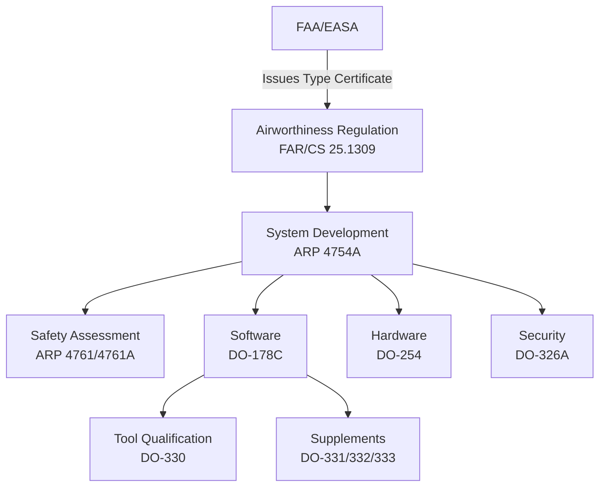
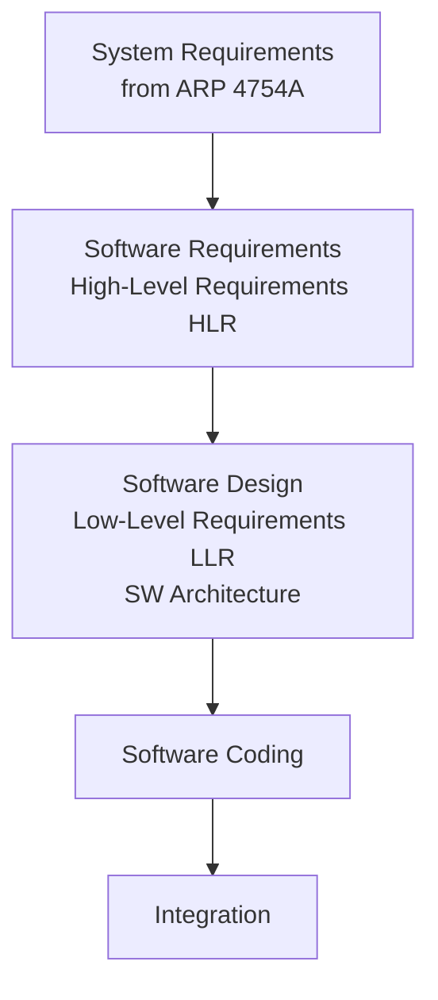
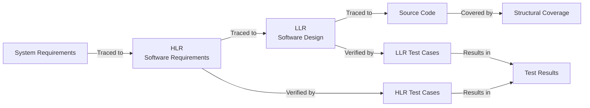
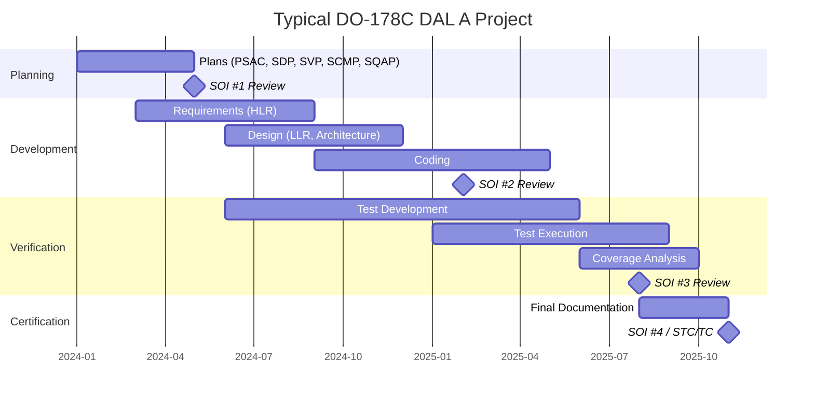
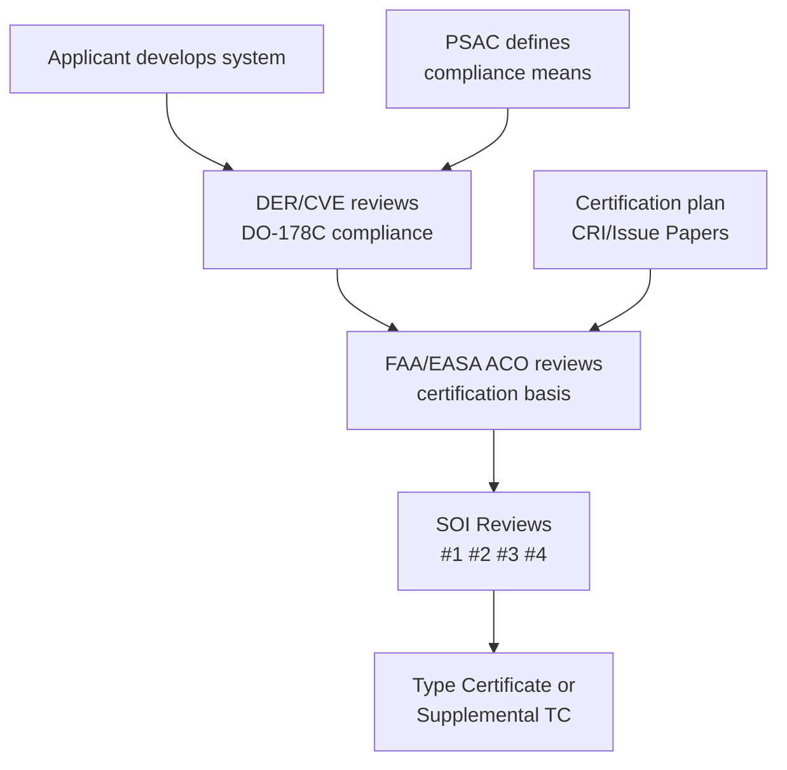
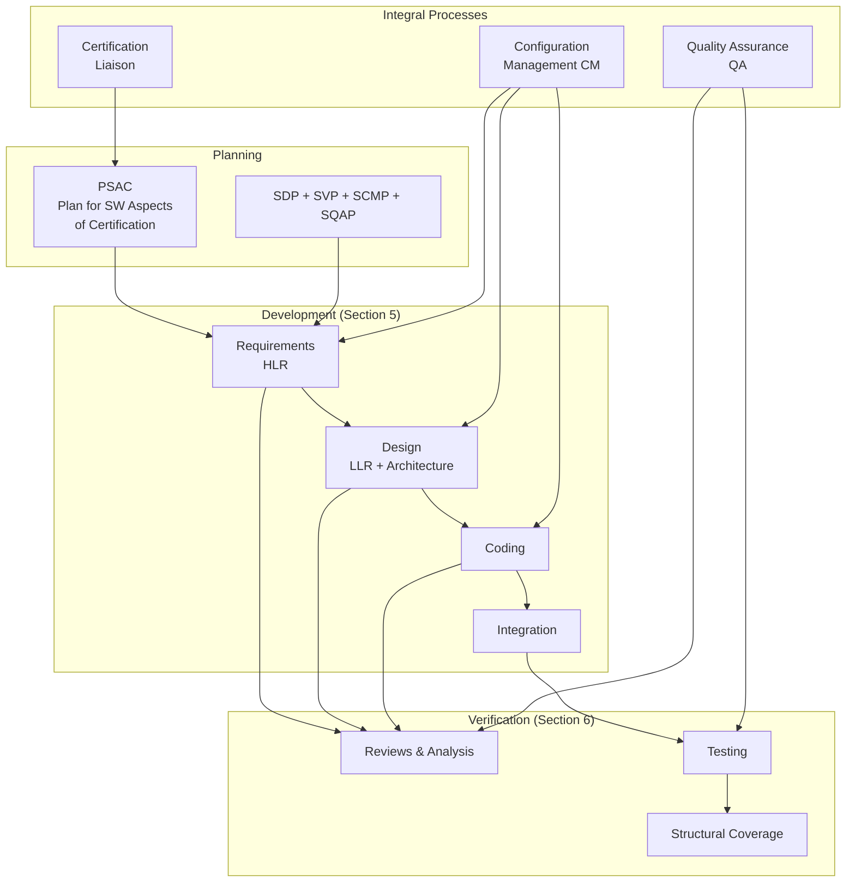
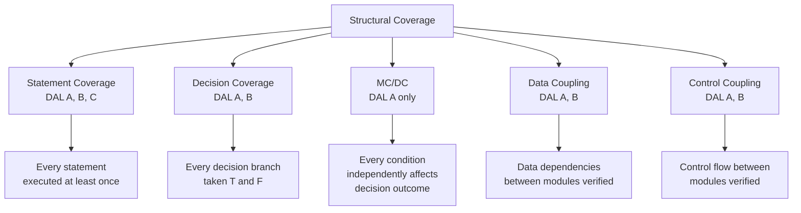
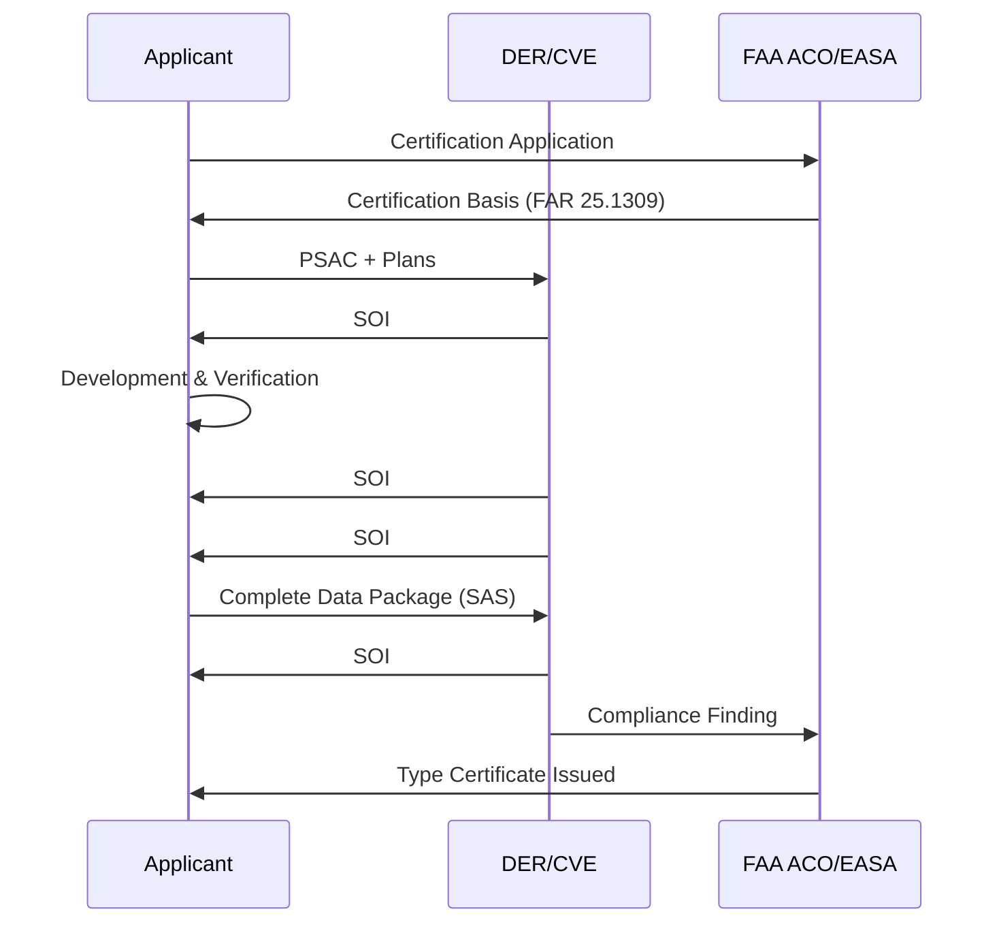

# DO-178C — Airborne Software Assurance

**Standard:** DO-178C / ED-12C (2012)  
**Title:** Software Considerations in Airborne Systems and Equipment Certification  
**SDO:** RTCA (USA) / EUROCAE (Europe)  
**Supplements:** DO-330 (Tools), DO-331 (Model-Based), DO-332 (OO/Formal), DO-333 (Formal Methods)  
**Audience:** Avionics software engineers, certification engineers, DER/CVE, system integrators  
**Prerequisites:** ARP 4754A, ARP 4761, basic avionics architecture, understanding of FAA/EASA certification

---

## Chapter 1 — Historical Context & Origin Story

### 1.1 Aviation Safety and Software

Aviation has the **longest history and strictest requirements** for software safety. A single aircraft system failure can kill hundreds of people simultaneously, and public trust in air travel demands extremely low failure rates.

**Aviation target failure rate:** 10⁻⁹ per flight hour for catastrophic failure conditions (one in a billion flight hours).

### 1.2 Evolution of Airborne Software Standards

| Year | Document | Key Change |
|------|----------|-----------|
| 1980 | DO-178 | First guidance (very basic) |
| 1985 | DO-178A | Added structure (limited adoption) |
| 1992 | DO-178B | The industry-defining standard (20 years dominant) |
| 2000 | Position papers (IP, OOT, FC) | Addressing DO-178B gaps |
| 2005 | DO-178C development begins | Major rewrite |
| 2012 | DO-178C + 4 supplements published | Current standard |
| 2012 | DO-330 (Tool Qualification) | Dedicated tool standard |
| 2012 | DO-331 (Model-Based Development) | MBD supplement |
| 2012 | DO-332 (Object-Oriented Technology) | OO supplement |
| 2012 | DO-333 (Formal Methods) | FM supplement |

### 1.3 Key Differences: DO-178B vs DO-178C

| Aspect | DO-178B (1992) | DO-178C (2012) |
|--------|---------------|----------------|
| Tool qualification | Appendix (brief) | Separate document (DO-330) |
| Model-based development | Not addressed | DO-331 supplement |
| Object-oriented | Not addressed (IP clarification) | DO-332 supplement |
| Formal methods | Not addressed | DO-333 supplement |
| Traceability | Implied | Explicit bidirectional |
| Parameter Data Items | Minimal | Expanded guidance |
| Previously Developed SW | Brief mention | Detailed guidance (service history) |
| Certification liaison | Implicit | Explicit process |

### 1.4 Regulatory Framework



---

## Chapter 2 — Standard Architecture & Structure

### 2.1 Document Structure

DO-178C is organized into:
- **Section 1-3:** Purpose, scope, relationship to system process
- **Section 4:** Software planning process
- **Section 5:** Software development process
- **Section 6:** Software verification process
- **Section 7:** Software configuration management
- **Section 8:** Software quality assurance
- **Section 9:** Certification liaison
- **Section 10:** Software lifecycle data
- **Section 11:** Additional considerations
- **Section 12:** Previously developed software
- **Annex A:** Process objectives and outputs by level (THE critical table)

### 2.2 Design Assurance Levels (DAL)

| DAL | Failure Condition | Failure Rate Target | Objectives |
|-----|-------------------|--------------------|-----------| 
| **A** | Catastrophic | 10⁻⁹/flight hour | 71 objectives (all) |
| **B** | Hazardous/Severe Major | 10⁻⁷/flight hour | 69 objectives |
| **C** | Major | 10⁻⁵/flight hour | 62 objectives |
| **D** | Minor | 10⁻³/flight hour | 26 objectives |
| **E** | No Effect | No requirement | 0 objectives |

**DAL is assigned at system level (ARP 4754A/ARP 4761), not by DO-178C itself.**

### 2.3 Annex A — Objectives Matrix (Summary)

| Process | DAL A | DAL B | DAL C | DAL D |
|---------|-------|-------|-------|-------|
| Planning | 7 obj | 7 obj | 7 obj | 3 obj |
| Development | 7 obj | 7 obj | 5 obj | 3 obj |
| Verification of requirements | 7 obj | 7 obj | 6 obj | 3 obj |
| Verification of design | 5 obj | 5 obj | 3 obj | 2 obj |
| Verification of code | 9 obj | 9 obj | 7 obj | 4 obj |
| Testing | 8 obj | 8 obj | 7 obj | 3 obj |
| CM | 8 obj | 6 obj | 6 obj | 3 obj |
| QA | 9 obj | 9 obj | 9 obj | 3 obj |
| Certification liaison | 3 obj | 3 obj | 3 obj | 2 obj |
| **Total** | **71** | **69** | **62** | **26** |

### 2.4 Independence Requirements

| DAL | Verification Independence |
|-----|--------------------------|
| A | Verification must be independent (different person/tool) |
| B | Verification must be independent |
| C | Verification may be by developer (with justification) |
| D | Verification may be by developer |

---

## Chapter 3 — Technical Deep Dive

### 3.1 Software Development Process



**Key terminology:**
- **HLR (High-Level Requirements):** What the software must do (functional + safety)
- **LLR (Low-Level Requirements):** How the software does it (design + architecture)
- **Source Code:** Implementation of LLR
- **Executable Object Code:** Compiled/linked binary

### 3.2 Verification Process (Section 6)

**DO-178C verification is NOT just testing — it has three components:**

1. **Reviews & Analysis** — human inspection of artifacts
2. **Testing** — execution of software against requirements
3. **Analysis** — formal analysis (data flow, control flow, stack)

**Structural coverage requirements:**

| Coverage Type | DAL A | DAL B | DAL C | DAL D |
|---------------|-------|-------|-------|-------|
| Statement coverage | Required | Required | Required | — |
| Decision coverage | Required | Required | — | — |
| MC/DC (Modified Condition/Decision Coverage) | Required | — | — | — |
| Data coupling & control coupling | Required | Required | — | — |

### 3.3 MC/DC (Modified Condition/Decision Coverage)

**Definition:** Every condition in a decision has been shown to independently affect that decision's outcome.

**Example:**
```
Decision: if (A && (B || C))

To achieve MC/DC, need test cases showing:
- A independently affects outcome (vary A, hold B||C true)
- B independently affects outcome (vary B, hold A true, C false)
- C independently affects outcome (vary C, hold A true, B false)

Minimum test cases for MC/DC: N+1 (where N = number of conditions)
For this decision: 4 test cases minimum
```

**MC/DC truth table example (A && B):**

| Test | A | B | A && B | Shows |
|------|---|---|--------|-------|
| TC1 | T | T | T | — |
| TC2 | T | F | F | B independently affects outcome (pair with TC1) |
| TC3 | F | T | F | A independently affects outcome (pair with TC1) |

### 3.4 Traceability Requirements



**Bidirectional traceability matrix:**
- Forward: Each requirement → test case(s) that verify it
- Backward: Each test case → requirement(s) it verifies
- No orphan requirements (requirement with no test)
- No orphan tests (test verifying no requirement — indicates dead code or derived requirement)

### 3.5 Derived Requirements

**Definition:** Requirements generated by the software development process that are NOT directly traceable to higher-level system requirements.

**Example:** "The RTOS shall use priority ceiling protocol for shared resources" — not a system requirement but necessary for software correctness.

**DO-178C treatment:**
- Must be identified and documented
- Must be communicated to system safety assessment
- Must be verified
- Safety assessment determines if derived requirements introduce new hazards

### 3.6 Deactivated Code and Dead Code

| Type | Definition | DO-178C Requirement |
|------|-----------|---------------------|
| **Dead code** | Code that cannot be reached in any configuration | Must be removed or justified |
| **Deactivated code** | Code deliberately disabled in a particular configuration | Must be verified to not interfere; structural coverage applies to executable code |

---

## Chapter 4 — Implementation Guide

### 4.1 Planning Phase (Section 4)

**Five plans required:**

| Plan | Content |
|------|---------|
| **PSAC** (Plan for Software Aspects of Certification) | How DO-178C is applied, DAL, deviations |
| **SDP** (Software Development Plan) | Lifecycle, methods, standards, environment |
| **SVP** (Software Verification Plan) | Verification methods, coverage criteria |
| **SCMP** (Software Configuration Management Plan) | CM process, tools, baselines |
| **SQAP** (Software Quality Assurance Plan) | QA activities, independence, audits |

### 4.2 Certification Stages of Involvement (SOI)

| SOI | Name | When | Purpose |
|-----|------|------|---------|
| SOI #1 | Planning Review | After plans complete | Verify plans are adequate |
| SOI #2 | Development Review | During development | Check process being followed |
| SOI #3 | Verification Review | During testing | Verify test approach adequate |
| SOI #4 | Final Review | End of project | Complete data package |

### 4.3 DO-178C Project Timeline



### 4.4 DO-330 Tool Qualification

**Tool qualification levels (TQL):**

| TQL | Criteria 1 | Criteria 2 | Criteria 3 | Objectives |
|-----|-----------|-----------|-----------|-----------|
| TQL-1 | Output is part of airborne SW | Could introduce error | Undetected | ~66 objectives |
| TQL-2 | Output is part of airborne SW | Could introduce error | Detected | ~34 objectives |
| TQL-3 | — | Cannot introduce, but may fail to detect | Undetected | ~18 objectives |
| TQL-4 | — | Cannot introduce, but may fail to detect | Detected | ~10 objectives |
| TQL-5 | — | — | — | ~5 objectives |

**Examples:**
- Compiler → TQL-1 (can introduce errors in object code)
- Static analysis tool (replaces review) → TQL-4 or TQL-5
- Requirements management tool → TQL-5 (just stores data)
- Auto-code generator → TQL-1 (generates source code)

---

## Chapter 5 — Certification & Audit

### 5.1 FAA/EASA Certification Process



### 5.2 Key Certification Roles

| Role | Organization | Function |
|------|-------------|----------|
| **DER** (Designated Engineering Representative) | FAA-authorized individual | Reviews/approves on behalf of FAA |
| **ODA** (Organization Designation Authorization) | FAA-authorized company | Company-level delegation |
| **CVE** (Compliance Verification Engineer) | EASA-authorized | Reviews for EASA compliance |
| **ACO** (Aircraft Certification Office) | FAA | Manages certification projects |
| **DOA** (Design Organization Approval) | EASA-authorized company | EASA equivalent of ODA |

### 5.3 Common Certification Issues

| Issue | Resolution |
|-------|------------|
| Insufficient MC/DC coverage | Add test cases or justify exclusion (deactivated code analysis) |
| Requirements not verifiable | Rewrite to be specific, measurable, testable |
| Missing derived requirements | Identify, document, communicate to safety |
| Tool qualification gap | Qualify tool or manually verify output |
| COTS software usage | Service history + additional verification |
| Reuse without re-verification | Demonstrate unchanged context or re-verify |
| Problem report closure | All open PRs resolved or dispositioned |
| Traceability gaps | Complete bidirectional traceability matrix |

---

## Chapter 6 — Regional & Domain Variants

### 6.1 RTCA (FAA) vs. EUROCAE (EASA)

| RTCA Document | EUROCAE Document | Subject |
|---------------|------------------|---------|
| DO-178C | ED-12C | Airborne software |
| DO-254 | ED-80 | Airborne hardware |
| DO-326A | ED-202A | Airworthiness security |
| DO-330 | ED-215 | Tool qualification |
| DO-331 | ED-218 | Model-based development |
| DO-332 | ED-217 | Object-oriented |
| DO-333 | ED-216 | Formal methods |
| DO-160G | ED-14G | Environmental conditions |
| DO-278A | ED-109A | Ground-based software |

### 6.2 Military vs. Civil Aviation

| Feature | Civil (DO-178C) | Military (MIL-STD-882E) |
|---------|-----------------|------------------------|
| Regulation | FAA/EASA type certificate | Military airworthiness authority |
| Standard | DO-178C mandatory | DO-178C or equivalent |
| Oversight | DER/CVE | Government program office |
| DAL levels | 5 (A-E) | Mission criticality levels |
| Cost | $1M-$10M+ per software item | Often higher (smaller volumes) |
| Reuse | Service history credit | Similar (with re-assessment) |
| Classified systems | N/A | Additional OPSEC requirements |

### 6.3 DO-178C vs. Automotive/Other Domains

| Aspect | DO-178C (Avionics) | ISO 26262 (Auto) | IEC 62304 (Medical) |
|--------|---------------------|-------------------|---------------------|
| Certification | Type Certificate (DER) | Assessment (TÜV) | CE Marking (NoBo) |
| Cost per program | $1M-$10M | $200K-$2M | $100K-$500K |
| MC/DC | DAL A (mandatory) | ASIL D (recommended++) | Not specific |
| Code reuse | Service history credit | Proven in use | Legacy software clause |
| Tool qualification | DO-330 (full standard) | Part 8 TCL 1-3 | Brief mention |
| Independence | Mandatory (DAL A/B) | By ASIL level | By class |
| Production volume | Hundreds-thousands | Millions | Thousands-millions |

---

## Chapter 7 — Comparison with DO-178B

| Feature | DO-178B (1992) | DO-178C (2012) |
|---------|---------------|----------------|
| Supplements | None | 4 supplements (330-333) |
| Model-based | Not addressed | DO-331 |
| OO technology | IP / Handbook clarification | DO-332 |
| Formal methods | Briefly mentioned | DO-333 (full credit) |
| Tool qualification | Appendix A (2 pages) | DO-330 (120+ pages) |
| Parameter data items | Minimal | Section 11.c expanded |
| Previously developed SW | Brief mention | Section 12 (detailed) |
| Traceability | Implied bidirectional | Explicitly required bidirectional |
| Applicability | Airborne only | Extended concepts used for ground (DO-278A) |
| Security | Not addressed | DO-326A companion |

---

## Chapter 8 — Mermaid Architecture Diagrams

### 8.1 DO-178C Process Overview



### 8.2 Structural Coverage Hierarchy



### 8.3 Certification Authority Interaction



---

## Chapter 9 — Case Studies & Failure Analysis

### 9.1 Airbus A380 Flight Control (DO-178B Success)

**System:** Primary Flight Control System (PFCS)  
**DAL:** Level A  
**Architecture:** Triplex dissimilar — 3 flight control computers (FCC), each with different:
- Processor architecture (Intel, Motorola, SPARC)
- Programming language (Ada, C)
- Development team (separate companies)
- Compiler

**Result:** Achieved certification with outstanding safety record. Demonstrates that rigorous DO-178B/C processes enable extremely high integrity.

### 9.2 Boeing 737 MAX MCAS (2018-19)

**System:** MCAS (Maneuvering Characteristics Augmentation System)  
**DAL assignment:** Initially assessed too low (not Catastrophic)  
**Root failure:** System-level safety assessment underestimated hazard severity

**Key DO-178C/ARP 4754A lessons:**
- MCAS relied on **single AoA sensor** (no redundancy for DAL A function)
- System-level FHA classified MCAS failure as "Major" (DAL C) instead of "Catastrophic" (DAL A)
- The software itself may have met its assigned DAL — but the DAL was wrong
- Demonstrates that **ARP 4754A (system safety)** drives DO-178C (software) — wrong system analysis = wrong software assurance

### 9.3 Ariane 5 Flight 501 (1996)

**System:** Inertial Reference System (SRI) software  
**Failure:** Integer overflow (64-bit float → 16-bit integer conversion)  
**Result:** Rocket self-destructed 37 seconds after launch ($370M loss)

**DO-178C lessons:**
- Software was **reused from Ariane 4** without re-verification for new flight profile
- Ariane 5 had higher lateral velocity → exceeded integer range
- Code was "dead code" in Ariane 5 context but was still executing
- DO-178C Section 12 (Previously Developed Software) now requires analysis of new context

---

## Chapter 10 — Future Evolution & Industry Trends

### 10.1 DO-178C Modernization Discussions

| Topic | Status | Expected Outcome |
|-------|--------|-----------------|
| Artificial intelligence | Research (EASA AI Roadmap) | W-shaped lifecycle (retrain loop) |
| Agile development | Industry adoption growing | Iteration within DO-178C framework |
| Cybersecurity | DO-326A/DO-356A mature | Integration with development |
| Multi-core | CAST-32A position paper | Determinism and interference analysis |
| Autonomy | UAS rules evolving | Scalable assurance framework |
| Model-based testing | DO-331 established | Increasing adoption |
| Continuous airworthiness | Discussion starting | Post-deployment monitoring |
| Cloud/connectivity | Early concept | Connected aircraft software |

### 10.2 Multi-Core Processing (CAST-32A)

**Challenge:** Multi-core processors introduce interference:
- Cache contention
- Bus bandwidth sharing
- Shared memory access patterns
- Timing non-determinism

**CAST-32A requires:**
- Identification of interference channels
- Mitigation or demonstration of no interference
- Worst-case execution time analysis accounting for contention
- Testing to demonstrate bounded timing

### 10.3 AI/ML in Avionics (EASA Concept Paper)

**EASA W-model for ML:**
```
Traditional V-model → + Learning loop:
1. Training data selection/validation
2. Model training
3. Model verification (test set)
4. Model integration
5. System-level validation
6. Continuous monitoring in service
7. Retraining trigger → back to step 1
```

---

## Chapter 11 — Interview Questions & Career Guide

### Tier 1: Entry-Level (0-3 years)

**Q1:** What are the DAL levels and what determines them?  
**A:** DAL A (Catastrophic: potential loss of aircraft), DAL B (Hazardous: large reduction in safety margins, serious injury), DAL C (Major: significant reduction in capability), DAL D (Minor: slight reduction in capability), DAL E (No Effect). Determined by system-level Functional Hazard Assessment (FHA) per ARP 4754A — NOT by DO-178C itself.

**Q2:** What is MC/DC and when is it required?  
**A:** Modified Condition/Decision Coverage — proves each condition in a Boolean expression independently affects the decision outcome. Required for DAL A only. Minimum N+1 test cases for N conditions. Example: `if (A && B)` needs 3 test cases: TT (true baseline), TF (B affects), FT (A affects).

### Tier 2: Mid-Level (3-8 years)

**Q3:** Explain the difference between HLR and LLR in DO-178C.  
**A:** HLR (High-Level Requirements) define WHAT the software must do — derived from system requirements. They are functional, performance, and safety requirements. LLR (Low-Level Requirements) define HOW — architectural decisions, data structures, algorithms, module interfaces. Source code implements LLR. Traceability: System Req → HLR → LLR → Source Code. Tests verify at each level: HLR-based tests validate functionality; LLR-based tests validate design; structural coverage verifies code completeness.

**Q4:** A test achieves 94% MC/DC. How do you handle the remaining 6%?  
**A:** For DAL A, must achieve 100% MC/DC (or justify). For remaining 6%: (1) Analyze uncovered code — is it dead code? (remove it). (2) Is it deactivated code? (document justification per DO-178C §6.4.4.3). (3) Is it defensive code? (may justify via robustness argument). (4) Is it unreachable? (prove via data/control flow analysis). (5) Add test cases to cover remaining paths. (6) If truly unreachable (compiler-generated), document in coverage analysis report.

### Tier 3: Senior/Lead (8-15 years)

**Q5:** Your program uses auto-generated code from Simulink. What DO-178C compliance strategy do you use?  
**A:** Two approaches: (1) **Qualify the tool (DO-330 TQL-1):** Prove code generator produces correct output for all constructs used → trust generated code (no LLR-level review needed). Very expensive but reduces per-project cost. (2) **Verify the output:** Treat generated code as hand-written — full reviews, testing, structural coverage. Cheaper tool qualification but higher per-project verification cost. Typically hybrid: qualify for subset of proven model patterns; verify anything outside qualified scope. Apply DO-331 (model-based supplement): models serve as design/requirements; verification at model level can replace code-level verification (with justified model-to-code traceability).

### Tier 4: Principal/Distinguished (15+ years)

**Q6:** How should the aviation certification framework evolve for autonomous (unpiloted) aircraft?  
**A:** (1) **Remove pilot as mitigation:** Current FHA often credits pilot action — without pilot, all failure conditions severity increases (many become Catastrophic → DAL A). (2) **AI/ML assurance:** Cannot achieve MC/DC for neural networks — need new verification paradigms (statistical confidence bounds, formal verification of safety properties, runtime monitoring). (3) **Scalable assurance:** Risk-proportional approach — UAS over unpopulated area ≠ urban air mobility with passengers. SORA (Specific Operations Risk Assessment) for UAS; full DAL A for passenger eVTOL. (4) **Continuous certification:** Autonomous systems learn/adapt — need "living" airworthiness with continuous monitoring and recertification triggers. (5) **Operational containment:** Geo-fencing, contingency management as supplemental safety measures (credited in FHA).

---

## Chapter 12 — Cheat Sheet & Quick Reference

### DO-178C Quick Numbers

| DAL | Objectives | Structural Coverage | Independence | Target Failure Rate |
|-----|-----------|--------------------|--------------|--------------------|
| A | 71 | MC/DC + Statement + Decision | Required | 10⁻⁹/flight hour |
| B | 69 | Decision + Statement | Required | 10⁻⁷/flight hour |
| C | 62 | Statement | Not required | 10⁻⁵/flight hour |
| D | 26 | None | Not required | 10⁻³/flight hour |
| E | 0 | None | N/A | N/A |

### Five Plans Mnemonic: "PSAC Says Do Software Verification, Configuration, Quality"

- **P**SAC — Plan for Software Aspects of Certification
- **S**DP — Software Development Plan
- **S**VP — Software Verification Plan
- **S**CMP — Software Configuration Management Plan
- **S**QAP — Software Quality Assurance Plan

### DO-178C Lifecycle Data (Key Work Products)

| Data Item | DAL A | DAL B | DAL C | DAL D |
|-----------|-------|-------|-------|-------|
| Software Requirements (HLR) | CC1 | CC1 | CC1 | CC1 |
| Software Design (LLR) | CC1 | CC1 | CC1 | CC2 |
| Source Code | CC1 | CC1 | CC1 | CC2 |
| Test Cases & Procedures | CC1 | CC1 | CC1 | CC2 |
| Test Results | CC1 | CC1 | CC1 | CC2 |
| Coverage Analysis | CC1 | CC1 | CC1 | — |
| Problem Reports | CC1 | CC1 | CC1 | CC1 |
| SAS (Software Accomplishment Summary) | CC1 | CC1 | CC1 | CC1 |

**CC1** = Control Category 1 (under CM with change review)  
**CC2** = Control Category 2 (under CM, identification and retrieval)

### Key Relationships

```
ARP 4754A → ASSIGNS → DAL to software
DO-178C → SATISFIES → Software assurance objectives
DO-330 → QUALIFIES → Tools used in development
DO-326A → ADDRESSES → Security threats to airborne systems
ARP 4761 → PROVIDES → Safety assessment methods (FHA, PSSA, SSA)
```

---

*End of Document — 03_DO_178C_Avionics_Software.md*
