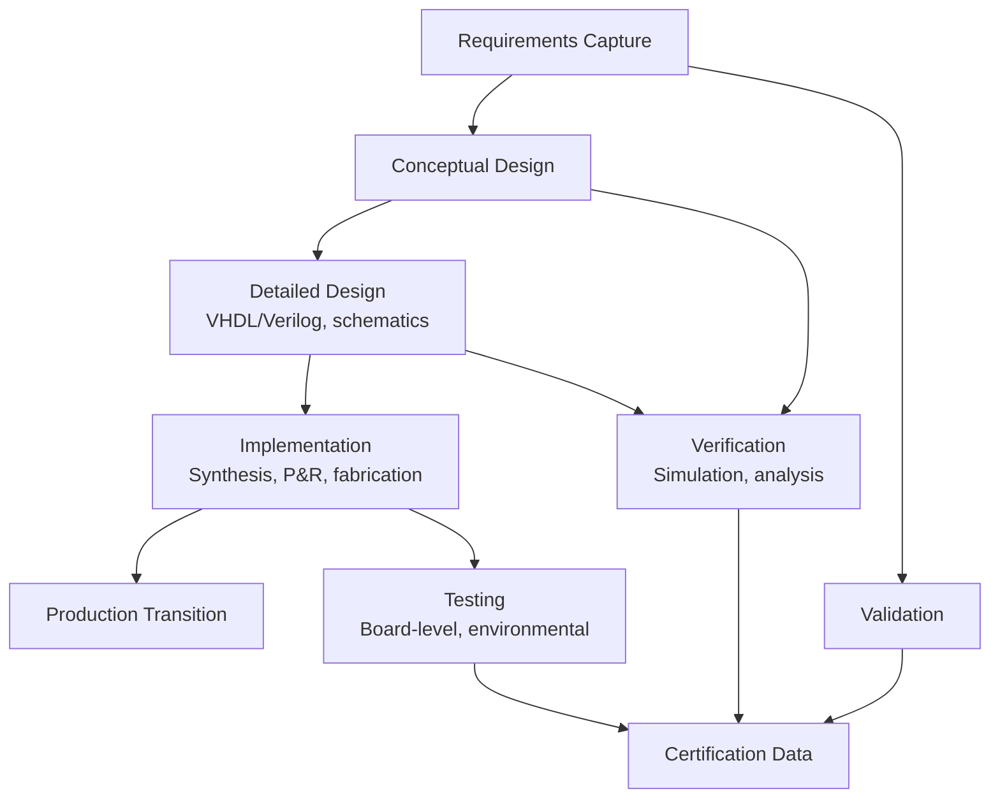
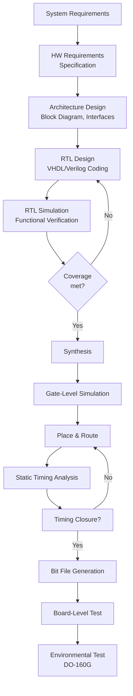
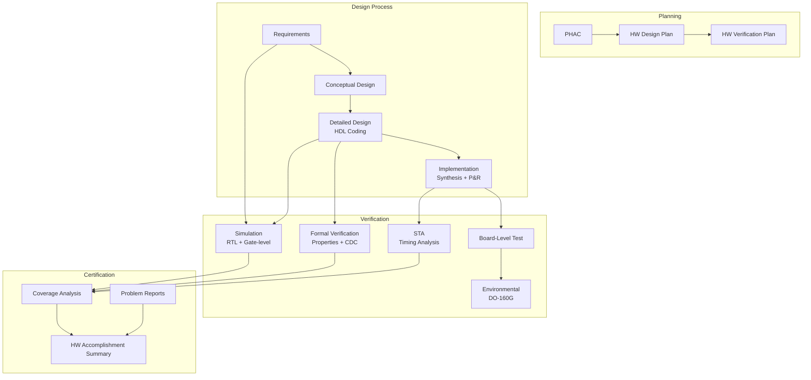
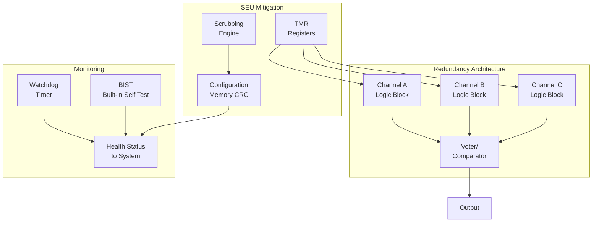

# DO-254 — Airborne Electronic Hardware Assurance

**Standard:** DO-254 / ED-80 (2000)  
**Title:** Design Assurance Guidance for Airborne Electronic Hardware  
**SDO:** RTCA (USA) / EUROCAE (Europe)  
**Audience:** Hardware design engineers, FPGA/ASIC developers, avionics integrators, DER/CVE  
**Prerequisites:** Digital design fundamentals, FPGA/ASIC design flow, ARP 4754A, basic DO-178C awareness

---

## Chapter 1 — Historical Context & Origin Story

### 1.1 Why Hardware Needs Its Own Standard

By the 1990s, aviation software had DO-178B (1992), but **hardware complexity was exploding:**
- FPGAs went from thousands to millions of gates
- ASICs became standard for avionics signal processing
- PLDs (Programmable Logic Devices) were used everywhere
- The line between "hardware" and "software" blurred — VHDL/Verilog is "coded" hardware

**Key distinction:** Unlike discrete components (resistors, capacitors) which fail randomly and can be characterized statistically, **complex electronic hardware (CEH)** — FPGAs, ASICs, PLDs — can have **systematic design errors**, just like software.

### 1.2 Development Timeline

| Year | Event |
|------|-------|
| 1996 | RTCA SC-180 begins DO-254 development |
| 2000 | DO-254 published |
| 2005 | FAA Order 8110.105 — mandates DO-254 for DAL A-C |
| 2008 | EASA CM-SWCEH-001 — mandatory for complex hardware |
| 2010 | AC 20-152 — FAA Advisory Circular for DO-254 |
| 2012 | Industry practices mature (FPGA/ASIC vendors provide DO-254 kits) |
| 2020+ | Increasing complexity (SoCs, multi-die, advanced nodes) |

### 1.3 What Constitutes "Complex Electronic Hardware"

| Category | Examples | DO-254 Applicable? |
|----------|---------|-------------------|
| Simple discrete | Resistors, capacitors, transistors | No (reliability analysis only) |
| Simple programmable | GAL, PAL (few hundred gates) | Usually no (case-by-case) |
| Complex programmable (FPGA) | Xilinx/Intel FPGAs, CPLDs | **Yes** |
| Custom IC (ASIC) | Application-specific ICs | **Yes** |
| System-on-Chip (SoC) | Multi-core + peripherals | **Yes** (very challenging) |
| Commercial Off-the-Shelf IC | Processors, ADCs | Modified approach (service history) |

---

## Chapter 2 — Standard Architecture & Structure

### 2.1 DO-254 Structure

| Section | Content |
|---------|---------|
| 1 | Introduction |
| 2 | System aspects relating to hardware design assurance |
| 3 | Planning process |
| 4 | Hardware design process |
| 5 | Validation and verification process |
| 6 | Configuration management process |
| 7 | Process assurance |
| 8 | Certification liaison process |
| 9 | Hardware design lifecycle data |
| 10 | Additional considerations |
| 11 | Previously developed hardware |
| Appendix A | Guidance for design assurance objectives by DAL |
| Appendix B | Examples of hardware design lifecycle data |

### 2.2 Hardware Design Assurance Levels

| DAL | Failure Condition | DO-254 Requirements |
|-----|-------------------|---------------------|
| A | Catastrophic | Full DO-254 compliance (all objectives) |
| B | Hazardous | Most objectives (all for complex) |
| C | Major | Subset of objectives |
| D | Minor | Minimal (basic lifecycle) |
| E | No Effect | N/A |

### 2.3 Hardware Design Lifecycle

---

## Chapter 3 — Technical Deep Dive

### 3.1 Hardware Design Process (Section 4)

**Four design stages:**

| Stage | Activities | Key Outputs |
|-------|-----------|-------------|
| **Requirements Capture** | Extract HW requirements from system | Hardware Requirements Specification |
| **Conceptual Design** | Architecture, block diagrams, trade studies | Conceptual Design Data |
| **Detailed Design** | HDL coding, schematics, timing analysis | Detailed Design Data (VHDL/Verilog) |
| **Implementation** | Synthesis, place & route, fabrication/programming | Implementation data, bit file |

### 3.2 Verification & Validation

**DO-254 verification methods:**

| Method | When Used | Coverage |
|--------|-----------|----------|
| Simulation | RTL and gate-level | Functional verification |
| Formal verification | Design properties | Proof of correctness |
| Timing analysis (STA) | Post-synthesis, post-P&R | Setup/hold, clock domain |
| Equivalence checking | RTL vs gates vs physical | Implementation fidelity |
| Board-level testing | Manufactured hardware | Physical verification |
| Environmental testing | DO-160G conditions | Qualification |

### 3.3 Structural Coverage for Hardware

**Analogous to software coverage:**

| Coverage Type | Application | DAL A | DAL B | DAL C |
|--------------|-------------|-------|-------|-------|
| Toggle coverage | Each signal toggles 0→1 and 1→0 | Required | Required | Recommended |
| Statement coverage (HDL) | Each HDL statement exercised | Required | Required | Recommended |
| Branch/condition coverage | HDL conditions exercised | Required | Recommended | — |
| FSM coverage | All states and transitions | Required | Required | Recommended |
| Expression coverage | Complex expressions | Required | Recommended | — |

### 3.4 FPGA-Specific Concerns

| Concern | Mitigation |
|---------|-----------|
| Uninitialized registers | Explicit reset strategy, power-on state analysis |
| Metastability | Synchronizers on clock domain crossings |
| Place & route non-determinism | Seed control, timing closure verification |
| SEU (Single Event Upset) | Triple Modular Redundancy (TMR), scrubbing |
| Configuration memory corruption | CRC checking, readback verification |
| Clock domain crossing | Formal CDC verification tools |
| Temperature/voltage sensitivity | Worst-case analysis (PVT corners) |

### 3.5 ASIC vs. FPGA Design Assurance

| Aspect | ASIC | FPGA |
|--------|------|------|
| One-time cost | Very high ($1M-$50M NRE) | Low (programming only) |
| Bug fix | Respin required (months, $millions) | Reprogram (hours) |
| Performance | Optimized | Good (but vendor-dependent) |
| Radiation tolerance | Can be designed in | SRAM-based vulnerable to SEU |
| DO-254 focus | Emphasis on first-time-right | Can iterate, but config management complex |
| Production testing | DFT (scan chains, BIST) | JTAG + functional test |
| Verification | Pre-silicon: simulation + formal; Post-silicon: limited | Pre-implementation + post-programming |

---

## Chapter 4 — Implementation Guide

### 4.1 Planning Phase

**Key plans required:**

| Plan | Content |
|------|---------|
| PHAC (Plan for Hardware Aspects of Certification) | DO-254 application, DAL, deviations |
| Hardware Design Plan | Lifecycle, tools, methods |
| Hardware Verification Plan | Methods, coverage criteria, environment |
| Hardware CM Plan | Configuration identification, control, status |
| Hardware Process Assurance Plan | QA activities, audits |

### 4.2 FPGA Development Flow (DO-254 Compliant)

### 4.3 Verification Strategy Example (DAL A FPGA)

| Phase | Method | Coverage Target |
|-------|--------|-----------------|
| RTL simulation | Directed tests + constrained random | 100% toggle, 100% FSM, 100% branch |
| Formal verification | Property checking (SVA/PSL) | All safety-critical assertions proven |
| CDC analysis | Formal CDC verification tool | All clock crossings verified |
| STA | Post-P&R timing | All paths meet timing at worst-case PVT |
| Equivalence | RTL = gates = physical | Full design equivalence proven |
| Board test | Functional + environmental | System-level requirements verified |
| SEU analysis | Fault injection + TMR verification | SEU upset rate meets safety budget |

### 4.4 Tool Qualification for Hardware

**DO-254 references DO-330 for tool qualification:**

| Tool | TQL (typical) | Justification |
|------|---------------|---------------|
| Synthesis tool | TQL-1 | Generates implementation (could introduce errors) |
| Simulator | TQL-4/5 | Verifies (could miss errors but can't introduce) |
| Formal verification tool | TQL-4/5 | Verifies properties |
| STA tool | TQL-3/4 | Verifies timing |
| Place & Route tool | TQL-1 | Generates physical layout |
| Equivalence checker | TQL-4 | Verifies equivalence |
| HDL linter | TQL-5 | Advisory only |

---

## Chapter 5 — Certification & Audit

### 5.1 FAA/EASA DO-254 Mandate

| Authority | Reference | Mandate |
|-----------|-----------|---------|
| FAA | Order 8110.105 | DO-254 for DAL A, B, C complex hardware |
| FAA | AC 20-152 | Advisory circular (application guidance) |
| EASA | CM-SWCEH-001 | Certification Memorandum for CEH |
| EASA | AMC 20-152 | Acceptable Means of Compliance |

### 5.2 Common Audit Findings

| Finding | Frequency | Resolution |
|---------|-----------|------------|
| Insufficient requirements traceability | Very common | Complete bidirectional tracing |
| Toggle coverage gaps | Common | Add test cases or remove unused logic |
| Missing CDC analysis | Common | Run formal CDC tool |
| Tool qualification gaps (synthesis) | Common | DO-330 qualification of synthesis tool |
| Inadequate SEU analysis | Moderate | Fault injection + mitigation evidence |
| P&R seed sensitivity | Moderate | Multiple seed runs + timing verification |
| Errata handling | Common | Component errata review + impact analysis |
| Configuration management of IP cores | Common | Treat vendor IP as COTS with service history |

### 5.3 Previously Developed Hardware (Section 11)

**Options for reusing existing hardware:**
1. **Full compliance demonstration** — prove all DO-254 objectives met
2. **Service history** — operational data shows reliable in similar application
3. **Reverse engineering** — reconstruct evidence if original data unavailable
4. **Combination** — partial evidence + additional analysis

---

## Chapter 6 — Regional & Domain Variants

### 6.1 DO-254 in Military vs. Civil

| Feature | Civil (DO-254) | Military |
|---------|---------------|----------|
| Applicability | DAL A/B/C complex hardware | Mission criticality-based |
| Oversight | FAA DER/EASA CVE | Government DCMA/NAVAIR |
| Standards | DO-254 mandatory | DO-254 or equivalent (MIL-STD-882E) |
| Radiation | DO-160 levels | MIL-STD-461/462 + radiation hardness |
| Classification | Commercial | Often classified (OPSEC) |
| IP restrictions | Normal commercial | ITAR/EAR controls |

### 6.2 Semiconductor Standards Comparison

| Standard | Domain | Focus |
|----------|--------|-------|
| DO-254 | Avionics | Complex electronic hardware assurance |
| ISO 26262 Part 5/11 | Automotive | HW architectural metrics, IC guidance |
| AEC-Q100 | Automotive | IC qualification testing |
| IEC 61508 Part 2 | Generic | E/E/PE hardware |
| IEC 62380 | Reliability | Failure rate prediction |
| JEDEC JESD47 | Semiconductor | Stress-test-driven qualification |
| MIL-STD-883 | Military | IC test methods |

---

## Chapter 7 — Comparison: DO-254 vs. DO-178C

| Feature | DO-254 (Hardware) | DO-178C (Software) |
|---------|-------------------|---------------------|
| **Object** | FPGAs, ASICs, PLDs, boards | Software code |
| **Design language** | VHDL, Verilog, schematics | C, Ada, C++, auto-generated |
| **Verification** | Simulation + formal + test | Review + testing + coverage |
| **Coverage** | Toggle, FSM, branch | Statement, decision, MC/DC |
| **Tool qualification** | DO-330 (same) | DO-330 (same) |
| **Manufacturing** | Each unit is physical (fab variation) | Each copy is identical (no variation) |
| **Bug fix** | Respin (ASIC) or reprogram (FPGA) | Rebuild and reload |
| **Environmental** | DO-160G (physical tests) | N/A (software doesn't fail from temperature) |
| **SEU** | Must analyze (radiation effects) | N/A (but can corrupt memory) |
| **Size** | ~150 pages | ~300 pages |
| **Industry maturity** | Less mature (tools/processes evolving) | Very mature (30+ years) |
| **Cost** | Often higher (physical verification) | Lower (can iterate faster) |

---

## Chapter 8 — Mermaid Architecture Diagrams

### 8.1 DO-254 Design Assurance Flow

### 8.2 FPGA Safety Architecture (DAL A)

---

## Chapter 9 — Case Studies & Failure Analysis

### 9.1 FPGA SEU in Space (Analogy to Avionics)

**Problem:** SRAM-based FPGAs in high-altitude/space environments experience Single Event Upsets from cosmic radiation.

**Mitigation strategies:**
- TMR (Triple Modular Redundancy) for critical logic
- Configuration memory scrubbing (periodic readback + correction)
- ECC on Block RAM
- Flash-based FPGAs (inherently immune to SEU)
- Radiation-hardened FPGAs (Microsemi/Microchip RTG4, RTAX)

**DO-254 requirement:** Analyze SEU rate, quantify impact on safety function, demonstrate mitigation is adequate for aircraft altitude and flight hours.

### 9.2 ASIC Design Error Discovery Post-Fabrication

**Scenario:** A DAL B navigation ASIC had a corner-case timing bug discovered in board-level testing.

**Resolution per DO-254:**
1. Problem Report filed and analyzed
2. Root cause: insufficient verification of cross-clock-domain path
3. Impact assessment: no safety impact in operational use (timing margin still met at temperature)
4. Formal CDC verification added to prevent recurrence
5. Board-level workaround validated
6. Updated Hardware Accomplishment Summary

---

## Chapter 10 — Future Evolution & Industry Trends

### 10.1 Emerging Challenges

| Challenge | Impact | Status |
|-----------|--------|--------|
| Advanced SoCs (ARM-based) | Massive verification effort | Industry developing approaches |
| Chiplets / multi-die | Interface verification between dies | Emerging concern |
| AI accelerators in avionics | Non-deterministic hardware | Research phase |
| 3nm+ technology nodes | New failure modes, reliability | Monitoring |
| Automotive IP reuse in avionics | AEC-Q100 vs DO-254 gap | Bridging efforts |
| Open-source hardware (RISC-V) | Verification evidence for open IP | Growing interest |
| Formal verification scaling | Millions of gates | Tool capability improving |

### 10.2 DO-254 Revision Expectations

- Better guidance for SoC/multi-core
- Integration with cybersecurity (DO-326A)
- Updated tool qualification (modern EDA tools)
- Formal methods credit for coverage (reduce simulation burden)
- Clearer COTS IC guidance

---

## Chapter 11 — Interview Questions & Career Guide

### Tier 1: Entry-Level (0-3 years)

**Q1:** What is DO-254 and when does it apply?  
**A:** DO-254 provides design assurance guidance for airborne electronic hardware. It applies to Complex Electronic Hardware (CEH) — FPGAs, ASICs, PLDs — at DAL A, B, and C. Simple hardware (discrete components) is addressed through reliability analysis only. FAA mandates via Order 8110.105.

**Q2:** What is toggle coverage?  
**A:** Toggle coverage measures whether each signal in the design has been toggled both 0→1 and 1→0 during simulation. Required for DAL A/B FPGAs. Identifies untested/unused logic. Typically achieve 95-100% with focused test development; remaining gaps analyzed (often tied to test bench limitations or truly unused features).

### Tier 2: Mid-Level (3-8 years)

**Q3:** Describe your approach to verify a safety-critical FPGA at DAL A.  
**A:** Multi-method: (1) Directed simulation for all requirements (traceability matrix). (2) Constrained random verification for complex state spaces. (3) Formal property checking (SVA/PSL) for safety-critical protocol compliance. (4) Formal CDC verification for all clock domain crossings. (5) STA at worst-case PVT corners (post-P&R). (6) Logic equivalence checking (RTL vs synthesized). (7) SEU analysis (FMEA of configuration bits + TMR for critical paths). (8) Board-level testing (functional + environmental DO-160G). Coverage targets: 100% toggle, 100% FSM, 100% branch for HDL decisions.

**Q4:** How do you handle vendor IP cores in DO-254?  
**A:** Vendor IP is "Previously Developed Hardware" (Section 11): (1) Obtain vendor's verification evidence (simulation, formal, coverage reports). (2) Assess completeness against DO-254 objectives. (3) Perform gap analysis — what verification is missing? (4) If insufficient: perform additional verification at integration level, or use service history from other certified programs. (5) Document all assumptions about IP behavior. (6) Configuration manage the exact IP version (bit-for-bit reproducibility).

### Tier 3: Senior/Lead (8-15 years)

**Q5:** Your DAL A ASIC has 20M gates. How do you achieve verification closure?  
**A:** (1) Hierarchical verification: verify each block independently (unit-level), then integration. (2) Formal methods for critical blocks (protocol engines, safety-critical FSMs) — proofs instead of exhaustive simulation. (3) Constrained random + coverage-driven verification for datapath blocks. (4) Emulation (hardware accelerators: Cadence Palladium, Synopsys ZeBu) for system-level scenarios. (5) Assertion-based verification throughout. (6) Clear coverage closure plan: toggle, FSM, branch, functional. (7) Independent verification team (different from designers). (8) Early silicon validation plan (FPGA prototype before tape-out for critical paths).

### Tier 4: Principal/Distinguished (15+ years)

**Q6:** How should DO-254 evolve for modern SoCs with integrated AI accelerators?  
**A:** (1) **Partitioned assurance:** Apply full DO-254 to safety-critical logic (flight control, communication); reduced assurance for non-safety subsystems with proven FFI. (2) **AI accelerator:** The hardware itself (matrix multiply units) can be DO-254 compliant — it's deterministic digital logic. The challenge is the AI model loaded into it (DO-178C/AI territory). (3) **Formal verification as primary method:** 20M+ gate designs can't achieve coverage through simulation alone — formal property verification must be first-class, not supplemental. (4) **Multi-die/chiplet:** Inter-die protocol verification needs standardization (protocol monitors, formal specification of die-to-die interface). (5) **COTS processor subsystems:** ARM/RISC-V cores need service-history-based argument + FFI analysis for surrounding safety logic.

---

## Chapter 12 — Cheat Sheet & Quick Reference

### DO-254 vs DO-178C Quick Comparison

| | DO-254 (Hardware) | DO-178C (Software) |
|---|---|---|
| Design input | HDL (VHDL/Verilog) | Source code (C/Ada) |
| Compilation | Synthesis + P&R | Compile + Link |
| Verification | Simulation + Formal + Test | Review + Test + Coverage |
| Coverage metric | Toggle + FSM + Branch | Statement + Decision + MC/DC |
| Environmental | DO-160G (physical) | N/A |
| Random failures | Physical (SEU, wear-out) | No random failures |
| Bug fix cost | ASIC respin: $1M+ | Rebuild: hours |

### Key Acronyms

| Acronym | Full Form |
|---------|-----------|
| CEH | Complex Electronic Hardware |
| PHAC | Plan for Hardware Aspects of Certification |
| STA | Static Timing Analysis |
| P&R | Place and Route |
| CDC | Clock Domain Crossing |
| TMR | Triple Modular Redundancy |
| SEU | Single Event Upset |
| PVT | Process, Voltage, Temperature (corners) |
| DFT | Design for Test |
| BIST | Built-In Self Test |
| HDL | Hardware Description Language |
| RTL | Register Transfer Level |
| SVA | SystemVerilog Assertions |
| PSL | Property Specification Language |

### Verification Coverage Targets (DAL A)

| Coverage Type | Target | Tool |
|---------------|--------|------|
| Toggle | 100% (justify gaps) | Simulator |
| FSM state | 100% | Simulator + Formal |
| FSM transition | 100% | Simulator + Formal |
| Branch (HDL) | 100% | Simulator |
| Expression | 100% | Simulator |
| Functional (req-based) | 100% requirements verified | Directed tests |
| CDC | 100% crossings verified | Formal CDC tool |
| Equivalence | RTL ≡ Netlist | Formal equivalence |
| Timing | 100% paths close | STA tool |

---

*End of Document — 04_DO_254_Avionics_Hardware.md*
