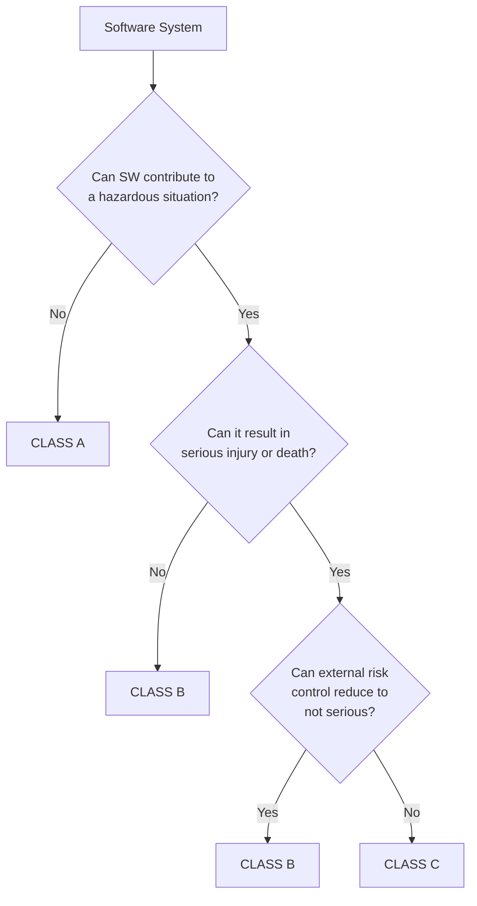
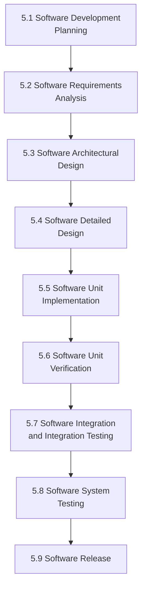
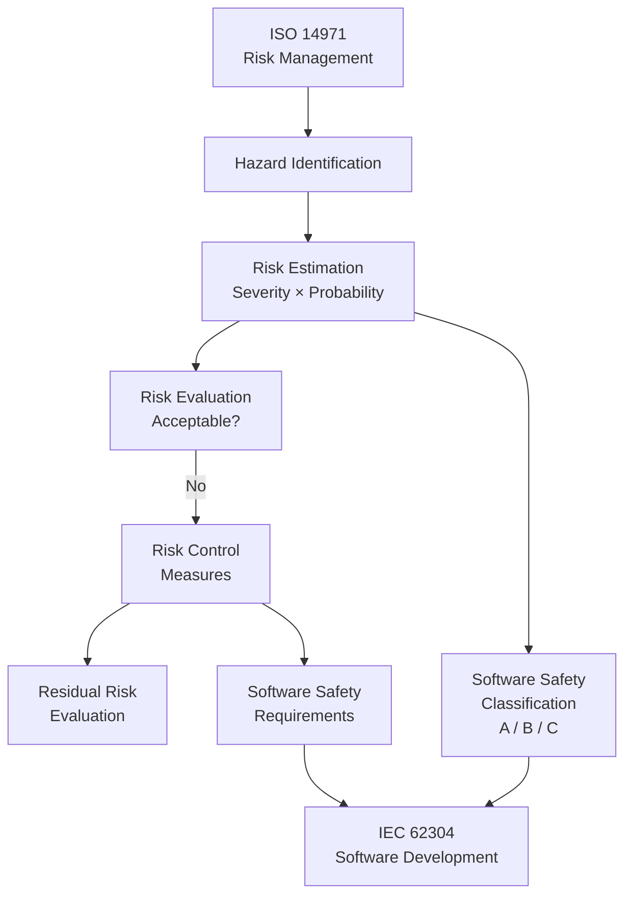
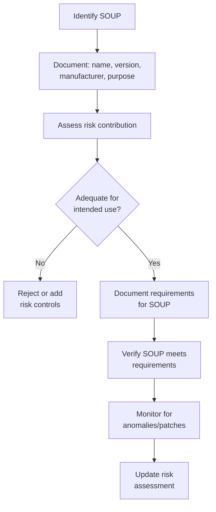
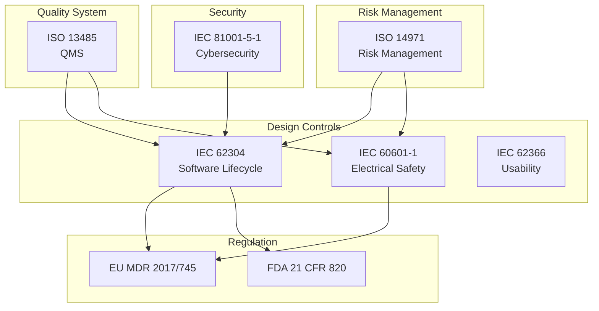
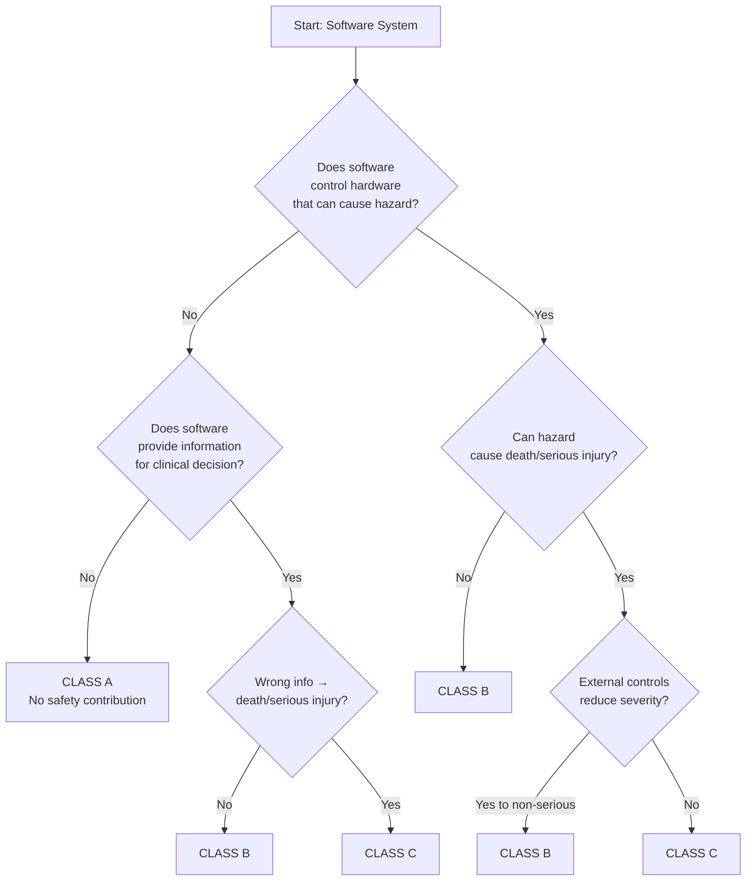

# IEC 62304 — Medical Device Software Lifecycle

**Standard:** IEC 62304:2006+AMD1:2015  
**Title:** Medical Device Software — Software Life Cycle Processes  
**SDO:** IEC TC62/SC62A (jointly with ISO TC 210)  
**Audience:** Medical device software engineers, regulatory affairs, quality managers  
**Prerequisites:** ISO 14971 (risk management), IEC 60601-1 (basic safety), basic SDLC

---

## Chapter 1 — Historical Context & Origin Story

### 1.1 Medical Device Software Context

Medical devices increasingly rely on software — from simple infusion pump controllers to AI-powered diagnostic imaging. Software failures can directly harm or kill patients:

- **Therac-25 (1985-87):** 6 deaths from radiation overdose due to software race condition
- **Infusion pump recalls (2005-2015):** FDA recalled 87 infusion pump models, many for software defects
- **Insulin pump vulnerabilities (2019):** Remote exploitation possible on Medtronic pumps

### 1.2 Development History

| Year | Milestone |
|------|-----------|
| 1997 | EU MDD 93/42/EEC references quality systems |
| 2000 | FDA guidance on software validation |
| 2006 | IEC 62304:2006 published (Edition 1) |
| 2015 | IEC 62304 Amendment 1 (legacy software, Class A clarification) |
| 2017 | EU MDR 2017/745 replaces MDD (stronger software requirements) |
| 2020 | FDA Software as Medical Device (SaMD) framework |
| 2021 | IMDRF guidance on AI/ML medical devices |
| 2022 | IEC 81001-5-1 (Health software cybersecurity) |
| 2025+ | IEC 62304 Edition 2 development (AI, agile, cybersecurity) |

### 1.3 Key Principle: Risk-Based Approach

IEC 62304 is **minimalist compared to ISO 26262 or DO-178C** — deliberately so:
- Medical device development is already governed by QMS (ISO 13485)
- Risk management is separately specified (ISO 14971)
- 62304 focuses ONLY on software lifecycle processes
- Rigor scales with software safety classification (Class A/B/C)

---

## Chapter 2 — Standard Architecture & Structure

### 2.1 Standard Structure

| Clause | Title | Content |
|--------|-------|---------|
| 1-3 | Scope, References, Terms | Definitions and applicability |
| 4 | General requirements | QMS, risk management, software safety classification |
| 5 | Software development process | Planning, requirements, design, coding, testing, release |
| 6 | Software maintenance process | Problem resolution, modification |
| 7 | Software risk management process | Link to ISO 14971 |
| 8 | Software configuration management | Identification, change control, tracing |
| 9 | Software problem resolution | Tracking, analysis, resolution |

### 2.2 Software Safety Classification

| Class | Definition | Process Rigor |
|-------|-----------|---------------|
| **Class A** | No contribution to hazardous situation | Minimal (basic development) |
| **Class B** | Can contribute to hazardous situation, but NOT serious injury/death | Moderate (architecture, verification) |
| **Class C** | Can contribute to hazardous situation resulting in serious injury/death | Full (all clauses apply with maximum rigor) |

**Classification rules:**


### 2.3 Process Requirements by Class

| Process | Class A | Class B | Class C |
|---------|---------|---------|---------|
| Development planning | Required | Required | Required |
| Requirements analysis | Required | Required | Required |
| Architectural design | — | Required | Required |
| Detailed design | — | — | Required |
| Unit implementation | Required | Required | Required |
| Unit verification | — | Required | Required |
| Integration testing | — | Required | Required |
| System testing | Required | Required | Required |
| Release | Required | Required | Required |

---

## Chapter 3 — Technical Deep Dive

### 3.1 Software Development Process (Clause 5)



### 3.2 Requirements Analysis (5.2)

**Software requirements shall include:**
- Functional requirements (derived from system requirements)
- Performance requirements (timing, throughput)
- Interface requirements (inputs/outputs, communication protocols)
- Safety requirements (from ISO 14971 risk management)
- Cybersecurity requirements (from IEC 81001-5-1)
- Software system inputs and outputs
- Error handling and recovery

### 3.3 Architectural Design (5.3) — Class B and C

**Architecture must define:**
- Software items and their organization
- Interfaces between software items
- Interfaces with external components (hardware, other systems)
- SOUP (Software of Unknown Provenance) identification
- Segregation of items with different safety classifications

**SOUP (Third-party/Open-source software):**

| Requirement | Class A | Class B | Class C |
|-------------|---------|---------|---------|
| Identify SOUP | Required | Required | Required |
| Document SOUP version | Required | Required | Required |
| Verify SOUP requirements | — | Required | Required |
| Document anomalies | — | Required | Required |
| Evaluate SOUP risk | — | Required | Required |
| Functional performance verification | — | Required | Required |

### 3.4 Verification and Testing

| Activity | Class A | Class B | Class C |
|----------|---------|---------|---------|
| Requirements verification | Required | Required | Required |
| Design verification | — | — | Required |
| Unit testing | — | Required | Required |
| Integration testing | — | Required | Required |
| System testing | Required | Required | Required |
| Traceability (req → test) | — | Required | Required |
| Regression testing | — | Required | Required |
| Anomaly assessment | Required | Required | Required |

### 3.5 Relationship to ISO 14971



---

## Chapter 4 — Implementation Guide

### 4.1 Practical Implementation Steps

**Step 1 — Safety Classification:**
1. Perform risk analysis (ISO 14971)
2. Identify hazardous situations involving software
3. Classify software system (Class A/B/C)
4. If possible, segregate into items with different classifications

**Step 2 — Development Planning:**
1. Select lifecycle model (V-model, iterative, agile)
2. Define deliverables for each phase
3. Identify tools and methods
4. Define verification strategy
5. Plan for SOUP management

**Step 3 — Development:**
1. Requirements (derived from system + safety)
2. Architecture (for Class B/C)
3. Detailed design (for Class C)
4. Implementation with coding standards
5. Verification (unit → integration → system)

**Step 4 — Release:**
1. All verification activities complete
2. Known anomalies evaluated and accepted
3. All documented procedures followed
4. Configuration identified and controlled
5. Release notes prepared

### 4.2 Agile Development with IEC 62304

**IEC 62304 does NOT mandate V-model.** The standard specifies WHAT must be done, not HOW:

| IEC 62304 Activity | Agile Implementation |
|--------------------|---------------------|
| Development planning | Release planning + sprint planning |
| Requirements analysis | User stories + acceptance criteria |
| Architectural design | Initial architecture + architecture sprints |
| Detailed design | Sprint design (just-in-time) |
| Unit implementation | Sprint coding |
| Verification | Automated tests (CI/CD) |
| System testing | Sprint review + regression |
| Release | Sprint release (with evidence package) |

**Key:** Evidence must still be produced and traceable. Agile doesn't eliminate documentation — it changes WHEN it's created.

### 4.3 SOUP Management Process



---

## Chapter 5 — Certification & Audit

### 5.1 Regulatory Pathways

| Region | Regulation | IEC 62304 Role |
|--------|-----------|----------------|
| EU | MDR 2017/745 | Harmonized standard (presumption of conformity) |
| USA | FDA 21 CFR 820 | Recognized consensus standard |
| Japan | PMDA/MHLW | Essential principles reference |
| Canada | Health Canada CMDR | Referenced standard |
| Australia | TGA | Accepted standard |
| China | NMPA | Referenced (GB equivalent) |

### 5.2 Notified Body Audit Focus

| Area | Key Questions |
|------|--------------|
| Classification | Is the safety classification justified? Risk analysis complete? |
| SOUP | Are all SOUP items identified, versioned, risk-assessed? |
| Traceability | Can every requirement be traced to a test? |
| Anomalies | Are all known bugs assessed for patient safety impact? |
| Configuration | Is the released software version identified and controlled? |
| Maintenance | Is there a process for handling post-market issues? |
| Cybersecurity | Are security risks addressed (IEC 81001-5-1)? |

### 5.3 FDA's Approach

**FDA uses IEC 62304 as "recognized consensus standard":**
- Manufacturers can declare conformity to IEC 62304
- FDA pre-market submission (510(k), PMA, De Novo) references 62304
- Post-market surveillance requires maintenance per Clause 6
- AI/ML devices: Additional guidance (FDA AI/ML action plan)

---

## Chapter 6 — Regional & Domain Variants

### 6.1 IEC 62304 vs. FDA Guidance

| Topic | IEC 62304 | FDA Guidance |
|-------|-----------|-------------|
| Safety classification | Class A/B/C | Level of Concern (minor/moderate/major) |
| Documentation | Process-based | Content-based (what to submit) |
| SOUP | Explicit requirements | "Off-the-shelf software" guidance |
| Agile | Model-agnostic | AAMI TIR45 (Agile guidance) |
| AI/ML | Not addressed (yet) | FDA SaMD AI/ML framework |
| Cybersecurity | Brief (AMD1) + IEC 81001-5-1 | FDA pre-market cybersecurity guidance |

### 6.2 Related Medical Standards

| Standard | Scope | Relationship to 62304 |
|----------|-------|----------------------|
| ISO 14971 | Risk management | Provides safety classification input |
| IEC 60601-1 | Medical electrical equipment | System-level safety |
| ISO 13485 | Medical device QMS | Quality system framework |
| IEC 82304-1 | Health software products | Stand-alone software |
| IEC 81001-5-1 | Health software cybersecurity | Security requirements |
| AAMI TIR45 | Agile practices for medical | Agile implementation guidance |
| AAMI TIR57 | Medical device cybersecurity | Risk management for security |

---

## Chapter 7 — Comparison with Other Safety Standards

| Feature | IEC 62304 | ISO 26262 Part 6 | DO-178C |
|---------|-----------|-------------------|---------|
| **Size** | ~80 pages | ~100 pages | ~300 pages |
| **Complexity** | Low | High | Very high |
| **Classification** | 3 classes (A/B/C) | 5 levels (QM-D) | 5 DALs (A-E) |
| **Hardware included** | No (software only) | Yes (Part 5) | No (DO-254 separate) |
| **Coding standards** | Recommended | MISRA highly recommended | Required per DAL |
| **MC/DC** | Not mentioned | ASIL D recommended++ | DAL A required |
| **Tool qualification** | Mentioned briefly | Part 8 detailed | DO-330 (separate std) |
| **SOUP/COTS** | Detailed | SEooC concept | Limited guidance |
| **Agile friendly** | Yes (model-agnostic) | Emerging (Ed.3) | Emerging |
| **Cost to comply** | $100K-$500K | $200K-$2M | $1M-$10M |

---

## Chapter 8 — Mermaid Architecture Diagrams

### 8.1 IEC 62304 in the Medical Device Ecosystem



### 8.2 Software Safety Classification Decision



---

## Chapter 9 — Case Studies & Failure Analysis

### 9.1 Infusion Pump Software Recalls (2005-2015)

**FDA data:** 87 infusion pump recalls in this period, many software-related.

**Common software failures:**
- Incorrect drug concentration calculations
- Alarm suppression bugs
- User interface confusion leading to wrong settings
- Communication failures between pump and drug library

**IEC 62304 would have required:**
- Safety classification (Class C — can deliver lethal dose)
- Formal requirements analysis (drug calculation verification)
- Architecture design (separation of dosing logic from UI)
- Comprehensive testing (boundary values for all concentrations)

### 9.2 da Vinci Surgical Robot Software Issues

**System:** Intuitive Surgical da Vinci robotic surgery platform  
**Issues:** FDA received reports of unexpected movements, system errors during surgery

**IEC 62304 relevance:**
- Class C software (direct control of surgical instruments inside patient)
- SOUP management critical (OS, communication middleware)
- Cybersecurity increasingly important (connected surgical systems)
- Real-time requirements must be validated (latency → surgeon loses control feel)

### 9.3 AI/ML Diagnostic Software (Emerging)

**Example:** AI-powered medical imaging (radiology, pathology)

**Challenge for IEC 62304:**
- Traditional verification inadequate for neural networks
- Training data = part of "design" (not addressed in 62304)
- Performance degrades over time (data drift)
- Classification: Class C if used for cancer diagnosis

**Current approach:**
- Clinical validation (prospective studies)
- Locked vs. adaptive algorithms (FDA distinction)
- Continuous monitoring of sensitivity/specificity
- Predetermined Change Control Plans (PCCPs)

---

## Chapter 10 — Future Evolution & Industry Trends

### 10.1 IEC 62304 Edition 2 (Expected ~2026-2027)

**Anticipated changes:**
1. **AI/ML software** — Lifecycle for machine learning (training, validation, monitoring)
2. **Cybersecurity** — Integration with IEC 81001-5-1
3. **Agile/DevOps** — Explicit agile lifecycle support
4. **SaMD** — Software as a Medical Device specific guidance
5. **Continuous deployment** — Over-the-air updates, cloud connectivity
6. **Interoperability** — Multi-device systems, hospital integration
7. **SBOM** — Software Bill of Materials requirements

### 10.2 Software as Medical Device (SaMD) Trends

| Trend | Implication |
|-------|------------|
| AI/ML diagnostics | New verification paradigms |
| Digital therapeutics | Software IS the therapy |
| Remote monitoring (IoMT) | Cybersecurity critical |
| Clinical Decision Support | Classification challenges |
| Companion diagnostics | Regulated + pharma linkage |
| Wearables crossing to medical | Consumer → regulated transition |

---

## Chapter 11 — Interview Questions & Career Guide

### Tier 1: Entry-Level (0-3 years)

**Q1:** What are the software safety classes in IEC 62304 and how are they determined?  
**A:** Class A (no contribution to hazardous situation), Class B (can contribute to hazard but not death/serious injury), Class C (can contribute to death/serious injury). Determined through ISO 14971 risk analysis — identify hazards involving software, assess severity, consider external risk controls. If no hazard possible → Class A. If hazard possible but not serious → Class B. If serious injury/death possible and not mitigated externally → Class C.

**Q2:** What is SOUP and why does IEC 62304 care about it?  
**A:** SOUP = Software of Unknown Provenance — any software not developed under the manufacturer's QMS (includes open-source, commercial libraries, OS). IEC 62304 requires: identification, version documentation, functional requirements specification, risk assessment, anomaly evaluation, and verification that SOUP meets intended purpose. Critical because SOUP defects become the manufacturer's liability.

### Tier 2: Mid-Level (3-8 years)

**Q3:** Design a verification strategy for a Class C patient monitoring system.  
**A:** (1) Unit testing: All software units with coverage metrics (branch minimum). (2) Integration testing: Interface verification between modules, timing verification for real-time paths. (3) System testing: All requirements verified (vital signs accuracy, alarm thresholds, communication). (4) Risk-based testing: Additional tests for hazardous scenarios identified in ISO 14971 (false alarm suppression, measurement artifact). (5) SOUP verification: Validate OS behavior under load, verify SOUP anomalies don't affect safety. (6) Regression: Automated test suite for every build (CI/CD). (7) Traceability: Every requirement → test case(s) bidirectional.

### Tier 3: Senior/Lead (8-15 years)

**Q4:** How would you implement agile development for a Class C medical device while maintaining IEC 62304 compliance?  
**A:** (1) Safety classification at product backlog level (each user story tagged with safety class). (2) "Definition of Done" includes IEC 62304 evidence (requirements traceable, tests run, anomalies assessed). (3) Sprint-level: design → implement → verify within sprint; architecture decisions in architecture sprints early. (4) Release-level: cumulative evidence package (all sprints' artifacts compiled). (5) CI/CD: automated testing (unit, integration, system regression) runs every commit. (6) Risk management: living risk analysis updated each sprint (new hazards from new features). (7) SOUP: automated dependency scanning in pipeline. (8) Quality gates: cannot merge without passing automated verification + peer review.

### Tier 4: Principal/Distinguished (15+ years)

**Q5:** How should IEC 62304 evolve to address AI/ML-based medical devices?  
**A:** (1) **New lifecycle phase: Training/Learning** — formalize training data as design input (quality criteria, bias analysis, representativeness). (2) **Validation over verification:** For ML, system-level clinical validation (sensitivity/specificity on independent test set) is more meaningful than code-level verification. (3) **Continuous monitoring:** Post-market performance monitoring mandatory (detect drift, report degradation). (4) **Predetermined Change Control Plan:** FDA concept — define boundaries within which AI can be updated without new submission. (5) **Classification challenge:** An AI that misdiagnoses cancer is Class C, but how do you verify a neural network to Class C rigor? → Statistical confidence bounds on performance, not deterministic proof. (6) **SOUP for pre-trained models:** Transfer learning uses models trained on non-medical data — how to qualify?

---

## Chapter 12 — Cheat Sheet & Quick Reference

### IEC 62304 Process Requirements Summary

| Clause | Activity | Class A | Class B | Class C |
|--------|----------|---------|---------|---------|
| 5.1 | Development planning | ✓ | ✓ | ✓ |
| 5.2 | Requirements analysis | ✓ | ✓ | ✓ |
| 5.3 | Architectural design | — | ✓ | ✓ |
| 5.4 | Detailed design | — | — | ✓ |
| 5.5 | Unit implementation | ✓ | ✓ | ✓ |
| 5.6 | Unit verification | — | ✓ | ✓ |
| 5.7 | Integration & integration testing | — | ✓ | ✓ |
| 5.8 | System testing | ✓ | ✓ | ✓ |
| 5.9 | Release | ✓ | ✓ | ✓ |
| 6 | Maintenance | ✓ | ✓ | ✓ |
| 7 | Risk management | ✓ | ✓ | ✓ |
| 8 | Configuration management | ✓ | ✓ | ✓ |
| 9 | Problem resolution | ✓ | ✓ | ✓ |

### Key Relationships

```
ISO 13485 (QMS) → provides quality system framework
ISO 14971 (Risk) → provides safety classification input + safety requirements
IEC 62304 (SW) → defines software development process
IEC 60601-1 (Safety) → defines system safety requirements
IEC 81001-5-1 (Security) → defines cybersecurity requirements
IEC 82304-1 (Health SW) → stand-alone software product requirements
```

### Classification Quick Decision

```
Can software contribute to hazard?
├── No → CLASS A (minimal process)
└── Yes → Can it cause death/serious injury?
    ├── No → CLASS B (architecture + verification)
    └── Yes → Can external controls reduce to non-serious?
        ├── Yes → CLASS B
        └── No → CLASS C (full process)
```

---

*End of Document — 05_IEC_62304_Medical_Device_SW.md*
