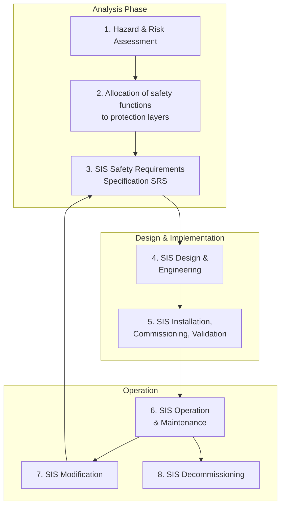
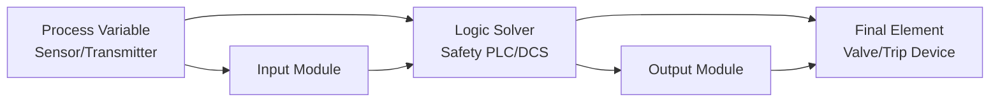
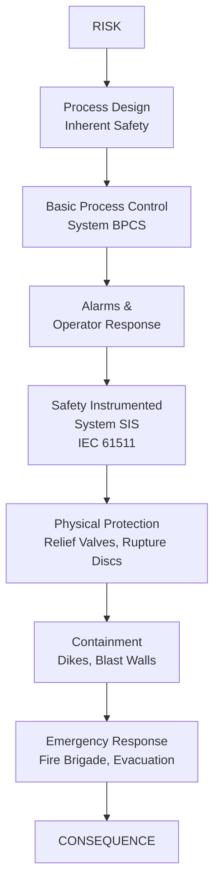
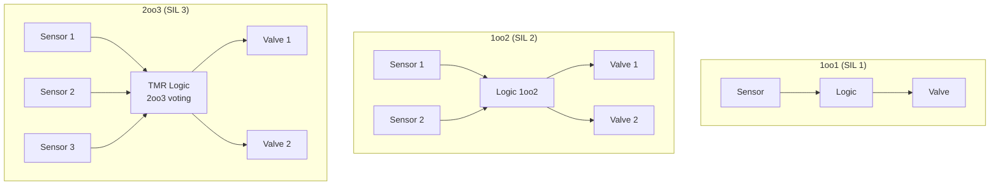
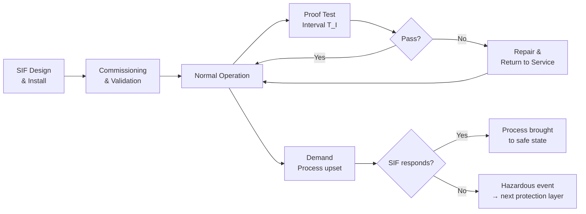

# IEC 61511 — Safety Instrumented Systems for Process Industry

**Standard:** IEC 61511:2016 (Edition 2)  
**Title:** Functional Safety — Safety Instrumented Systems for the Process Industry Sector  
**SDO:** IEC TC65/SC65A  
**Parts:** 3 Parts  
**Audience:** Process safety engineers, SIS designers, control system integrators, HAZOP facilitators  
**Prerequisites:** IEC 61508 basics, process control fundamentals, HAZOP methodology

---

## Chapter 1 — Historical Context & Origin Story

### 1.1 Process Industry Safety Context

The process industry (oil & gas, chemicals, pharmaceuticals, power generation) handles **hazardous materials at scale.** A single failure can cause explosions, toxic releases, or environmental disasters affecting thousands.

**Safety Instrumented Systems (SIS)** are the last automated line of defense — they detect abnormal conditions and take the process to a safe state (typically: shutdown, depressurize, isolate).

### 1.2 Key Accidents Driving IEC 61511

| Year | Accident | Deaths | Impact |
|------|----------|--------|--------|
| 1974 | Flixborough (UK) | 28 | Triggered safety system review |
| 1984 | Bhopal (India) | 3,787+ | Safety system was disabled |
| 1988 | Piper Alpha (UK) | 167 | Safety systems overwhelmed |
| 2005 | Texas City Refinery (USA) | 15 | Level instruments failed |
| 2005 | Buncefield (UK) | 0 (43 injured) | High-level switch failed |
| 2010 | Deepwater Horizon (USA) | 11 | BOP SIS failed |

### 1.3 IEC 61511 vs. IEC 61508

| Feature | IEC 61508 | IEC 61511 |
|---------|-----------|-----------|
| Scope | Generic (all industries) | Process industry only |
| Target users | Developers/manufacturers | End users/integrators |
| Hardware | Develops new safety systems | Integrates existing certified components |
| SIL achievable | SIL 1-4 | SIL 1-3 (no SIL 4 for SIS in process) |
| Proven in use | Concept defined | Practical guidelines for field devices |
| Application | Creates the components | Applies components in safety functions |

---

## Chapter 2 — Standard Architecture & Structure

### 2.1 Three-Part Structure

| Part | Title | Content |
|------|-------|---------|
| **Part 1** | Framework, definitions, system, hardware and application programming requirements | Main requirements |
| **Part 2** | Guidelines for the application of IEC 61511-1 | Application guidance |
| **Part 3** | Guidance for the determination of the required SIL | SIL assignment methods |

### 2.2 Safety Lifecycle (IEC 61511)



### 2.3 Safety Instrumented Function (SIF) Architecture



**Three subsystems of a SIF:**
1. **Sensor subsystem** — transmitters, switches, analyzers
2. **Logic solver subsystem** — safety PLC, relay-based logic, DCS safety function
3. **Final element subsystem** — shutdown valves, motor contactors, relief devices

---

## Chapter 3 — Technical Deep Dive

### 3.1 SIL Determination Methods (Part 3)

| Method | Type | Description |
|--------|------|-------------|
| Risk graph | Semi-quantitative | Graphical risk categorization |
| Risk matrix | Semi-quantitative | Severity vs. likelihood table |
| LOPA (Layers of Protection Analysis) | Semi-quantitative/quantitative | IPL credit methodology |
| Quantitative risk assessment | Fully quantitative | Event tree + fault tree |

### 3.2 LOPA — The Primary Method for Process Industry

**LOPA principles:**
1. Start with an initiating event (IE) and its frequency
2. Each Independent Protection Layer (IPL) provides a probability of failure on demand (PFD)
3. Calculate residual risk = IE frequency × PFD(IPL1) × PFD(IPL2) × ...
4. Compare against tolerable risk target
5. If gap exists → SIS required with PFDavg to fill the gap

**LOPA example:**

| Factor | Value | Description |
|--------|-------|-------------|
| Initiating Event frequency | 0.1/year | Vessel overpressure from runaway |
| IPL 1: BPCS alarm + response | PFD = 0.1 | Operator responds to high-temp alarm |
| IPL 2: Pressure relief valve | PFD = 0.01 | Sized for runaway rate |
| Risk without SIS | 10⁻⁴/year | 0.1 × 0.1 × 0.01 |
| Tolerable risk target | 10⁻⁵/year | Company/societal criteria |
| **Gap = SIS required PFD** | **0.1 (SIL 1)** | 10⁻⁵ / 10⁻⁴ = 0.1 |

### 3.3 PFDavg Calculations

**1oo1 architecture:**
$$PFD_{avg} = \lambda_{DU} \cdot \frac{T_I}{2}$$

**1oo2 architecture:**
$$PFD_{avg} = (\lambda_{DU})^2 \cdot \left(\frac{T_I^2}{3} + T_I \cdot MTTR\right) + \beta \cdot \lambda_{DU} \cdot \frac{T_I}{2}$$

**2oo3 architecture:**
$$PFD_{avg} = 3 \cdot (\lambda_{DU})^2 \cdot \left(\frac{T_I^2}{3} + T_I \cdot MTTR\right) + \beta \cdot \lambda_{DU} \cdot \frac{T_I}{2}$$

Where:
- $T_I$ = Proof test interval
- $MTTR$ = Mean time to restore
- $\beta$ = Common cause factor
- $\lambda_{DU}$ = Dangerous undetected failure rate

### 3.4 Proof Testing

**Proof test = periodic testing that detects failures not found by automatic diagnostics**

| SIL | Maximum proof test interval (typical) | Reasoning |
|-----|--------------------------------------|-----------|
| SIL 1 | 5-10 years | PFDavg ≤ 0.1 achievable |
| SIL 2 | 1-5 years | PFDavg ≤ 0.01 needs shorter interval |
| SIL 3 | 3-12 months | PFDavg ≤ 0.001 needs frequent testing |

**Proof test coverage:** Not all failures can be detected by proof testing
$$PFD_{avg} = \lambda_{DU,P} \cdot \frac{T_I}{2} + \lambda_{DU,NP} \cdot \frac{T_{Life}}{2}$$

Where: P = detected by proof test, NP = not detected (needs overhaul/replacement)

### 3.5 Architecture Constraints (Hardware Fault Tolerance)

| SIL | Minimum HFT (Type A - well-understood) | Minimum HFT (Type B - complex) |
|-----|----------------------------------------|--------------------------------|
| SIL 1 | 0 | 0 |
| SIL 2 | 0 (if SFF > 90%) or 1 | 1 |
| SIL 3 | 1 (if SFF > 90%) or 2 | 2 |

---

## Chapter 4 — Implementation Guide

### 4.1 SIS Design Process

**Step 1 — Safety Requirements Specification (SRS):**
- Define each Safety Instrumented Function (SIF)
- Specify required SIL for each SIF
- Define safe state for each SIF
- Specify process conditions (trip setpoints)
- Define response time requirements
- Specify proof test requirements

**Step 2 — Architecture Selection:**

| SIF SIL | Typical Architecture | Sensor | Logic | Final Element |
|---------|---------------------|--------|-------|---------------|
| SIL 1 | 1oo1 or 1oo2 | Single transmitter | Safety PLC | Single valve |
| SIL 2 | 1oo2 | Dual transmitter | Safety PLC (1oo2D) | 1oo2 valves |
| SIL 3 | 2oo3 | Triple transmitter | TMR logic solver | 1oo2 or 2oo3 valves |

**Step 3 — Component Selection:**
- Use SIL-certified devices (IEC 61508 certificate)
- Or demonstrate "proven in use" per IEC 61511 clause 11.5
- Document failure rate data (FMEDA, field data)

**Step 4 — SIL Verification (PFDavg calculation):**
- Model each SIF (sensor + logic + final element)
- Calculate PFDavg using reliability data
- Verify PFDavg meets target SIL
- Consider common cause failures (β factor)

### 4.2 Proven in Use (IEC 61511 Clause 11.5)

**For existing field devices without SIL certificate:**
1. Adequate specification exists for intended application
2. Evidence of successful operation in similar applications
3. Statistical data shows acceptable failure rate
4. Device has been in use for sufficient duration
5. Configuration management since evidence was collected
6. No modifications since evidence collection

**Guidance on operating experience:**
- 10+ installations for >1 year with no dangerous failures
- Or quantitative evidence (10⁶+ device-hours with documented failures)

### 4.3 Application Programming (IEC 61511 Clause 12)

**Requirements for SIS logic (safety PLC programming):**
- Use limited language (typically FBD, LD, or restricted ST)
- No dynamic memory allocation
- No recursion
- All paths deterministic
- Cycle time bounded and verified
- Watchdog timer for program execution
- Diagnostic coverage of I/O and processor

---

## Chapter 5 — Certification & Audit

### 5.1 SIS Assessment (Functional Safety Assessment)

| Phase | Assessment Focus |
|-------|-----------------|
| Phase 1 (Concept) | HAZOP complete? SIL determination correct? |
| Phase 2 (Design) | Architecture meets SIL? Components certified/proven? |
| Phase 3 (Implementation) | Wiring correct? Programming reviewed? |
| Phase 4 (Commissioning) | FAT/SAT passed? Proof tests documented? |
| Phase 5 (Operation) | Proof testing on schedule? Demand rate as expected? |

### 5.2 SIL Verification Report

A complete SIL verification includes:
1. PFDavg calculation for each SIF
2. Architectural constraints check (HFT, SFF)
3. Response time calculation vs. process safety time
4. Common cause failure analysis (β factor application)
5. Diagnostic test interval verification
6. Proof test procedure validation

### 5.3 Key Assessment Bodies (Process Industry)

| Body | Specialization |
|------|---------------|
| Exida | SIL verification, FMEDA, SIS assessment |
| TÜV SÜD/Rheinland | Full FSA, component SIL certification |
| FM Global/FM Approvals | Fire/explosion protection, SIS |
| IChemE (UK) | Process safety assessment |
| AIChE/CCPS (USA) | LOPA methodology, process safety |

---

## Chapter 6 — Regional & Domain Variants

### 6.1 IEC 61511 vs. ANSI/ISA 84

| Feature | IEC 61511 | ANSI/ISA 84 (USA adoption) |
|---------|-----------|--------------------------|
| Status | International standard | US national adoption of IEC 61511 |
| Deviations | — | Some ISA notes/exceptions |
| Application | Global | North America primarily |
| OSHA reference | Indirect | Direct (29 CFR 1910.119 PSM) |
| Proven in use | Clause 11.5 | Additional ISA guidance |

### 6.2 Edition 1 vs. Edition 2

| Topic | Edition 1 (2003) | Edition 2 (2016) |
|-------|-----------------|-----------------|
| Cybersecurity | Not mentioned | Referenced (IEC 62443) |
| Proof test coverage | Assumed 100% | Partial proof test recognized |
| Useful life | Not explicit | Explicit degradation/wearout |
| Smart transmitters | Limited | Enhanced HART/fieldbus guidance |
| Architecture constraints | Table-based | Aligned with IEC 61508 Ed.2 |
| Fire & gas | Brief mention | Enhanced F&G guidance |

---

## Chapter 7 — Comparison with Related Standards

| Feature | IEC 61511 (Process) | ISO 26262 (Auto) | IEC 62061 (Machinery) |
|---------|---------------------|-------------------|-----------------------|
| Industry | Oil/gas, chemical, pharma | Automotive | Industrial machinery |
| Users | Plant operators, integrators | OEMs, Tier-1 suppliers | Machine builders |
| SIL range | 1-3 | ASIL QM-D | SIL 1-3 |
| Lifecycle | Decades (plant life) | 15-20 years (vehicle) | 10-30 years (machine) |
| Volume | 1 system per SIF | Millions per model | Tens to thousands |
| Key metric | PFDavg (low demand) | SPFM, LFM, PMHF | PFH or PFDavg |
| Proof testing | Critical (maintains PFD) | Not applicable (continuous) | Applicable for demand mode |
| Cybersecurity | IEC 62443 reference | ISO/SAE 21434 | IEC 62443 |
| Key analysis | LOPA, HAZOP | HARA | Risk assessment per 12100 |

---

## Chapter 8 — Mermaid Architecture Diagrams

### 8.1 Protection Layers (Defense in Depth)



### 8.2 SIF Architectures



### 8.3 SIS Lifecycle with Proof Testing



---

## Chapter 9 — Case Studies & Failure Analysis

### 9.1 Texas City Refinery Explosion (2005)

**System:** Raffinate splitter tower level protection  
**SIF:** High-level in blowdown drum → close feed valve  
**Failure:** Level instruments gave false low reading, level transmitter connections blocked

**Root causes (SIS perspective):**
- Level instruments were maintenance-overdue
- No diversity in level measurement (all same technology)
- Proof testing was inadequate/overdue
- Alarm management failure (operators desensitized)

**IEC 61511 lessons:**
- Proof testing MUST be on schedule
- Diverse measurement technologies for SIL 2+ SIFs
- Alarm rationalization essential
- SIF response time must account for process dynamics

### 9.2 Buncefield Fuel Storage Terminal (2005)

**System:** Tank overfill protection  
**SIF:** Independent High-Level Switch (IHLS)  
**Failure:** IHLS was stuck/not functioning; had not been proof-tested

**IEC 61511 analysis:**
- PFDavg requirement for SIL 1 (~0.1): achievable with annual proof test
- But proof test was NOT performed → actual PFD approached 1.0
- Single level switch with no redundancy = 1oo1 architecture (max SIL 1)
- No diagnostic on switch health → degraded without detection

---

## Chapter 10 — Future Evolution & Industry Trends

### 10.1 Industry 4.0 Impact on SIS

| Trend | Impact on IEC 61511 |
|-------|---------------------|
| Smart transmitters (HART/FF) | Enhanced diagnostics, partial stroke testing |
| Wireless (ISA100/WirelessHART) | Additional latency considerations for SIF response |
| Edge computing | Potential for SIS in virtualized environments (controversial) |
| Digital twin | Simulate SIF behavior for optimization |
| Predictive maintenance | Extend proof test intervals based on condition |
| Cybersecurity | IEC 62443 integration critical |
| Cloud analytics | SIS performance data for fleet management |

### 10.2 Partial Stroke Testing (PST)

**Concept:** Test final element (valve) without full process shutdown  
- Move valve 10-20% to verify it can move
- Detects stem sticking, actuator pressure loss, solenoid failure
- Increases diagnostic coverage of final element
- Can extend full proof test interval

**PFDavg benefit:**
$$PFD_{with PST} < PFD_{without PST} \text{ (improved DC of final element)}$$

---

## Chapter 11 — Interview Questions & Career Guide

### Tier 1: Entry-Level (0-3 years)

**Q1:** What is a Safety Instrumented Function (SIF)?  
**A:** A SIF is a single safety function implemented by an SIS. It consists of sensors that detect a hazardous condition, a logic solver that processes the signals and makes a decision, and final elements that take the process to a safe state. Example: "High pressure in reactor → close feed valve" is one SIF. Each SIF has its own SIL target and PFDavg requirement.

**Q2:** What is proof testing and why is it critical?  
**A:** Proof testing is periodic testing to detect dangerous undetected failures in SIS components — failures that are NOT found by automatic diagnostics. Essential because PFDavg depends directly on proof test interval. Example: A pressure switch stuck in "normal" position won't trip on high pressure — only a proof test (simulating high pressure or forcing the switch) detects this. Without proof testing, PFDavg degrades to unacceptable levels over time.

### Tier 2: Mid-Level (3-8 years)

**Q3:** Perform a LOPA for a reactor overpressure scenario.  
**A:** (1) Initiating Event: Cooling water failure → runaway reaction. Frequency: 0.5/year. (2) IPL 1: BPCS high-temp alarm + operator response: PFD = 0.1 (10 min available). (3) IPL 2: Emergency cooling system: PFD = 0.01 (SIL 1 certified). (4) Unmitigated risk with existing IPLs: 0.5 × 0.1 × 0.01 = 5 × 10⁻⁴/year. (5) Target: 10⁻⁵/year (company societal risk criteria). (6) Gap requiring SIS: 10⁻⁵ / 5×10⁻⁴ = 0.02 → PFD ≤ 0.01 → SIL 2 SIS required. (7) SIF design: 1oo2 pressure transmitters + safety PLC + 1oo2 ESD valves. Target PFDavg < 0.01.

### Tier 3: Senior/Lead (8-15 years)

**Q4:** Your plant has 200 SIFs. How do you manage proof testing efficiently?  
**A:** (1) Risk-based scheduling: SIL 3 SIFs monthly, SIL 2 annually, SIL 1 every 2-5 years. (2) Online testing where possible: partial valve stroke testing (PST) quarterly → extends full stroke test interval. (3) Staggered scheduling: avoid all tests during same shutdown (reduces production impact). (4) Diagnostic credit: modern smart transmitters provide high DC → reduces pressure on proof test interval. (5) Proof test effectiveness tracking: document coverage percentage, failures found → feeds back to PFDavg calculation. (6) Technology selection: choose devices with high diagnostic coverage to reduce proof test burden. (7) Turnaround alignment: schedule full tests during planned maintenance turnarounds.

### Tier 4: Principal/Distinguished (15+ years)

**Q5:** A chemical company asks: "Can we use virtualized safety controllers (cloud SIS)?" Your response?  
**A:** Currently NO for several reasons: (1) IEC 61511 requires dedicated, tested hardware for logic solver (clause 11.4). Virtualization introduces hypervisor as additional failure point not quantifiable per 61508. (2) Network dependency: cloud SIS requires guaranteed latency — current networks can't guarantee process safety time requirements deterministically. (3) Cybersecurity: internet-connected SIS violates fundamental separation principle (IEC 62443 zone/conduit model). (4) Common cause: multiple SIFs on same cloud infrastructure = massive common cause (one hypervisor bug = all SIFs fail). (5) Future possibility: edge computing with certified runtime environment, dedicated hardware partitions, and formal safety time guarantees MIGHT eventually be acceptable — but technology and standards aren't there yet. (6) What IS possible: cloud-based SIS performance MONITORING (not control) — gathering diagnostic data, optimizing proof test intervals.

---

## Chapter 12 — Cheat Sheet & Quick Reference

### SIL Target Table (Low Demand Mode)

| SIL | PFDavg | Risk Reduction Factor |
|-----|--------|----------------------|
| 1 | 0.01 to 0.1 | 10 to 100 |
| 2 | 0.001 to 0.01 | 100 to 1,000 |
| 3 | 0.0001 to 0.001 | 1,000 to 10,000 |

### Typical Failure Rates (Process Industry)

| Component | λDU (per hour) typical | Technology |
|-----------|----------------------|-----------|
| Pressure transmitter | 1-5 × 10⁻⁷ | Smart 4-20mA |
| Temperature sensor (RTD) | 2-8 × 10⁻⁷ | RTD + transmitter |
| Flow transmitter | 3-10 × 10⁻⁷ | Coriolis/magnetic |
| Safety PLC (1oo1D) | 1-5 × 10⁻⁷ | Certified safety PLC |
| Safety PLC (1oo2D) | 1-5 × 10⁻⁹ | Redundant safety PLC |
| Solenoid valve | 5-20 × 10⁻⁷ | De-energize to trip |
| Shutdown valve (spring return) | 5-30 × 10⁻⁷ | Globe/ball valve |
| Motor contactor | 3-10 × 10⁻⁷ | De-energize to trip |

### LOPA Quick Template

```
IE Frequency: ___/year
× IPL 1 PFD: ___
× IPL 2 PFD: ___
× ... = Intermediate event frequency: ___/year
÷ Target frequency: ___/year
= Required SIF PFD: ___
→ SIL: ___
```

---

*End of Document — 06_IEC_61511_Process_Industry.md*
