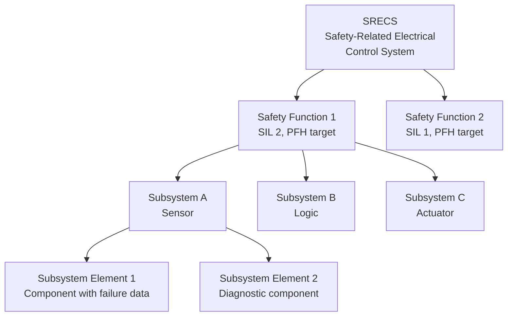
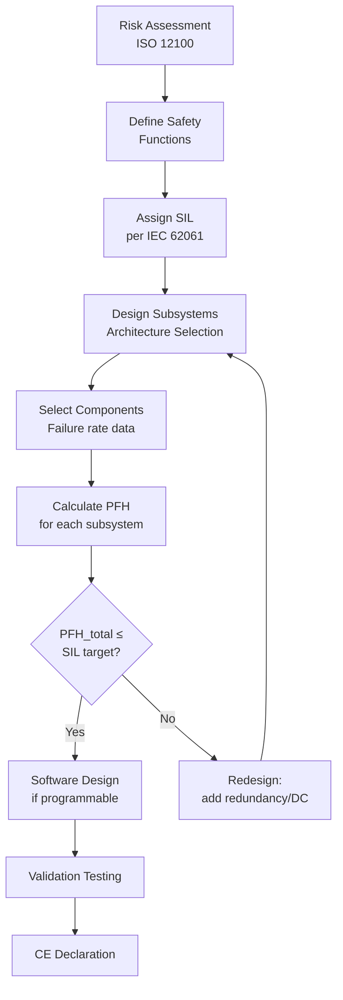
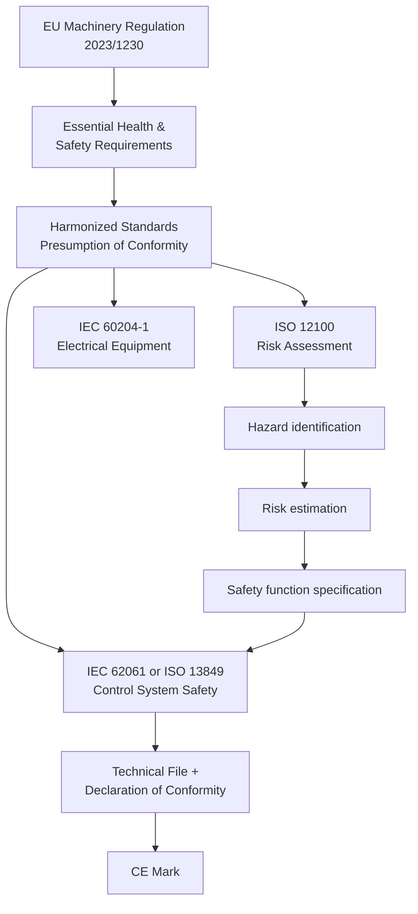
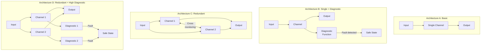
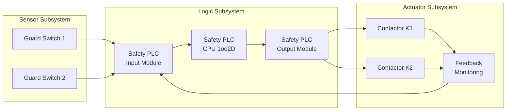

# IEC 62061 — Safety of Machinery (Functional Safety of SRECS)

**Standard:** IEC 62061:2021 (Edition 2)  
**Title:** Safety of Machinery — Functional Safety of Safety-Related Control Systems  
**SDO:** IEC TC44 (jointly with ISO TC199)  
**Audience:** Machine builders, control system integrators, safety engineers, CE compliance specialists  
**Prerequisites:** IEC 61508 concepts, ISO 12100 (risk assessment), basic control system design

---

## Chapter 1 — Historical Context & Origin Story

### 1.1 Machinery Safety Context

Industrial machinery — robots, presses, CNC machines, automated production lines — must protect operators from harm. Machine control systems increasingly use electronic/programmable technology for safety functions, replacing hardwired relay logic.

### 1.2 Evolution of Machinery Safety Standards

| Year | Milestone |
|------|-----------|
| 1989 | EU Machinery Directive 89/392/EEC (original) |
| 1995 | EN 954-1: Safety-related parts of control systems (categories B, 1-4) |
| 1998 | IEC 61508: Generic functional safety (reference framework) |
| 2005 | IEC 62061 Edition 1: E/E/PE safety systems for machinery |
| 2006 | ISO 13849-1: Successor to EN 954-1 (Performance Levels) |
| 2015 | ISO 13849-1 Edition 3 (revised) |
| 2021 | IEC 62061 Edition 2: Major overhaul, aligned with ISO 13849 |
| 2023 | EU Machinery Regulation 2023/1230 (replaces Directive, effective 2027) |

### 1.3 IEC 62061 vs. ISO 13849-1

These are **parallel standards for the same application domain** — a historical artifact:

| Feature | IEC 62061 | ISO 13849-1 |
|---------|-----------|-------------|
| Origin | IEC (electrical) | ISO (mechanical) |
| Metric | SIL (1-3) + PFH | PL (a-e) + PFH |
| Scope (Ed.1) | E/E/PE systems only | All technologies |
| Scope (Ed.2) | All technologies | All technologies |
| Design method | Subsystem-based, quantitative | Category + DC + CCF |
| Suited for | Complex programmable systems | Simpler systems, mixed technologies |
| CE marking | Both acceptable under Machinery Directive/Regulation |

**Note:** Since Edition 2 (2021), IEC 62061 can be used for ALL technologies (including pneumatic, hydraulic, mechanical), resolving the historical limitation.

---

## Chapter 2 — Standard Architecture & Structure

### 2.1 Standard Organization (Edition 2)

| Clause | Title |
|--------|-------|
| 1-3 | Scope, References, Terms |
| 4 | Risk assessment & safety function specification |
| 5 | Design of SRECS |
| 6 | Design of subsystems |
| 7 | System behavior on fault |
| 8 | Software requirements |
| 9 | Validation |
| 10 | Modification |
| 11 | Information for use |

### 2.2 Key Concepts



**Hierarchy:**
1. **SRECS** — The complete safety-related control system
2. **Safety Function** — A specific protective action (e.g., "Stop press when guard opens")
3. **Subsystem** — A functional unit (sensor, logic, actuator)
4. **Subsystem Element** — Individual component with failure rate data

---

## Chapter 3 — Technical Deep Dive

### 3.1 SIL Assignment from Risk Assessment

IEC 62061 uses severity (Se), frequency/duration (Fr), probability of occurrence (Pr), and avoidability (Av):

| Parameter | Values |
|-----------|--------|
| **Se** (Severity) | 1: Reversible, 2: Irreversible, 3: Death/losing eye-arm, 4: Death multiple |
| **Fr** (Frequency) | 3: ≤1/year, 4: >1/month to ≤1/year, 5: >1/day to ≤1/month |
| **Pr** (Probability) | 1: Negligible, 2: Rarely, 3: Likely, 4: Very high |
| **Av** (Avoidability) | 1: Likely, 3: Possible, 5: Impossible |

**Class (Cl) = Fr + Pr + Av**

| Se \ Cl | 4-5 | 6-7 | 8-10 | 11-13 | 14-15 |
|---------|-----|-----|------|-------|-------|
| 4 | SIL 2 | SIL 2 | SIL 2 | SIL 3 | SIL 3 |
| 3 | — | SIL 1 | SIL 2 | SIL 2 | SIL 3 |
| 2 | — | — | SIL 1 | SIL 1 | SIL 2 |
| 1 | — | — | — | — | SIL 1 |

### 3.2 PFH (Probability of Dangerous Failure per Hour)

| SIL | PFH_D (per hour) |
|-----|------------------|
| SIL 1 | ≥ 10⁻⁶ to < 10⁻⁵ |
| SIL 2 | ≥ 10⁻⁷ to < 10⁻⁶ |
| SIL 3 | ≥ 10⁻⁸ to < 10⁻⁷ |

**Safety function PFH = sum of subsystem PFHs:**
$$PFH_{SF} = PFH_{sensor} + PFH_{logic} + PFH_{actuator}$$

### 3.3 Subsystem Design — Architecture Categories

| Architecture | Description | HFT | Typical SIL achievable |
|--------------|-------------|-----|----------------------|
| A (Basic) | Single channel, no diagnostics | 0 | SIL 1 (limited) |
| B (Single + diagnostics) | Single channel with monitoring | 0 | SIL 1-2 |
| C (Redundant) | Dual channel, cross-monitoring | 1 | SIL 2-3 |
| D (Redundant + diagnostics) | Dual channel, high diagnostics | 1 | SIL 3 |

### 3.4 Subsystem PFH Calculation

**For Architecture B (1oo1D):**
$$PFH_D = \lambda_D \cdot (1 - DC) + \lambda_D \cdot DC \cdot \frac{MTTR}{T_1}$$

**For Architecture C (1oo2):**
$$PFH_D = (1-\beta) \cdot 2 \cdot [\lambda_{De}^2 \cdot T_2 + \lambda_{De} \cdot \lambda_{Dd} \cdot MTTR] + \beta \cdot \lambda_D$$

Where:
- $DC$ = Diagnostic Coverage
- $MTTR$ = Mean Time to Restoration
- $T_1$ = Diagnostic test interval
- $T_2$ = Proof test interval or mission time
- $\beta$ = Common cause failure factor
- $\lambda_{De}$ = Dangerous undetected failure rate
- $\lambda_{Dd}$ = Dangerous detected failure rate

### 3.5 Diagnostic Coverage (DC)

| DC Level | Range | Example techniques |
|----------|-------|-------------------|
| None | 0% | No diagnostics |
| Low | 60-90% | Voltage monitoring, cross-checking |
| Medium | 90-99% | Self-test, redundancy comparison |
| High | ≥99% | Comprehensive self-test, diverse redundancy |

### 3.6 Common Cause Failure (CCF) Assessment

IEC 62061 uses a scored approach:

| Factor | Points | Examples |
|--------|--------|----------|
| Separation/segregation | 15-25 | Physical separation of channels |
| Diversity | 15-20 | Different manufacturers/technologies |
| Complexity/design | 5-10 | Simple, well-understood design |
| Assessment/analysis | 5 | FMEA performed |
| Competence/training | 5 | Trained personnel |
| Environmental | 10-25 | Protection against environmental effects |

Score ≥ 65 → β factor = 2-5% (acceptable for SIL 2-3)

---

## Chapter 4 — Implementation Guide

### 4.1 Safety Function Specification

**Example Safety Function:**
```
Safety Function: SF-01 Guard Interlocking Press
Description: When guard door is opened, stop press ram within 50ms
Safe State: Press ram stopped, hydraulic pressure released
SIL: SIL 2
Response Time: <50 ms (process: 200 ms available)
Demand Rate: High demand (continuous mode)
```

### 4.2 Design Workflow



### 4.3 Practical Architecture Examples

**SIL 1 — Emergency Stop:**
- Sensor: E-stop button (NC contacts, 1oo1)
- Logic: Safety relay module (Category 3)
- Actuator: Motor contactor (NC, de-energize to stop)
- PFH calculation: ~5 × 10⁻⁶ /h → meets SIL 1

**SIL 2 — Light Curtain + Safety PLC:**
- Sensor: Type 4 light curtain (SIL 3 certified)
- Logic: Safety PLC (1oo2D architecture, SIL 3)
- Actuator: 2 contactors in series (redundant, cross-monitored)
- PFH calculation: ~8 × 10⁻⁷ /h → meets SIL 2

**SIL 3 — Robot cell with door interlock:**
- Sensor: 2 coded magnetic switches (diverse, SIL 2 each, series = SIL 3)
- Logic: Safety PLC (TMR, SIL 3)
- Actuator: 2 diverse contactors + position monitoring
- PFH calculation: ~5 × 10⁻⁸ /h → meets SIL 3

### 4.4 Relationship to CE Marking



---

## Chapter 5 — Certification & Audit

### 5.1 Third-Party Assessment

**IEC 62061 does NOT mandate third-party certification** (unlike DO-178C). However:
- Notified Body audit required for Annex IV machines (high-risk)
- Most safety component manufacturers voluntarily certify
- Customer requirements may mandate external assessment
- Insurance companies may require SIL verification review

### 5.2 Self-Declaration Process

For non-Annex IV machines:
1. Perform risk assessment (ISO 12100)
2. Design per IEC 62061 (or ISO 13849)
3. Document PFH calculations
4. Perform validation testing
5. Create Technical File
6. Sign Declaration of Conformity
7. Apply CE mark

### 5.3 Validation Requirements (Clause 9)

| Validation Activity | SIL 1 | SIL 2 | SIL 3 |
|--------------------:|:-----:|:-----:|:-----:|
| Safety function test | ✓ | ✓ | ✓ |
| Fault insertion testing | — | ✓ | ✓ |
| Environmental testing (EMC) | ✓ | ✓ | ✓ |
| Response time verification | ✓ | ✓ | ✓ |
| Software validation | If applicable | ✓ | ✓ |
| Common cause analysis | — | ✓ | ✓ |

---

## Chapter 6 — Regional & Domain Variants

### 6.1 Regional Differences

| Region | Framework | Standards Referenced |
|--------|-----------|-------------------|
| EU/EEA | Machinery Regulation 2023/1230 | IEC 62061, ISO 13849 (harmonized) |
| USA | OSHA + ANSI | ANSI/NFPA 79, ANSI B11 series |
| China | GB standards | GB/T 16855 (based on ISO 13849) |
| Japan | JIS | JIS B 9705, JIS C 0508 |
| Brazil | NR-12 | Based on EN/IEC standards |

### 6.2 Machine Type-Specific Standards

| Machine Type | Type C Standard | Safety Functions |
|--------------|----------------|-----------------|
| Presses | ISO 16092 | Press brake protection, two-hand control |
| Robots | ISO 10218 + ISO/TS 15066 | Speed/separation monitoring, collaborative |
| Woodworking | EN 848, EN 1870 | Braking, guard interlocking |
| Packaging | EN 415 | Guard interlocking, light curtains |
| Plastics | EN 201 | Guard interlocking, emergency stop |
| Cranes | EN 13135 | Overload, limit switches |

---

## Chapter 7 — Comparison: IEC 62061 vs. ISO 13849-1

| Feature | IEC 62061 (Ed.2) | ISO 13849-1 (Ed.4) |
|---------|-------------------|---------------------|
| Metric | SIL (1-3) | PL (a-e) |
| Calculation | PFH per subsystem, sum | Category + DC + MTTFd per channel |
| Mapping | SIL 1 ↔ PL c, SIL 2 ↔ PL d, SIL 3 ↔ PL e | |
| Technology | All (since Ed.2) | All |
| Software | Detailed (Clause 8) | Brief (Annex J) |
| Complex electronics | Well suited | Limited guidance |
| Pneumatics/hydraulics | Since Ed.2 | Well suited (traditional) |
| Tool support | Spreadsheet/specialized | SISTEMA (free, from IFA) |
| User base | More programmable | More traditional/mixed |
| Learning curve | Higher (quantitative) | Lower (categories) |

### PFH Equivalence

| PL | SIL | PFH range |
|----|-----|-----------|
| a | — | ≥ 10⁻⁵ to < 10⁻⁴ |
| b | — | ≥ 3×10⁻⁶ to < 10⁻⁵ |
| c | SIL 1 | ≥ 10⁻⁶ to < 3×10⁻⁶ |
| d | SIL 2 | ≥ 10⁻⁷ to < 10⁻⁶ |
| e | SIL 3 | ≥ 10⁻⁸ to < 10⁻⁷ |

---

## Chapter 8 — Mermaid Architecture Diagrams

### 8.1 Architecture Types



### 8.2 Complete Safety Function Chain



---

## Chapter 9 — Case Studies & Failure Analysis

### 9.1 Press Brake Accident — Insufficient SIL

**Scenario:** Operator bypassed light curtain because of nuisance trips during part handling.

**Root cause (IEC 62061 perspective):**
- Light curtain correctly specified (SIL 2)
- But blanking/muting not properly configured for workpiece
- Operator disabled safety function → accidents occurred
- Lesson: Safety function specification must consider all operating modes

**IEC 62061 solution:**
- Specify separate safety functions for different modes
- Blanking mode with reduced risk (lower speed + force)
- Human factors in safety function specification

### 9.2 Robot Cell — Common Cause Failure

**Scenario:** Both channels of guard interlock failed simultaneously due to weld slag contamination.

**Root cause:**
- Both coded magnetic switches on same guard frame
- Welding operation near guard deposited conductive slag
- Both switches shorted simultaneously → undetected failure
- CCF score was insufficient (no environmental separation consideration)

**Lesson:** CCF assessment must consider actual environmental conditions, not just theoretical factors.

---

## Chapter 10 — Future Evolution & Industry Trends

### 10.1 EU Machinery Regulation 2023/1230

**Key changes effective January 2027:**
- Digital instructions permitted (not only paper)
- Cybersecurity now explicitly covered (substantial modification)
- AI systems: if safety function uses AI → additional requirements
- High-risk AI + machinery → dual compliance (Machinery Reg + AI Act)

### 10.2 Industry Trends

| Trend | Impact on IEC 62061 |
|-------|---------------------|
| Collaborative robots (cobots) | Speed/separation, power/force limiting → safety functions |
| AI in safety functions | Not yet permitted for high SIL without deterministic backup |
| Mobile robots (AMR) | Dynamic safety functions, environment sensing |
| Digital twin | Virtual commissioning, validation support |
| OPC UA Safety | Industrial networking with safety communication |
| Condition monitoring | Predictive maintenance for safety components |

---

## Chapter 11 — Interview Questions & Career Guide

### Tier 1: Entry-Level (0-3 years)

**Q1:** What is the difference between SIL (IEC 62061) and PL (ISO 13849)?  
**A:** Both rate safety function integrity. SIL uses levels 1-3 (for machinery), PL uses levels a-e. They measure the same underlying metric: PFH (probability of dangerous failure per hour). SIL 1 ≈ PL c, SIL 2 ≈ PL d, SIL 3 ≈ PL e. IEC 62061 uses subsystem-based quantitative calculation; ISO 13849 uses category + DC + MTTFd approach. Both are harmonized under EU Machinery Regulation — designer can choose either.

**Q2:** What is a Safety-Related Electrical Control System (SRECS)?  
**A:** An SRECS is the entire electrical/electronic/programmable electronic control system that performs one or more safety functions for a machine. It includes everything from sensors (guard switches, light curtains, E-stops) through logic (safety relays, safety PLCs) to actuators (contactors, drives) needed to achieve the safe state when a hazardous condition is detected.

### Tier 2: Mid-Level (3-8 years)

**Q3:** Design a SIL 2 safety function for a robot cell door interlock.  
**A:** (1) Safety Function: "When cell door opens, stop robot within 100ms." (2) Sensor subsystem: Two coded magnetic switches (diverse contacts RFID + mechanical) on door, each with DC=99% → effectively 1oo2 architecture → PFH_sensor ≈ 2×10⁻⁸/h. (3) Logic subsystem: Safety PLC with 1oo2D architecture, SIL 3 certified → PFH_logic ≈ 5×10⁻⁹/h. (4) Actuator subsystem: STO (Safe Torque Off) on robot drive, dual-channel monitored → PFH_actuator ≈ 3×10⁻⁸/h. (5) Total PFH = 2×10⁻⁸ + 5×10⁻⁹ + 3×10⁻⁸ = 5.5×10⁻⁸/h → meets SIL 2 (target < 10⁻⁶/h). (6) CCF: Different switch technologies, separate cable routing, environmental protection → score >65.

### Tier 3: Senior/Lead (8-15 years)

**Q4:** Your machine uses AI-based vision for safety-relevant object detection. How do you address this under IEC 62061?  
**A:** Currently IEC 62061 Edition 2 does NOT provide guidance for AI-based safety functions. Strategy: (1) AI system provides detection but NOT as sole safety function — must have deterministic backup (e.g., laser scanner performing safety-rated speed/separation monitoring). (2) AI improves productivity (allows closer approach if person detected vs. object) but safety function falls back to conventional SIL-rated sensor if AI is uncertain. (3) Document as non-safety performance function + safety function (conventional). (4) Watch for: IEC TR 63385 (AI in industrial safety) development. (5) If pure AI safety function claimed → no harmonized standard path → full notified body involvement required under Machinery Regulation Annex IV approach.

### Tier 4: Principal/Distinguished (15+ years)

**Q5:** The EU Machinery Regulation 2023/1230 introduces cybersecurity requirements for safety functions. How does this intersect with IEC 62061?  
**A:** (1) Machinery Regulation EHSR 1.1.9 now requires protection against corruption of safety functions by cyber threats. (2) IEC 62061 Edition 2 doesn't adequately cover this — amendment or Edition 3 needed. (3) Bridge standard: IEC 62443 (industrial cybersecurity) provides zone/conduit model. Apply: safety PLC in highest security zone, defense-in-depth for any remote access. (4) Practical impact: firmware updates to safety PLCs now need change management + re-validation; network-connected safety systems need secure communication (OPC UA Safety, PROFIsafe). (5) If machine uses IT connectivity for safety-relevant data → zone boundary protection required. (6) AI Act intersection: if AI performs safety function AND machine is Annex IV → both Machinery Regulation Annex IV assessment AND AI Act high-risk requirements apply → enormous compliance burden.

---

## Chapter 12 — Cheat Sheet & Quick Reference

### SIL Assignment Quick Method

```
Step 1: Severity (Se): 1-4
Step 2: Frequency (Fr): 3-5  
Step 3: Probability (Pr): 1-4
Step 4: Avoidability (Av): 1, 3, or 5
Step 5: Class (Cl) = Fr + Pr + Av
Step 6: Look up SIL from Se × Cl table
```

### Architecture Selection Guide

| Target SIL | Recommended Architecture | Components |
|-----------|-------------------------|-----------|
| SIL 1 | B or C | Single certified device or redundant standard |
| SIL 2 | C or D | Redundant with monitoring |
| SIL 3 | D | High-redundancy, high-DC, diverse |

### Essential Standards for CE Marking (Machinery)

```
ISO 12100 → Risk Assessment (required first)
IEC 62061 OR ISO 13849 → Control system safety
IEC 60204-1 → Electrical equipment of machines
Type C standard → Machine-specific requirements
EN ISO 14120 → Guards and protective devices
IEC 62443 → Cybersecurity (Machinery Regulation 2023/1230)
```

---

*End of Document — 07_IEC_62061_Machinery.md*
