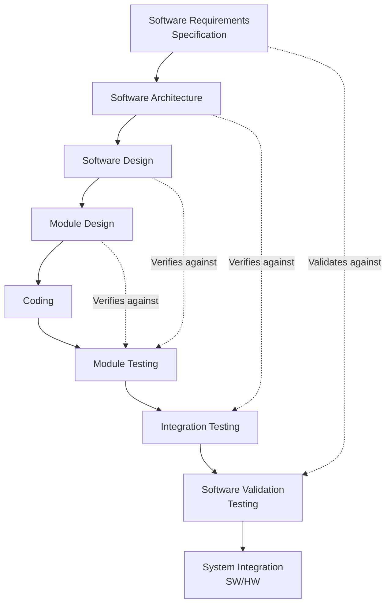
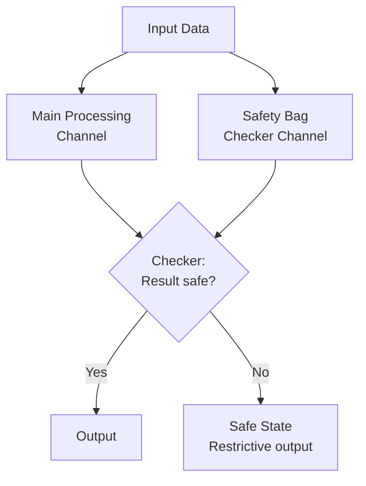
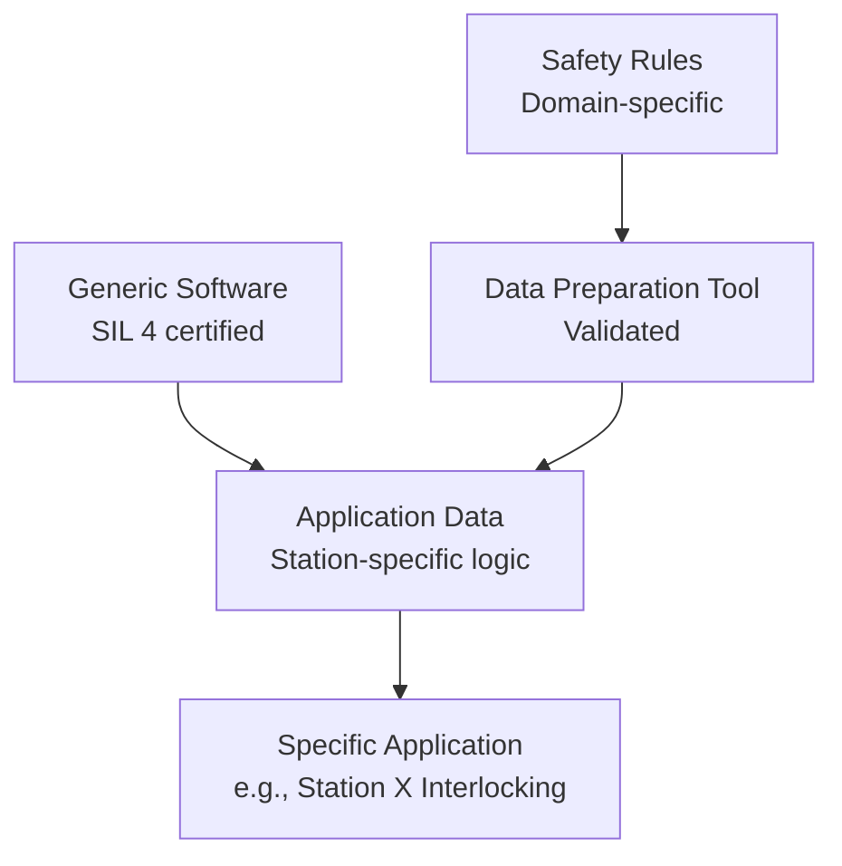
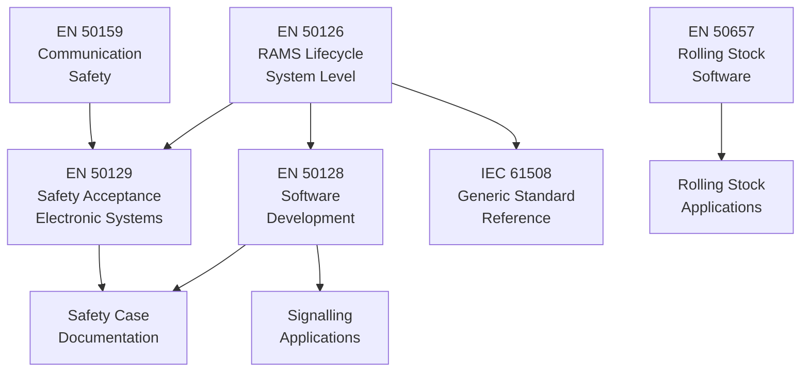
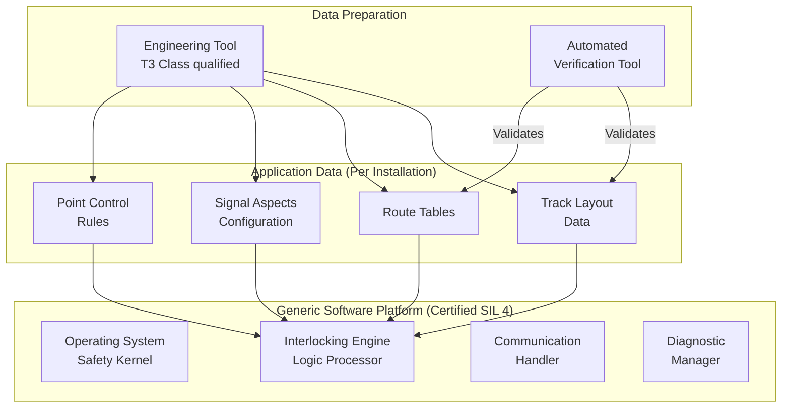
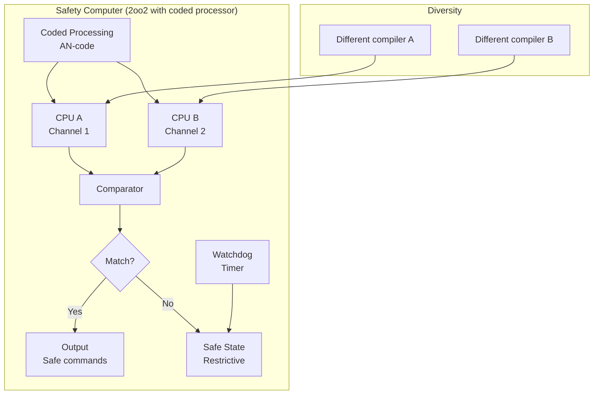

# EN 50128 — Railway Software Safety

**Standard:** EN 50128:2011 (+ A1:2020, A2:2020)  
**Title:** Railway Applications — Communication, Signalling and Processing Systems — Software for Railway Control and Protection Systems  
**SDO:** CENELEC TC9X/SC9XA  
**Audience:** Signalling software engineers, railway system integrators, safety assessors, ERTMS developers  
**Prerequisites:** EN 50126 (RAMS lifecycle), EN 50129 (safety acceptance), IEC 61508 fundamentals

---

## Chapter 1 — Historical Context & Origin Story

### 1.1 Railway Signalling Context

Railway signalling systems protect against collisions, derailments, and overspeeding. These systems operate under the **failsafe principle** — if a component fails, the system must go to a safe state (typically: signals at danger, trains stopped).

Software now controls:
- Interlocking systems (point/signal control)
- Train detection (axle counters, track circuits)
- Level crossing protection
- Automatic Train Protection (ATP)
- European Train Control System (ETCS)
- Communication-Based Train Control (CBTC)

### 1.2 CENELEC Railway Safety Standards Suite

| Standard | Title | Scope |
|----------|-------|-------|
| **EN 50126** | RAMS specification and demonstration | System lifecycle, RAMS requirements |
| **EN 50128** | Software for railway control systems | Software development and assessment |
| **EN 50129** | Safety related electronic systems | Hardware/system safety approval |
| **EN 50159** | Communication in railway systems | Safety of communications |

### 1.3 Development Timeline

| Year | Milestone |
|------|-----------|
| 1992 | EN 50128:1992 — Draft (based on IEC 61508 concepts) |
| 2001 | EN 50128:2001 — First widely used edition |
| 2011 | EN 50128:2011 — Major revision (current base) |
| 2020 | Amendment A1 + A2 (cybersecurity, updates) |
| 2023 | EN 50128 under revision for Edition 3 |

### 1.4 Key Principle: Prescribed Techniques

Unlike ISO 26262 (which recommends techniques), EN 50128 **prescribes specific techniques** for each SIL level using a grading system:
- **M** = Mandatory
- **HR** = Highly Recommended
- **R** = Recommended
- **—** = No recommendation (neutral)
- **NR** = Not Recommended

---

## Chapter 2 — Standard Architecture & Structure

### 2.1 Standard Structure

| Clause | Title | Content |
|--------|-------|---------|
| 1-4 | Scope, References, Terms, Objectives | Framework |
| 5 | Software management | Organization, planning, quality |
| 6 | Software requirements | Specification and documentation |
| 7 | Software design and implementation | Architecture, modules, coding |
| 8 | Software verification and testing | Test planning, execution |
| 9 | Software/hardware integration | Integration activities |
| 10 | Software validation | System-level verification |
| 11 | Software quality assurance | QA process |
| 12 | Software maintenance | Post-deployment changes |
| 13 | Software assessment | Independent safety assessment |
| Annex A | Techniques and Measures (NORMATIVE) | Tables prescribing techniques by SIL |
| Annex B | Bibliography | References |
| Annex D | Application data (generic product) | Data-driven systems |
| Annex E | Model-based development | Formal methods, model checking |

### 2.2 Software Safety Integrity Levels

| SIL | Application examples |
|-----|---------------------|
| 0 | Non-safety (passenger information, scheduling) |
| 1 | Low safety (automatic door closing advisory) |
| 2 | Medium (level crossing warning, advisory speed) |
| 3 | High (interlocking, ATP, axle counter) |
| 4 | Very high (ERTMS/ETCS Level 2/3, CBTC vital functions) |

### 2.3 V-Model per EN 50128



---

## Chapter 3 — Technical Deep Dive

### 3.1 Technique Tables (Annex A) — The Heart of EN 50128

EN 50128's most distinctive feature is its **prescriptive technique tables.** Selected examples:

**Table A.4 — Software Design Techniques:**

| Technique | SIL 0 | SIL 1 | SIL 2 | SIL 3 | SIL 4 |
|-----------|-------|-------|-------|-------|-------|
| Formal methods | — | R | R | HR | HR |
| Semi-formal methods | R | HR | HR | HR | HR |
| Structured methodology | HR | HR | HR | M | M |
| Modular approach | HR | HR | HR | M | M |
| Defensive programming | R | R | HR | HR | HR |
| Information hiding | R | R | HR | HR | M |

**Table A.5 — Software Architecture Techniques:**

| Technique | SIL 0 | SIL 1 | SIL 2 | SIL 3 | SIL 4 |
|-----------|-------|-------|-------|-------|-------|
| Safety bag (checker) | — | R | R | HR | HR |
| Diverse programming | — | R | R | HR | HR |
| N-version programming | — | — | R | R | HR |
| Recovery block | — | — | R | R | HR |
| Coded processor | — | — | R | HR | HR |

**Table A.12 — Verification Techniques (Testing):**

| Technique | SIL 0 | SIL 1 | SIL 2 | SIL 3 | SIL 4 |
|-----------|-------|-------|-------|-------|-------|
| Boundary value analysis | R | HR | HR | M | M |
| Equivalence class testing | R | HR | HR | HR | HR |
| State transition testing | R | R | HR | HR | M |
| Structural test coverage (statement) | R | HR | HR | M | M |
| Structural test coverage (branch) | — | R | HR | HR | M |
| Structural test coverage (MC/DC) | — | — | R | HR | HR |
| Formal proof | — | — | R | R | HR |
| Performance testing | R | HR | HR | M | M |

### 3.2 Safety Bag Concept (Vital Coded Processor)



**Safety bag = independent checker** that verifies the main processor's output against safety constraints. Does NOT compute the answer — only checks if the answer is safe.

### 3.3 Coded Processing

**Concept:** Data values are encoded with safety codes that propagate through all arithmetic operations. If corruption occurs, the code becomes invalid.

```
Original value: X
Coded value: X' = A × X + B (where A, B are known constants)
Operation: X' + Y' = A×(X+Y) + 2B → decode and verify
Fault detection: If hardware bit-flip → code word invalid → detected
```

**AN-code (Arithmetic code):**
- Value stored as N × A (where A is prime)
- All operations maintain code property
- Corruption detected with probability (A-1)/A
- Used in SIL 3-4 interlocking systems

### 3.4 Formal Methods in Railway

| Method | Application | SIL |
|--------|-------------|-----|
| B-Method | Paris Métro Line 14 CBTC, Siemens interlocking | SIL 4 |
| Z Notation | Specification of signalling rules | SIL 3-4 |
| Model checking (SCADE) | ERTMS on-board, interlocking logic | SIL 3-4 |
| Theorem proving (Coq, Isabelle) | Algorithm verification | SIL 4 |
| Petri nets | Protocol verification, communication | SIL 2-3 |

### 3.5 Diverse Programming Requirements (SIL 3-4)

**N-version programming:**
- 2 or more independent teams implement same specification
- Different algorithms, languages, compilers, tools
- Voting on outputs (2oo2 with safety bag, 2oo3 voting)
- Used for: ETCS on-board, interlocking safe computers

---

## Chapter 4 — Implementation Guide

### 4.1 Role Definitions

EN 50128 defines **specific roles** (cannot be combined without independence argument):

| Role | Responsibility | Independence |
|------|---------------|--------------|
| Requirements Manager | Requirements specification | — |
| Designer | Architecture and detailed design | — |
| Implementer | Coding | — |
| Tester | Test specification and execution | Independent from implementer |
| Verifier | Verification activities | Independent from designer |
| Integrator | Integration activities | — |
| Validator | Validation against requirements | Independent from design team |
| Assessor | Independent safety assessment | Independent organization |

### 4.2 Development Planning

**Software quality assurance plan shall include:**
1. Standards and guidelines to be followed
2. Tools to be used (qualified per SIL)
3. Configuration management procedures
4. Documentation standards
5. Review and verification procedures
6. Testing strategy (unit → integration → validation)
7. Modification procedures
8. Quality metrics

### 4.3 Generic Product Approach (Clause D)

Railway signalling uses **generic products** with application-specific data:



**Generic product = pre-developed, pre-certified software platform**  
**Application data = configuration for specific installation**  
**Benefit:** One certification, many installations. Change is DATA, not SOFTWARE.

### 4.4 Language Restrictions

| SIL | Permitted Languages |
|-----|-------------------|
| 0-1 | Any (with justification) |
| 2 | High-level language (C, Ada, Java with restrictions) |
| 3 | Ada, restricted C (MISRA-like), formal languages |
| 4 | Ada SPARK subset, B-Method, SCADE, formal specification languages |

**SIL 4 restrictions (typically):**
- No dynamic memory allocation
- No recursion
- No pointer arithmetic
- Bounded loops (provable termination)
- No undefined behavior
- Static analysis must prove absence of runtime errors

---

## Chapter 5 — Certification & Audit

### 5.1 Independent Safety Assessment (ISA)

EN 50128 Clause 13 mandates **Independent Safety Assessment:**

| SIL | Assessment Requirement |
|-----|----------------------|
| 0 | Internal quality review sufficient |
| 1-2 | Independent assessor (can be internal, different department) |
| 3-4 | Independent assessor (external assessment body recommended) |

### 5.2 Assessment Activities

The assessor evaluates:
1. **Process compliance** — Were all required techniques applied?
2. **Technique adequacy** — Are selected techniques (from Annex A tables) sufficient for claimed SIL?
3. **Documentation completeness** — All required documents produced?
4. **Independence** — Verification/validation independence maintained?
5. **Tool qualification** — Development tools appropriate for SIL?
6. **COTS/existing software** — Adequate evidence for reused components?
7. **Modification process** — Impact analysis, regression testing?

### 5.3 Assessment Bodies (Railway)

| Body | Region | Specialization |
|------|--------|----------------|
| TÜV SÜD Rail | Europe/Global | Leading railway ISA body |
| TÜV Rheinland | Europe | ISA, certification |
| Ricardo | UK/Global | ISA, signalling consultancy |
| CERTIFER | France/Europe | NoBo + ISA |
| Bureau Veritas | Global | ISA, railway certification |
| DNV | Nordic/Global | ISA for railway and maritime |

### 5.4 National Safety Authority (NSA) Approval

After ISA, the system needs operational approval:
- **UK:** ORR (Office of Rail and Road)
- **France:** EPSF (Établissement Public de Sécurité Ferroviaire)
- **Germany:** EBA (Eisenbahn-Bundesamt)
- **EU (interoperability):** ERA reference through TSIs

---

## Chapter 6 — Regional & Domain Variants

### 6.1 CENELEC vs. Other Railway Standards

| Region | Software Standard | Based on |
|--------|------------------|----------|
| Europe | EN 50128 | CENELEC |
| USA | IEEE 1558 (emerging) | AREMA practices |
| China | TB/T 3530 | Based on EN 50128 |
| India | RDSO specifications | References EN 50128 |
| Japan | JIS E series | Independent tradition |
| International | IEC 62278/62279/62280/62425 | IEC versions of CENELEC |

### 6.2 ERTMS/ETCS Context

| Component | SIL | Standard | Key challenge |
|-----------|-----|----------|--------------|
| ETCS On-Board Unit (OBU) | SIL 4 | EN 50128/50129 | Speed supervision, braking curves |
| Radio Block Centre (RBC) | SIL 4 | EN 50128/50129 | Movement authority management |
| Eurobalise (track beacon) | SIL 4 | EN 50128/50159 | Telegram encoding |
| GSM-R/FRMCS communication | SIL 2 | EN 50159 | Communication integrity |
| DMI (Driver Display) | SIL 2 | EN 50128 | Safety-relevant information display |

---

## Chapter 7 — Comparison with Other Software Safety Standards

| Feature | EN 50128 | DO-178C | ISO 26262 Part 6 | IEC 62304 |
|---------|----------|---------|-------------------|-----------|
| Industry | Railway | Avionics | Automotive | Medical |
| SIL range | 0-4 | DAL A-E | QM-D | A-C |
| Prescribed techniques | ✓ (M/HR/R/NR tables) | ✓ (objectives) | ✓ (methods tables) | Minimal |
| Formal methods | HR for SIL 3-4 | Supplement DO-333 | Not required | — |
| MC/DC | HR for SIL 4 | Required DAL A | Recommended ASIL D | — |
| Diverse programming | HR for SIL 3-4 | Not required | Not common | — |
| Safety bag | HR for SIL 3-4 | N/A | N/A | — |
| Tool qualification | Required | DO-330 | Part 8 | Brief mention |
| Generic product | Explicit (Clause D) | — | SEooC | — |
| Independent assessment | Mandatory (ISA) | DER involvement | Confirmation measures | Notified Body |
| Cost (SIL 4 system) | $5M-$50M | $5M-$50M | $2M-$10M | $100K-$500K |

---

## Chapter 8 — Mermaid Architecture Diagrams

### 8.1 CENELEC Railway Standards Relationship



### 8.2 Generic Product Architecture (SIL 4 Interlocking)



### 8.3 SIL 4 Safety Computer Architecture



---

## Chapter 9 — Case Studies & Failure Analysis

### 9.1 Paris Métro Line 14 — CBTC Success

**System:** METEOR/CBTC — first fully automated metro line in Paris (1998)  
**SIL:** SIL 4  
**Software approach:** B-Method formal specification and proof

**Key achievements:**
- 115,000 lines of B specification → 87,000 lines of Ada code
- Zero safety-critical bugs found after deployment
- Formal proof eliminated 80% of traditional testing effort
- 25 years of operation with no safety-critical software incident

### 9.2 Signalling Software Bug — Points Failure

**Scenario:** Interlocking allowed route to be set while points were in transit (detected in testing).

**Root cause:** Race condition between point detection circuit polling and route setting logic.  
**Timing:** Point motor started moving → detection showed "not locked" → route request arrived → interlocking checked detection (stale data showing locked) → route set with points unlocked.

**EN 50128 defenses:**
- State transition testing (Table A.12: M for SIL 3-4)
- Formal specification would have caught mutual exclusion violation
- Safety bag checker: output is "route set" → check: are all points locked? → would reject

### 9.3 ERTMS Deployment Challenges

**Issue:** Multiple ERTMS implementations had interoperability problems at borders.

**EN 50128 perspective:**
- Each supplier certified their software to SIL 4 ✓
- But specification interpretation differences between suppliers
- Cross-acceptance of safety cases between NSAs was problematic
- Led to harmonized ERTMS specification updates (Baseline 3)

---

## Chapter 10 — Future Evolution & Industry Trends

### 10.1 EN 50128 Edition 3 (Development)

**Expected additions:**
1. **Agile/iterative development** — Explicit guidance (currently V-model focused)
2. **AI/ML** — Guidance for non-vital AI in railway (passenger information, predictive maintenance)
3. **Cybersecurity** — Integration with TS 50701 (railway cybersecurity)
4. **COTS/Open-source** — Updated guidance for Linux, containers
5. **Model-based development** — Enhanced Annex E (SCADE, Simulink)
6. **DevOps for railway** — CI/CD with safety evidence generation

### 10.2 Industry Trends

| Trend | Impact |
|-------|--------|
| ETCS Level 3 (moving block) | Higher software complexity, SIL 4 train integrity |
| FRMCS (5G railway comms) | Replaces GSM-R, new safety communication |
| Autonomous trains (GoA 4) | Software assumes full driving responsibility |
| Digital interlocking | Software-based, cloud-potential |
| Predictive maintenance | AI + safety boundary management |
| Cyber-physical security | TS 50701 integration with EN 50128 |

---

## Chapter 11 — Interview Questions & Career Guide

### Tier 1: Entry-Level (0-3 years)

**Q1:** What does the technique rating "M/HR/R/NR" mean in EN 50128?  
**A:** M = Mandatory (must use, no alternative), HR = Highly Recommended (must use OR provide justification for alternative), R = Recommended (should use, alternatives acceptable), NR = Not Recommended (should not use, must justify if used), — = No recommendation. These ratings are per SIL level. A technique might be "R" for SIL 2 but "M" for SIL 4. The technique tables in Annex A are NORMATIVE — assessors verify compliance.

**Q2:** Explain the generic product concept in EN 50128.  
**A:** A generic product is pre-developed, pre-certified software that can be configured for different installations through application data. Example: An interlocking platform certified SIL 4 is deployed at 100 stations — same software, different track layouts (data). Benefits: one certification for many sites, changes are data (lower SIL for data preparation), faster deployment. Requirements: data preparation tools must be qualified, application data must be verified against safety rules.

### Tier 2: Mid-Level (3-8 years)

**Q3:** How would you select testing techniques for a SIL 3 interlocking software module?  
**A:** From EN 50128 Annex A tables: (1) Boundary value analysis: M → must use. (2) Equivalence class testing: HR → will use. (3) State transition testing: HR → will use (critical for interlocking states). (4) Structural coverage — statement: M → must achieve. (5) Structural coverage — branch: HR → will target. (6) Structural coverage — MC/DC: HR → will target for safety-critical decision logic. (7) Performance testing: M → must verify timing constraints. (8) Back-to-back testing (if diverse): HR → will compare outputs. (9) Interface testing: M → test all module interfaces. Combination ensures both functional correctness and structural adequacy.

### Tier 3: Senior/Lead (8-15 years)

**Q4:** You're leading software development for an ETCS Level 2 RBC. Describe your architecture and assurance approach.  
**A:** (1) Architecture: 2oo2 diverse with safety bag. Two independent processing channels (different compilers, potentially different languages). Safety bag checks all outputs against signalling rules before transmission. (2) SIL 4 assurance: Formal specification (B-Method or SCADE for safety logic). Code generation from verified model. Diverse manual implementation for checker channel. (3) Testing: MC/DC on safety-critical paths + formal proof where feasible + extensive scenario testing with simulated track layouts. (4) Generic product approach: RBC platform is generic, movement authority logic is configurable per line. (5) Communication: EN 50159 Category 3 for radio link to trains (authentication + integrity + timeliness). (6) ISA engagement from design phase (continuous assessment, not end-of-project gate).

### Tier 4: Principal/Distinguished (15+ years)

**Q5:** How would you architect a SIL 4 digital interlocking that could potentially run on COTS hardware/cloud infrastructure?  
**A:** This is cutting-edge and currently beyond standard practice, but path forward: (1) **Separation of safety logic from platform:** Pure functional safety logic (route locking, point control) expressed as formally verified state machine — platform independent. (2) **Coded processing on COTS:** Implement vital processing using AN-codes or CRC-protected computations on COTS processors — arithmetic encoding detects hardware faults without certified hardware. (3) **Redundancy:** 2oo3 voting across separate COTS nodes (diverse OS instances, different physical servers). (4) **Determinism:** Guarantee response time through real-time scheduling + timing monitors (watchdogs). (5) **Safety case:** Not prescriptive (EN 50128 doesn't describe this). Would need goal-based safety case (EN 50129) showing hazard rates met through combination of coded processing + redundancy + temporal monitoring. (6) **ISA challenge:** No precedent for assessors → engage early, build prototype, demonstrate safety properties mathematically. (7) **Current state:** Research level (universities + major suppliers exploring). Production systems still use purpose-built safety computers. Timeline: 5-10 years for first certified deployment.

---

## Chapter 12 — Cheat Sheet & Quick Reference

### EN 50128 Key Requirements by SIL

| SIL | Architecture | Verification | Tools | Assessment |
|-----|--------------|-------------|-------|-----------|
| 0 | Basic | Review + test | Any | Internal QA |
| 1 | Structured | Systematic test | Justified | Independent person |
| 2 | Modular + defensive | Coverage-based test | Qualified | Independent team |
| 3 | Diverse/safety bag (HR) | Branch + MC/DC (HR), formal (HR) | T2/T3 qualified | External ISA |
| 4 | Diverse (HR), coded processor (HR) | MC/DC (HR), formal proof (HR) | T2/T3 qualified | External ISA |

### Tool Classification

| Class | Impact | Qualification |
|-------|--------|--------------|
| T1 | No output used in safety system | No qualification needed |
| T2 | Output contributes to safety (verified by other means) | Validation evidence required |
| T3 | Output directly used in safety system (no independent check) | Full qualification required |

### Key Deliverables

```
Software Requirements Specification (SRS)
Software Architecture Description (SAD)
Software Design Specification (SDS)
Software Module Test Specification + Report
Software Integration Test Specification + Report  
Software Validation Test Specification + Report
Software Quality Assurance Plan + Report
Software Configuration Management Plan
Software Safety Assessment Report (ISA)
```

### EN 50128 ↔ IEC 61508 Mapping

```
EN 50128 SIL 0 = No IEC 61508 equivalent (railway-specific)
EN 50128 SIL 1 = IEC 61508 SIL 1
EN 50128 SIL 2 = IEC 61508 SIL 2
EN 50128 SIL 3 = IEC 61508 SIL 3
EN 50128 SIL 4 = IEC 61508 SIL 4
```

---

*End of Document — 08_EN_50128_Railway_SW.md*
