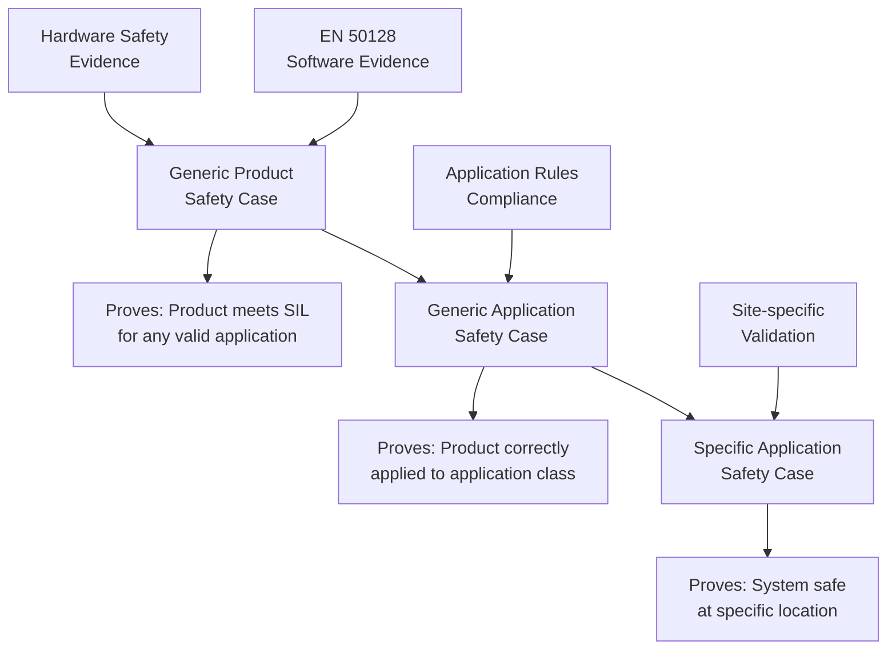
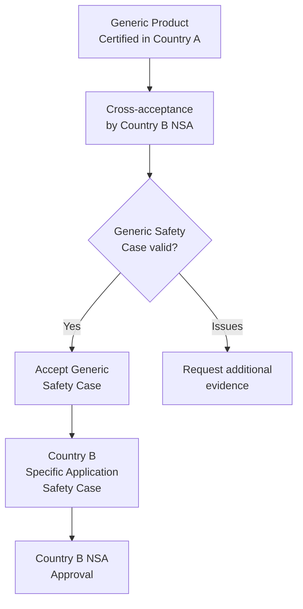
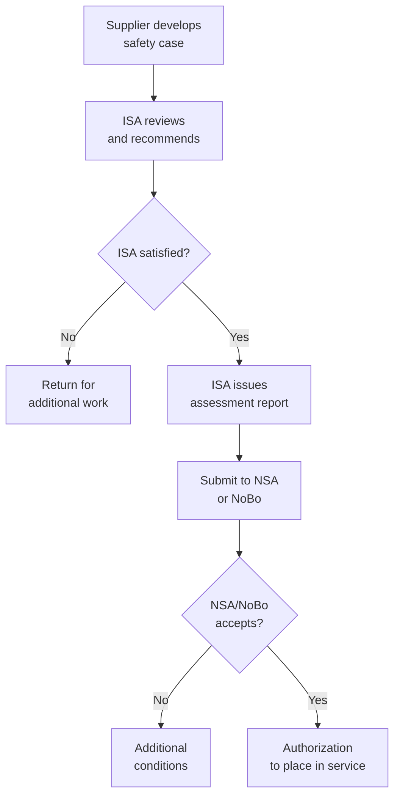
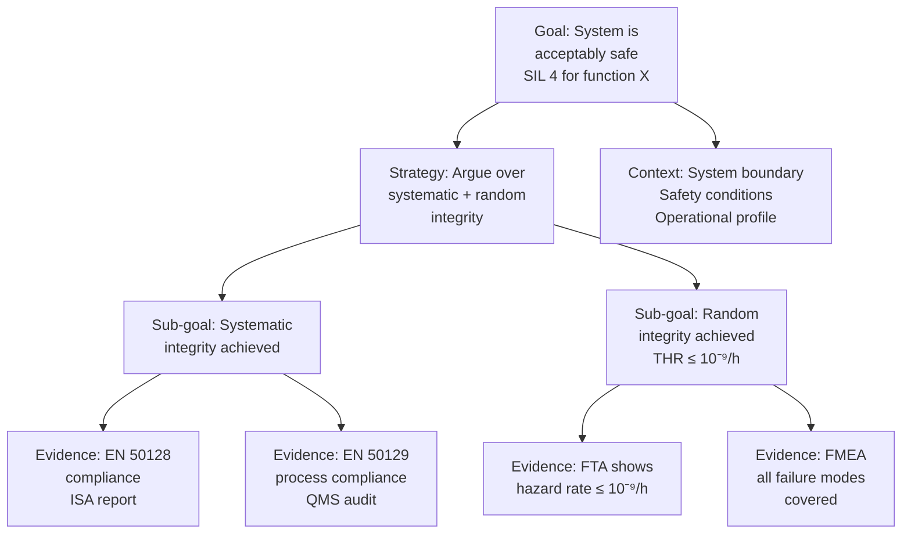
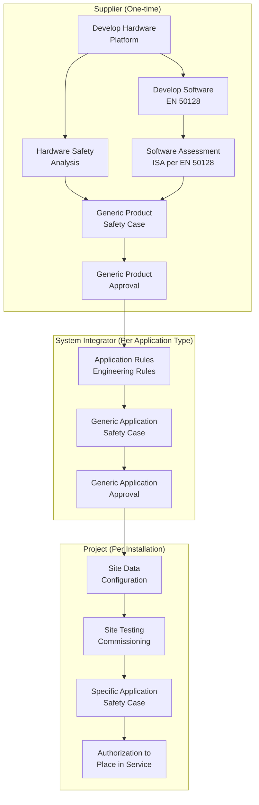
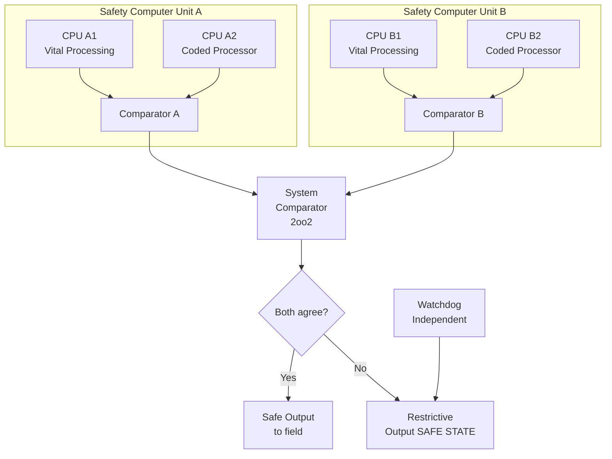

# EN 50129 — Railway Safety Approval for Electronic Systems

**Standard:** EN 50129:2018 (Edition 2)  
**Title:** Railway Applications — Communication, Signalling and Processing Systems — Safety Related Electronic Systems for Signalling  
**SDO:** CENELEC TC9X/SC9XA  
**Audience:** Safety engineers, system architects, safety assessors, railway operators, NoBos  
**Prerequisites:** EN 50126 (RAMS), EN 50128 (software), IEC 61508, safety case methodology

---

## Chapter 1 — Historical Context & Origin Story

### 1.1 Railway Safety Approval Context

Railway electronic systems must demonstrate safety before deployment. EN 50129 provides the framework for **safety acceptance** — proving that an electronic system achieves its required Safety Integrity Level and can be placed into service.

Unlike EN 50128 (software process) or EN 50126 (lifecycle), EN 50129 defines **what evidence is needed and how it's structured** into a Safety Case.

### 1.2 The Safety Case Approach

**EN 50129 pioneered structured safety cases in railway:**
- Argument that safety requirements are met
- Supported by evidence from development and testing
- Structured hierarchically (Generic → Generic Application → Specific Application)
- Assessed independently before operational acceptance

### 1.3 Development Timeline

| Year | Milestone |
|------|-----------|
| 1998 | prEN 50129 draft |
| 2003 | EN 50129:2003 Edition 1 |
| 2018 | EN 50129:2018 Edition 2 (significant restructure) |
| 2020 | Cybersecurity amendments referenced |
| 2025+ | Edition 3 under development (digital, AI, cloud) |

---

## Chapter 2 — Standard Architecture & Structure

### 2.1 Standard Structure (Edition 2)

| Clause | Title | Content |
|--------|-------|---------|
| 1-4 | Scope, References, Terms, Abbreviations | Framework |
| 5 | System requirements | SIL allocation, safety requirements |
| 6 | System architecture | Hardware and system design |
| 7 | Technical safety report | Evidence structure |
| 8 | System acceptance process | From generic to specific |
| 9 | Safety management | Organization, competence |
| 10 | Quality management | QMS requirements |
| Annex A | Safety conditions | Conditions for safe operation |
| Annex B | Safety Integrity Levels | Quantitative targets |

### 2.2 Three-Level Safety Case Structure



### 2.3 Safety Case Contents

| Part | Content | Responsible |
|------|---------|------------|
| **Part 1: Definition of System** | System description, boundaries, functions | Supplier |
| **Part 2: Quality Management Report** | QMS evidence, configuration management | Supplier |
| **Part 3: Safety Management Report** | Organization, independence, competence | Supplier |
| **Part 4: Technical Safety Report** | Design evidence, analysis, testing results | Supplier |
| **Part 5: Related Safety Cases** | References to sub-system safety cases | Supplier |
| **Part 6: Conclusions** | Argument that safety requirements met | Supplier + ISA |

---

## Chapter 3 — Technical Deep Dive

### 3.1 Safety Integrity Levels — Quantitative Targets

| SIL | THR (Tolerable Hazard Rate) per hour per function |
|-----|---------------------------------------------------|
| 4 | 10⁻⁹ to 10⁻⁸ |
| 3 | 10⁻⁸ to 10⁻⁷ |
| 2 | 10⁻⁷ to 10⁻⁶ |
| 1 | 10⁻⁶ to 10⁻⁵ |
| 0 | > 10⁻⁵ (no safety claim) |

**Note:** These are per hazardous event rate targets. Railway uses **continuous/high demand mode** (unlike process industry low demand).

### 3.2 Hardware Safety Analysis Requirements

| Analysis | Purpose | SIL 1 | SIL 2 | SIL 3 | SIL 4 |
|----------|---------|-------|-------|-------|-------|
| FMEA/FMECA | Identify failure modes | R | HR | M | M |
| Fault Tree Analysis | Quantify failure probability | R | HR | HR | M |
| Common Cause Analysis | Identify β-factor failures | — | HR | M | M |
| Reliability Block Diagram | System reliability modeling | R | HR | HR | M |
| Worst-case analysis | Component stress | R | HR | M | M |
| Electromagnetic compatibility | EMI immunity | HR | M | M | M |

### 3.3 Architecture Requirements

| Architecture | SIL Achievable | Description |
|-------------|---------------|-------------|
| Single channel | SIL 1-2 (with coded processing) | One processor, safety through encoding |
| Dual channel (2oo2) | SIL 3-4 | Two diverse channels, comparator |
| Triple modular (2oo3) | SIL 4 | Majority voting, fault tolerance |
| 2oo2D + safety bag | SIL 4 | Dual diverse + independent checker |
| Composite failsafe | SIL 4 | Coded processing + comparison |

### 3.4 Safety Conditions (Annex A)

**Safety conditions = assumptions about the operational environment that must be true for the safety case to hold:**

| Category | Example Conditions |
|----------|-------------------|
| Installation | Cable routes separated from power, earthing correct |
| Environmental | Temperature range -25°C to +70°C, humidity <95% |
| Maintenance | Proof testing every 6 months, trained personnel |
| Operational | Maximum train speed 200 km/h, minimum headway 90s |
| Interface | Input voltage 24V ±10%, communication latency <500ms |
| Cybersecurity | Network isolated from public internet, access controlled |

**If conditions not met → safety case invalid → system cannot claim stated SIL.**

### 3.5 Cross-Acceptance

**Problem:** A system certified in one EU country needs reuse in another.  
**Solution:** EN 50129 enables cross-acceptance:



**ERA (European Union Agency for Railways)** facilitates cross-acceptance through:
- Common Safety Methods (CSM)
- Technical Specifications for Interoperability (TSI)
- Single Safety Certificate (SSC) process

---

## Chapter 4 — Implementation Guide

### 4.1 Safety Case Development Process

**Phase 1 — Planning:**
1. Define system boundaries
2. Identify safety functions
3. Allocate SIL targets (from EN 50126 analysis)
4. Plan safety activities (who, when, what evidence)
5. Engage ISA early

**Phase 2 — Generic Product Development:**
1. System design (architecture, hardware, software)
2. Hardware safety analysis (FMEA, FTA, reliability)
3. Software development per EN 50128
4. Integration and testing
5. Compile Generic Product Safety Case (Parts 1-6)
6. ISA assessment → Generic Product Approval

**Phase 3 — Generic Application:**
1. Define application rules (how to configure for different sites)
2. Verify application rules cover safety conditions
3. Application data preparation tool qualification
4. Compile Generic Application Safety Case
5. ISA assessment → Generic Application Approval

**Phase 4 — Specific Application:**
1. Configure system for specific location
2. Verify application data against site requirements
3. Site-specific testing and commissioning
4. Compile Specific Application Safety Case
5. Local authority approval → operational acceptance

### 4.2 Technical Safety Report Structure

| Section | Content |
|---------|---------|
| System definition | Functions, interfaces, operating modes |
| Safety requirements | Hazards, SIL allocation, THR targets |
| Architecture description | Channels, redundancy, voting |
| Hardware evidence | FMEA, FTA, reliability calculation, EMC |
| Software evidence | EN 50128 compliance, ISA report reference |
| Safety analysis | Systematic fault analysis, CCF, sensitivity |
| Testing evidence | Factory tests, type tests, validation |
| Operations/maintenance | Required maintenance, proof tests, degraded modes |
| Residual risk | Unmitigated hazards, risk acceptance |

### 4.3 Independence Requirements

| Activity | Independence Level |
|----------|--------------------|
| Design verification | Person not involved in design |
| Software testing | Team not involved in coding |
| System validation | Independent from development |
| Safety assessment (ISA) | Organizationally independent |
| NoBo assessment (if needed) | Third-party accredited body |

---

## Chapter 5 — Certification & Audit

### 5.1 Approval Chain



### 5.2 Key Assessment Criteria

| Criterion | Evidence Required |
|-----------|-----------------|
| SIL achieved | THR calculation shows target met |
| Systematic integrity | Process compliance (EN 50128, 50129) |
| Random integrity | Quantitative hardware analysis |
| Independence | Organizational charts, contracts |
| Competence | CV review, training records |
| Configuration | Version control, change history |
| Residual risk | List of known issues + acceptance argument |

### 5.3 Notified Body (NoBo) Role

For interoperability (TSI) compliance:
- NoBo verifies Essential Requirements
- NoBo issues EC certificate of conformity
- Required for subsystems crossing EU borders
- Railway Agency (ERA) coordinates

---

## Chapter 6 — Regional & Domain Variants

### 6.1 Approval Processes by Country

| Country | NSA | Process |
|---------|-----|---------|
| UK | ORR (via RSSB standards) | Engineering acceptance + operational acceptance |
| Germany | EBA | Planfeststellung + Inbetriebnahme |
| France | EPSF | Autorisation de mise en exploitation commerciale |
| Italy | ANSFISA | Authorization process |
| Spain | AESF | Safety authorization |
| EU (cross-border) | ERA | Single Safety Certificate (SSC) |

### 6.2 Common Safety Method (CSM-RA)

EU Regulation 402/2013 defines **Common Safety Method for Risk Assessment:**
- Used for significant changes to railway systems
- Complements EN 50129 safety case approach
- Requires explicit risk acceptance principles:
  - Codes of practice
  - Reference systems (comparison)
  - Explicit risk estimation

---

## Chapter 7 — Comparison with Other Safety Approval Standards

| Feature | EN 50129 (Railway) | ARP 4761A (Avionics) | ISO 26262 (Auto) |
|---------|--------------------|-----------------------|-------------------|
| Approach | Safety case based | Safety assessment process | Process + work products |
| Structure | 3-level (Generic/App/Specific) | System → item → component | Vehicle → system → component |
| Acceptance | NSA/NoBo | Airworthiness authority (EASA/FAA) | Self-certification (mostly) |
| Key document | Safety Case (5 parts) | System Safety Assessment | Safety Case (Part 2) |
| Quantitative target | THR (per hazardous event/hr) | Per flight hour | PMHF (per vehicle lifetime) |
| Lifecycle model | V-model (EN 50126) | V-model (ARP 4754A) | V-model (Part 2) |
| Cross-acceptance | ERA framework | Bilateral agreements | Not typically needed (global OEM) |

---

## Chapter 8 — Mermaid Architecture Diagrams

### 8.1 Safety Case Argument Structure (GSN-style)



### 8.2 Generic → Specific Application Flow



### 8.3 SIL 4 System Architecture (Typical Interlocking)



---

## Chapter 9 — Case Studies & Failure Analysis

### 9.1 ERTMS Cross-Acceptance Success

**Scenario:** Alstom's ATLAS ETCS Level 2 system certified in France, deployed in Belgium and Italy.

**Safety case approach:**
1. Generic Product Safety Case: ATLAS platform SIL 4 (ISA: Certifer France)
2. Generic Application: High-speed line application (ISA: Certifer)
3. Specific Application: Belgian HSL → Belgian ISA reviewed + INFRABEL acceptance
4. Cross-acceptance: Belgian NSA accepted French generic assessment with limited delta review

**Lesson:** Three-level structure enabled €10M+ savings by avoiding full re-certification per country.

### 9.2 Safety Condition Violation — Temperature Exceedance

**Scenario:** Relay room temperature exceeded safety condition (specified max 55°C) during summer heatwave.

**Impact:**
- Safety case condition violated → system formally in "unsafe" state
- Operations restricted until temperature restored
- Long-term fix: upgrade HVAC, revise safety condition (wider range with additional analysis)

**Lesson:** Safety conditions are NOT just documentation — violation invalidates the safety case. Must be monitored in operation.

### 9.3 Modification Impact — Software Update

**Scenario:** Bug fix to interlocking software (non-safety-relevant display issue).

**EN 50129 process:**
1. Impact analysis: Could change affect safety function? (Analyze affected code)
2. Regression risk: Does fix touch any safety-critical module?
3. Delta safety case: Document change, impact analysis, testing
4. ISA review: Assessor reviews impact analysis
5. Approval: NSA notification or re-approval depending on significance

---

## Chapter 10 — Future Evolution & Industry Trends

### 10.1 Digital Railway

| Trend | Safety Case Impact |
|-------|-------------------|
| Moving block (ETCS L3) | New hazards (train integrity), higher software complexity |
| ATO Grade of Automation 4 | No driver → all safety functions are electronic |
| Digital interlocking | Virtual infrastructure, dynamic route allocation |
| 5G/FRMCS communication | New communication safety case (EN 50159 updates) |
| Predictive maintenance | Using AI outputs for safety-relevant decisions |
| Cloud-based systems | Where is the safety-critical computing? |

### 10.2 Safety Case Evolution

- **Model-based safety cases:** Machine-readable safety arguments (GSN/CAE tooling)
- **Living safety cases:** Continuously updated with operational evidence
- **Assurance cases for AI:** Extending safety case methodology to ML systems
- **Cybersecurity integration:** Combined safety + security case (TS 50701)

---

## Chapter 11 — Interview Questions & Career Guide

### Tier 1: Entry-Level (0-3 years)

**Q1:** What is the three-level safety case structure in EN 50129?  
**A:** (1) Generic Product Safety Case — proves the product (hardware + software platform) meets SIL requirements for any valid application. Includes all design evidence, analysis, testing. Done once by supplier. (2) Generic Application Safety Case — proves the product is correctly applied to a class of applications (e.g., "mainline interlocking for 200 km/h"). Includes application rules, configuration guidelines. (3) Specific Application Safety Case — proves the system is safe at a specific location (e.g., "Station X interlocking"). Includes site data verification, commissioning tests.

**Q2:** What are safety conditions?  
**A:** Safety conditions are documented assumptions about the operational environment that must remain true for the safety case to be valid. Examples: temperature range, maintenance intervals, maximum train speed, network isolation. If any condition is violated, the safety case is formally invalid and the system cannot claim its stated SIL. Operators must monitor and maintain all safety conditions throughout the system's life.

### Tier 2: Mid-Level (3-8 years)

**Q3:** How do you calculate whether a SIL 4 THR target is met for a dual-redundant system?  
**A:** (1) Model architecture: 2oo2 with comparator + individual channel watchdogs. (2) For each channel: calculate dangerous failure rate considering diagnostic coverage. λ_D_channel = λ_total × (1-DC) + λ_total × DC × (1-coverage_of_comparator). (3) System dangerous failure rate (2oo2 independent): λ_D_system = 2 × λ_D_channel² × T_proof + β × λ_D_channel. (4) Common cause (β): typically 2-5% for diverse channels. (5) Add comparator failure rate. (6) Total THR = sum of all dangerous failure mechanisms. (7) Verify THR ≤ 10⁻⁹/h for SIL 4. (8) Sensitivity analysis: vary parameters ±factor to check robustness.

### Tier 3: Senior/Lead (8-15 years)

**Q4:** You need cross-acceptance of a SIL 4 interlocking safety case from Germany to UK. What challenges do you expect?  
**A:** (1) Standards divergence: UK historically used Railway Group Standards (now transitioning post-Brexit), Germany uses full CENELEC suite → assess delta in safety philosophy. (2) Safety condition differences: UK operating rules differ (left-hand running, specific signalling principles) → Generic Application may not directly apply. (3) ISA acceptance: UK assessor may not accept German ISA's assessment methodology → may require UK ISA review of generic safety case. (4) National rules: Track circuit/axle counter interfaces may differ (voltage levels, message formats) → interface safety case needed. (5) Operational procedures: Maintenance regime, degraded mode procedures differ → update safety conditions. (6) Strategy: Accept Generic Product safety case (platform is technology — location-independent), re-do Generic Application for UK rules, fresh Specific Application for UK site.

### Tier 4: Principal/Distinguished (15+ years)

**Q5:** How would you structure a safety case for an AI-augmented railway control system?  
**A:** (1) **Architecture principle:** AI must not be in the safety-critical path without a deterministic safety function providing a safety envelope. Structure: AI provides advisory/optimization (non-SIL), safety function limits AI outputs to safe boundaries (SIL 4). (2) **Safety case argument:** "System is safe BECAUSE the SIL 4 safety function prevents all hazardous outputs, REGARDLESS of AI behavior." (3) **AI assurance:** Separate assurance case for AI performance (not safety integrity) — demonstrate mean-time-between-unnecessary-interventions is acceptable for availability. (4) **Operational monitoring:** Continuous monitoring of AI decisions vs. safety function interventions. High intervention rate → AI degraded → investigate. (5) **Validation challenge:** Cannot exhaustively test AI → statistical validation (confidence intervals on performance metrics) + operational monitoring + predetermined response to drift. (6) **Regulatory engagement:** No established framework → early ISA engagement, ERA pilot project, potentially new Technical Specification development. (7) **Fallback:** If AI completely fails → system operates on conventional logic (safety function only) with reduced capacity/efficiency.

---

## Chapter 12 — Cheat Sheet & Quick Reference

### Safety Case Document Checklist

| Part | Required Content | Typical Pages |
|------|-----------------|---------------|
| Part 1: System Definition | Boundaries, functions, interfaces, operating modes | 30-50 |
| Part 2: Quality Management | QMS certification, CM evidence, supplier management | 20-30 |
| Part 3: Safety Management | Organization, competence, independence proof | 20-40 |
| Part 4: Technical Safety Report | Design, analysis, test results, residual risk | 200-500+ |
| Part 5: Related Safety Cases | Sub-system references, COTS evidence | 10-30 |
| Part 6: Conclusions | Summary argument, ISA recommendation | 10-20 |

### THR Targets

```
SIL 4: THR ≤ 10⁻⁹/h per hazardous event (≈ 1 dangerous failure per 114,000 years)
SIL 3: THR ≤ 10⁻⁸/h (≈ 1 dangerous failure per 11,400 years)
SIL 2: THR ≤ 10⁻⁷/h (≈ 1 dangerous failure per 1,140 years)
SIL 1: THR ≤ 10⁻⁶/h (≈ 1 dangerous failure per 114 years)
```

### Key Roles in Safety Approval

```
Supplier → Develops system + writes safety case
ISA → Independently assesses safety case → recommends
Railway Operator → Accepts for operation
NSA → Authorizes placing in service
NoBo → EC verification (for TSI interoperability)
DeBo → Designated Body (for national rules)
ERA → Coordinates EU-level (cross-acceptance, SSC)
```

### Three-Level Summary

```
GENERIC PRODUCT    = "This product is safe" (Technology proof)
GENERIC APPLICATION = "Applied this way, it's safe" (Engineering rules)  
SPECIFIC APPLICATION = "At this site, it's safe" (Site proof)
```

---

*End of Document — 09_EN_50129_Railway_Systems.md*
