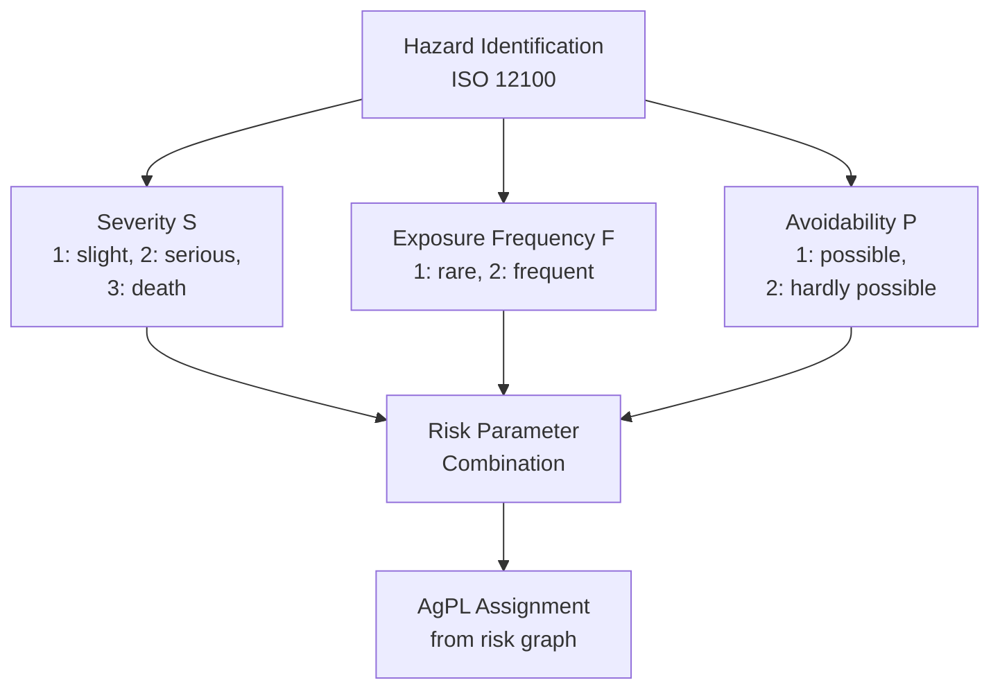
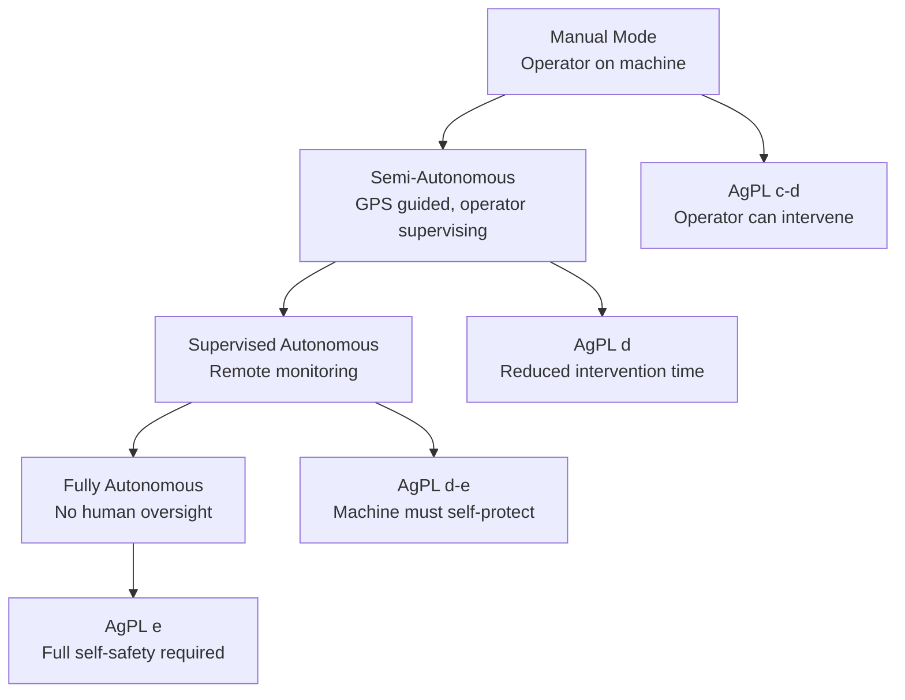
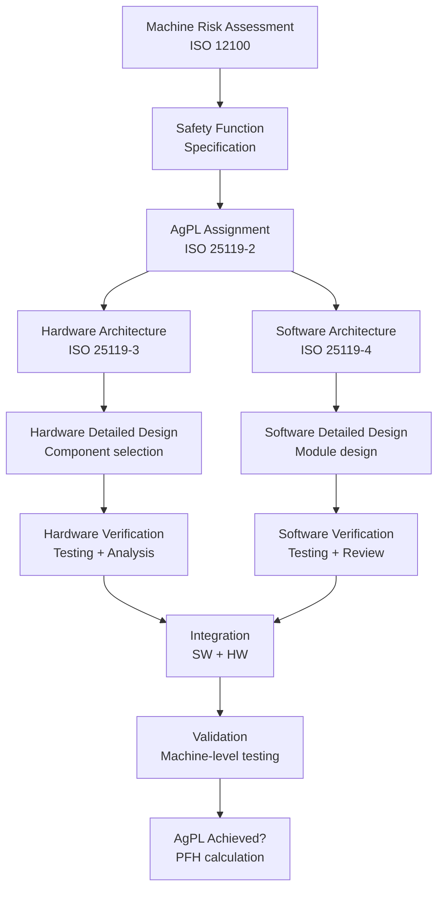
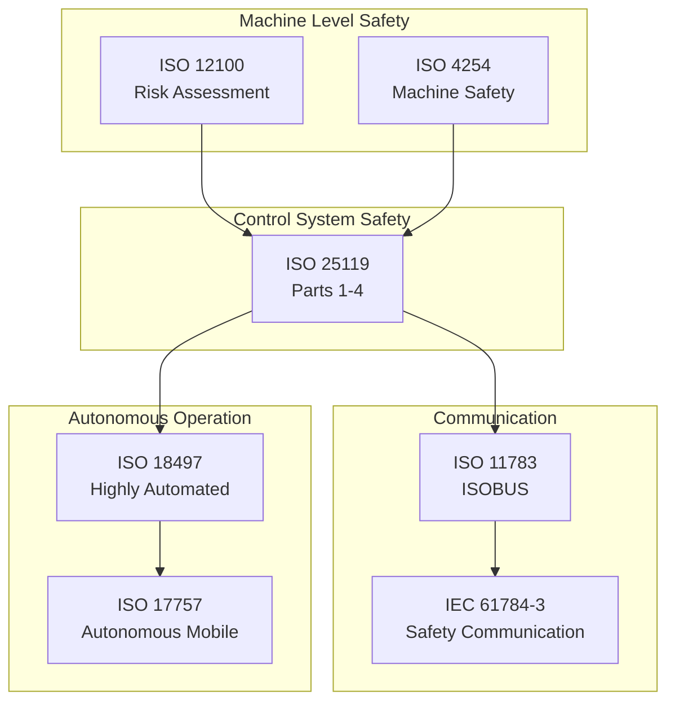
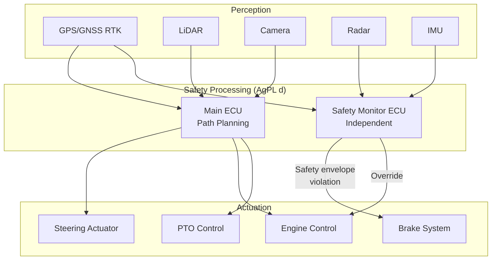

# ISO 25119 — Tractors and Machinery for Agriculture — Safety-Related Parts of Control Systems

**Standard:** ISO 25119:2019 (Edition 2)  
**Title:** Tractors and Machinery for Agriculture and Forestry — Safety-Related Parts of Control Systems  
**SDO:** ISO TC23/SC19  
**Parts:** 4 Parts  
**Audience:** Agricultural machinery designers, control system engineers, tractor ECU developers  
**Prerequisites:** ISO 12100, IEC 61508 concepts, agricultural machinery design

---

## Chapter 1 — Historical Context & Origin Story

### 1.1 Agricultural Machinery Safety Context

Modern agricultural machinery is increasingly automated:
- GPS-guided autonomous tractors
- Automated harvester control
- Precision spraying systems
- Robotic milking systems
- Automated feeding systems
- Drone-based crop management

**Safety challenges unique to agriculture:**
- Machines operate near untrained bystanders (including children)
- Harsh environment (dust, vibration, temperature extremes, moisture)
- Long operational life (20+ years)
- Limited maintenance capability (rural, developing regions)
- Operator may be non-technical
- Mixed human-machine operation (manual + automated modes)

### 1.2 Development History

| Year | Milestone |
|------|-----------|
| 2006 | ISO 25119 project initiated (ISO TC23/SC19) |
| 2010 | ISO 25119:2010 Edition 1 (4 parts) |
| 2018 | AgPL concept refined |
| 2019 | ISO 25119:2019 Edition 2 (aligned with IEC 61508:2010) |
| 2023 | Autonomous agriculture machines driving new requirements |

### 1.3 Why Not Just Use ISO 13849 or IEC 62061?

| Factor | ISO 13849/IEC 62061 | ISO 25119 |
|--------|---------------------|-----------|
| Environment | Factory (controlled) | Outdoor (extreme) |
| Operator | Trained industrial worker | Farmer (varying skill) |
| Bystanders | Excluded from zone | May be near machine |
| Lifetime | 10-20 years | 15-30 years |
| Maintenance | Planned, regular | Seasonal, basic |
| Regulatory | EU Machinery Directive | EU Machinery Regulation + national agriculture regs |
| Operation | Fixed location | Mobile, varying terrain |

---

## Chapter 2 — Standard Architecture & Structure

### 2.1 Four-Part Structure

| Part | Title | Content |
|------|-------|---------|
| **Part 1** | General principles for design and development | Framework, AgPL concept |
| **Part 2** | Concept phase | Hazard analysis, AgPL determination |
| **Part 3** | Hardware development | Hardware metrics, architecture |
| **Part 4** | Software development | Software lifecycle, verification |

### 2.2 Agricultural Performance Levels (AgPL)

| AgPL | PFH range (per hour) | Equivalent to |
|------|---------------------|---------------|
| AgPL a | ≥ 10⁻⁵ to < 3×10⁻⁵ | PL a / below SIL 1 |
| AgPL b | ≥ 3×10⁻⁶ to < 10⁻⁵ | PL b |
| AgPL c | ≥ 10⁻⁶ to < 3×10⁻⁶ | PL c / SIL 1 |
| AgPL d | ≥ 10⁻⁷ to < 10⁻⁶ | PL d / SIL 2 |
| AgPL e | ≥ 10⁻⁸ to < 10⁻⁷ | PL e / SIL 3 |

### 2.3 AgPL Determination



**Risk graph (simplified):**

| S | F | P | Required AgPL |
|---|---|---|---------------|
| 1 | 1 | 1 | AgPL a |
| 1 | 2 | 1 | AgPL b |
| 2 | 1 | 1 | AgPL b |
| 2 | 1 | 2 | AgPL c |
| 2 | 2 | 1 | AgPL c |
| 2 | 2 | 2 | AgPL d |
| 3 | 1 | 1 | AgPL c |
| 3 | 1 | 2 | AgPL d |
| 3 | 2 | 1 | AgPL d |
| 3 | 2 | 2 | AgPL e |

---

## Chapter 3 — Technical Deep Dive

### 3.1 Hardware Development (Part 3)

**Architecture categories (similar to IEC 61508):**

| Architecture | HFT | Description |
|--------------|-----|-------------|
| Single channel | 0 | One processing path |
| Single + monitoring | 0 | Self-test, watchdog |
| Dual channel | 1 | Redundant with comparison |
| Dual diverse | 1 | Different technology per channel |

**Hardware metrics required:**

| Metric | Description | AgPL d/e required |
|--------|-------------|-------------------|
| SFF (Safe Failure Fraction) | Proportion of safe failures | >90% (Type A), >60% (Type B) |
| DC (Diagnostic Coverage) | Failure detection capability | High (>90%) for AgPL e |
| MTTF_D | Mean Time To Dangerous Failure | Component reliability | 
| CCF | Common Cause Failure | β-factor analysis required AgPL c+ |

### 3.2 Software Development (Part 4)

**Software lifecycle requirements by AgPL:**

| Activity | AgPL a/b | AgPL c | AgPL d | AgPL e |
|----------|----------|--------|--------|--------|
| Software planning | Required | Required | Required | Required |
| Requirements specification | Required | Required | Required | Required |
| Architecture design | — | Required | Required | Required |
| Module design | — | — | Required | Required |
| Coding standards | Recommended | Required | Required | Required |
| Module testing | Recommended | Required | Required | Required |
| Integration testing | Required | Required | Required | Required |
| Validation testing | Required | Required | Required | Required |
| Structural coverage (statement) | — | Recommended | Required | Required |
| Structural coverage (branch) | — | — | Recommended | Required |

### 3.3 Agriculture-Specific Challenges

**Environmental conditions (from Part 3):**

| Parameter | Range | Impact |
|-----------|-------|--------|
| Temperature | -40°C to +85°C (operating) | Component derating required |
| Vibration | 5-2000 Hz, up to 10g | Connector reliability, PCB fatigue |
| Dust/IP rating | IP67 minimum for field devices | Sealing, thermal management |
| Humidity | 0-100% condensing | Corrosion, insulation |
| EMC | Strong interference (ignition, alternator) | EMI filtering, shielding |
| Chemical | Fertilizer, herbicide exposure | Material compatibility |
| UV | Direct sunlight, years | Plastic degradation |

### 3.4 Autonomous Operation Modes



---

## Chapter 4 — Implementation Guide

### 4.1 Tractor ECU Safety Function Example

**Safety Function: Autonomous steering — return to safe state on sensor failure**

| Parameter | Value |
|-----------|-------|
| Safety function | If GPS/INS fails, stop tractor within 2 seconds |
| AgPL | d (serious injury possible if tractor enters road) |
| Architecture | Dual channel monitoring (main ECU + safety monitor) |
| Response time | <500 ms detection + <1500 ms stop |
| Safe state | Engine shutdown + parking brake + neutral gear |

### 4.2 Design Process



### 4.3 ISOBUS Safety Layer

**ISOBUS (ISO 11783)** is the communication standard for agricultural machinery. Safety-relevant communication:

| Layer | ISO 25119 Requirement |
|-------|----------------------|
| Physical (CAN bus) | Fault detection (bus-off, stuck), redundancy for AgPL d+ |
| Data link | CRC + timeout monitoring |
| Application | Safety telegram with sequence number, time stamp, CRC |
| End-to-end | Functional safety communication per IEC 61784-3 |

---

## Chapter 5 — Certification & Audit

### 5.1 Regulatory Framework

| Region | Regulation | ISO 25119 Role |
|--------|-----------|----------------|
| EU | Machinery Regulation 2023/1230 | Harmonized standard (C-type references) |
| USA | OSHA + ANSI/ASABE standards | Referenced in ASABE standards |
| Global | ISO 4254 series (machine safety) | Referenced by type-C standards |

### 5.2 Type Examination

Agricultural machinery safety certification:
1. Self-declaration (most machines under Machinery Regulation)
2. Type examination by NoBo for Annex IV machines (dangerous machinery list)
3. Technical file with ISO 25119 compliance evidence

### 5.3 Key Evidence Required

| Document | Content |
|----------|---------|
| Risk assessment | ISO 12100 hazard analysis |
| AgPL determination | Risk graph application |
| Hardware safety analysis | FMEA, PFH calculation, architecture |
| Software development report | Process evidence per Part 4 |
| Validation test report | Machine-level safety function tests |
| Environmental test report | Temperature, vibration, EMC, IP |

---

## Chapter 6 — Regional & Domain Variants

### 6.1 Related Agricultural Safety Standards

| Standard | Scope |
|----------|-------|
| ISO 4254 (series) | Agricultural machinery safety (type-C) |
| ISO 11783 (ISOBUS) | Communication for agriculture |
| ISO 18497 | Highly automated agricultural machines |
| ISO 17757 | Autonomous machine safety (earth-moving, applicable to agriculture) |
| ASABE/ISO 25119 | North American adoption |

### 6.2 Autonomous Agriculture Standards (Emerging)

| Standard | Status | Content |
|----------|--------|---------|
| ISO 18497:2018 | Published | Highly automated agricultural machines — safety principles |
| ISO/DIS 23583 | Development | Autonomous agricultural robots |
| ISO 17757:2019 | Published | Earth-moving autonomous (applicable cross-domain) |

---

## Chapter 7 — Comparison with Related Standards

| Feature | ISO 25119 | ISO 13849-1 | IEC 62061 | ISO 26262 |
|---------|-----------|-------------|-----------|-----------|
| Domain | Agriculture/forestry | General machinery | General machinery | Automotive |
| Levels | AgPL a-e | PL a-e | SIL 1-3 | ASIL QM-D |
| Metric | PFH | PFH (via MTTFd/DC/Category) | PFH | SPFM/LFM/PMHF |
| Environment | Extreme outdoor | Controlled factory | Controlled factory | Vehicle (moderate) |
| Operator skill | Low-medium | Trained worker | Trained worker | Untrained driver |
| Lifecycle | 15-30 years | 10-20 years | 10-20 years | 15-20 years |
| Software | Part 4 (dedicated) | Annex J (brief) | Clause 8 | Part 6 (extensive) |
| Autonomous | Emerging (ISO 18497) | Not addressed | Limited | SAE levels |

---

## Chapter 8 — Mermaid Architecture Diagrams

### 8.1 ISO 25119 in Agricultural Machine Context



### 8.2 Autonomous Tractor Safety Architecture



---

## Chapter 9 — Case Studies & Failure Analysis

### 9.1 GPS-Guided Tractor — Autonomous Steering Failure

**Scenario:** GPS signal multipath near buildings caused 2m position error. Tractor steered toward road.

**Safety function response (AgPL d):**
- Safety monitor detected position uncertainty exceeded threshold
- Automatic stop initiated within 500ms
- Tractor stopped 3m from road edge

**Design that saved the situation:**
- Independent INS (inertial) on safety monitor detected inconsistency with GPS
- Geofence boundary checked by safety monitor (not just main ECU)
- Dual-channel: main ECU + independent safety monitor

### 9.2 Harvester Automation — Auger Safety

**Scenario:** Grain auger swing controlled by software. Risk: auger swing into operator or bystander.

**AgPL determination:**
- Severity S=3 (death possible from rotating auger impact)
- Frequency F=2 (frequent operation during harvest)
- Avoidability P=2 (fast swing, difficult to avoid)
- → AgPL e required

**Solution:** Radar-based zone monitoring + dual-channel control with positive switching (both channels must agree to energize swing motor).

---

## Chapter 10 — Future Evolution & Industry Trends

### 10.1 Autonomous Agriculture Revolution

| Technology | Safety Challenge | ISO 25119 Impact |
|-----------|----------------|-----------------|
| Swarm robots | Multiple machines, coordination safety | Need fleet-level safety analysis |
| AI-based perception | Non-deterministic object detection | Validation of ML classifiers |
| Edge computing | Processing on vehicle, connectivity | Cybersecurity + availability |
| Electric drives | High voltage on agricultural machine | Additional hazards |
| Drone integration | UAV + ground machine coordination | Airspace + ground safety |

### 10.2 Cybersecurity

Agriculture machines increasingly connected:
- Fleet management (cloud)
- Real-time data (yield maps, soil sensors)
- Remote operation/monitoring
- OTA software updates

**Risk:** Unauthorized control of autonomous machine → physical harm.  
**Response:** ISO 25119 future editions expected to reference IEC 62443 for agricultural machine cybersecurity.

---

## Chapter 11 — Interview Questions & Career Guide

### Tier 1: Entry-Level (0-3 years)

**Q1:** What is AgPL and how does it relate to PL/SIL?  
**A:** AgPL (Agricultural Performance Level) is the safety integrity metric specific to ISO 25119 for agricultural machinery. Levels a through e correspond directly to ISO 13849 PL a-e and approximately to IEC 61508/62061 SIL levels: AgPL c ≈ SIL 1, AgPL d ≈ SIL 2, AgPL e ≈ SIL 3. The PFH (probability of dangerous failure per hour) ranges are identical to PL. Created because agricultural machinery has unique environmental and operational conditions not addressed by industrial machinery standards.

**Q2:** Why does agricultural machinery need a separate functional safety standard?  
**A:** Unique factors: (1) Extreme environment (temperature, dust, vibration, chemicals) stresses components beyond industrial norms. (2) Operators may be untrained farmers vs. industrial workers. (3) Bystanders (children, animals) cannot be excluded from danger zones. (4) Very long product life (20-30 years) with basic maintenance. (5) Mobile operation on varying terrain. (6) Seasonal use with long dormant periods. ISO 13849/IEC 62061 assume controlled factory environment and trained operators — not applicable to a combine harvester in a field.

### Tier 2: Mid-Level (3-8 years)

**Q3:** Design the safety architecture for an autonomous GPS-guided tractor (AgPL d).  
**A:** (1) Perception: GNSS RTK (primary positioning) + INS (dead reckoning backup) + radar (obstacle detection). (2) Safety monitor ECU: Independent from main navigation ECU, different processor/compiler. Monitors: position consistency (GPS vs INS), geofence boundaries, obstacle detection, communication with remote operator, system health. (3) Actuators: Steering by main ECU, but independent hydraulic shutoff controlled by safety monitor. Engine shutdown via independent circuit. (4) Safe state: Stop (engine off, brake on, PTO disengaged). (5) Response time: 500ms detection + 1500ms to stop. (6) PFH calculation: Safety monitor + shutdown actuators must achieve < 10⁻⁶/h combined. Select certified components for sensor + logic + actuator, calculate per ISO 25119-3.

### Tier 3: Senior/Lead (8-15 years)

**Q4:** How do you validate an AI-based person detection system for agricultural autonomous machines?  
**A:** (1) ISO 25119 doesn't provide AI-specific guidance — apply ISO 18497 principles. (2) AI NOT in safety-critical path alone: deterministic safety function (radar zone monitoring) provides backup. AI improves: earlier detection, fewer false stops, better path planning. (3) Validation approach: (a) Collect agricultural-specific dataset (people in fields, varying lighting, partial occlusion by crops). (b) Statistical validation: minimum 10⁶ scenarios showing detection probability >99.9% for persons. (c) Edge cases: children (smaller), kneeling workers, people behind vegetation. (d) Environmental: dust, rain, sun glare, night. (4) Ongoing monitoring: Record all detections/non-detections in field operation. Report card approach with minimum performance threshold. (5) Degradation strategy: If AI confidence drops below threshold → fall back to deterministic radar (which has shorter range → reduced operating speed).

### Tier 4: Principal/Distinguished (15+ years)

**Q5:** Propose a safety architecture for a fleet of autonomous agricultural robots operating without human supervision.  
**A:** (1) **Multi-level safety:** Machine-level (each robot safe independently) + Fleet-level (coordination doesn't create hazards) + Infrastructure-level (geofences, no-go zones). (2) **Each robot (AgPL e):** Triple-redundant perception (LiDAR + radar + camera), certified safety ECU (SIL 3 equivalent), immediate stop on any anomaly. (3) **Fleet coordination:** Non-safety (availability optimization), but safety constraints enforced locally (minimum separation distance between robots, maximum speed near boundaries). (4) **Communication failure:** Each robot must be safe standalone — if fleet communication lost, individual robots stop or continue on pre-approved path with maximum caution. (5) **Cybersecurity:** Authenticated fleet commands, local safety authority override (hardware kill switch accessible physically). (6) **Validation:** Simulation (millions of scenarios) + controlled field testing + progressive autonomy expansion (human nearby → human remote → unsupervised). (7) **Regulatory:** No current standard covers fleet safety — engage with ISO TC23 for ISO 23583 development, potentially need risk-based safety case approach (similar to EN 50129).

---

## Chapter 12 — Cheat Sheet & Quick Reference

### AgPL Determination Quick Reference

```
Step 1: Severity — S1(slight) / S2(serious/irreversible) / S3(death)
Step 2: Frequency — F1(rare/<1/year) / F2(frequent/>1/day)
Step 3: Avoidability — P1(possible) / P2(hardly possible)
Step 4: Look up AgPL from risk graph
```

### Architecture Requirements Summary

| AgPL | Min Architecture | HFT | DC Requirement |
|------|-----------------|-----|----------------|
| a | Basic (single channel) | 0 | None |
| b | Single + basic diagnostic | 0 | Low (60%) |
| c | Single + diagnostic or dual | 0/1 | Medium (90%) |
| d | Dual channel with monitoring | 1 | Medium-High (90-99%) |
| e | Dual diverse + high diagnostic | 1 | High (≥99%) |

### Agricultural Environment Design Rules

```
Temperature:    Design for -40°C to +85°C (storage: -40°C to +125°C)
Vibration:      Qualify to ISO 14982 (ag-specific vibration profile)
IP Protection:  IP67 minimum for field-mounted components
EMC:           Test per ISO 14982 (agriculture-specific)  
Chemical:      Resist fertilizer, fuel, herbicide contact
UV:            UV-stabilized materials for exposed components
Lifetime:      Design for 20+ years field service
```

---

*End of Document — 10_ISO_25119_Agriculture.md*
