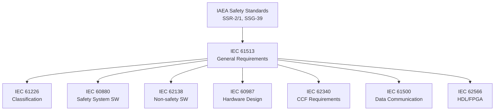
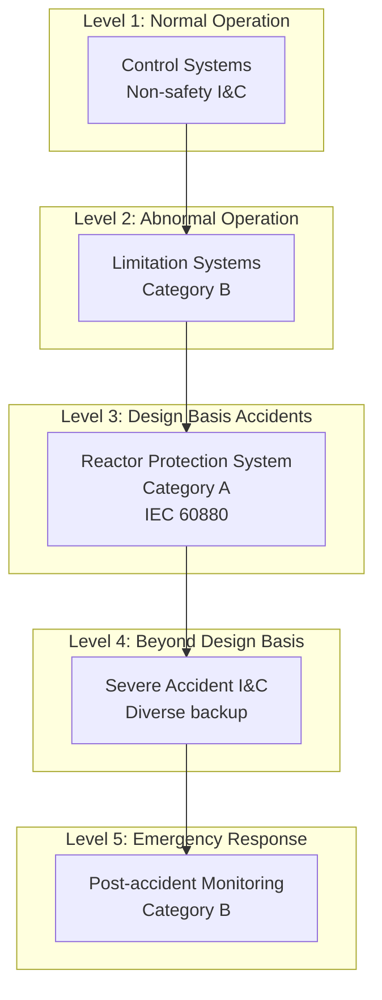
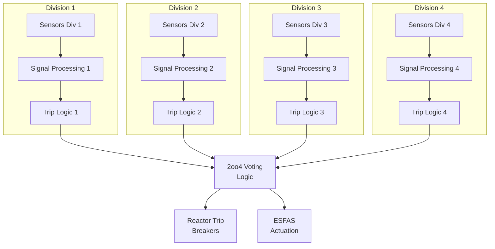
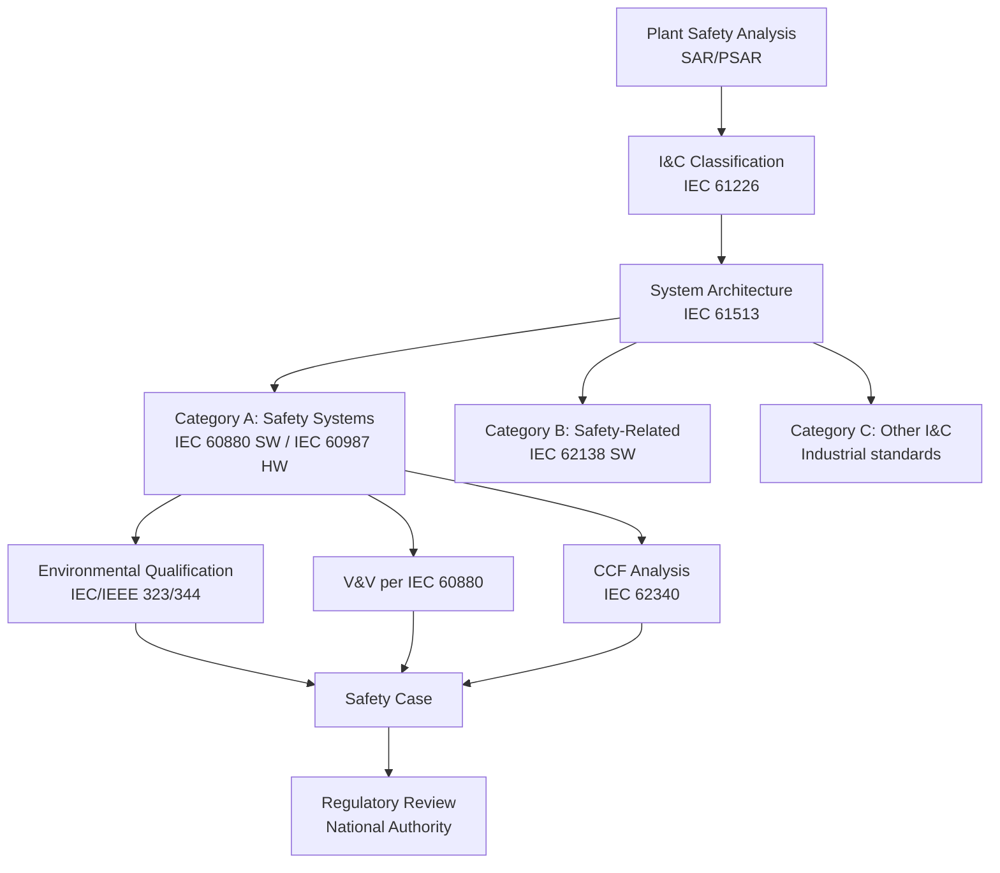
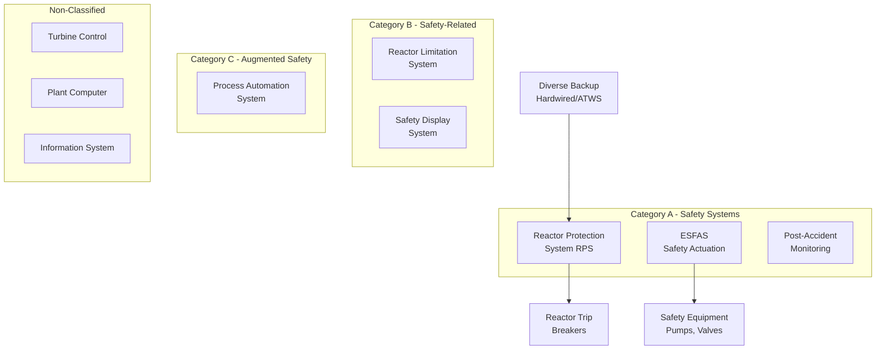
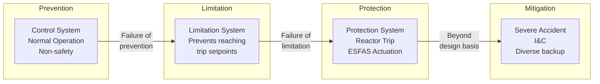

# IEC 61513 — Nuclear Power Plants — Instrumentation and Control for Safety

**Standard:** IEC 61513:2011 (Edition 2)  
**Title:** Nuclear Power Plants — Instrumentation and Control Important to Safety — General Requirements for Systems  
**SDO:** IEC SC45A  
**Audience:** Nuclear I&C engineers, safety system designers, regulatory assessors, nuclear safety analysts  
**Prerequisites:** IEC 61508, nuclear safety fundamentals (defense-in-depth), IAEA safety guides

---

## Chapter 1 — Historical Context & Origin Story

### 1.1 Nuclear Safety Context

Nuclear power plants have the most stringent safety requirements of any industry. A reactor protection system failure can lead to:
- Core damage (meltdown)
- Radioactive release (affecting millions)
- Exclusion zones for decades (Chernobyl, Fukushima)

**Nuclear I&C safety philosophy:** Multiple independent, diverse barriers (defense-in-depth) ensuring reactor is always in a safe state.

### 1.2 Key Nuclear Accidents Driving I&C Standards

| Year | Event | I&C Lesson |
|------|-------|-----------|
| 1979 | Three Mile Island (USA) | Human factors, I&C interface design |
| 1986 | Chernobyl (USSR) | Safety system bypass, RBMK design flaw |
| 2011 | Fukushima (Japan) | Common cause (flooding), power supply |
| 2003 | Davis-Besse (USA) | Degraded safety system undetected |

### 1.3 Nuclear I&C Standards Hierarchy



### 1.4 Development History

| Year | Milestone |
|------|-----------|
| 1982 | IEC 60880:1986 (first nuclear software standard) |
| 2001 | IEC 61513:2001 Edition 1 |
| 2011 | IEC 61513:2011 Edition 2 (current) |
| 2016 | IEC 60880:2006+AMD1:2016 (nuclear safety SW update) |
| 2020s | SMR (Small Modular Reactor) driving new I&C approaches |

---

## Chapter 2 — Standard Architecture & Structure

### 2.1 Scope

IEC 61513 covers the **complete I&C architecture** of nuclear power plants:
- Reactor Protection System (RPS)
- Engineered Safety Features Actuation System (ESFAS)
- Post-accident monitoring
- Safety-related support systems
- Non-safety I&C (defense-in-depth consideration)

### 2.2 I&C Safety Categories (IEC 61226)

| Category | Function | Integrity |
|----------|----------|-----------|
| **Category A** | Safety function execution (reactor trip, ECCS) | Highest — Class 1E equivalent |
| **Category B** | Safety-related support (post-accident monitoring) | High |
| **Category C** | Functions augmenting safety (non-class 1E safety-related) | Moderate |
| **Unclassified** | Normal operation (not safety-related) | Standard industrial |

### 2.3 Defense-in-Depth for I&C



---

## Chapter 3 — Technical Deep Dive

### 3.1 Safety System Architecture Requirements

**Fundamental principles:**

| Principle | Requirement |
|-----------|-------------|
| Redundancy | 4-fold (2oo4 or similar) for reactor protection |
| Independence | Physical, electrical, functional separation |
| Diversity | Different design/technology for backup systems |
| Fail-safe | Failure → safe state (reactor trip) |
| Single failure criterion | Any single failure cannot prevent safety action |
| Common cause failure | Must be addressed with diversity |
| Separation | Safety from non-safety (physical barriers) |
| Qualification | Environmental (seismic, LOCA, EMC) |

### 3.2 Typical Reactor Protection System Architecture



### 3.3 Software for Nuclear Safety (IEC 60880)

IEC 60880 is the nuclear-specific software standard (analogous to EN 50128 SIL 4 or DO-178C DAL A):

| Requirement | IEC 60880 |
|-------------|-----------|
| Formal specification | Required (recommended: Z, VDM, B) |
| Programming language | Restricted subset (no dynamic alloc, no recursion) |
| Module testing | 100% branch coverage minimum |
| Independence | V&V team independent from development |
| Diversity | Diverse backup system required |
| Pre-existing software | Extensive qualification process |
| Security | Protection against unauthorized modification |
| Life cycle | Full V-model with traceability |

### 3.4 Common Cause Failure Requirements (IEC 62340)

| CCF Measure | Requirement |
|-------------|-------------|
| **Functional diversity** | Different parameters to detect same event (pressure AND temperature AND level) |
| **Equipment diversity** | Different hardware platforms per division |
| **Software diversity** | Different algorithms, languages, or platforms |
| **Physical separation** | Divisions in separate rooms/buildings |
| **Environmental qualification** | Each division survives accident conditions independently |
| **Human diversity** | Different teams developing different divisions |
| **Diverse backup system** | Completely independent system using different technology |

### 3.5 Quantitative Reliability Targets

| System | Unavailability Target | Frequency Target |
|--------|----------------------|------------------|
| Reactor Protection System | < 10⁻⁵ per demand | — |
| ECCS (Emergency Core Cooling) | < 10⁻⁴ per demand | — |
| Core Damage Frequency (CDF) | — | < 10⁻⁵/reactor-year |
| Large Early Release Frequency (LERF) | — | < 10⁻⁶/reactor-year |

---

## Chapter 4 — Implementation Guide

### 4.1 I&C Architecture Design Process



### 4.2 Digital I&C Modernization Challenges

Many nuclear plants (built 1970-1990) are replacing analog I&C with digital:

| Challenge | Description |
|-----------|-------------|
| Software CCF | All divisions running same code = one bug affects all |
| Cybersecurity | Digital systems vulnerable to cyber attack |
| Determinism | Ensuring bounded response time (no OS jitter) |
| Complexity | Digital systems more complex than analog → harder to qualify |
| Regulatory acceptance | Conservative regulators cautious about digital in Category A |
| Qualification | Environmental testing more complex for electronics |
| Obsolescence | Digital components lifecycle < plant lifetime (60+ years) |

### 4.3 Solutions to Software CCF

| Approach | Description | Example |
|----------|-------------|---------|
| Diverse platforms | Different PLC vendors per division pair | Div 1&2: Vendor A, Div 3&4: Vendor B |
| Diverse software | Different code (N-version) for same function | Separate teams, different algorithms |
| Diverse backup | Analog/hardwired diverse trip system | ATWS (Anticipated Transient Without SCRAM) |
| Functional diversity | Different parameters trigger same trip | High pressure OR high temperature → trip |
| Simplicity | Reduce software complexity to minimum | Simple threshold comparisons only |

### 4.4 Cybersecurity for Nuclear I&C

| Level | Protection |
|-------|-----------|
| Level 0 (Safety system) | Air-gapped, no network connection, physical access control |
| Level 1 (Safety-related) | Isolated network, unidirectional gateways |
| Level 2 (Control) | Firewalled, monitored |
| Level 3 (Plant network) | Standard enterprise security |
| Level 4 (Corporate) | Internet-facing, maximum security |

**Regulatory requirement (post-Stuxnet):** Nuclear safety systems must be physically isolated from any network-connected system. Data diodes (one-way) only for monitoring data extraction.

---

## Chapter 5 — Certification & Audit

### 5.1 Nuclear Regulatory Framework

| Country | Authority | Process |
|---------|-----------|---------|
| USA | NRC (Nuclear Regulatory Commission) | 10 CFR 50 / 10 CFR 52 |
| France | ASN (Autorité de Sûreté Nucléaire) | INB process |
| UK | ONR (Office for Nuclear Regulation) | GDA + site licence |
| Germany | BMU + state authorities | AtG process |
| Japan | NRA (Nuclear Regulation Authority) | Post-Fukushima regulations |
| International | IAEA | Safety guides (advisory) |
| South Korea | NSSC | Operating licence process |

### 5.2 Licensing Process for I&C

1. **Preliminary Safety Analysis Report (PSAR):** I&C architecture described
2. **Detailed design review:** NRC reviews compliance with criteria
3. **Environmental qualification report:** Prove equipment survives accident
4. **Software V&V report:** Full IEC 60880 compliance evidence
5. **CCF/diversity analysis:** IEC 62340 compliance
6. **Cybersecurity plan:** Protection of digital I&C
7. **Factory Acceptance Test (FAT):** Pre-installation testing
8. **Site Acceptance Test (SAT):** Post-installation verification
9. **Operating licence amendment:** Regulatory approval to operate

### 5.3 NRC Digital I&C Review

**US NRC uses:**
- NUREG-0800 SRP Chapter 7 (I&C review criteria)
- Branch Technical Position 7-14 (digital I&C)
- RG 1.152 (Software for computers in safety systems)
- RG 1.153 (Diversity and defense-in-depth)

---

## Chapter 6 — Regional & Domain Variants

### 6.1 IEC vs. IEEE Standards (Nuclear)

| Topic | IEC Standard | IEEE/NRC Equivalent |
|-------|-------------|-------------------|
| General requirements | IEC 61513 | IEEE 603 |
| Safety system software | IEC 60880 | IEEE 7-4.3.2 |
| Non-safety software | IEC 62138 | — |
| Classification | IEC 61226 | IEEE 603 + RG 1.97 |
| Qualification | IEC 60780 | IEEE 323 + IEEE 344 |
| CCF | IEC 62340 | NUREG-6303 |
| FPGA/HDL | IEC 62566 | Emerging NRC guidance |

### 6.2 Small Modular Reactor (SMR) I&C

| SMR Feature | I&C Impact |
|-------------|-----------|
| Passive safety | Less reliance on active I&C |
| Multi-module | Shared vs. independent I&C per module |
| Factory-built | I&C fully integrated before shipping |
| Remote operation | Cybersecurity + human factors |
| Load following | More dynamic control requirements |
| Simplified design | Potential for simplified I&C (fewer divisions) |

---

## Chapter 7 — Comparison with Other High-Integrity Standards

| Feature | IEC 61513/60880 (Nuclear) | EN 50128 (Railway SIL 4) | DO-178C (DAL A) |
|---------|--------------------------|--------------------------|-----------------|
| Redundancy | 4-fold (2oo4) | 2-fold (2oo2) typical | Dual (dissimilar) |
| Diversity | Mandatory (different platforms) | Highly recommended | Not required |
| CCF analysis | Dedicated standard (IEC 62340) | Part of EN 50129 | Not explicit |
| Formal methods | Required (IEC 60880) | Highly recommended (SIL 4) | Supplement (DO-333) |
| Regulatory review | Government agency review | ISA + NSA | DER/ODA |
| Certification cycle | 5-10 years typical | 2-5 years | 1-3 years |
| Cost (I&C system) | $100M-$500M | $10M-$100M | $5M-$50M |
| Plant lifetime | 60-80 years | 30-50 years | 20-30 years |
| Cybersecurity | Air gap mandatory | TS 50701 reference | DO-326A |

---

## Chapter 8 — Mermaid Architecture Diagrams

### 8.1 Nuclear Plant I&C Architecture



### 8.2 Defense-in-Depth I&C Layers



---

## Chapter 9 — Case Studies & Failure Analysis

### 9.1 Olkiluoto 3 (Finland) — Digital I&C Licensing Challenges

**System:** AREVA EPR — first new-build with fully digital Category A I&C in Western regulation.

**Challenge:**
- 4 division protection system with digital PLCs (TELEPERM XS)
- Finnish authority STUK required demonstration of no software CCF across divisions
- Diverse backup system (hardwired) required
- Licensing review took 10+ years (partly due to I&C questions)

**Lessons:**
- Digital I&C licensing in nuclear is extremely time-consuming
- Diversity requirements increase cost and complexity significantly
- Early regulatory engagement essential

### 9.2 Hatch Nuclear Plant (USA) — Partial SCRAM Due to I&C

**Scenario (2006):** Software update to condensate system computer caused unexpected valve closure → loss of feedwater → reactor automatically scrammed.

**Root cause:** Non-safety system change propagated to safety-relevant parameter (feedwater level) triggering protective action.

**IEC 61513 lessons:**
- Separation between safety and non-safety must be absolute
- Configuration management for ALL I&C (not just safety)
- Change impact analysis must consider cross-system effects
- Data flow from non-safety to safety must be through qualified isolation

---

## Chapter 10 — Future Evolution & Industry Trends

### 10.1 Next-Generation Nuclear I&C

| Trend | Description |
|-------|-------------|
| **FPGA-based safety systems** | Replace software with hardware logic (eliminates software CCF) |
| **SMR I&C** | Simplified, factory-tested, fewer divisions |
| **AI for monitoring** | ML for anomaly detection (non-safety, advisory) |
| **Digital twin** | Real-time plant model for operator support |
| **Advanced HMI** | Improved human-machine interface (lessons from Fukushima) |
| **Cybersecurity** | Evolving threat landscape (state actors) |
| **Autonomous operation** | Remote monitoring of SMR fleet |

### 10.2 FPGA Trend (IEC 62566)

**Why FPGA for nuclear safety:**
- No operating system → no OS bugs
- Deterministic execution → guaranteed response time
- Hardware implementation → no software CCF argument needed
- Simpler to qualify (smaller state space)
- Long component availability (vs. microprocessors)

---

## Chapter 11 — Interview Questions & Career Guide

### Tier 1: Entry-Level (0-3 years)

**Q1:** What is the defense-in-depth concept for nuclear I&C?  
**A:** Defense-in-depth means multiple independent barriers: (1) Control systems prevent abnormal conditions (normal operation). (2) Limitation systems prevent reaching safety limits. (3) Protection systems (reactor trip, ESFAS) mitigate accidents. (4) Diverse backup systems handle beyond-design-basis events. (5) Post-accident monitoring supports emergency response. Each level is independent — failure of one level doesn't affect others. I&C at each level uses different equipment, different principles, different teams.

**Q2:** Why is redundancy (4 divisions) used in nuclear reactor protection?  
**A:** (1) Single failure criterion: any single component failure must not prevent safety action → need at least 2 (1oo2). (2) Maintenance: must be able to maintain one division while maintaining protection → need at least 3. (3) Testing: must be able to test one division while maintaining both protection AND maintenance capability → 4 divisions (2oo4). (4) Spurious trip avoidance: 2oo4 voting means 2 divisions must agree before trip → reduces unnecessary plant shutdowns while maintaining safety. (5) Regulatory requirement: 10 CFR 50 / IAEA SSR-2/1 require single failure tolerance + maintenance + testing.

### Tier 2: Mid-Level (3-8 years)

**Q3:** How do you address software common cause failure in a digital reactor protection system?  
**A:** Multiple layers: (1) Functional diversity: Use different measured parameters for same trip function (high pressure trip uses different sensors than high temperature trip — both detect LOCA). (2) Platform diversity: Division pairs on different hardware/software platforms (Div 1&2 on Vendor A, Div 3&4 on Vendor B). (3) Defensive measures: Simple code (threshold comparisons only), restricted language subset, formal verification, independent V&V. (4) Diverse backup: Completely independent hardwired or FPGA-based trip system using different logic, different sensors, different actuation paths. (5) Qualification: Extensive testing under all conditions. (6) Separation: Each division physically isolated (separate rooms, power supplies, cables). (7) Administrative: Different development teams for different platforms.

### Tier 3: Senior/Lead (8-15 years)

**Q4:** You're designing I&C for a new SMR. How does the architecture differ from a traditional large PWR?  
**A:** (1) Passive safety reduces I&C demands: Gravity-driven ECCS doesn't need pump start signals. Natural circulation core cooling doesn't need forced flow control. Less active equipment → fewer safety actuation signals. (2) Potentially fewer divisions: If passive safety provides inherent protection, might justify 2oo3 instead of 2oo4 (regulatory discussion needed). (3) Factory integration: Entire I&C tested at factory before shipment → complete FAT covering all scenarios. (4) Multi-module considerations: Shared I&C for fleet monitoring vs. independent protection per module. Decision: protection MUST be per-module independent, monitoring can be shared. (5) Remote operation: Multi-module SMRs may have one control room for several units → human factors, cybersecurity, single-operator-multiple-units analysis. (6) Simplified software: Fewer process variables, simpler trip logic → potentially qualifiable to highest level with less effort.

### Tier 4: Principal/Distinguished (15+ years)

**Q5:** Make the case for or against using AI/ML in nuclear Category A I&C.  
**A:** **Against (current position):** (1) Non-deterministic: Cannot prove all possible outputs are safe for all possible inputs. (2) No traceability: Cannot trace specific training data to specific safety decision. (3) No formal proof: Cannot mathematically prove neural network satisfies safety property. (4) Opacity: Regulators cannot review "reasoning" of black-box model. (5) Training data bias: Nuclear accident data is extremely rare → training set inadequate. (6) CCF amplification: If all divisions use same ML model → systematic failure = common cause. **For (future consideration):** (1) Pattern recognition: Could detect degraded conditions earlier than threshold-based. (2) Validated envelope: If AI output is always checked against deterministic safety function (safety bag), AI only affects availability not safety. (3) Limited application: VERY specific, well-bounded problems (sensor validation, condition monitoring) where AI improves detection but trip decision remains deterministic. **My position:** AI acceptable in advisory/monitoring role (non-Category A) today. For Category A: only as additional input with deterministic override — never as sole safety function. Regulation and verification methodology must evolve significantly before AI in Category A becomes feasible (10-20 year horizon).

---

## Chapter 12 — Cheat Sheet & Quick Reference

### Nuclear I&C Classification

```
Category A = Safety Functions (RPS, ESFAS) → IEC 60880 software
Category B = Safety-Related (monitoring, support) → IEC 62138 software
Category C = Augmenting safety (non-classified but defense-in-depth)
Unclassified = Normal operation (standard industrial practice)
```

### Key Design Principles

```
1. Redundancy:      4 divisions (2oo4 voting typical)
2. Independence:    Physical + electrical + functional separation
3. Diversity:       Different technology for different divisions
4. Fail-safe:       Failure → reactor trip (de-energize to trip)
5. Single failure:  Any one failure cannot prevent safety action
6. CCF:             Diverse backup + functional diversity
7. Qualification:   Seismic + LOCA + EMC + aging
8. Separation:      Safety isolated from non-safety (no data path to safety)
9. Cybersecurity:   Air gap for Category A
10. Simplicity:     Minimum complexity in safety logic
```

### Key IEC Standards for Nuclear I&C

| Standard | Topic |
|----------|-------|
| IEC 61513 | Overall I&C requirements |
| IEC 61226 | Classification of I&C functions |
| IEC 60880 | Software for Category A (safety) |
| IEC 62138 | Software for Category B/C |
| IEC 62340 | Common cause failure |
| IEC 60987 | Hardware design qualification |
| IEC 61500 | Data communication in I&C |
| IEC 62566 | FPGA/HDL development |
| IEC 62671 | Testing (FPGA) |

---

*End of Document — 11_IEC_61513_Nuclear.md*
