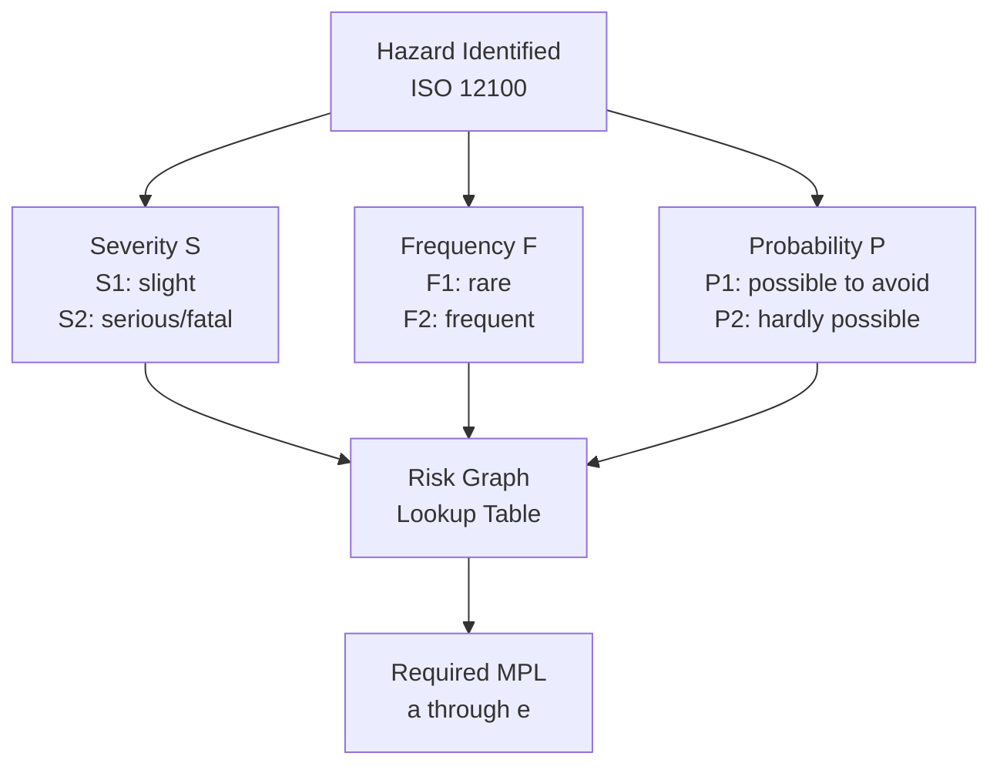
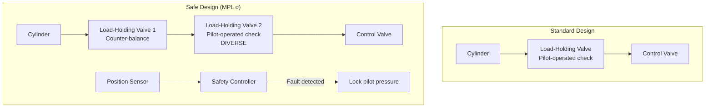
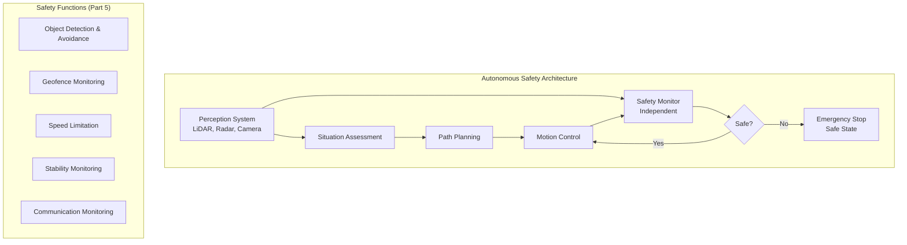
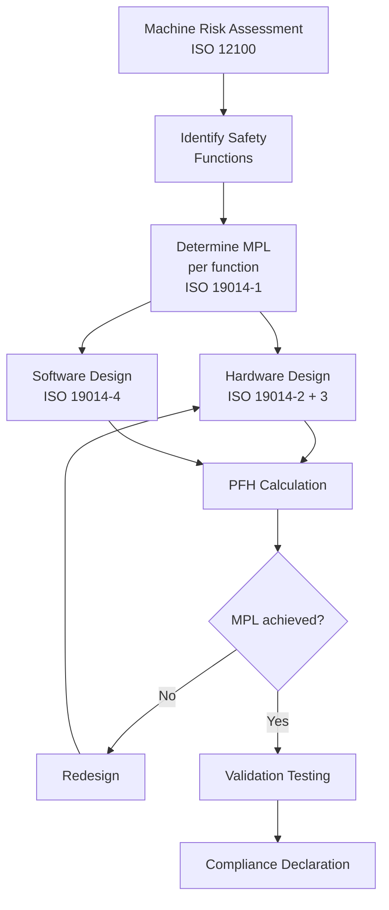
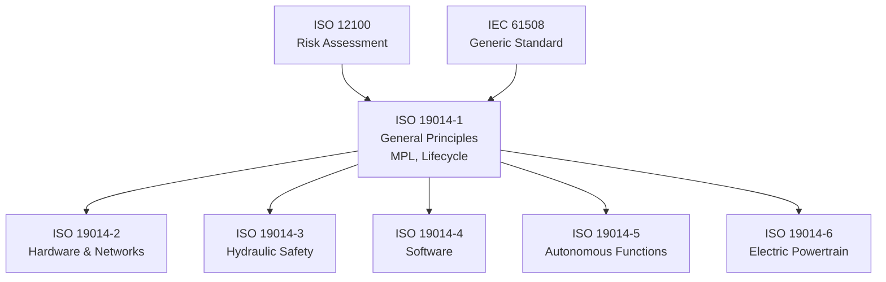
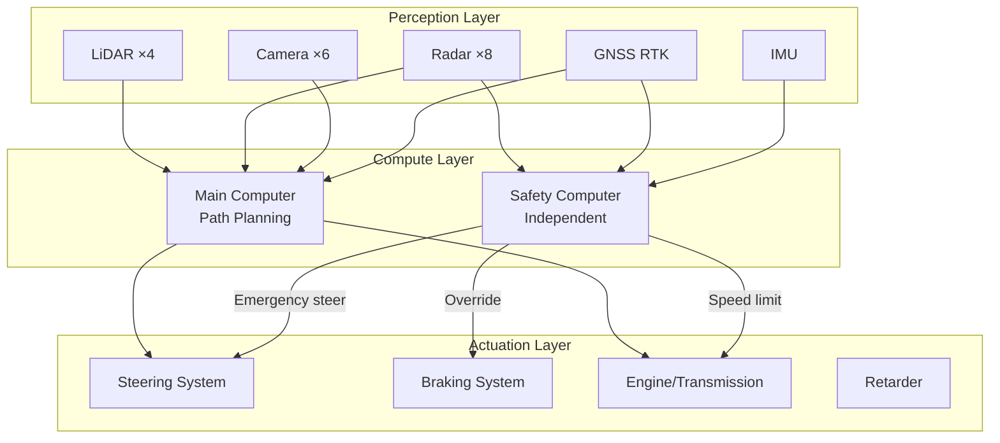

# ISO 19014 — Earth-Moving Machinery — Functional Safety

**Standard:** ISO 19014:2018-2022 (Multi-part)  
**Title:** Earth-Moving Machinery — Functional Safety  
**SDO:** ISO TC127/SC2  
**Parts:** 6 Parts  
**Audience:** Construction equipment engineers, hydraulic system designers, autonomous machine developers  
**Prerequisites:** IEC 61508, ISO 12100, hydraulic/mobile machinery design fundamentals

---

## Chapter 1 — Historical Context & Origin Story

### 1.1 Earth-Moving Machinery Context

Earth-moving machinery (excavators, bulldozers, wheel loaders, dump trucks) operates in high-risk environments:
- Heavy masses in motion (>50 tonnes)
- Complex hydraulic systems (>300 bar pressure)
- Operator and bystander proximity
- Unstructured terrain
- Poor visibility
- Increasing automation/autonomy

### 1.2 Why ISO 19014?

Traditional safety: **ISO 13849** and **IEC 62061** developed for factory machinery.  
Earth-moving machines are fundamentally different:
- Primarily hydraulic actuation (not electric)
- Mobile (terrain, slopes, unstable ground)
- Outdoor (extreme environment)
- Single operator controlling multiple functions
- Proximity to other machines and workers on site
- Long service life (15-25 years)
- Very high repair costs ($1M+ machines)

### 1.3 Development Timeline

| Year | Milestone |
|------|-----------|
| 2010 | ISO TC127 initiates functional safety project |
| 2014 | Working drafts circulated |
| 2018 | ISO 19014-1 and -2 published |
| 2020 | ISO 19014-3 (hydraulics) published |
| 2021 | ISO 19014-4 (software) published |
| 2022 | ISO 19014-5 (autonomous) published |
| 2022 | ISO 17757 (autonomous machine safety) published |

---

## Chapter 2 — Standard Architecture & Structure

### 2.1 Multi-Part Structure

| Part | Title | Scope |
|------|-------|-------|
| **Part 1** | General principles | Framework, MPL concept, lifecycle |
| **Part 2** | Design and evaluation of hardware and networks | HW metrics, architecture |
| **Part 3** | Design and evaluation of hydraulic SRP/CS | Hydraulic safety functions |
| **Part 4** | Design and evaluation of software | SW development |
| **Part 5** | Design and evaluation of autonomous functions | Autonomous/remote |
| **Part 6** | Electrical power train (under development) | Electric/hybrid drives |

### 2.2 Machine Performance Level (MPL)

**Unique to ISO 19014:** Uses MPL (not PL or SIL) but numerically equivalent to PL:

| MPL | PFH range | Equivalent |
|-----|-----------|-----------|
| MPL a | ≥ 10⁻⁵ to < 10⁻⁴ | PL a |
| MPL b | ≥ 3×10⁻⁶ to < 10⁻⁵ | PL b |
| MPL c | ≥ 10⁻⁶ to < 3×10⁻⁶ | PL c / SIL 1 |
| MPL d | ≥ 10⁻⁷ to < 10⁻⁶ | PL d / SIL 2 |
| MPL e | ≥ 10⁻⁸ to < 10⁻⁷ | PL e / SIL 3 |

### 2.3 MPL Determination (Risk Graph)



---

## Chapter 3 — Technical Deep Dive

### 3.1 Hydraulic Safety (Part 3) — Unique to ISO 19014

Earth-moving machines are **primarily hydraulic** — this is the most distinctive aspect vs. other safety standards.

**Hydraulic failure modes:**

| Component | Failure Mode | Effect |
|-----------|-------------|--------|
| Spool valve | Stuck open | Uncontrolled actuator motion |
| Spool valve | Stuck closed | Loss of control (may be safe) |
| Hose burst | Sudden pressure loss | Uncontrolled load lowering |
| Pump | Overpressure | Structural failure |
| Pilot pressure loss | Loss of control signals | Depends on valve design |
| Load-holding valve | Fails open | Boom drops |

### 3.2 Hydraulic Architecture Categories

| Category | Description | MPL achievable |
|----------|-------------|---------------|
| Basic (single circuit) | Single valve, no monitoring | MPL a-b |
| Monitored (single + diagnostic) | Single valve with position sensor | MPL b-c |
| Redundant (dual circuit) | Two independent hydraulic paths | MPL c-d |
| Redundant + diverse | Two paths with different valve types | MPL d-e |

### 3.3 Load-Holding Safety Function

**Critical safety function:** Prevent boom/arm from falling if hydraulic failure occurs.



### 3.4 Software Development (Part 4)

| Activity | MPL a/b | MPL c | MPL d | MPL e |
|----------|---------|-------|-------|-------|
| SW requirements specification | Required | Required | Required | Required |
| Architecture design | — | Required | Required | Required |
| Module design | — | — | Required | Required |
| Coding standards | Recommended | Required | Required | Required |
| Module testing | Recommended | Required | Required | Required |
| Integration testing | Required | Required | Required | Required |
| Validation testing | Required | Required | Required | Required |
| Structural coverage | — | Statement | Branch | MC/DC (rec) |
| Static analysis | — | Recommended | Required | Required |
| FMEA of SW architecture | — | — | Required | Required |

### 3.5 Autonomous Machine Functions (Part 5)



---

## Chapter 4 — Implementation Guide

### 4.1 Typical Safety Functions for Earth-Moving Machinery

| Safety Function | Typical MPL | Safe State |
|----------------|-------------|-----------|
| Boom lowering protection | MPL d | Hold boom position |
| Swing lock | MPL c | Prevent swing motion |
| Travel speed limitation | MPL c | Limit travel speed |
| Tip-over protection | MPL d | Stop motion toward instability |
| Collision avoidance (autonomous) | MPL d-e | Emergency stop |
| Emergency stop | MPL c-d | All motions stop, brakes applied |
| Geofence (autonomous) | MPL d | Stop at boundary |
| Operator presence | MPL c | Stop all controlled motions |

### 4.2 Design Workflow



### 4.3 Hydraulic Safety Design Example

**Safety function:** Prevent excavator boom from falling on hose failure.

**Design (MPL d):**
1. Primary load-holding: Counter-balance valve on boom cylinder (mechanically held closed without pilot pressure)
2. Secondary: Pilot-operated check valve in series (diverse type)
3. Monitoring: Boom position sensor + expected vs. actual comparison
4. Detection: If boom moves without command → fault detected
5. Response: Lock pilot supply, alert operator, disable boom control

**PFH calculation:**
- Counter-balance valve λ_DU: 5×10⁻⁸/h
- Pilot check valve λ_DU: 3×10⁻⁸/h  
- Series (dual): PFH ≈ 2 × λ₁ × λ₂ × T_proof + β × max(λ₁, λ₂)
- With annual proof test and β=5%: PFH ≈ 4×10⁻⁷/h → meets MPL d

---

## Chapter 5 — Certification & Audit

### 5.1 Regulatory Context

| Region | Regulation | ISO 19014 Role |
|--------|-----------|----------------|
| EU | Machinery Regulation 2023/1230 | Referenced by type-C standards |
| USA | OSHA + MSHA (mining) | Voluntary standard |
| ISO (global) | Type-C standards reference ISO 19014 | Framework for machine types |
| Australia | WHS regulations | Referenced by Safe Work |

### 5.2 Self-Declaration vs. Third-Party

ISO 19014 supports self-declaration (like ISO 13849):
1. Manufacturer performs risk assessment
2. Designs per ISO 19014
3. Calculates PFH/validates MPL
4. Documents in Technical File
5. Declares conformity

Third-party assessment required only for:
- Autonomous machines (may need type examination)
- Mining machinery (MSHA approval in USA)
- Specific high-risk configurations

---

## Chapter 6 — Regional & Domain Variants

### 6.1 Related Earth-Moving Standards

| Standard | Scope |
|----------|-------|
| ISO 17757 | Autonomous machine safety (general) |
| ISO 15998 | Machine control systems — Electronic data interchange |
| ISO 16001 | Object detection — overview |
| ISO 20474 | Earth-moving — Safety (general) |
| ISO 10987 | Earth-moving — Operator workstation |

### 6.2 Mining-Specific Requirements

| Requirement | Mining Authority |
|-------------|-----------------|
| Autonomous haulage system (AHS) | MSHA (USA), state mining authorities (Australia) |
| Remote operation | Site-specific safety case |
| Collision avoidance | ISO 16001 + site requirements |
| Slope stability monitoring | Geotechnical + I&C |

---

## Chapter 7 — Comparison with Other Machinery Standards

| Feature | ISO 19014 | ISO 13849-1 | IEC 62061 | ISO 25119 |
|---------|-----------|-------------|-----------|-----------|
| Domain | Earth-moving/construction | General machinery | General machinery | Agriculture |
| Metric | MPL (a-e) | PL (a-e) | SIL (1-3) | AgPL (a-e) |
| Hydraulics | Part 3 (dedicated) | Basic guidance | Limited | Not addressed |
| Autonomous | Part 5 (dedicated) | Not addressed | Not addressed | ISO 18497 |
| Environment | Extreme outdoor | Factory | Factory | Extreme outdoor |
| Mobility | Core consideration | Mostly stationary | Stationary | Mobile |
| Operator | Heavy equipment operator | Industrial worker | Industrial worker | Farmer |
| Machine mass | 1-500+ tonnes | 0.1-100 tonnes | 0.1-50 tonnes | 1-50 tonnes |

---

## Chapter 8 — Mermaid Architecture Diagrams

### 8.1 ISO 19014 Part Structure



### 8.2 Autonomous Haul Truck Safety Architecture



---

## Chapter 9 — Case Studies & Failure Analysis

### 9.1 Autonomous Haul Trucks — Mining Success Story

**System:** Caterpillar 793F autonomous trucks at Rio Tinto iron ore mines (Australia)

**Safety architecture:**
- 450-tonne trucks operating 24/7 without drivers
- Multiple perception systems (radar, LiDAR, camera)
- Safety controller independent from navigation
- Geofence enforcement
- Emergency stop (remote + autonomous)
- Communication loss → stop within 30 seconds

**Results:**
- >3 billion tonnes hauled autonomously
- Zero fatalities (vs. regular accidents with manned trucks)
- Productivity +15-20% (no shift changes, fatigue)

### 9.2 Excavator Boom Drop Incident

**Scenario:** Excavator boom cylinder hose failed during trenching. Boom dropped rapidly.

**Root cause:** Single load-holding valve (counter-balance) was only protection. No secondary retention.

**ISO 19014-3 solution:**
- MPL c minimum for boom drop protection
- Dual load-holding (counter-balance + pilot check in series)
- Position monitoring for fault detection
- Would have prevented uncontrolled lowering

---

## Chapter 10 — Future Evolution & Industry Trends

### 10.1 Construction Industry Transformation

| Trend | ISO 19014 Impact |
|-------|-----------------|
| Fully autonomous sites | MPL e safety functions, fleet coordination |
| Electric/hydrogen machines | ISO 19014-6, new failure modes (HV, battery thermal) |
| 5G connectivity | Remote operation, cybersecurity |
| Digital twin | Virtual commissioning, predictive safety |
| Swarm operation | Multi-machine coordination safety |
| AI-based perception | Validation of ML for safety functions |
| Electro-hydraulic | Valve-by-wire replacing pilot hydraulics |

### 10.2 ISO 19014 + ISO 17757 Convergence

ISO 17757 (autonomous machine safety) and ISO 19014 Part 5 overlap:
- Expected future harmonization
- ISO 17757 is broader (all autonomous mobile machines)
- ISO 19014-5 is earth-moving specific (includes slope, payload, tip-over)

---

## Chapter 11 — Interview Questions & Career Guide

### Tier 1: Entry-Level (0-3 years)

**Q1:** What is MPL and how does it relate to PL/SIL?  
**A:** MPL (Machine Performance Level) is the safety integrity metric in ISO 19014 for earth-moving machinery. Levels a-e with PFH values identical to ISO 13849 PL a-e. Created because earth-moving machines have unique challenges (hydraulic systems, extreme environment, mobility, autonomous operation) not adequately addressed by ISO 13849 or IEC 62061. MPL c ≈ SIL 1, MPL d ≈ SIL 2, MPL e ≈ SIL 3.

**Q2:** Why does ISO 19014 have a dedicated part for hydraulic safety?  
**A:** Earth-moving machines are primarily hydraulic — 80%+ of actuators are hydraulic cylinders/motors. Hydraulic failures (hose burst, valve stuck, pump failure) create unique hazards: uncontrolled boom drop, swing, travel. ISO 13849 has minimal hydraulic guidance. ISO 19014-3 addresses: hydraulic failure modes, load-holding valve architectures, hydraulic fault detection, proof testing of hydraulic components, PFH data for hydraulic components. Without Part 3, designers would lack methodology for most safety-critical subsystems.

### Tier 2: Mid-Level (3-8 years)

**Q3:** Design a safety system for tip-over protection of a 40-tonne excavator on a slope.  
**A:** (1) Safety function: If machine approaches tip-over angle, restrict boom extension and swing. (2) MPL: d (fatal if tip-over). (3) Sensors: Dual-axis inclinometer (two independent sensors for MPL d), boom/arm position sensors, load in bucket (pressure sensors). (4) Algorithm: Calculate static stability based on geometry + mass + inclination + load. If stability factor <1.5 → restrict motion that worsens stability. If <1.2 → retract boom automatically. (5) Architecture: Safety ECU (independent from main controller) calculates stability continuously. Limits pilot pressure to restrict unsafe motion. (6) Validation: Physical testing on calibrated slope with known loads. Compare calculated vs. actual tip angle. (7) Challenge: Dynamic stability during swing → need acceleration/velocity information → more complex model.

### Tier 3: Senior/Lead (8-15 years)

**Q4:** You're designing the safety system for a fully autonomous mining haul truck (250 tonnes). Describe the safety architecture.  
**A:** (1) **Safety functions:** Collision avoidance (MPL e — fatality probable), speed control on ramp (MPL d), geofence (MPL d), edge detection (cliff) (MPL e), communication loss handling (MPL d). (2) **Perception (diverse):** LiDAR (4× for 360°) + radar (8× short/long range) + stereo camera (6×) + GNSS RTK (dual receiver). Safety monitor uses radar + GNSS only (independent from AI-based main perception). (3) **Compute:** Main computer (GPU-based, path planning, AI perception) + safety computer (certified, deterministic, simple logic). Safety computer has authority to brake/stop overriding main computer. (4) **Actuation:** Braking: dual-circuit hydraulic + service brake + retarder. Safety computer can apply emergency brake independently. Steering: electrohydraulic with fallback to mechanical centering. (5) **Communication:** Primary: dedicated mine WiFi. Secondary: 4G/5G. Loss of both → controlled stop within process safety time. (6) **Safe states:** Emergency stop → service brake + park brake. Controlled stop → reduce speed, pull to safe zone, then stop. (7) **Site-level:** Traffic management system (TMS) prevents route conflicts, but each truck must be safe independently (TMS failure ≠ collision).

### Tier 4: Principal/Distinguished (15+ years)

**Q5:** How should ISO 19014 evolve to address AI/ML-based perception for safety functions in autonomous construction machines?  
**A:** (1) **Current gap:** ISO 19014-5 assumes deterministic safety functions. AI perception (object classification, scene understanding) is non-deterministic → cannot directly achieve MPL through traditional calculation. (2) **Architecture principle:** AI perception is NOT the safety function — it improves performance/availability. The safety function must have a deterministic fallback (e.g., radar-based zone monitoring). (3) **Proposed framework:** (a) Performance envelope: define minimum performance metrics for AI (detection probability, false negative rate, latency) with statistical confidence. (b) Runtime monitoring: independent system monitors AI output consistency and reverts to safe mode if degraded. (c) Operational design domain (ODD): AI validated only within specific conditions (weather, terrain, object types). Outside ODD → safe state. (4) **Validation approach:** Large-scale scenario testing (10⁶+ scenarios), including adversarial conditions. Field operational testing with shadow mode. Statistical evidence of meeting target risk. (5) **Standard evolution needed:** New annex or part defining AI qualification methodology, minimum dataset requirements, runtime monitoring architecture, and statistical safety demonstration methods. Timeline: 3-5 years for normative guidance.

---

## Chapter 12 — Cheat Sheet & Quick Reference

### MPL Determination Quick Method

```
Severity:    S1 (slight/reversible) or S2 (serious/death)
Frequency:   F1 (rare) or F2 (frequent/continuous)
Probability: P1 (can avoid) or P2 (hardly avoidable)

S1+F1+P1 → MPL a    S2+F1+P1 → MPL b
S1+F1+P2 → MPL a    S2+F1+P2 → MPL c  
S1+F2+P1 → MPL b    S2+F2+P1 → MPL c
S1+F2+P2 → MPL b    S2+F2+P2 → MPL d
                     (with additional factors → MPL e)
```

### Hydraulic Safety Architectures (Part 3)

| MPL | Architecture | Example |
|-----|-------------|---------|
| a-b | Single valve + basic check | One counter-balance valve |
| c | Monitored single or basic redundant | Counter-balance + position monitoring |
| d | Redundant diverse | Counter-balance + pilot check + monitoring |
| e | Redundant diverse + high diagnostic | Dual diverse + continuous monitoring + self-test |

### Key Standards for Earth-Moving Safety

```
ISO 19014 (Parts 1-6) → Functional safety framework
ISO 12100 → Risk assessment method  
ISO 17757 → Autonomous mobile machine safety
ISO 16001 → Object detection systems
ISO 20474 → Earth-moving machinery safety (general)
IEC 61508 → Base generic standard (reference)
```

---

*End of Document — 12_ISO_19014_Earth_Moving.md*
