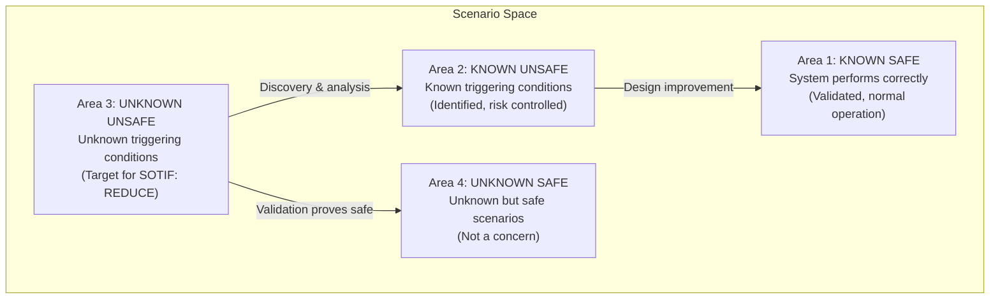
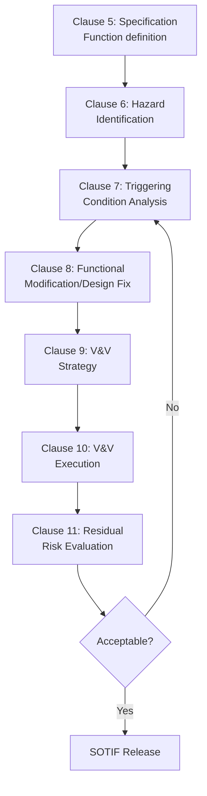
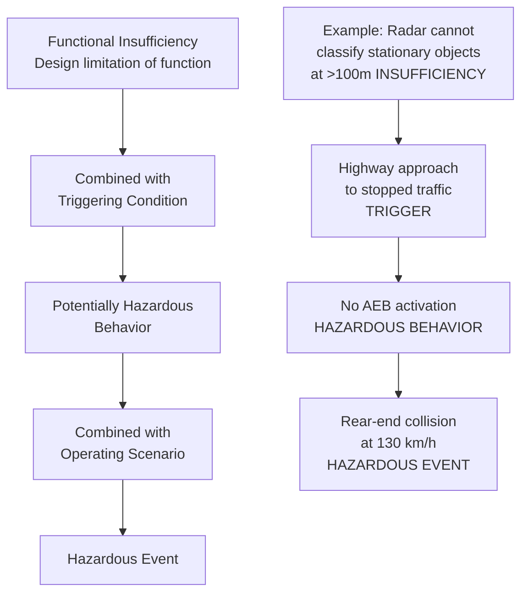
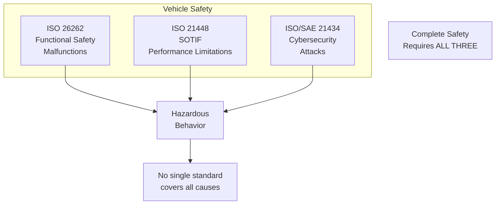
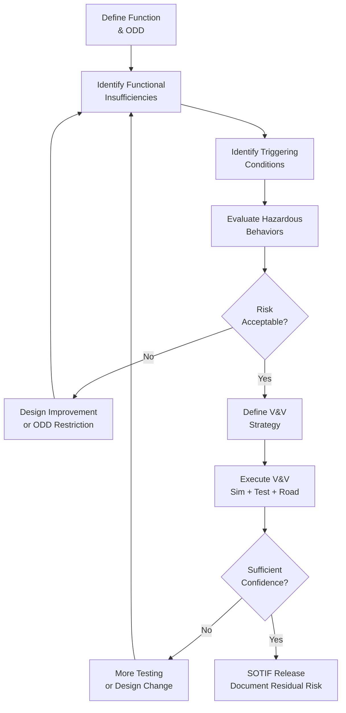
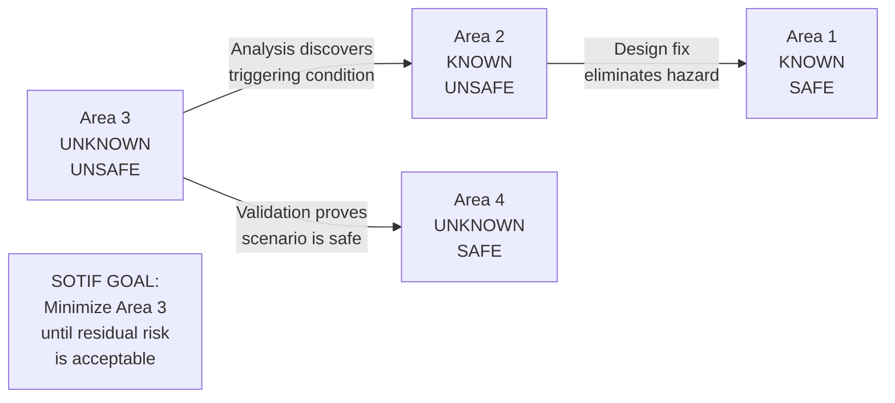

# ISO 21448 — SOTIF (Safety of the Intended Functionality)

**Standard:** ISO 21448:2022  
**Title:** Road Vehicles — Safety of the Intended Functionality  
**SDO:** ISO TC22/SC32/WG8  
**Audience:** ADAS/AD engineers, perception system designers, sensor fusion specialists, safety analysts  
**Prerequisites:** ISO 26262 (functional safety), ADAS fundamentals, ML/AI basics, sensor technology

---

## Chapter 1 — Historical Context & Origin Story

### 1.1 The Gap ISO 21448 Fills

**ISO 26262** addresses failures — malfunctioning behavior due to hardware faults or software bugs.

**But what about systems that work exactly as designed yet still cause harm?**

Examples:
- Radar classifies a stationary truck as "overhead sign" → no braking → collision
- Camera blinded by low sun → pedestrian not detected → collision
- AEB triggers on bridge shadow → unnecessary emergency braking → rear-end collision
- Lane keeping misinterprets road markings at construction zone → steers into barrier

**These are NOT malfunctions.** The system functions as designed — but the design didn't account for the scenario. This is the **SOTIF** problem.

### 1.2 SOTIF vs. Functional Safety

| Aspect | ISO 26262 (FuSa) | ISO 21448 (SOTIF) |
|--------|-------------------|-------------------|
| Addresses | Malfunctioning behavior (faults) | Intended functionality limitations |
| Root cause | HW fault, SW bug | Design limitation, triggering condition |
| Example | Radar fails → no detection | Radar works but misclassifies object |
| Approach | Fault avoidance + fault tolerance | Scenario analysis + validation |
| Metric | SPFM, LFM, PMHF | Residual risk from unknown scenarios |
| Applicable to | All E/E systems | Systems with sensing/perception/ML |

### 1.3 Development History

| Year | Milestone |
|------|-----------|
| 2017 | ISO/PAS 21448:2019 development started |
| 2019 | ISO/PAS 21448 published (Publicly Available Specification) |
| 2022 | ISO 21448:2022 published (full International Standard) |
| 2024 | Application guidance documents in development |
| 2025+ | ISO 21448 Amendment 1 (AI/ML specific, Level 3+ AD) |

---

## Chapter 2 — Standard Architecture & Structure

### 2.1 Standard Structure

| Clause | Title | Content |
|--------|-------|---------|
| 1-4 | Scope, References, Terms, Overview | Framework |
| 5 | Specification and design | Functional specification, safety analysis |
| 6 | Identification and evaluation of hazards | SOTIF-specific hazard analysis |
| 7 | Triggering conditions | Identification of conditions causing hazards |
| 8 | Functional modifications | Design improvements to reduce risk |
| 9 | Definition of verification and validation strategy | V&V approach |
| 10 | Verification and validation | Test/analysis execution |
| 11 | Evaluation of residual risk | Acceptance criteria |

### 2.2 The Four-Area Model (Key Concept)



**SOTIF goal:** Reduce Area 3 (unknown unsafe) until residual risk is acceptably low.

### 2.3 SOTIF Activities Flow



---

## Chapter 3 — Technical Deep Dive

### 3.1 Triggering Conditions

**Triggering condition (TC) = A specific condition that can lead to a potentially hazardous behavior of the intended functionality.**

| Category | Examples |
|----------|---------|
| **Environmental** | Rain, fog, low sun, night, snow, dust, reflections |
| **Scenery** | Road markings faded, construction zone, unusual road geometry |
| **Traffic** | Cut-in, pedestrian occluded, motorcycle between lanes |
| **Object** | Stationary vehicle (unusual classification), debris |
| **Sensor limitation** | Radar multipath, camera saturation, LiDAR rain noise |
| **Algorithm limitation** | ML model blind spot, classification error, tracker lost |
| **Human factors** | Mode confusion, over-trust, drowsy takeover |

### 3.2 SOTIF Hazard Analysis

**HARA (ISO 26262) addresses malfunction severity.**  
**SOTIF hazard analysis addresses intended function limitation severity.**

| Analysis Step | Method |
|---------------|--------|
| Define intended function | Use cases, operational design domain (ODD) |
| Identify potential hazards | Hazardous behaviors from limitations |
| Identify triggering conditions | Environmental/scenario analysis |
| Evaluate severity | Same S/E/C as ISO 26262 (consequence-based) |
| Determine risk reduction strategy | Design improvement, restriction, warning |

### 3.3 Sensor Performance Limitations

| Sensor | Known Limitations | SOTIF Scenario |
|--------|------------------|----------------|
| Camera | Low sun, darkness, dirt, rain, fog | Miss pedestrian in low-contrast |
| Radar | Multipath, static clutter, metal objects | Classify guardrail as vehicle |
| LiDAR | Rain/snow noise, black objects, glass | Miss dark vehicle at night |
| Ultrasonic | Wind, temperature, material absorption | Miss soft obstacle (person) |
| GNSS | Urban canyon, tunnel, multipath | Position error → wrong lane |

### 3.4 Functional Insufficiency vs. Triggering Conditions



### 3.5 Relationship to Operational Design Domain (ODD)

| ODD Element | SOTIF Relevance |
|-------------|----------------|
| Road type | Highway vs. urban → different triggering conditions |
| Speed range | Higher speed = less time to respond |
| Weather | Reduced sensor performance = higher SOTIF risk |
| Lighting | Night/tunnel/low sun = camera limitations |
| Traffic density | More objects = higher classification challenge |
| Geofence | Restricting operation reduces exposure to unknowns |

---

## Chapter 4 — Implementation Guide

### 4.1 SOTIF Process Steps

**Step 1 — Function Definition:**
- Describe intended functionality precisely
- Define ODD (where/when function operates)
- Identify all sensors and algorithms involved
- Document known limitations of each component

**Step 2 — Hazard Identification:**
- Systematic identification of potentially hazardous behaviors
- Consider: wrong action, missing action, too early/late action
- Map to ISO 26262 HARA where applicable

**Step 3 — Triggering Condition Analysis:**
- Environmental conditions that stress sensor performance
- Traffic scenarios that challenge algorithm assumptions
- Combinations of conditions (e.g., rain + night + construction)
- Use: scenario databases, field data, simulation

**Step 4 — Risk Evaluation:**
- Evaluate each TC: probability of occurrence × severity
- Consider existing mitigations (driver alertness, system limits)
- Identify unacceptable residual risks

**Step 5 — Design Improvements:**
- Sensor redundancy/diversity (add LiDAR where radar insufficient)
- Algorithm improvement (better ML model, edge case training)
- ODD restriction (limit operation in conditions)
- Driver warning/handoff strategy

**Step 6 — Validation:**
- Prove that Area 3 is sufficiently small
- Combination: simulation + proving ground + public road
- Statistical confidence arguments

### 4.2 V&V Strategy for SOTIF

| Method | Strength | Weakness | Coverage |
|--------|----------|----------|----------|
| Simulation | Massive scale (billions of km), all conditions | Fidelity gap to reality | Area 3 exploration |
| Proving ground | Controlled, repeatable, safe | Limited scenarios, expensive | Area 2 verification |
| Public road testing | Real-world conditions | Statistical significance requires millions km | Area 3→4 confidence |
| Scenario-based testing | Targeted at known edge cases | Only covers known scenarios | Area 2 verification |
| Shadow mode | Real sensors, no actuation | No closed-loop effects | Area 3 discovery |
| Formal analysis | Mathematical guarantees | Limited to simple algorithms | Area 1/2 boundary |

### 4.3 Acceptance Criteria

**How much validation is enough?**

RAND Corporation estimate: To prove a Level 4 AD system is 10× safer than human:
- Need ~10 billion miles of driving without fatal error
- Or equivalent statistical confidence through simulation + real-world combination

**ISO 21448 approach:**
- Demonstrate that residual risk (Area 3) is below societal acceptance level
- Combination of:
  - Systematic analysis (reduce Area 3 by discovering triggering conditions)
  - Testing (prove Area 3 is small with statistical confidence)
  - Argumentation (safety case that approach is sufficient)

---

## Chapter 5 — Certification & Audit

### 5.1 Regulatory Context

| Region | Regulation | SOTIF Reference |
|--------|-----------|----------------|
| EU | UNECE WP.29 (ALKS Regulation) | References ISO 21448 principles |
| EU | EU AI Act (for AI-based perception) | SOTIF supports risk management |
| China | GB/T (national SOTIF standard) | Aligned with ISO 21448 |
| Japan | MLIT automated driving guidelines | References SOTIF concepts |
| USA | NHTSA (no specific mandate yet) | Industry voluntary compliance |

### 5.2 UNECE ALKS Regulation (Level 3)

**Automated Lane Keeping System regulation requires:**
- System shall not cause any collision (unreasonable risk)
- Object detection: pedestrians, cyclists, vehicles
- Performance in rain, night, dazzle
- SOTIF analysis required for type approval

### 5.3 Assessment Approach

Unlike ISO 26262 (which has confirmation measures/audit), ISO 21448 assessment:
- Self-assessment by manufacturer (primary)
- Technical service review for type approval (UNECE)
- Safety case documentation required
- No "SOTIF certificate" — integrated into safety case

---

## Chapter 6 — Regional & Domain Variants

### 6.1 SOTIF for Different Automation Levels

| SAE Level | SOTIF Focus | Key Challenge |
|-----------|-------------|---------------|
| L2 (Hands on) | Triggering conditions that cause ADAS to fail unsafely | Driver expected to be attentive |
| L3 (Eyes off) | All L2 + transition demand timing + minimum risk condition | Driver has seconds to take over |
| L4 (Mind off) | All scenarios within ODD must be handled without driver | Must handle all Area 3 scenarios autonomously |
| L5 (Universal) | All scenarios everywhere | Area 3 must be essentially zero |

### 6.2 Domain-Specific SOTIF Considerations

| Domain | Unique SOTIF Challenges |
|--------|------------------------|
| Highway | High speed, limited time, stationary object classification |
| Urban | Pedestrians, cyclists, complex intersections, occlusion |
| Parking | Low speed but tight proximity, pedestrians (including children) |
| Off-road | No lane markings, unstructured environment |
| Trucking | Longer stopping distance, blind spots, platooning |

---

## Chapter 7 — Comparison: SOTIF vs. Functional Safety vs. Cybersecurity

| Aspect | ISO 21448 (SOTIF) | ISO 26262 (FuSa) | ISO/SAE 21434 (Cybersec) |
|--------|-------------------|-------------------|--------------------------|
| Concern | Intended functionality limitations | Random/systematic failures | Malicious attacks |
| Root cause | Design insufficiency + trigger | HW fault, SW bug | Threat actor exploitation |
| Hazard example | Radar can't see pedestrian | Radar fails (broken) | Radar spoofed (fake target) |
| Analysis | Triggering condition analysis | FMEA, FTA, HARA | TARA (threat analysis) |
| Mitigation | Better algorithms, sensor fusion, ODD restriction | Redundancy, diagnostics, safe state | Authentication, encryption, monitoring |
| Validation | Scenario-based + statistical | Test + analysis | Penetration testing, fuzzing |
| Metric | Residual risk (Area 3 size) | SPFM, LFM, PMHF | Attack feasibility |
| Lifecycle | Development + operation | Development + production | Full lifecycle |

---

## Chapter 8 — Mermaid Architecture Diagrams

### 8.1 SOTIF Relationship to ISO 26262 and ISO/SAE 21434



### 8.2 SOTIF Analysis Process



### 8.3 Four-Area Model with Transitions



---

## Chapter 9 — Case Studies & Failure Analysis

### 9.1 Tesla Autopilot — Tractor-Trailer Collision (2016)

**Scenario:** Tesla Model S on Autopilot failed to brake for tractor-trailer crossing highway.

**SOTIF analysis:**
- **Functional insufficiency:** Camera could not distinguish white trailer against bright sky
- **Triggering condition:** White trailer + bright sky + crossing trajectory (unusual angle)
- **Hazardous behavior:** No braking command generated
- **Classification:** Area 3 scenario (unknown at design time) → moved to Area 2 after investigation

**SOTIF mitigation (post-incident):**
- Added radar-primary detection for crossing objects
- Improved camera algorithms for low-contrast detection
- ODD awareness: higher caution at intersection-like geometries

### 9.2 Uber ATG — Pedestrian Fatality (2018)

**Scenario:** Uber self-driving vehicle struck pedestrian crossing road at night with bicycle.

**SOTIF analysis:**
- **Functional insufficiency:** Object classification oscillated between pedestrian, bicycle, vehicle, other → tracking reset each time
- **Triggering condition:** Unusual presentation (person pushing bicycle, dark clothing, night, jaywalking)
- **Hazardous behavior:** Action suppression (designed to prevent false braking) delayed emergency brake
- **System design flaw:** Action suppression duration too long (designed for comfort, not safety)

**Lessons for ISO 21448:**
- Classification uncertainty must trigger conservative response (not suppression)
- "Unknown" object still needs safe behavior
- Action suppression parameters = SOTIF-critical design decisions

### 9.3 AEB False Positive — Bridge Shadow

**Scenario:** AEB system triggered emergency braking on highway due to bridge shadow misclassified as obstacle.

**SOTIF perspective:**
- **Functional insufficiency:** Camera interpreted sharp shadow boundary as object
- **Triggering condition:** Strong sunlight, geometric bridge shadow crossing road
- **Hazardous behavior:** Unnecessary emergency braking → rear-end collision risk
- **Challenge:** SOTIF must address BOTH directions:
  - Missing detection (fail to brake) = dangerous
  - False detection (brake unnecessarily) = also dangerous

---

## Chapter 10 — Future Evolution & Industry Trends

### 10.1 ISO 21448 Amendment 1 (Expected ~2025-2026)

**Anticipated additions:**
1. **AI/ML specific guidance** — Validation of neural networks, data quality requirements
2. **Level 4/5 AD** — SOTIF without driver fallback
3. **Operational monitoring** — Runtime SOTIF (detect performance degradation in-field)
4. **Data-driven validation** — Use of fleet data to assess Area 3
5. **Scenario databases** — Standardized scenario format for testing
6. **Interaction with AI Act** — EU AI Act compliance pathway

### 10.2 Key Research Areas

| Area | Challenge |
|------|-----------|
| Corner case generation | Systematically finding unknown unsafe scenarios |
| Simulation fidelity | How close must sim be to reality? |
| Statistical safety argument | How many miles/scenarios prove safety? |
| ODD monitoring | Detecting when system is outside validated ODD |
| Continuous learning | Updating ML models while maintaining safety |
| Collective perception | V2X enhancing individual vehicle SOTIF |
| Formal verification of ML | Mathematical guarantees for neural networks |

---

## Chapter 11 — Interview Questions & Career Guide

### Tier 1: Entry-Level (0-3 years)

**Q1:** What is the difference between ISO 26262 and ISO 21448?  
**A:** ISO 26262 addresses **malfunctions** — the system breaks (hardware fault, software bug) and behaves differently from design intent. ISO 21448 addresses **performance limitations** — the system works exactly as designed but the design doesn't cover all scenarios. Example: Radar that fails to detect anything = ISO 26262 problem. Radar that correctly processes returns but misclassifies a pedestrian behind guardrail = ISO 21448 problem. Both can lead to the same hazardous event (collision) but through fundamentally different causes requiring different analysis and mitigation approaches.

**Q2:** Explain the four-area model.  
**A:** The scenario space is divided into: Area 1 (Known Safe) — validated scenarios where system performs correctly. Area 2 (Known Unsafe) — identified triggering conditions that can cause hazards (addressed through design/restriction). Area 3 (Unknown Unsafe) — scenarios we haven't discovered yet that could be hazardous (the SOTIF challenge). Area 4 (Unknown Safe) — scenarios we haven't explicitly tested but are inherently safe. SOTIF goal: reduce Area 3 through analysis (move scenarios to Area 2) and validation (prove scenarios are in Area 4) until residual risk is acceptable.

### Tier 2: Mid-Level (3-8 years)

**Q3:** How would you conduct a triggering condition analysis for an AEB system?  
**A:** (1) Decompose AEB into subsystems: sensor (camera, radar, LiDAR), perception (detection, classification, tracking), decision (brake timing, confidence threshold), actuation (brake system). (2) For each subsystem, identify performance boundaries: Camera → darkness, low contrast, sun glare, rain, fog. Radar → clutter, multipath, cross-section variation, stationary objects. Perception → unusual objects, partial occlusion, classification confusion. (3) Combine conditions: e.g., "pedestrian partially behind parked car + rain + night" = triple challenge. (4) Assess using scenarios: which combinations actually lead to hazardous behavior? Use simulation to test edge cases efficiently. (5) Prioritize by: probability of occurrence × severity. (6) Document: triggering conditions catalog, linked to hazardous behaviors, with risk assessment and mitigation status.

### Tier 3: Senior/Lead (8-15 years)

**Q4:** Design a SOTIF validation strategy for Level 3 highway automated driving.  
**A:** Multi-layer approach: (1) **Simulation (80% of evidence):** Build high-fidelity sensor models (physics-based, calibrated to real sensors). Generate billions of scenarios including systematic variation of triggering conditions (weather, lighting, traffic). Search for failures using adversarial testing + random exploration. Target: cover 99.9%+ of identified TCs. (2) **Proving ground (10%):** Physical testing of critical scenarios identified in simulation. Validate simulation fidelity (sim matches reality). Type approval scenarios (UNECE ALKS). (3) **Public road (10%):** Shadow mode (system runs but doesn't control) to discover new TCs. Monitored driving to build statistical confidence. Field data analysis to estimate Area 3 size. (4) **Acceptance criteria:** Demonstrate with 95% confidence that system is at least as safe as average human driver in ODD. Show no known unacceptable Area 2 scenarios remaining. (5) **Continuous:** Post-deployment monitoring for new TCs discovered in field (fleet data). OTA update process for ML model improvements.

### Tier 4: Principal/Distinguished (15+ years)

**Q5:** How do you prove that Area 3 is "sufficiently small" for a Level 4 autonomous vehicle?  
**A:** This is THE fundamental unsolved problem in AD safety. My approach: (1) **Define "sufficiently small":** Establish target risk (e.g., 10× safer than human → <0.3 fatalities per 100M miles). Then Area 3 residual contribution must be <X% of total risk budget (after accounting for ISO 26262 and cybersecurity risk). (2) **Systematic analysis coverage argument:** Show that analysis methods (scenario space decomposition, sensor limitation analysis, algorithm testing) have systematically covered all major triggering condition categories. Use structured ontology of scenarios. (3) **Statistical argument from testing:** With N miles of testing (real + sim) without failure: $P(\text{Area 3 risk} > target) < \alpha$ where N is calculated from target risk and confidence level. For practical numbers: if target is 10⁻⁸/km, need ~10⁹ km for 95% confidence of being within 10× of target. (4) **Diversity of evidence:** Don't rely on single evidence type. Combine: formal analysis (bounded subsystem properties), simulation (systematic + random), real-world (statistical), operational data (continuous updating of confidence). (5) **Honest acknowledgment:** We cannot PROVE Area 3 is zero. We can only build sufficient confidence that it's below societal acceptance threshold. This is fundamentally different from deterministic safety proof — it's more like clinical trial evidence in medicine. (6) **Living assessment:** Area 3 estimate continuously refined with field data. New TCs discovered → analyze → fix or assess risk → update confidence.

---

## Chapter 12 — Cheat Sheet & Quick Reference

### SOTIF vs. Functional Safety Quick Distinction

```
"System FAILS to detect pedestrian" → ISO 26262 (sensor malfunction)
"System WORKS but MISCLASSIFIES pedestrian" → ISO 21448 (SOTIF)
"System ATTACKED causing false detection" → ISO/SAE 21434 (Cybersecurity)
```

### Key SOTIF Activities

| Activity | Method | Output |
|----------|--------|--------|
| Function specification | Use case analysis, ODD definition | Function spec document |
| Hazard identification | Deviation analysis (HAZOP-like) | Hazardous behavior list |
| TC identification | Sensor/algo limitation analysis | TC catalog |
| Risk evaluation | Probability × severity | Risk assessment |
| Design improvement | Redundancy, diversity, ODD restriction | Updated design |
| V&V | Simulation + test + road | Confidence argument |
| Residual risk | Statistical + systematic argument | SOTIF release document |

### Common Triggering Conditions Taxonomy

```
Environmental: Sun glare, rain, fog, snow, night, dust, reflections
Road: Faded markings, construction, potholes, steep grades, curves
Traffic: Cut-in, occluded pedestrian, unusual vehicle, jaywalking
Objects: Debris, animals, unusual loads, overhanging
Sensor: Dirt on lens, condensation, radar interference, GNSS loss
Algorithm: Classification error, tracking loss, prediction error
Human: Mode confusion, over-trust, drowsy takeover response
```

### Four-Area Transition Actions

```
Area 3 → Area 2: ANALYSIS (discover triggering conditions)
Area 2 → Area 1: DESIGN FIX (eliminate or mitigate hazard)
Area 3 → Area 4: VALIDATION (prove scenario is actually safe)
GOAL: Area 3 residual risk < acceptance threshold
```

---

*End of Document — 13_SOTIF_ISO_21448.md*
