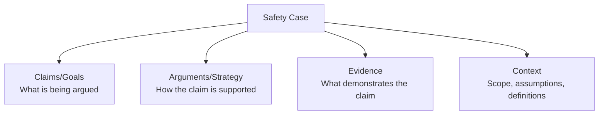
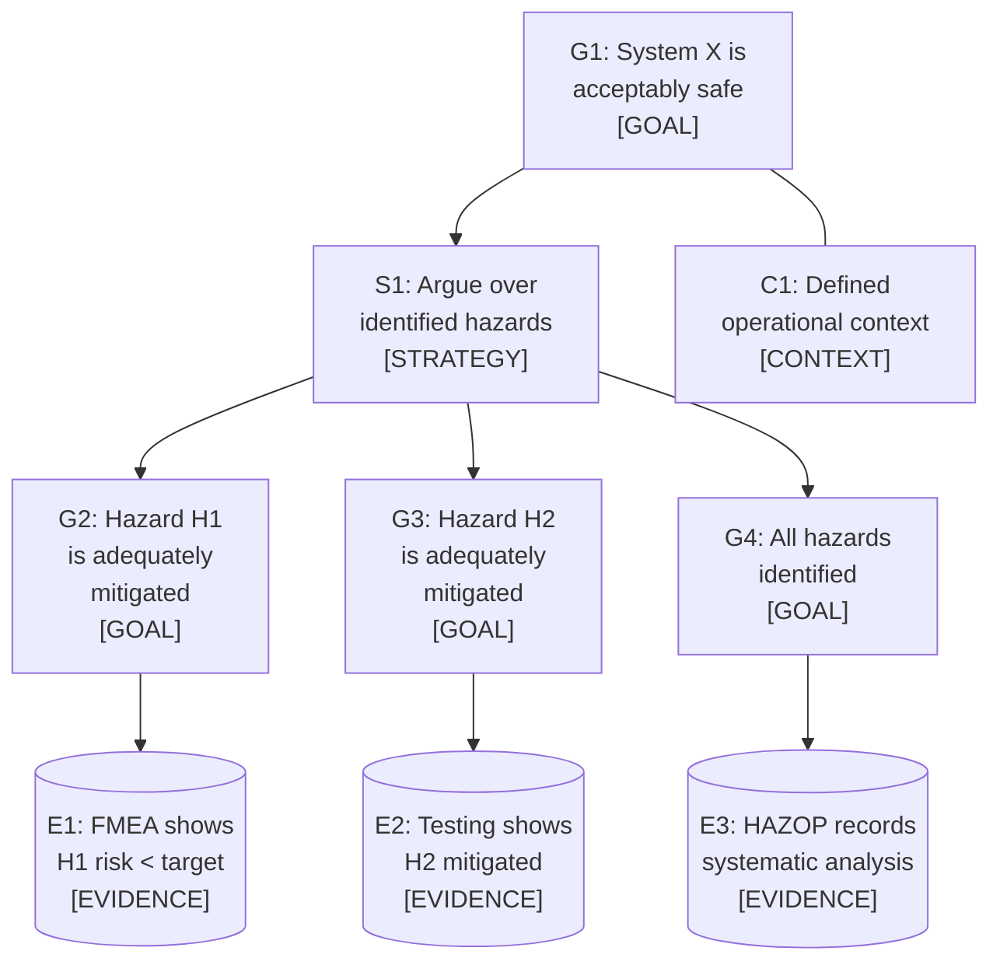
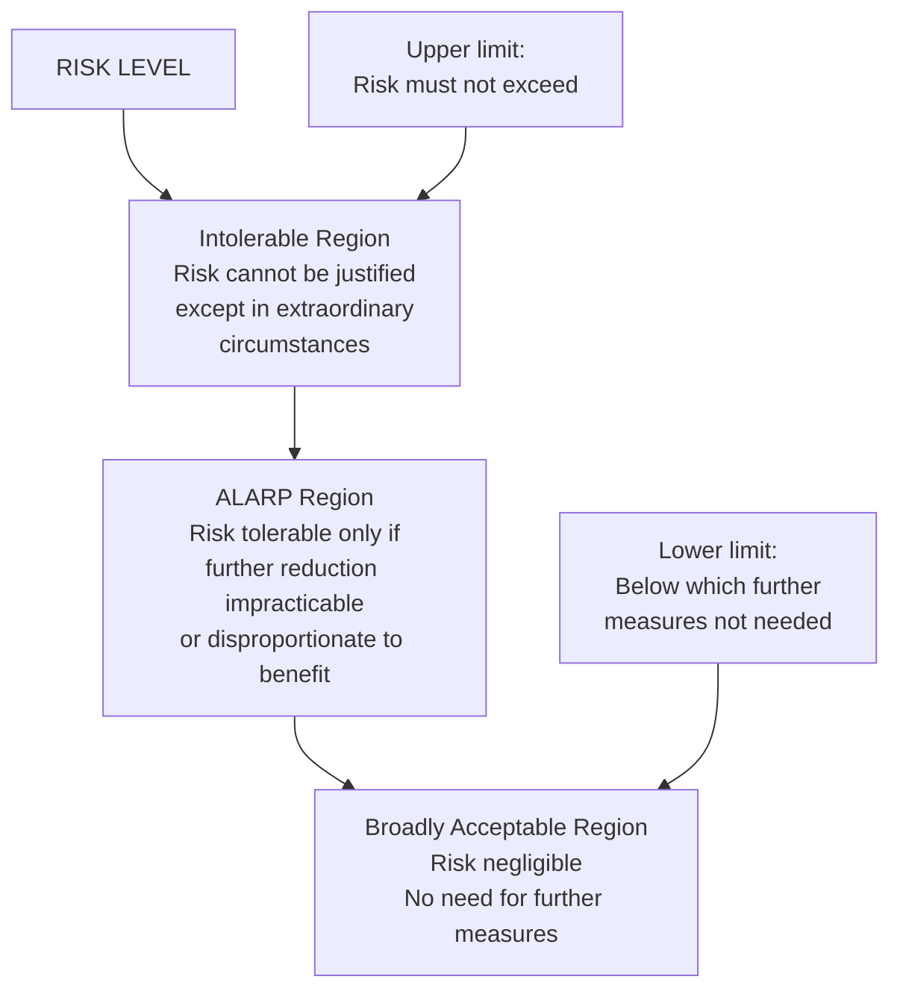
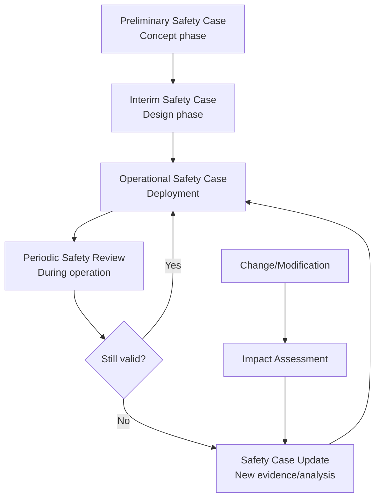
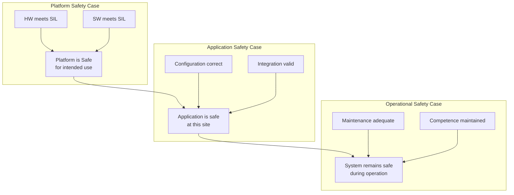
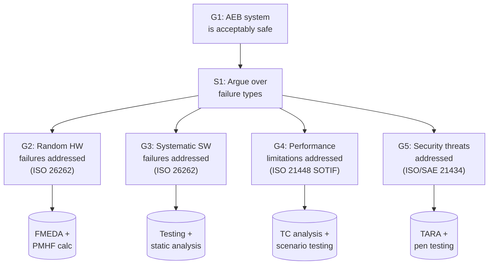

# Safety Case Methodology

**Topic:** Structured Safety Argumentation and Safety Case Development  
**Key Standards:** GSN (Goal Structuring Notation), CAE (Claims-Arguments-Evidence), EN 50129, UK Def Stan 00-56  
**Audience:** Safety engineers, safety assessors, system architects, regulatory specialists  
**Prerequisites:** Functional safety concepts, risk management, system engineering

---

## Chapter 1 — Historical Context & Origin Story

### 1.1 What is a Safety Case?

A **safety case** is a structured argument, supported by evidence, that a system is acceptably safe for a given application in a given environment.

It answers: **"Why should we believe this system is safe?"**

### 1.2 Origins and Evolution

| Year | Milestone |
|------|-----------|
| 1972 | Robens Report (UK) — goal-based safety regulation |
| 1988 | Piper Alpha disaster → Cullen Inquiry → Safety Case regime for offshore |
| 1992 | UK Health & Safety Executive mandates safety cases for major hazard installations |
| 1994 | Defence Standard 00-56 (UK MoD) — first defence safety case standard |
| 1997 | Goal Structuring Notation (GSN) developed (University of York) |
| 1998 | Adelard develops Claims-Arguments-Evidence (CAE) |
| 2003 | EN 50129 uses safety case structure for railway |
| 2007 | GSN Community Standard published |
| 2018 | SACM (Structured Assurance Case Metamodel) — OMG standard |
| 2021 | AMLAS (Assurance of Machine Learning for use in Autonomous Systems) |

### 1.3 Prescriptive vs. Goal-Based Regulation

| Approach | Description | Example |
|----------|-------------|---------|
| **Prescriptive** | Rules say exactly what to do | "Install sprinkler every 3m" |
| **Goal-based** | Rules say what to achieve, you demonstrate how | "Demonstrate fire risk is ALARP" |

**Safety cases are the mechanism for goal-based regulation** — the operator/manufacturer provides a reasoned argument that safety goals are met.

---

## Chapter 2 — Standard Architecture & Structure

### 2.1 Safety Case Components



### 2.2 Goal Structuring Notation (GSN) Elements

| Element | Symbol | Description |
|---------|--------|-------------|
| Goal | Rectangle | A claim about the system |
| Strategy | Parallelogram | How goals are broken down |
| Solution/Evidence | Circle | Evidence supporting a goal |
| Context | Rounded rectangle | Contextual information |
| Assumption | Rounded rect + 'A' | Assumed to be true |
| Justification | Rounded rect + 'J' | Rationale for approach |
| Undeveloped | Diamond | Goal not yet supported |

### 2.3 Claims-Arguments-Evidence (CAE)

| Element | Description |
|---------|-------------|
| Claim | True/false proposition about the system |
| Argument | Logical reasoning linking evidence to claim |
| Evidence | Artifact that demonstrates something (test result, analysis, review record) |
| Sub-claim | Decomposition of parent claim |
| Rebuttal | Counter-argument that must be addressed |

---

## Chapter 3 — Technical Deep Dive

### 3.1 GSN Pattern — Basic Structure



### 3.2 Safety Case Patterns

**Pattern 1: Argue over hazards**
- Top goal: "System is safe"
- Strategy: Argue that each identified hazard is controlled
- Sub-goals: One per hazard

**Pattern 2: Argue over lifecycle phases**
- Top goal: "System is safe"
- Strategy: Argue that each lifecycle phase was conducted properly
- Sub-goals: Requirements correct, Design sound, Testing adequate

**Pattern 3: Argue over failure modes**
- Top goal: "System meets SIL target"
- Strategy: Argue systematic + random integrity separately
- Sub-goals: Systematic faults addressed, random failure rate meets target

**Pattern 4: Argue over architecture**
- Top goal: "System achieves required availability and safety"
- Strategy: Argue that architecture provides required redundancy/diversity
- Sub-goals: Each channel meets requirements, independence maintained

### 3.3 ALARP (As Low As Reasonably Practicable)



### 3.4 Confidence in Safety Case

A safety case can be wrong (argument has flaws, evidence is insufficient). **Confidence arguments** address:

| Confidence aspect | Question |
|------------------|----------|
| Appropriateness of evidence | Is the evidence type suitable for the claim? |
| Trustworthiness of evidence | Was evidence collected correctly? |
| Sufficiency of argument | Does the argument actually support the goal? |
| Independence of evidence | Are multiple evidence sources independent? |
| Coverage | Does the argument cover all relevant aspects? |
| Assumptions validity | Are stated assumptions actually true? |

---

## Chapter 4 — Implementation Guide

### 4.1 Safety Case Development Process

**Step 1 — Define Scope:**
- System boundaries
- Operational environment
- Safety requirements/targets
- Regulatory framework

**Step 2 — Identify Safety Goals:**
- Top-level safety claims
- Derived from regulations, standards, hazard analysis

**Step 3 — Develop Argument:**
- Choose argumentation strategy (hazard-based, lifecycle-based, etc.)
- Decompose goals into sub-goals
- Continue until each leaf goal can be directly evidenced

**Step 4 — Identify Evidence:**
- Map each leaf goal to available/needed evidence
- Identify evidence gaps
- Commission additional analysis/testing if needed

**Step 5 — Assemble and Review:**
- Document complete safety case
- Peer review argument logic
- Independent assessment
- Address defeaters/counter-arguments

### 4.2 Tools for Safety Case Development

| Tool | Notation | Vendor |
|------|----------|--------|
| ASCE (Adelard Safety Case Editor) | CAE, GSN | Adelard |
| D-Case Editor | GSN, SACM | AIST/Nagoya Univ |
| Astah GSN | GSN | Change Vision |
| CertWare | GSN, CAE | NASA |
| NOR-STA | GSN | AGH Krakow |
| Assure-It | D-Case | Yokohama Nat'l Univ |

### 4.3 Common Pitfalls

| Pitfall | Description | Solution |
|---------|-------------|----------|
| Circular reasoning | Goal supported by itself | Independent review |
| Evidence ≠ Argument | Listing documents without connecting to claim | Explicit argument link |
| Missing context | Assumptions not stated | Document all assumptions |
| Monolithic case | One huge document | Modular, layered structure |
| Static document | Never updated | Living safety case with triggers |
| Confirmation bias | Only looking for supporting evidence | Address counter-arguments explicitly |

---

## Chapter 5 — Certification & Audit

### 5.1 Safety Case in Different Domains

| Domain | Standard | Safety Case Role |
|--------|----------|-----------------|
| Railway | EN 50129 | Mandatory (5-part structure) |
| Nuclear | National regulations | Required for licensing |
| Offshore O&G | UK PFEER, SCR | Mandatory for all installations |
| Defence (UK) | Def Stan 00-56 | Mandatory for all defence systems |
| Aviation | ARP 4761A | System Safety Assessment (similar concept) |
| Automotive | ISO 26262 Part 2 | Safety case referenced but not fully structured |
| Medical | IEC 62304 + ISO 14971 | Risk management file (similar concept) |

### 5.2 Independent Assessment

| Activity | Assessor Role |
|----------|--------------|
| Argument review | Is the logic sound? Any logical gaps? |
| Evidence adequacy | Is evidence sufficient for claims made? |
| Completeness | Are all hazards/requirements addressed? |
| Assumptions check | Are assumptions valid and maintained? |
| Counter-argument | Can the assessor identify weaknesses? |
| Proportionality | Is rigor proportionate to risk level? |

---

## Chapter 6 — Regional & Domain Variants

### 6.1 UK Safety Case Regime

**Offshore:** Safety Case Regulations 2015 (SCR)
- Every offshore installation must have accepted safety case
- HSE assesses and accepts (or rejects)
- Must demonstrate ALARP for all major hazard scenarios

**Railway:** Railway and Other Guided Transport Systems (Safety) Regulations
- Safety verification scheme + safety authorization
- Safety case per EN 50129 principles

**Nuclear:** Nuclear Installations Act + ONR assessment
- Pre-construction safety report
- Pre-operational safety report
- Periodic safety review (every 10 years)

### 6.2 Assurance Case for AI/ML (AMLAS)

**AMLAS framework (University of York/Assuring Autonomy International Programme):**

| Stage | Safety Case Goal |
|-------|-----------------|
| ML safety requirements | Correct safety requirements derived |
| Data management | Training data sufficient and representative |
| Model learning | Model correctly learned from data |
| Model verification | Model meets performance requirements |
| Deployment | Model performs safely in deployment |
| Operation | Continuous safety maintained |

---

## Chapter 7 — Comparison of Safety Case Notations

| Feature | GSN | CAE | SACM (OMG) | Bow-Tie |
|---------|-----|-----|------------|---------|
| Maturity | High (since 1997) | High (since 1998) | Moderate (OMG 2.0) | High (different purpose) |
| Expressiveness | High | Moderate | Very high (metamodel) | Low (risk-focused) |
| Tool support | Good | Limited | Growing | Good |
| Formal semantics | Semi-formal | Semi-formal | Formal (MOF-based) | Informal |
| Readability | High (graphical) | High (simple) | Complex | Very high |
| Scalability | Moderate (modular) | Good | Good (designed for it) | Limited |
| Standard | GSN Community Std | No ISO standard | OMG standard | — |
| Best suited for | Safety argumentation | General assurance | Interoperability | Risk visualization |

---

## Chapter 8 — Mermaid Architecture Diagrams

### 8.1 Safety Case Lifecycle



### 8.2 Modular Safety Case Architecture



### 8.3 GSN Example — ADAS Safety Case



---

## Chapter 9 — Case Studies & Failure Analysis

### 9.1 Successful Safety Case: London Underground Victoria Line Upgrade

**System:** New signalling and train control system (CBTC)  
**Safety case structure:** EN 50129 compliant, GSN-documented

**Key elements:**
- Top goal: "New signalling is at least as safe as existing system"
- Strategy: Comparative safety argument (reference system approach)
- Evidence: Hazard log (200+ hazards), FMEA, testing, operational procedures
- Result: Safety case accepted by ORR, system operational since 2009

### 9.2 Failed Safety Case: Nimrod MR2 (2009 Haddon-Cave Report)

**System:** RAF Nimrod MR2 aircraft — safety case for continued airworthiness  
**Failure:** Aircraft XV230 crashed (September 2006, 14 crew killed)

**Safety case failures identified by Haddon-Cave:**
- Safety case was a "paper exercise" — documents existed but argument was superficial
- Evidence was assumed, not verified (fuel system leaks known but not addressed)
- No independent challenge of safety argument
- "Tick-box" culture — compliance without substance
- Safety case not updated when modifications made

**Lessons:**
1. Safety case must be LIVED, not just WRITTEN
2. Evidence must be REAL, not assumed
3. Independence is essential
4. Safety case must be updated with every change
5. Culture of challenge, not compliance

### 9.3 AI Safety Case Challenge (Autonomous Vehicles)

**Current problem:** Traditional safety case patterns don't work well for ML:
- Cannot enumerate all scenarios (Area 3 problem)
- Cannot formally verify neural networks (yet)
- Training data adequacy is hard to argue
- Model behavior is not fully explainable

**Emerging approach (AMLAS + SOTIF):**
- Argue over: data quality, model verification, operational monitoring
- Statistical confidence arguments (not deterministic proof)
- Continuous assessment (not one-time certification)
- Operational constraints (ODD) as safety case assumptions

---

## Chapter 10 — Future Evolution & Industry Trends

### 10.1 Safety Case for AI/Autonomous Systems

| Challenge | Approach |
|-----------|----------|
| Non-determinism | Statistical safety arguments, runtime monitoring |
| Opacity | Explainability requirements, test coverage arguments |
| Evolving systems | Continuous assurance, predetermined change plans |
| Novel risks | Dynamic safety cases, operational evidence integration |
| Scale | Model-based safety cases, automated generation |

### 10.2 Digital Safety Cases

| Trend | Description |
|-------|-------------|
| Machine-readable | SACM-based, enabling automated checking |
| Linked to evidence | Direct links to test management, code repos |
| Continuous assessment | Safety case updated automatically with new test results |
| Collaborative | Multi-stakeholder real-time safety case development |
| Living document | Triggered updates on system/environment change |
| Automated generation | Parts of safety case generated from design models |

---

## Chapter 11 — Interview Questions & Career Guide

### Tier 1: Entry-Level (0-3 years)

**Q1:** What are the three main components of a safety case?  
**A:** (1) **Claims/Goals** — what you're arguing is true about the system (e.g., "System is acceptably safe for operation X in environment Y"). (2) **Arguments** — the logical reasoning structure showing how evidence supports claims. Arguments break top-level goals into sub-goals until each can be directly evidenced. (3) **Evidence** — concrete artifacts demonstrating claims (test results, FMEA reports, analysis outputs, review records, operational data). The strength of a safety case depends on: quality of evidence, soundness of argument logic, and completeness of coverage.

**Q2:** What is the difference between GSN and CAE?  
**A:** Both are notations for structuring safety/assurance arguments. GSN (Goal Structuring Notation) uses goals, strategies, solutions, context, assumptions — graphical notation with specific symbols. Developed at University of York (1997). More expressive, widely used in UK railway and defence. CAE (Claims-Arguments-Evidence) uses three element types: claims (propositions), arguments (reasoning), evidence (artifacts). Simpler, more general. Developed by Adelard. Less formal but more accessible. Both achieve the same purpose — structuring the argument that a system is safe.

### Tier 2: Mid-Level (3-8 years)

**Q3:** Develop a top-level safety case structure for an automotive ADAS system.  
**A:** Top Goal: "ADAS system [name] is acceptably safe for [ODD]." Context: Operating conditions, vehicle platform, regulatory requirements. Strategy: Argue over sources of unsafe behavior. Sub-goals: (1) "Random hardware failures do not lead to unreasonable risk" — Evidence: ISO 26262 Part 5 analysis (FMEDA, PMHF). (2) "Systematic software failures do not lead to unreasonable risk" — Evidence: ISO 26262 Part 6 compliance (process + testing). (3) "Performance limitations do not lead to unreasonable risk" — Evidence: ISO 21448 SOTIF analysis (TC analysis, scenario testing). (4) "Security threats do not lead to unreasonable risk" — Evidence: ISO/SAE 21434 analysis (TARA, pen testing). (5) "Human factors do not lead to unreasonable risk" — Evidence: HMI analysis, mode awareness testing. Each sub-goal further decomposed with specific evidence.

### Tier 3: Senior/Lead (8-15 years)

**Q4:** A nuclear regulator rejects your safety case. How do you diagnose and fix the problem?  
**A:** (1) Analyze rejection reasons (usually formal letter with specific points). Common: insufficient evidence for specific claims, logical gaps in argument, unaddressed hazards, invalid assumptions. (2) Categorize issues: evidence gaps (need more testing/analysis), argument gaps (need restructuring), scope gaps (hazards not identified). (3) For evidence gaps: commission additional testing/analysis targeted at the specific claim. Ensure new evidence is independent from existing. (4) For argument gaps: restructure GSN — perhaps different strategy needed (e.g., switch from lifecycle-based to hazard-based argument). Ensure each goal is fully supported. (5) For scope gaps: revisit hazard identification (HAZOP, FMEA) — systematic review with assessor participation. (6) Engagement: meet with assessor to understand concerns before fixing. Agree on what evidence would satisfy. (7) Re-submit with explicit mapping: "Concern X addressed by new Goal Y supported by Evidence Z."

### Tier 4: Principal/Distinguished (15+ years)

**Q5:** How should safety case methodology evolve for continuously-learning autonomous systems?  
**A:** Fundamental paradigm shift needed: (1) **From static to living:** Traditional safety case = point-in-time argument. Autonomous systems evolve (ML model updates, new ODD expansion). Need: continuous safety case with automated evidence refresh, trigger-based re-assessment, and version management. (2) **From deterministic to statistical:** Cannot prove "no unsafe scenarios exist." Instead: argue "probability of unsafe scenario in operation < X" with confidence Y, supported by: operational data (millions of miles), simulation coverage, formal bounds on subsystem properties. (3) **Operational evidence integration:** Safety case strengthened/weakened by field data. Near-miss events, disengagement rates, intervention rates all update confidence in safety claims. (4) **Predetermined change plans:** Define in advance: what changes are allowed without full re-assessment? Boundaries on ML model updates that maintain safety case validity. (5) **Assurance monitoring:** Runtime system that monitors whether safety case assumptions (ODD, performance metrics) still hold. Automatic degradation if assumptions violated. (6) **Multi-stakeholder:** OEM safety case + fleet operator evidence + infrastructure provider guarantees = composite safety argument. Need contractual interfaces. (7) **Tooling:** Automated evidence collection, continuous CI/CD safety gate, machine-readable safety cases (SACM) enabling automated consistency checking.

---

## Chapter 12 — Cheat Sheet & Quick Reference

### Safety Case Structure Template

```
1. INTRODUCTION
   - System description
   - Scope and boundaries
   - Safety targets

2. SAFETY ARGUMENT (GSN/CAE)
   - Top-level goal
   - Argumentation strategy
   - Sub-goals and evidence mapping

3. EVIDENCE
   - Hazard analysis (HAZOP, FMEA, FTA)
   - Design evidence (architecture, analysis)
   - Verification evidence (testing, review)
   - Validation evidence (system-level test)
   - Operational evidence (field data)

4. ASSUMPTIONS AND CONTEXT
   - Operating conditions
   - Maintenance requirements
   - Operator competence
   - Environmental conditions

5. CONCLUSIONS
   - Summary of argument
   - Residual risks
   - Conditions for acceptance
```

### GSN Quick Reference

```
[Rectangle]    = Goal (safety claim)
/Parallelogram/ = Strategy (argumentation approach)
(Circle)       = Solution/Evidence (supporting artifact)
{Rounded rect} = Context/Assumption/Justification
◇ Diamond     = Undeveloped (goal not yet supported)
→ Arrow       = "supported by" relationship
── Line       = "in context of" relationship
```

### When to Use a Safety Case

```
✓ Goal-based regulatory regime (UK offshore, railway, nuclear)
✓ Complex system where prescriptive rules insufficient
✓ Novel technology (no existing standard covers it)
✓ Autonomous/AI systems (emerging requirement)
✓ Defence systems (Def Stan 00-56)
✓ Cross-border railway systems (EN 50129)
✗ Simple systems with clear prescriptive standards
✗ Where regulation explicitly doesn't require it
```

---

*End of Document — 14_Safety_Case_Methodology.md*
