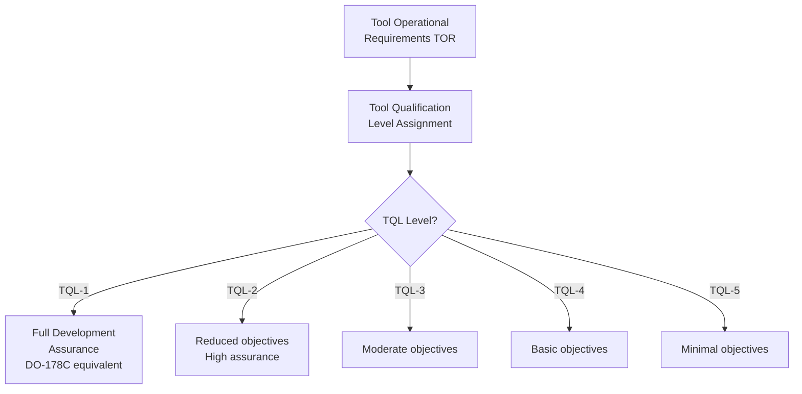
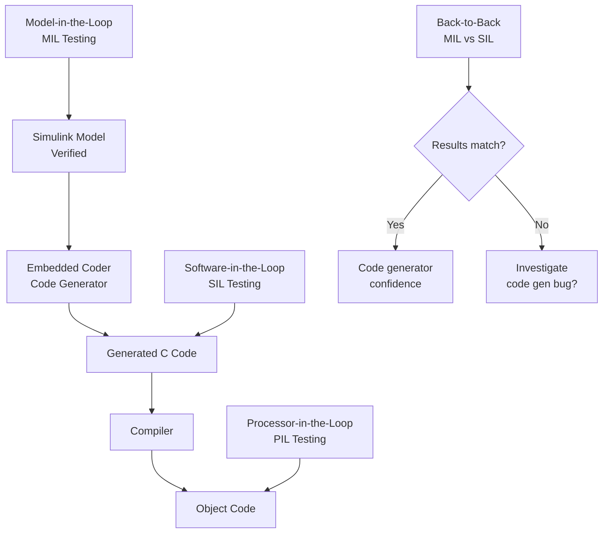
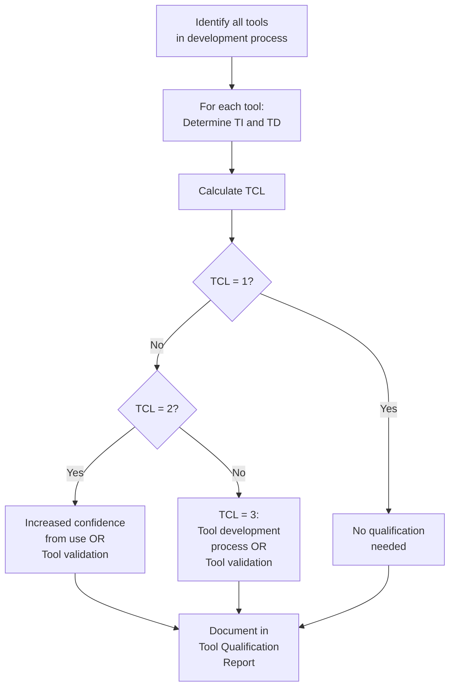
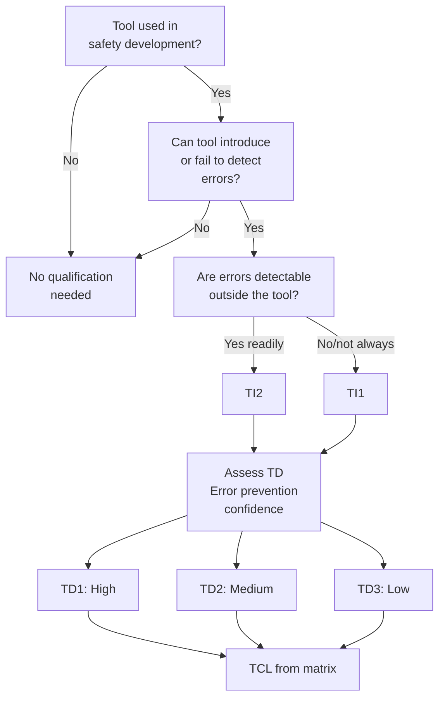
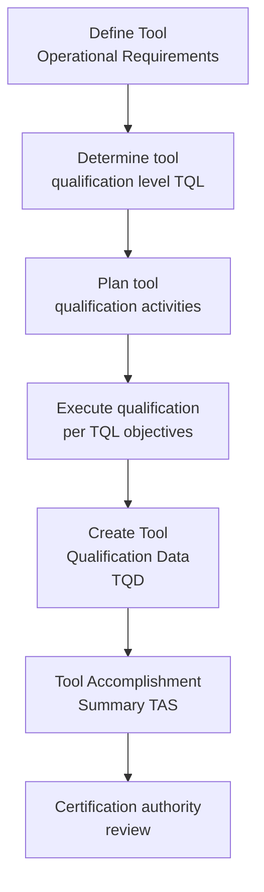
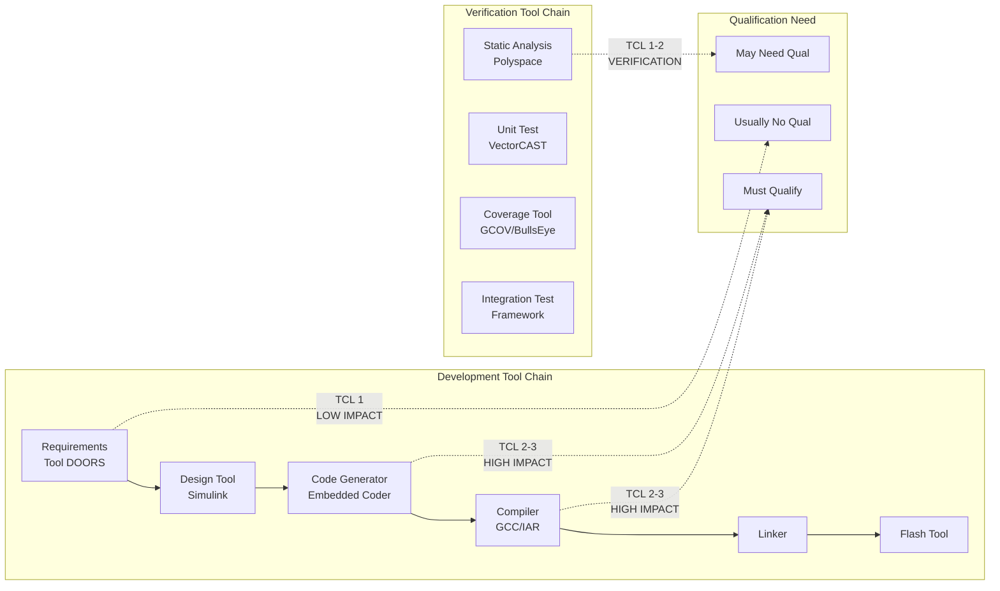

# Functional Safety Tool Qualification

**Topic:** Tool Qualification Across Safety Standards  
**Key Standards:** ISO 26262 Part 8, DO-330, IEC 61508 Part 3, EN 50128  
**Audience:** Tool developers, safety engineers, process engineers, tool users/integrators  
**Prerequisites:** Functional safety lifecycle fundamentals, software development processes

---

## Chapter 1 — Historical Context & Origin Story

### 1.1 Why Tool Qualification Matters

Modern safety-critical development relies heavily on tools:
- Compilers generate executable code from source
- Static analysis tools verify code properties
- Test frameworks execute and evaluate tests
- Model-based design tools generate production code
- Requirements management tools trace safety requirements

**If a tool has a bug that introduces an undetected error into safety-critical software, the tool becomes a source of systematic failure.**

### 1.2 Historical Motivation

| Event | Lesson |
|-------|--------|
| Compiler optimization bug causing incorrect branching | Safety-critical code behaved differently than source |
| Test tool reporting PASS when test actually failed | False confidence in verification completeness |
| Code generator producing inconsistent output | Non-deterministic code in safety function |
| Linker silently dropping function with wrong prototype | Safety function never called at runtime |

### 1.3 Tool Qualification Standards

| Standard | Domain | Tool Clause |
|----------|--------|-------------|
| ISO 26262 Part 8 | Automotive | Clause 11 (Tool confidence levels) |
| DO-330 | Aviation | Complete standard (Tool Qualification) |
| IEC 61508 Part 3 | Generic | Clause 7.4.4 (Tool classification) |
| EN 50128 | Railway | Clause 6.7 (Tool classification T1-T3) |
| IEC 62304 | Medical | Brief mention (minimal) |

---

## Chapter 2 — Standard Architecture & Structure

### 2.1 ISO 26262 Part 8 — Tool Confidence Level

**Tool Impact (TI):**

| TI | Description |
|----|-------------|
| TI1 | Tool can introduce/fail to detect errors in safety work product AND these errors are NOT detected outside the tool |
| TI2 | Tool can introduce/fail to detect errors BUT there are means outside the tool to detect them |

**Tool Error Detection (TD):**

| TD | Description |
|----|-------------|
| TD1 | High confidence in prevention/detection of tool errors (extensive use, mature, validated) |
| TD2 | Medium confidence |
| TD3 | Low confidence (new tool, unproven) |

**Tool Confidence Level (TCL) Matrix:**

| | TD1 | TD2 | TD3 |
|---|-----|-----|-----|
| **TI1** | TCL 1 | TCL 2 | TCL 3 |
| **TI2** | TCL 1 | TCL 1 | TCL 2 |

**Qualification effort by TCL:**

| TCL | Qualification Required |
|-----|----------------------|
| TCL 1 | No qualification needed (sufficient confidence) |
| TCL 2 | Increased confidence from use OR tool validation |
| TCL 3 | Tool development process OR tool validation |

### 2.2 DO-330 — Aviation Tool Qualification



**DO-330 Tool Qualification Levels:**

| TQL | Criteria | Effort |
|-----|----------|--------|
| TQL-1 | Tool output is part of safety software (DAL A) + no independent verification | Maximum (≈ DAL A development) |
| TQL-2 | Tool output in DAL A/B + limited verification | High |
| TQL-3 | Tool output in DAL C + limited verification | Moderate |
| TQL-4 | Tool output in DAL D + limited verification | Basic |
| TQL-5 | Tool provides verification (cannot introduce errors) | Minimal |

### 2.3 IEC 61508 — Tool Classification

| Class | Description | Requirement |
|-------|-------------|-------------|
| T1 | No output used in safety system | No qualification |
| T2 | Output contributes but verified by other means | Evidence tool meets spec |
| T3 | Output directly used, no independent check | Full qualification |

### 2.4 EN 50128 — Railway Tool Classification

| Class | Description | Example |
|-------|-------------|---------|
| T1 | No direct/indirect contribution to code | Text editor, project management |
| T2 | Supports testing/verification (results checked independently) | Test framework, coverage tool |
| T3 | Generates output directly used (code, data) without independent verification | Compiler, code generator |

---

## Chapter 3 — Technical Deep Dive

### 3.1 Tool Categories and Examples

| Category | Examples | Typical Classification |
|----------|----------|----------------------|
| **Compilers** | GCC, LLVM, Wind River Diab, Green Hills | ISO: TCL2-3, DO: TQL-1/2, IEC: T3 |
| **Code generators** | Simulink/Embedded Coder, SCADE, TargetLink | ISO: TCL2-3, DO: TQL-1/2, IEC: T3 |
| **Static analysis** | Polyspace, Coverity, Astrée, PC-Lint | ISO: TCL1-2, DO: TQL-4/5, IEC: T2 |
| **Unit test frameworks** | Google Test, VectorCAST, Tessy | ISO: TCL1-2, DO: TQL-4/5, IEC: T2 |
| **Requirements tools** | DOORS, Polarion, Jama | ISO: TCL1-2, DO: TQL-4/5, IEC: T2 |
| **Configuration mgmt** | Git, Subversion, ClearCase | ISO: TCL1, IEC: T1 |
| **Debuggers** | GDB, Trace32, iSYSTEM | ISO: TCL1, IEC: T1 |

### 3.2 Qualification Methods

| Method | Description | When Used |
|--------|-------------|-----------|
| **Increased confidence from use** | Tool has extensive track record, known error list, mature | TCL 2 (ISO), established tools |
| **Tool validation** | Explicit testing of tool for intended use | TCL 2-3 (ISO), TQL-4/5 (DO) |
| **Tool development process** | Tool developed per equivalent safety standard | TCL 3 (ISO), TQL-1/2 (DO) |
| **Operational constraints** | Restrict tool usage to qualified subset of features | Reduce scope of qualification |

### 3.3 Compiler Qualification — Deep Dive

**Why compilers are critical:**
- Source code verified (tests, reviews, static analysis)
- Compiler transforms source → object code
- If compiler introduces error → all verification of source is irrelevant
- Bug in optimization can silently change program behavior

**Qualification approach (typical automotive):**

| Method | Description |
|--------|-------------|
| Restrict optimizations | Use only well-tested optimization levels |
| Back-to-back testing | Compare output from two different compilers |
| Object code review | Sample review of generated assembly |
| Compiler test suite | Run compiler validation suite (GCC torture tests) |
| Known bugs list | Maintain and avoid compiler bugs for target |
| Operational experience | Document years of use without safety-relevant bugs |

### 3.4 Code Generator Qualification (Model-Based)



**Qualification approaches for code generators:**
1. **Reference workflow:** Generate code → compile → test generated code (no model test credit)
2. **Qualified code generator:** Tool developed to TQL-1/TCL-3 → model tests provide code test credit
3. **Back-to-back:** Compare model behavior (MIL) with code behavior (SIL) — differences indicate tool issue

---

## Chapter 4 — Implementation Guide

### 4.1 Tool Qualification Process (ISO 26262)



### 4.2 Tool Qualification Plan Template

| Section | Content |
|---------|---------|
| Tool identification | Name, version, vendor, configuration |
| Use case description | How tool is used in safety development |
| TI/TD/TCL assessment | Impact and error detection analysis |
| Qualification method | Selected approach (validation, experience, process) |
| Validation test specification | If validation chosen: test cases for tool |
| Operational constraints | Restrictions on tool use |
| Known bugs/anomalies | Documented issues and workarounds |
| Conclusion | Tool qualified for stated use case at stated ASIL |

### 4.3 Practical Tips

**Reducing qualification effort:**
1. **Add independent verification:** If you independently verify tool output → TI2 → lower TCL
2. **Use well-established tools:** Extensive track record → TD1 → lower TCL
3. **Restrict features used:** Qualify only features actually used
4. **Use certified tool versions:** Vendors offer pre-qualified tools ($$$ but saves effort)
5. **Back-to-back with different tool:** Two tools agreeing = mutual confidence

**Common mistakes:**
- Forgetting the linker (it's a tool too!)
- Not qualifying the specific version used
- Qualifying tool once but using updated version without delta analysis
- Assuming "industry-standard tool" = automatically qualified

---

## Chapter 5 — Certification & Audit

### 5.1 Auditor Expectations

| Topic | Assessor Checks |
|-------|----------------|
| Tool inventory | Complete list of all tools in safety development |
| Classification | TI/TD/TCL correctly determined per tool |
| Qualification evidence | Adequate for claimed TCL |
| Version management | Qualified version = used version |
| Anomaly management | Known tool bugs documented and mitigated |
| Operational constraints | Documented and enforced |

### 5.2 Pre-Qualified Tool Certificates

Some tool vendors offer qualification kits:

| Vendor/Tool | Standard | Deliverable |
|-------------|----------|-------------|
| MathWorks Embedded Coder | ISO 26262, DO-178C | Tool Qualification Kit (TQK) |
| dSPACE TargetLink | ISO 26262 | Safety Manual + Qualification Package |
| Astrée static analyzer | DO-178C, EN 50128 | Qualified to DAL A / Class T3 |
| VectorCAST | DO-178C, ISO 26262 | Tool Qualification Kit |
| SCADE (Ansys) | DO-178C, EN 50128 | Qualified code generator (KCG) |
| Green Hills compiler | DO-178C | Qualified compiler kit |
| Wind River VxWorks | DO-178C, IEC 61508 | Safety-certified RTOS |

### 5.3 Pre-Qualified vs. User Qualification

| Aspect | Pre-Qualified (Vendor) | User Qualification |
|--------|----------------------|-------------------|
| Cost | High license fee | Engineering hours |
| Effort | Use qualification kit | Develop test cases |
| Responsibility | Vendor provides evidence | User responsible |
| Version | Specific version only | User controls scope |
| Confidence | High (third-party assessed) | Variable |
| Customization | None (use as-is) | Can tailor to project |

---

## Chapter 6 — Regional & Domain Variants

### 6.1 Cross-Domain Tool Qualification Comparison

| Aspect | ISO 26262 | DO-330 | IEC 61508 | EN 50128 |
|--------|-----------|--------|-----------|----------|
| Levels | TCL 1-3 | TQL 1-5 | T1-T3 | T1-T3 |
| Granularity | Medium | Very high (full standard) | Low | Low |
| Prescriptiveness | Method options | Specific objectives | General requirements | Technique tables |
| Cost driver | TCL 3 (highest) | TQL 1 (highest) | T3 (highest) | T3 (highest) |
| Documentation | Qualification report | Plan + accomplishment summary | Evidence of suitability | Validation report |

### 6.2 Open-Source Tool Qualification

| Challenge | Approach |
|-----------|----------|
| No vendor support | Community + user validation |
| Frequent updates | Pin version, validate that version |
| No safety manual | Create one based on usage constraints |
| License issues | Ensure compliance doesn't restrict use |
| Known bugs | Monitor bug tracker, create workaround list |
| Example: GCC | Qualify specific version with specific flags, add object code review |

---

## Chapter 7 — Comparison of Qualification Approaches

| Approach | Effort | Confidence | Best For |
|----------|--------|-----------|----------|
| Increased confidence from use | Low | Medium | Mature tools, low TCL |
| Tool validation testing | Medium | High | Most tools, TCL 2-3 |
| Tool development process | Very high | Very high | New tools, TQL-1, code generators |
| Diverse tools (back-to-back) | Medium | High | Compilers, code generators |
| Operational constraints | Low | Medium | Restricting tool scope |
| Pre-qualified kit | Cost ($$$) | Very high | DO-178C, critical tools |

---

## Chapter 8 — Mermaid Architecture Diagrams

### 8.1 ISO 26262 Tool Qualification Decision Tree



### 8.2 DO-330 Tool Qualification Process



### 8.3 Tool Chain Qualification Scope



---

## Chapter 9 — Case Studies & Failure Analysis

### 9.1 GCC Compiler Bug — Automotive ECU

**Scenario:** Specific GCC optimization (dead store elimination) removed a safety-relevant variable write that appeared "dead" to the compiler but was actually read by an interrupt service routine.

**Impact:** Safety function variable never updated → wrong behavior in specific fault condition.

**Detection:** Found during back-to-back testing (comparison with IAR compiler showed different behavior).

**Tool qualification lesson:**
- Volatile keyword missing → user error, but compiler behavior non-obvious
- Back-to-back testing between compilers detected the issue
- Qualification: document that volatile is mandatory for ISR-shared variables (operational constraint)

### 9.2 Code Generator Version Upgrade

**Scenario:** Project upgraded Simulink/Embedded Coder from R2019a to R2022a mid-project.

**Problem:** Generated code structure changed (different variable naming, different function structure) → previous code review evidence no longer valid.

**ISO 26262 lesson:**
- Tool qualification is version-specific
- Version change requires delta analysis
- Either: re-qualify tool OR re-verify generated code
- Best practice: lock tool version during safety project, plan upgrades explicitly

### 9.3 Static Analysis False Negative

**Scenario:** Static analysis tool (configured for MISRA-C) reported "no violations" for module. Later review found actual MISRA violation that tool missed.

**Root cause:** Tool's MISRA checker didn't cover specific rule fully (partial implementation).

**Lesson:**
- Even verification tools need qualification
- "No findings" ≠ "code is correct"
- Validate tool covers claimed rules (tool qualification test cases)
- Combine with manual review (don't rely solely on tool)

---

## Chapter 10 — Future Evolution & Industry Trends

### 10.1 AI-Based Development Tools

| Tool Type | Challenge | Qualification Path |
|-----------|-----------|-------------------|
| AI code assistants (Copilot) | Non-deterministic output, training data unknown | Currently: cannot be qualified. Treat output as unverified (must be reviewed/tested) |
| AI-based testing | Test generation, but coverage unclear | Verify generated tests meet objectives (TD assessment) |
| ML-based static analysis | May miss/false-report issues | Validate against known defect corpus |
| Automated code review | AI reviews code | Cannot replace human review at high ASIL/SIL |

### 10.2 Cloud-Based Tool Chains

| Challenge | Concern |
|-----------|---------|
| Version control | Cloud tools update automatically → which version was used? |
| Reproducibility | Must reproduce exact build from any point |
| Data sovereignty | Safety evidence stored where? |
| Availability | Tool down = project blocked |
| Configuration | Tool settings must be captured exactly |

### 10.3 Continuous Integration / DevOps

| Trend | Tool Qualification Impact |
|-------|--------------------------|
| CI/CD pipelines | Entire pipeline is "the tool" — all components need assessment |
| Containerized builds | Docker image = qualified environment (pin versions) |
| Automated testing | Test framework + infrastructure needs qualification |
| Infrastructure as Code | Build environment specification = part of qualification |

---

## Chapter 11 — Interview Questions & Career Guide

### Tier 1: Entry-Level (0-3 years)

**Q1:** Why do compilers need tool qualification for safety projects?  
**A:** A compiler transforms source code (which has been reviewed, tested, analyzed) into object code that actually runs. If the compiler introduces an error during this transformation, all verification performed on source code is meaningless — the executing code is wrong despite "correct" source. Examples: optimization removing safety-critical writes, incorrect register allocation, wrong branch prediction optimization. Qualification ensures either: (a) the compiler is sufficiently trusted (low bug probability), or (b) the generated code is independently verified (object code review, diverse compilation).

**Q2:** What is Tool Confidence Level (TCL) in ISO 26262?  
**A:** TCL is a 3-level classification (TCL 1-3) that determines how much qualification effort a tool needs. Derived from two factors: Tool Impact (TI1/TI2: can tool introduce undetected errors?) and Tool error Detection (TD1-3: how confident are we in the tool?). TCL 1 = no qualification needed. TCL 2 = moderate effort (validation or experience argument). TCL 3 = highest effort (tool development process or extensive validation). Higher ASIL doesn't directly change TCL — it's the same matrix — but may influence the TD assessment (more scrutiny needed for higher ASIL).

### Tier 2: Mid-Level (3-8 years)

**Q3:** You're qualifying a model-based code generator (e.g., Embedded Coder) for ASIL D. Describe your approach.  
**A:** (1) TI assessment: Code generator output IS the production code → TI1 (can introduce errors). (2) TD assessment: If we verify generated code independently → TD could be TD1-2. If we rely on model-level testing only → TD3. (3) Strategy A (model testing + back-to-back): Keep TD at TD2 by performing SIL testing (back-to-back MIL vs SIL). TCL = 2. Qualification: use vendor's TQK + project-specific validation tests covering used features. (4) Strategy B (qualify code generator): Treat as TCL 3. Vendor provides development process evidence (TÜV assessment). More expensive but model tests give code credit. (5) Operational constraints: document exactly which Simulink blocks, code generation options, and target configurations are qualified. Deviation = re-qualification needed. (6) Version: pin exact tool version, document in plan. (7) Known bugs: maintain list from MathWorks bug reports, verify none affect project.

### Tier 3: Senior/Lead (8-15 years)

**Q4:** How do you handle tool qualification in a CI/CD pipeline for an ASIL C project?  
**A:** (1) Treat the entire pipeline as a "tool chain" — every component that touches safety artifacts needs assessment. (2) Inventory: Git (CM → T1), build system (Make/CMake → T1), compiler (GCC 12.3 → TCL 2-3), linker (GNU ld → TCL 2), static analyzer (Polyspace R2023a → TCL 1-2), unit test framework (Google Test → TCL 1-2), coverage tool (gcov → TCL 1-2), deployment/flash tool. (3) Containerize: Docker image pins exact versions of all tools. Image hash = qualified configuration. If image changes → delta analysis. (4) Reproducibility: any build from any commit must produce identical binary (deterministic build). Verify with hash comparison. (5) Evidence collection: CI pipeline automatically generates test reports, coverage data, static analysis results → these ARE the qualification evidence if tool is qualified. (6) Challenge: cloud runners may update — use self-hosted runners with controlled environment. (7) Document: Tool Qualification Plan covers entire pipeline, references pinned versions, operational constraints, and evidence strategy.

### Tier 4: Principal/Distinguished (15+ years)

**Q5:** An AI code assistant (like GitHub Copilot) is used by developers on your ASIL D project. How do you handle this from a tool qualification perspective?  
**A:** (1) **Cannot qualify as development tool:** AI assistants are non-deterministic (same prompt → different code), training data unknown, no traceability from requirement to generated code. Tool qualification requires reproducibility and defined behavior — AI assistants have neither. (2) **Classification:** TI1 (can introduce errors into safety code), TD3 (no confidence in error prevention by tool). TCL = 3. Full qualification would require developing the AI to equivalent safety standard — impractical. (3) **Practical approach:** Treat AI-generated code identically to human-written code. All code (regardless of origin) must pass: peer review, static analysis, unit testing, integration testing, coverage analysis. AI is effectively a "productivity enhancement for typing" — not a qualified tool. (4) **Process controls:** (a) Ban AI for safety-critical module design decisions. (b) Require disclosure when AI assisted (for review awareness). (c) All AI suggestions must be understood by developer (no blind acceptance). (d) Standard verification detects any introduced errors. (5) **Documentation:** Record in Tool Qualification Plan that AI assistants are NOT qualified tools, and code provenance doesn't affect verification obligations. (6) **Future:** If AI tools become deterministic and provide provenance/explanation → qualification might become feasible. Not today.

---

## Chapter 12 — Cheat Sheet & Quick Reference

### ISO 26262 TCL Quick Determination

```
Step 1: Can tool introduce/miss errors in safety work product?
  - No → No qualification needed (stop)
  - Yes → Continue

Step 2: TI (Tool Impact):
  - Errors detectable outside tool? → TI2
  - Errors NOT reliably detectable? → TI1

Step 3: TD (Tool error Detection):
  - High confidence (mature, proven, tested) → TD1
  - Medium confidence → TD2
  - Low confidence (new, unproven) → TD3

Step 4: TCL = lookup(TI, TD)
  TI2+TD1=TCL1, TI2+TD2=TCL1, TI2+TD3=TCL2
  TI1+TD1=TCL1, TI1+TD2=TCL2, TI1+TD3=TCL3
```

### Common Tool Classifications

| Tool | Typical TCL | Reasoning |
|------|------------|-----------|
| Compiler | TCL 2 | TI1 (can introduce errors) + TD2 (mature, tested) |
| Code generator | TCL 2-3 | TI1 + TD2 (if back-to-back) or TD3 (new tool) |
| Static analyzer | TCL 1 | TI2 (verification tool, errors caught by other means) |
| Test framework | TCL 1 | TI2 (test results reviewed by engineer) |
| Coverage tool | TCL 1-2 | TI1 if sole evidence of coverage (could miss uncovered code) |
| Requirements tool | TCL 1 | TI2 (requirements reviewed independently) |
| Debugger | TCL 1 | Not in production path |

### DO-330 TQL Summary

```
TQL-1: Tool output IS safety software + DAL A/B + no other verification
TQL-2: Tool output contributes to DAL A/B + partial verification exists  
TQL-3: Tool output contributes to DAL C + partial verification
TQL-4: Tool output contributes to DAL D + partial verification
TQL-5: Tool only performs verification (cannot introduce errors)
```

---

*End of Document — 15_FuSa_Tool_Qualification.md*
