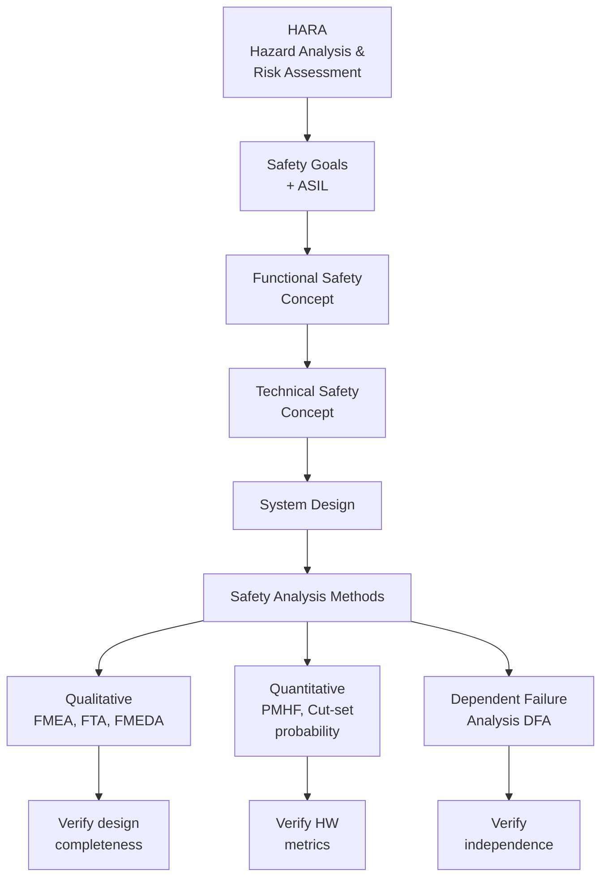
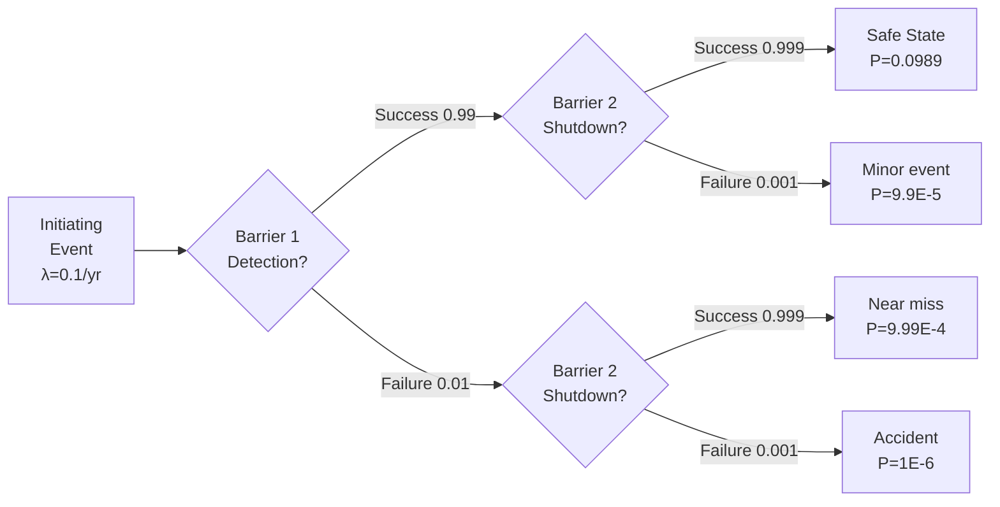
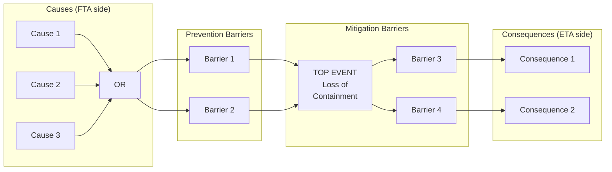
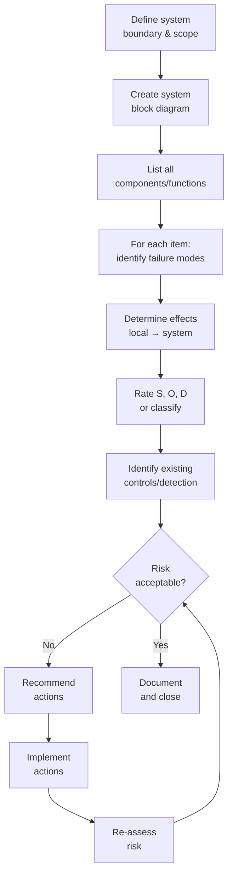
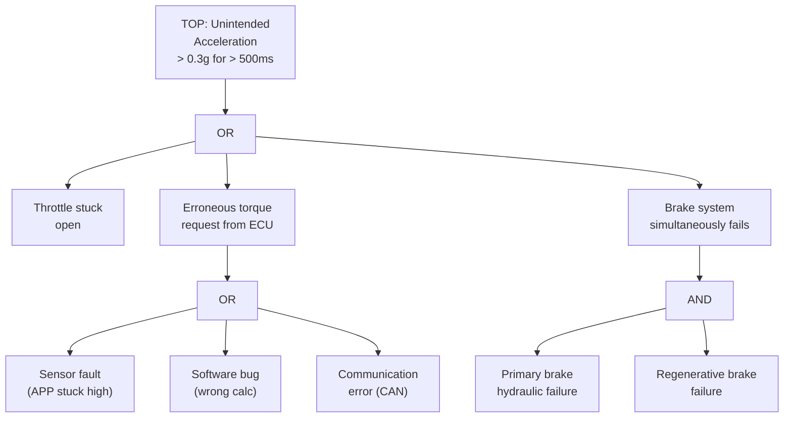
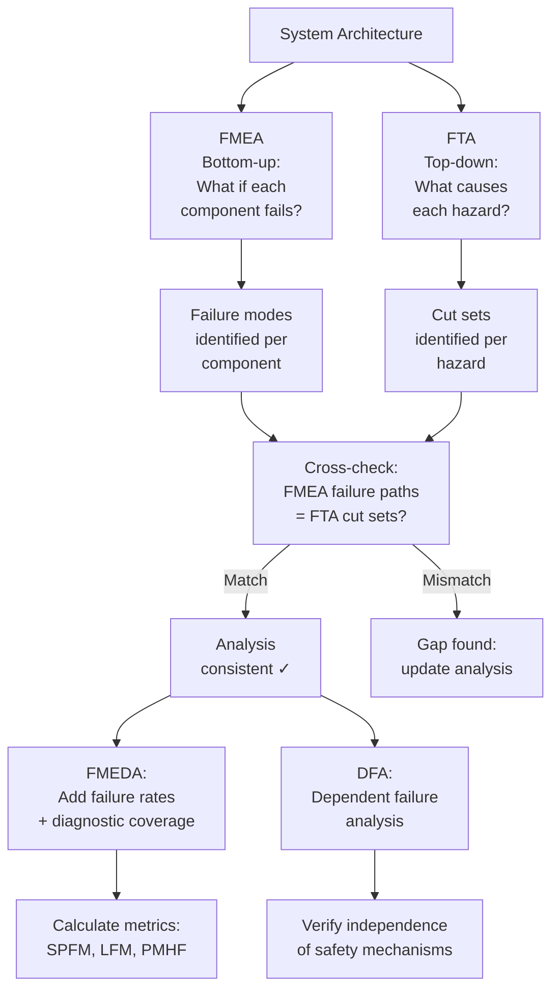
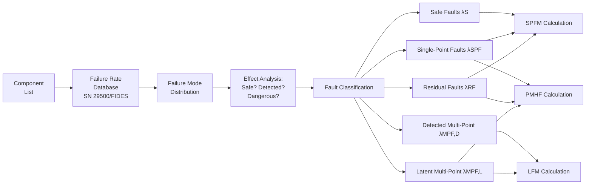

# FMEA, FTA & Safety Analysis Methods

**Topic:** Systematic Safety Analysis Techniques for Hazard Identification and Risk Assessment  
**Key Standards:** IEC 60812 (FMEA), IEC 61025 (FTA), ISO 26262 Part 9, ARP 4761A  
**Audience:** Safety engineers, reliability engineers, system architects, quality engineers  
**Prerequisites:** Basic probability theory, system engineering, functional safety concepts

---

## Chapter 1 — Historical Context & Origin Story

### 1.1 Why Safety Analysis Methods?

Safety analysis answers three critical questions:
1. **What can go wrong?** (Hazard identification)
2. **How bad is it?** (Risk assessment)
3. **What should we do?** (Risk mitigation)

### 1.2 Historical Timeline

| Year | Method | Origin |
|------|--------|--------|
| 1949 | FMEA | US Military (MIL-P-1629) — first systematic failure analysis |
| 1961 | FTA | Bell Labs (for Minuteman ICBM) — top-down deductive analysis |
| 1963 | HAZOP | ICI (chemical industry) — guide-word based deviation analysis |
| 1966 | ETA | Nuclear industry — forward-looking consequence analysis |
| 1974 | FMECA | Extension of FMEA with Criticality Analysis |
| 1980 | Bow-Tie | Royal Dutch Shell — combined FTA+ETA visualization |
| 1993 | ARP 4761 | SAE — aerospace safety assessment process |
| 2006 | IEC 60812 Ed.2 | Updated FMEA standard |
| 2011 | ISO 26262 Part 9 | Automotive-specific safety analysis |
| 2020 | STPA | MIT/Leveson — system-theoretic process analysis |
| 2023 | ARP 4761A | Updated with MBSA and Common Cause Analysis |

### 1.3 Analysis Taxonomy

| Direction | Method | Approach |
|-----------|--------|----------|
| **Bottom-up (inductive)** | FMEA, FMECA, ETA | "If X fails, what happens?" |
| **Top-down (deductive)** | FTA, RBD | "What causes hazard Y?" |
| **Exploratory** | HAZOP, STPA | "What deviations are possible?" |
| **Combined** | Bow-Tie | Links causes → event → consequences |

---

## Chapter 2 — Standard Architecture & Structure

### 2.1 Safety Analysis in ISO 26262



### 2.2 Safety Analysis in ARP 4761A (Aviation)

| Analysis | Purpose | Standard Section |
|----------|---------|-----------------|
| FHA (Functional Hazard Analysis) | Identify function failures and severity | ARP 4761A Ch. 4 |
| PSSA (Preliminary System Safety Assessment) | Allocate safety requirements to architecture | ARP 4761A Ch. 5 |
| SSA (System Safety Assessment) | Verify design meets safety requirements | ARP 4761A Ch. 6 |
| CCA (Common Cause Analysis) | Identify common causes defeating redundancy | ARP 4761A Ch. 7 |
| MBSA (Model-Based Safety Analysis) | Formal model-driven analysis | ARP 4761A Ch. 8 |

---

## Chapter 3 — Technical Deep Dive

### 3.1 FMEA (Failure Mode and Effects Analysis)

**Process:**
1. Define system scope and decomposition level
2. For each component/function, identify all failure modes
3. For each failure mode, determine:
   - Local effect
   - Next-higher-level effect
   - End effect (system/vehicle level)
4. Classify severity
5. Identify detection methods
6. Assign RPN or action priority

**FMEA Worksheet Columns:**

| Column | Description |
|--------|-------------|
| Item/Function | Component or function analyzed |
| Failure mode | How item can fail (open, short, stuck, drift, etc.) |
| Failure cause | Root cause or mechanism |
| Local effect | Effect at component level |
| System effect | Effect at system/vehicle level |
| Severity (S) | Impact rating (1-10) |
| Occurrence (O) | Likelihood rating (1-10) |
| Detection (D) | Detectability rating (1-10) |
| RPN | S × O × D (Risk Priority Number) |
| Recommended action | Mitigation measure |
| Responsibility | Owner for action |

### 3.2 FMEDA (Failure Mode, Effects, and Diagnostic Analysis)

**Extension of FMEA for IEC 61508 / ISO 26262 hardware metrics:**

| Additional columns | Purpose |
|-------------------|---------|
| Failure rate (λ) | From reliability database (SN 29500, MIL-HDBK-217, FIDES) |
| Failure mode distribution | % split across modes (e.g., resistor: 60% open, 40% short) |
| Diagnostic coverage | What % detected by safety mechanism? |
| Classification | Safe fault / Single-point fault / Residual fault / Multi-point fault |

**Hardware metric calculation from FMEDA:**

$$SPFM = 1 - \frac{\sum \lambda_{SPF}}{\sum \lambda_{total} - \sum \lambda_{safe}}$$

$$LFM = 1 - \frac{\sum \lambda_{MPF,undetected}}{\sum \lambda_{total} - \sum \lambda_{safe} - \sum \lambda_{SPF}}$$

$$PMHF = \sum \lambda_{SPF} + \sum \lambda_{RF} + \sum_{pairs} \lambda_{MPF,lat,i} \cdot \lambda_{MPF,lat,j} \cdot T_{lifetime}$$

### 3.3 FTA (Fault Tree Analysis)

**Process:**
1. Define TOP event (undesired system-level event)
2. Identify immediate causes (using AND/OR gates)
3. Continue decomposition until basic events (component failures, human errors)
4. Calculate probability (if quantitative)

**Gate Types:**

| Gate | Symbol | Meaning |
|------|--------|---------|
| OR | ≥1 | Output occurs if ANY input occurs |
| AND | & | Output occurs only if ALL inputs occur |
| VOTING | m/n | Output if m-of-n inputs occur |
| INHIBIT | ⊳ | Output if input AND condition present |
| XOR | =1 | Output if exactly one input occurs |

**Basic Event Types:**

| Type | Symbol | Description |
|------|--------|-------------|
| Basic event | Circle | Component failure (has failure data) |
| Undeveloped | Diamond | Not further analyzed |
| House event | Rectangle | Event that is TRUE/FALSE by design |
| Transfer | Triangle | Continues on another page |

### 3.4 FTA Quantitative Analysis

**Minimal Cut Sets:**
A minimal cut set is the smallest combination of basic events that causes the TOP event.

For an OR gate: each input is a separate cut set  
For an AND gate: inputs combine into one cut set

**TOP event probability:**

$$P(TOP) \approx \sum_{i=1}^{n} P(MCS_i) - \sum_{i<j} P(MCS_i \cap MCS_j) + \cdots$$

For rare events (inclusion-exclusion approximation):

$$P(TOP) \approx \sum_{i=1}^{n} P(MCS_i)$$

Where for AND-gate cut sets:

$$P(MCS_i) = \prod_{j \in MCS_i} P(event_j)$$

### 3.5 Event Tree Analysis (ETA)

**Process:**
1. Start with initiating event
2. Identify barriers/safety functions (left to right)
3. For each barrier: success (up) or failure (down)
4. Each path = one scenario with specific consequences
5. Calculate scenario probability



### 3.6 Bow-Tie Analysis



### 3.7 HAZOP (Hazard and Operability Study)

| Guide Word | Meaning | Example (Flow) |
|------------|---------|----------------|
| NO/NOT | Complete negation | No flow |
| MORE | Quantitative increase | More flow (higher rate) |
| LESS | Quantitative decrease | Less flow (lower rate) |
| AS WELL AS | Additional activity | Flow + contamination |
| PART OF | Incomplete | Only part of mixture flows |
| REVERSE | Opposite direction | Reverse flow |
| OTHER THAN | Complete substitution | Wrong material flows |
| EARLY | Time variation | Flow starts too early |
| LATE | Time variation | Flow starts too late |

### 3.8 STPA (System-Theoretic Process Analysis)

**Leveson's approach (different from traditional methods):**

| Step | Activity |
|------|----------|
| 1 | Define losses and hazards |
| 2 | Model control structure (feedback loops) |
| 3 | Identify Unsafe Control Actions (UCAs) |
| 4 | Identify loss scenarios (why UCAs occur) |

**UCA categories:**
1. Control action NOT provided (when needed)
2. Control action provided (when NOT needed — causing hazard)
3. Control action provided too early/too late/wrong order
4. Control action stopped too soon/applied too long

---

## Chapter 4 — Implementation Guide

### 4.1 Selecting the Right Method

| Need | Best Method |
|------|-------------|
| Identify all failure modes of a component | FMEA |
| Calculate hardware safety metrics | FMEDA |
| Find root causes of a specific hazard | FTA |
| Analyze consequences of an initiating event | ETA |
| Visualize cause→event→consequence | Bow-Tie |
| Analyze process deviations (chemical/process) | HAZOP |
| Analyze control system interactions | STPA |
| Identify common cause failures | CCA (Zonal, PRA) |

### 4.2 FMEA Practical Process



### 4.3 FTA Practical Process

1. **Define TOP event precisely** (e.g., "Unintended vehicle acceleration > 0.3g for > 500ms")
2. **Set analysis scope** (what's in/out, analysis depth)
3. **Determine immediate causes** — Ask "What directly causes this?"
4. **Apply gates** — All causes needed (AND) or any cause sufficient (OR)?
5. **Continue decomposition** — Until basic events (have failure rate data)
6. **Validate** — Cross-check with FMEA (bottom-up should find same failure paths)
7. **Quantify** — If needed, calculate TOP event probability from basic event rates

### 4.4 Dependent Failure Analysis (DFA)

Required by ISO 26262 Part 9 to verify independence:

| Analysis | Question |
|----------|----------|
| Common Cause Failure (CCF) | Can one cause defeat multiple safety mechanisms? |
| Cascading Failure | Can failure of element A cause failure of element B? |
| Common Mode Failure | Can same mechanism affect redundant channels? |

**CCF defense measures (IEC 61508 beta-factor model):**

| Defense | β reduction |
|---------|-------------|
| Separation/segregation | Physical distance between channels |
| Diversity | Different technology/design/supplier |
| Complexity reduction | Simpler designs = fewer common modes |
| Analysis (FMEA of interfaces) | Identify shared elements |
| Training/procedures | Reduce human common causes |
| Environmental testing | Verify under stress conditions |

---

## Chapter 5 — Certification & Audit

### 5.1 Auditor Expectations per Standard

| Standard | Required Analyses | Evidence |
|----------|-------------------|----------|
| ISO 26262 | HARA, FMEA, FTA, FMEDA, DFA | Analysis reports with traceability to safety requirements |
| DO-178C/ARP 4761A | FHA, PSSA, SSA, FTA, FMEA, CCA | Part of certification basis |
| IEC 61508 | FMEA/FMEDA + FTA for SIL verification | Documented per Part 2/3 |
| EN 50129 | Hazard log, FMEA, FTA, CCF analysis | Part of safety case evidence |

### 5.2 Common Audit Findings

| Finding | Issue | Fix |
|---------|-------|-----|
| Incomplete FMEA | Not all components/failure modes covered | Systematic coverage checklist |
| FTA not validated | No cross-check with bottom-up method | FMEA↔FTA consistency check |
| Missing DFA | Independence claimed without CCF analysis | Perform CCF/cascade analysis |
| Outdated analysis | Design changed but analysis not updated | Change impact process |
| No quantification | ASIL D metrics claimed without FMEDA | Perform FMEDA with failure rates |
| Assumed failure rates | No source cited for λ values | Use recognized database |

---

## Chapter 6 — Regional & Domain Variants

### 6.1 Automotive (ISO 26262 Part 9)

| Analysis | Application |
|----------|-------------|
| HARA | Vehicle-level hazard identification |
| FMEA (qualitative) | Design verification |
| FMEDA (quantitative) | Hardware metric calculation (SPFM, LFM, PMHF) |
| FTA | Safety goal violation analysis |
| DFA | Independence verification |

### 6.2 Aviation (ARP 4761A)

| Analysis | Application |
|----------|-------------|
| FHA | Aircraft/system function failure effects |
| FTA | Quantitative (probability of catastrophic event) |
| FMEA | System/equipment level |
| CCA | Zonal + particular risks + common mode |
| Markov | Complex redundancy state analysis |
| MBSA | Model-based (new in 4761A) |

### 6.3 Process Industry (IEC 61511 / LOPA)

**LOPA (Layer of Protection Analysis):**

$$f_{consequence} = f_{initiating} \times \prod_{i=1}^{n} PFD_i$$

Where $PFD_i$ is the probability of failure on demand for each Independent Protection Layer (IPL).

### 6.4 Nuclear (IEC 61513 / PSA)

**Probabilistic Safety Assessment (PSA):**
- Level 1: Core damage frequency (CDF)
- Level 2: Containment failure / release category
- Level 3: Off-site consequences

Uses: FTA + ETA + reliability data + human reliability analysis (HRA)

---

## Chapter 7 — Comparison of Methods

| Feature | FMEA | FTA | HAZOP | STPA | Bow-Tie |
|---------|------|-----|-------|------|---------|
| Direction | Bottom-up | Top-down | Exploratory | Top-down | Combined |
| Focus | Component failures | System events | Process deviations | Control actions | Barriers |
| Quantitative | Optional (FMEDA) | Yes (cut sets) | No | No | Optional |
| Team-based | Optional | Optional | Always | Always | Always |
| Best for | HW design verification | Root cause analysis | Process industry | Complex systems | Risk communication |
| Limitation | Misses interactions | Must define TOP first | Time-intensive | New (less tool support) | Simplified |
| Effort | High (systematic) | Moderate | Very high | Moderate | Low-moderate |
| Output | Worksheet | Tree diagram | Deviation table | UCA table | Bow-tie diagram |

---

## Chapter 8 — Mermaid Architecture Diagrams

### 8.1 FTA Example — Unintended Acceleration



### 8.2 Safety Analysis Workflow



### 8.3 FMEDA to Hardware Metrics Flow



---

## Chapter 9 — Case Studies & Failure Analysis

### 9.1 Toyota Unintended Acceleration (FTA Application)

**Context:** 2009-2011 investigation into Toyota sudden unintended acceleration events.

**FTA approach (NASA/NHTSA investigation):**
- TOP event: "Unintended acceleration not correctable by braking"
- Analyzed: throttle hardware, ECU software, pedal mechanics, floor mat entrapment
- Identified cut sets including: floor mat + worn brake pads, sticky pedal + driver confusion

**Lesson for safety analysis:**
- Multiple independent failure paths (OR gate) — any one could cause event
- Some paths required AND combination (CCF potential)
- Software analysis required additional techniques (STPA, code review)
- FMEA alone insufficient — system-level interactions needed FTA + STPA

### 9.2 Therac-25 (STPA Analysis Retrospective)

**Context:** Radiation therapy machine — software race condition caused massive overdoses (1985-1987).

**If STPA had been applied:**
- Control action: "Beam ON command"
- UCA: "Beam ON issued when high-energy mode active but spreading magnets not in position"
- Loss scenario: Software allows mode change during setup without hardware interlock verification
- Safety constraint: "Beam ON shall only be issued when hardware position sensors confirm correct configuration"

**Lesson:** Traditional FMEA of hardware would not have found this — it was a control system interaction issue. STPA specifically targets these scenarios.

### 9.3 Diesel Exhaust Fluid (DEF) Sensor FMEDA

**Component:** NTC temperature sensor in DEF tank  
**Application:** Monitors fluid temperature for SCR system (emissions-related safety)

| Failure Mode | Rate (FIT) | Effect | Detection | Classification |
|:------------|:-----------|:-------|:----------|:-------------|
| Open circuit | 15 | No reading | ADC reads max → detected | Detected fault |
| Short circuit | 10 | False low temp | ADC reads min → detected | Detected fault |
| Drift high | 8 | Wrong temp reading | Range check (partial) | 50% detected, 50% residual |
| Drift low | 7 | Wrong temp reading | Range check (partial) | 50% detected, 50% residual |

**Metrics:**
- Total λ = 40 FIT
- λ_safe = 0 FIT (all modes affect function)
- λ_detected = 32.5 FIT
- λ_undetected = 7.5 FIT
- DC = 32.5/40 = 81.25%

---

## Chapter 10 — Future Evolution & Industry Trends

### 10.1 Model-Based Safety Analysis (MBSA)

| Approach | Description |
|----------|-------------|
| HiP-HOPS | Hierarchically Performed Hazard Origin & Propagation Studies — automated FTA/FMEA from architecture model |
| AADL + Error Model Annex | Architecture description with error propagation |
| Altarica | Formal language for safety modeling (Dassault) |
| Simulink + Safety Analysis | Inject faults into simulation model |
| CHESS/CONCERTO | Component-based safety analysis (EU research) |

### 10.2 AI in Safety Analysis

| Application | Status |
|-------------|--------|
| NLP for FMEA generation | Research — extract failure modes from text |
| Automated FTA construction | Early tools — from system models |
| Failure rate prediction | ML on field data — better than handbook values |
| Analysis completeness checking | AI reviews FMEA for missing modes |
| Cross-referencing | Link FMEA findings to FTA cut sets automatically |

### 10.3 Safety of the Intended Functionality (SOTIF)

Traditional methods assume "correct component, wrong failure." SOTIF adds:
- Correct component, insufficient performance
- Correct system, unexpected scenario
- Requires: scenario analysis, simulation, statistical methods

---

## Chapter 11 — Interview Questions & Career Guide

### Tier 1: Entry-Level (0-3 years)

**Q1:** What is the difference between FMEA and FTA?  
**A:** **FMEA** is bottom-up (inductive): Start with each component, ask "if this fails, what happens at system level?" Produces a worksheet listing all failure modes and their effects. Good for: comprehensive coverage of component failures. **FTA** is top-down (deductive): Start with an undesired event (hazard), ask "what combination of failures causes this?" Produces a tree with AND/OR gates showing failure logic. Good for: understanding root causes of specific hazards. They complement each other: FMEA ensures nothing is missed at component level; FTA verifies the logic of how failures propagate. Best practice: do both and cross-check for consistency.

**Q2:** What is a minimal cut set?  
**A:** A minimal cut set is the smallest set of basic events (component failures) that, if they ALL occur simultaneously, will cause the TOP event (hazard). "Minimal" means removing any event from the set means it no longer causes the TOP event. For an OR gate with inputs A, B: minimal cut sets are {A} and {B} (single-point). For an AND gate with inputs A, B: minimal cut set is {A, B} (two-point — both must fail). Safety importance: single-point cut sets (order 1) are most dangerous — one failure causes the hazard. Higher-order cut sets require multiple simultaneous failures = safer architecture.

### Tier 2: Mid-Level (3-8 years)

**Q3:** You're performing FMEDA for an ASIL D ECU. Walk through the process.  
**A:** (1) **Component list:** Get complete BOM — every resistor, capacitor, IC, connector in safety path. (2) **Failure rates:** Source from recognized database (SN 29500 for automotive, FIDES for environmental stress). Apply mission profile (temperature, vibration, duty cycle). (3) **Failure mode distribution:** Per component type — e.g., ceramic capacitor: 50% open, 30% short, 15% parameter drift, 5% intermittent (from database or component data sheet). (4) **Effect analysis per mode:** For each failure mode of each component, trace effect through circuit to safety function output. Classify: safe fault (no effect on safety function), single-point fault (directly violates safety goal, undetected), residual fault (not detected by safety mechanism, but mechanism reduces risk), multi-point detected (detected by safety mechanism), multi-point latent (undetected, could become dangerous if second fault occurs). (5) **Diagnostic coverage:** For each mode, determine if any safety mechanism detects it (watchdog, voting, monitoring, plausibility check). Assign detection effectiveness. (6) **Calculate metrics:** SPFM = 1 - λ_SPF/(λ_total - λ_safe). Target ASIL D: ≥99%. LFM = 1 - λ_MPF_latent/(λ_total - λ_safe - λ_SPF). Target ASIL D: ≥90%. PMHF < 10 FIT for ASIL D. (7) **Iterate:** If metrics not met → add safety mechanisms → re-analyze.

### Tier 3: Senior/Lead (8-15 years)

**Q4:** How do you ensure consistency between FMEA, FTA, and FMEDA in a complex system with 50+ components?  
**A:** (1) **Single-source architecture model:** Use system architecture tool (SysML, AADL, or even structured spreadsheet) as the single source of truth for component interfaces and signal flow. FMEA, FTA, and FMEDA all reference this model. (2) **Cross-reference matrix:** Create mapping: FMEA failure modes → FTA basic events. Every FMEA effect that reaches system level should appear as a basic event in the FTA. If not → gap in either analysis. (3) **Consistent failure modes:** Use same taxonomy across all analyses. If FMEA says "sensor stuck high" → FTA must have same event name → FMEDA must have same mode. (4) **Failure rate consistency:** FMEDA failure rates must match FTA basic event probabilities. Use same database, same mission profile. (5) **Automated tooling:** Tools like medini analyze, RAM Commander, or HiP-HOPS maintain consistency by generating FTA from FMEA data or vice versa. (6) **Review gate:** Before release, perform explicit consistency check — verify cut sets match failure paths, rates match, no orphan events. (7) **Change management:** Any design change triggers impact assessment on ALL analyses simultaneously. Version control analyses together with design.

### Tier 4: Principal/Distinguished (15+ years)

**Q5:** Traditional FMEA/FTA don't work well for software-intensive systems. What's the state of the art and what do you recommend?  
**A:** (1) **Problem:** Traditional methods assume independent random hardware failures. Software doesn't fail randomly — it fails systematically (design bugs) triggered by specific conditions. FMEA "failure modes" for software are arbitrary (what's a "failure mode" of a function?). FTA with software events lacks meaningful probability data. (2) **Current state of art:** (a) STPA (Leveson) — best for software-intensive systems. Analyzes control structure, identifies unsafe control actions regardless of cause (HW or SW). Doesn't require failure rates. Captures emergent behavior. (b) MBSA — inject faults into simulation models. Can model SW behavior (incorrect outputs, timing errors). Provides simulation evidence rather than probability. (c) Software FMEA — analyze at function/module level. Failure modes = incorrect output, no output, wrong timing, etc. Useful but subjective. (d) Combined approach: STPA for identification → FTA/FMEA for detailed HW analysis → simulation for SW validation. (3) **My recommendation:** Use STPA at system level to identify unsafe control actions. These become safety requirements. Use FMEA/FTA/FMEDA for hardware implementation. Use testing + formal methods + static analysis for software (guided by STPA-identified unsafe conditions). Don't force probability numbers onto software — instead demonstrate absence of systematic errors through process rigor and testing coverage.

---

## Chapter 12 — Cheat Sheet & Quick Reference

### Method Selection Decision Tree

```
What do you need?
├── Identify all component failure modes → FMEA
├── Calculate hardware metrics (SPFM, LFM, PMHF) → FMEDA
├── Find root causes of specific hazard → FTA
├── Analyze consequences of initiating event → ETA
├── Visualize risk scenario end-to-end → Bow-Tie
├── Analyze process deviations → HAZOP
├── Analyze software/control interactions → STPA
├── Verify independence of redundant elements → DFA/CCA
└── Determine probability of catastrophic event → FTA (quantitative) + ETA
```

### Key Formulas

```
RPN = Severity × Occurrence × Detection (FMEA)

SPFM = 1 - λ_SPF / (λ_total - λ_safe)

LFM = 1 - λ_MPF_latent / (λ_total - λ_safe - λ_SPF)

PMHF ≈ Σ λ_SPF + Σ λ_RF + Σ(λ_latent_i × λ_latent_j × T_lifetime)

P(TOP) ≈ Σ P(minimal cut sets)    [FTA rare-event approximation]

f_hazard = f_init × Π PFD_i        [LOPA]
```

### ISO 26262 ASIL D Hardware Metric Targets

| Metric | Target |
|--------|--------|
| SPFM | ≥ 99% |
| LFM | ≥ 90% |
| PMHF | < 10 FIT (10⁻⁸/hour) |

### Failure Rate Sources

| Database | Domain | Notes |
|----------|--------|-------|
| SN 29500 (Siemens) | General/Automotive | Most used in automotive FMEDA |
| IEC 62380 (FIDES) | Military/Avionics | Considers mission profile stress |
| MIL-HDBK-217F | Military (legacy) | Old but still referenced |
| NPRD/EPRD (RIAC) | General | Non-electronic parts |
| Vendor data sheets | Component-specific | Most accurate for specific part |

---

*End of Document — 16_FMEA_FTA_Analysis_Methods.md*
