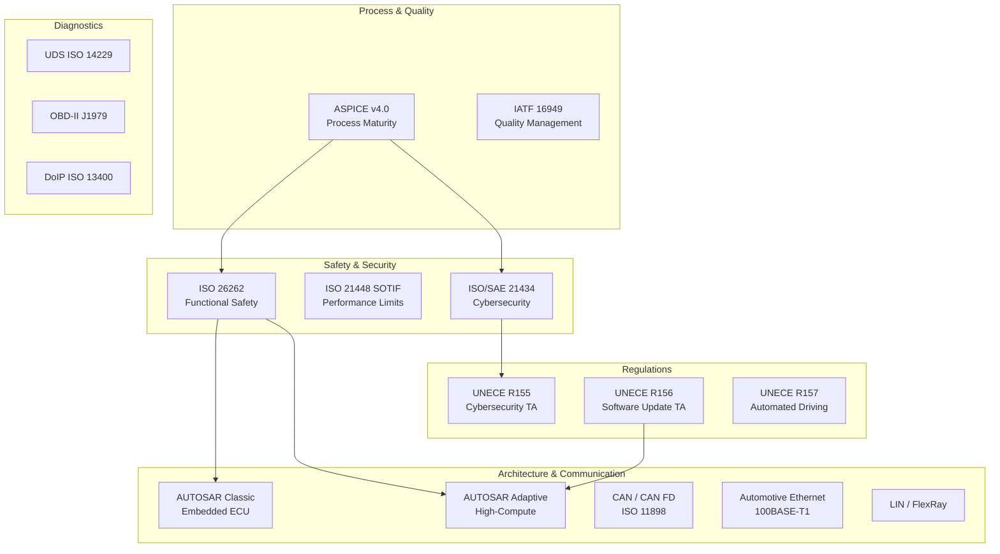
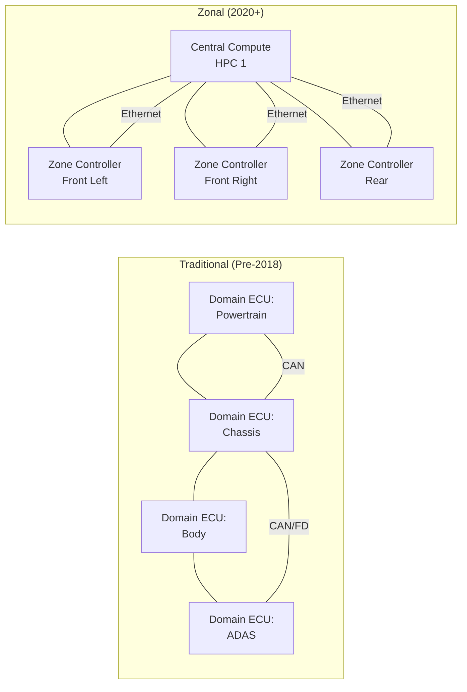
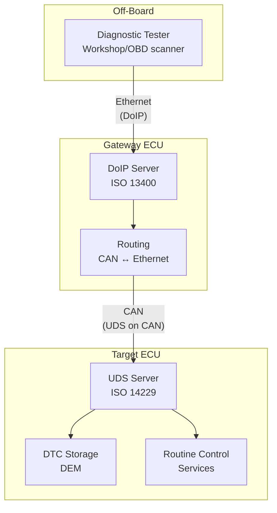
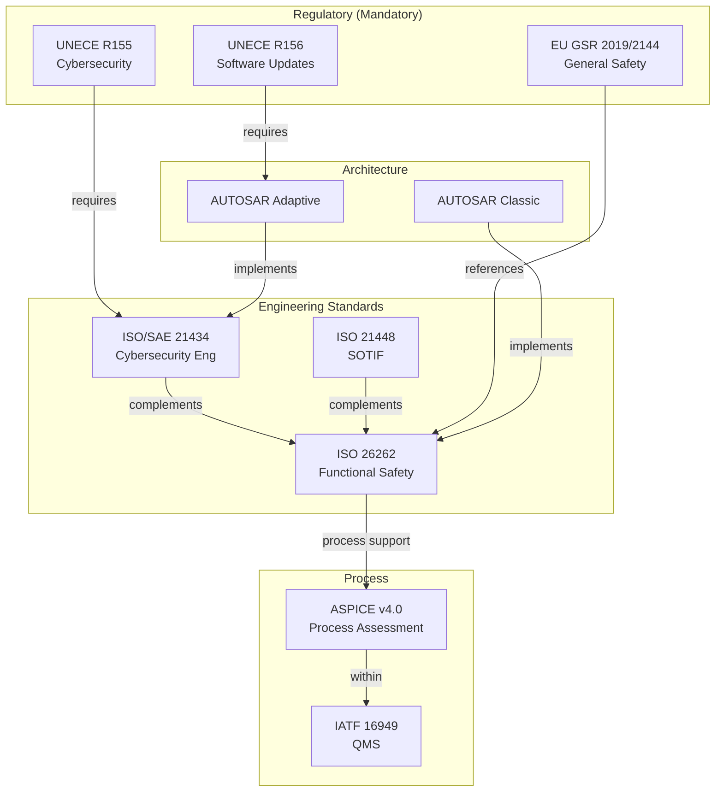
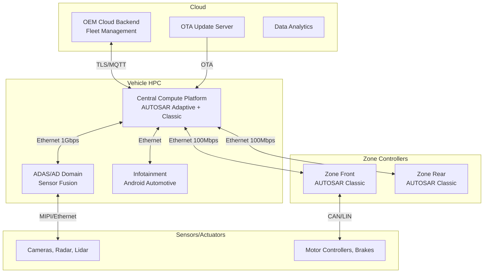

# Automotive Standards & Compliance Landscape

**Topic:** Complete Automotive Standards Ecosystem — Architecture, Safety, Cybersecurity, Diagnostics, Communication  
**Key Standards:** AUTOSAR, ASPICE, UNECE R155/R156, ISO 26262, ISO 21448, SAE J3016  
**Audience:** Automotive software engineers, system architects, OEM/Tier-1 compliance managers  
**Prerequisites:** Basic embedded systems knowledge, functional safety concepts (Category 01)

---

## Chapter 1 — Historical Context & Origin Story

### 1.1 Evolution of Automotive Electronics

| Era | Characteristic | Key Standards |
|-----|---------------|---------------|
| **Pre-1980** | Mechanical/hydraulic control | SAE materials standards |
| **1980-1995** | Simple ECUs, engine management | OBD-I/II (SAE J1979), CAN (ISO 11898) |
| **1995-2005** | Distributed ECUs, body/chassis | LIN, FlexRay, early AUTOSAR |
| **2005-2015** | Complex E/E architectures, ADAS | AUTOSAR Classic R4.x, ISO 26262 |
| **2015-2020** | Connected vehicles, autonomy | AUTOSAR Adaptive, UNECE R155/156, SOTIF |
| **2020-present** | Software-Defined Vehicles (SDV) | Zonal architecture, SOA, continuous OTA |

### 1.2 Key Incidents That Shaped Automotive Standards

| Year | Incident | Standard Impact |
|------|----------|----------------|
| 2009-2010 | Toyota Unintended Acceleration | ISO 26262 urgency, MISRA enforcement |
| 2015 | Jeep Cherokee remote hack | ISO/SAE 21434, UNECE R155 |
| 2015 | VW Dieselgate (defeat devices) | ASPICE supplier audits, calibration governance |
| 2016-2018 | Tesla Autopilot fatalities | ISO 21448 (SOTIF), SAE J3016 clarification |
| 2020 | SolarWinds supply chain attack | Automotive software supply chain security |
| 2022 | EU Cyber Resilience Act proposal | Vehicle-to-everything (V2X) security |

### 1.3 Industry Consortia

| Organization | Role | Key Standards/Outputs |
|--------------|------|----------------------|
| AUTOSAR | Software architecture | Classic Platform, Adaptive Platform |
| VDA | German automotive quality | ASPICE, QMC assessments |
| SAE International | Engineering standards | J-standards (J1939, J3016, J2534) |
| UNECE WP.29 | Vehicle regulations | R-series (R155, R156, R79, R157) |
| ISO TC 22 | Road vehicles | ISO 26262, ISO 21448, ISO 11898 |
| OPEN Alliance | Automotive Ethernet | BroadR-Reach, TC10 |
| CAN in Automation (CiA) | CAN ecosystem | CAN FD, CAN XL, CANopen |

---

## Chapter 2 — Standard Architecture & Structure

### 2.1 Automotive Standards Map



### 2.2 Standards Interdependencies

| Standard A | Relationship | Standard B |
|-----------|--------------|-----------|
| ISO 26262 | Safety requirements → | AUTOSAR (safety mechanisms) |
| ASPICE | Process maturity for → | ISO 26262 (management) |
| UNECE R155 | Mandates → | ISO/SAE 21434 (engineering) |
| UNECE R156 | Enables → | AUTOSAR Adaptive (OTA) |
| ISO 21448 | Complements → | ISO 26262 (different failure types) |
| ISO 11898 (CAN) | Implemented via → | AUTOSAR COM stack |
| UDS (ISO 14229) | Mapped to → | AUTOSAR DCM |
| SAE J3016 | Levels define → | SOTIF/FuSa scope |

---

## Chapter 3 — Technical Deep Dive

### 3.1 E/E Architecture Evolution



### 3.2 AUTOSAR Stack Overview

| Layer | Classic Platform | Adaptive Platform |
|-------|-----------------|-------------------|
| **Application** | SWC (AUTOSAR Software Components) | POSIX applications (ara::) |
| **Middleware** | RTE (Runtime Environment) | ara::com (Service-Oriented) |
| **Services** | BSW Services (NvM, COM, Os) | Platform Services (UCM, EM, PHM) |
| **Abstraction** | ECU Abstraction, MCAL | OS Abstraction (POSIX PSE51) |
| **Hardware** | Microcontroller | High-performance SoC |
| **OS** | OSEK/AUTOSAR OS (static) | POSIX OS (Linux, QNX, PikeOS) |

### 3.3 Communication Protocol Comparison

| Protocol | Bandwidth | Topology | Use Case |
|----------|-----------|----------|----------|
| CAN 2.0B | 1 Mbps | Bus | Body, powertrain |
| CAN FD | 8 Mbps | Bus | Chassis, safety |
| CAN XL | 20 Mbps | Bus | Bridge to Ethernet |
| LIN | 20 kbps | Bus (master-slave) | Sensors, actuators |
| FlexRay | 10 Mbps | Bus/Star (dual) | Chassis, x-by-wire |
| 100BASE-T1 | 100 Mbps | P2P | Backbone, cameras |
| 1000BASE-T1 | 1 Gbps | P2P | ADAS, autonomous |
| 10BASE-T1S | 10 Mbps | Multi-drop | Sensor aggregation |

### 3.4 Diagnostic Architecture



---

## Chapter 4 — Implementation Guide

### 4.1 Typical Automotive Project Standards Roadmap

| Phase | Applicable Standards | Key Activities |
|-------|---------------------|----------------|
| Concept | ISO 26262 Part 3, ASPICE SYS.1-2 | HARA, safety goals, system requirements |
| System Design | ISO 26262 Part 4, AUTOSAR | Architecture, safety mechanisms |
| SW Design | ISO 26262 Part 6, ASPICE SWE.1-3 | Detailed design, AUTOSAR config |
| Implementation | MISRA C:2012, AUTOSAR C++14 | Coding, static analysis |
| Integration | ASPICE SWE.5, ISO 26262 Part 6 | Integration testing |
| Verification | ISO 26262 Part 4/6, ASPICE SWE.6 | System/SW verification |
| Validation | ISO 26262 Part 4, SOTIF | Vehicle-level validation |
| Production | IATF 16949, PPAP | Quality management |
| Post-production | UNECE R155/R156 | Cybersecurity monitoring, OTA |

### 4.2 ASPICE Capability Levels

| Level | Name | Meaning |
|-------|------|---------|
| CL 0 | Incomplete | Process not implemented |
| CL 1 | Performed | Process achieves purpose (outcomes exist) |
| CL 2 | Managed | Process is planned, monitored, adjusted |
| CL 3 | Established | Standard process exists, tailored per project |
| CL 4 | Predictable | Process measured quantitatively |
| CL 5 | Innovating | Process continuously improved |

**OEM typical requirements:** CL 2 for most suppliers, CL 3 for safety-critical

---

## Chapter 5 — Certification & Audit

### 5.1 Type Approval Requirements (EU)

| Regulation | Mandatory From | Scope |
|-----------|----------------|-------|
| UNECE R155 (Cybersecurity) | July 2022 (new types), July 2024 (all) | CSMS certification + vehicle type approval |
| UNECE R156 (Software Update) | July 2022 (new types), July 2024 (all) | SUMS certification + vehicle type approval |
| UNECE R157 (ALKS) | Jan 2021 | Automated Lane Keeping (Level 3) |
| EU General Safety Reg (EU) 2019/2144 | July 2022 | ISA, AEB, lane departure, driver monitoring |

### 5.2 Assessment Bodies

| Standard | Assessment Body |
|----------|----------------|
| ASPICE | intacs-certified assessors (VDA QMC) |
| ISO 26262 | TÜV SÜD, TÜV Rheinland, SGS, Exida |
| UNECE R155/156 | National Type Approval Authority (KBA, VCA, RDW) |
| IATF 16949 | IATF-accredited CB (TÜV, SGS, BSI) |

---

## Chapter 6 — Regional & Domain Variants

### 6.1 Regional Regulatory Landscape

| Region | Framework | Key Regulations |
|--------|-----------|-----------------|
| EU | UNECE WP.29 | R155, R156, R157, EU GSR |
| USA | NHTSA / FMVSS | No mandatory cybersecurity (yet), voluntary SAE |
| China | MIIT / GB standards | GB/T 40857 (cybersecurity), GB/T 40429 (OTA) |
| Japan | MLIT | Follows UNECE + national requirements |
| Korea | MOLIT/KATRI | Follows UNECE + Korean additions |

### 6.2 Domain-Specific Variants

| Vehicle Type | Additional Standards |
|--------------|---------------------|
| Passenger car | Full UNECE, ISO 26262 (ASIL) |
| Commercial truck | SAE J1939, ISO 26262 + truck-specific |
| Electric vehicle | ISO 6469, IEC 61851, ISO 15118 |
| Autonomous vehicle | SAE J3016, ISO 21448, UNECE R157 |
| Motorcycle | ISO 26262 Part 12, specific UNECE R-series |
| Agricultural | ISO 25119 (AgPL), ISOBUS |

---

## Chapter 7 — Comparison: Domain vs. Zonal Architecture

| Aspect | Domain Architecture | Zonal Architecture |
|--------|--------------------|--------------------|
| ECU count | 80-150 ECUs | 3-5 zone controllers + HPC |
| Wiring | Heavy harness (40+ kg) | Reduced (15-20 kg) |
| Communication | Mostly CAN/LIN | Ethernet backbone + CAN/LIN leaf |
| Software update | Per-ECU flash | Centralized OTA |
| Processing | Distributed | Centralized compute |
| AUTOSAR | Classic (per ECU) | Adaptive (HPC) + Classic (zone) |
| Latency | Low (direct CAN) | Managed (Ethernet switching) |
| Cost driver | Many ECU variants | Compute hardware |
| Scalability | Add ECU per feature | Add software to existing HW |
| Safety | Per-ECU ASIL | Mixed-criticality partitioning |

---

## Chapter 8 — Mermaid Architecture Diagrams

### 8.1 Automotive Standards Dependency Map



### 8.2 Software-Defined Vehicle Architecture



---

## Chapter 9 — Case Studies & Failure Analysis

### 9.1 AUTOSAR Migration Success: BMW E/E Platform

**Challenge:** BMW needed to consolidate 100+ ECU variants across model lines.

**Approach:**
- AUTOSAR Classic R4.x for all body/powertrain ECUs
- Standardized BSW → multi-supplier ECU portability
- VFB (Virtual Function Bus) for application SW reuse across models

**Results:**
- 40% reduction in platform integration effort
- SW components reused across 3 vehicle generations
- Supplier qualification time reduced from 18 months to 6 months

### 9.2 Cybersecurity Type Approval: First UNECE R155 Compliance

**Challenge:** EU mandated CSMS (Cybersecurity Management System) + vehicle-level cybersecurity by July 2022.

**Approach:**
- Establish CSMS per ISO/SAE 21434 (organizational processes)
- TARA (Threat Analysis and Risk Assessment) for each vehicle type
- Implement security controls (SecOC, secure boot, IDS)
- Demonstrate to Type Approval Authority (KBA)

**Key learnings:**
- CSMS approval is per organization (not per vehicle)
- Vehicle type approval references CSMS + specific threat mitigations
- Post-production monitoring is mandatory (vulnerability watching)

---

## Chapter 10 — Future Evolution & Industry Trends

### 10.1 Emerging Trends

| Trend | Impact on Standards |
|-------|-------------------|
| Software-Defined Vehicle | AUTOSAR Adaptive dominance, continuous deployment |
| Vehicle-as-a-Platform | API standards, third-party app ecosystems |
| AI/ML in vehicles | ISO 21448 expansion, AMLAS for automotive |
| V2X communication | IEEE 802.11p/C-V2X, security standards |
| Electric powertrains | ISO 6469, IEC 61851, ISO 15118 (Plug&Charge) |
| Digital twin | Simulation standards, virtual homologation |
| Quantum-safe crypto | Future-proofing vehicle security (post-2030) |

### 10.2 AUTOSAR Roadmap

| Phase | Focus |
|-------|-------|
| R24-11 | Service-oriented communication, SOME/IP enhancements |
| R25+ | SDV integration, cloud-native development |
| Future | AI integration, deterministic Ethernet, AUTOSAR for zonal |

---

## Chapter 11 — Interview Questions & Career Guide

### Tier 1: Entry-Level (0-3 years)

**Q1:** Name the main communication protocols used in modern vehicles and their typical use cases.  
**A:** (1) **CAN** (ISO 11898): 1 Mbps, bus topology — used for powertrain, body electronics, non-safety chassis. Most common in-vehicle network. (2) **CAN FD**: Up to 8 Mbps, backwards-compatible — used for safety-critical chassis, higher data rate needs. (3) **LIN** (ISO 17987): 20 kbps, single-wire master-slave — used for simple sensors/actuators (window, mirror, seat). (4) **FlexRay** (ISO 17458): 10 Mbps, dual-channel, time-triggered — used for brake-by-wire, steer-by-wire (deterministic timing). Being replaced by Ethernet. (5) **Automotive Ethernet** (100BASE-T1): 100 Mbps to 10 Gbps, point-to-point — used for backbone, cameras, ADAS, infotainment. Growing rapidly. (6) **MOST** (legacy): 150 Mbps — used for infotainment ring network (being replaced by Ethernet).

### Tier 2: Mid-Level (3-8 years)

**Q2:** Explain the relationship between UNECE R155, ISO/SAE 21434, and how they affect an automotive project.  
**A:** UNECE R155 is a **regulation** — it's legally mandatory for vehicle type approval in UNECE contracting parties (EU, Japan, Korea). It requires: (1) OEM must have a certified CSMS (Cybersecurity Management System), (2) Each vehicle type must demonstrate cybersecurity. R155 defines WHAT must be achieved but not HOW. ISO/SAE 21434 is the **engineering standard** — it defines HOW to do cybersecurity engineering (TARA methodology, risk treatment, verification). R155 Annex 5 lists threats/mitigations that map to 21434 processes. **Project impact:** (a) Organization level: establish CSMS, get audited by Type Approval Authority. (b) Project level: perform TARA per 21434, implement security controls, verify, document. (c) Post-production: monitor vulnerabilities, assess applicability, issue patches via OTA (R156). (d) Supply chain: pass cybersecurity requirements to Tier-1 via ASPICE-like processes.

### Tier 3: Senior/Lead (8-15 years)

**Q3:** You're architecting a zonal E/E platform for a new vehicle program. What standards apply and how do you structure compliance?  
**A:** Complex answer spanning multiple standards simultaneously: (1) **Architecture decisions:** Central HPC (AUTOSAR Adaptive for high-compute functions) + Zone controllers (AUTOSAR Classic for real-time I/O). Ethernet backbone (TSN for deterministic) + CAN/LIN within zones. (2) **Safety (ISO 26262):** ASIL decomposition between HPC and zone controllers. Freedom from interference via hypervisor/OS partitioning on HPC. Safety-critical functions (braking, steering) — dedicated ASIL D paths through zone controller with hardware safety mechanisms. (3) **Cybersecurity (21434/R155):** Defense-in-depth: secure boot, SecOC on CAN, TLS on Ethernet, IDS, secure gateway at domain boundaries. TARA for each trust boundary. (4) **OTA (R156):** AUTOSAR Adaptive UCM for software updates. A/B partitioning, rollback capability, update integrity verification. (5) **Process:** ASPICE CL2+ for zone controller development. ASPICE + additional rigor for safety/security. (6) **Communication:** TSN configuration (IEEE 802.1Qbv for time-triggered + 802.1Qci for filtering). Service discovery (SOME/IP-SD). Network management across domains. (7) **Diagnostics:** DoIP gateway on HPC, UDS routing to zone controllers.

### Tier 4: Principal/Distinguished (15+ years)

**Q4:** How should the automotive standards ecosystem evolve for fully autonomous (L4/L5) software-defined vehicles?  
**A:** Fundamental rethinking required across multiple dimensions: (1) **Safety paradigm shift:** ISO 26262 was designed for known failure modes with ASIL allocation. L4/L5 requires: dynamic safety — system must recognize unknown situations and degrade safely. ISO 21448 is a step but insufficient. Need: statistical safety arguments ("1000x safer than human" demonstrated how?), scenario-based validation at scale (billions of km equivalent via simulation), continuous safety monitoring in operation. (2) **Continuous compliance:** Current model = develop → certify → produce → done. SDV model = continuous software deployment after SOP. Need: pre-approved change space (predetermined range of safe updates), automated regression of safety/security properties in CI/CD, real-time compliance dashboard. (3) **AI certification:** No standard currently covers ML model certification. Need: data quality standards, model verification frameworks, runtime monitoring requirements, update governance (model retraining ≠ traditional software change). (4) **Liability framework:** Current: manufacturer liable for hardware defect, driver responsible for operation. L4+: manufacturer/operator liable for driving decisions. Standards must define "due diligence" that provides legal safe harbor. (5) **Ecosystem standards:** SDV = software platform. Need: API standards for third-party apps, security sandboxing, performance guarantees (SLA for safety functions), inter-vehicle cooperation standards. (6) **Process:** ASPICE for continuous deployment (DevOps process model), agile safety (incremental safety cases), cybersecurity monitoring as permanent activity (not just development phase).

---

## Chapter 12 — Cheat Sheet & Quick Reference

### Automotive Standards Quick Lookup

| Need | Standard |
|------|----------|
| Safety of E/E systems | ISO 26262 |
| Safety of intended function (ADAS) | ISO 21448 (SOTIF) |
| Cybersecurity engineering | ISO/SAE 21434 |
| Cybersecurity type approval | UNECE R155 |
| OTA update approval | UNECE R156 |
| Autonomy levels | SAE J3016 |
| SW architecture (embedded) | AUTOSAR Classic |
| SW architecture (high-compute) | AUTOSAR Adaptive |
| Process maturity | ASPICE v4.0 |
| Quality management | IATF 16949 |
| CAN bus | ISO 11898 |
| Diagnostics (protocol) | UDS ISO 14229 |
| Diagnostics (on-board) | OBD-II SAE J1979 / ISO 15031 |
| Automotive Ethernet | 100BASE-T1 (OPEN Alliance) |
| Coding standard (C) | MISRA C:2012 |
| Coding standard (C++) | AUTOSAR C++14 / MISRA C++ |

### Communication Protocol Decision

```
Need > 100 Mbps? → Automotive Ethernet (100BASE-T1 / 1000BASE-T1)
Need deterministic timing? → FlexRay or TSN (Ethernet + 802.1Qbv)
Need low-cost sensor link? → LIN
Need moderate bandwidth + safety? → CAN FD
Legacy powertrain/body? → CAN 2.0B
Diagnostics over IP? → DoIP (ISO 13400) over Ethernet
```

### Type Approval Checklist (EU)

```
□ CSMS certified (UNECE R155) — organizational
□ TARA completed for vehicle type
□ Security controls implemented and verified
□ SUMS certified (UNECE R156) — if OTA capable
□ Functional safety case (ISO 26262)
□ SOTIF analysis (if ADAS/AD functions)
□ EMC (UNECE R10)
□ General Safety (EU 2019/2144) — AEB, ISA, etc.
```

---

*End of Document — 00_Automotive_Compliance_Landscape.md*
