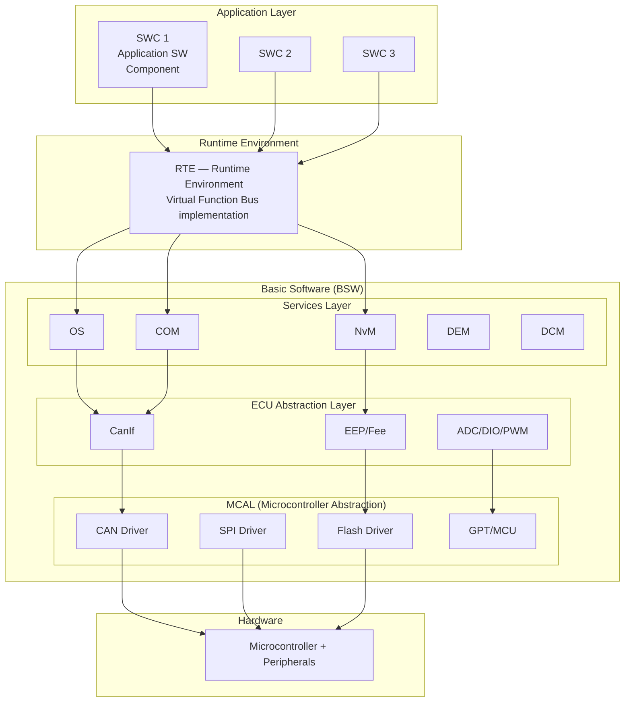
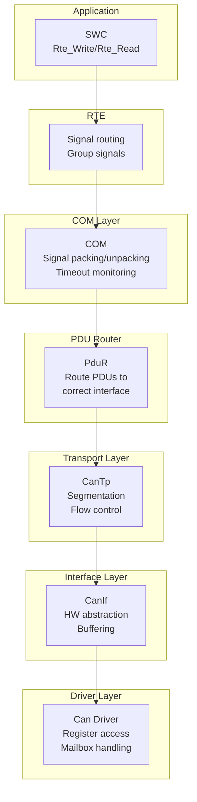
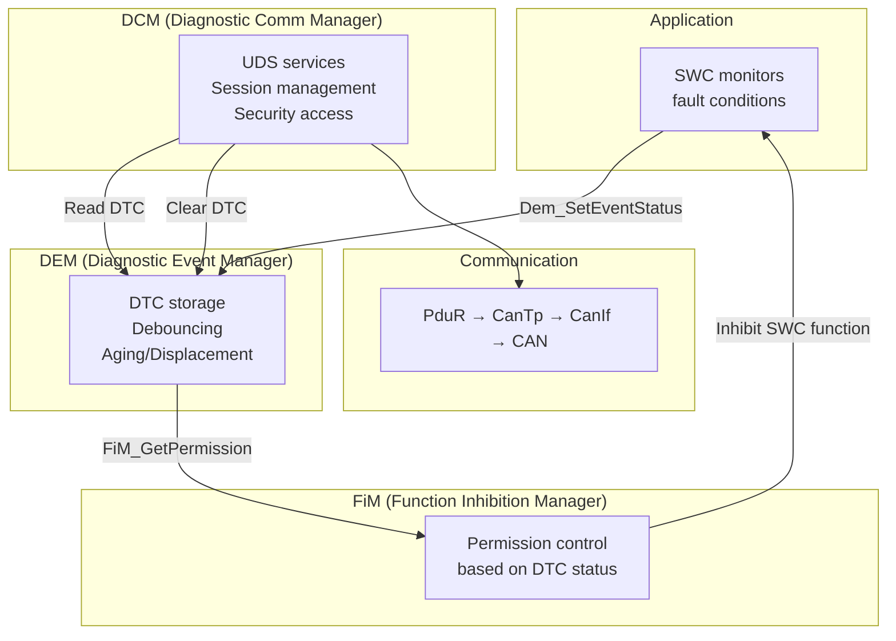
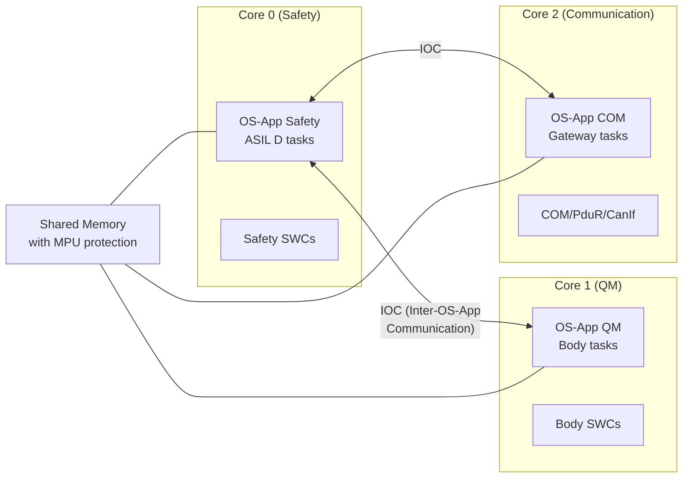
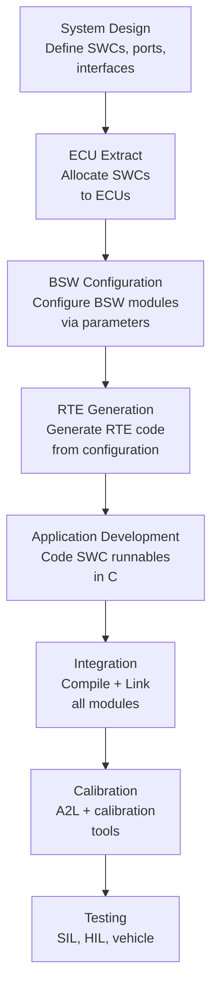
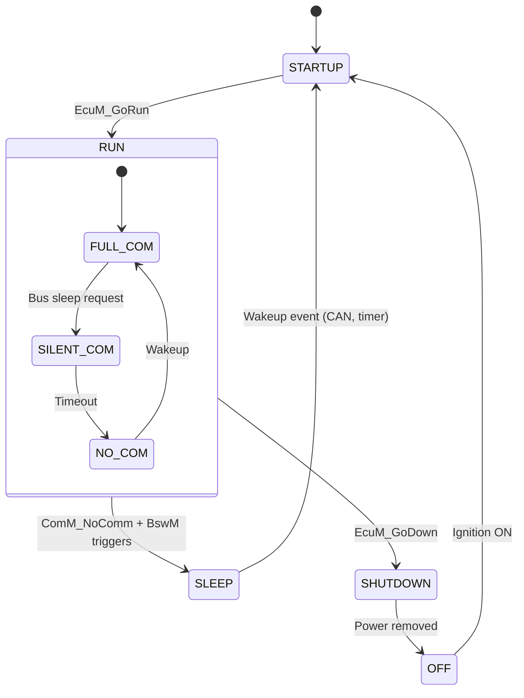
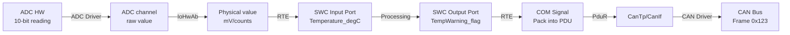
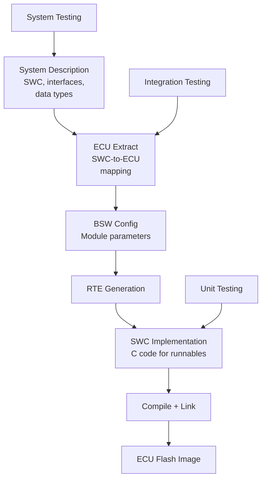

# AUTOSAR Classic Platform Architecture

**Topic:** AUTOSAR Classic Platform — Layered ECU Software Architecture  
**Standard:** AUTOSAR Classic Platform R23-11  
**SDO:** AUTOSAR Consortium (BMW, Bosch, Continental, Mercedes-Benz, Siemens, VW + 300+ partners)  
**Audience:** Embedded software engineers, BSW integrators, AUTOSAR architects, Tier-1 platform engineers  
**Prerequisites:** Microcontroller architecture, C programming, RTOS concepts, CAN/LIN communication

---

## Chapter 1 — Historical Context & Origin Story

### 1.1 Before AUTOSAR

| Problem | Description |
|---------|-------------|
| Vendor lock-in | BSW tightly coupled to HW → ECU supplier = sole source |
| No reuse | Application SW rewritten for each ECU/project |
| Integration nightmare | Each ECU had proprietary interfaces |
| Scaling cost | 80+ ECUs × custom SW = unsustainable engineering cost |
| Quality inconsistency | Each supplier's own BSW quality varied |

### 1.2 AUTOSAR Founding & Principles

**Founded:** 2003 by BMW, Bosch, Continental, DaimlerChrysler, Siemens VDO, Volkswagen

**Core Philosophy:** "Cooperate on standards, compete on implementation"

**Key Principles:**
1. **Standardized interfaces** between layers
2. **Hardware abstraction** — application independent of MCU
3. **Transferability** — SW components portable across ECUs
4. **Scalability** — from 8-bit to 32-bit MCUs
5. **Configurability** — behavior configured, not coded

### 1.3 Release History

| Release | Year | Key Addition |
|---------|------|-------------|
| R1.0 | 2005 | Initial architecture definition |
| R2.0 | 2006 | BSW module specifications |
| R3.0 | 2007 | First implementable release |
| R4.0 | 2009 | Major overhaul — CAN FD, multicore, safety |
| R4.1 | 2013 | Transformer, safety mechanisms |
| R4.2 | 2014 | Ethernet (SOME/IP), diagnostics extensions |
| R4.3 | 2016 | Security, extended diagnostics |
| R4.4 | 2018 | CAN XL, enhanced security |
| R20-11 | 2020 | Annual release cycle starts |
| R22-11 | 2022 | Multicore optimization, CAN XL |
| R23-11 | 2023 | Latest release |

---

## Chapter 2 — Standard Architecture & Structure

### 2.1 AUTOSAR Layered Architecture



### 2.2 BSW Module Categories

| Category | Modules | Purpose |
|----------|---------|---------|
| **Services** | OS, COM, NvM, BswM, EcuM, WdgM, DEM, DCM, FiM | Application-level services |
| **Communication** | COM, PduR, CanTp, LinTp, SoAd, SOME/IP | Message routing/transport |
| **Memory** | NvM, MemIf, Fee, Fls, Ea, Eep | Non-volatile storage |
| **Diagnostic** | DCM, DEM, FiM | UDS, DTC, function inhibition |
| **System** | EcuM, BswM, WdgM, ComM, NmIf | ECU state management |
| **Crypto** | Csm, CryIf, Crypto driver | Cryptographic services |
| **ECU Abstraction** | CanIf, LinIf, EthIf, IoHwAb | HW-independent interface |
| **MCAL** | CAN, SPI, ADC, DIO, PWM, GPT, MCU, WDG | Direct HW register access |

---

## Chapter 3 — Technical Deep Dive

### 3.1 Software Component (SWC) Model

**Ports:**
| Port Type | Direction | Example |
|-----------|-----------|---------|
| Sender-Receiver (S/R) | Bidirectional data | Speed_kph, Temperature |
| Client-Server (C/S) | Request-Response | DiagService_Request |
| Mode-Switch | Event notification | EcuMode_changed |
| Trigger | Activation signal | CyclicEvent_10ms |
| NvData | Persistent storage | Calibration_Block |

**Runnables:**
- Atomic execution unit within SWC
- Activated by RTE events (timing, data received, mode change)
- Maps to OS Task via RTE configuration

### 3.2 Communication Stack



### 3.3 Memory Stack

| Layer | Module | Function |
|-------|--------|----------|
| Application | NvM API | Read/Write blocks |
| Abstraction | NvM (NVRAM Manager) | Block management, CRC, redundancy |
| Interface | MemIf | Routes to Fee or Ea |
| Emulation | Fee (Flash) / Ea (EEPROM) | Wear leveling, virtual addressing |
| Driver | Fls / Eep | Physical read/write/erase |

**NvM Block Types:**
- **Native:** Simple block (one copy)
- **Redundant:** Two copies + CRC (fault tolerance)
- **Dataset:** Array of ROM/RAM blocks (calibration)

### 3.4 Diagnostic Stack



### 3.5 OS (AUTOSAR OS based on OSEK)

| Feature | Description |
|---------|-------------|
| Static configuration | All tasks, alarms, resources defined at build time |
| Priority-based preemptive | Higher priority task preempts lower |
| Schedule tables | Time-triggered activation |
| Protection (SC3/SC4) | Memory protection, timing protection |
| Multicore | OS-Application per core, IOC for inter-core |
| Scalability classes | SC1 (basic) → SC4 (full protection) |

**Scalability Classes:**

| SC | Feature Set |
|----|-------------|
| SC1 | Basic OSEK + counters + schedule tables |
| SC2 | SC1 + timing protection |
| SC3 | SC1 + memory protection (OS-Applications) |
| SC4 | SC2 + SC3 (full: timing + memory protection) |

### 3.6 Multicore Support



---

## Chapter 4 — Implementation Guide

### 4.1 AUTOSAR Development Workflow



### 4.2 Key Configuration Files

| File Type | Extension | Purpose |
|-----------|-----------|---------|
| ARXML | .arxml | All AUTOSAR configurations (SWC, BSW, system) |
| ECU Configuration | .arxml | BSW module parameters |
| System Description | .arxml | Network topology, signal mapping |
| A2L | .a2l | Calibration/measurement description |

### 4.3 Typical BSW Configuration Parameters (Example: COM)

| Parameter | Example Value | Purpose |
|-----------|---------------|---------|
| ComSignalInitValue | 0xFF (invalid) | Initial value before first reception |
| ComRxTimeoutMs | 200 | Reception timeout monitoring |
| ComTxPeriodMs | 10 | Cyclic transmission period |
| ComSignalByteOrder | BIG_ENDIAN | Motorola byte order |
| ComSignalLength | 16 bits | Signal bit width |
| ComSignalStartPosition | Bit 8 | Position in PDU |

### 4.4 AUTOSAR Tool Vendors

| Vendor | Tool | Modules |
|--------|------|---------|
| Vector | DaVinci (Configurator, Developer) | Full BSW, RTE, OS |
| ETAS | ISOLAR-AB | BSW configuration |
| Elektrobit (EB) | EB tresos | Full BSW stack |
| KPIT | KSAR | BSW modules |
| ARCCORE | Arctic Core | Open-source inspired BSW |

---

## Chapter 5 — Certification & Audit

### 5.1 AUTOSAR and ISO 26262

| ISO 26262 Requirement | AUTOSAR Support |
|----------------------|-----------------|
| Freedom from interference | OS-Application (SC3/SC4), MPU, timing protection |
| End-to-end protection | E2E library (Profile 1-7, CRC + counter + timeout) |
| Safe communication | SecOC (authenticated PDUs) |
| Diagnostic management | DEM with proven debouncing algorithms |
| Watchdog supervision | WdgM (alive, deadline, logical supervision) |
| Memory integrity | NvM with CRC, redundant blocks |

### 5.2 Safety Mechanisms in AUTOSAR Classic

| Mechanism | Module | Detects |
|-----------|--------|---------|
| Alive supervision | WdgM | Task not running (stuck) |
| Deadline supervision | WdgM | Task too slow/fast |
| Logical supervision | WdgM | Wrong execution order |
| E2E protection | E2E Lib | Communication corruption, loss, delay |
| Program flow monitoring | WdgM + Checkpoint | Unexpected execution path |
| Stack monitoring | OS (SC4) | Stack overflow |
| Timing protection | OS (SC4) | Task exceeds budget |

---

## Chapter 6 — Regional & Domain Variants

### 6.1 AUTOSAR Classic vs. Adaptive

| Aspect | Classic Platform | Adaptive Platform |
|--------|-----------------|-------------------|
| Target HW | MCU (ARM Cortex-M/R, Aurix, RH850) | SoC (ARM Cortex-A, x86) |
| OS | AUTOSAR OS (static, OSEK-based) | POSIX (Linux, QNX, PikeOS) |
| Scheduling | Static (configured at build) | Dynamic (threads, processes) |
| Communication | Signal-based (COM/PDU) | Service-oriented (SOME/IP, DDS) |
| Language | C (MISRA compliant) | C++14/17 |
| Update model | Full ECU reflash | Container/package update |
| Memory | Static allocation (no malloc) | Dynamic allocation allowed |
| Startup time | <100 ms typical | 1-10 seconds |
| Safety support | ASIL D (SC4) | Mixed-criticality (hypervisor) |

### 6.2 AUTOSAR Classic for Different ECU Types

| ECU Type | Typical Config | Example |
|----------|---------------|---------|
| Gateway | Heavy COM stack, PduR routing | Central gateway ECU |
| Powertrain | OS SC4, safety SWCs, multicore | Engine/Transmission ECU |
| Body | Many SWCs, LIN master, low safety | BCM (Body Control Module) |
| Chassis | ASIL D, FlexRay, fast cycle | ESP, ABS |
| ADAS sensor | Ethernet, high-bandwidth COM | Radar, Camera ECU |

---

## Chapter 7 — Comparison with Alternatives

| Feature | AUTOSAR Classic | OSEK/VDX (legacy) | Proprietary (custom) |
|---------|----------------|--------------------|--------------------|
| Standardization | Full (300+ specs) | Partial (OS only) | None |
| Portability | High (between AUTOSAR tools) | OS-level only | Zero |
| Complexity | High (steep learning curve) | Low | Variable |
| Configuration effort | Very high | Low | Medium |
| Tool cost | $$$$ (commercial tools) | $ | Custom |
| Multi-supplier | Yes (by design) | Difficult | Very difficult |
| Safety support | Comprehensive (SC4, E2E, WdgM) | Basic | Manual implementation |
| Suitability for... | Production automotive ECU | Legacy small ECU | Prototype/niche |

---

## Chapter 8 — Mermaid Architecture Diagrams

### 8.1 AUTOSAR ECU State Management



### 8.2 Signal Path: Sensor to Application



### 8.3 AUTOSAR Methodology (V-Model)



---

## Chapter 9 — Case Studies & Failure Analysis

### 9.1 COM Timeout Handling Bug

**Scenario:** Vehicle CAN bus goes to sleep mode. COM module sets signal to init value (0xFF = invalid). Application SWC doesn't check validity → interprets 0xFF as maximum sensor reading → actuator driven to maximum.

**Root cause:** Missing `ComRxDataTimeoutAction` configuration + no application-level plausibility check.

**Fix:**
- Configure `ComRxDataTimeoutAction = SUBSTITUTE` with safe substitute value
- SWC must check `Rte_IsUpdated()` or use E2E protection with timeout detection
- Add FiM inhibition when COM timeout DTC is set

### 9.2 NvM Block Corruption

**Scenario:** After 50,000 power cycles, NvM redundant block both copies corrupted → ECU starts with ROM defaults → customer complaint (settings lost).

**Root cause:** Flash write during unexpected power loss (no end-of-write flag). Fee wear-leveling used entire flash sector → eventually both redundant copies in same physical sector.

**Fix:**
- Implement immediate write on shutdown detection (EcuM shutdown hook)
- Fee configuration: ensure redundant copies in different physical sectors
- Add CRC verification on every NvM_ReadAll at startup

---

## Chapter 10 — Future Evolution & Industry Trends

### 10.1 AUTOSAR Classic Evolution

| Trend | Impact |
|-------|--------|
| Multicore optimization | Better partition strategies, lock-free communication |
| CAN XL support | New driver layer, higher bandwidth applications |
| Security extensions | SecOC enhancements, secure flash, key management |
| Functional safety | Enhanced WdgM, new E2E profiles |
| Convergence with Adaptive | Hybrid ECU concept (Classic + Adaptive on same SoC) |
| Model-Based BSW config | Generate ARXML from system models |

### 10.2 Classic Platform in Zonal Architecture

In zonal architecture, AUTOSAR Classic remains relevant for:
- Zone controllers (real-time I/O processing)
- Dedicated safety controllers (ASIL D)
- Sensor ECUs (radar, ultrasonic)
- Actuator controllers (motor, valve)

---

## Chapter 11 — Interview Questions & Career Guide

### Tier 1: Entry-Level (0-3 years)

**Q1:** Explain the AUTOSAR layered architecture and the purpose of each layer.  
**A:** AUTOSAR Classic has 4 main layers: (1) **Application Layer** — contains Software Components (SWCs) with application logic. Connected through standardized ports (Sender-Receiver, Client-Server). Hardware-independent. (2) **RTE (Runtime Environment)** — generated code that connects SWCs to BSW and to each other. Implements the Virtual Function Bus concept. Routes data between ports based on configuration. (3) **BSW (Basic Software)** — standardized infrastructure. Three sub-layers: Services (OS, COM, NvM, DEM — application-level services), ECU Abstraction (CanIf, IoHwAb — makes BSW hardware-independent), MCAL (CAN driver, ADC driver — direct hardware register access). (4) **Hardware** — the physical microcontroller. Purpose of layering: Application developer doesn't need to know hardware details. Hardware can be changed without touching application code. BSW is standardized so multi-vendor integration is possible.

**Q2:** What is the RTE and why is it generated (not hand-coded)?  
**A:** RTE = Runtime Environment. It's the implementation of the Virtual Function Bus (VFB) on a specific ECU. Generated because: (a) It depends on the specific configuration — which SWCs are on this ECU, how ports are connected, timing of runnables. This is unique per ECU project. (b) Generating guarantees consistency — hand-coding would introduce errors in port connections. (c) Performance — generator creates optimized code (direct function calls for local communication, queued for inter-core). (d) Safety — generated code can be verified against configuration (no manual coding errors in critical data routing). RTE handles: data routing between ports, runnable activation (timing events), mode management, inter-core communication (IOC for multicore).

### Tier 2: Mid-Level (3-8 years)

**Q3:** How does AUTOSAR achieve freedom from interference between ASIL D and QM software on the same ECU?  
**A:** ISO 26262 requires that QM software cannot corrupt ASIL D software. AUTOSAR mechanisms: (1) **OS-Applications (SC3/SC4):** Each OS-Application has defined memory regions. MPU (Memory Protection Unit) prevents cross-application memory access. ASIL D SWCs in separate OS-Application from QM. (2) **Timing protection (SC4):** Execution time budgets per task. If QM task exceeds budget → OS terminates it before it can starve safety task of CPU time. (3) **IOC (Inter-OS-Application Communication):** Typed, controlled data exchange between OS-Applications. No direct pointer sharing. (4) **Multicore allocation:** Safety-critical on dedicated core with own OS instance. QM on separate core. Hardware isolation between cores. (5) **Stack monitoring:** Each task has individual stack. OS detects overflow before corruption spreads. (6) **E2E protection:** Even communication between safety and QM modules protected by E2E (CRC + counter) → detect corruption.

### Tier 3: Senior/Lead (8-15 years)

**Q4:** You're migrating a proprietary ECU software to AUTOSAR Classic. What's your strategy for a chassis ECU (ASIL D)?  
**A:** Phased approach: (1) **Architecture mapping:** Identify existing functions → map to SWC candidates. Define port interfaces (S/R for data, C/S for services). Create AUTOSAR system description (ARXML). (2) **BSW selection:** Choose AUTOSAR stack vendor (Vector, EB, ETAS). Key criteria for ASIL D: pre-certified BSW (ISO 26262 safety manual available), SC4 OS support, E2E library included. (3) **Incremental migration:** Don't rewrite everything at once. Use Complex Device Driver (CDD) concept — wrap legacy code as CDD initially, gradually replace with AUTOSAR BSW. (4) **Safety architecture:** OS SC4 (timing + memory protection). ASIL D SWCs in dedicated OS-Application. WdgM supervision (alive + deadline + logical). E2E on safety-relevant communication. (5) **Testing strategy:** Unit test each SWC independently (mock RTE). Integration test on target (verify timing, OS behavior). Back-to-back test: legacy behavior vs. AUTOSAR behavior → must be functionally equivalent. (6) **Tooling:** RTE generation must be qualified (ISO 26262 tool qualification). BSW configuration tools: validate all parameters against safety manual constraints. (7) **Challenges:** Timing changes (RTE overhead vs. direct function calls in legacy). Memory increase (BSW + RTE overhead). Training (team needs AUTOSAR expertise). Schedule: typically 18-24 months for full migration of complex ECU.

### Tier 4: Principal/Distinguished (15+ years)

**Q5:** Design a mixed-criticality AUTOSAR Classic architecture for a multicore safety ECU handling ASIL D braking + ASIL B steering + QM comfort functions.  
**A:** Architecture decisions: (1) **Core allocation:** Core 0 = ASIL D (braking safety functions). Core 1 = ASIL B (steering assist). Core 2 = QM (comfort functions) + COM stack. Rationale: physical core separation provides strongest independence. (2) **OS configuration:** Each core has own OS instance (SC4 on Core 0/1, SC1 on Core 2). Independent watchdog per core. Cross-core synchronization only through IOC (no shared memory mutation). (3) **Memory layout:** Each core's OS-Application owns distinct Flash/RAM regions. MPU configured per OS-Application. Shared read-only calibration accessible from all cores. Core 0 has exclusive access to brake actuator I/O registers. (4) **Communication:** Inter-core: IOC with E2E protection (Profile 4 = CRC32 + counter + data ID). If QM core fails → safety cores detect via E2E timeout and enter safe state independently. External CAN: COM stack on Core 2 (QM). Safety-relevant signals from CAN protected with E2E before forwarding to Core 0/1 via IOC. (5) **Supervision:** Core 0: WdgM with alive + deadline + logical supervision. External watchdog (window WDG) serviced only if all Core 0 checkpoints pass. Core 1: separate WdgM instance, separate external watchdog. Core 2: basic internal WDG (QM). (6) **Safe state concept:** Core 0 failure → brake limp-home (reduced braking via hydraulic). Core 1 failure → steering assist disabled (manual steering). Core 2 failure → comfort features off, no safety impact. (7) **ASIL decomposition:** Where ASIL D requirement can be decomposed → ASIL B(D) on Core 0 + ASIL B(D) on Core 1 with independence proven. Reduces verification burden where applicable.

---

## Chapter 12 — Cheat Sheet & Quick Reference

### AUTOSAR Classic Module Quick Reference

| Module | Abbreviation | Purpose |
|--------|-------------|---------|
| Os | Operating System | Task scheduling, protection |
| Com | Communication | Signal packing, timeout |
| PduR | PDU Router | Route PDUs between layers |
| CanIf | CAN Interface | HW abstraction for CAN |
| CanTp | CAN Transport | Multi-frame segmentation |
| NvM | NVRAM Manager | Persistent storage |
| Fee | Flash EEPROM Emulation | Flash wear leveling |
| EcuM | ECU State Manager | Startup/shutdown |
| BswM | BSW Mode Manager | Mode arbitration |
| ComM | Communication Manager | Bus sleep/wake |
| WdgM | Watchdog Manager | Supervision |
| Dem | Diagnostic Event Manager | DTC storage |
| Dcm | Diagnostic Comm Manager | UDS protocol |
| FiM | Function Inhibition | DTC → function disable |
| Csm | Crypto Service Manager | Encryption, signing |
| SecOC | Secure On-board Comm | Authenticated PDUs |
| E2E | End-to-End | Data protection |

### SWC Port Type Selection

```
Need periodic data exchange? → Sender-Receiver (S/R)
Need request-response service? → Client-Server (C/S)
Need mode notification? → Mode-Switch
Need persistent data? → NvData port
Need calibration parameter? → Parameter port (Per-Instance)
```

### OS Scalability Class Selection

```
No safety requirement? → SC1 (basic)
Need timing protection (ASIL)? → SC2
Need memory protection (mixed-ASIL)? → SC3
Need both timing + memory (ASIL D)? → SC4
```

---

*End of Document — 01_AUTOSAR_Classic_Architecture.md*
