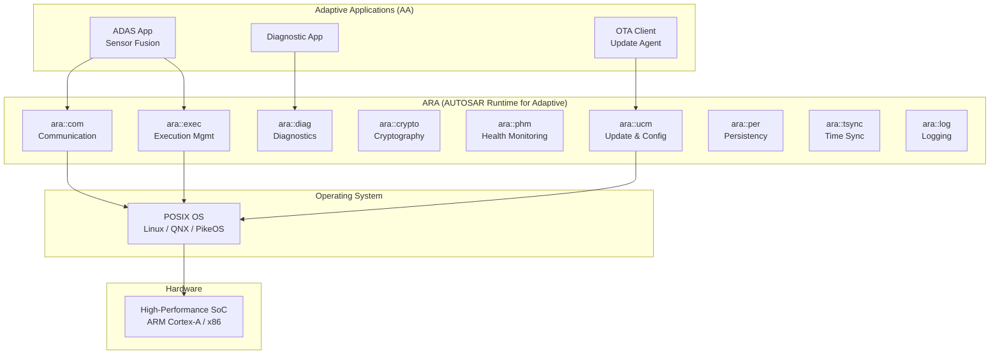
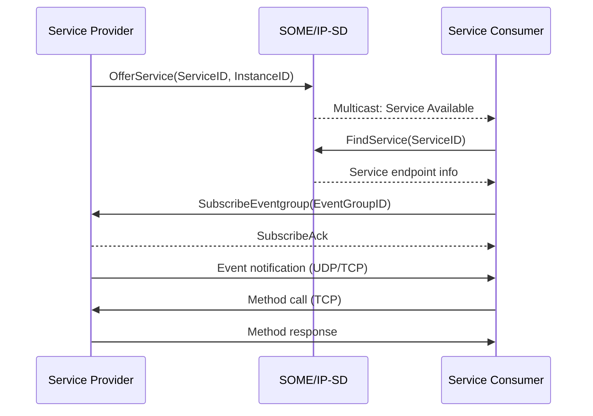
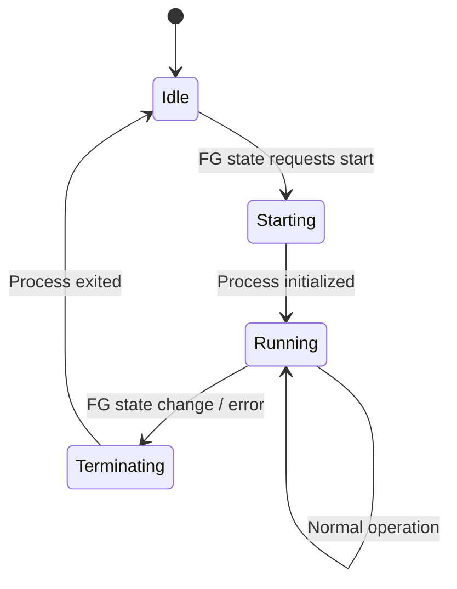
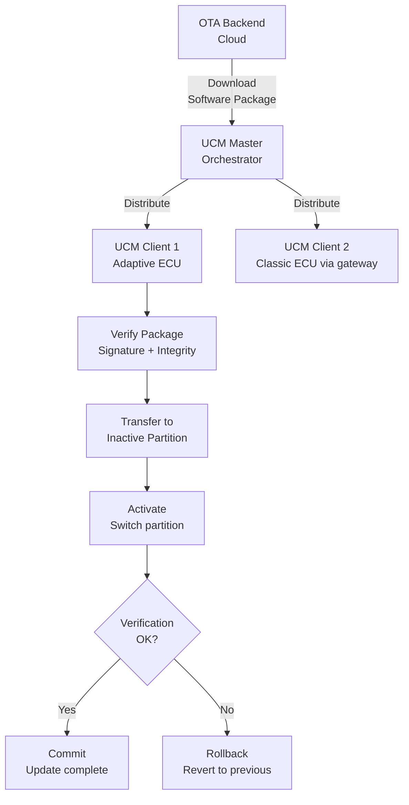
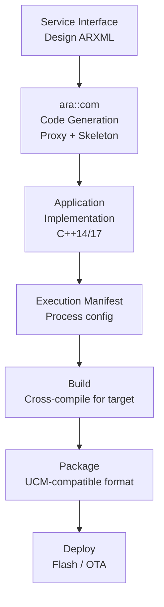
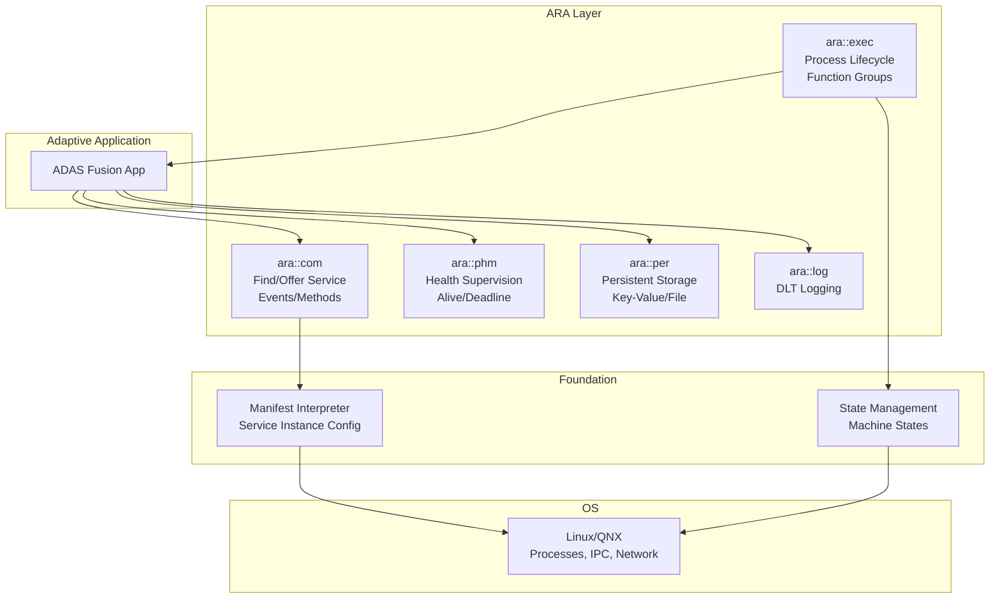
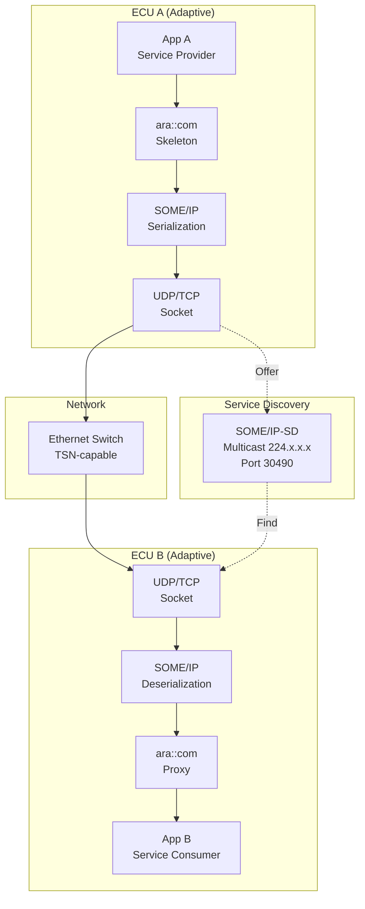
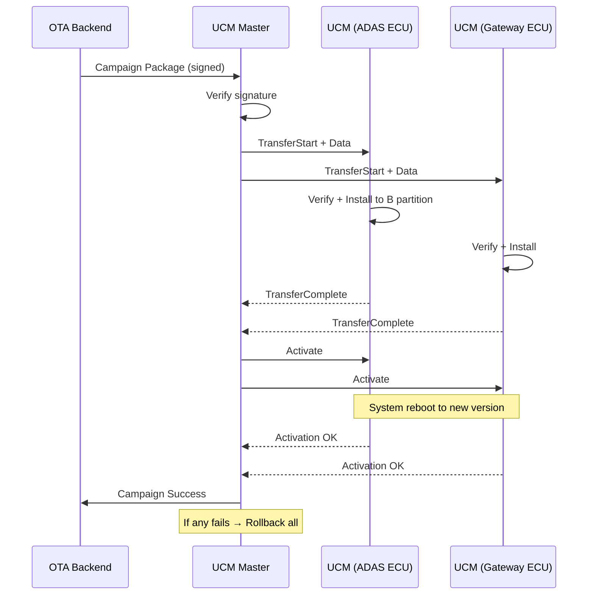

# AUTOSAR Adaptive Platform Architecture

**Topic:** AUTOSAR Adaptive Platform — Service-Oriented Architecture for High-Performance Computing ECUs  
**Standard:** AUTOSAR Adaptive Platform R23-11  
**SDO:** AUTOSAR Consortium  
**Audience:** C++ software engineers, platform architects, ADAS/AD developers, SOA designers  
**Prerequisites:** C++14/17, Linux/POSIX, service-oriented architecture, networking

---

## Chapter 1 — Historical Context & Origin Story

### 1.1 Why a New Platform?

AUTOSAR Classic was designed for deterministic, resource-constrained MCUs. New vehicle functions demanded capabilities Classic couldn't provide:

| Requirement | Classic Limitation | Adaptive Solution |
|-------------|-------------------|-------------------|
| High compute (ADAS/AD) | Static scheduling, no dynamic allocation | POSIX OS, dynamic processes |
| Software updates (OTA) | Full flash only | Package-level updates (UCM) |
| Service discovery | Static signal routing | SOME/IP service-oriented |
| Multi-language | C only | C++14, potentially Rust |
| Complex algorithms | No heap, no STL | Full C++ with containers |
| Ethernet-native | CAN-centric with Ethernet added | Ethernet-first design |
| Cloud connectivity | Not designed for | Native IP, REST-like |

### 1.2 Timeline

| Release | Year | Key Features |
|---------|------|-------------|
| R16-03 | 2016 | Foundation — architecture concept |
| R17-03 | 2017 | First specification release |
| R17-10 | 2017 | Communication Management, Execution Management |
| R18-10 | 2018 | Update & Config Management, Diagnostics |
| R19-11 | 2019 | Security, Platform Health Management |
| R20-11 | 2020 | Time Synchronization, enhanced PHM |
| R21-11 | 2021 | Cryptography, enhanced UCM |
| R22-11 | 2022 | Signal-based communication bridge |
| R23-11 | 2023 | Latest (matured platform) |

---

## Chapter 2 — Standard Architecture & Structure

### 2.1 Adaptive Platform Architecture



### 2.2 Functional Clusters

| Cluster | API Namespace | Purpose |
|---------|--------------|---------|
| Communication Management | ara::com | Service-oriented communication (SOME/IP, DDS) |
| Execution Management | ara::exec | Process lifecycle, startup, scheduling |
| Update & Configuration Management | ara::ucm | OTA software update |
| Diagnostics | ara::diag | UDS server/client, DTC management |
| Persistency | ara::per | Key-value + file storage |
| Cryptography | ara::crypto | Keys, certificates, encryption |
| Platform Health Management | ara::phm | Supervision (alive, deadline) |
| Time Synchronization | ara::tsync | gPTP / time master/slave |
| Identity & Access Management | ara::iam | Authorization policies |
| Logging & Tracing | ara::log | DLT-compatible logging |
| Network Management | ara::nm | Partial networking |
| Core Types | ara::core | Result, ErrorCode, Future, etc. |

---

## Chapter 3 — Technical Deep Dive

### 3.1 Communication Management (ara::com)

**Service-Oriented Architecture:**

| Concept | Description |
|---------|-------------|
| Service | Named interface with events, methods, fields |
| Service Instance | Runtime instance of a service |
| Proxy | Client-side generated class to consume service |
| Skeleton | Server-side generated class to provide service |
| Find Service | Dynamic discovery of service instances |
| Offer Service | Announce availability of service |

**Communication patterns:**

| Pattern | Description | Use Case |
|---------|-------------|----------|
| Events | Publish-subscribe (1:N) | Sensor data broadcast |
| Methods | Request-response (1:1) | Diagnostic request |
| Fields | Get/Set + Notification | Configuration parameter |
| Triggers | Fire-and-forget | Actuator command |

**Binding layer protocols:**

| Protocol | Use Case |
|----------|----------|
| SOME/IP | Intra-vehicle service communication |
| DDS | Real-time data distribution (ADAS) |
| IPC (local) | Same-machine communication (shared memory) |
| Signal-based (bridge) | Gateway to AUTOSAR Classic (COM signals) |

### 3.2 Service Discovery (SOME/IP-SD)



### 3.3 Execution Management (ara::exec)

| Concept | Description |
|---------|-------------|
| Machine | Physical/virtual compute node |
| Machine State | STARTUP → RUNNING → SHUTDOWN |
| Function Group | Set of processes with coordinated lifecycle |
| Function Group State | Active state within a function group |
| Process | OS process (one per Adaptive Application instance) |
| Execution Manifest | JSON/ARXML defining process attributes |

**Process states:**



### 3.4 Update & Configuration Management (UCM)



**UCM Update Strategies:**

| Strategy | Description |
|----------|-------------|
| A/B partition | Two complete system images, switch active |
| Delta update | Only changed files/packages transmitted |
| In-place update | Overwrite current (risky, needs rollback mechanism) |
| Campaign | Coordinated update of multiple ECUs |

### 3.5 Persistency (ara::per)

| Storage Type | API | Use Case |
|-------------|-----|----------|
| Key-Value Storage | ara::per::KeyValueStorage | Configuration, small data |
| File Storage | ara::per::FileStorage | Large data, logs, ML models |
| Stream Storage | Planned | Continuous data recording |

### 3.6 Platform Health Management (ara::phm)

| Supervision | Description | Detects |
|------------|-------------|---------|
| Alive | Periodic heartbeat expected | Process hung/crashed |
| Deadline | Time between two checkpoints | Process too slow |
| Logical | Expected sequence of checkpoints | Wrong execution order |

**Recovery actions:**
- Process restart (graceful → forced)
- Function Group state change
- Machine reset
- Report to higher-level monitor

---

## Chapter 4 — Implementation Guide

### 4.1 Development Workflow



### 4.2 Example: Service Provider (Skeleton)

```cpp
// Generated skeleton class
class RadarServiceSkeleton : public ara::com::skeleton::ServiceSkeleton {
public:
    // Event (server publishes)
    ara::com::skeleton::Event<RadarObjectList> ObjectDetected;
    
    // Method (client calls, server implements)
    virtual ara::core::Future<CalibrateOutput> 
        Calibrate(uint8_t mode) = 0;
    
    // Field (get/set + notification)
    ara::com::skeleton::Field<SensorStatus> Status;
};

// Application implements the skeleton
class RadarServiceImpl : public RadarServiceSkeleton {
public:
    ara::core::Future<CalibrateOutput> Calibrate(uint8_t mode) override {
        // Implementation
        ara::core::Promise<CalibrateOutput> promise;
        // ... perform calibration ...
        promise.set_value(result);
        return promise.get_future();
    }
};
```

### 4.3 Example: Service Consumer (Proxy)

```cpp
// Application finds and uses service
void ConsumerApp() {
    // Find service (asynchronous)
    auto handle = ara::com::runtime::FindService(
        RadarServiceProxy::GetServiceIdentifier());
    
    // Create proxy from handle
    RadarServiceProxy proxy(handle[0]);
    
    // Subscribe to event
    proxy.ObjectDetected.Subscribe(10); // queue size
    proxy.ObjectDetected.SetReceiveHandler([&]() {
        auto samples = proxy.ObjectDetected.GetNewSamples();
        for (auto& sample : samples) {
            ProcessRadarData(*sample);
        }
    });
    
    // Call method
    auto future = proxy.Calibrate(0x01);
    auto result = future.get(); // blocks until response
}
```

### 4.4 Platform Vendors

| Vendor | Product | OS Support |
|--------|---------|------------|
| Vector | MICROSAR Adaptive | Linux, QNX |
| ETAS | VRTE (Vehicle Runtime Environment) | Linux |
| Elektrobit | EB corbos Adaptive | Linux, QNX |
| Apex.AI | Apex.OS + Apex.Middleware | Custom POSIX |
| TTTech | MotionWise | QNX, Linux |
| KPIT | Adaptive Platform | Linux |

---

## Chapter 5 — Certification & Audit

### 5.1 Safety in Adaptive Platform

| Challenge | Approach |
|-----------|----------|
| Dynamic allocation | Constrained allocators, no allocation after init |
| POSIX OS not safety-certified | Safety OS (QNX SIL4, PikeOS SIL4) or Linux + safety island |
| C++ complexity | AUTOSAR C++14 coding guidelines |
| Service discovery dynamic | Deterministic configuration mode for safety |
| Process crash | PHM supervision + automatic restart |

### 5.2 Cybersecurity Certification

| Feature | ara:: API | Standard |
|---------|-----------|----------|
| Secure communication | ara::com + TLS/DTLS | ISO/SAE 21434 |
| Secure boot | Platform-level | UNECE R155 |
| Secure update | ara::ucm (signed packages) | UNECE R156 |
| Key management | ara::crypto | ISO 21434 |
| Access control | ara::iam | ISO 21434 |
| Intrusion detection | Platform service | UNECE R155 |

---

## Chapter 6 — Regional & Domain Variants

### 6.1 Adaptive Platform Use Cases by Domain

| Domain | Application | Key ara:: APIs |
|--------|-------------|----------------|
| ADAS/AD | Sensor fusion, path planning | ara::com (DDS), ara::exec |
| Telematics | Connectivity, fleet management | ara::com, ara::crypto |
| Infotainment gateway | Service bridge to Android | ara::com, ara::per |
| Central compute | Domain controller / HPC | All clusters |
| V2X | Vehicle-to-everything | ara::com, ara::crypto |
| Diagnostics | Remote diagnostics / OBD | ara::diag, ara::com |

### 6.2 Deployment Configurations

| Configuration | Description |
|---------------|-------------|
| Standalone | Single SoC running Adaptive only |
| Hybrid | Adaptive (Cortex-A) + Classic (Cortex-R/M) on same SoC |
| Distributed | Multiple Adaptive machines + Classic ECUs |
| Virtualized | Multiple Adaptive instances in VMs/containers |

---

## Chapter 7 — Comparison: Adaptive vs. ROS 2 vs. Proprietary

| Feature | AUTOSAR Adaptive | ROS 2 | Proprietary (e.g., Tesla) |
|---------|------------------|-------|---------------------------|
| Standardization | Full (AUTOSAR consortium) | Open (but less formal) | None (vendor-specific) |
| Communication | SOME/IP, DDS | DDS (native) | Custom (protobuf, etc.) |
| Safety certification | Designed for (ASIL) | Not designed for safety | Case-by-case |
| OTA update | UCM (standardized) | None (custom) | Custom (highly optimized) |
| Language | C++14 (AUTOSAR guidelines) | C++17, Python | C++, Python, custom |
| OS | POSIX (QNX, Linux) | Linux (mainly) | Linux (custom kernel) |
| Industry adoption | OEMs/Tier-1 (production) | Research, robotics | Single company |
| Tooling | Commercial (expensive) | Open-source | Internal |
| Flexibility | Standardized but configurable | Very flexible | Maximum (no constraints) |
| Time-to-production | Medium (process required) | Fast (prototype) | Fast (no external gates) |

---

## Chapter 8 — Mermaid Architecture Diagrams

### 8.1 Adaptive Platform Functional Cluster Interaction



### 8.2 SOME/IP Communication Architecture



### 8.3 UCM Campaign Orchestration



---

## Chapter 9 — Case Studies & Failure Analysis

### 9.1 Service Discovery Storm

**Scenario:** 15 Adaptive applications all start simultaneously after vehicle boot. Each calls FindService for 10+ services → multicast flood on SOME/IP-SD → Ethernet switch congestion → delayed service availability → ADAS functions start late.

**Root cause:** No staggered startup, all services announced/sought simultaneously.

**Fix:**
- Execution Management: configure startup ordering (Function Group states)
- SOME/IP-SD: configure initial delay randomization (InitialDelayMin/Max)
- Prioritize safety-relevant services (higher VLAN priority for SD multicast)

### 9.2 UCM Rollback Failure

**Scenario:** OTA update deployed to vehicle fleet. 0.1% of vehicles: update interrupted during activation phase (battery disconnect). On next boot, system in inconsistent state (partially updated).

**Fix:**
- Strict A/B partitioning (never modify running partition)
- Boot loader validates partition integrity (hash) before booting
- If active partition invalid → boot from previous known-good
- UCM state machine: never mark activation complete until full verification post-boot

---

## Chapter 10 — Future Evolution & Industry Trends

| Trend | Impact on Adaptive Platform |
|-------|---------------------------|
| Software-Defined Vehicle | Adaptive becomes primary vehicle SW platform |
| Containerization | Docker-like deployment on vehicle (already in discussion) |
| Rust integration | ara:: bindings for Rust (memory safety) |
| AI framework integration | TensorRT, ONNX runtime as Adaptive services |
| Cloud-native development | CI/CD with vehicle-cloud continuum |
| Digital twin | Adaptive Platform running in cloud for simulation |
| Deterministic networking | TSN integration for real-time guarantees |
| Vehicle API | Standard APIs for third-party applications |

---

## Chapter 11 — Interview Questions & Career Guide

### Tier 1: Entry-Level (0-3 years)

**Q1:** What's the fundamental difference between AUTOSAR Classic and Adaptive?  
**A:** Classic = embedded, static, signal-based. Designed for MCUs (Cortex-M/R), everything configured at build time, C language, OSEK-based OS, CAN-centric communication. Adaptive = high-compute, dynamic, service-oriented. Designed for SoCs (Cortex-A), processes can be started/stopped at runtime, C++14, POSIX OS (Linux/QNX), Ethernet-centric with SOME/IP. Key difference in mindset: Classic = "everything known at compile time" (static tasks, static signals). Adaptive = "discovered at runtime" (services appear/disappear, processes lifecycle managed). They coexist in modern vehicles: Classic for real-time safety (brakes), Adaptive for high-compute (ADAS).

### Tier 2: Mid-Level (3-8 years)

**Q2:** Explain the ara::com communication patterns and when to use each.  
**A:** Four patterns: (1) **Events** (publish-subscribe): Provider publishes, all subscribed consumers receive. 1:N communication. No acknowledgment. Use for: periodic sensor data broadcast, state notifications. Example: radar object list published every 50ms. (2) **Methods** (request-response): Consumer calls, provider processes, returns result. 1:1 synchronous semantics (async implementation with Future). Use for: diagnostic requests, calibration commands, one-time queries. Example: RequestSelfTest() → returns TestResult. (3) **Fields** (get/set + notify): Combination — consumer can Get current value, Set new value, and subscribe to change Notifications. Use for: configuration parameters that change rarely. Example: SensorMountingPosition (rarely changes, multiple consumers need it). (4) **Triggers** (fire-and-forget): Consumer calls, no response expected. Use for: actuator commands where acknowledgment is via separate event. Example: TriggerEmergencyBrake().

### Tier 3: Senior/Lead (8-15 years)

**Q3:** Design a safety-relevant ADAS function (AEB) using AUTOSAR Adaptive. How do you achieve ASIL B on a Linux-based platform?  
**A:** ASIL B on Linux is challenging since Linux isn't safety-certified. Approach: (1) **Architecture:** Safety island pattern — safety-critical decision logic runs on separate ASIL-certified core (Cortex-R with AUTOSAR Classic OS SC4). Adaptive Platform on Cortex-A handles perception (QM). Safety monitor on Cortex-R validates Adaptive outputs. (2) **On Adaptive side (QM):** Sensor fusion (radar + camera) runs as Adaptive Application. Uses ara::com (DDS) for deterministic data delivery. Publishes object list + brake request. (3) **Safety boundary:** Brake request from Adaptive → validated by safety monitor on Classic core. Safety monitor checks: plausibility (radar confirms camera), timing (request within deadline), consistency (no contradictory signals). Only safety monitor can command actuator. (4) **PHM:** ara::phm monitors Adaptive perception app (alive supervision). If perception app crashes → safety monitor takes over with degraded behavior (radar-only AEB at reduced range). (5) **Freedom from interference:** Hypervisor (e.g., COQOS, PikeOS) separates Linux VM from safety VM. Hardware: ARM TrustZone or dedicated Cortex-R lockstep core. (6) **Justification for ASIL B:** Complex sensor fusion ≠ ASIL D (ASIL decomposition: ASIL B(D) perception + ASIL B(D) safety monitor with independence). Safety monitor is simple enough for ASIL D on certified RTOS.

### Tier 4: Principal/Distinguished (15+ years)

**Q4:** You're defining the Adaptive Platform strategy for an OEM's next-gen SDV architecture. What are your key decisions?  
**A:** Strategic decisions spanning 5-10 year vehicle lifecycle: (1) **OS selection:** Linux (cost-effective, huge ecosystem, but safety limitation) vs. QNX (safety-certified, real-time, but expensive/less flexible). My recommendation: Linux for compute-heavy non-safety (perception, infotainment) + safety-certified RTOS for safety-critical (QNX or PikeOS on dedicated partition). Rationale: Linux ecosystem for AI/ML is unmatched; safety-certified Linux (ELISA project) still years away from ASIL D. (2) **Middleware:** Pure SOME/IP vs. DDS vs. hybrid. DDS for ADAS (deterministic, high-throughput), SOME/IP for vehicle services (mature, lighter). Bridge between them. (3) **Update strategy:** UCM Master with A/B + delta updates. Campaign orchestration for fleet. Rollback guaranteed. Pre-authenticated packages (prepare during driving, activate on ignition-off). (4) **Development model:** Move from waterfall (ISO 26262 V-model) to CI/CD with safety gates. Incremental safety case updates per release. DevOps toolchain that integrates ASPICE evidence generation. (5) **Vendor strategy:** Build or buy? Core platform (OS, middleware, safety framework) = buy from platform vendor. Differentiation (perception algorithms, UX, driving functions) = develop in-house. API stability: define stable ara:: API layer → applications survive platform upgrades. (6) **Multi-generational:** Platform must support 3+ vehicle generations (15 year lifecycle). API versioning, deprecated gracefully. Hardware abstraction: same applications run on current SoC and next-gen (different vendor even). (7) **Ecosystem:** Allow third-party applications (insurance, fleet, aftermarket)? If yes: sandboxing, resource quotas, certification requirements for safety-adjacent apps.

---

## Chapter 12 — Cheat Sheet & Quick Reference

### ara:: API Quick Reference

| Need | API | Key Classes |
|------|-----|-------------|
| Publish event | ara::com (skeleton) | Event<T>::Send() |
| Subscribe to event | ara::com (proxy) | Event<T>::Subscribe(), GetNewSamples() |
| Call remote method | ara::com (proxy) | Method(args) → Future<R> |
| Provide method | ara::com (skeleton) | Override method in Skeleton subclass |
| Store data persistently | ara::per | KeyValueStorage::GetValue/SetValue |
| Log message | ara::log | Logger::LogInfo(), LogError() |
| Report health | ara::phm | SupervisedEntity::ReportCheckpoint() |
| Encrypt data | ara::crypto | CryptoProvider::Encrypt() |
| Handle errors | ara::core | Result<T, E>, ErrorCode |

### Service Lifecycle

```
1. Skeleton::OfferService()     — Server announces availability
2. Proxy::FindService()         — Client discovers server
3. Proxy::Subscribe(event)      — Client subscribes to events
4. Skeleton::Event.Send(data)   — Server publishes data
5. Proxy::GetNewSamples()       — Client receives data
6. Proxy::Method(args)          — Client calls server method
7. Skeleton::StopOfferService() — Server goes offline
```

### Adaptive vs. Classic Decision

```
Need real-time < 1ms response? → Classic (AUTOSAR OS)
Need > 100 DMIPS compute? → Adaptive (SoC)
Need dynamic SW update? → Adaptive (UCM)
Need ASIL D on MCU? → Classic (SC4)
Need complex algorithms (ML, fusion)? → Adaptive (C++, heap)
Simple sensor/actuator control? → Classic
Gateway between domains? → Adaptive (routing) or Classic (PduR)
Both safety + compute? → Hybrid (Classic safety core + Adaptive compute)
```

---

*End of Document — 02_AUTOSAR_Adaptive_Architecture.md*
