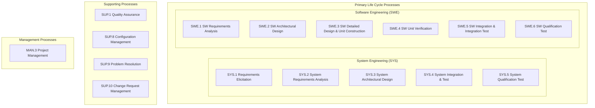
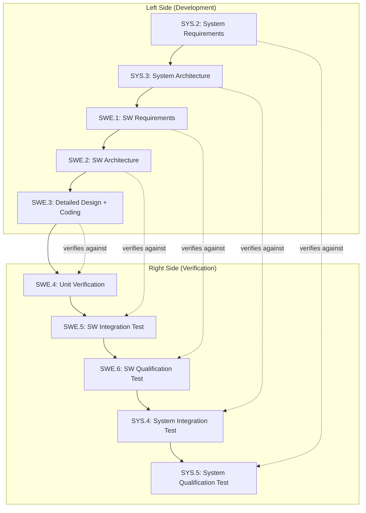
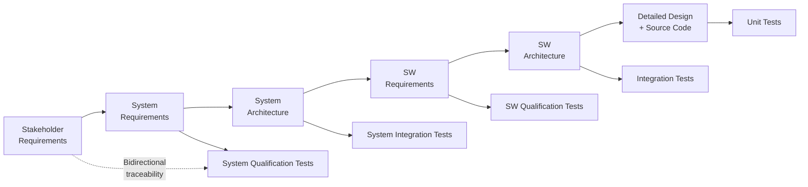
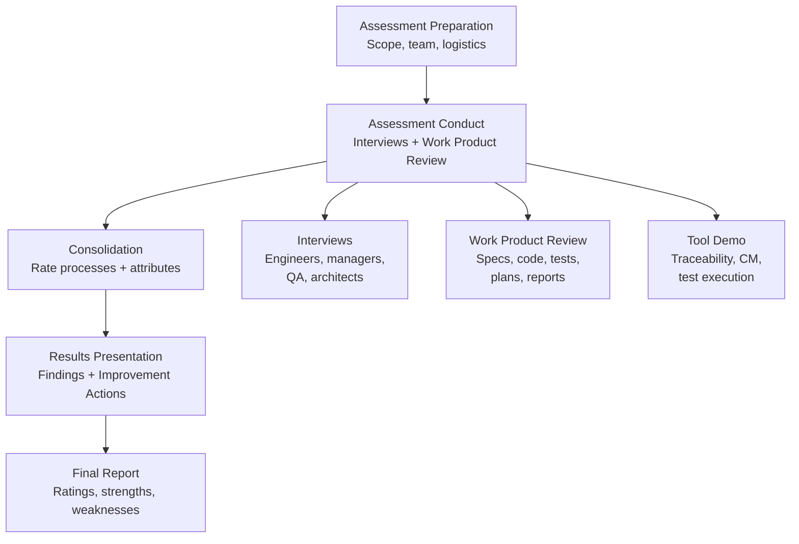
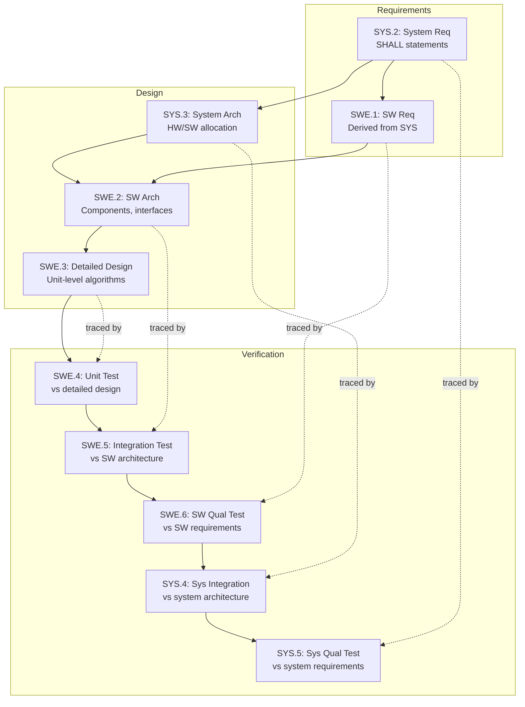
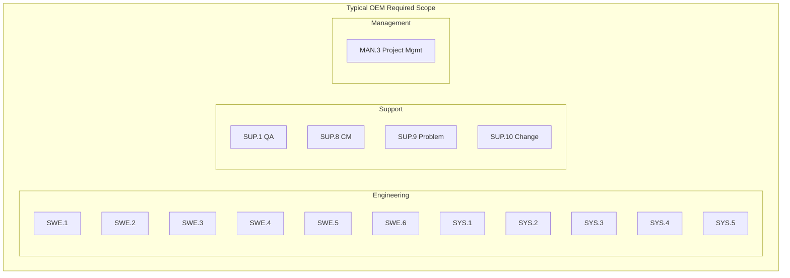
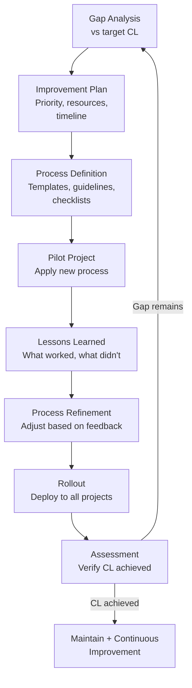

# Automotive SPICE (ASPICE) Process Assessment

**Topic:** ASPICE v4.0 — Process Assessment Model for Automotive Software Development  
**Standard:** Automotive SPICE PAM v4.0 (based on ISO/IEC 33020)  
**SDO:** VDA QMC (German Association of the Automotive Industry — Quality Management Center)  
**Audience:** Process engineers, project managers, ASPICE assessors, quality managers, development leads  
**Prerequisites:** Software development lifecycle, ISO/IEC 12207, project management fundamentals

---

## Chapter 1 — Historical Context & Origin Story

### 1.1 The Problem ASPICE Solves

| Issue | Pre-ASPICE Reality |
|-------|-------------------|
| Supplier quality variation | Each supplier had own process maturity — no comparison possible |
| Development transparency | OEM couldn't assess HOW supplier develops SW |
| Defect root cause | Late integration failures traced to process gaps |
| Safety process link | ISO 26262 requires "appropriate process" but doesn't define maturity |
| Multi-tier supply chain | Tier-1 manages Tier-2/3 without common assessment framework |

### 1.2 ASPICE History

| Year | Milestone |
|------|-----------|
| 1993 | ISO/IEC 15504 (SPICE) — generic process assessment |
| 2005 | Automotive SPICE v2.4 — automotive tailoring of SPICE |
| 2010 | ASPICE v2.5 — widely adopted in European automotive |
| 2015 | ASPICE v3.0 — alignment with ISO/IEC 33000 series |
| 2017 | ASPICE v3.1 — process reference model updates |
| 2023 | ASPICE v4.0 — major update (agile support, cybersecurity, ML) |
| 2024 | ASPICE v4.0 published by VDA QMC |

### 1.3 ASPICE vs. CMMI

| Aspect | ASPICE | CMMI |
|--------|--------|------|
| Domain | Automotive-specific | Generic (all industries) |
| Focus | Engineering processes (SWE, SYS) | Organizational maturity |
| Assessment scope | Project-level | Organization-level |
| Maturity model | Capability levels (per process) | Maturity levels (organization) |
| Adoption | Europe/Asia automotive | USA cross-industry |
| Agile support | v4.0 explicitly | CMMI V2.0 |
| Safety link | Direct (ISO 26262 mapping) | Indirect |

---

## Chapter 2 — Standard Architecture & Structure

### 2.1 ASPICE Process Model Structure



### 2.2 Capability Levels (ISO/IEC 33020)

| Level | Name | Description |
|-------|------|-------------|
| CL 0 | Incomplete | Process not implemented or fails to achieve purpose |
| CL 1 | Performed | Process achieves its outcomes (work products exist) |
| CL 2 | Managed | Process is planned, monitored, and adjusted |
| CL 3 | Established | Organization standard process exists, tailored per project |

*(CL 4-5 exist in ISO 33020 but rarely assessed in ASPICE)*

### 2.3 Process Attributes per Level

| Level | Process Attributes |
|-------|-------------------|
| CL 1 | PA 1.1: Process Performance |
| CL 2 | PA 2.1: Performance Management + PA 2.2: Work Product Management |
| CL 3 | PA 3.1: Process Definition + PA 3.2: Process Deployment |

**Attribute Ratings:**

| Rating | Symbol | Meaning |
|--------|--------|---------|
| N (Not achieved) | 0-15% | Attribute barely present |
| P (Partially achieved) | 16-50% | Some evidence but gaps |
| L (Largely achieved) | 51-85% | Systematic with minor weaknesses |
| F (Fully achieved) | 86-100% | Complete and systematic |

**To achieve a Capability Level:** All attributes at that level must be rated L or F, AND all lower-level attributes must be rated F.

---

## Chapter 3 — Technical Deep Dive

### 3.1 SWE Process Group — The V-Model



### 3.2 Key Process Outcomes (SWE Group)

| Process | Key Outcomes |
|---------|-------------|
| **SWE.1** | SW requirements derived from system requirements, categorized, analyzed for correctness, consistency, verifiability |
| **SWE.2** | SW architecture defines components + interfaces, allocates requirements, evaluated for suitability |
| **SWE.3** | Detailed design for each unit, unit implemented conforming to design, coding standards applied |
| **SWE.4** | Units verified against detailed design, regression tested, defects recorded |
| **SWE.5** | SW components integrated per plan, integration tests verify component interaction, consistency checked |
| **SWE.6** | SW qualified against SW requirements, qualification strategy defined, results summarized |

### 3.3 Traceability Requirements



**ASPICE requires bidirectional traceability:**
- Forward: Requirement → Design → Code → Test
- Backward: Test → verifies → Requirement (completeness)
- Horizontal: Same level (e.g., SWE.1 requirement → SWE.6 test case)

### 3.4 Work Products (Key Examples)

| Process | Input Work Products | Output Work Products |
|---------|--------------------|--------------------|
| SWE.1 | System requirements, system architecture | SW requirements specification |
| SWE.2 | SW requirements | SW architectural design |
| SWE.3 | SW architecture | Detailed design, source code |
| SWE.4 | Source code, detailed design | Unit test specification, test results |
| SWE.5 | SW components, SW architecture | Integration test spec, test results |
| SWE.6 | Integrated SW, SW requirements | Qualification test spec, test results |

### 3.5 ASPICE v4.0 Changes (vs. v3.1)

| Change | v3.1 | v4.0 |
|--------|------|------|
| Agile support | Implicit | Explicit (iterative/incremental) |
| Cybersecurity | Not covered | New process group (SEC) |
| Machine Learning | Not covered | New considerations |
| Hardware processes | Separate (HWE) | Integrated approach |
| Process grouping | Fixed | Flexible scoping |
| Work products | Prescriptive names | Outcome-focused |

---

## Chapter 4 — Implementation Guide

### 4.1 Achieving CL 2 (Typical OEM Requirement)

**PA 2.1 — Performance Management:**
| Requirement | Evidence |
|-------------|----------|
| Objectives defined | Project plan with milestones, KPIs |
| Process execution planned | SW development plan, schedule |
| Progress monitored | Status reports, milestone reviews |
| Adjustments made | Issue log, re-planning records |
| Responsibilities defined | RACI matrix, role descriptions |
| Resources identified | Staffing plan, tool list |

**PA 2.2 — Work Product Management:**
| Requirement | Evidence |
|-------------|----------|
| Work products defined | List of deliverables per process |
| Documentation requirements | Templates, content standards |
| Review/approval criteria | Review checklists, approval workflow |
| Work products controlled | CM system (Git, SVN, DOORS) |
| Quality criteria defined | Entry/exit criteria per phase |

### 4.2 Common CL 2 Gaps and Fixes

| Gap | Symptom | Fix |
|-----|---------|-----|
| No traceability | "Where did this requirement come from?" | Requirements management tool (DOORS, Polarion) with trace links |
| Missing reviews | Work products created but never formally reviewed | Establish review process with checklists and documented records |
| No test coverage analysis | "Do our tests cover all requirements?" | Coverage matrix (requirement → test case → result) |
| Informal change management | Changes made without impact analysis | Change request process with impact assessment |
| No consistency check | Requirements contradict each other | Bidirectional traceability + consistency reviews |

### 4.3 Tool Ecosystem

| Purpose | Tools |
|---------|-------|
| Requirements Management | IBM DOORS, Siemens Polarion, Jama Connect, codebeamer |
| Architecture Design | Enterprise Architect, PTC Integrity, Rhapsody |
| Configuration Management | Git + GitLab/GitHub, Subversion, PTC Windchill |
| Test Management | Vector CANoe, LDRA, VectorCAST, TestRail |
| Traceability | ReqIF exchange, tool-to-tool links |
| Process Definition | Stages (method park), ProcessGuide |
| Assessment | intacs assessment tool, ASPICE assessment portal |

---

## Chapter 5 — Certification & Audit

### 5.1 Assessment Types

| Type | Purpose | Assessor |
|------|---------|----------|
| **Full assessment** | Determine capability level (official) | intacs-certified assessor |
| **Supplier assessment** | OEM evaluates supplier | OEM assessor |
| **Self-assessment** | Internal maturity check | Internal (trained) |
| **Gap analysis** | Identify improvement areas | Consultant |
| **Readiness check** | Pre-assessment preparation | Internal/consultant |

### 5.2 Assessment Process



### 5.3 OEM Expectations (Typical)

| OEM | Typical Requirement | Scope |
|-----|--------------------|----|
| VW Group | CL 2 minimum (CL 3 for safety) | SWE.1-6, SYS.1-5, SUP.1/8/9/10, MAN.3 |
| BMW | CL 2 (CL 3 selected processes) | Full scope including HWE |
| Daimler/Mercedes | CL 2 minimum | SWE + SYS + SUP + MAN |
| Stellantis | CL 2 | Core processes |
| Toyota | Equivalent (own assessment model) | Focus on quality outcomes |
| Hyundai/Kia | CL 2 (increasing to CL 3) | Full ASPICE scope |

---

## Chapter 6 — Regional & Domain Variants

### 6.1 ASPICE Adoption by Region

| Region | Adoption Level | Driver |
|--------|---------------|--------|
| Germany | Very high (mandatory for OEM suppliers) | VDA QMC, OEM contracts |
| Europe (rest) | High | EU OEM requirements |
| Japan | Growing | Toyota/Honda adopting |
| Korea | High | Hyundai/Kia requirement |
| China | Growing rapidly | Joint ventures + export requirements |
| USA | Low-moderate | CMMI more common, some ASPICE for EU export |
| India | High for Tier-1 exports | OEM supplier qualification |

### 6.2 ASPICE and Safety (ISO 26262 Mapping)

| ISO 26262 Part | Related ASPICE Process |
|---------------|----------------------|
| Part 2 (Management) | MAN.3, SUP.1, SUP.8 |
| Part 4 (System) | SYS.1-SYS.5 |
| Part 6 (Software) | SWE.1-SWE.6 |
| Part 8 (Supporting) | SUP.8 (CM), SUP.9 (Problem), SUP.10 (Change) |

**Key principle:** ASPICE CL 2 provides the process foundation that ISO 26262 assumes exists. Without disciplined processes (traceability, reviews, testing), safety arguments collapse.

---

## Chapter 7 — Comparison with Other Process Models

| Feature | ASPICE v4.0 | CMMI V2.0 | ISO 9001:2015 | ISO/IEC 12207 |
|---------|-------------|-----------|---------------|---------------|
| Scope | Automotive SW/SYS/HW | Organization-wide | Organization-wide | Software lifecycle |
| Levels | CL 0-3 (process) | ML 1-5 (org) | Certified/not | N/A (reference only) |
| Engineering detail | Very high | Low (practice areas) | Very low | Reference model |
| Assessment rigor | High (intacs rules) | High (SCAMPI) | Audit-based | N/A |
| Agile compatibility | v4.0 explicit | V2.0 supports | Not specific | N/A |
| Safety link | Direct (ISO 26262) | Indirect | None | Referenced by 26262 |
| Cost of assessment | €20-50K | $50-200K | $5-20K | N/A |

---

## Chapter 8 — Mermaid Architecture Diagrams

### 8.1 ASPICE V-Model with Traceability



### 8.2 ASPICE Assessment Scope Visualization



### 8.3 Process Improvement Cycle



---

## Chapter 9 — Case Studies & Failure Analysis

### 9.1 From CL 0 to CL 2 in 18 Months

**Organization:** Indian Tier-1 automotive software supplier (500 engineers)  
**Starting point:** CL 0-1 (ad-hoc development, no formal processes)  
**Target:** CL 2 for German OEM supplier qualification

**Approach:**
1. Gap analysis against target scope (SWE.1-6, SYS.2-5, SUP, MAN.3)
2. Process definition: created organizational standard process library
3. Tool deployment: DOORS (requirements), Git (CM), Jenkins (CI), TestRail (test mgmt)
4. Training: 200+ engineers trained on process compliance
5. Pilot: 2 projects executed with new processes
6. Readiness assessment: identified remaining gaps
7. Full assessment: achieved CL 2

**Key success factors:**
- Executive commitment (CEO-level)
- Dedicated process team (10 engineers full-time)
- Tool automation (reduces manual evidence burden)
- Focus on traceability as connecting thread

### 9.2 Assessment Failure: Missing Bidirectional Traceability

**Scenario:** Supplier assessed at CL 1 despite having comprehensive documentation.

**Root cause:** Forward traceability existed (requirement → design → code) but backward traceability missing (test → requirement coverage matrix). Assessor couldn't confirm all requirements were tested.

**Impact:** OEM delayed project nomination by 6 months until re-assessment.

**Fix:**
- Implemented coverage matrix in DOORS
- Every test case linked to requirement(s) it verifies
- Automated gap detection (requirements without test cases)
- Monthly traceability health dashboard

---

## Chapter 10 — Future Evolution & Industry Trends

### 10.1 ASPICE v4.0 and Beyond

| Evolution | Description |
|-----------|-------------|
| Agile/DevOps | Explicit guidance for iterative development, continuous integration |
| Cybersecurity | SEC process group (aligned with ISO/SAE 21434) |
| Machine Learning | Considerations for data-driven development |
| Hardware (HWE) | Integrated HW engineering processes |
| Continuous assessment | Moving from point-in-time to continuous compliance |
| Tool automation | More automated evidence collection and assessment support |

### 10.2 Industry Trends

| Trend | ASPICE Impact |
|-------|---------------|
| CI/CD pipelines | Process evidence auto-generated from pipeline |
| Model-Based Development | Work products = models (not documents) |
| Supplier consolidation | Fewer suppliers, higher CL expectations |
| Global sourcing | Remote assessments, digital evidence packages |
| AI-assisted development | Process definition for AI-in-the-loop |

---

## Chapter 11 — Interview Questions & Career Guide

### Tier 1: Entry-Level (0-3 years)

**Q1:** What is ASPICE and why do automotive companies require it?  
**A:** ASPICE (Automotive SPICE) is a process assessment model that evaluates HOW software is developed. It measures process maturity on a scale of CL 0-3. OEMs require it because: (1) Quality prediction — disciplined processes produce predictable quality. (2) Supplier comparison — common scale to compare Tier-1 suppliers. (3) Risk reduction — process gaps lead to late integration failures, recalls. (4) Safety foundation — ISO 26262 assumes competent processes; ASPICE demonstrates this. (5) Contract requirement — German OEMs (VW, BMW, Mercedes) mandate CL 2 minimum for supplier nomination. It focuses on engineering processes (SWE.1-6 for software, SYS.1-5 for system) plus supporting processes (QA, CM, problem/change management) and project management.

**Q2:** What does bidirectional traceability mean in ASPICE?  
**A:** Bidirectional traceability means every requirement can be traced: (1) **Forward** — from requirement → to design element → to code → to test case. Shows HOW requirement is implemented and verified. (2) **Backward** — from test case → back to requirement(s) it verifies. Shows WHAT each test proves. Also: from code → back to design → back to requirement. Shows WHY code exists. Benefits: completeness checking (every requirement has tests), impact analysis (if requirement changes → know which code/tests affected), coverage analysis (all requirements tested). Tools: DOORS, Polarion, Jama with linking capability.

### Tier 2: Mid-Level (3-8 years)

**Q3:** Your project is at CL 1. The OEM demands CL 2 within 12 months. What's your improvement plan?  
**A:** Structured approach: (1) **Gap analysis (Month 1-2):** Assess current state against CL 2 requirements. Key gaps typically: no formal planning (PA 2.1), work products not managed (PA 2.2), missing reviews, incomplete traceability. (2) **Process definition (Month 2-4):** Define organizational standard process: templates for each work product (SRS, SAD, SDD, test spec), review checklists, planning templates. Define entry/exit criteria per phase. (3) **Tool setup (Month 3-5):** Requirements tool (bidirectional tracing), CM tool (branching strategy, baseline management), test management (linked to requirements), CI/CD (automated build + unit test). (4) **Training (Month 3-5):** Engineers: how to write traceable requirements, how to conduct reviews, how to document test results. Managers: how to plan/monitor/adjust. (5) **Pilot execution (Month 5-9):** Apply to real project. Collect all evidence. Weekly process compliance checks. (6) **Readiness check (Month 9-10):** Internal assessment by trained assessor. Fix identified gaps. (7) **Assessment (Month 11-12):** External intacs assessor. Key risks: tool adoption resistance (training + coaching), evidence retrofit (don't start from scratch — improve running projects).

### Tier 3: Senior/Lead (8-15 years)

**Q4:** How do you reconcile agile development (Scrum/SAFe) with ASPICE process requirements?  
**A:** Common misconception: ASPICE requires waterfall. Truth: ASPICE is model-neutral — it cares about OUTCOMES, not sequence. Reconciliation: (1) **Iterative work products:** ASPICE says "SW requirements exist and are traced." Doesn't say they must be complete before coding starts. In agile: requirements evolve per sprint/increment, but traceability maintained at all times. (2) **Continuous verification:** Each sprint produces tested, integrated increment. Maps to SWE.4-5 (unit/integration test) executed every sprint, not just at end. (3) **Architecture:** SWE.2 (architecture) still needed upfront. Agile ≠ no design. Initial architecture sprint(s) → then incremental refinement. Architectural decisions documented. (4) **Reviews:** In agile = sprint reviews + peer reviews within sprint. ASPICE doesn't mandate formal document review meetings — recorded review findings suffice. (5) **Planning (PA 2.1):** Agile planning = release plan + sprint planning. Velocity tracking = monitoring. Sprint retrospective = adjustment. All map to PA 2.1 outcomes. (6) **Evidence:** Automate: CI/CD generates test evidence. Tools link stories → code → tests. Sprint board is the plan. Build on toolchain that generates ASPICE evidence as byproduct of agile workflow.

### Tier 4: Principal/Distinguished (15+ years)

**Q5:** Design an organizational ASPICE strategy for a company with 2000 engineers across 50 projects, targeting CL 3.  
**A:** CL 3 requires organizational standard process (PA 3.1) deployed and tailored per project (PA 3.2). Strategy: (1) **Organization standard process (OSP):** Define company-wide process library: process descriptions (who, what, when, how), work product templates, guidelines, checklists. Cover all ASPICE scope processes. Maintain in process management tool (Stages, Confluence). Assign process owner per process area. (2) **Tailoring framework:** Not every project is the same. Define tailoring criteria: safety level (ASIL), project size, technology, customer requirements. Tailoring guidelines: what can be adapted (detail level) vs. what's mandatory (traceability, reviews). Document tailoring rationale per project. (3) **Deployment infrastructure:** Training curriculum (role-based: engineer, architect, manager, QA). Coaching support for first application. Process audit program (quarterly internal audits). Metrics dashboard: process compliance, defect density, review effectiveness. (4) **Tool standardization:** Mandate tool chain: requirements (one tool), CM (one strategy), CI/CD (one pipeline template), test management (one system). Tool configuration = part of OSP (everyone uses same branching model, same review workflow). (5) **Governance:** Process improvement board (PIB): reviews metrics, approves process changes. Lesson-learned integration: field defects → root cause → process improvement. Annual process update cycle. (6) **Rollout:** Wave approach: pilot projects (5) → second wave (15) → full rollout. Each wave provides feedback to refine OSP. (7) **Assessment strategy:** Internal assessments annually. External assessment for customer-facing projects. Maintain intacs-certified assessors in-house (3-5 people).

---

## Chapter 12 — Cheat Sheet & Quick Reference

### ASPICE Quick Assessment Guide

| CL | Key Question | Evidence |
|----|-------------|----------|
| CL 1 | "Do outcomes exist?" | Work products present and meet purpose |
| CL 2 | "Is it planned and managed?" | Plans, monitoring, reviews, CM, traceability |
| CL 3 | "Is it defined and deployed from org standard?" | Org standard process, tailoring guidelines, deployment records |

### Process Scope Quick Reference

```
Engineering (must have):
  SWE.1 → SW Requirements Analysis
  SWE.2 → SW Architectural Design  
  SWE.3 → SW Detailed Design & Unit Construction
  SWE.4 → SW Unit Verification
  SWE.5 → SW Integration & Integration Test
  SWE.6 → SW Qualification Test
  SYS.2 → System Requirements Analysis
  SYS.3 → System Architectural Design
  SYS.4 → System Integration & Integration Test
  SYS.5 → System Qualification Test

Supporting (must have):
  SUP.1  → Quality Assurance
  SUP.8  → Configuration Management
  SUP.9  → Problem Resolution Management
  SUP.10 → Change Request Management

Management:
  MAN.3 → Project Management
```

### Rating Scale

```
F (Fully)    = 86-100% → Process attribute fully achieved
L (Largely)  = 51-85%  → Systematic approach, minor gaps
P (Partially)= 16-50%  → Some evidence, significant gaps
N (Not)      = 0-15%   → Little/no evidence
```

### CL Achievement Rules

```
CL 1: PA 1.1 ≥ L
CL 2: PA 1.1 = F, PA 2.1 ≥ L, PA 2.2 ≥ L
CL 3: PA 1.1 = F, PA 2.1 = F, PA 2.2 = F, PA 3.1 ≥ L, PA 3.2 ≥ L
```

---

*End of Document — 03_ASPICE_Process_Assessment.md*
