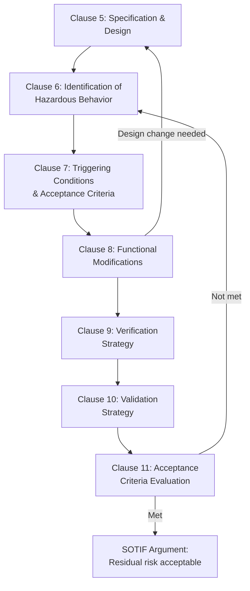
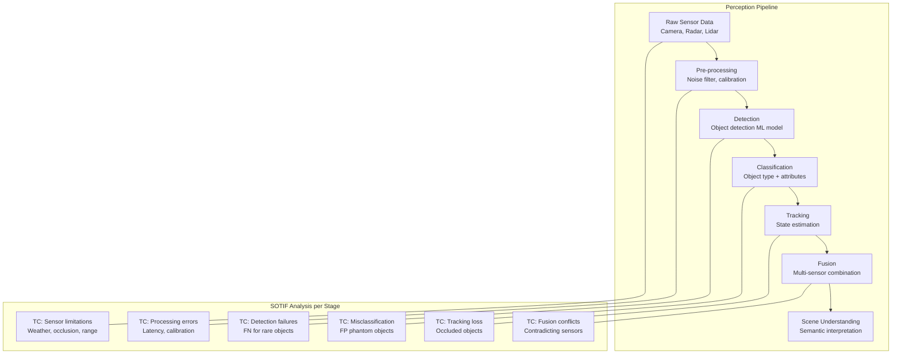
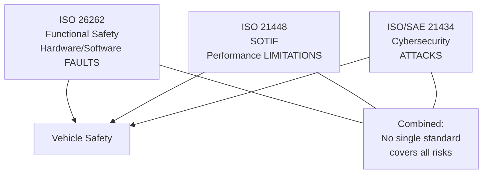
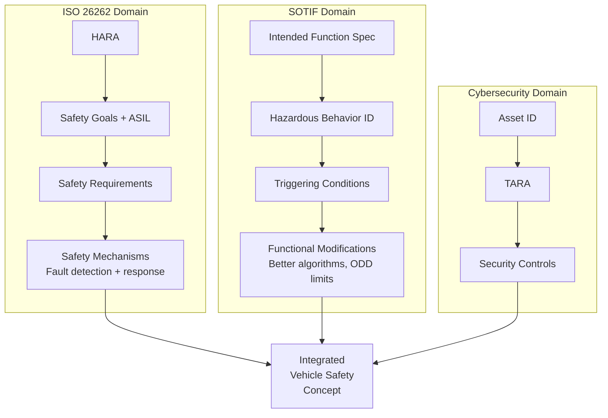
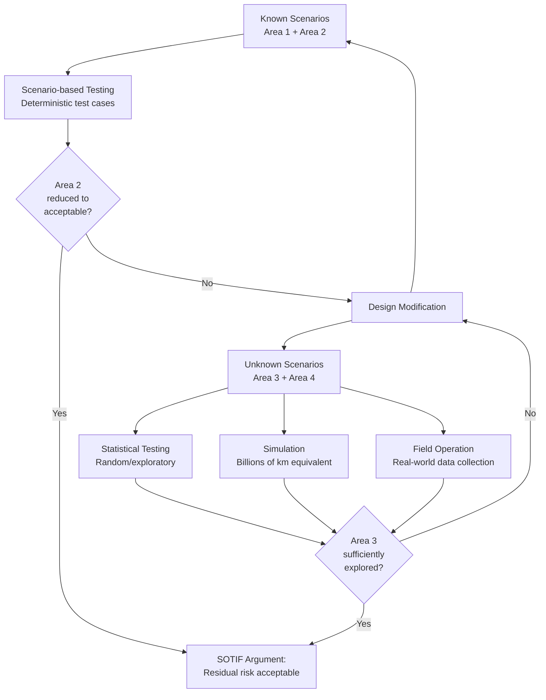
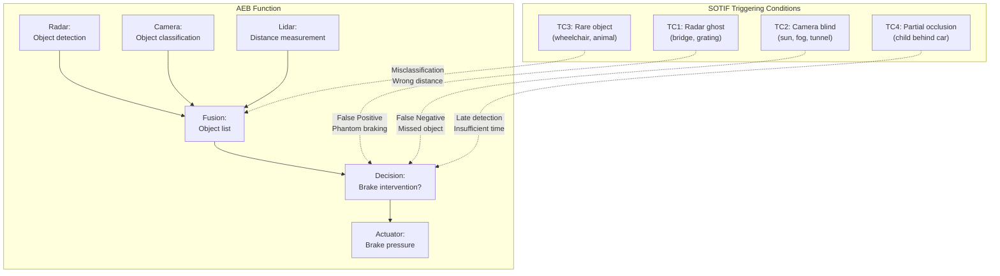

# ISO 21448 — Safety of the Intended Functionality (SOTIF)

**Topic:** SOTIF — Addressing Safety Risks from Performance Limitations and Misuse  
**Standard:** ISO 21448:2022 (Road vehicles — Safety of the intended functionality)  
**SDO:** ISO TC 22/SC 32 (Road vehicles — Electrical and electronic components)  
**Audience:** ADAS/AD engineers, safety engineers, perception system designers, validation engineers  
**Prerequisites:** ISO 26262 functional safety, ADAS sensor technology, machine learning basics

---

## Chapter 1 — Historical Context & Origin Story

### 1.1 The Gap SOTIF Fills

**ISO 26262 assumption:** The system design is correct. Failures come from random hardware faults or systematic design errors (bugs).

**SOTIF problem:** The system works as designed, but the design itself has limitations that can lead to hazardous behavior.

| Scenario | ISO 26262 | SOTIF |
|----------|-----------|-------|
| Brake ECU hardware fault | ✓ Covered | Not SOTIF scope |
| Software bug in AEB algorithm | ✓ Covered (systematic) | Not primary SOTIF scope |
| Camera blinded by low sun → AEB doesn't trigger | ✗ Not a "fault" | ✓ SOTIF covers this |
| Radar ghost object → phantom braking | ✗ Working as designed | ✓ SOTIF covers this |
| Driver misunderstands ADAS capability | ✗ Not E/E failure | ✓ SOTIF covers this |

### 1.2 Key Incidents Driving SOTIF

| Year | Incident | SOTIF Relevance |
|------|----------|----------------|
| 2016 | Tesla Autopilot — white truck not detected (Florida) | Sensor limitation (camera vs. sky background) |
| 2018 | Uber ATG — pedestrian with bicycle not classified | Perception algorithm limitation |
| 2019 | Tesla Autopilot — barrier strike, misleading lane marks | Insufficient performance in edge case |
| 2020+ | Multiple phantom braking events (Tesla, various OEMs) | Sensor misinterpretation (radar reflections) |

### 1.3 Standard Development Timeline

| Year | Milestone |
|------|-----------|
| 2017 | ISO/PAS 21448:2019 (Publicly Available Specification — draft) |
| 2019 | PAS published — early industry adoption |
| 2022 | ISO 21448:2022 — full International Standard |
| 2024+ | Under revision — expanding scope to higher automation levels |

---

## Chapter 2 — Standard Architecture & Structure

### 2.1 SOTIF Four-Area Model

```mermaid
quadrantChart
    title SOTIF Scenario Classification
    x-axis "Known Scenarios" --> "Unknown Scenarios"
    y-axis "Safe Scenarios" --> "Hazardous Scenarios"
    quadrant-1 Area 3: Unknown Unsafe
    quadrant-2 Area 2: Known Unsafe
    quadrant-3 Area 1: Known Safe
    quadrant-4 Area 4: Unknown Safe
```

| Area | Known/Unknown | Safe/Unsafe | Action |
|------|--------------|-------------|--------|
| Area 1 | Known | Safe | No action needed (normal operation) |
| Area 2 | Known | Unsafe | Must be addressed (design change or accept with argument) |
| Area 3 | Unknown | Unsafe | Must be minimized to acceptable residual risk |
| Area 4 | Unknown | Safe | Will be discovered during validation — no concern |

**SOTIF goal:** Reduce Area 2 and Area 3 until residual risk is acceptable.

### 2.2 SOTIF Process Overview



### 2.3 ISO 21448 Clause Structure

| Clause | Title | Purpose |
|--------|-------|---------|
| 1-4 | Scope, References, Terms, General | Framework |
| 5 | Specification and Design | Define intended functionality, known limitations |
| 6 | Identification of Hazardous Behavior | Systematic analysis of how function can become hazardous |
| 7 | Triggering Conditions and Acceptance Criteria | What triggers hazardous behavior, when is it acceptable |
| 8 | Functional Modifications | Design changes to address identified risks |
| 9 | Verification | Verify modifications work |
| 10 | Validation | System-level validation that SOTIF risk is acceptable |
| 11 | Assessment of Residual Risk | Evaluate whether acceptance criteria are met |

---

## Chapter 3 — Technical Deep Dive

### 3.1 Triggering Conditions (TC)

A **triggering condition** is a specific condition (or combination) that triggers a hazardous behavior when the system operates as designed.

**Categories of triggering conditions:**

| Category | Examples |
|----------|---------|
| **Environmental** | Sun glare, fog, rain, snow, tunnel entry/exit |
| **Infrastructure** | Worn lane markings, construction zones, unusual road geometry |
| **Traffic participants** | Unusual objects (wheelchair, animal), occluded pedestrian |
| **System/sensor** | Sensor degradation, calibration drift, timing issues |
| **Human (misuse)** | Over-reliance, drowsy, hands off too long |

### 3.2 Functional Insufficiencies

| Type | Description | Example |
|------|-------------|---------|
| Sensor limitation | Physical limitation of sensing technology | Radar cannot detect stationary objects at some angles |
| Algorithm limitation | Classification/detection algorithm inadequacy | ML model not trained on rare object types |
| Specification insufficiency | Intended function specification has gaps | Speed limit sign recognition doesn't handle electronic signs |
| Actuator limitation | Actuator cannot execute needed action | Steering authority limited at high speed |

### 3.3 SOTIF Analysis for Perception Systems



### 3.4 Acceptance Criteria

**Two fundamental metrics:**

$$P(hazardous\_behavior) < Target\_probability$$

**Approach to setting targets:**

| Method | Description |
|--------|-------------|
| Positive risk balance | System must be at least as safe as without it (not make things worse) |
| Comparison with human driver | System should be X times safer than average human |
| Absolute target | Specific probability per operating hour/km |
| ALARP | As Low As Reasonably Practicable for given technology |

### 3.5 SOTIF-Related Analysis Methods

| Method | Purpose in SOTIF |
|--------|-----------------|
| STPA | Identify unsafe control actions from performance limitations |
| HAZOP | Systematic deviation analysis ("less detection," "late detection") |
| Scenario-based analysis | Define triggering condition scenarios |
| Simulation | Evaluate system in triggering condition scenarios at scale |
| Statistical testing | Demonstrate probability of hazardous behavior is below target |
| Operational monitoring | Collect real-world data on triggering condition encounters |

---

## Chapter 4 — Implementation Guide

### 4.1 SOTIF Process Steps

**Step 1 — Define Intended Functionality:**
- Function purpose and operating conditions
- Known limitations (stated in specification)
- Operational Design Domain (ODD)

**Step 2 — Identify Potential Hazardous Behaviors:**
- What wrong outputs can the function produce?
- What is the vehicle-level consequence?
- Link to ISO 26262 HARA (same hazard identification)

**Step 3 — Identify Triggering Conditions:**
- Systematic analysis of what causes hazardous behavior
- Use STPA, HAZOP, expert brainstorming, field data
- Document in triggering condition catalog

**Step 4 — Define Acceptance Criteria:**
- Target probability for each hazardous behavior
- Method for demonstrating compliance (testing, analysis, simulation)

**Step 5 — Design Measures:**
- Sensor redundancy/diversity
- Algorithm improvement
- ODD restriction
- Warning/degradation strategy
- Driver monitoring

**Step 6 — Verification & Validation:**
- Verify each measure addresses its triggering condition
- Validate at system level (real-world + simulation)
- Demonstrate acceptance criteria met

### 4.2 Triggering Condition Catalog Template

| TC ID | Category | Description | Severity | Likelihood | Current Mitigation | Residual Risk |
|-------|----------|-------------|----------|------------|-------------------|---------------|
| TC-001 | Environmental | Low sun directly into front camera | High | Medium | Auto-exposure + radar backup | Acceptable (radar covers) |
| TC-002 | Infrastructure | Faded lane markings | Medium | High | Map-based lane prediction | Needs improvement |
| TC-003 | Object | Pedestrian partially occluded by parked car | High | Medium | Radar + lidar detection | Under analysis |

### 4.3 ODD (Operational Design Domain) Definition

| Parameter | Example Specification |
|-----------|----------------------|
| Road type | Highway, divided, ≥2 lanes per direction |
| Speed range | 0-130 km/h |
| Weather | Clear, light rain (not heavy fog, snow) |
| Lighting | Day, night with road lighting |
| Geography | Mapped highways (HD map available) |
| Traffic | Normal density (not emergency vehicles, construction) |
| Infrastructure | Lane markings present, no intersections |

---

## Chapter 5 — Certification & Audit

### 5.1 SOTIF and Type Approval

| Regulation | SOTIF Role |
|-----------|------------|
| UNECE R157 (ALKS) | SOTIF analysis required for Level 3 approval |
| UNECE R79 (Steering) | ADAS steering functions need SOTIF consideration |
| EU General Safety Reg | AEB, ISA functions implicitly need SOTIF |
| China GB/T | Similar SOTIF-equivalent requirements developing |

### 5.2 SOTIF Evidence Package

| Evidence | Purpose |
|----------|---------|
| Triggering condition catalog | Shows systematic analysis performed |
| Acceptance criteria and rationale | Defines safety targets |
| Simulation coverage report | Shows TC scenarios tested |
| Real-world test results | Validates in actual conditions |
| Residual risk assessment | Documents remaining risk is acceptable |
| Design measures documentation | How each TC is addressed |

---

## Chapter 6 — Regional & Domain Variants

### 6.1 SOTIF Scope by Automation Level

| SAE Level | SOTIF Applicability |
|-----------|-------------------|
| L0 (No automation) | Generally not applicable |
| L1 (Driver assistance) | Applicable (e.g., AEB, ACC) |
| L2 (Partial automation) | Strongly applicable (driver as fallback) |
| L3 (Conditional automation) | Critical (system is responsible in ODD) |
| L4/L5 (High/Full) | Essential (no driver fallback in ODD) |

### 6.2 Relationship with Other Standards



---

## Chapter 7 — Comparison: SOTIF vs. ISO 26262

| Aspect | ISO 26262 | ISO 21448 (SOTIF) |
|--------|-----------|-------------------|
| Risk source | Hardware failures + software bugs | Performance limitations + misuse |
| System state | Malfunctioning | Functioning as designed |
| Analysis focus | Failure modes (FMEA/FTA) | Triggering conditions |
| Risk metric | ASIL (S, E, C) | Probability of hazardous behavior |
| Mitigation | Safety mechanisms, redundancy | Design improvement, ODD restriction |
| Validation approach | Fault injection testing | Scenario-based testing, simulation |
| Scope | E/E systems | Functions with environmental dependency |
| When applied | All safety-relevant E/E | Primarily ADAS/AD features |

---

## Chapter 8 — Mermaid Architecture Diagrams

### 8.1 SOTIF and ISO 26262 Combined Analysis



### 8.2 SOTIF Validation Strategy



### 8.3 AEB SOTIF Example



---

## Chapter 9 — Case Studies & Failure Analysis

### 9.1 Phantom Braking on Highway

**Function:** Forward Collision Warning + AEB (Level 1/2)  
**Triggering condition:** Metal bridge/overpass with specific radar cross-section creates radar return interpreted as stationary object in lane.

**Analysis:**
- Radar alone: cannot distinguish bridge from vehicle (similar RCS)
- Camera alone: should recognize bridge as non-threat (over road)
- Fusion: camera confidence was low (shadow/glare) → radar weight increased → phantom brake

**SOTIF measures:**
1. Camera-based bridge/sign classification (ML model trained on overhead objects)
2. Map-based filter (known overpasses excluded from stationary object list)
3. Radar processing: height estimation (2D radar → limited), filter objects above road plane
4. Reduced brake authority for uncertain classifications (warn only, not full brake)

### 9.2 Missed Pedestrian Detection in Dark Clothing at Night

**Function:** AEB pedestrian  
**Triggering condition:** Pedestrian wearing dark clothing, crossing at night, no street lighting, camera-only detection.

**Analysis:**
- Camera limited in low-light conditions (noise, low contrast)
- ML model performs significantly worse for dark-clothed pedestrians at night
- No redundant detection (radar cross-section of pedestrian is small and variable)

**SOTIF measures:**
1. Lidar integration (active sensing, independent of ambient light)
2. Improved camera (HDR, larger sensor) + night-optimized ML model
3. Thermal camera (far-infrared — detects body heat regardless of clothing)
4. ODD restriction: "AEB pedestrian performance reduced at night" disclosed to user
5. Acceptance: combination of measures brings probability below target

---

## Chapter 10 — Future Evolution & Industry Trends

### 10.1 SOTIF for Higher Automation (L3-L5)

| Challenge | Current State | Future Need |
|-----------|--------------|-------------|
| Unknown unknowns (Area 3) | Simulation + testing | Proof of sufficient exploration |
| Acceptance criteria | No consensus on target | Industry-agreed safety targets |
| ML model behavior | Opaque | Explainable AI + formal guarantees |
| ODD definition | Manual specification | Dynamic ODD assessment |
| Continuous learning | Not addressed | Post-deployment model updates |
| Scenario coverage | Million km testing | Billion km equivalent needed |

### 10.2 Emerging Methods

| Method | Application |
|--------|-------------|
| Scenario-based testing (ASAM OpenSCENARIO) | Standardized scenario description for simulation |
| Digital twin validation | Virtual representation of real-world complexity |
| Formal verification of perception | Mathematical bounds on detection performance |
| Online SOTIF monitoring | Runtime check that system operates within validated envelope |
| Crowdsourced edge cases | Fleet data collection of triggering condition encounters |

---

## Chapter 11 — Interview Questions & Career Guide

### Tier 1: Entry-Level (0-3 years)

**Q1:** What is SOTIF and how does it differ from ISO 26262?  
**A:** SOTIF (ISO 21448) addresses safety risks that arise when a system works correctly as designed but has performance limitations that can lead to hazardous behavior. ISO 26262 covers failures (hardware faults, software bugs). SOTIF covers: system designed correctly, but real-world conditions exceed its capabilities. Example: AEB camera blinded by sun → doesn't detect obstacle → crash. The camera didn't "fail" — it operated within its physical limitations. ISO 26262 wouldn't catch this because there's no "fault." SOTIF provides a framework to: identify triggering conditions, analyze their probability and severity, design measures to reduce risk, validate that residual risk is acceptable.

**Q2:** What is a triggering condition?  
**A:** A triggering condition (TC) is a specific condition or combination of conditions in the environment, the system, or user behavior that can cause the intended functionality to produce a hazardous output — even though the system is not malfunctioning. Examples: (1) Environmental: heavy fog reducing camera visibility to <30m. (2) Infrastructure: worn lane markings confusing lane keeping assist. (3) Object: unusual vehicle shape (oversized load) not in training data. (4) Human: driver removes hands during curve (misuse of L2). TCs are analyzed systematically, cataloged, and either addressed through design changes or accepted with justified residual risk argument.

### Tier 2: Mid-Level (3-8 years)

**Q3:** Design a SOTIF analysis approach for a Level 2 lane keeping assist system.  
**A:** (1) **Intended functionality:** Maintain vehicle within lane on highways. Inputs: camera (lane markings), steering angle sensor, vehicle speed. Output: steering torque overlay. (2) **Hazardous behaviors:** H1 — system steers into adjacent lane (false lane detection). H2 — system fails to keep lane in curve (late detection). H3 — system fights driver steering input (wrong lane interpretation). (3) **Triggering condition identification:** Use STPA + HAZOP + field data analysis. Categories: Environmental (rain reducing camera visibility, sun glare on wet road), Infrastructure (construction zones with contradicting markings, tunnels with no markings), Traffic (adjacent vehicle partially in lane, motorcycle lane-splitting). (4) **Acceptance criteria:** Probability of H1 < 10⁻⁸ per operating hour (equivalent to ISO 26262 ASIL B hazard rate). Positive risk balance vs. unassisted driving. (5) **Design measures:** Multi-sensor (camera + map for lane position prediction during dropout). Confidence-based: if lane detection confidence < threshold → graceful degradation (warn driver, reduce steering authority). ODD limits: "Works on highways with visible markings, not in construction zones." (6) **Validation:** 10,000+ km real-world driving in triggering conditions. 1M+ km simulation with injected TC scenarios. Fleet data analysis (disengagement rate, steering override frequency).

### Tier 3: Senior/Lead (8-15 years)

**Q4:** How do you demonstrate that Area 3 (unknown unsafe scenarios) is sufficiently small for regulatory acceptance?  
**A:** Fundamental challenge: you can't enumerate what you don't know. Approaches: (1) **Systematic exploration:** Use diverse methods to convert Area 3 → Area 1/2: expert brainstorming across domains (road, weather, traffic, sensor physics), accident database analysis (what scenarios caused crashes historically), adversarial testing (red team tries to find failures), field data collection (edge cases from large fleet), simulation with scenario variation (parameter sweeps). (2) **Statistical argument:** After extensive testing (real + simulation), no new safety-critical TC found in last N million km → statistical confidence that residual Area 3 frequency is below threshold. Use: Sequential Probability Ratio Test or Bayesian inference. (3) **Structural coverage argument:** Argue that all "dimensions" of the scenario space have been explored: all weather conditions, all lighting conditions, all road types, all object categories, all speed ranges. If each dimension sampled → combinations (Area 3) are bounded. (4) **Operational monitoring:** Commit to post-deployment monitoring. If new TC discovered in field → process to address it (update, ODD restriction, recall if needed). Safety case: "Area 3 is small based on evidence, and continuous monitoring catches remaining cases." (5) **Combined argument:** No single method is sufficient. Combine: systematic analysis + statistical testing + simulation coverage + operational monitoring = multi-layered confidence argument. This is the state of art — no silver bullet exists yet.

### Tier 4: Principal/Distinguished (15+ years)

**Q5:** How should SOTIF evolve for Level 4 systems without driver fallback?  
**A:** Fundamental shift from L2 (driver as safety net) to L4 (system must handle ALL scenarios within ODD): (1) **ODD as safety contract:** ODD boundary is the safety-critical specification. System MUST detect when ODD is exceeded and achieve Minimal Risk Condition (MRC) autonomously. SOTIF must cover: What triggers ODD exit? How quickly detected? What's the MRC? Can system always reach MRC? (2) **Perception sufficiency:** Cannot rely on "driver will notice camera is blinded." Need: quantitative perception requirements (detection probability per object class per range per condition), verified across entire ODD. Formal: P(detect pedestrian at 50m in ODD) > 99.9% with specific confidence. (3) **Scenario combinatorics:** L4 ODD may still contain billions of scenario combinations. Need: automated scenario generation (search-based testing), importance sampling (focus on dangerous scenarios), formal methods for perception boundaries, adaptive testing (learn from failures). (4) **Continuous safety argument:** Fleet learning: every vehicle contributes data. Statistical safety improves with fleet-km. Safety case is living document: updated with new data, new TCs, new mitigations. Regulatory model: periodic safety report (like pharmaceutical post-market surveillance). (5) **Technology requirements:** Diverse sensor suite mandatory (no single-sensor L4): camera + radar + lidar + HD map + V2X. Each sensor covers others' blind spots. Quantitative fusion confidence. (6) **Industry challenge:** No consensus yet on "how safe is safe enough" for L4. SOTIF acceptance criteria will ultimately be set by regulators based on societal risk acceptance, not just engineering analysis. Need: industry pre-competitive collaboration on safety targets and validation methods.

---

## Chapter 12 — Cheat Sheet & Quick Reference

### SOTIF Four Areas Summary

```
Area 1: Known + Safe → No action (normal operation)
Area 2: Known + Unsafe → Fix or accept with argument
Area 3: Unknown + Unsafe → Reduce through exploration + testing
Area 4: Unknown + Safe → Benign (discovered naturally)

Goal: Area 2 → resolved, Area 3 → minimized to acceptable residual risk
```

### SOTIF vs. ISO 26262 Decision

```
System malfunctions (HW fault, SW bug)? → ISO 26262
System works as designed but has limitations? → ISO 21448 (SOTIF)
System attacked by external threat? → ISO/SAE 21434
All three contribute to vehicle-level safety
```

### Triggering Condition Analysis Checklist

```
□ Environmental: Weather (rain, fog, snow, ice, sun)
□ Environmental: Lighting (day, night, tunnel, glare)
□ Infrastructure: Road markings (absent, worn, contradicting)
□ Infrastructure: Road geometry (curve, hill, intersection)
□ Infrastructure: Construction zones, temporary signs
□ Objects: Unusual shapes (oversized, low-profile)
□ Objects: Rare types (animal, wheelchair, debris)
□ Objects: Occluded (behind parked car, pillars)
□ Sensor: Degradation (dirty lens, ice on radar)
□ Sensor: Physical limits (range, FOV, resolution)
□ Human: Misuse (over-reliance, inattention, wrong mode)
□ Human: Misunderstanding system capability
```

### Key SOTIF Metrics

| Metric | Description |
|--------|-------------|
| TC detection rate | % of TC scenarios correctly handled |
| False positive rate | Unnecessary interventions per 1000 km |
| False negative rate | Missed detections per 1000 km |
| Disengagement rate | Driver overrides per 1000 km |
| Time to detection | Latency from TC onset to system response |

---

*End of Document — 04_ISO_21448_SOTIF.md*
