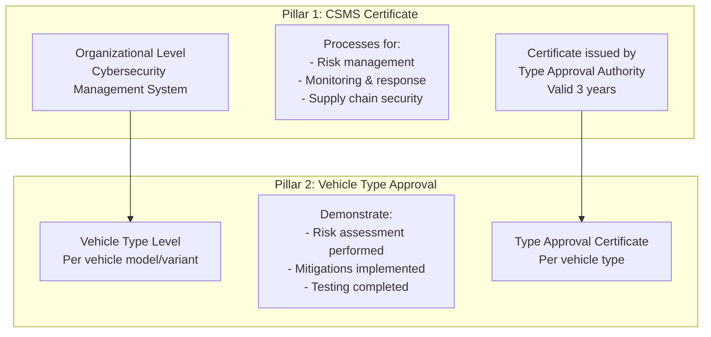
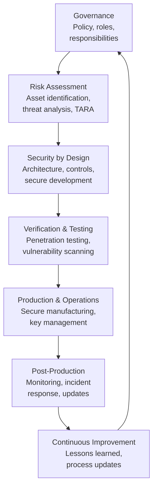
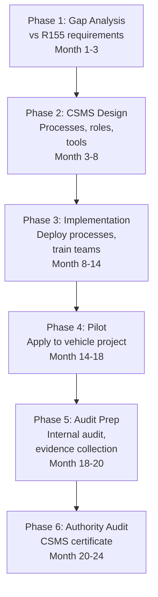
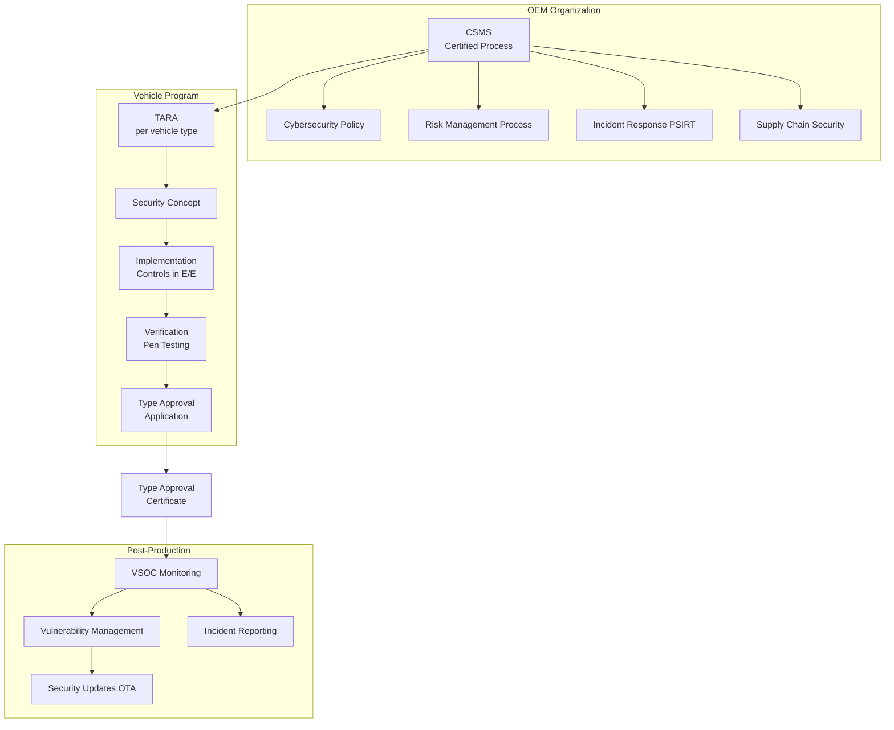
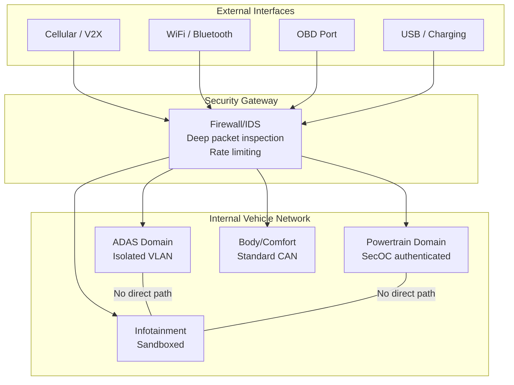
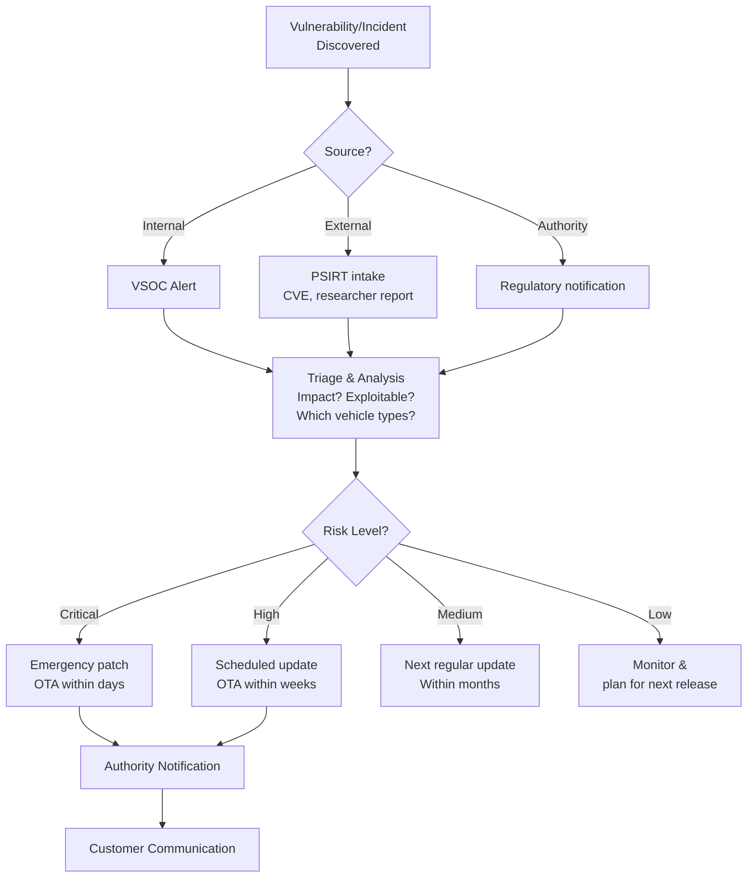

# UNECE R155 — Vehicle Cybersecurity Type Approval

**Topic:** UNECE Regulation No. 155 — Cybersecurity Management System and Vehicle Type Approval  
**Standard:** UNECE R155 (UN Regulation concerning the approval of vehicles with regards to cyber security and CSMS)  
**SDO:** UNECE WP.29 / GRVA (Working Party on Automated/Connected Vehicles)  
**Audience:** Cybersecurity managers, vehicle type approval engineers, OEM compliance teams, Tier-1 security architects  
**Prerequisites:** ISO/SAE 21434 basics, vehicle E/E architecture, automotive development processes

---

## Chapter 1 — Historical Context & Origin Story

### 1.1 The Cybersecurity Imperative

| Year | Event | Impact |
|------|-------|--------|
| 2010 | UC San Diego — CAN bus injection via OBD | Demonstrated physical access vulnerability |
| 2014 | BMW ConnectedDrive hacked (ADAC) | Remote unlock via cellular interface |
| 2015 | Jeep Cherokee remote hack (Miller/Valasek) | Remote control of steering/braking via Uconnect |
| 2016 | Tesla remotely hacked (Keen Security Lab) | CAN injection via web browser vulnerability |
| 2017 | WannaCry ransomware disrupts production | Automotive supply chain cybersecurity awareness |
| 2019 | Upstream Auto reports: 150% YoY increase in incidents | Regulatory urgency established |

### 1.2 Regulatory Response

| Date | Milestone |
|------|-----------|
| 2016 | UNECE WP.29 task force on cybersecurity established |
| 2018 | Draft recommendations published |
| 2020 | UNECE R155 adopted (June) |
| 2021 | R155 enters force (January) |
| 2022 | Mandatory for new vehicle types (EU, Japan, Korea) — July |
| 2024 | Mandatory for ALL new vehicles sold (EU) — July |
| 2025+ | Under revision for expanding scope |

### 1.3 Scope of Application

**Applies to:** Categories M (passenger), N (goods), O (trailers with at least one ECU)

**Contracting parties enforcing R155:**
- European Union (all 27 member states)
- Japan
- Republic of Korea
- United Kingdom (post-Brexit adoption)
- Additional UNECE 1958 Agreement parties

---

## Chapter 2 — Standard Architecture & Structure

### 2.1 R155 Two-Pillar Structure



### 2.2 CSMS Requirements (Annex 1 of R155)

| Requirement Area | Key Requirements |
|-----------------|-----------------|
| **Risk management** | Identify threats, assess risks, implement mitigations |
| **Vehicle design security** | Secure development lifecycle for E/E architecture |
| **Supply chain security** | Manage cybersecurity risks from suppliers |
| **Detection & response** | Detect incidents, respond, recover |
| **Monitoring** | Monitor field vehicles for new threats/vulnerabilities |
| **Post-production security** | Process for security updates, vulnerability management |
| **Incident response** | Report to authorities, customer communication |

### 2.3 Vehicle Type Approval Requirements (Annex 5)

**7 threat categories + 4 vulnerability mitigation areas:**

| Category | Example Threats |
|----------|-----------------|
| **Back-end servers** | Unauthorized access to cloud, data breach |
| **Communication channels** | MitM attacks, replay, message spoofing |
| **Update procedures** | Malicious software update, compromised OTA |
| **Human actions** | Social engineering, insider threat |
| **External connectivity** | V2X, telematics, OBD port attacks |
| **Vehicle data/code** | Extraction of IP, manipulation of parameters |
| **Potential vulnerabilities** | Known CVEs, crypto weaknesses, HW attacks |

---

## Chapter 3 — Technical Deep Dive

### 3.1 CSMS Process Framework



### 3.2 TARA (Threat Analysis and Risk Assessment)

Per ISO/SAE 21434, which provides the engineering methodology:

| Step | Activity | Output |
|------|----------|--------|
| 1 | Asset identification | Inventory of assets to protect |
| 2 | Threat scenario identification | What attacks are possible? |
| 3 | Impact assessment | Severity if attack succeeds (S/F/O/P) |
| 4 | Attack feasibility assessment | How difficult is the attack? |
| 5 | Risk determination | Risk = Impact × Feasibility |
| 6 | Risk treatment | Accept, reduce, transfer, avoid |

**Attack feasibility rating (UNECE uses attack potential-based):**

| Factor | Consideration |
|--------|---------------|
| Elapsed time | Time needed to perform attack |
| Expertise | Specialist knowledge required |
| Knowledge of target | Information about system needed |
| Window of opportunity | Access conditions |
| Equipment | Tools/hardware needed |

### 3.3 Security Controls Mapping to R155 Annex 5

| Threat | Technical Control |
|--------|------------------|
| Unauthorized CAN access | Secure gateway, message authentication (SecOC) |
| OTA manipulation | Signed packages, secure boot chain |
| Key extraction | HSM (Hardware Security Module), secure key storage |
| Remote exploitation | Firewall/IDS, input validation, minimal attack surface |
| Diagnostic abuse | Secure access (ISO 14229 0x27/0x29), certificate-based |
| Cloud backend breach | TLS mutual authentication, data encryption, access control |
| Supply chain compromise | Code signing, SBOM, supplier security requirements |

### 3.4 Post-Production Monitoring

R155 specifically requires monitoring **throughout vehicle lifetime:**

| Activity | Requirement |
|----------|-------------|
| Vulnerability monitoring | Track CVEs affecting vehicle components |
| Incident detection | Vehicle-level IDS/anomaly detection |
| Threat intelligence | Monitor automotive threat landscape |
| Risk re-assessment | When new threats discovered → re-evaluate |
| Customer communication | Inform owners of security issues |
| Security updates | Provide patches (via OTA or workshop) |

---

## Chapter 4 — Implementation Guide

### 4.1 CSMS Implementation Roadmap



### 4.2 CSMS Organizational Structure

| Role | Responsibility |
|------|---------------|
| CISO (Chief Information Security Officer) | Overall cybersecurity governance |
| Vehicle Cybersecurity Manager | Per-program security responsibility |
| Security Architect | Technical security design |
| Security Analyst | TARA, vulnerability assessment |
| PSIRT (Product Security Incident Response Team) | Incident handling, CVE management |
| SOC/VSOC (Vehicle SOC) | Real-time monitoring |

### 4.3 Type Approval Documentation

| Document | Content |
|----------|---------|
| CSMS Certificate reference | Proof CSMS is certified |
| TARA report | Threat analysis for specific vehicle type |
| Security concept | Architecture-level security measures |
| Testing evidence | Pen test reports, vulnerability scan results |
| Residual risk assessment | Justification that residual risk is acceptable |
| Post-production plan | How monitoring/updates will be maintained |

### 4.4 Relationship to ISO/SAE 21434

| R155 Requirement | ISO/SAE 21434 Section |
|-----------------|----------------------|
| CSMS organizational requirements | Clause 5: Organizational cybersecurity management |
| Risk assessment | Clause 8: Threat analysis and risk assessment |
| Concept phase security | Clause 9: Concept |
| Development phase security | Clauses 10-11: Product development |
| Post-production | Clause 12: Cybersecurity event assessment |
| Supply chain | Clause 7: Distributed cybersecurity activities |

---

## Chapter 5 — Certification & Audit

### 5.1 CSMS Certification Process

| Step | Activity | Authority Role |
|------|----------|---------------|
| 1 | OEM applies for CSMS assessment | Receives application |
| 2 | Authority reviews CSMS documentation | Document assessment |
| 3 | On-site audit of processes | Verify implementation |
| 4 | Findings communicated | Observations/non-conformities |
| 5 | OEM addresses findings | Corrective actions |
| 6 | Certificate issued (valid 3 years) | Approval granted |
| 7 | Surveillance (annual) | Verify continued compliance |

### 5.2 Type Approval Authority Bodies

| Country | Authority | Abbreviation |
|---------|-----------|------------|
| Germany | Kraftfahrt-Bundesamt | KBA |
| Netherlands | Dienst Wegverkeer | RDW |
| UK | Vehicle Certification Agency | VCA |
| France | UTAC | UTAC |
| Japan | National Agency for Automotive Safety | NALTEC |
| Korea | KATRI | KATRI |

### 5.3 Common Audit Findings

| Finding | Description | Fix |
|---------|-------------|-----|
| Incomplete TARA | Not all interfaces analyzed | Systematic asset/interface inventory |
| Missing post-production process | No vulnerability monitoring plan | Establish VSOC/PSIRT |
| Supply chain gaps | Tier-1 security not assessed | Flow-down requirements + audits |
| Insufficient testing | No penetration testing evidence | Commission independent pen test |
| CSMS not maintained | Processes exist on paper but not followed | Training + internal audits |

---

## Chapter 6 — Regional & Domain Variants

### 6.1 Regulatory Landscape Comparison

| Region | Regulation | Status | Enforcement |
|--------|-----------|--------|-------------|
| EU (UNECE) | R155 | Mandatory (2022 new types, 2024 all) | Type Approval Authority |
| China | GB/T 40857-2021 | Recommended standard (becoming mandatory) | MIIT |
| USA | NHTSA guidelines (voluntary) | No mandatory cybersecurity regulation yet | Self-certification |
| Japan | UNECE R155 (adopted) | Mandatory | MLIT/NALTEC |
| Korea | UNECE R155 (adopted) | Mandatory | MOLIT/KATRI |
| India | AIS 189 (proposed) | Under development | ARAI/ICAT |

### 6.2 China-Specific Requirements

| Chinese Standard | Equivalent |
|-----------------|------------|
| GB/T 40857-2021 | Vehicle cybersecurity technical requirements |
| GB/T 40861-2021 | Vehicle cybersecurity test methods |
| GB/T 40429-2021 | Vehicle OTA technical requirements |

**Key difference from R155:** China may require data localization (vehicle data stored within China) and government access for security monitoring.

---

## Chapter 7 — Comparison: R155 vs. Other Cybersecurity Regulations

| Aspect | UNECE R155 | US NHTSA | China GB/T | ISO/SAE 21434 |
|--------|-----------|----------|-----------|---------------|
| Nature | Regulation (law) | Guidelines (voluntary) | Standard (becoming mandatory) | Engineering standard |
| Scope | Vehicle type approval | OEM self-certification | Technical requirements | Development process |
| CSMS required | Yes (organizational) | Recommended | Yes | Yes (organizational) |
| Post-production | Mandatory monitoring | Recommended | Required | Required process |
| Penalties | Cannot sell vehicle | Recall risk only | TBD | N/A (contractual) |
| Timeline | In force (2022) | No date | Phased (2023-2025) | Published 2021 |
| Assessment body | Government authority | Self | Government | Assessor/OEM |

---

## Chapter 8 — Mermaid Architecture Diagrams

### 8.1 R155 Compliance Framework



### 8.2 Vehicle Security Architecture



### 8.3 Incident Response Flow



---

## Chapter 9 — Case Studies & Failure Analysis

### 9.1 First CSMS Certification Challenges (2021-2022)

**Challenge:** European OEMs rushed to obtain CSMS certificates before July 2022 deadline.

**Common issues encountered:**
- Processes defined but not yet practiced (paper compliance)
- Supply chain cybersecurity requirements not yet flowed down to Tier-1
- VSOC/monitoring infrastructure not fully operational
- PSIRT processes existed for IT but not adapted for vehicle products

**Resolution approach:**
- Phased implementation with authority agreement
- Commitment letters for items not yet fully deployed
- Annual surveillance to verify progress

### 9.2 Jeep Cherokee Hack — Retrospective R155 Analysis

**If R155 had been in force in 2015:**

| R155 Requirement | Would Have Caught |
|------------------|-------------------|
| TARA for all external interfaces | Uconnect cellular interface identified as high-risk |
| Network segmentation | CAN bus access from infotainment would be flagged |
| Penetration testing | External cellular test would have found vulnerability |
| Post-production monitoring | OEM would have known about researcher publication earlier |
| Firmware update mechanism | Secure OTA capability would have been required |

---

## Chapter 10 — Future Evolution & Industry Trends

### 10.1 R155 Evolution (Revision)

| Anticipated Change | Rationale |
|-------------------|-----------|
| Expand to more vehicle categories | Currently limited; expansion to L-category (motorcycles) |
| More specific technical requirements | Current text is goal-based; may add specific controls |
| Software Bill of Materials (SBOM) | Track open-source components for vulnerability management |
| Alignment with EU Cyber Resilience Act | Consistency across product cybersecurity regulations |
| V2X security requirements | Connected vehicle communication security |
| AI/ML system security | Address attacks on perception/decision ML models |

### 10.2 Industry Trends

| Trend | Impact on R155 Compliance |
|-------|--------------------------|
| Software-Defined Vehicles | More frequent updates → more SUMS/R156 interaction |
| Connected fleet | Larger attack surface → more monitoring needed |
| Autonomous driving | Higher consequence of security breach → stricter requirements |
| EV charging V2G | New attack vector (power grid ↔ vehicle) |
| Third-party apps | OEM responsible for security of app ecosystem |
| Quantum computing | Post-quantum crypto migration needed (~2030) |

---

## Chapter 11 — Interview Questions & Career Guide

### Tier 1: Entry-Level (0-3 years)

**Q1:** What is UNECE R155 and why was it created?  
**A:** UNECE R155 is a legally binding regulation requiring vehicle manufacturers to: (1) Have a certified Cybersecurity Management System (CSMS) at organizational level, and (2) Demonstrate cybersecurity of each vehicle type for type approval. Created because: vehicles are increasingly connected (cellular, V2X, OTA) → attack surface growing. High-profile hacks (Jeep 2015) showed real safety risk from cyberattacks. Without regulation, cybersecurity investment was inconsistent across OEMs. Now mandatory in EU/Japan/Korea (2022 for new types, 2024 for all new vehicles). Without R155 compliance, vehicles cannot legally be sold in these markets.

**Q2:** What's the difference between CSMS certification and vehicle type approval?  
**A:** Two separate certificates: (1) **CSMS certificate** — organizational level. Proves OEM has proper processes for managing cybersecurity across the company (risk management, incident response, monitoring, supply chain security). Issued once for the organization, valid 3 years. Without CSMS certificate, cannot apply for vehicle type approval. (2) **Vehicle type approval** — per vehicle model/variant. Proves that specific vehicle design has been secured: TARA performed, controls implemented, testing done, residual risk acceptable. Each new vehicle type needs its own approval. References the CSMS certificate. Both are assessed by the national Type Approval Authority (e.g., KBA in Germany).

### Tier 2: Mid-Level (3-8 years)

**Q3:** Walk through the process of achieving UNECE R155 vehicle type approval for a new electric vehicle.  
**A:** Prerequisites: valid CSMS certificate. Process: (1) **Asset & interface inventory:** Map all external interfaces (cellular TCU, WiFi, BLE, OBD, USB, charging CCS/V2G, V2X). Map all internal networks (CAN, Ethernet, gateways). Identify critical assets (safety functions, PII, firmware). (2) **TARA per R155 Annex 5:** Analyze all 7 threat categories against vehicle architecture. For each: identify threats, assess impact (safety, financial, operational, privacy), assess attack feasibility, determine risk level, define treatment. (3) **Security concept:** Architecture-level security: zone model (trust boundaries), firewall/IDS placement, SecOC for safety-critical CAN, TLS for Ethernet, HSM for key storage, secure boot, secure diagnostics. (4) **Implementation:** Develop security controls per concept. Integrate into E/E development (ISO/SAE 21434 lifecycle). Supply chain: flow-down security requirements to Tier-1. (5) **Verification:** Penetration testing (independent lab), vulnerability scanning, fuzz testing, code review (security-critical modules). Document all findings + fixes. (6) **Type approval application:** Submit to authority: TARA report, security concept, test reports, residual risk assessment, post-production monitoring plan, reference to CSMS certificate. (7) **Authority review:** Technical service reviews documentation + may request additional evidence. (8) **Certificate issued:** Vehicle type approved for cybersecurity. (9) **Post-production:** Activate monitoring (VSOC), maintain vulnerability management, provide OTA updates as needed.

### Tier 3: Senior/Lead (8-15 years)

**Q4:** How do you structure the VSOC (Vehicle Security Operations Center) for a fleet of 5 million connected vehicles?  
**A:** VSOC is the operational arm of post-production R155 compliance: (1) **Data sources:** Vehicle IDS alerts (anomaly detection on CAN/Ethernet), backend server logs, threat intelligence feeds (Auto-ISAC, CVE databases), customer reports, research publications. (2) **Architecture:** Data collection agents in vehicles → encrypted upload to cloud → SIEM platform (Splunk/Elastic) → correlation + analytics → analyst dashboard. Volume challenge: 5M vehicles × multiple alerts/day = massive data. Need: edge filtering (only relevant alerts uploaded), aggregation (same alert across fleet = one incident). (3) **Team structure:** L1 analysts (24/7 monitoring, triage), L2 analysts (deep investigation), L3 specialists (reverse engineering, exploit analysis), PSIRT team (incident handling, coordination). (4) **Processes:** Alert triage → investigation → risk assessment → decision (patch/monitor/accept). SLA: critical vulnerability acknowledged within 24h, risk assessment within 72h, mitigation plan within 2 weeks. (5) **Integration with development:** Findings feed back into TARA updates for current and future vehicle types. Known vulnerabilities → OTA patch campaign via R156/UCM process. (6) **Regulatory interface:** Report significant incidents to Type Approval Authority. Annual CSMS surveillance includes VSOC effectiveness review. (7) **Metrics:** Mean time to detect (MTTD), mean time to respond (MTTR), vulnerability backlog age, patch deployment rate, false positive rate.

### Tier 4: Principal/Distinguished (15+ years)

**Q5:** How should automotive cybersecurity regulation evolve for software-defined vehicles with continuous deployment?  
**A:** Current R155 assumes traditional vehicle lifecycle (develop → type approve → produce → maintain). SDV with continuous OTA challenges this: (1) **Continuous approval model:** Current: each software version = separate type approval? Impractical for monthly updates. Future needed: pre-approved change space — define security boundary conditions that, if maintained, don't require re-approval. Changes within boundary = streamlined notification. Changes outside = formal re-assessment. (2) **Runtime assurance:** Move from "approved at production" to "continuously secure." Vehicle continuously demonstrates compliance through telemetry. Digital safety/security certificate that's dynamically maintained. If vehicle can't demonstrate security (compromised, outdated) → degraded mode. (3) **Supply chain depth:** Current R155 focuses on OEM. Future: SBOM requirements (know every component), transitive dependency management (Log4j-type incidents), real-time supply chain vulnerability propagation analysis. (4) **AI/ML security:** Adversarial attacks on perception models not covered by current R155. Need: specific requirements for ML model robustness, training data integrity, model update governance. (5) **International harmonization:** US has no equivalent regulation. China has different approach. Vehicles are global products. Need: mutual recognition or harmonized requirements (UNECE can facilitate but US/China participation unclear). (6) **Post-quantum readiness:** Vehicles sold today will be on roads in 2035+. Quantum computers may break current crypto by then. Need: crypto agility requirement now (ability to update algorithms OTA), post-quantum algorithm readiness by ~2028. (7) **Fleet-level security:** 5 million vehicles = attack army if compromised (DDoS via charging, traffic manipulation). R155 should address fleet-level systemic risk, not just individual vehicle.

---

## Chapter 12 — Cheat Sheet & Quick Reference

### R155 Compliance Checklist

```
CSMS Certification:
□ Cybersecurity governance (policy, roles, RACI)
□ Risk management process defined and operational
□ Security development lifecycle (for all vehicle projects)
□ Supply chain security requirements flowed down
□ Incident response process (PSIRT) operational
□ Post-production monitoring (VSOC) operational
□ Competence management (training, awareness)
□ Internal audit program

Vehicle Type Approval:
□ CSMS certificate valid (referenced)
□ TARA completed for vehicle type
□ All Annex 5 threats addressed
□ Security controls implemented
□ Penetration testing performed
□ Residual risk assessment documented
□ Post-production monitoring plan
□ Evidence package submitted to authority
```

### R155 Annex 5 Threat Categories

```
1. Back-end servers threats
2. Communication channel threats (V2V, V2I, in-vehicle)
3. Update procedure threats
4. Unintended human actions (social engineering, misuse)
5. External connectivity threats (cellular, WiFi, BLE)
6. Vehicle data/code threats (extraction, manipulation)
7. Potential vulnerabilities exploited
```

### Key Dates (EU)

```
Jan 2021: R155 enters into force
Jul 2022: Mandatory for new vehicle types
Jul 2024: Mandatory for ALL new vehicles produced
3 years: CSMS certificate validity (then renewal audit)
Lifetime: Post-production monitoring obligation
```

---

*End of Document — 05_UNECE_R155_Cybersecurity.md*
