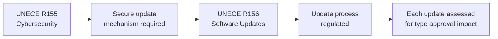
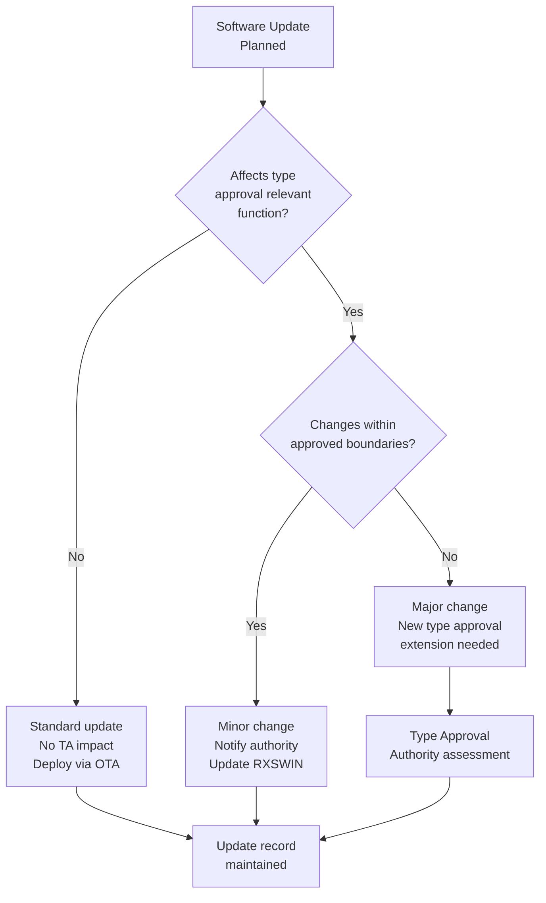
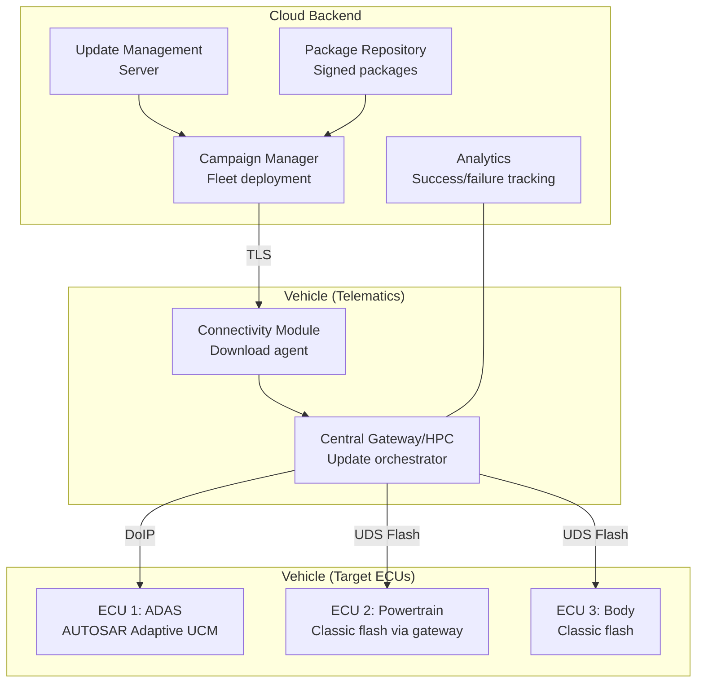
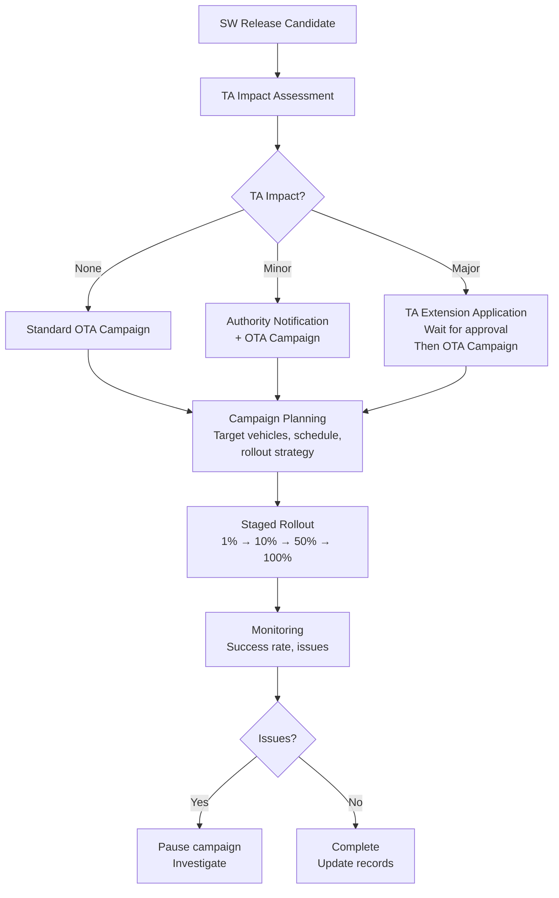
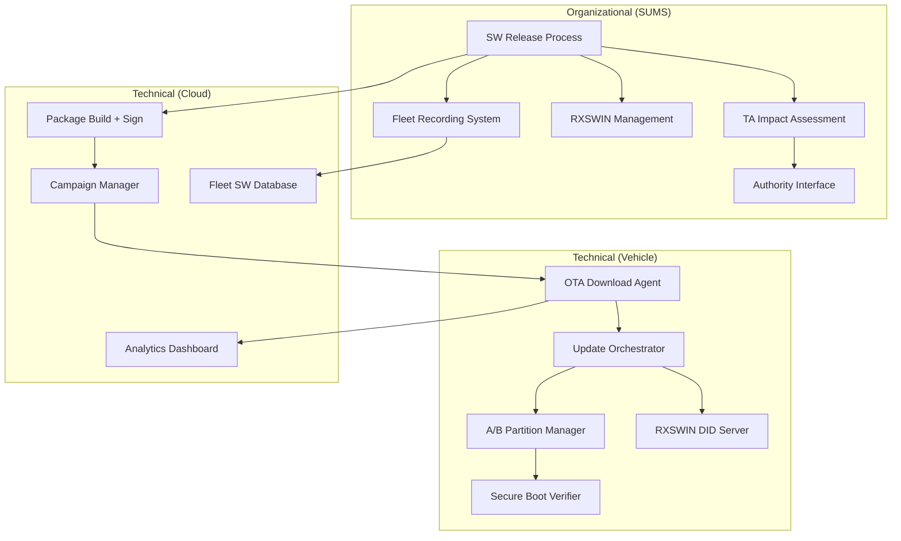
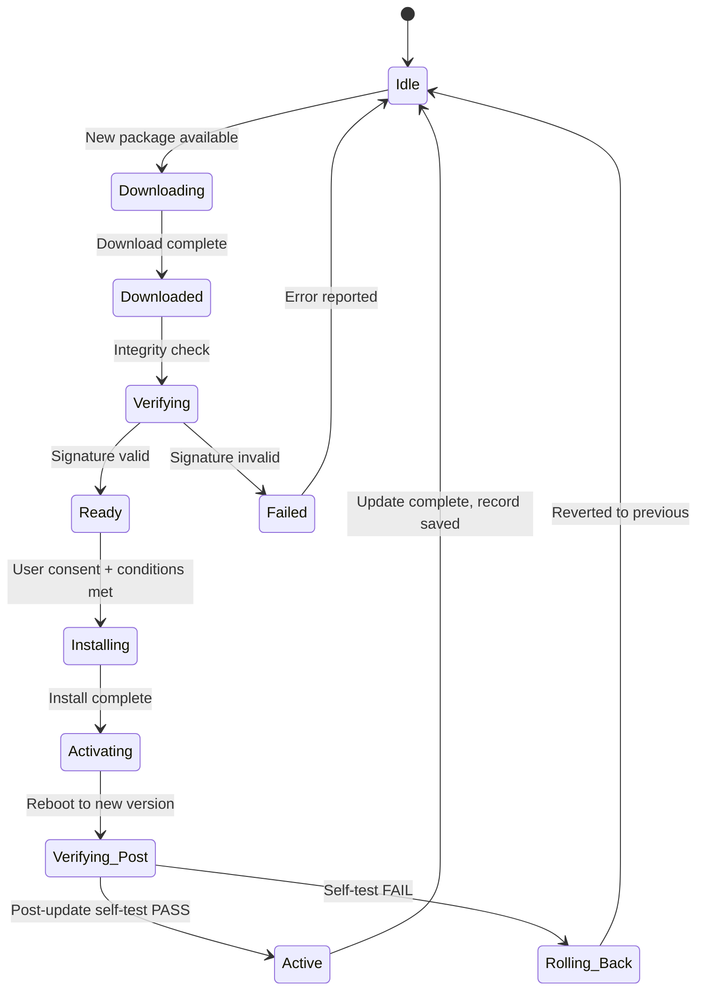
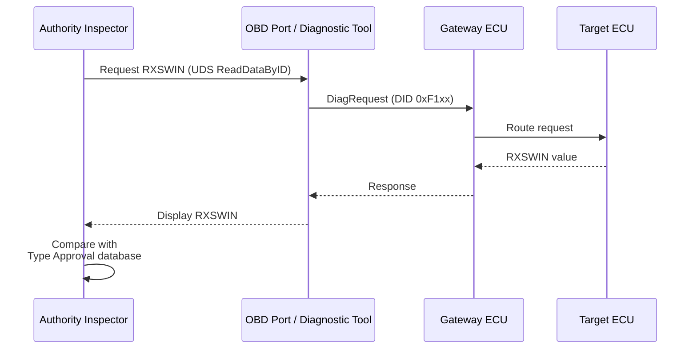

# UNECE R156 — Software Update Management System (SUMS)

**Topic:** UNECE Regulation No. 156 — Vehicle Software Update Management and OTA Type Approval  
**Standard:** UNECE R156 (UN Regulation on software updates and software update management systems)  
**SDO:** UNECE WP.29 / GRVA  
**Audience:** OTA platform architects, software update managers, type approval engineers, system engineers  
**Prerequisites:** Vehicle E/E architecture, AUTOSAR Adaptive (UCM), UNECE R155 basics

---

## Chapter 1 — Historical Context & Origin Story

### 1.1 Why Regulate Software Updates?

| Concern | Description |
|---------|-------------|
| Safety impact | Software update could affect safety-critical functions (braking, steering) |
| Type approval integrity | Vehicle approved with SW version A → update to version B may invalidate approval |
| Consumer protection | OTA update could degrade performance or remove features |
| Security | Update mechanism itself is an attack vector |
| Traceability | Which software version is running? Is it approved? |

### 1.2 Key Events Driving R156

| Year | Event | Impact |
|------|-------|--------|
| 2015 | Tesla enables Autopilot via OTA | Capability change without re-approval |
| 2018 | Tesla reduces battery capacity via OTA | Consumer rights concern |
| 2019 | BMW subscription features (heated seats) | Regulatory questions about post-sale changes |
| 2020 | Multiple OEMs doing OTA for safety recalls | Efficiency vs. regulatory oversight |
| 2021 | R156 adopted — OTA now regulated | Framework established |

### 1.3 R156 and R155 Relationship



---

## Chapter 2 — Standard Architecture & Structure

### 2.1 R156 Two-Pillar Structure (Similar to R155)

| Pillar | Scope | Certificate |
|--------|-------|-------------|
| **SUMS** | Organizational processes for managing software updates | SUMS Certificate (valid 3 years) |
| **Vehicle Type Approval** | Per vehicle type — SW identification, update capability | RX Software Type Approval |

### 2.2 SUMS Requirements

| Requirement | Description |
|-------------|-------------|
| SW identification | Unique identification of vehicle software configuration |
| Update validation | Process to validate updates don't affect safety/security/type approval |
| Update execution | Secure, reliable update mechanism |
| Recording | Record which SW version installed on which vehicle |
| Rollback | Ability to revert if update fails |
| User information | Inform vehicle owner about updates |
| Safety assessment | Evaluate safety impact before deployment |
| Regulatory assessment | Determine if update affects type approval |

### 2.3 Software Version Identification (RXSWIN)

**RXSWIN** = Regulatory X Software Identification Number

| Concept | Description |
|---------|-------------|
| RXSWIN | Unique identifier for type-approved software configuration |
| Purpose | Identify which software version is type-approved for which function |
| Scope | Covers all regulation-relevant software (safety, emissions, cybersecurity) |
| Reading | Must be readable electronically (UDS service, OBD) |

---

## Chapter 3 — Technical Deep Dive

### 3.1 Update Classification per R156



### 3.2 Type Approval Relevant Functions

| Regulation | Function | Impact of SW Change |
|-----------|----------|---------------------|
| R155 | Cybersecurity | Security posture change |
| R79 | Steering | ADAS steering behavior |
| R13/R13-H | Braking | ABS/ESC/AEB behavior |
| R83/R154 | Emissions | Engine/powertrain calibration |
| R157 | ALKS (Level 3) | Automated driving behavior |
| EU 2019/2144 | General Safety | ADAS function behavior |

### 3.3 OTA Update Technical Architecture



### 3.4 Update Integrity and Security

| Security Measure | Purpose |
|-----------------|---------|
| Package signing (PKI) | Ensure package from legitimate OEM |
| Hash verification | Detect corruption during download |
| Encryption | Protect IP in transit |
| Version control | Prevent rollback to vulnerable version |
| Authentication | Only authorized users/systems can trigger update |
| Secure boot | Verify installed software integrity at boot |

### 3.5 Update Safety Requirements

| Requirement | Implementation |
|-------------|----------------|
| Safe state during update | Vehicle immobilized or update only when parked |
| Partial update protection | A/B partition — never corrupt running system |
| Rollback on failure | Automatic revert to previous working version |
| User consent | Owner must approve (or at least be informed) |
| Timing restrictions | Don't interrupt safety-critical operation |
| Post-update verification | Self-test after update to confirm functionality |
| Dependency management | Update ECU B only after ECU A update verified |

---

## Chapter 4 — Implementation Guide

### 4.1 SUMS Implementation Steps

| Phase | Activities |
|-------|-----------|
| **1. Process Design** | Define SW update lifecycle process, roles, tools |
| **2. RXSWIN Scheme** | Define how RXSWIN is structured and maintained |
| **3. Classification Process** | Decision tree for update TA impact assessment |
| **4. Technical Platform** | OTA infrastructure, security, A/B partitioning |
| **5. Recording System** | Database linking VIN ↔ SW version ↔ RXSWIN |
| **6. Communication** | Customer notification, consent management |
| **7. Authority Interface** | Process to notify/apply for TA when needed |

### 4.2 RXSWIN Design Principles

```
Format example: RXSWIN = <OEM_ID>-<VehicleType>-<Function>-<Version>

Example: 
  ABC-EV23-ADAS-v2.3.1   (ADAS function SW version)
  ABC-EV23-EMIS-v1.8.0   (Emissions-relevant calibration)
  ABC-EV23-CSEC-v3.0.2   (Cybersecurity configuration)
```

**Requirements for RXSWIN:**
- Unique per regulation-relevant SW configuration
- Readable via diagnostic services (UDS 0x22 DID)
- Traceable to specific SW components and versions
- Updated whenever TA-relevant SW changes

### 4.3 Campaign Management Process



---

## Chapter 5 — Certification & Audit

### 5.1 SUMS Assessment Criteria

| Criterion | Assessor Checks |
|-----------|----------------|
| Process completeness | All SUMS requirements addressed in documented processes |
| RXSWIN scheme | Unique, readable, traceable identification |
| Impact classification | Clear decision process for TA impact |
| Security | Update mechanism secure (per R155) |
| Safety | Safe state during update, rollback capability |
| Recording | VIN-to-SW version tracking operational |
| User communication | Information/consent processes defined |
| Authority interface | Process to notify/apply when TA affected |

### 5.2 Evidence Required

| Document | Content |
|----------|---------|
| SUMS process description | Complete lifecycle process for SW updates |
| RXSWIN specification | Schema definition, assignment process |
| Impact assessment procedure | Decision tree, examples |
| Technical architecture | OTA system architecture, security measures |
| Test evidence | Update process testing (including failure scenarios) |
| Recording system | Demo of VIN ↔ SW version tracking |
| Rollback test evidence | Proven ability to revert failed updates |

---

## Chapter 6 — Regional & Domain Variants

### 6.1 Regional Adoption

| Region | Regulation | Status |
|--------|-----------|--------|
| EU | UNECE R156 | Mandatory (same timeline as R155) |
| Japan | UNECE R156 | Adopted |
| Korea | UNECE R156 | Adopted |
| China | GB/T 40429-2021 | National standard (similar requirements) |
| USA | No equivalent regulation | OTA unregulated (NHTSA oversight for recalls) |

### 6.2 OTA in Different Vehicle Segments

| Segment | OTA Capability | R156 Impact |
|---------|---------------|-------------|
| Premium (Tesla, BMW, Mercedes) | Full OTA (all ECUs) | Full SUMS required |
| Mass market (VW, Toyota) | Partial OTA (infotainment + telematics + some ECUs) | SUMS for capable vehicles |
| Commercial vehicles | Growing (fleet efficiency) | Applicable to N-category |
| Motorcycles | Limited | Not yet in scope |

---

## Chapter 7 — Comparison: OTA Approaches

| Aspect | Tesla | Traditional OEM | AUTOSAR UCM |
|--------|-------|-----------------|-------------|
| Update frequency | Weekly-monthly | Quarterly-annually | As designed |
| Scope | Full vehicle | Selective ECUs | UCM Master + Clients |
| User consent | Minimal (scheduled) | Full consent required | Configurable |
| Safety measures | Park + WiFi | Workshop or home | A/B + verification |
| Rollback | Automatic | Manual at workshop | UCM state machine |
| TA compliance | Under scrutiny | Designed for R156 | Standard mechanism |
| Campaign management | Fully automated | Manual + automated | API-defined |

---

## Chapter 8 — Mermaid Architecture Diagrams

### 8.1 R156 Compliance Architecture



### 8.2 Update State Machine



### 8.3 RXSWIN Reading Flow



---

## Chapter 9 — Case Studies & Failure Analysis

### 9.1 Tesla Battery Capacity Reduction (2019)

**Event:** Tesla reduced battery capacity of certain Model S/X vehicles via OTA update (claimed for safety/longevity reasons).

**R156 relevance:**
- Under R156: this would require assessment — does capacity reduction affect type-approved range?
- If range was part of type approval documentation → update affects TA → authority notification needed
- Consumer rights: owner must be informed of performance-affecting updates

**Lesson:** R156 creates accountability for OTA changes that affect type-approved characteristics.

### 9.2 Failed OTA Bricking Vehicles

**Event:** (Industry composite) OTA update interrupted during installation → ECU in inconsistent state → vehicle immobilized.

**Root cause:** Update mechanism overwrote running partition (no A/B design). Power loss during flash → corrupted bootloader.

**R156 requirement:** Vehicle must remain safe and functional (or at least recoverable) even if update fails.

**Technical fix:**
- A/B partitioning mandatory for critical ECUs
- Bootloader never updated in normal flow (golden image)
- If update fails → automatic rollback to known-good partition
- Post-update self-test before declaring success

---

## Chapter 10 — Future Evolution & Industry Trends

| Trend | R156 Impact |
|-------|-------------|
| Continuous deployment (weekly updates) | Need streamlined assessment process (not full TA per update) |
| Feature-on-demand (subscription features) | Are feature activations "software updates" per R156? |
| AI model updates | ML model update = software update? Validation challenge |
| Third-party apps | OEM responsibility for app store updates? |
| Autonomous driving (L4) | ODD expansion via OTA → major TA change |
| V2X certificate updates | Security credential updates = SW update? |
| Digital twin verification | Validate update in digital twin before fleet deployment |

---

## Chapter 11 — Interview Questions & Career Guide

### Tier 1: Entry-Level (0-3 years)

**Q1:** What is UNECE R156 and what problem does it solve?  
**A:** R156 regulates how vehicles receive software updates, especially over-the-air (OTA). Problem it solves: vehicles are type-approved with specific software. If OEM updates software after production, the new software might: affect safety (changed braking behavior), affect emissions (different engine calibration), affect type-approved features. Without regulation: OEM could change vehicle behavior post-sale without oversight. R156 requires: (1) OEM has SUMS (Software Update Management System) — certified processes, (2) each software configuration has unique ID (RXSWIN), (3) before update: assess if it affects type approval, (4) if yes: notify or get approval from authority, (5) track which software is on which vehicle.

### Tier 2: Mid-Level (3-8 years)

**Q2:** Design the RXSWIN scheme for a BEV with ADAS functions, powertrain control, and infotainment.  
**A:** RXSWIN structure: hierarchical, covering all regulation-relevant functions: (1) **Scheme design:** RXSWIN format: `<OEM>-<Platform>-<RegDomain>-<Version>`. Separate RXSWIN per regulation domain because they change independently. (2) **RXSWIN assignments:** `MYOEM-BEV24-ADAS-3.2.1` (covers AEB/LKA/ACC — R79, R13-H, EU GSR). `MYOEM-BEV24-EMIS-1.0.0` (BMS calibration affecting range — R154, WLTP). `MYOEM-BEV24-CSEC-2.1.0` (cybersecurity configuration — R155). `MYOEM-BEV24-ALKS-1.1.0` (if Level 3 — R157). (3) **Not RXSWIN:** Infotainment version — not regulation-relevant (no RXSWIN needed, but still tracked internally). (4) **Reading:** All RXSWIN accessible via UDS ReadDataByIdentifier (specific DIDs allocated per RXSWIN). Gateway responds even if individual ECU is offline (cached in gateway NvM). (5) **Update process:** Any change to software contributing to an RXSWIN → assessment process triggered. Minor version (patch): typically no TA impact (bug fix within approved behavior). Major version: likely TA impact → authority notification or extension.

### Tier 3: Senior/Lead (8-15 years)

**Q3:** Your OEM wants to do monthly ADAS function updates. How do you design the R156 process to support this cadence without delays?  
**A:** Key challenge: monthly release cycle vs. authority assessment time. Strategy: (1) **Pre-approved change space:** Define with authority upfront: "ADAS changes within these boundaries don't require re-approval." Boundaries: performance improvement within spec (e.g., better detection at same ODD), bug fixes that don't change function behavior, parameter tuning within approved range. Changes outside boundaries = full assessment. (2) **Classification automation:** Build automated tool that assesses: what changed? Which functions affected? Does it cross pre-approved boundary? Decision: auto-notify (minor) or flag-for-assessment (major). (3) **Authority relationship:** Proactive engagement: share development roadmap with TA authority quarterly. Agree on assessment scope/depth for different change categories. Build trust: transparent reporting of all changes (even minor). (4) **Technical architecture:** RXSWIN major version = TA-relevant change (requires assessment). RXSWIN minor version = within pre-approved space (notification only). Clear separation in build system: which components contribute to RXSWIN? (5) **Evidence automation:** CI/CD pipeline auto-generates: change impact report, test coverage diff, performance regression results. This evidence package submitted to authority electronically. (6) **Staged rollout as evidence:** Deploy to 1% → monitor 48h → 10% → monitor → full fleet. Monitoring data becomes evidence of safe update.

### Tier 4: Principal/Distinguished (15+ years)

**Q4:** How should R156 evolve for fully autonomous vehicles that need continuous ODD expansion via software updates?  
**A:** Autonomous vehicles receiving ODD expansion OTA = fundamentally new capability added post-sale. This breaks current R156 model: (1) **Current problem:** L4 vehicle approved for ODD-A (highway only). OEM wants to expand to ODD-B (urban) via OTA. This is equivalent to a new type approval — not a "software update." Current R156 not designed for this scale of change. (2) **Proposed framework:** "Capability certification" — separate from vehicle type. Vehicle hardware certified as platform. Each software capability (ODD) certified independently. Capability update = new capability certificate, not new vehicle TA. Think: app store model with certification. (3) **Validation at scale:** Each ODD expansion needs validation evidence. Can't require physical testing for every update → accept simulation + fleet data as evidence. Statistical safety argument: fleet data shows performance in new ODD meets safety target. Real-time monitoring confirms continued performance. (4) **Dynamic type approval:** Move from static ("this vehicle is approved with this software") to dynamic ("this vehicle currently meets these requirements"). Continuous compliance attestation rather than point-in-time certificate. Vehicle regularly reports health/conformity status. Authority can query fleet status. (5) **Liability and rollback:** If ODD expansion causes incident: automatic ODD contraction (revert to proven ODD). Vehicle capability degrades gracefully. OEM must demonstrate rollback capability for every expansion. (6) **International challenge:** ODD valid in Germany may not be valid in Italy (different infrastructure). Need: geographically-aware capability management. R156 would need to address cross-border ODD validity.

---

## Chapter 12 — Cheat Sheet & Quick Reference

### R156 Key Requirements Summary

```
SUMS (Organizational):
□ Software update process documented
□ RXSWIN scheme defined
□ TA impact classification process
□ Update security (per R155)
□ Recording system (VIN ↔ SW version)
□ User notification/consent process
□ Rollback capability ensured
□ Authority notification interface

Vehicle Type Approval:
□ RXSWIN readable via diagnostics
□ All regulation-relevant SW identified
□ Update mechanism secure and reliable
□ Safety during update (parked, rollback)
□ Post-update verification
```

### Update TA Impact Decision

```
Does update change regulation-relevant function?
├── No → Deploy (record update)
├── Yes → Does it stay within approved boundaries?
│   ├── Yes → Notify authority + Deploy (update RXSWIN minor)
│   └── No → Apply for TA extension (update RXSWIN major)
│       └── Wait for approval → Then deploy
```

### Key Differences: R155 vs R156

```
R155 = Security OF the update mechanism
R156 = Management of the update PROCESS

R155: "Is the update channel secure?" (signing, encryption, authentication)
R156: "Is the update content appropriate?" (safety, compliance, recording)

Both required. R155 is prerequisite for R156.
```

---

*End of Document — 06_UNECE_R156_SOTA.md*
