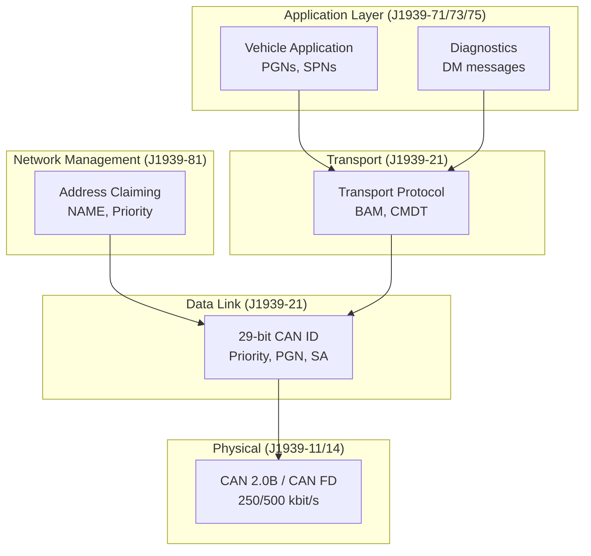
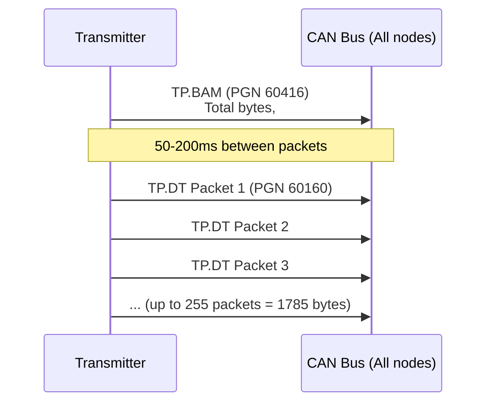
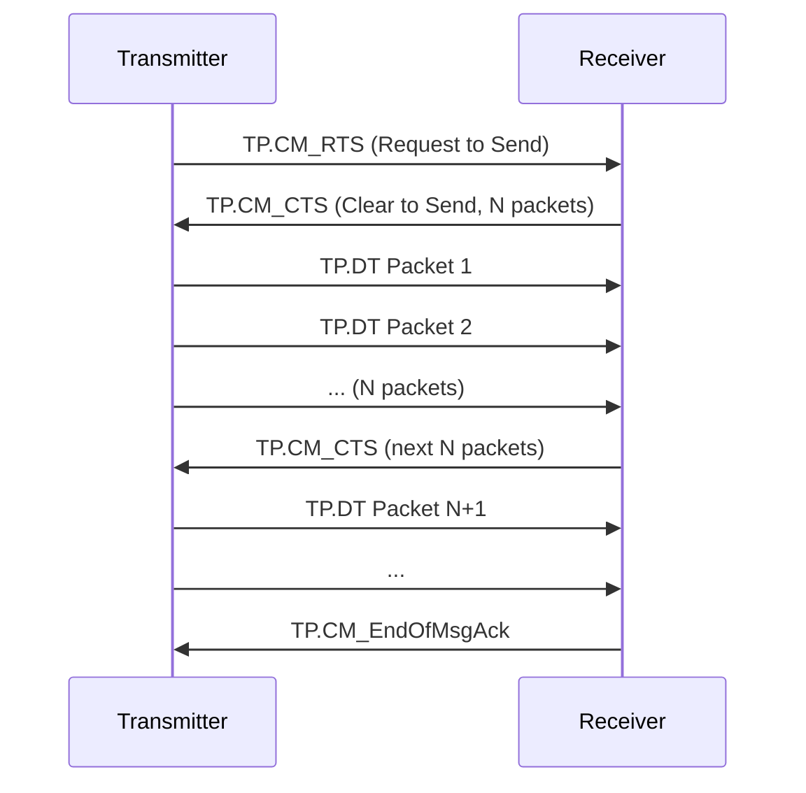
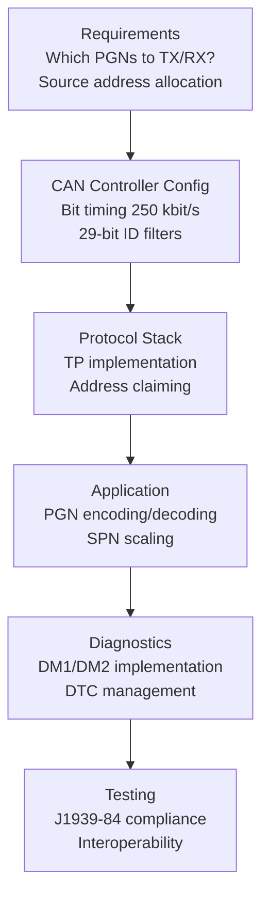
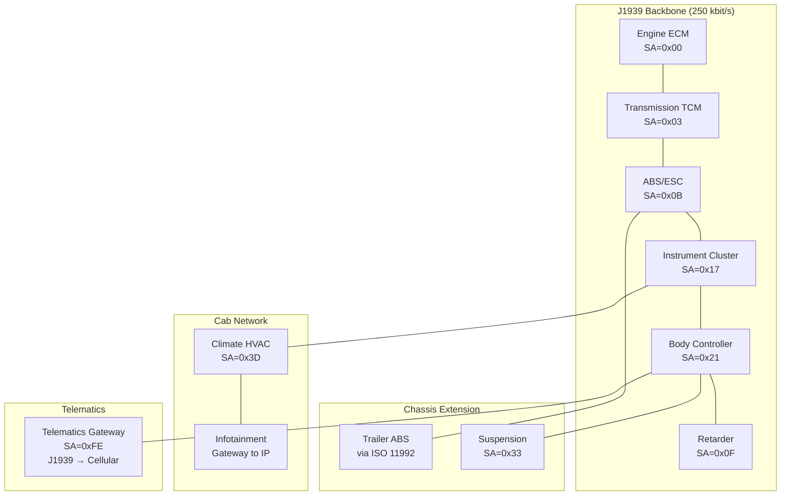
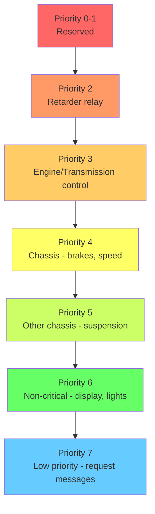
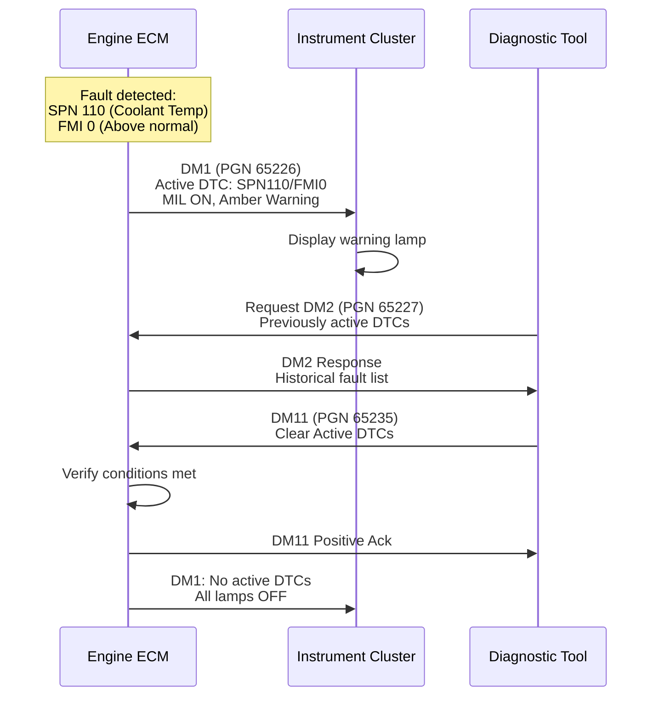

# SAE J1939 — Heavy-Duty Vehicle Network Protocol

**Topic:** SAE J1939 — Serial Control and Communications Heavy Duty Vehicle Network  
**Standard:** SAE J1939 (multi-part standard)  
**SDO:** SAE International (Society of Automotive Engineers)  
**Audience:** Commercial vehicle engineers, fleet telematics developers, ECU integrators, diagnostic tool developers  
**Prerequisites:** CAN bus fundamentals (ISO 11898), basic networking concepts, embedded systems

---

## Chapter 1 — Historical Context & Origin Story

### 1.1 Evolution Timeline

| Year | Standard | Significance |
|------|----------|-------------|
| 1986 | SAE J1708 | Serial communications for trucks (RS-485 based) |
| 1990 | SAE J1587 | Application layer on J1708 (PID-based messaging) |
| 1994 | SAE J1939 initial | CAN-based networking for heavy-duty vehicles |
| 1998 | J1939-71 | Vehicle application layer standardized |
| 2001 | J1939-73 | Diagnostics standardized |
| 2006 | J1939-21 | Transport protocol refinement |
| 2010 | J1939-76 | Security (authentication) added |
| 2016 | J1939/14 | Physical layer for 500 kbit/s CAN FD |
| 2019 | J1939-22 | Transport protocol for CAN FD (larger payloads) |
| 2023+ | J1939 DA updates | Continuous SPN/PGN additions |

### 1.2 Why J1939?

**Problem solved:** Heavy-duty vehicles (trucks, buses, construction, agriculture) from multiple OEMs with components from dozens of suppliers → need standard communication protocol.

**Key design goals:**
- Plug-and-play between different OEM components
- Support multi-drop CAN (up to 30 nodes)
- Handle large data transfers (diagnostic, calibration)
- Prioritized message arbitration for real-time data
- Self-configuring network (address claiming)

### 1.3 Market Penetration

| Domain | J1939 Usage |
|--------|-------------|
| On-highway trucks | Universal (North America, global) |
| Buses/coaches | Standard |
| Construction equipment | Standard (ISO 11783 variant for agriculture) |
| Marine engines | Adopted via NMEA 2000 (J1939-based) |
| Generator sets | Common |
| Military vehicles | Adopted (MIL-STD variants) |

---

## Chapter 2 — Standard Architecture & Structure

### 2.1 J1939 Document Family

| Document | Title | Content |
|----------|-------|---------|
| J1939 | Top-level overview | Architecture description |
| J1939-11 | Physical layer (250 kbit/s) | Twisted pair, connector, termination |
| J1939-14 | Physical layer (500 kbit/s) | CAN FD physical layer |
| J1939-15 | Reduced physical layer | Lower-cost reduced-wire implementations |
| J1939-21 | Data link layer | 29-bit identifier, transport protocol |
| J1939-22 | Transport protocol for CAN FD | Extended data handling |
| J1939-31 | Network layer | Bridge, router, gateway |
| J1939-71 | Vehicle application layer | PGNs and SPNs for vehicle data |
| J1939-73 | Application layer — Diagnostics | DM messages (DTC management) |
| J1939-75 | Application layer — Generator sets | Power generation specific |
| J1939-76 | Security | Authentication mechanisms |
| J1939-81 | Network management | Address claiming protocol |
| J1939-84 | Compliance verification | Testing methodology |
| J1939 DA | Digital Annex | Complete SPN/PGN database |

### 2.2 Protocol Stack



---

## Chapter 3 — Technical Deep Dive

### 3.1 29-Bit CAN Identifier Structure

```
┌─────────────────── 29-bit CAN Identifier ───────────────────┐
│ Priority │ Reserved │ Data Page │    PGN     │ Source Address │
│  3 bits  │  1 bit   │   1 bit   │  16 bits   │    8 bits     │
└──────────┴──────────┴───────────┴────────────┴───────────────┘

PGN breakdown (PDU Format ≥ 240 = broadcast):
  PGN = PDU Format (8 bits) + PDU Specific/Group Extension (8 bits)

PGN breakdown (PDU Format < 240 = peer-to-peer):
  PGN = PDU Format (8 bits) + Destination Address (8 bits)
```

### 3.2 Parameter Group Number (PGN) System

| PGN (Decimal) | Name | Content | Rate |
|---------------|------|---------|------|
| 61444 (0xF004) | Electronic Engine Controller 1 (EEC1) | Engine speed, torque, mode | 10-100 ms |
| 65265 (0xFEF1) | Cruise Control/Vehicle Speed (CCVS) | Vehicle speed, cruise status | 100 ms |
| 65262 (0xFEEE) | Engine Temperature 1 (ET1) | Coolant temp, fuel temp | 1000 ms |
| 65263 (0xFEEF) | Engine Fluid Level/Pressure (EFL/P) | Oil pressure, coolant level | 500 ms |
| 65269 (0xFEF5) | Ambient Conditions (AMB) | Barometric pressure, air temp | 1000 ms |
| 65279 (0xFEFF) | Water in Fuel Indicator (WFI) | Water contamination warning | 1000 ms |
| 65226 (0xFECA) | DM1 — Active DTCs | Currently active fault codes | 1000 ms |
| 65227 (0xFECB) | DM2 — Previously Active DTCs | Stored historical faults | On request |

### 3.3 Suspect Parameter Number (SPN) System

| SPN | Name | Length | Resolution | Range |
|-----|------|--------|------------|-------|
| 190 | Engine Speed | 2 bytes | 0.125 rpm/bit | 0 — 8031.875 rpm |
| 84 | Wheel-Based Vehicle Speed | 2 bytes | 1/256 km/h/bit | 0 — 250.996 km/h |
| 110 | Engine Coolant Temperature | 1 byte | 1°C/bit | -40 — 210°C (offset -40) |
| 91 | Percent Accelerator Position | 1 byte | 0.4%/bit | 0 — 100% |
| 92 | Percent Engine Load | 1 byte | 1%/bit | 0 — 125% |
| 513 | Actual Engine Torque | 1 byte | 1%/bit | -125 — 125% (offset -125) |

### 3.4 Transport Protocol (J1939-21)

For messages > 8 bytes (CAN 2.0B limit):

**BAM (Broadcast Announce Message):**



**CMDT (Connection Mode Data Transfer) — Peer-to-peer:**



### 3.5 Address Claiming (J1939-81)

| Field | Size | Purpose |
|-------|------|---------|
| Identity Number | 21 bits | Unique serial number |
| Manufacturer Code | 11 bits | SAE-assigned manufacturer ID |
| ECU Instance | 3 bits | Multiple same-function ECUs |
| Function Instance | 5 bits | Instance of function |
| Function | 8 bits | ECU function (engine, transmission, brakes) |
| Vehicle System | 7 bits | System category |
| Vehicle System Instance | 4 bits | Instance |
| Industry Group | 3 bits | On-highway, agriculture, marine, etc. |
| Arbitrary Address Capable | 1 bit | Can negotiate address |

**Claiming process:**
1. ECU sends Address Claimed message (PGN 60928) with its NAME
2. If conflict → ECU with lower NAME value wins
3. Loser must claim different address (if arbitrary capable) or go offline

---

## Chapter 4 — Implementation Guide

### 4.1 ECU Development with J1939



### 4.2 Minimal J1939 Node Implementation

| Component | Requirement |
|-----------|-------------|
| CAN controller | 29-bit extended frame support |
| Baud rate | 250 kbit/s (standard) or 500 kbit/s (J1939-14) |
| NAME | Unique 64-bit identifier configured |
| Address claiming | Respond to address claim, handle conflicts |
| Receive filters | Accept PGNs needed by application |
| Transmit scheduling | Periodic PGN transmission at specified rates |
| Transport protocol | If any PGN > 8 bytes (BAM and/or CMDT) |
| DM1 | Active DTC broadcast (mandatory for all controllers) |

### 4.3 J1939 Gateway to Automotive CAN

| Challenge | Solution |
|-----------|----------|
| 250 kbit/s ↔ 500 kbit/s | Dual CAN controller gateway |
| J1939 PGN → UDS mapping | Protocol translation for diagnostics |
| 29-bit → 11-bit | ID translation table |
| Multi-frame → ISO-TP | TP.CM/DT → ISO 15765-2 segmentation |

---

## Chapter 5 — Certification & Audit

### 5.1 J1939-84 Compliance Verification

| Test Category | Purpose |
|---------------|---------|
| Physical layer | Bus voltage, timing, termination |
| Data link timing | Bit rate tolerance, stuff bits |
| Address claiming | Correct behavior, conflict resolution |
| Transport protocol | BAM/CMDT correct implementation |
| PGN content | Correct SPN encoding, scaling, range |
| Diagnostics (DM messages) | DTC format, lamp status, clearing |
| Network management | Address claim startup sequence |

### 5.2 Testing Tools

| Tool | Vendor | Capability |
|------|--------|-----------|
| CANalyzer/CANoe | Vector | Full J1939 simulation, analysis |
| PCAN-Explorer | PEAK | J1939 decode, transmit |
| DG Technologies DPA5 | DG | OEM-level diagnostics |
| Kvaser | Kvaser | Hardware + J1939 library |
| Cummins INSITE | Cummins | Engine-specific diagnostics |
| JPRO | Noregon | Multi-OEM truck diagnostics |

---

## Chapter 6 — Regional & Domain Variants

### 6.1 J1939 Variants by Industry

| Industry Group | Standard | Notes |
|---------------|----------|-------|
| On-highway trucks | SAE J1939 | Baseline standard |
| Agriculture | ISO 11783 (ISOBUS) | J1939-based with extensions |
| Marine | NMEA 2000 | J1939-based with marine PGNs |
| Construction | SAE J1939 | Same as on-highway |
| Military | MIL-STD-1553 / J1939 | J1939 for logistics vehicles |
| Power generation | J1939-75 | Generator-specific PGNs |
| Fire/rescue | J1939 + NFPA 1901 | Emergency vehicle extensions |

### 6.2 Regional Differences

| Region | Requirement |
|--------|-------------|
| North America | EPA/CARB requires J1939 DM messages for emissions diagnostics |
| Europe | Heavy vehicles use J1939 + FMS (Fleet Management System) standard |
| Brazil | PROCONVE L-7 requires J1939 for emissions compliance |
| China | GB/T 27930 (charging) uses J1939-based protocol for commercial EVs |

---

## Chapter 7 — Comparison: Heavy Vehicle Protocols

| Aspect | J1939 | J1708/J1587 | CAN (ISO 11898) | Automotive Ethernet |
|--------|-------|-------------|-----------------|---------------------|
| Data rate | 250 kbit/s (500 CAN FD) | 9.6 kbit/s | 500 kbit/s | 100 Mbit/s+ |
| Identifier | 29-bit (PGN-based) | MID (8-bit) | 11 or 29-bit | IP-based |
| Max payload | 8 bytes (1785 with TP) | ~21 bytes | 8/64 bytes | MTU 1500+ |
| Physical | Twisted pair | Twisted pair | Twisted pair | Twisted pair/fiber |
| Topology | Bus (multidrop) | Bus | Bus | Star/point-to-point |
| Addressing | 254 addresses | 256 MIDs | CAN ID | IP address |
| Domain | Heavy-duty | Legacy heavy-duty | Passenger vehicles | Next-gen all |
| Transport protocol | BAM/CMDT | Multi-section messages | ISO-TP (15765-2) | TCP/UDP |

---

## Chapter 8 — Mermaid Architecture Diagrams

### 8.1 Typical Heavy-Duty Vehicle J1939 Network



### 8.2 J1939 Message Priority System



### 8.3 DM Message Diagnostic Flow



---

## Chapter 9 — Case Studies & Failure Analysis

### 9.1 Fleet Telematics Integration

**Scenario:** Major fleet operator wants real-time fuel consumption from 10,000 mixed-brand trucks.

**J1939 Solution:**
- Telematics device connected to J1939 backbone
- Reads PGN 65266 (Fuel Economy) → SPN 183 (Fuel Rate), SPN 184 (Instantaneous Fuel Economy)
- Also reads PGN 65248 (Total Vehicle Distance) → SPN 245
- Transmits via cellular to fleet management cloud

**Challenge:** Different OEMs implement different SPNs. Some use proprietary PGNs for additional data.

**Solution:** FMS standard (Fleet Management System) — subset of J1939 PGNs guaranteed by all European truck OEMs (Daimler, Volvo, Scania, MAN, DAF).

### 9.2 Address Conflict in Multi-Trailer Configuration

**Problem:** Trailer ABS modules from two trailers have same default address (0x2B). When second trailer connected → address conflict.

**Root cause:** Manufacturer programmed same default address without arbitrary address capable bit set.

**Fix:** 
- Set arbitrary address capable bit in NAME
- Implement proper address claiming with negotiation
- Losing ECU picks from preferred address list
- Document: J1939-81 compliance is mandatory for multi-trailer

---

## Chapter 10 — Future Evolution & Industry Trends

| Trend | J1939 Impact |
|-------|-------------|
| Electrification (BEV/FCEV trucks) | New PGNs for battery, motor, charging (J1939-75A) |
| CAN FD adoption | J1939-22 transport over 64-byte frames |
| Ethernet backbone | J1939-over-Ethernet tunneling for bandwidth |
| Autonomous trucking | Extended sensor data → exceeds J1939 bandwidth |
| Platooning (V2V) | J1939 extension for cooperative control |
| Cybersecurity | J1939-76 authentication + R155 compliance |
| Predictive maintenance | ML on J1939 data streams (fleet analytics) |
| 48V mild-hybrid trucks | New SPN/PGN for hybrid energy management |

---

## Chapter 11 — Interview Questions & Career Guide

### Tier 1: Entry-Level (0-3 years)

**Q1:** How is a J1939 CAN identifier different from standard automotive CAN?  
**A:** Standard automotive CAN (ISO 11898) uses 11-bit identifiers (2048 possible), prioritized by ID value. J1939 uses 29-bit extended identifier, structured as: (1) **Priority (3 bits):** 0=highest to 7=lowest. Controls arbitration. (2) **Reserved + Data Page (2 bits):** Extends PGN space. (3) **PDU Format (8 bits):** Determines if broadcast (≥240) or peer-to-peer (<240). (4) **PDU Specific (8 bits):** Group Extension (broadcast) or Destination Address (P2P). (5) **Source Address (8 bits):** Who sent this message (0x00-0xFD). Together PDU Format + PDU Specific = PGN (Parameter Group Number). Unlike automotive CAN where ID is just a priority/identifier, J1939 ID carries semantic meaning: who sent what to whom at what priority.

### Tier 2: Mid-Level (3-8 years)

**Q2:** Implement multi-frame message reception for a J1939 node (explain transport protocol handling).  
**A:** Multi-frame reception (BAM — Broadcast): (1) **Receive TP.BAM (PGN 60416):** Extract: total message size, number of packets, target PGN. Allocate reception buffer for total size. Start timeout timer (750ms between packets). (2) **Receive TP.DT (PGN 60160) packets:** Each packet: sequence number (1-255) + 7 bytes data. Store data at offset = (seq_num - 1) × 7. Track received packet count. (3) **Completion:** When all packets received → reassemble → deliver to application as complete PGN. (4) **Timeout handling:** If 750ms without next packet → abort, discard partial data. For CMDT (peer-to-peer) additionally: send CTS (Clear to Send) to control flow, send EndOfMsgAck when complete, handle abort scenarios. Implementation pitfalls: must handle multiple simultaneous TP sessions (different source addresses), buffer management for memory-constrained MCUs, re-assembly ordering (packets may not arrive in perfect sequence in gateway scenarios, though typically they do on single bus).

### Tier 3: Senior/Lead (8-15 years)

**Q3:** Design a J1939 cybersecurity solution for a truck fleet considering J1939-76 and practical constraints.  
**A:** J1939-76 defines authentication for J1939 messages but has practical challenges: (1) **Threat model:** Physical CAN bus access (maintenance port, compromised ECU, trailer connector). Attacks: spoofed engine commands, fake brake requests, tampered odometer. (2) **J1939-76 approach:** Authentication PGN appended to protected PGN. HMAC-based (256-bit key, truncated MAC). Key distribution via secure provisioning. Challenge: 8-byte CAN frame limit → MAC adds overhead → bandwidth impact. (3) **Practical architecture:** Not all PGNs can be authenticated (bandwidth constraint). Prioritize: safety-critical (torque request, brake command), security-sensitive (diagnostic commands), tamper-evident (odometer, hours). Separate authentication domain per trust boundary. (4) **Key management:** Pre-shared keys per ECU pair (complex for multi-vendor). Alternative: group keys per priority class. Key rotation: at service interval (practical constraint). Hardware: HSM in each ECU (cost impact at scale). (5) **Fleet constraint:** Mixed fleet = old ECUs without J1939-76. Gateway-based approach: security gateway validates at boundary. Trailer interface: mutual authentication before accepting trailer brake commands. (6) **Monitoring overlay:** Even without full authentication, IDS on J1939 bus: detect anomalous message rates, unexpected source addresses, out-of-range SPN values. Alert fleet operator via telematics.

### Tier 4: Principal/Distinguished (15+ years)

**Q4:** J1939 was designed in the 1990s. What should its successor architecture look like for 2030+ trucks?  
**A:** J1939's limitations for future trucks: bandwidth (250 kbit/s), security (no native protection), addressing (254 nodes), payload (8 bytes). (1) **Hybrid architecture:** Keep J1939 for legacy compatibility (powertrain, chassis — proven, certified). Add Ethernet backbone (10GBASE-T1) for new functions (ADAS, autonomous, telematics). Gateway translates between domains. Gradual migration over 10-15 year vehicle lifecycle. (2) **Service-oriented communication:** Replace PGN publish/subscribe with SOME/IP or DDS. Dynamic service discovery instead of static address book. Better fit for autonomous driving (variable sensor configs). (3) **Security by design:** TLS/DTLS for Ethernet segments. SecOC (AUTOSAR) for remaining CAN segments. Zero-trust: every ECU authenticates, no implicit trust based on bus membership. PKI infrastructure for certificate management. (4) **Bandwidth allocation:** Deterministic Ethernet (TSN — IEEE 802.1) for real-time control. Best-effort Ethernet for diagnostics, updates, infotainment. J1939-over-Ethernet for legacy PGN compatibility during transition. (5) **Standardization path:** Extend J1939 Digital Annex to include Ethernet-native PGNs. Collaborate with AUTOSAR Adaptive for platform abstraction. Maintain backward compatibility: J1939 physical bus available for legacy trailer/implement connection for 20+ years.

---

## Chapter 12 — Cheat Sheet & Quick Reference

### CAN ID Decode (29-bit)

```
Example: 0x18FEF100
Binary: 000 1 1 00011111 11101111 00010001 00000000

Priority:     0x06 (Priority 6 — non-critical)
Reserved:     0
Data Page:    0
PDU Format:   0xFE (254 ≥ 240 → Broadcast)
PDU Specific: 0xF1 (Group Extension)
Source Addr:  0x00 (Engine #1)
PGN:          0xFEF1 = 65265 (CCVS — Vehicle Speed)
```

### Common PGNs (Must Know)

```
PGN 61444  (0xF004) = EEC1 (Engine Speed, Torque)
PGN 65265  (0xFEF1) = CCVS (Vehicle Speed)
PGN 65262  (0xFEEE) = ET1  (Coolant/Fuel Temp)
PGN 65263  (0xFEEF) = EFL/P (Oil Pressure)
PGN 65226  (0xFECA) = DM1  (Active DTCs)
PGN 65227  (0xFECB) = DM2  (Previously Active DTCs)
PGN 60928  (0xEE00) = Address Claimed
PGN 59904  (0xEA00) = Request PGN
PGN 65280  (0xFF00) = Proprietary B (OEM-specific)
```

### DTC Structure (DM1/DM2)

```
DTC = SPN (19 bits) + FMI (5 bits) + OC (7 bits)
  SPN: Suspect Parameter Number (which component)
  FMI: Failure Mode Identifier (what's wrong)
  OC:  Occurrence Count (how many times)

Common FMI values:
  0 = Data valid but above normal range
  1 = Data valid but below normal range
  2 = Data erratic/intermittent
  3 = Voltage above normal
  4 = Voltage below normal
  5 = Current below normal
  6 = Current above normal
  7 = Mechanical system not responding
  12 = Bad intelligent device
  14 = Special instructions
  31 = Condition exists (generic)
```

### Transport Protocol Quick Reference

```
BAM (Broadcast):
  TP.BAM PGN = 60416 (0xEC00) — announces transfer
  TP.DT  PGN = 60160 (0xEB00) — data packets
  Max: 1785 bytes (255 × 7)
  Timing: 50-200ms between packets

CMDT (Peer-to-Peer):
  RTS  = Request to Send
  CTS  = Clear to Send (flow control)
  DT   = Data Transfer (same PGN as BAM)
  EOM  = End of Message Acknowledgment
  Abort = Connection abort
```

---

*End of Document — 07_SAE_J1939_Heavy_Vehicle.md*
