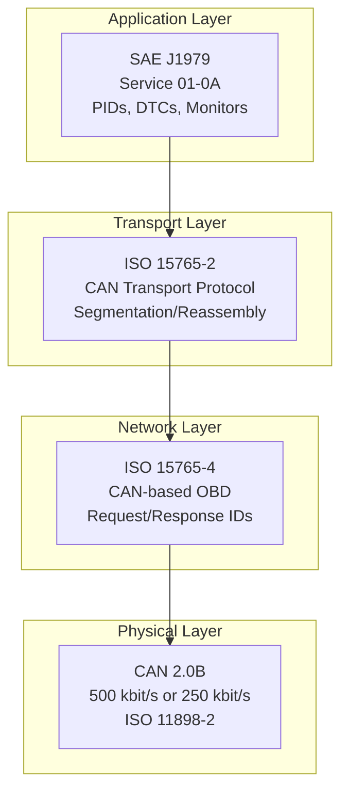
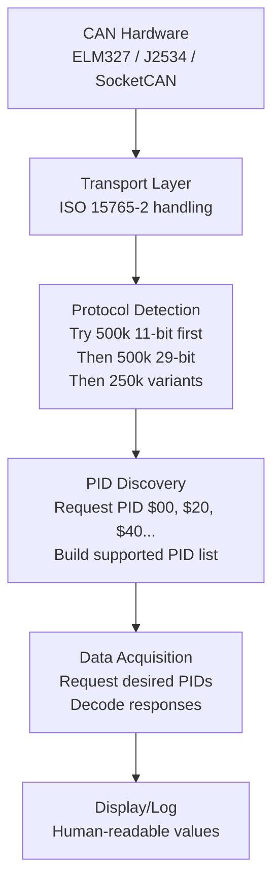
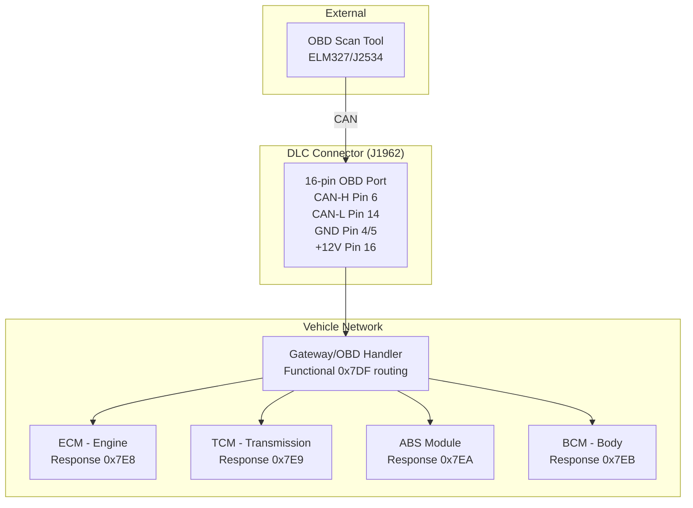
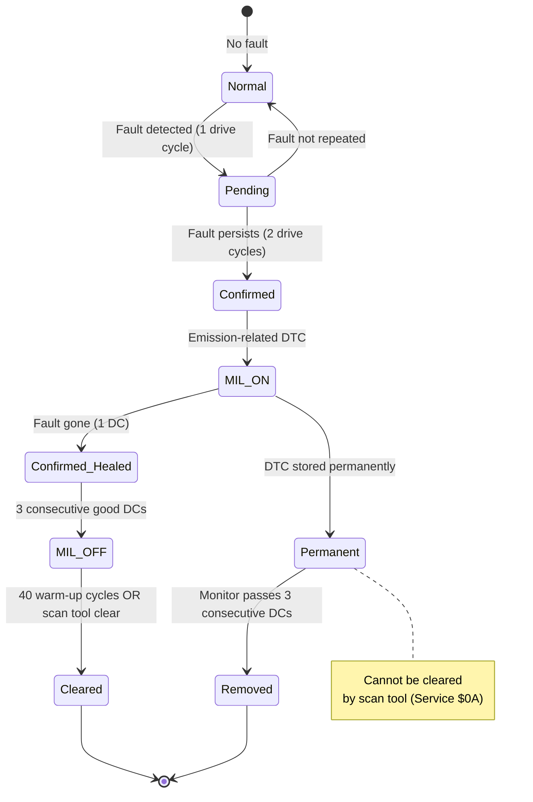
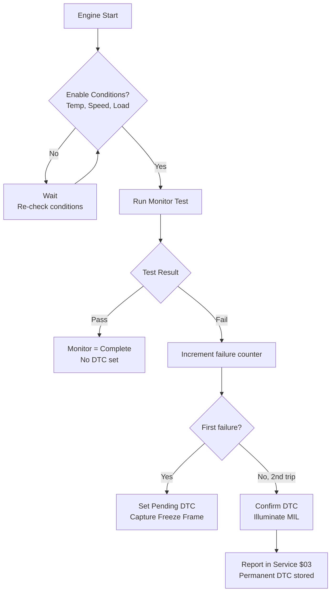

# SAE J1979 — On-Board Diagnostics (OBD-II)

**Topic:** SAE J1979 — E/E Diagnostic Test Modes (OBD-II Scan Tool Protocol)  
**Standard:** SAE J1979 / ISO 15031-5 (international equivalent)  
**SDO:** SAE International / ISO TC 22/SC 31  
**Audience:** Automotive diagnostic engineers, emissions system developers, aftermarket tool developers, vehicle inspectors  
**Prerequisites:** CAN bus basics, ISO 15765 (CAN transport), basic automotive emissions knowledge

---

## Chapter 1 — Historical Context & Origin Story

### 1.1 Timeline of OBD Regulation

| Year | Event | Significance |
|------|-------|-------------|
| 1968 | California mandates PCV valve | First emission control requirement |
| 1970 | US Clean Air Act | EPA established, emission limits set |
| 1980 | GM introduces basic OBD | First on-board diagnostics (OBD-I), manufacturer-specific |
| 1988 | CARB mandates OBD-I for California | Standardized MIL (check engine light) |
| 1994 | CARB OBD-II regulation effective | Standardized connector, protocols, DTCs |
| 1996 | US federal OBD-II mandatory | All US passenger vehicles must comply |
| 2001 | EU adopts EOBD (Euro OBD) | European equivalent (Euro 3 + diesel) |
| 2005 | SAE J1979 updated for CAN | CAN replaces older protocols as primary |
| 2008 | CAN-only OBD mandatory (US) | Legacy protocols (J1850, ISO 9141) phased out |
| 2013 | China OBD (GB 18352.5) | China Phase 5 emissions with OBD |
| 2020 | WWH-OBD (ISO 27145) | World-wide harmonized OBD for heavy-duty |
| 2022+ | OBD for EVs being defined | Monitor battery degradation, thermal management |

### 1.2 Why OBD-II Exists

**Problem solved:** Before OBD-II:
- Every manufacturer had proprietary diagnostic connectors and protocols
- Emission system failures went undetected (no MIL)
- Inspection stations couldn't verify emission compliance
- Aftermarket tools needed manufacturer-specific adapters

**OBD-II provides:**
- Universal 16-pin DLC (Diagnostic Link Connector)
- Standardized communication protocols
- Standardized PIDs (Parameter IDs)
- Standardized DTCs (Diagnostic Trouble Codes)
- Mandatory emissions monitoring
- Readiness monitors to verify system checked

---

## Chapter 2 — Standard Architecture & Structure

### 2.1 Related Standards

| Standard | Content |
|----------|---------|
| SAE J1979 | Diagnostic test modes (services) |
| SAE J1962 | DLC connector specification (16-pin) |
| SAE J2012 | DTC definitions and format |
| SAE J2178 | Message strategy |
| ISO 15031-5 | Emission-related diagnostics (= J1979) |
| ISO 15031-6 | DTC definitions (= J2012) |
| ISO 15765-4 | CAN-based OBD transport |
| ISO 14230-4 | KWP2000-based OBD (legacy) |
| ISO 9141-2 | K-line-based OBD (legacy) |
| SAE J1850 | PWM/VPW protocols (legacy GM/Ford) |

### 2.2 OBD-II Protocol Stack



### 2.3 DLC (Data Link Connector) Pinout

```
          ┌─────────────────────────────┐
Pin:       1  2  3  4  5  6  7  8  9 10 11 12 13 14 15 16
          └─────────────────────────────┘

Key pins:
  Pin 4:  Chassis Ground
  Pin 5:  Signal Ground  
  Pin 6:  CAN-High (ISO 15765-4)
  Pin 7:  K-Line (ISO 9141-2 / ISO 14230-4) [legacy]
  Pin 14: CAN-Low (ISO 15765-4)
  Pin 16: Battery Positive (permanent 12V)
  Pin 2:  J1850 Bus+ (SAE J1850 PWM/VPW) [legacy]
  Pin 10: J1850 Bus- (SAE J1850 PWM) [legacy]
```

---

## Chapter 3 — Technical Deep Dive

### 3.1 OBD-II Service Modes (SAE J1979)

| Service (Mode) | Name | Purpose |
|---------------|------|---------|
| **$01** | Current Data | Read real-time sensor values |
| **$02** | Freeze Frame Data | Snapshot data at DTC occurrence |
| **$03** | Read DTCs (Confirmed) | Emissions-related confirmed faults |
| **$04** | Clear DTCs | Clear fault codes and reset monitors |
| **$05** | Oxygen Sensor Monitoring | O2 sensor test results |
| **$06** | Non-Continuous Monitor Results | Test results with limits |
| **$07** | Pending DTCs | DTCs from current drive cycle |
| **$08** | Control Operation | Actuator tests (limited) |
| **$09** | Vehicle Information | VIN, calibration ID, ECU name |
| **$0A** | Permanent DTCs | Cannot be cleared by scan tool |

### 3.2 Service $01 — Key PIDs

| PID | Name | Formula | Unit |
|-----|------|---------|------|
| 0x00 | PIDs supported [01-20] | Bitmask | — |
| 0x04 | Calculated Engine Load | A × 100/255 | % |
| 0x05 | Engine Coolant Temperature | A - 40 | °C |
| 0x0C | Engine RPM | (256A + B) / 4 | rpm |
| 0x0D | Vehicle Speed | A | km/h |
| 0x0F | Intake Air Temperature | A - 40 | °C |
| 0x10 | MAF Air Flow Rate | (256A + B) / 100 | g/s |
| 0x11 | Throttle Position | A × 100/255 | % |
| 0x1C | OBD Standard (compliance type) | Encoded | — |
| 0x1F | Run time since engine start | 256A + B | seconds |
| 0x2F | Fuel Tank Level | A × 100/255 | % |
| 0x31 | Distance since DTC cleared | 256A + B | km |
| 0x42 | Control module voltage | (256A + B) / 1000 | V |
| 0x46 | Ambient Air Temperature | A - 40 | °C |
| 0x5C | Engine Oil Temperature | A - 40 | °C |

### 3.3 CAN Request/Response IDs

| Parameter | 11-bit CAN ID | 29-bit CAN ID |
|-----------|---------------|---------------|
| Scan tool request (functional) | 0x7DF | 0x18DB33F1 |
| ECU #1 response | 0x7E8 | 0x18DAF100 |
| ECU #2 response | 0x7E9 | 0x18DAF101 |
| ECU #3 response | 0x7EA | 0x18DAF102 |
| Specific request to ECU #1 | 0x7E0 | 0x18DA00F1 |

### 3.4 Message Format Example

**Request: Read Engine RPM (Service $01, PID $0C)**

```
CAN ID: 0x7DF (functional broadcast to all ECUs)
Data:   02 01 0C 00 00 00 00 00
        │  │  │
        │  │  └── PID 0x0C (Engine RPM)
        │  └───── Service 01 (Current Data)
        └──────── Number of additional bytes (2)
```

**Response: Engine RPM = 3000 rpm**

```
CAN ID: 0x7E8 (ECU #1 response)
Data:   04 41 0C 2E E0 00 00 00
        │  │  │  │  │
        │  │  │  └──┘── Data bytes: A=0x2E, B=0xE0
        │  │  └──────── PID 0x0C
        │  └─────────── Service 01 + 0x40 (positive response)
        └────────────── Number of additional bytes (4)

Calculation: RPM = (256 × 0x2E + 0xE0) / 4 = (256×46 + 224)/4 = 12000/4 = 3000 rpm
```

### 3.5 Readiness Monitors

| Monitor | Type | What It Checks |
|---------|------|---------------|
| Misfire | Continuous | Engine misfiring detection |
| Fuel System | Continuous | Fuel trim out of range |
| Comprehensive Component | Continuous | Sensor rationality |
| Catalyst | Non-continuous | Catalytic converter efficiency |
| Heated Catalyst | Non-continuous | Heated cat performance |
| Evaporative System | Non-continuous | Fuel vapor leak detection |
| Secondary Air | Non-continuous | Secondary air injection |
| A/C Refrigerant | Non-continuous | A/C system |
| Oxygen Sensor | Non-continuous | O2 sensor response |
| Oxygen Sensor Heater | Non-continuous | O2 heater circuit |
| EGR/VVT System | Non-continuous | EGR flow / VVT operation |

**Monitor readiness logic:**
- Each monitor runs when specific "enable conditions" are met (temperature, speed, load)
- Monitor reports "Complete" or "Not Complete"
- Inspection stations check: all applicable monitors must be "Complete" and "Pass"
- After DTC clear ($04): all monitors reset to "Not Complete"

### 3.6 DTC Format (SAE J2012)

```
DTC Format: PXXXX or CXXXX or BXXXX or UXXXX

First character:
  P = Powertrain
  C = Chassis
  B = Body
  U = Network/Communication

Second character (digit):
  0 = SAE/ISO standardized
  1 = Manufacturer-specific
  2 = SAE/ISO (extended)
  3 = SAE/ISO and manufacturer

Third character:
  1 = Fuel and Air Metering
  2 = Fuel and Air Metering (injector)
  3 = Ignition System
  4 = Auxiliary Emission Controls
  5 = Vehicle Speed / Idle Control
  6 = Computer Output Circuits
  7 = Transmission
  8 = Transmission

Last two digits: Specific fault number

Example: P0301 = Cylinder 1 Misfire Detected
         P = Powertrain
         0 = SAE standard
         3 = Ignition system
         01 = Cylinder 1
```

---

## Chapter 4 — Implementation Guide

### 4.1 OBD-II ECU Implementation Requirements

| Requirement | Detail |
|-------------|--------|
| Support Service $01 | At minimum PIDs 00, 01, 1C |
| Support Service $03 | Report confirmed emission DTCs |
| Support Service $04 | Allow clearing DTCs (if conditions met) |
| Support Service $07 | Report pending DTCs |
| Support Service $09 | Report VIN (PID 02) |
| Support PID $00 | Report which PIDs are supported (bitmask) |
| Response timing | < 50ms for single-frame responses |
| MIL control | Illuminate on confirmed emission DTC |
| Readiness monitors | Implement all applicable monitors |
| Freeze frame | Capture data at first DTC occurrence |

### 4.2 Scan Tool Development



### 4.3 Common Implementation Pitfalls

| Issue | Root Cause | Fix |
|-------|-----------|-----|
| No response from ECU | Wrong baud rate or CAN ID | Auto-detect protocol (ISO 15765-4) |
| Partial PID support | Not all ECUs support all PIDs | Check PID $00 bitmask first |
| Multi-ECU responses | Functional request → all ECUs respond | Handle multiple responses |
| Multi-frame response | Service $09 VIN > 8 bytes | Implement ISO-TP (flow control) |
| Negative response | Service/PID not supported | Handle 0x7F negative response |

---

## Chapter 5 — Certification & Audit

### 5.1 OBD-II Compliance Testing

| Test | Standard | Purpose |
|------|----------|---------|
| Monitor performance ratio | CARB requirements | Monitors must run frequently enough |
| In-Use Monitor Performance | SAE J1699 | Verify monitors detect real faults |
| Emission threshold detection | EPA/CARB | Detect when emissions exceed 1.5× standard |
| Communication conformance | SAE J1699 | Verify protocol implementation |
| DTC response verification | SAE J1699 | Correct DTC reporting |

### 5.2 Inspection Programs Using OBD

| Country/State | Program | Pass Criteria |
|--------------|---------|---------------|
| California (US) | BAR Smog Check | MIL off + monitors ready + no DTCs |
| Federal US (most states) | IM240 / OBD check | Similar to CA |
| UK | MOT test | OBD check since 2012 (diesel 2014) |
| Germany | AU/HU (TÜV) | OBD check for Euro 6+ |
| Japan | Shaken inspection | OBD check since 2021 |
| China | Annual inspection | OBD since 2019 (Phase 6) |

---

## Chapter 6 — Regional & Domain Variants

### 6.1 Regional OBD Requirements

| Region | Regulation | Key Differences |
|--------|-----------|-----------------|
| US (EPA/CARB) | CFR Title 40, Part 86 | Most stringent, CARB leads |
| EU (EOBD) | EU 2018/1832 | Based on J1979, Euro 6d compliance |
| China | GB 18352.6-2016 (Phase 6) | Aligned with Euro 6 + additional monitors |
| India | BS-VI (OBD-II equivalent) | Based on Euro 6, since 2020 |
| Brazil | PROCONVE L-7 | Aligned with Euro 6, J1939 for heavy-duty |

### 6.2 OBD Variants

| Standard | Scope |
|----------|-------|
| OBD-II (SAE J1979) | Light-duty vehicles (US/global) |
| EOBD | European OBD (same protocol, different thresholds) |
| JOBD | Japanese OBD |
| KOBD | Korean OBD |
| WWH-OBD (ISO 27145) | World-wide harmonized OBD (heavy-duty, newer light-duty) |
| HD-OBD | Heavy-duty OBD (US, J1939-based) |

---

## Chapter 7 — Comparison: Diagnostic Protocols

| Aspect | OBD-II (J1979) | UDS (ISO 14229) | WWH-OBD (ISO 27145) | J1939-73 |
|--------|---------------|-----------------|---------------------|----------|
| Purpose | Emissions compliance | Full vehicle diagnostics | Harmonized emission OBD | HD vehicle diagnostics |
| Scope | Emission-related only | All systems | Emission-related | All HD systems |
| Services | 10 modes ($01-$0A) | 26 services (0x10-0x3E) | Extended OBD services | DM messages |
| DTC format | 5-char (P0XXX) | 3-byte (DTC + status) | Extended (6-byte) | SPN + FMI |
| Vehicle type | Light-duty | All | All (primary HD) | Heavy-duty |
| Access | Standardized (anyone) | Many functions restricted | Standardized | Standardized |
| Security | No security layer | Security Access (0x27) | Basic | J1939-76 |

---

## Chapter 8 — Mermaid Architecture Diagrams

### 8.1 OBD-II Communication Architecture



### 8.2 DTC Lifecycle State Machine



### 8.3 Monitor Execution Flow



---

## Chapter 9 — Case Studies & Failure Analysis

### 9.1 VW Dieselgate — OBD System Manipulation

**Event (2015):** Volkswagen programmed diesel ECUs to detect OBD test conditions (steady-state, specific speed/load patterns) and activate full emissions controls only during tests.

**How it worked:**
- ECU detected: wheels spinning but steering wheel stationary → likely dyno test
- During test: EGR active, SCR active, full DPF regen → low NOx
- Normal driving: reduced EGR, lean NOx trap bypassed → up to 40× NOx limit
- OBD monitors reported "Pass" because monitors ran during "test mode"

**R155/OBD regulatory response:**
- CARB/EPA increased in-use testing (PEMS — Portable Emissions Measurement)
- Real Driving Emissions (RDE) testing (Euro 6d)
- ISO 27145 (WWH-OBD) includes anti-tampering provisions
- OBD monitors must also pass during real-world driving patterns

### 9.2 Aftermarket Tuning vs. OBD Compliance

**Problem:** Aftermarket ECU tune increases power but may cause emission monitor failures.

**Technical conflict:**
- Tune modifies fuel maps, ignition timing, boost pressure
- OBD monitors have learned thresholds based on stock calibration
- Modified values trigger DTCs (P0172 rich, P0300 misfire, P0420 catalyst)
- Tuners often reprogram OBD thresholds or disable monitors

**Legal consequence:**
- Disabling OBD monitors = federal crime (US Clean Air Act)
- EPA enforcement actions against aftermarket tune companies
- CARB Executive Orders required for legal modifications

---

## Chapter 10 — Future Evolution & Industry Trends

| Trend | OBD Impact |
|-------|-----------|
| BEV/FCEV (no emissions) | OBD for battery health, thermal management, HV safety |
| Remote OBD (cellular) | Connected diagnostics, predictive maintenance |
| OBD-III (remote monitoring) | CARB proposed: vehicle reports compliance remotely |
| Cybersecurity (R155) | OBD port as attack vector → secure access needed |
| Right to Repair | OBD data access debate (OEM vs. aftermarket) |
| Extended Vehicle (ExVe) | OEM server as diagnostics gateway (vs. direct OBD) |
| AI-based diagnostics | ML on OBD data for predictive fault detection |
| V2I inspection | Vehicle broadcasts compliance status to roadside |

### 10.1 OBD for Electric Vehicles

| Proposed EV OBD Parameters |
|---------------------------|
| Battery State of Health (SOH) |
| Battery State of Charge (SOC) |
| Cell voltage imbalance |
| Thermal management status |
| Isolation resistance (HV safety) |
| Charging system efficiency |
| Regenerative braking performance |
| Motor/inverter temperature |

---

## Chapter 11 — Interview Questions & Career Guide

### Tier 1: Entry-Level (0-3 years)

**Q1:** What is OBD-II and what are the 10 service modes?  
**A:** OBD-II (On-Board Diagnostics, 2nd generation) is a US/global standard requiring vehicles to monitor emission-related systems, report faults via standardized protocol, and illuminate MIL (Malfunction Indicator Lamp / check engine light). Mandatory in US since 1996, EU since 2001. 10 services: $01 = live sensor data (RPM, speed, temp, MAF), $02 = freeze frame (snapshot at fault), $03 = confirmed DTCs, $04 = clear DTCs + reset monitors, $05 = oxygen sensor monitoring, $06 = non-continuous monitor test results with min/max, $07 = pending DTCs (single drive cycle fault), $08 = actuator control (limited), $09 = vehicle info (VIN, cal ID), $0A = permanent DTCs (can't be cleared by tool, only by ECU after repair confirmed).

**Q2:** How do you decode a DTC like P0420?  
**A:** P0420: **P** = Powertrain, **0** = SAE-standardized (not manufacturer-specific), **4** = Auxiliary Emission Controls (catalyst, EGR), **20** = specific fault → "Catalyst System Efficiency Below Threshold (Bank 1)." This means: downstream O2 sensor activity too similar to upstream → catalyst isn't converting pollutants effectively. Set when catalyst monitor runs (specific temp/speed/load conditions) and efficiency metric fails threshold for 2 consecutive drive cycles.

### Tier 2: Mid-Level (3-8 years)

**Q3:** Design an OBD scan tool that supports multi-protocol detection per ISO 15765-4.  
**A:** Protocol detection sequence (per ISO 15765-4): (1) Try 500 kbit/s, 11-bit CAN ID: send 0x7DF [02 01 00] (request PID $00). Wait 50ms for response on 0x7E8-0x7EF. If response → 500k/11-bit confirmed. (2) If no response → try 500 kbit/s, 29-bit: send 0x18DB33F1 [02 01 00]. Wait for response on 0x18DAF1xx. (3) If no response → try 250 kbit/s, 11-bit. (4) If no response → try 250 kbit/s, 29-bit. (5) If still no response → try legacy protocols (ISO 9141-2 via K-line, J1850). Once protocol determined: read PID $00 response → bitmask of supported PIDs. Request PID $20 for next batch, $40, $60, etc. Build complete PID support table. Now tool knows protocol, baud rate, and which PIDs are available. Multi-ECU handling: functional request (0x7DF) may get responses from multiple ECUs. Track each ECU by response ID. For specific ECU queries, use physical addressing (0x7E0 for ECU1, etc.).

### Tier 3: Senior/Lead (8-15 years)

**Q4:** How would you architect the OBD compliance strategy for an OEM launching a new BEV platform in US, EU, and China?  
**A:** BEV OBD challenges: no tailpipe emissions but regulatory bodies still require OBD for certain functions. (1) **US (CARB):** CARB ZEV mandate defines OBD for BEVs: monitor battery/RESS degradation (SOH threshold), HV isolation, thermal management, electric motor, power electronics, charging system. Same MIL / DTC framework. Must support Service $01-$0A on CAN via OBD port. CARB defining new PIDs for EV-specific parameters. (2) **EU (Euro 7 draft):** Extends OBD to battery state of health monitoring. Requires reporting battery SOH to owner (transparency). OBD data accessible to independent workshops (right to repair). May require remote OBD (OBD-over-IP per ISO 20730). (3) **China (GB Phase 6B):** Similar to EU approach. Additional: data reporting to government monitoring platform (NEVMS). Real-time telemetry of battery data → not just OBD port. (4) **Implementation strategy:** Common diagnostic stack (UDS + OBD) across all regions. Region-specific calibration of monitor thresholds. Software-configurable PID support based on market variant. OBD port for legacy tools + remote diagnostics gateway for connected services. Cybersecurity: OBD port accessible to anyone physically → implement security for sensitive functions while keeping emission-related data accessible per regulation.

### Tier 4: Principal/Distinguished (15+ years)

**Q5:** The "Right to Repair" movement vs. OEM Extended Vehicle concept — how do you balance OBD data access, cybersecurity, and business models?  
**A:** Core tension: OBD port provides open access to vehicle data. This enables: aftermarket repair, independent diagnostics, telematics, insurance telemetry. But also: cyberattack vector, IP theft, unauthorized modification, data privacy risk. (1) **OEM Extended Vehicle (ExVe) position:** Route all diagnostic data through OEM cloud. Aftermarket gets API access (controlled, authenticated). OEM controls what data is shared and with whom. Justification: cybersecurity (per R155) requires controlling access points. (2) **Right to Repair position:** Direct OBD access must remain. Independent repair shops can't depend on OEM cloud. Vehicle owner owns their data. Open standards, not OEM gatekeeping. (3) **Balanced architecture:** Keep OBD-II port accessible for emission-mandated data (Services $01-$0A) — this is legally required. For enhanced diagnostics (reprogramming, adaptation, security-sensitive): require certificate-based authentication (like ISO 14229 0x29). For remote access: OEM platform with fair, non-discriminatory API access to authorized third parties. For raw data: vehicle owner can authorize third-party access via consent mechanism. (4) **Technical implementation:** Tiered access model: Tier 0 (public): emission data, VIN — anyone with OBD tool. Tier 1 (authenticated): enhanced diagnostics — registered repair shops (certificate). Tier 2 (authorized): security functions — OEM + authorized partners. Tier 3 (manufacturer): calibration, development — OEM engineers only. PKI infrastructure for certificate management. Revocation capability for compromised certificates. Audit trail for all access. (5) **Industry direction:** EU Data Act (2023) mandates vehicle data access rights. US state-level Right to Repair legislation expanding. CARB/EPA won't accept reduced OBD access (emission oversight). Compromise likely: standardized secure access framework (in development via ISO/SAE committees).

---

## Chapter 12 — Cheat Sheet & Quick Reference

### OBD-II Quick Decode Table

```
Service $01 (Live Data) Common PIDs:
  PID 04: Engine Load       = A × 100 / 255 [%]
  PID 05: Coolant Temp      = A - 40 [°C]
  PID 0C: Engine RPM        = (256A + B) / 4 [rpm]
  PID 0D: Vehicle Speed     = A [km/h]
  PID 0F: Intake Air Temp   = A - 40 [°C]
  PID 10: MAF Rate          = (256A + B) / 100 [g/s]
  PID 11: Throttle Position = A × 100 / 255 [%]
  PID 2F: Fuel Level        = A × 100 / 255 [%]
  PID 42: Module Voltage    = (256A + B) / 1000 [V]
```

### CAN IDs for OBD

```
Request (functional/broadcast): 0x7DF
Request (physical to ECU #1):   0x7E0
Response from ECU #1:           0x7E8
Response from ECU #2:           0x7E9
... (ECU N: request 0x7E0+N, response 0x7E8+N)
```

### DTC First Character

```
P = Powertrain (engine, transmission)
C = Chassis (ABS, steering, suspension)
B = Body (airbag, HVAC, lights)
U = Network (communication bus errors)
```

### Inspection Quick Check

```
1. Connect OBD tool → auto-detect protocol
2. Read Service $01, PID $01 → MIL status + monitor readiness
3. If MIL ON → read Service $03 (confirmed DTCs)
4. Check readiness monitors → all applicable = "Complete"?
5. If all monitors ready + MIL off + no DTCs → PASS
6. If monitors not ready → drive cycle needed
```

---

*End of Document — 08_SAE_J1979_OBD.md*
